# 第 5 章 移动设计模式

作为开发者，你们中的大多数人已经熟悉“设计模式”这个术语。对于开发者来说，设计模式指的是可以通过使用特定抽象解决方案来解决的特定软件或编程问题。然而，就本书的目的而言，我们将讨论与应用程序的设计和用户界面特别相关的设计模式。设计模式是解决常见设计问题的有用方法。它们是针对移动设计中遇到的挑战的有用且被普遍接受的 UI 解决方案。随着移动技术的发展，涌现出越来越多的模式来帮助设计师应对常见的设计挑战。在设计应用程序时，您无疑会遇到其中一些挑战。了解其他设计师如何找到独特且有时创新的解决方案来解决这些挑战，将有助于您设计应用程序，使您能够专注于功能，而不是重复发明轮子。由于移动设计模式是用户熟悉的被接受的**最佳实践**解决方案，您可以将其应用于您的应用程序，而无需过多担心用户是否熟悉它们。

在本章中，我们将介绍一些最流行的移动设计模式，并分解在实现它们时可以使用（或不使用）的元素。与所有设计元素一样，用户必须是焦点。如果一个模式不能让用户的生活更轻松，那么最好不要使用它。但请记住，您也可以根据自己的需要编辑和更改模式。因此，可以在您的应用程序中使用公认的设计模式并进行创新。使用设计模式可以将基本工具交到您手中，并让您能够为应对设计挑战建立一个起点。通过观察其他流行应用程序如何处理这种模式，将有助于您更好地了解如何在自己的应用程序中处理它。由于设计模式在移动生态系统中被普遍使用，它们通常被认为是平台无关的。因此，虽然本书以 iOS 设计为重点，但您会看到这些模式被用于原生应用和 Web 应用。这通常被认为是一件好事，因为模式使用得越广泛，所有用户都熟悉它的可能性就越大。从可用性的角度来看，这是一件好事。

有许多设计模式可供您使用，但在本章中，我们仅探讨那些流行且可能有帮助的模式。

**提示** 如果您对设计模式更感兴趣，建议购买一本专门讨论设计模式的书籍。在书中，您很可能会找到比此处列出的更详尽的列表。

### 注册与登录/注册表单

注册和注册表单通常是用户与您的应用程序的第一次接触。您的总体目标应该是让用户以最少的麻烦进入您的应用。保持登录和注册页面简洁，并使用与您应用程序的整体品牌形象和感觉相协调的颜色元素。即使这个页面主要是一个字段，您仍然可以赋予表单个性。有一点要记住：为用户提供登录选项。一些应用程序因为将 Facebook、Twitter 或其他社交媒体应用程序作为访问其应用的唯一方式而遭到了强烈的反对。请记住，某些用户可能不想将他们的社交媒体网络连接到您的应用，因此请提供其他选项，例如电子邮件；或者更好的是，借此机会向用户解释为什么您将社交媒体连接设置为唯一选项。

要牢记用户的隐私，只询问您绝对需要的信息。例如，如果您的应用程序是一个短信或 SMS 消息应用程序，您可能需要询问用户的电话号码。如果您的应用程序不需要这些信息，就跳过它。添加弹出窗口来解释每个必填项为什么是必需的以及它将如何使用，也是一个好主意。

您的注册或登录表单页面还应该包含一个引人注目的**行动号召按钮**。当然，“注册”或“报名”是标准标签，但这可以提供一个有趣的机会向客户展示您的创造力。垂直标签（略高于相应的表单字段）曾经很流行，但最近，尤其是随着应用程序为 iOS7 更新，它们已被直接放置在字段内的文本所取代。这对用户来说更容易，并且消除了屏幕上其他地方说明性文字的需要。

除非绝对必要，否则请将登录或注册过程限制在一个屏幕内，就像图 5-1 中的简单线框图所示的那样。移动用户是出了名的不耐烦，而且每个人都越来越注重隐私。因此，多页注册会适得其反；请保持简短，让用户尽可能简单地注册您的应用。

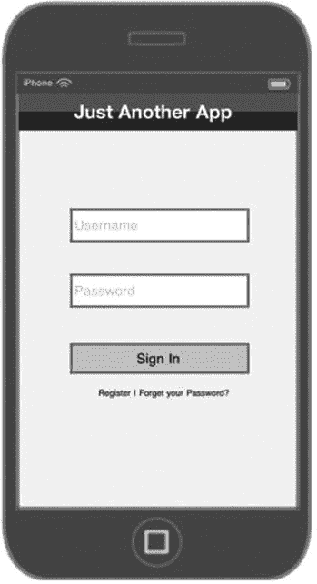

图 5-1. 设计模式中的简单登录或注册

### 应用导航

用户注册或报名使用您的应用程序后，他或她需要在应用程序中进行导航。这将是用户在应用中移动的主要方式。如果您做得很好，应用程序的导航不应该让用户猜测下一步该做什么；他们对应用的导航应该是直观且自然的。虽然注册和登录模式相对直接，但导航提供了更多选项，具体取决于应用的核心功能和目的。如果您探索过其他应用以寻求灵感，您会发现移动应用的导航方式几乎数不胜数。有些模式适用于特定应用，而另一些则随着 iOS 的发展而演变。下面列出了一些更流行的模式，如注册、主屏幕和图片库，但也有像滑出式导航这样的新模式不断涌现。iOS 仍然相对较新，随着设计师开始突破设计的界限，预计会有新的模式出现。因此，如果您的应用是一个社交媒体应用，用户将在特定的层级结构或好友与信息流中移动，您可能希望坚持使用流行应用中已有的设计模式。用户已经熟悉这些模式，并期望您遵循它们。

#### 主屏幕或主屏幕模式


#### Springboard 模式

在应用内导航最常用的设计模式之一便是 Springboard 模式。Springboard 是主页上由图标组成的网格，它能直观地让用户熟悉应用中所有的内容。它为用户从一个页面提供了应用中所有内容的高层级概览。Springboard 将是用户在加载应用并注册或登录后看到的第一个页面。它能让用户熟悉应用中的所有内容，并为他们提供情境。

你可以将 Springboard 页面视为一个用户会反复返回的主页，以便访问应用的其他区域。因此，你选择在 Springboard 上包含的信息至关重要。需要注意的是，Springboard 上可包含的图标数量限制在九个左右（取决于布局），因此，如果你要展示多个页面，请确保你的用户知道如何访问它们。

尽管我们特别提到了 iOS，但值得注意的是，Springboard 被认为是一种跨平台的导航方法，因为它可以轻松适配多种不同类型的设备和操作系统。图 5-2 展示了一个简单的 Springboard 模型示例。

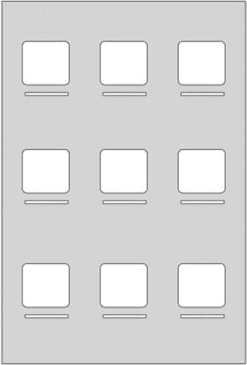

图 5-2. Springboard 设计模式的简单线框图

Springboard 设计模式有多种变体——这意味着，即使上面的模型展示的是网格布局，你也可以自由地自定义布局，使其与应用的外观和感觉保持一致。

抓住机会在 Springboard 的图标上发挥创意。图标将为你的用户提供上下文，因为每个图标将直观地代表应用内的一个独立功能。Springboard 是一种简单的方式，可以在一页上为用户提供大量信息，并且这将是用户首次接触到你应用的视觉语言。

有时 Springboard 可能不遵循常见的网格布局，图标可能比标准的九个图标布局更大或更小。确定最适合你用户的方式，以及与应用风格最匹配的方式，来为你自己确定最佳的 Springboard 布局。同样必须指出的是，随着更新、更具创新性的主屏幕模式的出现，用以展示主屏幕上的各种选项，Springboard 模式可能被视为有些过时了。

许多新闻应用，例如 CNN 和 TED，都采用了首页模式。其特点是在顶部有一个大面板，下方是列表视图，这是一种在应用主页上展示新闻的流行方式。

### 列表与表视图模式

另一种流行的移动导航方式是将所有内容放在一个列表菜单中。列表菜单非常适合拥有大量类别和内容的应用程序。它将显示在表视图中。列表菜单非常适合移动应用的部分原因在于，可滚动的列表易于用拇指或两根手指上下滑动。因此，就导航和可用性而言，列表菜单是赢家。列表菜单可以像 Springboard 菜单一样包含图标，这样用户也能在视觉上与应用的內容产生关联。

在 iOS 移动设备的界面中，列表菜单模式有多种变体。

你可以通过更改颜色或添加图像与图标来增强和自定义列表。但要注意不要做得太过，以免让用户迷失方向。

#### 表格

对于将展示大量数据的应用来说，表格是一种绝佳的信息展示方式。许多企业、生产力、银行和金融工具可能需要大量使用表格，因为它们需要以清晰易读且易于排序的方式列出信息。在设计应用时，你可以使用多种不同的表格。如果你要展示大量数据，并需要一种方法来区分它们，可以尝试更改颜色或在它们之间添加细微的差异。这将有助于用户在筛选所呈现的信息时保持清晰。

在为 iOS 设计时，可以将表格视为表视图的另一种说法。人机界面指南中明确概述了这个元素。

你可以对表格进行调整，使数据更易于用户接受。行和列的大小可以调整，你还可以考虑尝试使用字体大小来为用户分隔特定信息。例如，考虑使用标题和对行进行分组，以便于导航。

你还可以考虑进行视觉增强，例如添加图标以使表格中的数据更突出。最好不要在一个表格中使用太多不同的颜色，因此，与所有设计一样，保持你的表格配色方案与整体品牌一致。但是，如果你的应用属于特定类别，则应使用公认的最佳实践，例如在金融或资金管理应用中，用绿色表示正向现金流，红色表示负向现金流。用户会非常熟悉这些视觉元素，这将有助于提升应用的整体可用性。

对于信息量大的表格，固定列的设计模式会很有帮助。这种模式允许用户冻结左侧或右侧的单列，而其他列保持流动。用户随后可以根据需要随意调整和筛选信息。

#### 标签栏

你也可以选择为 iOS 应用添加标签栏导航。在 iOS 设备上，标签栏位于屏幕和设备的底部，但一些富有创意的设计师也设法将标签栏放在屏幕顶部。你可以在 iOS 应用中自定义标签栏，但具体细节请参考人机界面指南。例如，iPhone/iPod 的标签栏中只允许放置五个按钮。可以有更多按钮，但只是不会显示出来。iOS 会自动添加一个`更多`按钮，用户可以通过它访问其他按钮。从可用性的角度来看，用户在使用手机等小型设备时，用拇指就能轻松访问标签栏。

标签栏中的每个按钮都可以引用一个完全不同的视图，这些视图与应用中各种类型的信息相关。标签栏导航的便利性使得用户可以非常轻松地在它们之间来回切换，几乎不费什么力气。通过添加标签栏，用户将能够从一个页面高层面地了解应用的所有不同类别。

标签栏中的每个按钮通常都包含一个图标和一个标签，如 图 5-3 中的线框图所示。图标是传达信息的好方法；但由于标签栏中的图标彼此靠近，因此最好确保它们在视觉上对用户保持一致。如果一个按钮是以特定风格绘制或插图的，那么请确保所有其他按钮也都遵循相同的风格。你的用户会期待这一点。

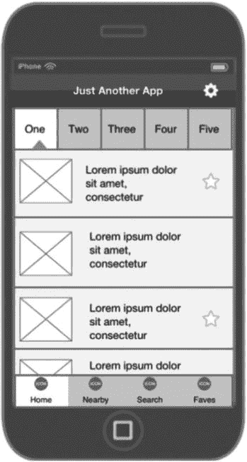

图 5-3. iOS 中的标签栏


#### 标签栏按钮

标签栏按钮必须具有不同的状态，这有助于用户理解何时激活了按钮并进入了该部分的视图。即使在 iOS 7 新的“浮动”标签栏中，你也需要像对待所有按钮一样，向用户提供反馈和视觉提示，以便他们知道栏中的按钮何时被激活。对于标签栏，这可以通过编程实现。

### 侧滑导航

最近，一种称为**侧滑导航**的新型移动设计模式已经出现。像 Facebook、iOS 版 Gmail 和 Path 等流行应用已使这种设计模式成为一种新标准。Facebook 在其原始 iOS 应用的重设计版本中引入了这种新模式，并迅速被其他应用采用。它由一个通过将主内容区域向右滑动而揭示的面板组成。然后，该主面板区域会揭示其下方的一个新列表视图，用户可以通过浏览该视图获取额外内容和视图。

侧滑导航可以通过点击应用左上角的列表按钮来显示或激活，然后通过再次点击同一按钮或用户向左或向右滑动来关闭。在某些应用中，如 iPhone 版 Gmail，该面板通过一个返回按钮启动。这对用户来说可能会造成混淆，因此最好坚持使用广泛使用的列表或菜单按钮。这个按钮通常以三或四条水平线为特征，有点像表格视图。请注意，当菜单按钮被激活时，面板和按钮都必须向右滑动并保持部分可见，以便用户在需要时能够快速撤销该操作。然而，点击新菜单中的某个项目将显示与该菜单项相关的内容，面板将完全消失以显示与该项目对应的内容。再次点击菜单按钮将重新显示面板。

侧滑导航解决方案并非适用于所有应用，因此请考虑其用途。如果你的应用内容丰富，那么这种导航方式适合你。即便如此，它也被认为是次要的导航解决方案。因此，更重要的元素应放在应用层级结构的顶层视图中，以便用户轻松访问。但它是让用户随心所欲地在不同内容间跳转的好工具。

一些新应用，如 Jawbone 的 `UP` 应用，甚至更进一步，在屏幕的左右两侧都设置了侧滑导航。使用此功能的应用通常内容丰富，因此双面侧滑导航是细分应用内容和功能的好方法。如果你使用双面侧滑导航，请确保内容按上下文分组，以便用户知道每个面板上都有什么。

### 图片库

图片库导航非常适合将内容分段并以视觉方式呈现，通常使用照片作为新闻故事和其他经常更新或频繁变化的内容的代表。图片库模式允许用户通过图片进行视觉浏览，并使用图像代替图标。通过滚动浏览图片可以轻松导航图片库。对于内容丰富的应用，图片库是一种简单、便捷且引人入胜的浏览方式。像 Instagram 和 500px 这样的流行图片应用使用这种模式让用户快速浏览视觉内容。

### 搜索与排序

如果你的应用提供搜索或排序功能，根据应用的类型，它很可能成为应用最重要的方面之一。iOS 在其多个自带应用中提供了搜索功能。电话和短信应用如图 5-4 所示。在你的应用中复制这些搜索模式是个好主意，因为用户已经熟悉它们的工作方式。即使对你来说显而易见，也要确保搜索字段有标签，要么使用“搜索”字样，要么使用熟悉的搜索图标（通常是放大镜）。如果用户需要找到搜索功能，他们不希望费尽周折。使其易于识别将有所帮助。

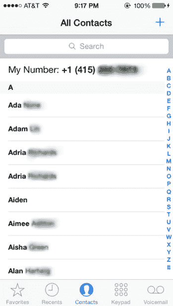

图 5-4. 电话应用的搜索功能

iOS 7 现在允许用户直接从主屏幕搜索他们的设备。启动后，用户可以开始输入查询，搜索结果会显示在下方。无论用户是否输入了查询，这个 `Spotlight` 搜索功能都在搜索字段右侧显示一个取消按钮。然而，在邮件应用中，搜索栏在任何邮箱内都是持久存在的。取消按钮仅在用户开始输入查询时出现。这两种模式都是可以接受的。但自然，如果你的应用是电子邮件应用，我会建议紧密遵循邮件模式，以避免用户为你的应用特意重新学习如何执行此任务。

关于其他一些与搜索相关的模式，在我看来相当明显，但我还是在这里提一下。甚至在用户输入时动态列出结果是一个不错的细节，以及在必要时对结果进行分段，以便用户可以轻松浏览他们需要的内容。这在 iOS 7 的 `Spotlight` 搜索中处理得很好。搜索结果直接列在搜索框下方，并以字母顺序向用户显示结果在设备上的位置。因此，搜索“seri”将得到事件、邮件、短信以及任何其他包含匹配词条的结果，如图 5-5 所示。

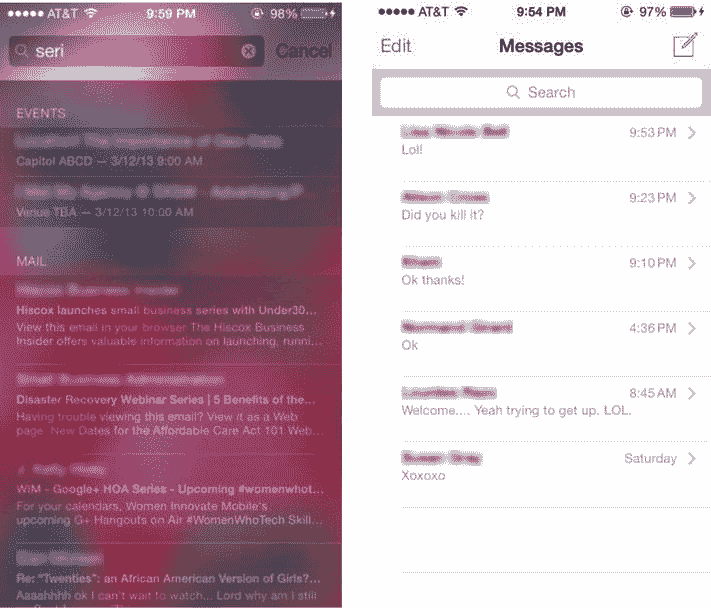

图 5-5. `Spotlight` 搜索和邮件应用中的搜索功能略有不同

排序通常在完成搜索查询并显示结果后进行。根据结果的不同，有一些巧妙的方法可以用来让用户对搜索结果进行排序。对于大型结果数据集，用户可能需要对结果进行比初始查询更进一步的排序。将结果分段成块可以让用户进一步筛选他们的初始查询结果。如果你选择这条路，仔细命名各个分段以避免混淆用户非常重要。例如，你可能正在开发一个基于位置的应用，向用户展示最近供应汉堡包的餐馆。如果你正在为用户展示此类商业查询的基于位置的结果，并且你的位置区域汉堡连锁店众多，产生大量商家，你可能希望进一步细分结果，允许用户对附近结果（在一定半径内）进行排序，而不是一个巨大的列表。因此，进一步细分这些结果的一个可接受方式是按 5 英里半径分组。这样用户就可以查看 5 英里、10 英里、15 英里半径范围内的商家，以此类推。

### 提示、导览与引导教程


如果您的应用具有独特的用户界面或功能，而用户可能不完全直观，您可以添加提示或导览，引导用户了解应用中不太直观的部分。导览将逐步引导用户完成特定操作，而提示则为用户可能不熟悉的特定功能添加上下文。在这两种情况下，这些模式通常发生在用户首次与您的应用交互时。然而，有些应用也会在应用内提供提示或导览，以便用户熟悉那些可能难以掌握的功能。

提示和导览属于帮助设计模式。虽然此类别中还有其他模式，但本书将重点介绍这两种。

提示可以在应用中广泛使用，几乎可以放在任何屏幕上。如果您的应用有一个您希望引起注意的功能，提示是一种非侵入性的方式。到目前为止，用户已经习惯了提示及其工作方式。提示可以通过按钮或用户屏幕上的其他热点触发。如果提示包含在弹出视图中，那么点击提示弹出视图之外的屏幕任意位置应使其消失。如果您使用标准弹出视图元素，您需要将提示放置在您所引用的功能附近。最后，保持提示中的文案简洁。包含详细说明的提示可能会让用户感到不知所措，因此请保持说明简短且切中要点。图 5-6 展示了如何创建一个信息量适中的提示，以免让用户感到不知所措。

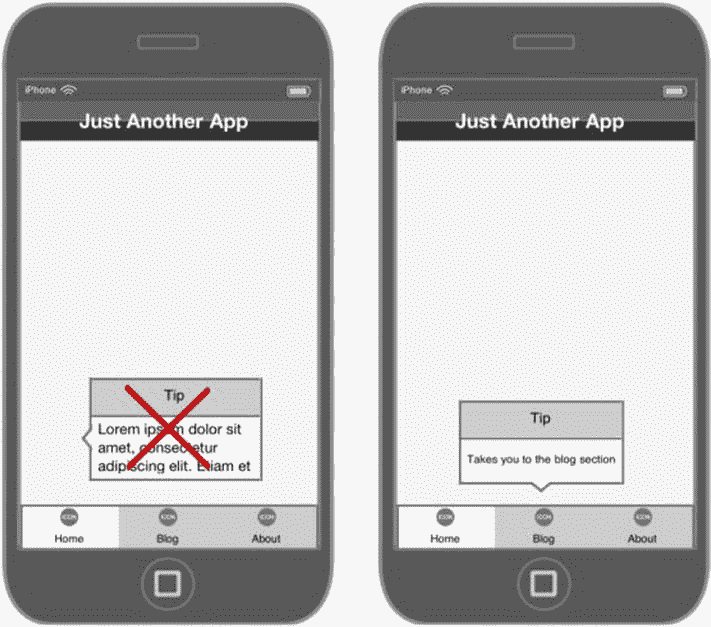

图 5-6。如果使用弹出视图作为提示，请确保提示遵循弹出视图的使用规则，并且包含恰到好处的信息量。

导览或逐步指导比提示更详细，它以引导性的分步说明形式向用户提供更多信息，指导用户使用应用。导览会在应用启动时自动出现，并引导用户完成应用中的详细流程。在进行导览时，虽然用户以自己的速度浏览应用，但您负责规划他们将要走的路径。您将有很多机会在导览中发挥创意，使其对用户具有吸引力。在导览中，关键是要将信息作为焦点。没有必要指出用户应该已经熟悉的功能。请将导览重点放在应用的独特方面。如果您的应用具有多层次的交互并能吸引不同类型的用户，那么导览是展示特定任务以提升用户体验的绝佳方式。

与提示类似，导览应是一种易于退出的体验，以防用户决定离开或电话等其他活动中断该过程。用户还应通过页面指示器等视觉提示了解导览还剩多长时间。

另一个好的经验法则是，尽量让导览具有视觉性，同时以平衡且最简的方式使用文案和文本。也就是说，文案的数量绝不应压倒屏幕上的视觉效果。将您的视觉效果作为故事的一部分，而不是通过解释来贬低用户，指出应用的每个方面。如果您过度依赖文字来解释某个功能，那么该功能必须重新审视。将导览视为文字和视觉效果的完美结合，用于解释如何与您的应用交互。

您的创造力也可以在提示和导览中占据中心位置。设计效果，如不透明度和半透明度（iOS 7 的常用特性），可以增强导览的外观和感觉，使其以更丰富、更具互动性的方式生动起来。

跳出框架

如果您选择创新，为已有的模式创建全新的方法，请务必小心。在已有设计模式的情况下，用新方法解决旧问题可能是一种冒险的策略。如果您决定跳出设计模式的框架，请将您的新方法与旧方法进行测试，并允许您的用户提供反馈。由于测试可能变得复杂且耗时，测试新方法的一种简单方式是选取一小部分用户，让他们同时使用您的新模式和旧模式，然后收集反馈。如果您的测试组更喜欢旧的设计模式，这可能是一个很好的指标，表明最好坚持使用用户已习惯的范式。

始终使用标准的 iOS 元素。《人机界面指南》提供了可轻松替换标准网页元素的 iOS 特定元素。设计师最常见的错误之一是将网页元素引入其移动设计中。这些元素可能适得其反，让用户感到沮丧。在应用商店中获得差评的一种确定方式是通过错误地使用 UI 元素来混淆用户，即混合使用隐喻。面包屑导航是一种常见的网页范式，用于向用户显示他们在内容丰富的网站中的位置。然而，iOS 中的返回键取代了网站上可以显示的长串先前页面列表。

总结

设计模式是针对常见设计问题的公认解决方案。您可以在应用中广泛使用它们，以显著加快设计过程。模式存在于注册和登录流程、主次导航、搜索、排序和帮助中。还有许多其他设计模式存在。《人机界面指南》是开始更熟悉设计模式以及如何为您的 iOS 应用具体实现它们的好地方。您也可以在模式的基础上进行即兴创作，但务必与用户进行严格测试。即兴创作并不意味着重新发明轮子。

第 6 章

使用线框图设计您的应用

无论您是为网页还是移动设备进行设计，准备一个线框图来帮助您梳理应用的所有功能总是一个好主意。

将线框图理解为建筑的蓝图是一个很好的类比。这是一个常见的例子。众所周知，蓝图必须在建筑实际建造之前完成。同样，线框图应在您进入应用的实际设计或开发阶段之前创建，并且是此过程的基础。

到目前为止，我们在本书中做的所有工作都将您引向这一点，即您实际上正在创建一些东西。您已经尽职尽责；您已经将您的想法从*仅仅*一个想法打磨成一个实际产品。您已经与潜在用户进行了沟通，并在应用商店中与其他应用进行了验证。您已将您的应用与其类别中的竞品进行了比较，并征求了反馈以了解自己的定位；现在，您已准备好创建您的应用。多么令人兴奋！

现在，我们将开始采取必要的步骤来创建您的应用。这一切从线框化开始。我们将从草图开始，并讨论有助于应用原型设计和用户交互的各种工具。我们将继续使用我们的 `Travel Light` 应用作为测试案例，并为此应用开发线框图。

什么是线框图？

线框图是您应用（网页或移动端）的一个简单绘图，它概述了所有界面元素和功能，然后才会进入应用的正式设计阶段。它通常不包含品牌元素或颜色。线框图是深入了解应用在用户与之交互时所有行为的一个绝佳方式（参见图 6-1）。

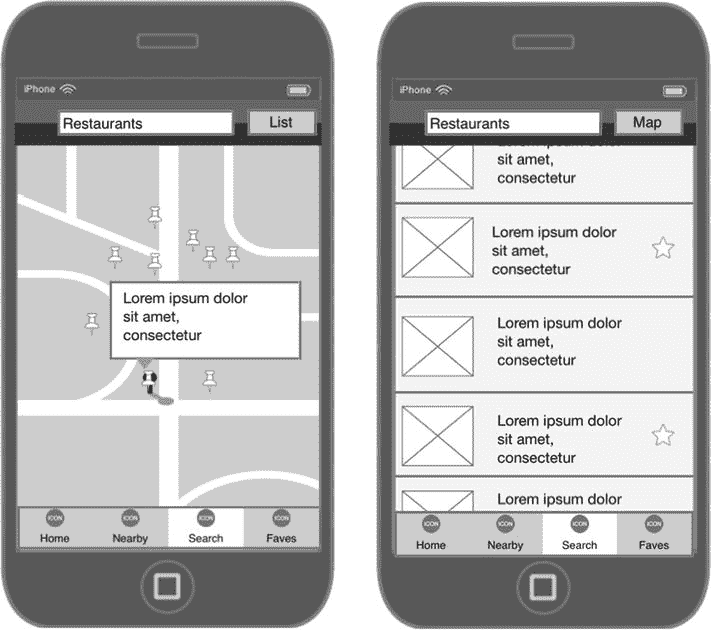


### 图 6-1

图 6-1. 线框图是绘制了应用所有界面元素的示意图

线框图的全部意义在于可用性与交互性。完成线框图绘制后，你应该明确用户在使用应用时每一项操作所对应的结果。

在应用开发的线框图阶段结束时，你应该能够回答关于应用的以下问题：

-   用户点击应用中的任意按钮时会发生什么？
-   应用中每个任务的最佳和最直观路径是什么？
-   应用是否在其用户界面中采用了公认的最佳实践？
-   任务是否通过最少的步骤完成？
-   用户是否理解其正在执行的任务及其原因？
-   是否已探索并涵盖了所有可能的用例？

线框图通常不包含色彩和品牌元素，这反而使其更易于阅读。添加品牌和色彩有时会分散线框图的核心目的——即在应用加入设计与润色之前，勾勒并敲定功能。线框图的另一个优势在于，当应用界面设计需要调整时，可以轻松进行迭代修改。如果线框图工作进展顺利，你会发现在整个流程完成前会生成多个版本的线框图。这其实是件好事，因为每个版本都应在前一版本基础上有所改进。

有些线框图比其他版本更精致，其精致程度取决于多种因素。如果你为客户创建应用，他们可能希望线框图达到一定的精致度或专业度。如果这不是硬性要求，那么我建议你保持线框图的黑白风格，并使用最简单的呈现方式。

#### 线框图工具

有许多在线资源和工具可用于创建线框图，也有专门针对移动端的线框图工具。搜索"线框图工具"会列出介绍可用工具的文章。这些工具中有些基于网页，有些是应用程序，有些可下载，有些免费，有些付费，还有些是开源的。你需要找到最适合自己的工具。在基于网页的工具中，以下是我个人最推荐的三款：

1.  **JustinMind** – 允许用户创建可点击的交互式移动线框图，并支持分享以收集反馈。
2.  **Proto.io** – 允许用户创建可用于原型设计和测试的线框图。支持分享和在设备上查看。价格从免费到每月 49 美元不等。
3.  **MoqUps** – 一款免费的基于 HTML 5 的线框图工具，提供 iOS 模板，让用户能够快速创建简单的移动应用线框图。

如果你不介意多花点钱，以下是另外一些需要付费的线框图工具列表：

1.  **Omnigraffle** – 个人许可证售价 99.99 美元。适用于 Mac 和 iPad。作为 Mac 用户的最爱，Omnigraffle 不仅可以创建应用和网站，还能绘制多种不同类型的图表。
2.  **iMockups** – iPad App Store 售价 6.99 美元。这款 iPad 应用允许用户在直观的 iPad 界面内为应用和网站创建线框图。该应用可能需要更新，但仍是创建基础应用线框图的绝佳工具。
3.  **Balsamiq** – 可下载的线框图工具，通过易用的界面提供基于手绘风格的线框图。也支持分享以收集反馈。单用户许可证售价 79 美元。

再次说明，这些列表基于我个人的偏好。这些产品大多允许用户先试用再决定购买，因此我建议你尽可能都尝试一下。确保你选择的任何应用都支持以几种不同格式导出线框图。你至少需要一种流行的图片格式（如 JPEG、PNG）以及广受欢迎的 PDF 格式。另一个有用的功能是能够与他人协作并共享线框图，这在向同事、团队成员和潜在用户征求反馈时会很有帮助。

你也可以完全跳过网页和其他数字工具，选择传统的手绘方式。也就是用钢笔或铅笔在纸上绘制，你可以在网上找到 iPhone 或 iPad 框架模板，以便在其中填充应用所需的 UI 元素。无论采用哪种方式，线框图和构思都是应用设计过程中不可跳过的重要步骤。

#### 为什么线框图很重要？

到了这个阶段，你自然可能急于开始应用设计的实际操作。你正在思考颜色、阴影、半透明效果，以及应用图标中要包含哪些细节。但先别急。尽管从设计角度来看并不那么吸引人，但完成线框图流程至关重要，因为它将为实际设计提供依据。一旦线框图完成，你会发现后续的设计和开发会比跳过此步骤时流畅得多。

线框图之所以重要，是因为它有助于创建布局，并帮助你在应用中为用户组织信息。在这个过程中，你可以自由地创建和撤销；尝试不同的方法来解决应用中的特定可用性问题。如果某个方案行不通，你可以轻松舍弃，暂时无需考虑品牌和其他细节。这尤其令人感到自由，因为在设计时我们追求像素级的完美精度，而不愿处理可用性问题。如果你决定完全放弃某个屏幕或流程，你将需要线框图提供的灵活性。如果你不受限于色彩和设计，那么你就可以专注于布局、可用性和流程——这正是线框图绘制时的主要关注点。

如果你与客户合作，你还会发现线框图是在进入样式和设计阶段之前，让客户认可用户界面及其他元素的绝佳方式。这样一来，客户就能明确预期，而设计也能为线框图增添深度。

#### 线框图绘制流程


对应用进行线框图设计的第一步，是开始思考应用的布局。关于最佳实现方式已有不少讨论。如果你下载了前面提到的某个模板，可以直接使用。就我个人而言，我偏爱纸笔。虽然听起来相当低技术，但纸张易于使用，且方便修改错误。纸张的另一个优点是它的具象性。你可以触摸和感受纸张，对某些设计师来说，在转向数字媒介前先在纸上规划，有助于构思过程。白板也很适合构思应用。你可以用干擦标记笔轻松勾勒想法并修正错误。你可能还对使用预印模板感兴趣，可以在上面草绘界面元素。我发现纸和模板能带来极大的解放感。复制这些模板或轮廓并制作多份是方法之一。或者，和其他所有事情一样，你也可以在网上免费找到可下载的模板。如果不行，那就使用你选择的线框图工具。我在图 6-2 中提供了一个设备轮廓图。如果你决定走纸质路线，这个轮廓图以及图 6-3 中的那些可能会派上用场。我倾向于制作几份副本，每页一个框架，两侧留出空间做笔记。如果我不打算复印或使用模板，我会全凭手绘，然后将模板作为线框图流程的第二步。这样，手绘设计将作为线框图的初稿，直到一些基本的布局和可用性问题得到解决。

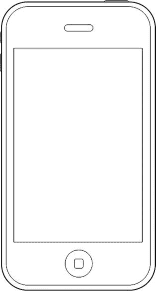

图 6-2. 一个简单的 iPhone 轮廓图

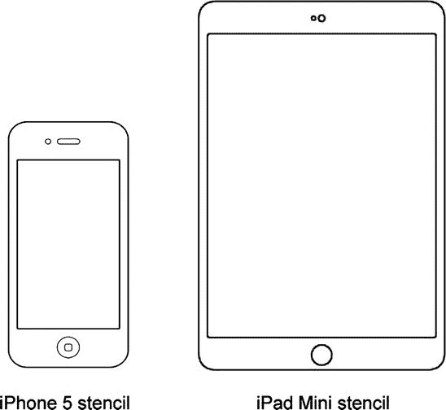

图 6-3. 适用于 iPhone 5 和 iPad mini 的基本模板。这些可用于应用线框图设计

开始你的线框图设计流程时，你应该准备好到目前为止收集的所有资料：你的应用描述（现在应已根据验证反馈进行完善），以及那些展示了最佳实践、设计模式并说明了你应用中常见功能的应用。如果没有适用于每个屏幕的设计模式，那也没关系：你必须自己创建它们。

如果你选择使用电子或基于网页的线框工具，就像上面提到的纸质模板一样，你至少需要在开始线框图流程时，根据你的应用是针对 iPhone 还是 iPad，使用相应的设备轮廓图。你选择的线框图程序应该包含这个框架或轮廓。它不必很逼真，但尺寸必须精确，以便你能以正确的宽高比为你正在设计的设备进行工作。

在你落笔或真正开始规划用户界面之前，一定要将自己置于用户的思维模式中，而不是设计师或开发者的思维。应用的总体目标和目标用户的需求应指导线框图的设计。用户必须处于流程每个步骤的核心位置。作为设计师，你可能会觉得需要在界面中添加新奇炫酷的元素并尝试不同的布局。然而，如果这对你的用户以及他们试图完成的任务没有帮助，你的应用就不会成功。作为设计师和开发者，让自己脱离流程，并能够设身处地为用户着想，这一点至关重要。这就是你的应用陈述如此重要的原因。到了这个时候，你应该能够参考第 1 章中创建的陈述来指导你的线框图设计过程。

信息架构师（IA）有时会创建线框图，但现在由设计师来完成这项工作也并不罕见。

**提示** 信息架构师是为网站或应用创建蓝图和线框图的人。

在某些情况下，IA 和设计师之间的界限已经模糊。如果你自认为是纯粹形式的设计师，那么熟悉可用性是个好主意，而最好的方法就是为你的应用创建线框图。如果你能找到一位 IA 或用户体验专家与你合作，那更好。但如果不能，你应该能够使用本章中的一些工具来创建你的线框图。

#### 聚焦可用性

线框图设计的核心就是可用性。因此，在线框图设计过程中，向自己提出一些关键问题非常重要。

*   用户打开你的应用后需要执行的第一项任务是什么？
*   在任意特定屏幕上，对用户来说最重要的任务是什么？
*   用户在当前屏幕上需要哪些信息来指导他/她的任务？
*   基于现有模式和最佳实践，用户在这个阶段期望看到什么？
*   如果一个任务包含多个步骤，那么完成这个任务的最佳且最短的路径是什么？

如果我们沿用最初的想法，就像我们在第 1 章中所做的那样，创建一个帮助用户轻装旅行的旅行应用，我们就需要向自己提出关于用户的关键问题，以及他/她需要什么来指导应用的任务。如果你在设计应用时做得很好，你也应该遵循了这些步骤，并能从这些问题中找到答案。

例如，你的用户是否需要登录或注册才能使用应用？如果是，那么采用一种设计模式可能是最好的选择。你需要在这里收集哪些信息？在登录和注册方面，确实没有必要重复造轮子。用户熟悉这个过程，所以记住只收集你需要的信息，并草绘出这个过程的输入字段和确认环节。应用是否从社交网络拉取信息？如果是，那么你知道你需要请求用户的许可才能这样做。记住，你的目标是让用户尽快完成这个过程，以便他们能够开始与你的应用互动。如果需要的话，可以参考第 5 章中的注册和登录移动设计模式最佳实践。保持简单，因为你希望用户真正开始使用你的应用。如果注册过程太复杂，你将失去那些可能永远不会再回来的用户。此时你的目标是让用户用最少的步骤进入应用。

#### 尝试不同布局

也要尝试不同的布局。你脑海中第一个闪现的布局肯定不会是最佳方案，但首先要把它记录下来作为起点。目标是让一些东西落在纸上，从而开启这个过程。尝试按顺序完成你的线框图。这意味着尝试按照你期望用户使用应用时的顺序来规划页面和屏幕。一种方法是根据你的应用中不同屏幕相关的每个任务和子任务，将应用的各个部分分开处理。这样，你就清楚自己在为什么内容画线框图了。

举个例子，我们创建了一个名为“轻装旅行”的应用。在整本书中，我们将使用这个应用来说明设计过程中各种技巧和步骤的示例。

#### 勾勒用户流程


每个应用流程都是用户在使用应用时遵循的路径。你至少应该对应用如何运作有一些初步想法，这将使创建用户流程变得更加容易。上述一些线框图工具也可用于创建用户流程。不过，任何允许你绘制基本形状的工具都可以胜任。启动用户流程最简便的方法就是列出你能想到的、与应用相关的所有主要任务。此处描述要尽可能具体，因为这里正是你的应用开始活起来的地方。你可以将每个步骤写在便利贴上，这样当发现两个步骤之间需要插入额外步骤时，就能方便地移动它们。或者，你也可以在白板上写下每个步骤。用户流程的目的是追踪用户为完成特定任务必须经过的路径。在规划用户流程时，你应该提出并能够回答以下问题：

*   用户是谁，他/她需要什么？
*   用户为什么与应用交互？
*   用户要去哪里？
*   这项任务的最终目标是什么？
*   用户的目标是什么？
*   应用的目的是什么？
*   是否有特定的商业目标？（例如应用内购买或销售）
*   任务从哪里开始，又在哪里结束？

下面，我尝试为我们的“轻装旅行”应用回答上述问题。请注意每个答案都很简洁。在制作线框图的过程中，你的答案也可能会发生变化。

**你的用户是谁，他/她需要什么？**

“轻装旅行”的用户是忙碌的旅行者，他们需要确切地知道每次旅行该带什么。

**为什么用户要与应用交互？**

用户与“轻装旅行”交互是为了尽量减少随身行李，并确保只带必需品。

**用户要去哪里？**

用户将要去创建一个新的清单。

**这项任务的最终目标是什么？**

这项任务的最终目标是帮助用户创建一个清单，并将其与特定的旅行关联起来。

**用户的目标是什么？**

最终目标是针对给定的旅行创建一个完整的清单。

**应用的目的是什么？**

应用的目的是让用户只带所需物品，同时不忘带任何东西。

**是否有特定的商业目标？（应用内购买或销售）**

最终，我们会将用户与其他提供低成本旅行解决方案的合作伙伴联系起来。

**任务从哪里开始，又在哪里结束？**

主要任务从输入旅行详情（例如出发地和目的地城市及日期）开始。当用户为特定旅行选择了所有物品时，任务结束。

图 6-4 展示了一个“轻装旅行”应用非常基础的用户流程示例。

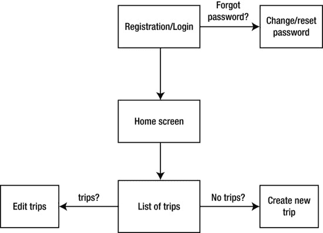

图 6-4. “轻装旅行”应用的用户流程列出了用户在浏览应用时可能采取的**主要任务**和**路径**

现在我们已经创建了用户需求列表，可以开始写下与刚刚概述的目标相关联的主要任务了。

为了从“轻装旅行”应用创建界面，我们的主要任务和子任务列表可能如下所示：

点击应用图标

注册与登录页面

选择并输入用户名（电子邮件地址）

选择并输入密码

点击登录按钮

如果我们概述与输入旅行详情相关的所有步骤，列表可能如下所示：

旅行信息录入

输入旅行详情；出发城市、州、机场、日期和时间

询问是否使用当前位置；如果是，则列出关联机场

如果否，用户可手动输入

用户选择出发机场

用户通过日历弹出窗口输入日期

用户通过选择器输入时间？

保存旅行详情 – 用户应能编辑旅行详情

清单创建与确认


用户创建新的打包清单——该清单与新的行程相关联。

用户向清单中添加新物品。

用户还可以从旧清单或热门物品中选择物品。

如果用户忘记了，应用会根据以前的清单或行程，随着时间的推移推荐物品。

“设置”面板中的辅助任务可能包括：

设置

启用基于位置的服务

提醒？（徽章、通知中心、声音等）

上述清单绝非详尽无遗，也并非完整无缺。很可能还有一些步骤缺失。这只是为这个虚构应用创建线框的相关任务的初步尝试。像这样的清单应能为线框的第一次迭代提供信息。

图 6-5 中的屏幕展示了一些基本草图，展示了我们虚构应用的“轻装旅行”线框在注册和行程输入部分可能的样子。下面的任务代表了一个新用户在应用中会执行的操作。这些草图是徒手绘制的，没有使用任何模板。尽管草图比较粗糙，但你仍能辨认出用户界面的元素以及每个屏幕的一些关键区域。你可以为自己的应用做同样的事情，或者使用模板。无论采用哪种方式，都必须尝试将你的屏幕和用户界面元素映射到你的任务上。在逐步处理这些屏幕时，差异和缺失的步骤应该会变得明显。一旦发现，你就能将它们补充完整。

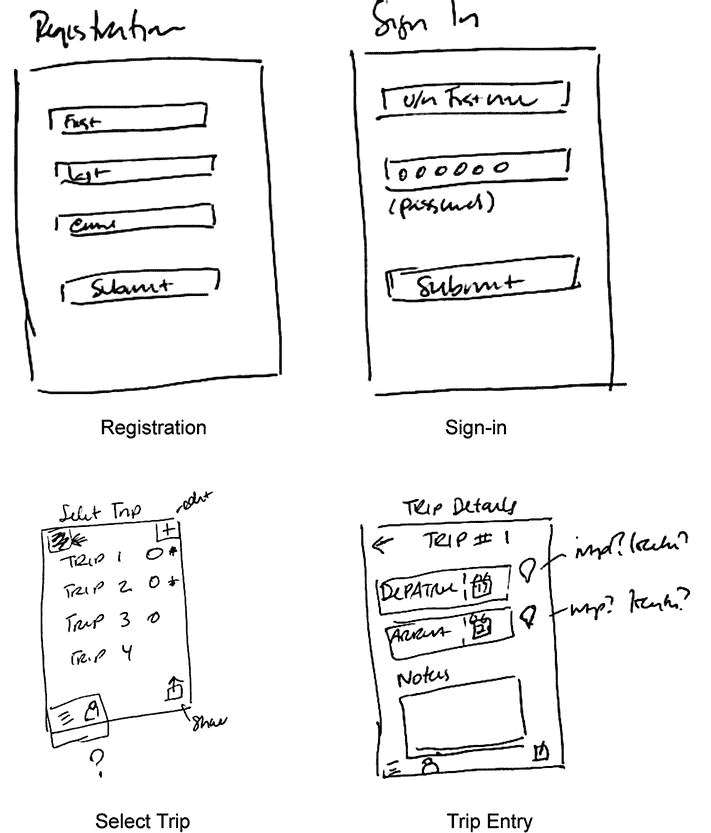

图 6-5。基本的手绘线框展示了一系列从注册到行程输入的屏幕。

一旦你对照任务清单审阅了你的草图、便利贴或模板，各种用户路径也会开始显现。对于我们的“轻装旅行”应用，我们已经涵盖了一些每个用户都必须执行的任务，例如注册、添加行程和创建清单。这些被认为是主要任务。然而，在此过程中，也可能出现一些次要任务。这些任务可能并非所有用户都能明显看到或需要，但对于其他用户来说，它们将是流程的一部分。这些任务——无论大小——都将开始揭示你的应用的不同用例。

定义用例

当你以用户为中心进行线框设计时，你可能会发现你的用户并非都一模一样，他们在与应用交互时的需求也各不相同。我见过的大多数应用都至少有两个用例。用例有时也被称为用户故事。它们帮助你根据对用户的理解以及他们的需求，为你的应用打造独特的体验。这将决定你如何创建应用的 UI。

在围绕特定用例设计线框时，你需要为特定用户定义最直观的用户界面元素。例如，假设我们的“轻装旅行”应用有一位高级用户。这位用户经常旅行，并且已经在应用中保存了多个行程。那么，这位用户的体验与新用户有何不同？基于这个用例，这个用户流程可能会这样进行：

1.  打开应用
2.  从之前的行程列表中选择，或者如果未列出则添加新行程
3.  从另一个行程导入清单
4.  如有需要编辑清单
5.  确认

请注意，这个用例与上述线框中为新用户设定任务的初始用例有很大不同。高级用户或经常使用的用户已经熟悉应用的功能、界面以及如何执行关键任务。因此，在这个流程的线框（图 6-6）中，我们会对用户如何与应用交互以及他们在执行特定任务时期望看到什么做出基本假设。

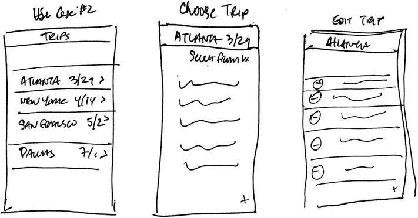

图 6-6。特定用例的线框

添加线框细节

一旦你规划好了模块和用户界面，就可以开始向线框添加更多细节了。在需要的地方为按钮添加标签，为屏幕添加标题，让它们开始变得生动起来。再次思考用户将如何识别 UI 元素，并将它们与手头的任务联系起来。提出如下问题：

*   iOS 用户界面中的哪些元素最适合使用？
*   在选择日期时，日期选择器是否最好？或者提供一个日历让用户能看到完整的月份布局以便更容易选择是否更简单？
*   时间对你的用户来说是一个考虑因素吗？他们会在多任务处理时使用你的应用吗？
*   用户最可能在什么地方使用你的应用？
*   用户在使用你的应用时是否可能处于移动状态或正在行动中？如果是这样，这将如何影响你布置关键 UI 元素（如按钮）的方式？
*   你的用户更可能是单手还是双手使用你的应用？

这些问题的答案不仅会影响流程，还会影响应用的布局。这时你开始优化应用的 UI。

如前所述，线框设计是一个迭代过程。在最终定稿之前，你可能会制作多个版本的线框。然而，每个版本都应让你更接近最终版本，并为实际的设计阶段做好准备。

分享线框以获取反馈

如果可以的话，与他人分享你的线框总是一个好主意。就像你为应用写的初始声明一样，线框如果只是闭门造车，不与人分享，就几乎毫无用处。你不能在封闭的环境中设计。将你的线框分享给你的朋友、同事，或者如果可能的话，分享给潜在的用户。

如果可能，创建一个小的用户群，让他们审阅初期的线框并收集他们的反馈，然后用这些反馈进一步优化线框。如果你能让当初评估应用声明的同一组人也参与进来，并对线框提供反馈，那就最理想了。你将与一个熟悉应用整体概念和功能的团队合作。对于这个受众来说，看到应用随着时间的推移而演变，对你作为设计师来说可能既有帮助又富有洞察力。

然而，对待用户反馈要谨慎。有时用户反馈可能会与公认的最佳实践相悖。如果收到的部分反馈属于这种情况，在实施之前请认真权衡这些反馈——特别是如果它违背了公认的最佳实践或已知的设计模式。例如，许多旅行应用会向用户展示一个月份日历供其选择旅行日期。如果在焦点小组会议中，一个或多个用户认为有另一种更好的方式，你可能需要权衡这种改变的利弊。原因是，你的核心用户很可能期望在输入日期时看到那个日历。iOS 的选择器是允许用户选择日期和时间的好方法。但是，如果你替代日历的方案不够用户友好或直观，你可能需要考虑忽略这一特定反馈，并坚持使用已知且普遍使用的方式。

对于应用线框中的特定动画或隐含动作，你需要向用户展示动画前后的状态，因为线框大多是静态的。如果你采用低保真度方法，那么动画前后的状态以及详细的注释应该足以说明动作。有些用户也未必知道某些转场是什么意思；因此，在征求反馈时，直观地向他们展示是避免让你的焦点小组用户感到困惑的一种方法。

创建原型


市面上一些流行的线框设计软件，允许你创建可点击的应用原型，并能在实际设备上运行。在之前列出的软件中，`Proto.io`、`JustinMind` 和 `iMockups` 都可以帮助你创建某种形式的可点击原型。这是向用户精确展示应用运行方式的绝佳途径。其他软件可能只允许通过网页界面与应用交互。任何能复制用户将在应用中体验到的真实交互性的线框工具，对于测试都非常有帮助，但并非绝对必要。从静态的纸质线框和交互式线框中都能获得极好的反馈，甚至还有一个名为 `POP`（纸上原型）的工具，如图 6-7 所示，它允许你拍摄纸质线框的照片并为其添加一些交互功能。该工具以应用形式提供，看起来使用起来很有趣。理想情况下，最好的方法是让用户直接在他们设备上与为其设计的应用进行交互。

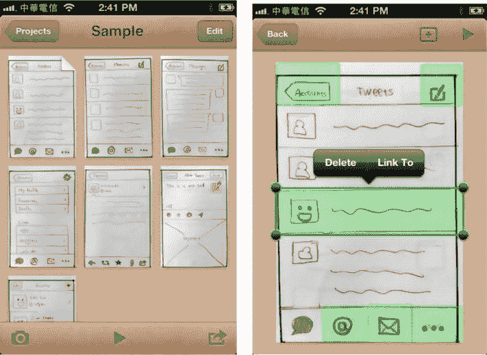

图 6-7。`POP` 应用让用户拍摄手绘线框的照片，并为其添加交互功能。

**客户与线框**

如果你是作为设计师兼开发者为自己的应用创建线框，那么这些线框主要仅供你自己参考。除非你跟他人分享以获取反馈，否则你完全可以自行决定线框的精细程度。然而，如果你是与客户打交道，那么为你的线框添加注释和一定程度的指引对客户会很有帮助。由于线框缺乏任何品牌元素或色彩，客户可能会觉得难以理解。在向客户展示线框之前，先让他们了解线框的呈现方式。为线框添加方向性注释，如果可能的话，引导客户浏览整个流程。将客户无法理解的线框发送给他们，无疑是延迟项目签收的方式，并且可能导致无休止的反馈循环，由此引发更多问题和需要澄清的事项，而非真正的批准。

你很少会与客户分享像图 6-4 和图 6-5 那样的手绘线框。但是，如果你有一个团队，这些手绘线框是内部迭代的好起点。而且，尽管我已经审查并列出了一些线框软件和工具，但你完全无需感到有使用它们的压力。图 6-8 中的线框是更适合发送给客户审阅的范例。

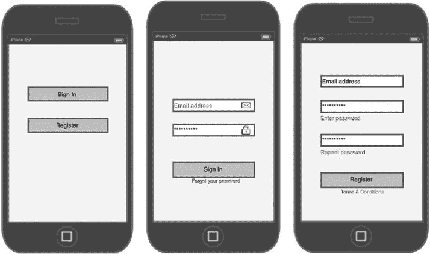

图 6-8。这些线框更适合与客户分享。

这些线框不仅更精致，而且更易于阅读和理解。由于你的线框将代表应用中的每一个页面，并且理想地展示用户如何与他们在每个屏幕上看到的内容进行交互，因此最好包含用户在最终线框中能看到的所有元素。请注意上方屏幕中的“忘记密码”和“条款与条件”链接。虽然此处未展示，但展示用户找回丢失密码的流程也很常见。有时，应用的“条款与条件”会以网页视图的形式展示，因为它们可能会变更，这种方式便于更新。如果你们的条款要求用户执行操作（例如点击“同意”按钮）才能继续，那么也应该展示这些界面。

### 总结

你的线框是设计过程中的关键组成部分。它们将帮助你创建用户流程，并定义用户使用你应用时的整体体验。线框的主要目的是让你能够创建以用户为中心的场景，为你的应用用户提供最佳的整体体验。请确保你的线框能够解答关于用户如何以及为何与应用进行交互的关键问题。如果你在起步阶段遇到困难，可以随时参考我们在第 6 章中讨论的设计模式，或者回顾你最初的应用陈述。市面上有众多工具可用于为你的应用制作线框。其中许多工具允许你以最基本的形式（即不含色彩和品牌元素）创建应用，并便于频繁迭代。无论你是使用现成的软件，还是决定使用纸笔，你的线框都需要通过他人的反馈来不断优化。因此，请确保你能够分享这些线框并认真权衡那些重要的反馈意见。如果你需要向客户展示线框，那么你需要为线框增加一定的精细度。注释也有助于解释你可能无法传达的所需功能或效果。在线框设计流程结束时，你应已准备好为应用添加色彩、深度和品牌元素。

## 第 7 章：使用 Adobe Photoshop 设计视觉资源

Adobe Photoshop 可能是全球设计师最常用的图形软件。在设计应用或网站时，Adobe Photoshop 仍然是行业标准。历经二十多年的发展，它已成为整个创意产业的强大工具。Adobe 旗下的名为 Creative Cloud 的软件套件，还包括 Adobe Fireworks、Illustrator、InDesign、Premiere Pro 和 After Effects 等其他图形程序，涵盖视频编辑、图像设计到动态图形等领域。然而，就本书而言，我们将专注于 Adobe Photoshop 作为为我们的 iOS 应用创建资源的标准工具。

之后我也将简要介绍一下 Fireworks。

为了本书的目的和前后一致性，我们将继续围绕“轻装旅行”应用这个主题，该应用旨在帮助你永远不忘带上旅途所需物品。到目前为止，我们为这个虚构的应用制定了应用使命陈述，进行了一些基础研究并设计了线框。在本章中，我们将使用 Photoshop 为我们在第 6 章中创建的线框添加一些色彩和品牌元素。我们不会完整地从头到尾设计整个应用，但我会演示如何使用该软件来完成特定任务，为你的应用用户界面增添色彩和润色。

### 一些 Photoshop 基础知识

如果你大部分时间都在开发应用，那么你肯定接触过 Photoshop 文件，或者它们通常被称为的 `PSD` 文件。它们是大多数设计作品的基石。即使你只熟悉 `PNG`（苹果公司偏好的应用图像格式），你的 `PNG` 文件十有八九最初也是源于 Adobe Photoshop 文件。

由于本书并非一本教授如何使用 Photoshop 的指南，我们假设你具备一些在 Photoshop 中执行基本任务的经验。即使作为一名开发人员，熟悉 Photoshop 也始终是个好主意。一些开发者和 iOS 工程师会收到已经切好图、可直接用于开发的 `PNG` 资源；与此同时，越来越多的开发者也更习惯于接收分层的 `PSD` 文件，并自行从中切图。本章假设你已经熟悉 Photoshop，并且之前创建或编辑过 `PSD` 文件。理想情况下，你曾打开并探索过该软件的界面，创建过形状，熟悉填充、透明度、不透明度以及图层等操作。


```markdown

如果你已有一定经验，应该对 Photoshop 的布局——即设计师所称的“工作区”比较熟悉。打开程序并选择应用画布大小后，所见的屏幕即为工作区。由于你将为 iOS 进行设计，画布应显示 iOS 设备的基本轮廓或形状。

如果你是 Photoshop 的绝对新手，请搜索 Photoshop 教程或 Photoshop 基础课程。网上有大量资源可供设计新手学习 Photoshop 基础。根据你投入课程、教程和实践的时间，可以说你可以在几周内掌握基本操作。之后，你可以回到本书本章继续学习。Photoshop 是一款复杂的工具，尽管近期已努力使其更加用户友好。如果你从未见过或接触过这款软件，它可能会显得令人困惑。

在 Photoshop 中创建应用的第一步是新建一个文档。如果你正在为 iPhone 和 iOS 7 进行设计，你需要适配 iPhone 4、4S、5、5S 和 5C。如果你的应用需要向后兼容 iOS 6，那么 iPhone 3GS 也可能包含在内，因为 iOS 6 仍支持该设备。不过，鉴于 iOS 7 的采用率以及我们应用的目的，我们将为 iOS 7 进行设计。

由于较新的设备配备了 Retina 屏幕，公认的做法是先为高分辨率设计，再为低分辨率设备进行缩放。这也意味着你需要为当前所有不同版本的 iPhone 准备多个版本的资源。

#### 为 Retina 做准备

在开始设计应用之前，需要考虑以下几点。由于自 iPhone 3GS 以来的每款 iPhone 都配备了 Retina 屏幕，我们将以此为基础设置 Photoshop 文件。如果你为 Retina 进行设计，并且拥有 Retina 电脑（例如 Apple 的 MacBook Pro with Retina），那一切就绪。这些电脑会按 Retina 设备应有的效果渲染你的设计。但如果你没有 Retina 电脑也不必担心。还有其他解决方案。`LiveView` 是一款免费应用，一些设计师会使用它。该应用允许他们在移动设备上远程查看设计。它适用于 iPhone 和 iPad，可以让你在选定的 iOS 设备上实时查看 Adobe Photoshop 画布。你需要在电脑和移动设备上都安装该应用才能使用。`LiveView` 也适用于非 Retina 屏幕。

另一个帮助设计师在移动设备上查看设计的工具是 `Skala`。适用于 Mac、iPhone、iPad 和 Android，这款工具在设计者中也颇受欢迎。还有其他可用工具，因此在决定使用哪款前请先做一些研究。前面提到的两款工具非常流行，且支持度很好。

#### 你的 Photoshop 设置

在 Photoshop 中设置屏幕相对简单。你需要参考线框图。列出需要在 Photoshop 中创建的屏幕列表。根据我们的线框图，这些屏幕包括：

1.  加载屏幕
2.  注册/登录
3.  我的行程
4.  编辑行程
5.  选择行程
6.  编辑行程项目

根据上述列表，我们将创建以下屏幕：

- 注册/登录
- 行程详情（录入）
- 编辑行程项目

这个列表基本涵盖了我们需要为应用设计的所有页面。我们将跳过启动图片等内容，并假设它会显示某种标志，或与应用首页相同。Apple 的人机界面指南并不喜欢带有大量品牌的启动图片，而且用户实际上也不会与该屏幕进行交互或长时间看到它。不过，有关创建启动图片的更多信息，请参见第 8 章。现在，我们将专注于用户实际会交互并代表一定功能级别的屏幕。用户进入应用后看到的第一个屏幕将是登录或注册屏幕。

让我们开始在 Photoshop 中创建第一个屏幕。建议将线框图放在旁边，以便参考。

你需要做的第一件事是在 Photoshop 中创建一个新项目。这将是后续所有屏幕的基础。按图 7-1 所示设置尺寸。

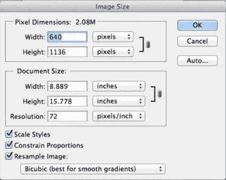

**图 7-1**。Adobe Photoshop 的图像大小窗口

`640 x 1196` 将适配较新 iPhone（包括最新发布的 iPhone 5c 和 5s）的更高分辨率。从高分辨率开始设计，还能更容易地为非 Retina 设备缩放资源。一旦为高分辨率设计好，调整起来相当简单。当你完成此设置，并且所有元素和组件均采用偶数尺寸后，你就能缩放以适应旧款设备的非 Retina 设计。

在 Photoshop 中设置好画布后，你将进入主屏幕，并在此继续设计应用。根据个人偏好不同，它看起来会类似于图 7-2 中的截图。在开始添加元素和组件之前，花些时间设置画布的某些方面，比如你希望哪些面板可见，以及根据你的习惯（右手或左手）将面板放在何处。一旦按照喜好排列好所有面板并设置好画布，你的设计过程将更加轻松。Photoshop 的大部分面板和窗口都可以根据偏好移动或隐藏。

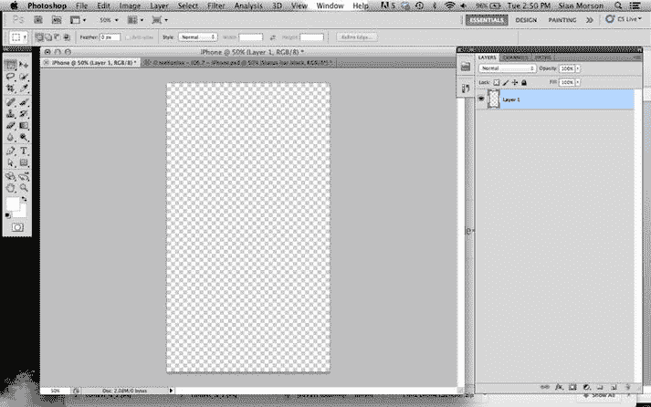

**图 7-2**。Photoshop 中的主画布

#### 网格线与参考线

设置并建立网格线可以使设计过程更轻松。参考线和网格线将帮助你更轻松地在多个屏幕间对齐用户界面的组件。它们是显示在页面上但不会出现在应用中的线条。你可以将网格放在屏幕上的任何位置，并锁定它们，使它们在你设计应用时保持原位。它们将帮助你创建完全对称的设计。网格线能让元素在画布上精确定位，而不是在屏幕上随意浮动。如果不使用网格线，你只能凭肉眼估计组件对齐的位置。即使对于最专业的设计师来说，这也可能是一项繁琐的工作，而组件位置不当的结果是元素在不同屏幕间跳动。你需要确保元素对齐到参考线或网格，以保证它们不会在不同屏幕间移动。如果所有元素没有完美对齐，即使一个像素的偏差也会导致跳动。

参考线是简单线条，当你尝试对齐屏幕上某些元素时会出现。你可以通过 **偏好设置** → **参考线、网格和切片** 来设置参考线的偏好。

```


创建网格和网格线有几种不同的方法，当涉及到网格线和细分时，这可能会变得相当复杂，但我们将使用 Photoshop 自带的网格线作为参考，确保我们每个屏幕上的组件保持对齐。您还可以查看一些可用的 Photoshop 插件和扩展，它们有助于为从网站到应用程序的所有内容创建网格线。现在，我们将保持简单，继续设计我们的“轻装旅行”应用。

图 7-2 所示的主画布是您完成大部分工作的区域。在左侧，您会看到 `工具` 面板，主画布位于中间。请注意，屏幕形状与 iPhone 屏幕的宽高比和尺寸相匹配，而图层面板则位于最右侧。自定义此屏幕有多种方式。Photoshop 允许您只保留在屏幕上认为关键的元素，以便您能够专注于手头的任务。我建议尝试不同的组合，以找到适合您的布局。不过，为了设计我们的应用，我们将坚持使用此屏幕。接下来，我将更详细地描述各个面板。

### 工具面板

`工具` 面板顾名思义。您在 Photoshop 中可用的所有工具都将位于此面板中。该面板可以移动到屏幕上您喜欢的几乎任何位置。但在初次启动时，它将位于最左侧。如图 7-3 所示。

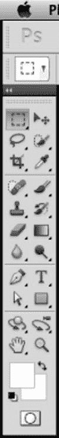

图 7-3。Photoshop 中的 `工具` 面板

要查看面板中每个工具的功能，请将指针悬停在工具上，工具的名称就会在其下方弹出。建议对面板中的所有工具都这样做，以便您至少熟悉每个工具的名称并了解其功能。要选择工具，只需单击面板中的工具即可。如果您看到右下角有一个小三角形，通常表示在该工具的菜单中还有更多选项可供选择。`工具` 面板的组织结构如下。

#### 选择工具

在 `工具` 面板的选择部分，您将找到以下允许您选择各种形状的工具：

*   `移动工具` - 允许您移动图层或图像选区。
*   `选框工具` - 选框工具允许用户以工具的形状（矩形、椭圆、单列和单行）进行选择。
*   `套索工具` - 套索工具允许用户像使用钢笔或铅笔一样，围绕特定选区绘制自由手绘边界。此工具也可作为多边形和磁性工具使用。磁性套索会自动检测选区的边缘，而多边形工具将沿已有的直线绘制。
*   `快速选择工具` – 此工具允许您基于颜色进行选择。
*   `魔棒工具` – 魔棒工具允许用户在高对比度图像中进行选择。

#### 裁剪与切片工具

`裁剪` 和 `切片` 工具允许您提取图像的一部分以供使用，或从主图像创建一系列较小的图像。它们包括：

*   `裁剪工具` - 裁剪工具允许您裁剪或移除图像的区域。
*   `切片工具` - 这些工具允许用户为网页或其他用途切片图像选区。

#### 测量工具

Photoshop 中的测量工具允许您测量图像中两点之间的距离。测量工具还与一些其他工具组合在一起，包括：

*   `吸管工具` – 允许您为前景选择特定颜色。
*   `颜色取样器工具` – 主要用于色彩校正，此工具会记录特定颜色区域的色彩值。
*   `标尺工具` – 允许您测量两点之间的距离。
*   `注释工具` – 允许向图像或文档添加注释。

#### 修饰工具

修饰工具允许您修饰和清理甚至删除图像中需要改进的选定部分。此部分的工具包括：

*   `污点修复画笔工具` – 允许您将一幅图像的纹理匹配到另一幅图像上，以修复或遮盖图像中的瑕疵。最适合处理圆形瑕疵。
*   `修复画笔工具` – 允许您修复非圆形的图像瑕疵。
*   `修补工具` – 通过混合两个区域来修复图像中的瑕疵。
*   `红眼工具` – 修正照片中常见的红眼问题。
*   `仿制图章工具` – 允许您遮盖或克隆图像的一部分到另一部分。
*   `橡皮擦工具` – 允许您擦除图像中不需要的部分。
*   `背景橡皮擦工具` 和 `魔术橡皮擦工具` – 允许您移除图像中不需要的背景。
*   `模糊工具` – 允许您绘制并使图像的一部分变得模糊。
*   `锐化工具` – 使图像看起来更清晰。
*   `涂抹工具` – 允许您涂抹或污损图像的某个选区。
*   `减淡工具` – 模拟摄影师的减淡过程。此工具让您能够加亮图像的一部分。
*   `加深工具` – 与 `减淡工具` 成对，此工具允许您使图像的部分区域变暗。
*   `海绵工具` – 用于增加或减少颜色的饱和度。

#### 绘画工具

绘画工具允许您使用画笔或不同类型的工具进行绘画或模拟绘画行为。它们允许您根据自己的偏好更改和自定义画笔，并从多种选项中进行选择。绘画工具包括：

*   `画笔工具` – 让您使用画笔和各种不同的笔尖进行绘画。
*   `铅笔工具` – 模拟用铅笔画画。
*   `颜色替换工具` – 允许您在绘画时将一种颜色替换为另一种颜色。
*   `混合器画笔工具` – 让您通过“混合”不同颜色来创建绘画效果。
*   `历史记录画笔工具` – 允许您通过在选区内绘画以显示旧版本来恢复为较早版本的图像。
*   `历史记录艺术画笔工具` – 此工具在 `历史记录画笔工具` 的基础上添加了效果。
*   `渐变工具` – 让您创建一种背景或叠加，将一种颜色渐变为另一种颜色，从而创建渐变效果。
*   `油漆桶工具` – 用纯色填充一个区域。

#### 绘图与文字工具

绘图和文字工具用于绘制形状以及在您正在创建的图像中写作或键入文字。此部分的工具包括：

*   `钢笔工具` – 让您单击两个锚点，Photoshop 将在它们之间绘制一条线段。
*   `自由钢笔工具` – 允许您像用笔一样自由手绘。
*   `横排文字工具` 和 `直排文字工具` – 向图像添加文本，可以横向从左到右，或纵向从上到下。
*   `蒙版工具` – 允许您创建文本的轮廓。
*   `路径选择工具` – 允许您选择由其他任何工具创建的路径。
*   `直接选择工具` – 允许您选择特定路径的锚点或部分，而不是整条路径。
*   `形状工具` – 让您绘制多种不同的形状（矩形、椭圆、多边形、线条或自定义形状）。

#### 视图与导航工具

视图和导航工具允许您移动图像或放大以查看不同视图。

*   `抓手工具` – 允许您在屏幕上移动图像。
*   `旋转视图工具` – 允许您旋转对图像的特定视图。
*   `缩放工具` – 允许您放大图像。

#### 3D 工具

3D 工具允许您在 Photoshop 中操纵和旋转 3D 模型。此部分的工具包括：

*   `3D 对象旋转工具`（包括对象滚动、平移、滑动和缩放）– 允许您旋转、操纵和缩放 3D 模型。
*   `3D 旋转相机工具` – 旋转 3D 相机视图，同时保持实际的 3D 对象固定。

### 图层面板


假设你已按照图 7-2 所示设置好画布，图 7-4 中的`Layers`面板将位于右侧，你可以在其中看到设计中的所有元素。你将使用该面板来管理应用的设计。当你创建如图 7-2 所示的第一张图片时，这很可能就是应用的背景。虽然你可以在设计中使用多个图层，但只能有一个背景。

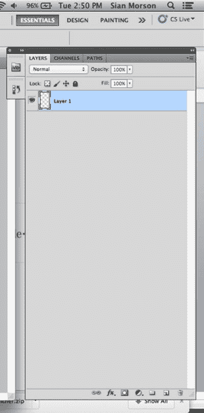

图 7-4：Photoshop 中的`Layers`面板

在`Layers`面板中，你可以更改每个图层的偏好和属性，例如给定图层的透明度和不透明度。

图层是你在 Photoshop 画布上创建的任何东西的构建块。如果你的应用非常复杂，那么你将拥有相当多的图层。养成命名图层并确保它们遵循应用自然结构的习惯。也就是说，当你打开主文件并查看设计时，你的图层应该很容易与你的设计相对应。你需要为图层命名，使其与设计内容对应。

例如，这能让编辑和你的开发者查找图层变得更加容易。Photoshop 会为图层命名，但方式并不直观（例如，图层 1、2、3 等）。如果你有一个包含大量图层的文件，并且这些图层名称与设计中的实际元素不对应，那么找出需要编辑的图层将花费大量时间。当图层数量开始增加时，你会发现为它们命名是最简单的方法。

图层也可以分组。因此，如果你有几个与特定元素（如标签栏）关联的图层，你可能希望将这些图层分组或放入一个文件夹中。这样，在开发或后期需要修改设计时，查找它们会更容易。

无论你从互联网上找到的模板中挑选元素（有很多这样的模板）还是自己创建，都要确保这些元素是矢量形式。矢量可以根据你的喜好进行缩放和调整，而不会损失质量。在 Photoshop 中，矢量被称为形状图层。当你开始从 Retina 屏幕缩放到非 Retina 屏幕时，你就会看到它们有多有用。

### 创建注册/登录页面

为了我们`Travel Light`应用的目的，我们将保持设计相当简单。我们的第一个屏幕将是应用的注册或登录屏幕。虽然简单，但这个屏幕非常重要。它是用户与应用的首次接触。因此，品牌颜色也需要在这个屏幕上显现出来，所以请明智地选择你的背景颜色。如果你已经有了一个配色方案，这可以为你节省数小时的猜测和尝试不同颜色组合的时间。如果你知道用作基础颜色的颜色，一个简单的组合调色板的方法是改变基础颜色的色相和亮度来创建一些变体。为此，你需要在 Photoshop 中打开颜色选择器窗口。通过单击`Tools`面板底部代表前景色或背景色的任何颜色色板，可以访问颜色选择器面板。在那里，你可以选择十六进制代码或使用选择器通过视觉选择颜色。你还可以从此处调整饱和度或亮度。我在下面的图 7-5 中展示了颜色选择器。

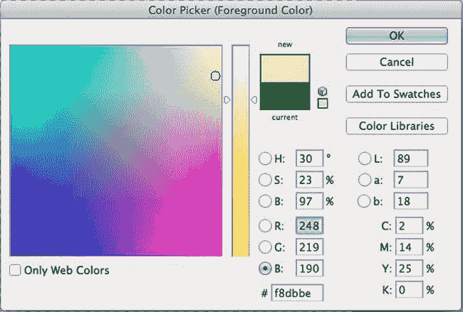

图 7-5：在 Photoshop 中选择颜色

出于`Travel Light`应用的目的，我们选择了一个非常粉彩风格的配色方案。注意上面截图中的设置。我们将使用这种颜色作为背景，另一种颜色作为`Travel Light`应用的前景色。

一旦背景设置好，我们将其标记为背景并锁定，以便我们可以在该图层之上自由移动。在定位元素时，你不希望它移动太多。然后，使用形状工具绘制代表输入字段（包括电子邮件登录和密码）以及提交按钮的形状。

你不希望用太多信息让用户不知所措。你的目标是收集他们的信息并让他们尽快进入应用。保持简单。首要任务是让用户知道如何访问应用。根据我们的线框图，我们正在创建一个简单的注册页面，允许用户输入他们的电子邮件地址和密码，然后提交该信息以访问应用。

图 7-6 中的屏幕分别展示了带网格线和不带网格线的设计页面。你可以选择使用或不使用它们。你可以通过以下路径打开或关闭它们：`View` → `Snap To`。你可以看到网格线如何帮助对齐屏幕上的所有元素。图 7-7 中的屏幕显示了包括`Tools`菜单在内的整个画布，以便你可以看到我如何命名对应于该页面的图层。

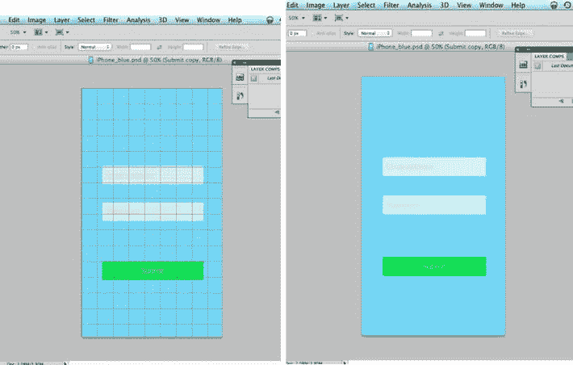

图 7-6：带网格线和不带网格线的登录屏幕

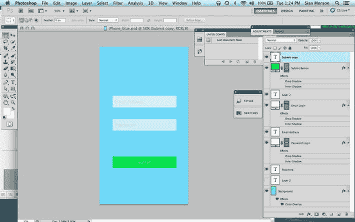

图 7-7：`Travel Light`登录屏幕画布

我们刚刚为`Travel Light`应用创建了第一个页面，主要通过使用矩形工具创建了两个字段和一个按钮。以下是我设置画布并创建背景后采取的步骤：

创建电子邮件和密码字段：

1.  创建一个新图层并将其命名为“Email address”。
2.  使用矩形工具绘制一个代表电子邮件地址字段的矩形。网格线将帮助你确保字段宽度合适，并且如果打开了智能参考线，它们将帮助你将其居中在屏幕上。
3.  使用参考线帮助你在屏幕稍高的位置垂直对齐电子邮件字段，为第二个字段留出空间。
4.  为字段选择一种颜色，并将图层命名为“Email”。
5.  选择文字工具并在矩形中输入“Email address”。
6.  根据需要调整字体大小和颜色。
7.  通过右键单击并选择菜单中的“Duplicate layer”来复制图层。Photoshop 将创建一个名为“Email address copy”的新图层。
8.  双击标题将其更改为“Password”。
9.  使用移动工具移动新字段。将其稍微向下定位，确保与上面的字段对齐。
10. 选择文字工具，在矩形中输入“Password”以替换“Email address”。
11. 创建另一个图层副本并将其命名为“Submit”。
12. 重复上述步骤，为按钮赋予独特的颜色和标签。

按钮的颜色应该让人一看就知道是可操作的，即使标签没有明确说明。我选择了亮绿色（#12e30d）作为提交或登录按钮的颜色。

水平文字工具用于输入字段和按钮的标签。使用文字工具出现时显示的`Properties`面板来更改字体的字体、大小和颜色。

如果你的应用主页屏幕有更多字段，那么添加并标记它们。别忘了添加一个操作按钮。尝试不同的颜色组合来打造你的应用品牌，并使其与下层页面保持一致。

**提示**：如果在为应用构思配色方案时遇到困难，可以使用我在本书前面提到的一些资源。

### 创建选择和编辑行程页面

现在，让我们进入一个包含更多元素的页面。


我们接下来要聚焦的页面是“选择行程”和“编辑行程”页面。这些页面允许已录入行程的用户从应用的列表视图中选择相应行程。从用户体验角度来看，这里的前提是用户已将自己的常用行程详情录入应用。因此，用户接下来合乎逻辑看到的屏幕，应该是一个显示其行程列表的界面。在这个界面上，用户应能深入查看每个行程的详情，或编辑行程列表。我们将创建这两个页面。

从空白画布开始，像我们之前制作登录/注册界面那样，用背景色填充屏幕。我们在图 7-5 和图 7-6 中创建的登录页面实际上缺少状态栏，因此我们将在此屏幕及后续所有屏幕中添加它。iOS 7 允许您自定义状态栏，因此可以将其设置为透明，从而让导航栏的颜色透出来。后续页面将保留状态栏，因为用户希望看到状态，并且保持状态栏可见（除非极少数情况）是最佳可用性实践。由于这是一款效率应用，我决定在用户通过注册页面后，保持状态栏可见。

您会注意到，“我的行程”页面是一个简洁的页面，顶部是地图，下方是供用户选择的行程列表。

我是通过从 Applidium 的 PSD 格式 iOS 7 模板中提取一些元素来创建这个页面的。该模板包含许多 iOS 7 中的新 UI 元素，可以简单地从模板 PSD 中提取一个图层并添加到当前工作中。对于图 7-8 中的设计，我导入了“我的行程”页面上的撰写按钮，以及“编辑行程”页面中每个行程左侧的控件。具体操作是，选择该图层并右键单击以显示更多选项。然后，选择`合并图层`，并选择当前正在处理的文件名称，将图层组添加到当前画布中。合并图层会使它们在导入后无法编辑。因此，除非您打算按原样使用一组图层或一个图层而不做任何编辑，否则最好选择图层组并在不合并的情况下导入。

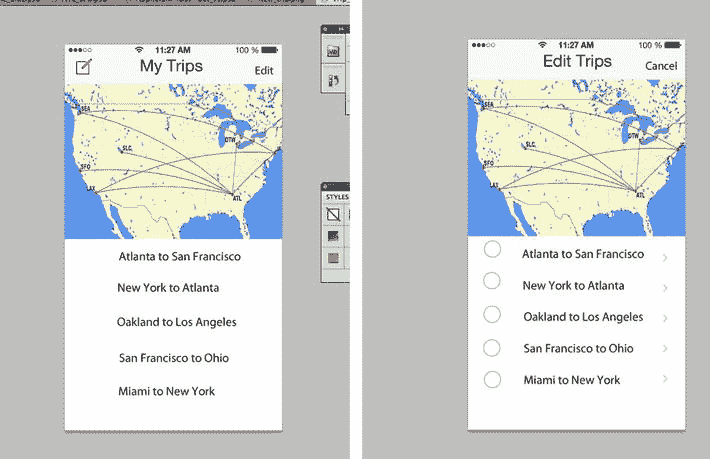

图 7-8. 行程列表与编辑行程界面

图层导入后，您应该就能在当前文档中对其进行操作了。如果您已将其转换为智能对象，操作会变得非常简便，因为现在您可以调整其大小以适应设计需求。

**注意** 智能对象是一种包含来自位图或矢量图像数据的文件。它允许用户编辑文件，同时保留其源内容。

我从一次普通的谷歌搜索中导入了地图图像，此图仅供说明之用。表格视图中每个项目右侧的箭头均直接来自模板。在行程菜单中选择任何项目，都会将用户带到该页面的详细视图。我为“迈阿密到纽约”的行程创建了一个页面，以展示其效果。由于此页面与上一级父页面在视觉上差异不大，我将上一页面作为模板用于图 7-9 中的后续页面，并更改了菜单项。与“我的行程”页面类似，屏幕右上角的“编辑”按钮会调出表格视图中每个单元格的删除控件。这些项目将通过编程方式添加，但我已在“编辑行程项”界面中将其加入设计，供您参考。点击“取消”按钮将使用户返回到“迈阿密到纽约”主行程页面。每个菜单项左侧的控件均来自 Applidium 的 iOS 7 PSD。

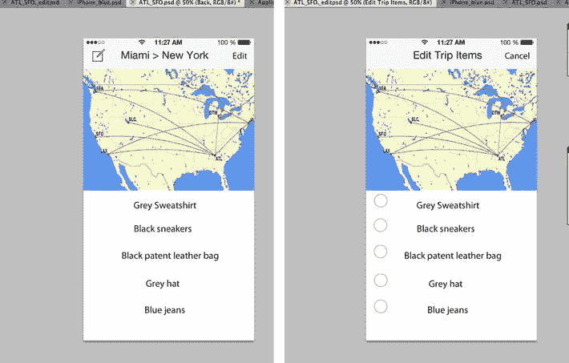

图 7-9. 项目列表与项目编辑界面

### 使用图层复合进行屏幕布局

图层复合是一个极佳的工具，可用于布置 iPhone 应用屏幕的各种版本。图层复合允许您在完成设计后，保存图层的可见性、位置和外观。这对设计师来说是一个很棒的工具，因为它省去了记住应用于特定设计的所有不同样式的麻烦，也无需将每种样式另存为包含多个图层的独立 PSD 文件。您可能知道，包含多个图层的 PSD 文件会变得相当大。如果您正在为某个设计或屏幕创建多个变体，并需要呈现给客户进行审核，那么这是一个非常实用的功能。创建图层复合相当简单。

1. 在 Photoshop 中，从画布顶部的`窗口`菜单向下滚动，选择`图层复合`选项。这将打开图层复合窗口。
2. 在该窗口中，选择窗口底部的新建图层图标。图 7-9 中的截图显示了一个包含我们设计的窗口，以及图层复合窗口，还有悬停在“新建图层复合”图标上的指针。
3. 在完成设计的每个变体后，点击`新建图层复合`图标。这将弹出一个窗口，允许您为复合输入名称。
4. 您还可以选择保存设计的可见性、位置或外观（图层样式）。勾选所有适用的选项，添加任何必要的注释或说明，然后点击`确定`。这样您就保存了图层复合。

任何额外的更改都可以以完全相同的方式保存为图层复合。

当您最终确定哪些图层样式适用，并准备好进行开发时，图层复合可以轻松导出为您选择的文件格式以供审阅，或者如果需求如此，每个复合也可以导出为独立的 PSD。此操作可通过选择`文件``脚本``将图层复合导出到文件`来完成，如图 7-10 所示。

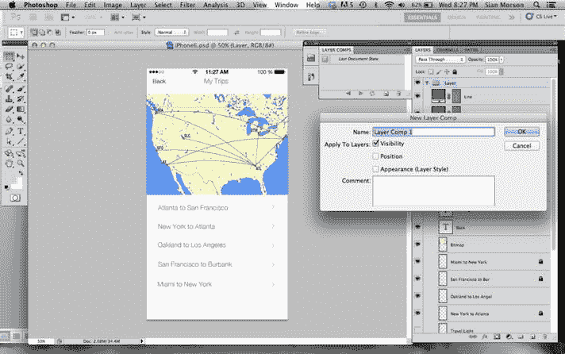

图 7-10. 创建图层复合

#### Adobe Fireworks 怎么样？

设计界可能有人现在会提出上述问题。一些设计师是 Adobe Fireworks 的热烈支持者和粉丝，这是 Adobe Creative Suite 中的另一款图形软件工具。然而，最近（确切地说是 2013 年 5 月），Adobe 宣布将不再为 Fireworks 添加新功能。虽然它将继续在 Adobe Creative Suite 6 和 Creative Cloud 中包含 Fireworks 并进行销售，但将不再投入工程时间或人才对该软件进行改进或额外升级。不过，Adobe 仍将继续支持该软件。话虽如此，对于为 iOS 应用创建设计而言，Fireworks 是一个值得推荐、比 Photoshop 更简单的替代方案。Fireworks 的结构与 Photoshop 类似，用户界面也很相似。正如下面的截图所示，如果您熟悉 Photoshop 界面，那么 Fireworks 会让您感觉异常熟悉。下面的截图是我们在 Fireworks 中打开的 Travel Light 应用屏幕详情页面的 Photoshop PSD。Fireworks 的一大优点是它能够读取和写入 PSD 文件以及其他图形格式。

Adobe Fireworks 作为原型设计和导出的出色工具而享有盛誉。因此，如果您在 Photoshop 中完成了设计，需要切图并将其导出为 PNG，那么 Fireworks 将很好地辅助您完成此操作，并确保导出的文件可直接在 Xcode 中使用。


使用 Adobe Fireworks 的另一个优势是，您创建的任何对象都是矢量格式。当您需要以任何理由缩放资源时（并且您需要为旧版 iPhone 进行缩小），这将大有帮助。您会发现这也适用于效果和滤镜。随着扁平化设计减少了对一些复杂效果的使用，这可能不是一个特别重要的问题，但如果您需要使用它们，这将派上用场，并且在 Fireworks 中能更好地使用并轻松缩放。

如果我们将 图 7-11 中的 `PSD` 导入到 Fireworks，我们可以像在 Photoshop 中一样继续编辑它。在我看来，Fireworks 的界面稍微简单一些，也更用户友好一些。因此，您可以在 Fireworks 中完成设计，也可以在任一程序中创建整个设计并获得类似的结果。

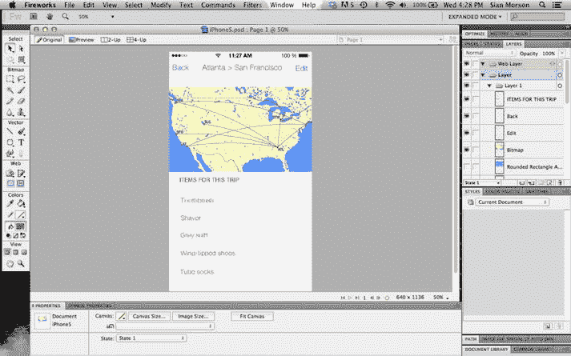

图 7-11. Adobe Fireworks 中的 Trip List PSD

通过本章概述的技术，您应该能够为 iOS 创建一个简单的设计。您暂时不会成为一名资深的 iPhone 设计师，但只要稍加练习并运用我上面使用的流程，您应该能够创建应用中的大部分页面。

### 总结

Adobe Photoshop 是当今数字设计的事实标准。可以说，这个图形程序是所有应用设计的根基。为了设计应用，您需要学习如何使用 Photoshop。它较少被使用的表亲 Adobe Fireworks 也能胜任工作，但 Adobe 将不再对其提供支持。如果您希望被认真对待为一名设计师，您需要熟练掌握 Photoshop。Photoshop 和 Fireworks 都是设计应用的好工具。如果您觉得其中一个更易用，您的 `PSD` 文件也可以在这两个程序中通用。两者都来自 Adobe，并拥有各种工具来简化设计过程。探索 `Tools` 面板将帮助您熟悉创建应用界面所需的工具。另一个您需要关注的界面是 `Layers` 面板。请务必以直观的方式命名图层，因为您的设计很可能会产生大量图层。如果您要创建多个屏幕或应用的不同版本来展示给客户，`Layer comps` 将非常有用。

## 第 8 章. 创建应用图标和 App Store 所需的其他图形

到目前为止，您已经基本完成了应用设计的整个流程，并将其交给开发人员进行开发。虽然您可以将应用图标与其他开发资源一起添加到程序包中，但应用图标是您可以独立关注的事情。作为一项规则，您的应用应具备一定程度的精致度。

虽然我们之前讨论过与应用中其他区域（例如标签栏和界面）相关的图标，但我创建本章的目的是专门讨论图标以及最终需要交付给 Apple 的应用包中包含的其他图形。正如我们所知，Apple 非常重视美学设计。可以说，您的应用不仅应遵守《人机界面指南》中规定的界面标准，还应该美观。对应用设计施加的严格准则是存在原因的。这些准则也延伸到了应用图标的设计，而应用图标是用户在 App Store 中发现您应用的主要方式。它在 App Store 的多个不同位置被使用。在本章中，我将讨论 iOS 应用所需的其他图形。这些包括宣传图、应用图标、截图以及应用在 App Store 中的页面。如果您的应用是杂志类应用，这还包括报摊图标。这些用于向潜在客户展示您的应用。一个精心设计的图标和精心挑选的截图，可能意味着潜在客户会下载您的应用还是忽略它。

### 应用发现

应用发现过程非常简单。用户有几种方式可以了解到您的应用。如果您足够幸运获得媒体报道，他或她可能会在一篇文章中了解到您的应用，或者通过 `148Apps`、`Appolicious` 或 `AppCraver` 等众多应用评测网站。这些网站追踪新版本发布，并对几乎所有可用类别的应用提供深入评测。如果您希望在基于特定标准下载前了解某个应用的信息，这些网站会很有帮助。这些网站很受欢迎，并且通常拥有忠实的追随者。它们也很棒，因为它们能提供有关降价的信息。

> **提示**：开发者有时会针对付费应用提供特殊促销活动，并在一段时间内降低购买价格。这些促销活动被称为“降价”，可能在没有预警的情况下开始和结束。

虽然评测网站和文章是了解新应用的好方法，但也许最久经考验的发现应用方式之一，就是浏览 Apple 自己的 App Store。

### App Store

App Store 不仅仅是一个商店。它实际上是 iOS 应用的数字分发平台。虽然“App Store”这个术语现在也适用于 Mac App Store，但基于本书的目的，我们将专注于 iOS App Store。App Store 为所有 iOS 设备分发应用，是用户购买和下载 iOS 应用的主要渠道。

App Store 应用已预装在每台 iOS 设备上。该应用将用户直接连接到商店，并方便他们购买应用。它还与 `iTunes Connect` 以及用户的 `iTunes` 账户相连。

> **提示**：`iTunes Connect` 是面向 iOS 开发者的一个 Web 门户。它允许他们管理其应用的不同版本、报告以及与其应用关联的所有元数据。

如您所知，用户必须拥有 `iTunes` 账户才能在其设备上购买应用。`iTunes` 和您的 `Apple ID` 将允许您访问 `iTunes Connect`，并将您的应用提交给 Apple 以供审核，然后分发到 App Store。用户将能够通过 App Store 应用将您的应用直接下载到他们的设备上。App Store 应用已包含在每台 iOS 设备上，并通过其独特的图标识别，该图标以“A”字形排列着画笔、铅笔和尺子。更新后的扁平化图标如 图 8-1 所示。

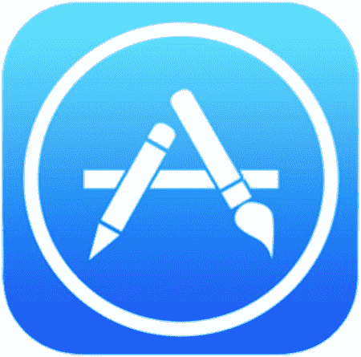

图 8-1. iOS 7 中 App Store 图标的新外观


App Store 已经处理了超过 500 亿次应用下载，并拥有 5.75 亿个商店账户。要对所有这些应用进行排序需要花费一些时间。随着商店中应用数量的增加，Apple 多年来一直在对 App Store 的导航便捷性进行细微改进。例如，增加了“编辑推荐”等类别，更突出地展示“精选”应用，将应用“合集”分组，甚至可以在 App Store 中找到万圣节或圣诞节等节日主题的应用。最近，一个专门为`iOS 7`设计的应用类别被添加进来。自其发布以来，这个应用选集一直在 App Store 中突出显示。

所有已提交并通过 Apple 审核的应用都会出现在 App Store 中。

要将您的应用提交到 App Store，您需要以下素材：

*   App 图标
*   启动图像
*   报刊亭封面图标（如果应用属于该类别）
*   屏幕截图
*   宣传图

App 图标、启动图像和报刊亭封面图标都包含在应用包中。应用包是由 Xcode 创建的一个包，其中包含您的应用可执行文件以及所有支持资源，包括 App 图标、图像文件等内容。

### App 图标

App 图标是用户首先看到的，将代表您的应用。它会在设备的主屏幕以及 App Store 中代表您的应用。App 图标是必需的，提交的应用如果没有它将被拒绝。虽然《人机界面指南》中提到的一些图标和图稿是可选的，但 App 图标不是。

如果您正在创建一个要提交到 App Store 的新应用，那么您应参考《人机界面指南》，以了解所有设备的 App 图标、Spotlight 搜索结果图标和“设置”图标的最新尺寸和要求。

您可能会认为，由于尺寸限制，App 图标几乎没有发挥原创性或创造力的空间。那您就错了。有专门展示精美设计 App 图标的网站和图库，像 Dribbble 和 Behance 这样的网站上，来自各个领域的设计师和创意人员会发布 App 图标的概念图和真实设计方案。学习并回顾一些设计，以为您的应用图标寻找灵感。除了尺寸要求外，您的 App 图标必须有助于向潜在用户直观地传达您的应用是关于什么的，同时尽可能包含诸如品牌等额外信息。就像您的应用一样，您对颜色的选择也会影响用户。因此，必须明智地选择颜色。您的 App 图标必须是独特的，因为它必须在众多争夺潜在用户注意力的应用中脱颖而出。您可以深入查看 App Store 中专门为`iOS 7`设计的应用部分，并仔细研究其中的一些图标。其中一些可能会在设计您的 App 图标时给您带来灵感。

Apple 为设计 App 图标提供了许多指导原则。以下是直接摘自《人机界面指南》的注意事项。

**应该：**

*   如果可能，寻求专业平面设计师的帮助
*   确保您的用户能轻松识别图像
*   保持简洁，避免使用文字
*   在多种不同背景上测试
*   避免透明
*   确保它在所有尺寸下都能良好缩放且清晰易读

**不应：**

*   使用 iOS 或 Apple 元素
*   使用任何 Apple 图像

与`iOS 6`相比，`iOS 7`中 App 图标的新形状差别细微。肉眼可能注意到也可能注意不到图标圆角半径的差异。说实话，对于设计师来说，这没什么大不了的，因为 iOS 会自动添加一个遮罩来为 App 图标应用圆角效果。然而，关于`iOS 7` App 图标的新设计一直有很多猜测。人们编写了数学公式，也对其新图标背后的含义进行了大量猜测。在这个关头，对任何设计师来说最重要的是确保图标向用户传达了它需要传达的信息。App 图标还必须能在多种不同背景以及所要求的各种尺寸下都呈现最佳效果。

### 启动图像

启动图像是当您的应用启动时 iOS 显示的图像。您必须在应用包中至少包含一个启动图像。用户在实际开始与您的应用交互之前，只能短暂地看到启动图像。可以这样理解：如果您的应用启动很快，启动图像会在设备屏幕上一闪而过，然后直接将用户带入您的应用。如果您的应用加载时间较长，那么用户看到它的时间也会更长。如果您这样想，就能为您的应用构思出更好的启动图像。如果您是用户，在进入应用之前您想看到什么？Apple 还建议在启动图像上避免任何形式的欢迎词、介绍或关于页面。

有些设计师甚至让他们的启动图像与应用初始页面完全相同。这给人以应用已快速加载的印象，是一些设计师和开发者也会采用的做法。

Apple 在《人机界面指南》中建议制作一个与应用初始页面相同但无文字或 UI 元素的启动屏幕。这样，当您的应用实际加载时，启动图像和您的应用之间就不会有突兀的视觉过渡。

最后，所有启动图像都必须包含状态栏区域。启动图像尺寸建议列于表 8-1 中。

表 8-1。所有设备的启动图像尺寸

| 设备 | 尺寸 |
| :--- | :--- |
| 适用于 iPhone 5 系列（iPhone 和 iPod touch） | 640 x 1136 px |
| 适用于 iPhone 和 iPod touch | 640 x 960 px |
|  | 320 x 480 px（标准分辨率） |
| iPad 竖屏 | 1536 x 2048 px |
|  | 768 x 1024 px（标准分辨率） |
| iPad 横屏 | 2048 x 1536 px |
|  | 1024 x 768 px（标准分辨率） |

### 报刊亭封面图标

如果您的应用属于报刊亭类别，则其图标有特定的规则。您的图标将与其他杂志和刊物一起显示在报刊亭应用中。由于这些应用的显示方式，Apple 为这些图标制定了不同的规则。您的报刊亭封面图标与 App 图标是分开的，因此请务必不要混淆两者。报刊亭封面图标应为您实际杂志或期刊某一期封面的复制品。它用于在报刊亭应用中标识您的应用，而您的 App 图标通常用于在 App Store 中标识应用。保持报刊亭图标具有通用性，不要太具体，但请记住，您绝对希望用户看到封面就能识别出您的杂志。因此，保持字体和布局与杂志普通读者的预期一致，但省略任何季节性或者特定于某一期的细节。图 8-2 展示了 App 图标和报刊亭图标的外观，以及它们之间的区别。

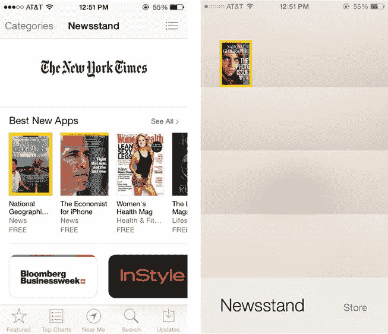

图 8-2。App Store 上的报刊亭部分以及 iPhone 上的一个应用

请参考《人机界面指南》以获取具体说明，因为需要遵守特定的尺寸和宽高比要求。


#### 封面图标

除了默认的封面图标外，你还需要准备一个独立的期刊图标，该图标不仅会在书报架的“货架”上显示，还会在各种设备的多任务栏中作为每一期新内容的视觉标识。与默认封面不同，此图标可以包含关于该期内容的特定细节，方便用户识别。与其他图标一样，请勿为新闻报刊图标添加任何视觉修饰或增强效果。明确禁止添加如圆角、页面或透视效果等外观上的增强设计。

### 宣传截图

应用的截图是你在 Apple App Store 中进行推广的重要组成部分。截图会与应用元数据、描述和应用图标一同显示在应用页面上。截图并非应用包的一部分，但在通过 `iTunes Connect` 提交应用时至少需要提供一张。如果你只能提供一张应用截图，请确保这是最精彩的一张。虽然提交和通过审核只需一张截图，但我建议你尽可能多地添加截图——据我上次了解，Apple 允许最多添加五张。五张截图已经足够，通过这些截图，你可以让用户充分了解应用的界面风格，以及他们下载后能够期待的内容。

此外，截图的顺序也很重要。它们将按照上传的顺序显示，因此按顺序展示用户与应用的交互流程，是让用户了解你的应用及其最重要或最吸引人的功能的好方法。截图还能在很大程度上提升应用在 App Store 中的可发现性。如果你的应用只有一张截图（按规定的最低要求），用户将无法充分了解应用的界面。在如今众多应用不断突破设计界限的时代，尽可能多地添加截图，能让用户清楚他们投入时间和金钱（如果应用不是免费的话）下载后能得到什么。

如果你的应用在视觉上独具特色，或包含创新功能，也可以提供该页面或功能的截图。如果应用是通用应用，可在 iPad 上运行，你需要在提交应用时同时提供 iPhone 和 iPad 上的截图。

你的截图应为高质量文件，画面应清晰锐利。Apple 文档规定，如果你从运行应用的实体设备上截取截图，上传前应移除状态栏。不过，快速浏览一下 App Store，会发现不少应用的截图仍包含状态栏。似乎这并不会导致应用被拒绝上架。然而，App Store 仅接受以下格式的截图：`JPEG`、`TIFF` 或 `PNG`。图 8-3 展示了 Travel Light 应用的两张截图，分别包含和不包含状态栏。

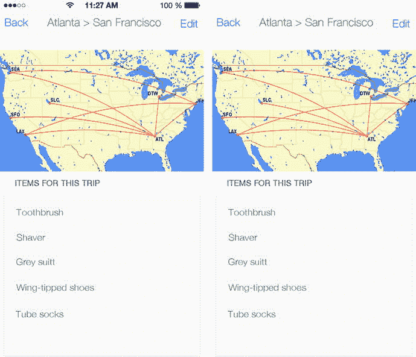

图 8-3。右侧的图片符合提交给 App Store 的要求，左侧的则不符合。

iOS 设备的用户熟悉手动截取截图的方法，即同时按住 Home 键和电源键。如果你熟悉 `Xcode` 且拥有一个可编译运行的应用版本，也可以通过此方式截图。这些截图同样适用于 App Store。

以下是截图的注意事项。

#### 应做到：

*   确保内容在所有尺寸下都清晰可读
*   为你的应用上传最大数量（5 张）的截图
*   使用你的设备截取应用截图
*   移除所有截图中的状态栏
*   考虑应用图片在不同国家和文化背景下的适用性
*   如有必要，对截图进行本地化处理

#### 不应做：

*   在截图中添加营销信息
*   在图片周围添加设备边框

#### 宣传素材

如果你的应用在执行和设计上表现出色，Apple 可能会决定在 App Store 中对其进行推荐。如果你认为自己的应用有可能被 Apple 选中进行推荐，或者觉得胜算较大，那么提前创建宣传素材是个好主意。即使你认为自己的应用没有机会，养成为应用创建宣传素材的习惯也是好的。宣传素材允许你在图像中注入一些创意，为用户呈现应用背后的视觉故事。不过，一旦素材被添加到 App Store 中，最终效果将由 Apple 决定。

除非你事先有所了解（这很少见），否则这类请求通常是突如其来的，并且通常伴有截止日期。因此，有备无患总好过临时抱佛脚。

虽然 Apple 推荐应用并没有确定不变的公式，但可以肯定的是，你的应用必须设计精良，具有独特的外观和感觉，才有可能被推荐。如果你的应用下载量很大且非常受欢迎，这有时会有所帮助。但大多数情况下，Apple 寻找的是在形式和功能上都极具吸引力的应用。你的应用必须独树一帜，并能提升平台水准。应用图标也是引起 Apple 注意的重要因素。《人机界面指南》明确指出，要想获得推荐资格，你的图标必须原创且富有吸引力。

每周关注一下当前被推荐的应用，尝试了解它们为何受欢迎。同时注意 Apple 如何推广各种应用，以及这些推广区域在 App Store 中的呈现方式。Apple 可能会将你的应用与其他类似应用放在同一类别中推荐，或在 App Store 的多个区域进行展示。

如果你收到了提供宣传素材的请求，这通常是一个好迹象，表明你的应用将被推荐，但 Apple 明确表示这并不能保证任何结果。他们清楚说明的是，当提出此类请求时，他们期望从应用创建者或所有者那里得到什么。

由于 Apple 自己的团队将创建所需的文件，他们要求你发送分层的 `PSD` 文件。每个 `PSD` 文件必须为各种元素单独设立一个图层。如果某些元素必须保持在一起，将它们放在一个图层中是个好主意。如果你的应用被选入 App Store，Apple 的设计团队不会就他们对文件所做的任何更改征求你的意见。因此，将必须保持在一起的元素放在一个已合并的图层中，可以清楚表明哪些元素可以移动，哪些不应移动。与所有必须提交给 Apple 的材料一样，宣传图片也必须遵守严格的指南。以下是宣传素材的一些规格说明：

*   任何背景艺术图至少应为 3200 像素宽、600 像素高，分辨率最低为 72 dpi。背景艺术图应为 RGB 色彩，且仅限 `PSD` 格式。
*   你的素材不应在标签区域包含文本或徽标。该区域专用于与 `iTunes` 相关的标签。标签区域本身位于素材底部上方 200 像素处。
*   任何文本或徽标只能出现在素材中心的文本/徽标安全区域内。
*   标题处理区域应为 2004 像素宽、586 像素高。

### 你的应用页面

当你的应用准备好提交至 App Store 时，你需要为你的应用页面填写相关信息。你需要提供以下信息：

*   你的应用名称
*   类别
*   分级（非用户评分，而是目标年龄段的分级）
*   描述
*   关键词
*   截图
*   支持网址
*   营销网址（可选）
*   隐私政策（可选）
*   联系信息


好的，作为一名高级文档工程师和翻译员，我将严格按照您提供的注意事项和示例，将给定的英文文本翻译成中文。


如果您的应用是游戏、包含内购、使用 iAd，或涉及版权和定价，则需要填写额外的信息。

当您的应用提交至 App Store 并被接受后，它会获得专属页面和 URL。苹果批准您的应用后，您会收到一封电子邮件，告知应用已准备就绪，并附带相关详细信息。我收到的一封示例邮件如图 8-4 所示。邮件中将包含您的应用 ID，以及应用在 App Store（如果已上线）的页面链接。应用的唯一 ID 是 URL 的一部分。该链接将跳转至您的应用页面，您将在其中看到以下内容：

*   应用的大图标
*   应用功能的描述
*   截图
*   销售者信息
*   用户评分和评论
*   必要时提供的本地化截图

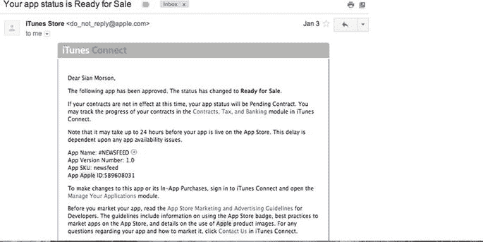

图 8-4 应用获批后来自苹果的“准备就绪”邮件

**提示** 如果应用是通过您的开发者账户注册的，您将在应用审核流程的每个阶段都收到苹果的电子邮件通知。

如果您的应用未获批准，您同样会收到苹果的邮件，说明未批准的原因，以及您可以采取的上诉步骤。

总结

虽然应用及其用户界面的设计对用户很重要，但在营销您的应用及其在苹果 App Store 中的位置时，应用图标和其他必需的图形也同样重要。苹果为创建应用图标、推广素材和截图提供了指南，这些资源在应用获批后都会显示在 App Store 的应用页面上。在开发应用设计时，最好将这些辅助图形牢记在心，因为它们可能决定用户是下载您的应用，还是快速划走。

第 9 章

为应用开发最终确定素材

完成上一章后，您应该已经为应用设计了所有必要的页面和屏幕，并以图层分组且命名恰当的方式创建了它们。如果幸运的话，您还可能已经收到了所有相关方和利益相关者的反馈或批准，可以继续应用开发了。到目前为止，您应该对用户应如何与您的应用交互有了清晰的概念。现在需要的只是为开发人员准备这些素材。

如果您从一开始就按照本书的指导进行操作，那么您已经基本准备好完成整个流程了。应用设计流程中最困难的部分已经完成，您现在可以将设计交给开发人员进行编码。这一步本身也有一套需要遵循的步骤。如果您对这个过程有一定了解，或者之前执行过其中一些任务，您可能会觉得它不像某些设计人员认为的那样繁琐。

主要任务包括：

*   为开发人员创建设计规范文档
*   将设计切分为资源文件
*   将资源文件保存为适用于不同设备的多种尺寸
*   为资源文件命名
*   打包资源文件以供开发使用

有些开发人员熟悉 Photoshop，可以自己切分资源文件。如果您是开发人员（你们中的一部分人可能是），您可能熟悉也可能不熟悉 Photoshop 以及如何在 Xcode 中为 iOS 开发导出图像。本书和本章节假定您需要为开发人员切分屏幕中的所有元素。不过，我不会讨论如何在 Xcode 中准备资源。

为开发人员创建设计规范文档

如果您将素材交给开发人员，创建一个参考文档或规范文档总是一个好主意，该文档应包含开发人员开始开发您的应用之前需要了解的所有信息。该文档应提供尽可能多的信息，而不是可能不足，并且应尽可能清晰无误。

有时，在设计人员眼中一目了然的事情，对开发人员来说并非如此简单。设计规范文档有时可以像一封电子邮件或一份单独的文档那样简单，但它是流程中必要的一部分，并且对于确保您的应用外观和行为符合预期大有裨益。设计规范文档应与应用的最终素材一起交付。此外，与开发人员面对面审阅设计规范文档也是一个好习惯，以确认是否有任何需要澄清的地方。我将在本章后面的“沟通是关键”部分更详细地讨论这一点。

设计规范文档概述

从项目、应用及其预期用途的概述开始撰写文档。这不需要非常详细；一两句话就足够了。如有必要，可以从最终版本的应用初始陈述中摘取。如果您是与未参与应用设计和构思的开发人员或团队合作，概述陈述会很有帮助。通过提供概述，您可以向开发人员提供对应用目标受众及其使用方式的宝贵见解。

然后，您的规范文档应引导开发人员从头到尾、一个屏幕一个屏幕地了解您应用的细微差别。作为设计人员，您需要特别注意那些具有特效或可能需要独特动画或操作（仅凭设计无法展示）的屏幕。如果需要在文档中解释特定屏幕的工作方式，请大量使用注释。注释在描述过渡效果时也非常有用。

提供颜色信息

文档还应包含关于整个应用中使用颜色、明暗或色调的任何必要说明。尽可能提供颜色代码，因为这是您能为开发人员提供的最精确的颜色信息。您不希望开发人员猜测应用中的颜色，或者不得不在 PSD（Photoshop 文档）的层层图层中挖掘以找到确切的色号。

指定字体与字号

应用中使用的字体和字号信息也应包含在设计规范文档中。开发人员需要知道字体的名称（即使是 iOS 系统字体）。让开发人员了解应用中各个屏幕所使用的字体大小也很重要。虽然`Helvetica Neue`是 iOS 的默认字体，但还有许多其他受支持的字体。像`iOSfonts.com`这样的网站列出了 iOS 支持的字体，但最好还是直接查看来源，查阅苹果的字体列表以确保无误。苹果同时提供了 iOS 6 和 iOS 7 的字体列表。这些列表包含两个系统版本中安装的所有字体，以及在必要时可由应用下载的字体列表。

**提示** 系统字体是 iPhone 或其他 iOS 设备上用于显示菜单设置和标签文本的默认字体。iOS 7 允许用户更改其系统字体。

说明用户交互

如有必要，添加任何需要澄清的用户交互细节。例如，如果应用的一个屏幕包含多个控制器并需要多种不同的手势，这些都需要在设计规范中概述出来。它应让您的开发人员了解，哪些用户交互（如果不是一目了然的话）应在您的应用中产生特定的结果。


一份编写良好的设计规格文档将简化从设计与构思开发到应用初始版本或 Alpha 版本的过渡，并且你的应用会看起来、用起来更符合预期。

我在图 8-1 中附上了一份设计规格文档页面的示例。你可能希望在规格文档中明确以下几点：

- 具有开启和关闭状态的按钮，以及它们各自的状态
- 所有按钮的标题和颜色（在交付给开发者之前，应将文本和类型从按钮中移除）
- 在特定区域使用的具体字体、字号和颜色

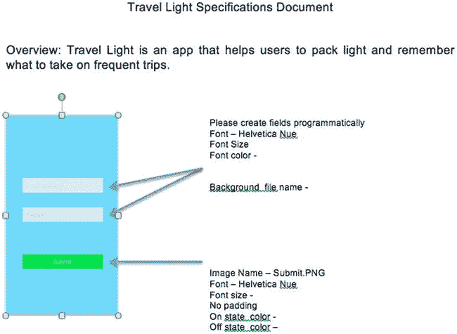

图 8-1。来自我们 Travel Light 设计规格文档的登录/注册页面示例

图 8-1 中展示的示例页面相当简单，但根据添加的细节多少以及应用的复杂程度，它很容易变得更复杂。理想情况下，你的设计规格文档应为应用的每个屏幕提供说明。虽然这些说明有时会以电子邮件的形式出现，但在交付给开发者的资源包中包含设计规格文档是一种良好且广为人接受的做法。

如果你正在开发自己的应用，养成创建此类文档的习惯仍然是一个好方法。如果将来需要移交资源，你会准备充分，并且你的开发者也会对此表示感激。与普遍看法相反，你的开发者希望获得尽可能多的细节。这有助于按照创建者、客户端以及最终用户的期望来构建应用。

#### 按钮

所有 iOS 应用都会有按钮。它们是用户与应用交互的主要方式。任何可轻点或按压的元素都可视为按钮，并且所有按钮都有状态。按钮的“开启”或高亮状态是用户在轻点按钮或与之交互时看到的。`"off"`或正常状态是用户在与按钮交互之前通常看到的。有时还会使用第三种状态，即非活跃状态。这意味着按钮可能会显示在屏幕上，但在此状态下，用户无法使用它。如前所述，iOS 7 中的按钮没有边框，但它们仍然保留了大多数按钮所具有的属性。这意味着，除非它们是系统按钮，否则仍需要为其设计并提供状态。

在准备导出按钮时，所有资源的尺寸必须相同（状态除外）。这能让应用内的交互更流畅。至少，按钮的最终导出应包含所有适用的状态、字体和颜色的像素尺寸，以及与该特定资源相关的任何其他信息。如果该资源在应用的其他位置出现但看起来（甚至行为上）有所不同，那么你有责任解释这些差异，以便开发人员了解。

有些按钮可以通过编程方式创建。如果你希望开发者使用`Xcode`创建按钮，同样的规则也适用。开发人员需要知道按钮的确切尺寸、标签、文本或字体大小、颜色，以及用户与之交互时按钮的确切行为。

完成设计规格文档后，请与开发者一起审阅，以澄清任何未决问题。虽然你的文档可能包含尽可能多的细节，但有时，没有什么比面对面的交流更有效。

#### 按钮标题

开发者可以通过多种方式创建按钮。他们可能会也可能不会使用你提供的按钮资源来创建最终出现在应用中的按钮。这通常取决于几个因素，例如按钮是否带有渐变。这正是与开发者沟通能派上用场的地方。开发者可能会取图形中的一个像素，并通过编程方式重复该像素来创建按钮。这可以减少资源的整体文件大小，从而减小应用包的大小。

最佳实践是在将按钮资源交付给开发者之前，从中移除标题。除非字体无法以编程方式再现，否则只需提供图形，并在你的设计规格文档中提供关于按钮应关联的标题、字体、字号和颜色的详细说明。

#### 字体、字号、文件名和颜色

你的设计规格文档还应成为开发者查询按钮字体名称、字号和颜色相关问题的快速参考指南。设计文档时应遵循对你和开发者都直观的方式，并让所有内容易于查阅。一个很好的做法是包含应用的实际屏幕截图，按钮在其中的显示方式应与应用中的一致，并在页面附上图例，提供该屏幕上所有元素的相关信息：

- 资源文件名（包含所有状态）
- 字体名称
- 字号
- 十六进制颜色码或颜色值
- 在屏幕上的位置
- 任何需要与该资源关联的特定动作或动画

#### 将设计切片为资源

将资源切片以交付给开发者是资源最终化过程中最重要的任务之一。在此过程中，你将逐层切割`PSD`文件，为将存在于应用中的所有元素创建独立的文件。每个元素都必须被切片以创建一个唯一的资源，并保存为一个单独的文件。在这个过程中，注重细节变得至关重要。

资源最终化过程的另一个关键部分是缩放（请参阅下一节）。如果还记得的话，我们当初将设计尺寸设为`1136 x 640`以适配 iPhone 5、5c 和 5s 的`Retina`屏幕。如果你的应用旨在支持 iOS 支持的所有不同设备，那么你需要为每种设备提供不同的资源集。这包括 iPhone 4 和 4s。虽然这两款设备拥有`Retina`屏幕，但它们的尺寸与较新设备不同。

然而，iOS 的一大优点在于，如果你的应用旨在所有这些设备上运行，开发者可以将所有这些资源放入一个应用包中，操作系统会自动引用适当的文件，以在相应设备上显示。用于`Retina`屏幕和设备的资源需要在文件名的根名称后附加`@2x`。稍后我会更详细地讨论命名约定，但这是一个标准做法。

每个设计师都会有自己喜欢的切片图像的方式，这通常是基于个人偏好。

在本章中，我将详细说明切片和缩放过程中的每一步。我自己用于导出`Retina`资源的步骤是：

- 选择图层（所有状态）
- 转换为智能对象
- 保存为`PNG-24`
- 名称后添加`@2x`

对于非`Retina`资源，步骤如下：

- 打开`Retina`智能对象
- 更改分辨率并缩小至一半尺寸
- 保存为`PNG-24`
- 名称**不**带`@2x`

如果下面概述的流程不适合你，请在`Photoshop`中试验，找到适合你工作流程并满足你需求的方法。要切片你的资源：

1.  打开你将操作的`PSD`文件。
2.  选择你首先想要切片的资源，然后选中与该资源关联的所有图层，包括所有状态（如开启、关闭等）和效果——如果它恰好是一个动作项（例如按钮）。


为了便于说明，我选择了 Travel Light 应用程序中的“提交”按钮作为示例素材进行切片。由于这是一个按钮，我们需要为其设置开启和关闭两种状态。这意味着，当用户与该元素交互时，其外观应发生变化，或为用户提供操作正在进行的视觉确认。请确保选中所有适当的图层。

3.  要选择多个图层，您需要按住键盘上的“Command”按钮（Mac），同时使用鼠标或触控板选择所需的图层。

选择图层时，这些图层应高亮显示，如图 图 8-2 所示。

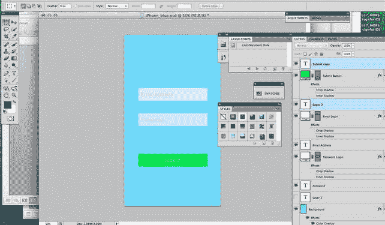

图 8-2。按住 Command 键可以同时选择多个素材图层

**提示**  ，如果某个按钮在应用程序的多个屏幕中都被使用，请删除其文本，并在您的设计规范文档中所有使用该按钮的位置添加标注。对于按钮的每个实例或每次使用，还必须指定该按钮副本的正确字体、字号和颜色。这可以通过编程方式完成，从而节省时间。

4.  现在您已选择了图层，请将它们转换为智能对象，如 图 8-3 所示，方法是转到“图层”，“智能对象”。智能对象是包含来自矢量图像数据的图层。

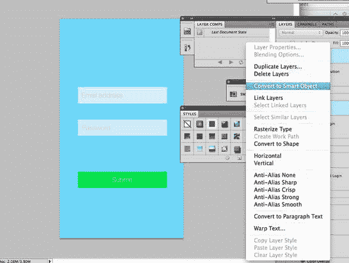

图 8-3。选择所有与素材相关的图层后，将其转换为智能对象

**提示**  ，将图层转换为智能对象，可以在不丢失原始图像数据或质量的情况下编辑图像。

将图层转换为智能对象后，您会看到新的图层出现在图层面板中。

5.  在图层面板中选择您刚刚创建的新智能对象。
6.  右键单击以调出其“导出内容”选项，如 图 8-4 所示。Photoshop 会要求您为要保存的文件选择一个位置。新的智能对象文件将具有 `.PSB` 扩展名。

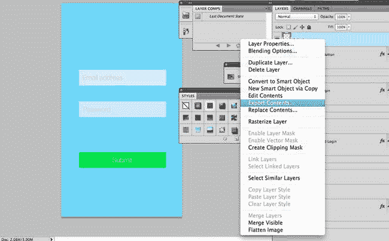

图 8-4。通过从下拉菜单中选择“导出内容”选项来导出智能对象的内容

**提示**  ，如果智能对象是由多个图层创建的，那么它将以 PSB 格式导出。

7.  找到并打开您保存的导出文件，然后选择包含您要保存的素材的图层。

对于我们的“提交”按钮，我们已移除了文本，只剩下实际的按钮。检查并确认其符合您的要求后，需要将智能对象保存为 PNG，以便之后导入 Xcode 并在应用程序中使用。

8.  从“文件”菜单的下拉列表中选择“存储为 Web 所用格式”。您将可以选择以多种格式保存素材。请确保从提供的列表中选择 PNG-24 选项。另外，如果提供了交错 PNG 选项，请务必避免使用。下拉菜单中显示的选项包括 GIF、JPEG、PNG-8 和 PNG-24，如 图 8-5 所示。

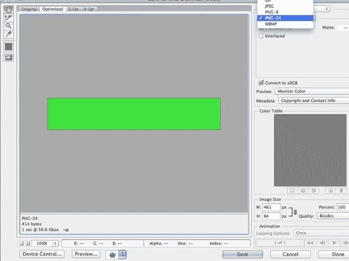

图 8-5。将智能对象导出为高质量的 PNG-24。PNG-24 格式可以保留透明度

**提示**  PNG-24 选项可确保您的图像获得最高质量。Apple 建议将 24 位作为图标和图像的标准位深度。红色、蓝色和绿色通道各占 8 位，再加上一个 8 位的 Alpha 通道。因此得名 24 位 PNG。

9.  选择 PNG-24 后，您应将图像保存在一个容易记住的文件夹中，并命名为 `"Submit_btn_off@2x"`。在保存按钮的开启状态时，您需要保持命名约定的一致性，因此，您的开启或激活状态的按钮名称可以类似于 `"Submit_btn_on@2x"`。
10. 如果您还没有为新的素材创建一个新文件夹，请现在就创建。请谨慎选择此文件夹，因为它应该是您将要导出的所有新素材的存放位置。重要的是，您的所有素材都存放在同一个文件夹中。

就这样，您已经保存了应用程序的第一个素材。您可能需要再重复几次这个过程才能掌握，但一旦熟练，每次操作都会很快。

不过，我们刚刚创建的按钮是一个高分辨率按钮。现在，让我们来看看如何为我们的非 Retina 设备缩小按钮尺寸。

### 为不同设备缩放和保存素材

缩放和切片素材是相辅相成的。在对图像进行切片后，您需要先保存 2x 文件，然后缩小尺寸，为非 Retina 屏幕生成一半大小的文件。我倾向于从较大、较高分辨率的设计缩小到较小尺寸的设计，因为这能更好地保持图像质量。

将素材保存为较小尺寸的过程相当简单。导航到“图像”>“图像大小”来调整尺寸。我们需要将按钮的实际尺寸从现有大小修改为原始大小的一半。关于 dpi 与 iOS 设计的关系，存在一些讨论。我个人认为，在为 iOS 进行设计时，dpi 并不重要。因此，在此过程中，我们将保持 dpi 为 72。 图 8-6 显示了我们新的非 Retina 按钮的图像大小设置经过调整后的情况。导航到“文件”，“存储”，将新按钮保存为 `"Submit_butn_off.png"`。遵循与之前相同的指示，以 PNG-24 格式保存文件，并遵循之前建立的命名约定，一切就准备就绪了。

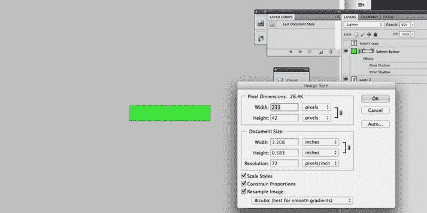

图 8-6。要创建一个非 Retina 按钮，请将 @2x 按钮的尺寸减小 50%

要切片、导出和缩放其他素材，请遵循“将你的设计切片为素材”部分中概述的相同流程。

对于大型 PSD 文件，如果要对大量素材重复上述切片步骤，切片和缩放图像选区可能会变得繁琐。有许多工具可以帮助设计师完成这一过程。其中一些是独立工具，另一些是与 Photoshop 配合使用的插件。其中一些非常受欢迎。和往常一样，先用一个测试 PSD 文件试用某个工具，确保它能按您需要的方式工作，并确认它能融入您的工作流程。

### 其他素材准备工具

如果您要导出大量相似甚至完全相同的图像，或许可以使用 Photoshop 中的“将图层导出到文件”脚本。选择“文件”，“脚本”，“将图层导出到文件”，然后运行该脚本。Photoshop 会将文档的每个图层保存到不同的文件中。文件名将与图层名一致，以便您识别。在我看来，这个工具的用例有限，使用时请谨慎。在使用此工具前，您可能需要确保图层名称正是您想要的名称。

此外，还有不止几个第三方工具可用于协助 iOS 应用程序的素材准备工作。有些是可执行文件，有些是与 Photoshop 配合使用的插件。如果您决定使用第三方工具来协助素材准备过程，则需要做一些尽职调查。


在考虑使用第三方工具进行资源准备时，有以下几点需要注意：

- 首先用少量文件进行测试，确保结果符合你的需求。
- 确保该工具会定期更新（通常可以通过查看其错误修复和更新日志来确认）。
- 该工具的创建者或负责公司应为用户提供支持或帮助。
- 阅读用户的评价或反馈，了解他人的看法。评价是判断应用或插件表现的重要指标。

### 为资源命名

在创建要交付给开发者的资源时，务必确保文件命名遵循一致的规范。建议采用以下命名格式：

- 标准格式：`<图片名称><设备修饰符>.<文件扩展名>`
- Retina 或高分辨率格式：`<图片名称>@2x<设备修饰符>.<文件扩展名>`

名称中的`<设备修饰符>`部分是可选的，并非必须。不过，如果你正在设计一款通用应用，并希望向开发者表明哪个资源属于特定设备，这会是一个很好的做法。

在命名文件时，最好与你的开发者沟通，了解他们是否有偏好。但以下命名指南也可作为参考，特别是当你正在创建一款适配多种屏幕尺寸的应用时：

- iPhone – `file.png` 或 `file∼iphone.png`
- iPhone Retina – `file@2x.png` 或 `file@2x∼iphone.png`
- iPhone 5 – `file-568@2x∼iphone.png`
- iPad – `file∼ipad.png`
- iPad Retina – `file@2x∼ipad.png`
- 用于导出资源的第三方工具

### 为开发打包资源

当你将文件切片、缩放并导出到一个文件夹后，应再次检查，确保所有文件都已为你的开发者正确标记。这样可以避免开发者在寻找文件位置时进行不必要的猜测。如果你已创建了设计规格文档，那么应在其中包含一个章节，说明你不仅用于命名文件的规范，还包括如何在各个文件夹中组织这些文件。如果你的开发者只愿意接收分层的 PSD 文档，而不需要单独的 PNG 切片，那你很幸运。

如今，越来越多的开发者拥有生成所需切片的方法，并且熟悉 Photoshop。这可以减少开发者和设计师之间因图片几个像素的偏差而可能出现的反复沟通。无论你的开发者是需要 PNG 还是分层的 PSD，确保你的 PSD 文件具有直观命名的图层都变得非常重要。此外，有些开发者虽然能够自己切片 PSD，但可能并非“硬核”的 Photoshop 专家。在交付给你的开发者之前，切记不要栅格化或拼合蒙版或图层，这样他们才能在需要时编辑文件而不损失质量。

**提示** 栅格化图像会将其转换为单个图层，并且会失去在不损失质量的情况下调整图像大小的能力。

### 沟通是关键

当你的文件已标记并打包好准备交付时，你可能还想与开发者安排一次通话或会议，以讲解设计中的细微差别，或解释可能需要额外说明的操作和动画效果。虽然你会尝试在设计规格文档中涵盖所有内容，但这都比不上一次良好的老式谈话。在会议前，将你的文档副本发送给开发者审阅，并请他/她准备好问题。无论你认为自己的文档多么清晰，很可能仍会有问题。任何在会议中得到解答或澄清的问题，都需要你更新文档。将答案记录下来，并向你的开发者发送一份新的、更新后的文档版本，以便在开发过程中作为参考。

另一个最佳实践是，确保你的开发者知道如何联系你，以防他/她有后续问题。在设计规格文档中提供电子邮件地址和电话号码会很有帮助。保持开放的沟通渠道，是消除开发过程中猜测的好方法。

### 总结

当你完成应用的设计和构思部分后，需要准备将资源交付给开发者。设计规格文档是消除开发过程中歧义的好方法。你将创建一份文档，其中包含尽可能多的关于你应用的信息。它应包括应用细节、目标、使用方式，更重要的是，它告诉你的开发者如何处理你将要提供的所有资源。如果有必要，你还需要提供颜色、字体和文本、交互和动画等细节。然后，你将进入资源的切片和缩放环节，以便在 iOS 中使用。所有切片后的资源都必须导出为 PNG 格式，因为 PNG 支持透明度并且图像质量很高。当这些资源被命名和组织好后，你将把它们与设计规格文档一起打包，移交给开发者。如果可能，你还可以安排一次面对面交流，并为你的开发者提供一种联系你的方式。无论你是使用本章概述的方法还是使用第三方工具来切片和缩放资源，遵循这些通用指南都将有助于从设计到开发的平滑过渡。

## 第 10 章

