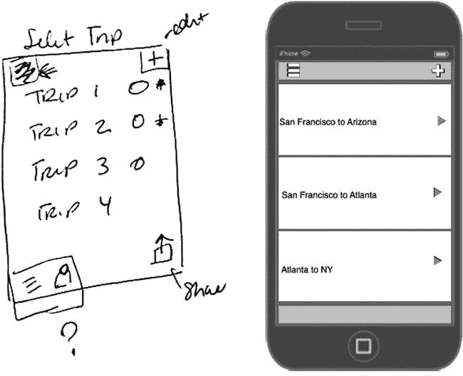
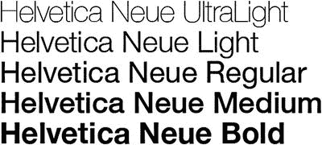

# 设计最佳实践与应避免的错误

你已经将你的想法从构思阶段推进到现在，如果你已将应用交付给开发者，或者甚至自己开发完成，那么你已经准备好将应用提交到应用商店了。恭喜你！这是一个巨大的里程碑，如果你从头到尾跟进了本书，希望你对结果感到满意。本书包含了大量信息，所以我在为你的应用设计之旅准备了一份清单。它基本上是对本书所述所有原则的重述。

应用开发中最常被忽视的方面之一就是设计。但希望通过本书中介绍的工具和方法，我为你阐明了这个过程。界面的外观和感觉是你应用中最关键的方面之一。你的受众会根据你在应用商店截图中显示的界面来对你的应用做出初步评估。一些最简单、最直观的应用往往最受欢迎。

虽然简洁很重要，但在简洁与功能性之间取得平衡也至关重要。有些应用设计过度，包含了太多花哨的功能，这反而会削弱应用的总体功能。这就是为什么不断回顾你的应用陈述如此重要。在完成设计过程时，始终牢记应用的目标，这样你就不会出错。以下章节将本书分解成一个有用的清单，总结了设计应用时的最佳实践和应避免的错误。

### 创建应用设计陈述

应用设计陈述是你的应用存在的理由。它是一个简短的、容易记住的、描述你的应用的陈述：它是什么、为什么存在，以及最重要的是，它如何运作。定义你的应用及其目标受众。保持描述简短，并能向任何询问的人复述出来。我们为虚构的 Travel Light 应用创建的应用设计陈述是：“Travel Light 应用将通过提供清单来帮助频繁旅行者，确保他们只为即将到来的行程打包必需品。”

这个陈述可能会随着你的应用创建而演变和改变，但记住它并在你的想法改变时更新它是一个好主意。

### 人机界面指南是你的设计圣经，请善用它

#### Apple 人机界面指南

Apple 的 `Human Interface Guidelines` 就像是圣经一样，指导着为 iOS 创建应用的**设计师**和**开发者**。苹果在其中详细阐述了其设计原则和指南，供设计师和开发者共同参考。你需要反复阅读。最好打印一份纸质版放在手边，以便在思考如何突破应用设计边界时随时查阅。如果有更多设计师和开发者阅读 `HIG`，被应用商店拒绝的应用将会少得多。

### 线框图很重要

`Wireframing` 是指将设计概念在纸上或其他媒介上完全展开的过程，它发生在真正的设计流程之前。`线框图`剥离了所有设计元素，专注于用户界面元素以及用户与应用交互时的*整体体验*。`线框图`流程对设计至关重要，实际上应该是设计流程中的第一步。通常情况下，`线框图`过程可能需要一些时间，但一旦你进入实际的创意设计阶段，这会节省时间。你的线框将贯穿应用的每一个步骤，并且在定义用户、用户故事和用户需求时不断演变，如图 10-1 所示。*永远不要低估* `线框图`*流程*。当线框图完成并获批后，你的设计过程将会顺畅得多。

图 10-1。Travel Light 应用行程选择页面的手绘线框图

### UI 与 UX：二者有区别

`用户界面（User Interface）`和`用户体验（User Experience）`是不同的，了解它们的区别是件好事。`UX` 或称为`用户体验`，是指用户在使用应用过程中实际体验到的内容。`UI` 或称为`用户界面`，则是这种体验的视觉呈现。在应用设计领域，这两个术语经常被混淆和误解。理解它们的不同之处也将有助于你的 `线框图` 流程。

### 化繁为简！

杂乱的界面会使用户感到困惑，并可能导致在使用应用时出现问题。去掉所有非关键的元素。在实现功能时要明智，不要给用户太多选项！简洁性是 iOS 设计原则的标志之一。但总的来说，它也是移动端设计的主要原则。过于复杂的移动设计会让用户感到困惑。

### 善用留白

一些最好的应用将**留白**作为设计过程中的一个重要组成部分。在屏幕上的元素周围留有空间非常重要。这能让眼睛精确地聚焦在需要关注的内容上。让特定元素成为应用的焦点，同时也要关注对应用功能至关重要的元素。

### 关注 iOS 7 的变化

`HIG` 将概述苹果新操作系统的精髓及其对**极简主义**和**扁平化设计**的依赖。将这些原则应用到你的应用设计中。`人机界面指南`中关于 iOS 7 的特定信息，将帮助你理解自该系统发布以来最重大的变化。熟悉其他人在“扁平化设计”趋势方面的做法，并理解苹果如何使这一趋势适应公司的美学风格，也很有帮助。

### 多问为什么？

审视你的界面，问自己**为什么**一个按钮会放在那里。确定如何简化用户的旅程。如果存在对用户应用体验不关键的额外步骤，就删除它们。从屏幕上移除那些**并非绝对必要**的元素，是一种让用户聚焦于手头任务的方法。如果它对用户旅程不重要，就删除它。

### 放眼小屏幕

在设计你的应用时，要考虑到用户将在**远小于桌面电脑屏幕**的屏幕上与你的应用交互。为移动端，尤其是为 iOS 进行设计，意味着必须为每个设备考虑空间问题。有独特的交互方式可以与 iOS 设备互动，所以请牢记在心。

### iPad 不只是放大的 iPhone

如果你正在为 iPad 设计应用，有特定的设计考量必须考虑。例如，考虑用户将如何在更大的设备上与应用交互。

### 字体很重要

考虑可读性以及文案和文本在设备上的显示效果。遵循 `人机界面指南`，因为它们在字体方面有特定的规定。了解像 `Helvetica Neue`（如图 10-2 所示）这样的字体在 iOS 7 中是如何使用的，并确保你的文案在目标设备上清晰易读。

图 10-2。Helvetica Neue 是一种流行的扁平化设计字体

### 提供视觉反馈

始终让用户了解你的应用中正在发生什么。在流程进行的过程中向用户提供反馈是一个很好的实践。这包括使用进度条，或者如果应用正在完成或处于某个中间过程，使用旋转指示器，如图 10-3 所示。你的用户想知道发生了什么，所以要用这些指示器让他们了解应用内部的情况。对于操作，视觉反馈也很有帮助。当用户点击一个按钮时，创建并提供与“关闭”或“非激活”状态**视觉上不同**的“激活”或“开启”状态，可以让用户知道该交互已被应用接收。如果你有特定的方式想为用户提供视觉反馈，请务必在 `设计规格` 文档中提及，以便你的开发人员了解。

图 10-3。旋转指示器让用户知道应用中某个流程正在进行中

### 用户就是上帝

在移动应用设计时，你必须始终记住要**换位思考**，站在用户的角度。创建用户故事和用户画像，将自己沉浸在特定用户的体验中，并定制应用以满足该用户的需求。一个**用户故事**是对理想用户及其在使用应用时可能遇到的特定需求或要求的描述。充实这些需求并根据用户类型优先考虑特定功能，将有助于你缩小功能列表。理解你**无法做到面面俱到**也很有帮助。

### 设计模式是你的好帮手

如果你仍在摸索 iOS 界面或移动端设计，设计模式是理解应用界面设计挑战中成熟解决方案的好方法。需要一个登录或注册屏幕，或者一种显示基于位置的搜索结果的方法？没问题。设计模式可以提供帮助，可以排除问题中的猜测成分，并加快整个设计过程。

### 拇指法则

一个常见的错误——可能对你的应用产生持久影响——就是**忘记拇指法则**。请记住，移动用户是在“按压”或“轻点”，而不是“点击”。因此，在设计应用时，确保为不同大小的手指（尤其是拇指）留出足够的空间。你会发现拇指在应用导航中扮演着重要角色。思考应用中屏幕上的重要元素应该放在哪里，并确保它们在用户拇指的可及范围内。Apple 对可点击区域的要求是 `44 x 44`。

### 从高分辨率到低分辨率

#### iOS 应用设计贴士

许多设计师倾向于从高分辨率设计入手，然后再按比例缩小。这会让你的工作轻松得多，因为你能够完善和优化那些在大版本中可见、但在缩小版中却看不到的细节。公平地说，有些设计师可能更喜欢从低向上放大。不过，我交流共事过的大多数设计师都倾向于从高分辨率向小尺寸进行缩小。

### 快速导入

启动画面和动画会浪费用户的时间。请尽可能精简你的登录和注册流程，尽早切入应用的核心功能，而非拖延。任何多余的步骤都会让人望而却步。如果你必须提供一个应用导览或演示，请允许用户选择跳过这一过程。保持较低的进入门槛是一个很好的实践。

### 测试、测试、再测试

在创建应用时，一个好的做法是尽可能多地将应用线框和设计稿交到潜在用户手中进行体验。在应用发布前后，都要认真对待用户反馈。这会产生巨大的影响。尽量在**真实设备**上查看你的设计。我提到过一些工具，比如 `LiveView` 和 `Scala`，它们能让你在目标设备上查看设计，从而确保字体*和*设计的可读性。应用开发完成后，通常要进行功能测试或质量保障（`QA`），以确保应用按预期运行。这应该能发现一些在将应用上传到应用商店之前需要解决的主要问题。

### 软件会助你一臂之力

`Adobe Photoshop` 是应用乃至网站设计领域的黄金标准。如果你认真对待设计，就去学习它。`YouTube` 上有许多教程，也有整本书籍比我这里更详细地介绍`Photoshop`。

### 图标和截图同样重要

第一印象很少有机会重来。你应用的界面很重要，但应用图标也同样重要。它将是用户在应用商店和他们的设备上识别你的应用的唯一途径。因此，让图标与你的应用一样特别至关重要。`Apple` 也为应用图标提供了指南，所以请务必严格遵守。你的应用图标是必需的，因此要认真思考它的外观。截图是用户对你应用的第一印象。请包含能够吸引用户下载你的应用的截图。

### 交接与沟通

在设计完应用并准备好所有待交付内容后，你需要向你的开发人员提供关于应用中特殊动画或手势的具体指示。与你的开发人员进行面对面沟通，进行资产的正式交接，始终是一个好主意。作为设计师，你的工作还没有结束。你可能需要创建一份文档，供开发人员在开发过程中参考。这份文档将包含那些可能无法从你分层的 `PSD` 文件中直接看出的细节。关于字体、颜色和尺寸的信息都可以放入这份文档中。

### 总结

你在应用设计上投入了大量心血。你从无到有，将一个想法通过构思变成了现实。当你将这些文件交给开发人员并构建出应用后，它将成为一件独特的创作，存在于成千上万人的设备上。成功并非必然，但如果你遵循了`人机界面指南`以及本书中的其他文档，你的应用就可以出现在应用商店中；并且，如果它在设计和功能上确实出类拔萃，它可能会与商店中其他顶尖应用一同被推荐。即使没有发生这种情况，你也应该将你的应用成功上架应用商店视为一项伟大的成就。

### 索引

 A

抽象手势

Adobe Fireworks

优势

新特性

结构

旅行清单 PSD

应用设计

Adobe Photoshop

桌面屏幕

字体

交接与沟通

HIG

图标与截图

iOS 7

iPad

设计模式

说明

测试

经验法则

UI *与* UX

利用留白

视觉反馈

线框图

应用开发

素材准备工具

沟通是关键

设计规范文档

批注

颜色信息

字体与类型

用户交互（*参见* 用户交互（UI））

命名素材

打包素材

缩放与保存过程

切片过程

素材定稿过程

iOS

多层

非 Retina 素材

PNG-24 格式

Retina

智能对象

应用发现

应用图标

App Store

应用图标

应用页面

确认邮件

iTunes 账户

启动图像

新的 iOS 7 图标

报刊亭封面图标

报刊亭分区代码

宣传插图

宣传截图

插图

 B

栏

导航

状态栏

标签栏

工具栏

 C

计算器应用

日历应用

调色板

 D

设计模式

设计模式框

列表与表格视图模式

注册与登录表单

搜索与排序功能

启动台/主屏幕模式

表格

图片库

侧滑式导航

标签页

提示、导览与操作指引

旧金山开发者大会

 E

eBay

 F

扁平化设计

优点

按钮

调色板

缺点

图标

iTunes Store

起源与使用

eBay

Twitter

Zune

设计原则

空间与模板

字体排印

可用性

 G

手势

抽象

一致性

直接操作

反馈

iOS 设备

双击

拖拽

轻弹

捏合

摇动

滑动

轻点

长按

iOS7

向下轻扫

向右轻扫

向上轻扫

多点触控体验

 H

人机界面指南 (HIG)

 I

iOS 7

栏

导航

状态

标签

工具栏

设计美学

以设计为核心的公司

指导原则

图标

主屏幕

内置应用

按钮

计算器应用

日历

颜色

设计应用程序

层

邮件

透明与半透明

天气

表格视图元素

表格视图

字体排印

iPad 和 iPhone 设计

操作列表

应用图标

电子商务

四指轻扫

手势（*参见* 手势）

GUI 套件

图标

LinkedIn 主屏幕与应用商店图标

尺寸

iPad 2

iPad Mini

iPad Retina

启动图像

捏合

弹出视图

屏幕分辨率

分屏视图

滑动

触摸目标

UI 元素

通用应用程序

用户交互

视觉上下文

iPhone 操作系统 (iOS) 应用程序

应用商店探索

类别

比较

下载

创意

常见问题

分享你的创意

UI 元素

iTunes 账户

  J, K

乔纳森·艾维，苹果公司的创意沙皇

  L, M

启动画面

图层复合

  N, O

导航栏

  P, Q, R

Photoshop 画布

PNG 资源

纸上原型设计 (POP)

PSD 文件

  S

屏幕截图

Skala 工具

状态栏

内置应用

按钮

计算器应用

日历

颜色

图层

邮件

透明与半透明

天气

  T

标签栏

工具栏

Twitter 小鸟标志

  U

用户体验 (UX)

用户交互 (UI)

按钮

设计规格文档

字体大小、文件名和颜色

登录/注册

用户界面 (UI)

  V

视觉资源，Photoshop

Adobe Fireworks

优势

新特性

行程列表 PSD

画布显示

网格线与参考线

裁剪工具

3D 工具

绘图与文字工具

主画布

测量工具

绘画工具

修饰工具

选区工具

切片工具

对称设计

繁琐事务

工具面板

查看与导航工具

iOS 7 设计

图层复合的使用

图层面板

构建模块

更改首选项和属性

图层组

多个图层

自然结构

矢量

Photoshop 历史

Photoshop 设置

PNG 资源

注册/登录页面创建

背景创建步骤

品牌颜色

颜色选择器面板

水平文字工具

粉彩风格调色板

带/不带网格线的登录界面

Travel Light 应用登录界面

视网膜屏幕

选择与编辑行程页面

用户友好

线框图

  W, X, Y

天气应用

线框图

定义

布局创建

流程

添加线框图

客户

设备轮廓

信息架构师

iPhone 5 与 iPad mini 模板

POP

共享线框图

Travel Light

可用性

用例

用户流程

工具

  Z

Zune
