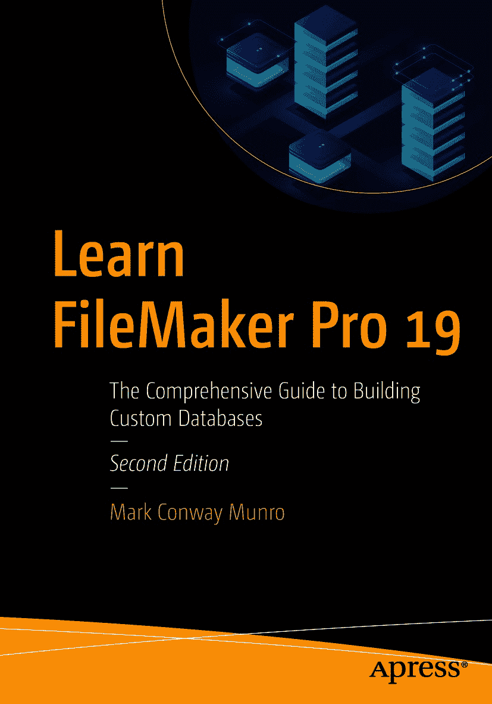

ISBN 978-1-4842-6679-3e-ISBN 978-1-4842-6680-9 [`doi.org/10.1007/978-1-4842-6680-9`](https://doi.org/10.1007/978-1-4842-6680-9) Apress 标准 © Mark Conway Munro 2021 本作品受版权保护。出版者保留所有权利，包括对全部或部分材料的权利，特别涉及翻译、重印、复用插图、朗诵、广播、以微缩胶片或任何其他物理形式复制，以及电子改编、计算机软件或任何现有或未来可能开发的相似或不同方法的传输或信息存储与检索。本出版物中通用描述性名称、注册商标、商标、服务标志等的使用，即使未明确声明，也不意味着这些名称可免除相关保护性法律法规的限制，因此可自由使用。出版者、作者及编辑假定本书中的建议和信息在出版之日是真实准确的。出版者、作者及编辑均不对本书所含材料或可能存在的任何错误或疏漏提供明示或暗示的担保。出版者对已出版地图中的管辖权主张和机构隶属关系保持中立。本书通过 Springer Science+Business Media New York 在全球图书贸易中发行，地址：1 NY Plaza, New York, NY 10014。电话：1-800-SPRINGER，传真：(201) 348-4505，电子邮件：orders-ny@springer-sbm.com，或访问 www.springeronline.com。Apress Media, LLC 是一家加利福尼亚有限责任公司，其唯一成员（所有者）是 Springer Science + Business Media Finance Inc (SSBM Finance Inc)。SSBM Finance Inc 是一家特拉华州公司。

*深切怀念这只高贵的野兽。*

*她是我十三年的忠实伙伴。*

*安息吧，亲爱的女孩。*

*我想你。*

***阿帕奇·芒罗***

***2007–2020***


## 前言

在 1990 年代和 2000 年代，我经营着 TECSoft，这是一家位于纽约市的 AppleScript 和 FileMaker Pro 开发工作室。我们的专长是数据库出版——即利用苹果公司的 AppleScript 技术从 FileMaker 数据库中智能提取数据，并将其格式化，以便在 QuarkXPress 和 Adobe InDesign 等页面布局应用程序中打印。

我们与苹果公司和 FileMaker Inc. 的前身 Claris 密切合作，展示其技术的强大功能。1994 年，随着公司发展并需要更多开发人才，我们请朋友埃里克·西尔弗（时任 Claris 纽约地区销售代表）帮我们留意人选。他向我介绍了一位他认识的 FileMaker 高手，名叫马克·芒罗，当时在纽约一家名为杰克·莫顿的音像制作公司工作。

马克负责整理莫顿的制作项目数据并管理工作流程。我们见面后，他解释了他们的工作流程，并向我展示了他如何在 FileMaker 中组织数据，使管理层能够从头到尾跟踪项目、跟踪所涉及的各种资源，并准确计算并向客户收取相关时间和材料费用。

马克的工作令人惊叹，我立刻意识到我们遇到了 FileMaker 领域的“金子”。他公司工作流程的各个方面都被逻辑清晰地组织在一个功能强大的工作流程管理工具中，而最令人印象深刻的是，所有这些都在一个易于理解的界面中清晰呈现。很难想象马克在 FileMaker 成为关系型数据库之前就实现了这一点。

我们开始与马克合作，他成了一位自由职业的 FileMaker Pro 和 AppleScript 高手。我们将最复杂、要求最高的项目交给他——例如索尼音乐的一个大型工作流程管理和目录出版项目，以及美联社一个极其复杂、关乎任务成败且截止日期严格的文件创建项目，这只是其中的两个例子。

很快，马克的工作量就足以让他独立成为全职的 FileMaker 和 AppleScript 开发者。随着 TECSoft 的重点转向与苹果公司合作提供 AppleScript 研讨会和培训课程，我们创建了 TECSoft 开发者联盟 (TDC)，以应对我们的研讨会所产生的大量 FileMaker 和 AppleScript 集成项目需求。马克作为 TDC 的第一号开发者，我们得以建立一个由 FileMaker Pro 和 AppleScript 开发者组成的国际推荐网络，该网络成为了全球最大的 FileMaker Pro 和 AppleScript 智囊团。

如今，马克经营自己的成功开发公司 Write Track Media 已超过 25 年。在我合作过的所有开发者中，马克所拥有的最突出的才能是真正的组织天赋。马克的热情使他完全有资格传授他在 FileMaker 这个强大组织工具方面的精湛技艺。他只需写成本书即可。

> ——小约翰·索尔森
> Connected Hearth, LLC

## 引言

本书的上一版出版于 2017 年。在《学习 FileMaker Pro 16》的引言中，我回顾了 1988 年在曼哈顿的坦嫩魔术店首次接触该软件的经历，并重点介绍了过去几十年间的演变。自那本书出版以来的三年里，随着 FileMaker 应用程序的改进，技术前进的步伐仍在继续。

该产品现在已更新至版本 19。这家苹果子公司更名为 *Claris*，以反映其产品线不断扩展，比之前仅专注于 FileMaker 的产品更为多样化。桌面应用程序的前两个版本——FileMaker Pro 和 FileMaker Pro Advanced——现已合并为一个包含所有开发工具的单一版本。产品的年度升级导致功能不断积累。为了跟上时代步伐并反映当前软件状况，新版书籍应运而生。

除了涵盖软件变更的修订外，我还决心对原著进行改进。一些改变是为了回应读者提出的合理批评。尽管第一本书广受读者好评，但有些人认为有太多页数集中在函数参考部分，这与在线帮助指南中的内容过于相似。另一些人则认为实际案例不够多。我觉得原著本可以更简洁。我根据功能变化更新了文本，并额外花费数月时间完全重写了每个章节，最终呈现出一本几乎全新的书。希望我的努力能有所体现。

我乐于听取读者的意见，欢迎任何反馈或问题。如果您喜欢本书，请考虑在您喜欢的在线书商网站上发布评论，和/或在社交媒体上分享。您可以通过加入 *Learn FileMaker* Facebook 群组、在 LinkedIn 上连接我的专业网络或访问我的商业网站直接与我联系：

```
facebook.com/groups/LearnFileMaker/
linkedin.com/in/markconwaymunro
writetrackmedia.com
```

FileMaker 是一个功能强大的工具，全球有数百万人使用。希望您喜欢本书，并希望它能在您的学习之旅中助您一臂之力。

> ——马克·康威·芒罗
> 2020 年 12 月，宾夕法尼亚州刘易斯堡

## 关于作者 关于技术审校

