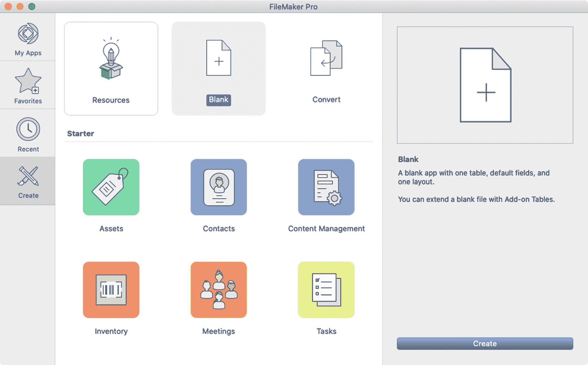
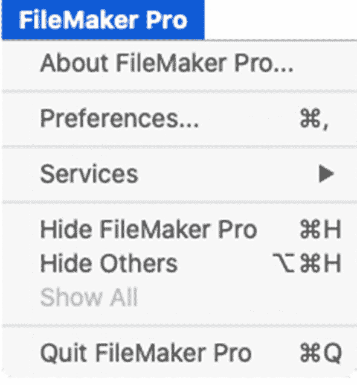
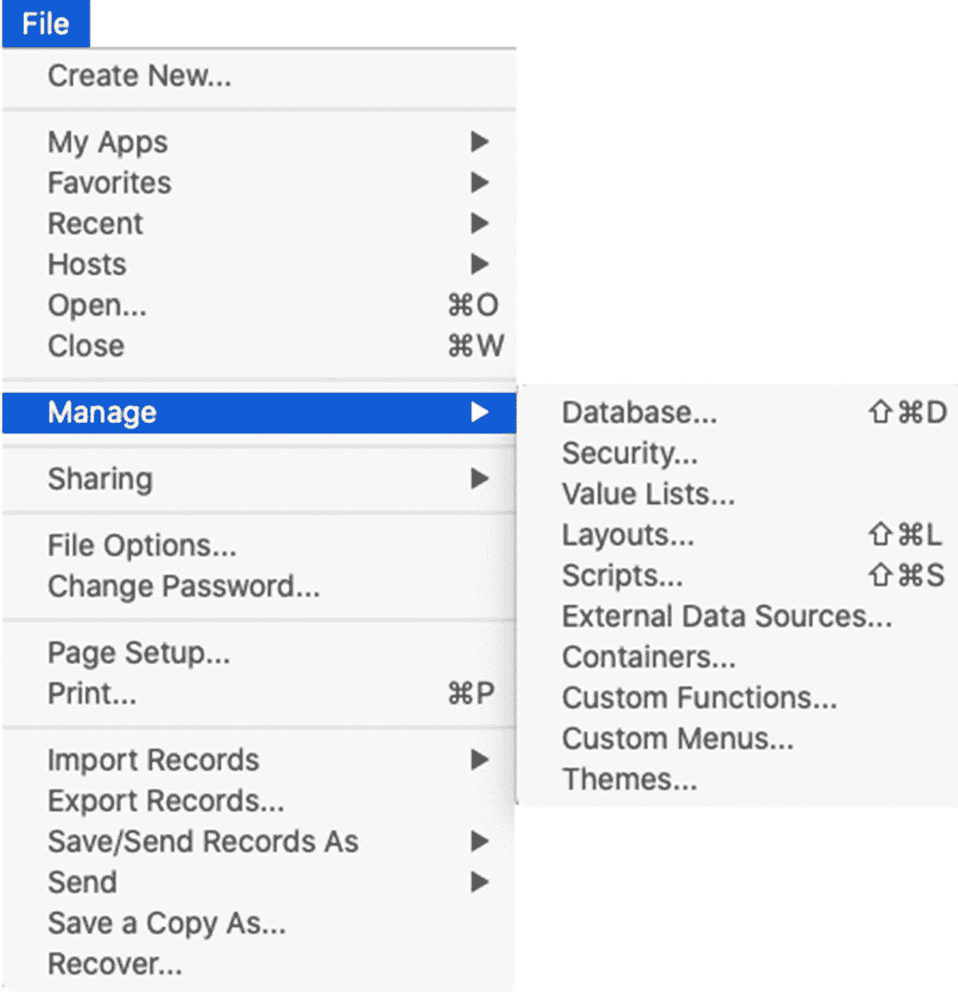
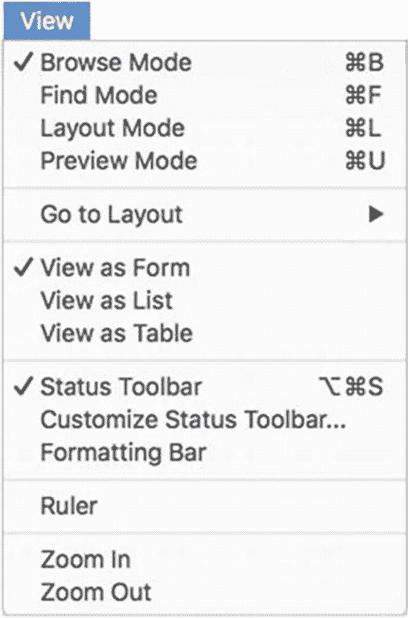
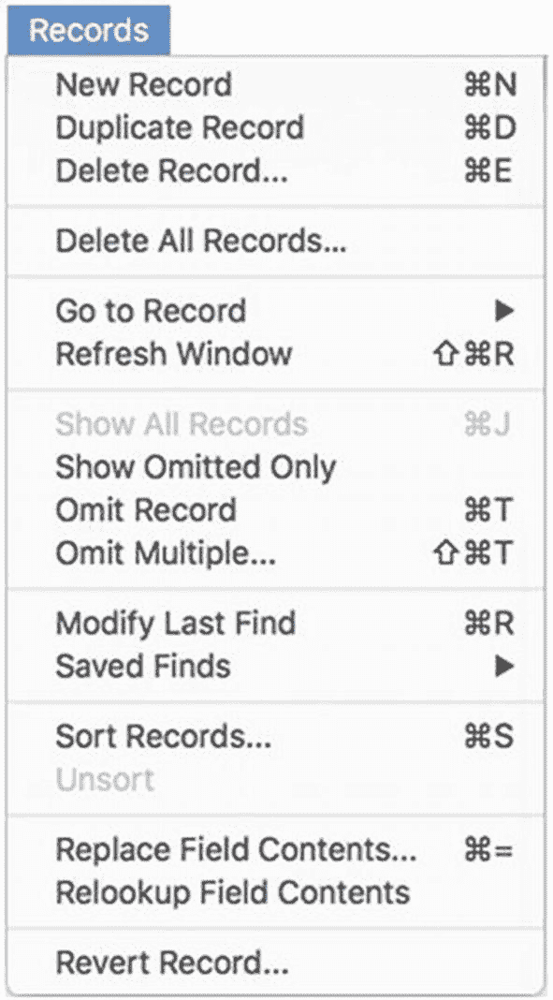

# 2. 探索应用程序

`FileMaker Pro` 是一款适用于 macOS 和 Windows 的桌面应用程序，具有双重用途的界面，集成了`使用`和`开发`数据库的功能。虽然产品线中的其他产品可以`共享`或`使用`数据库，但首先需要桌面应用程序来创建这些数据库。本章介绍该应用程序，涵盖以下主题：

- 介绍启动中心窗口
- 配置应用程序偏好设置
- 探索菜单（浏览模式）
- 使用上下文菜单

## 介绍启动中心窗口

`启动中心`是一个多选项卡窗口，用于创建新数据库、访问现有数据库以及链接到教育资源。该窗口如图 2-1 所示，将在您启动应用程序时自动打开。之后，可以通过选择`文件`菜单下的以下任意项来访问它，每个项都对应于窗口的一个选项卡部分：

图 2-1

FileMaker Pro 启动中心

- `创建新文件` – 打开`创建`选项卡以创建数据库、将文件转换为数据库以及访问教育资源
- `我的 App ➤ 显示我的 App` – 打开`我的 App`选项卡以从 FileMaker Cloud 服务器访问数据库（需要订阅）
- `收藏 ➤ 显示收藏` – 打开`收藏`选项卡以访问保存为收藏的数据库
- `最近使用 ➤ 显示最近使用` – 打开`最近使用`选项卡以访问最近打开的数据库

> **提示**  
> 在我们继续探索应用程序功能时，请暂时忽略这些选项。要了解有关创建文件的更多信息，请参见第 6 章。

### 常规：用户界面选项

这些*用户界面选项*控制着应用程序界面的各个方面。`Allow drag-and-drop text selection`（允许拖放文本选择）复选框支持在字段之间、布局之间以及字段与其他应用程序的内容之间进行拖拽。通过`Show recently opened files`（显示最近打开的文件）选项，您可以控制`File`（文件）菜单和`Launch Center`（启动中心）中显示的最近打开文件的数量。您可以选择在创建新文件时启用打开`Manage Database`（管理数据库）窗口的功能（第 7 章），并点击`Reset`（重置）按钮将所有应用程序对话框重置为默认大小和位置。

还有一些仅适用于 Windows 的选项，这些选项在 Macintosh 计算机上由操作系统控制，因此不会在前面显示。这些选项包括：增大布局对象尺寸以提高可读性、选择界面语言以及锐化文本。

### 常规：用户名

`username`（用户名）设置确定了数据库识别计算机名称的方式。该行为因平台而异。在 macOS 上，用户名默认为"System"（系统），并使用当前用户的计算机账户名。选择"Other"（其他）可为本地计算机上的任何用户输入一个静态的覆盖名称。在 Windows 计算机上，则必须输入一个自定义名称。

### 常规：应用程序

`application`（应用程序）设置控制着若干选项。前两个选项控制 FileMaker 是否在软件更新可用时进行检查并通知用户，包括完整版本更新和/或增量更新。底部的`startup file`（启动文件）设置允许选择一个文件，该文件将在应用程序启动时自动打开。`Use advanced tools`（使用高级工具）复选框应在任何进行开发的计算机上选中，以启用高级应用程序功能。启用高级工具会显示完整的`Tools`（工具）菜单（本章后续部分会讨论）以及其他功能，包括：

- `File ➤ Manage`（文件 ➤ 管理）子菜单中的两项：`Custom Functions`（自定义函数）和`Custom Menus`（自定义菜单）
- 对表、字段定义和主题进行复制粘贴
- 导入表的功能

**提示：** 启用高级工具，然后退出并重新启动应用程序。

## 探索菜单（浏览模式）

默认的"浏览"模式菜单栏（如图 2-5 所示）包含用于数据输入和切换到其他模式的命令，包括用于定义数据库结构和设计布局的更深入的开发者界面。

*图 2-5：默认的浏览模式菜单栏*

本节介绍默认的"浏览"模式菜单。有许多上下文相关的项目在各种情况下不会被启用，例如：没有打开数据库、脚本正在运行或暂停、模态窗口打开、或用户的登录账户（第 30 章）未授予其访问该功能的权限。同样，在多种其他条件下，部分或全部菜单可能会完全不同，包括：

- `Launch Center`（启动中心）窗口或其他文件对话框处于打开状态。
- 窗口处于非"浏览"模式：查找（第 4 章）、预览（第 4 章）或布局（第 17 章）模式。
- 按住了`Option`等修饰键。
- 开发者对话框处于打开状态。
- 数据库正在使用自定义菜单集（第 23 章）。

### FileMaker Pro 菜单

`FileMaker Pro`菜单（如图 2-6 所示）是仅限 macOS 的菜单，包含访问应用程序信息、偏好设置和一些操作系统功能。这些选项用于获取应用程序信息、打开偏好设置窗口、隐藏或退出应用，并且可能包含来自操作系统和其他应用程序的服务。在 Windows 上，此菜单不存在，因此`Preferences`（偏好设置）位于`Edit`（编辑）菜单下，并且`File`（文件）菜单下添加了一个`Exit`（退出）项用于退出应用程序。

*图 2-6：FileMaker Pro 应用程序菜单*

### 文件菜单

`File`（文件）菜单（如图 2-7 所示）包含许多与文件和开发相关的功能。该菜单的功能包括访问、配置、打印、传输数据等。

顶部的`Create New`（新建）项打开`Launch Center`（启动中心）窗口的相应选项卡，提供对资源、入门模板和电子表格转换功能的访问，并创建新的空白数据库。接下来的四个子菜单项各自提供资源访问，并带有打开窗口或直接访问资源的选项。`My Apps`（我的应用）、`Favorites`（收藏夹）和`Recent`（最近）子菜单分别对应一个`Launch Center`（启动中心）选项卡，提供对云账户中、标记为收藏或最近访问的数据库的访问。`Hosts`（主机）子菜单提供对托管数据库的访问，并带有打开`Hosts`（主机）窗口的选项，该窗口按云、收藏夹和本地汇总服务器，并提供添加、编辑或删除主机的选项（第 29 章）。

*图 2-7：文件菜单和管理子菜单*

`Manage`（管理）子菜单提供对开发选项的访问（本章后续部分会介绍），而`Sharing`（共享）子菜单则控制谁能通过网络访问当前数据库，以及本地应用程序共享打开文件的能力（第 29 章）。`File Options`（文件选项）打开当前数据库的设置对话框（第 6 章），`Change Password`（更改密码）打开一个对话框，允许用户更改当前用户账户的密码（如果其安全权限允许此操作）（第 30 章）。

在输出选项的顶部是`Page Setup`（页面设置）（在 Windows 上称为`Print Setup`（打印设置））和`Print`（打印），它们提供对用于配置当前窗口以进行打印的典型操作系统对话框的访问。接下来，`Import Records`（导入记录）和`Export Records`（导出记录）选项提供将数据传入或传出当前数据库的选项（第 5 章）。`Save/Send Record As`（另存为/发送记录为）子菜单允许将记录保存为 Excel 或 PDF 文件，或保存为一组记录的快照链接（第 29 章）。`Send`（发送）子菜单包含创建手动电子邮件或创建包含指向当前数据库的 FileMaker URL 链接的电子邮件的选项（第 31 章）。`Save a Copy As`（另存副本为）菜单可以将整个数据库保存为`copy`（副本）、`compacted copy`（压缩副本）或`clone`（克隆）（第 6 章）。最后，`Recover`（恢复）项目启动一个用于故障排除或抢救受损数据库的数据库恢复过程（第 6 章）。

### 文件：管理子菜单

`文件`菜单中的`管理`子菜单（如图 2-7 所示）提供了访问当前数据库文件的内嵌开发界面的入口。每个选项都将在后续章节中讨论：

- `数据库` – 定义表、字段和关系（第 7 章–9 章）
- `安全` – 配置访问凭据（第 30 章）
- `值列表` – 定义值列表（第 11 章）以格式化字段，加快数据录入速度（第 20 章）
- `布局` – 创建和管理界面布局（第 18 章）
- `脚本` – 创建和管理脚本（第 24 章）
- `外部数据源` – 管理与其他 FileMaker 和 ODBC 数据库的连接（第 9 章）
- `容器` – 定义图像存储位置（第 10 章）
- `自定义函数` – 创建和编辑自定义全局公式（第 15 章）
- `自定义菜单` – 创建和编辑自定义菜单（第 23 章）
- `主题` – 创建和编辑对象样式（第 22 章）

#### 编辑菜单

`编辑`菜单包含在编辑字段内容时可用的标准功能，例如`撤销`、`剪切`、`复制`、`粘贴`、`清除`和`全选`。这些都是普遍存在的计算机功能，无需赘述。不过，其他几个选项值得一提。`查找/替换`菜单包含用于在一个或多个记录的字段内进行文本替换的功能，而`拼写`则包含用于更正选定字段内文本或逐一遍历布局上每个字段的选项（第 4 章）。`导出字段内容`项会打开一个对话框，用于指定保存当前字段内容的文件名和位置（第 10 章）。

#### 视图菜单

`视图`菜单（如图 2-8 所示）包含控制数据库视图的功能。前四项是查看模式：`浏览`（数据录入的默认模式）、`查找`（开始搜索，第 4 章）、`布局`（设计界面，第 17 章）和`预览`（准备打印，第 4 章）。`转到布局`子菜单包含一个布局选项列表，用于在布局之间手动导航。三个`视图方式`选项可为当前布局调用新的内容视图。可切换的`状态工具栏`项控制窗口工具栏的可见性，而`自定义状态工具栏`则打开自定义对话框。`格式栏`和`标尺`分别切换工具栏额外水平扩展区域的可见性，而窗口的缩放比例则可通过`放大`和`缩小`以 50%的幅度增减。其中大部分功能将在第 3 章中讨论。

图 2-8

视图菜单

### 插入菜单

`插入`菜单包含根据上下文敏感的功能，用于将文件或文本插入到字段中（第 4 章“修改字段内容”）。

### 格式菜单

`格式`菜单包含用于编辑字段内容时进行标准文本样式设置功能的子菜单，包括`字体`、`字号`、`样式`、`对齐`、`间距`和`颜色`。

### 记录菜单

`记录`菜单（如图 2-9 所示）包含用于`创建`、`复制`、`删除`、`导航`、`纳入`、`排除`、`排序`和`操作`的功能（第 4 章）。

图 2-9

记录菜单

