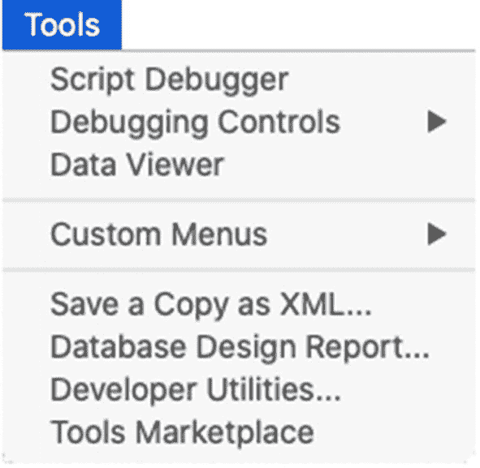

# 脚本菜单

`脚本`菜单提供对`脚本工作空间`窗口的访问，并显示已配置为在此显示的各个脚本的列表（第 24 章）。

### 工具菜单

`工具`菜单（如图 2-10 所示）包含对关键开发功能的访问，仅在启用了`使用高级工具`首选项时才可用。

图 2-10

工具菜单

顶部三个选项提供了调试功能的入口（第 26 章）。`自定义菜单`子菜单用于定义和选择自定义菜单集（第 23 章）。分析工具，如`另存为 XML 副本`和`数据库设计报告`，用于创建列出内部结构资源的可读文档（第 31 章），以便分析或存储。`开发工具实用程序`会打开一个对话框，其中包含文件加密和其他功能（第 31 章）。最后，`工具市场`提供了一个指向在线`Claris Marketplace`的快速链接，您可以在其中下载或购买第三方开发工具。

### 窗口菜单

`窗口`菜单包含许多与窗口相关的功能，用于为数据库创建附加窗口，或为打开的任意数据库在多个窗口之间进行选择（第 3 章）。

### 帮助菜单

`帮助`菜单提供对在线资源的访问，包括帮助指南、学习资源、升级、社区网站以及其他与应用相关的功能。

## 访问上下文菜单

当用户在区域或对象上右键单击时，FileMaker 的用户和开发者界面中会出现许多`上下文菜单`。这些菜单按字段、记录内容区域、Web 查看器和窗口进行归纳。每个菜单都根据点击的上下文，提供指向上下文相关命令的特定快捷方式。在后续章节中探索数据库时，请留意这些省时的菜单，它们是搜索拥挤菜单栏的更快捷方式。

### 字段的上下文菜单

字段有六个上下文菜单。这些菜单都包含剪切-复制-粘贴功能，其他功能因字段类型或窗口模式而异：

- `基于文本的字段（浏览模式）` – 格式化、插入、排序、搜索、图表和导出
- `基于文本的字段（查找模式）` – 插入运算符
- `容器字段（浏览模式）` – 插入文件并导出字段内容
- `汇总字段（浏览模式）` – 格式化、图表和导出
- `工具栏 ➤ 快速搜索字段（浏览模式）` – 拼写和语法检查、文本替换、转换和语音功能
- `任意字段（布局模式）` – 文本方向、对象样式选择、指定字段、配置为按钮、定义条件格式、配置脚本触发器、格式化和排列

### 记录内容区域的上下文菜单

数据库窗口的内容区域有一个上下文菜单，该菜单根据窗口模式而变化：

- `浏览模式` – 复制、创建、复制记录、删除、排序以及保存/发送记录
- `查找模式` – 复制、添加和删除查找请求
- `预览模式` – 复制页面、配置页面和打印
- `布局模式` – 粘贴、设置背景样式以及打开主题和布局设置对话框

### Web 查看器的上下文菜单

`Web 查看器` 有两种上下文菜单，其内容因窗口模式而异：

- **浏览模式** – 提供刷新内容的选项
- **布局模式** – 提供剪切-复制-粘贴、设置样式、配置为按钮、配置查看器设置、定义条件格式、配置脚本触发器以及设置各种格式选项的功能

### 窗口组件的上下文菜单

以下三种上下文菜单出现在各种窗口组件上：

- **布局部分**（布局模式）– 打开**部分定义**对话框，并选择部分的样式或填充颜色
- **标尺** – 选择磅、英寸或厘米作为度量单位
- **工具栏** – 打开工具栏自定义对话框

### 计算公式的上下文菜单

**指定计算**对话框（第 12 章）的每个实例都有一个上下文菜单，其中包含文本操作功能，这些功能会根据是否选择文本而略有不同。

## 总结

本章介绍了 **FileMaker Pro** 桌面应用程序的基础知识，涵盖了默认窗口、偏好设置和各种菜单等主题。接下来，我们将开始探索数据库窗口。

