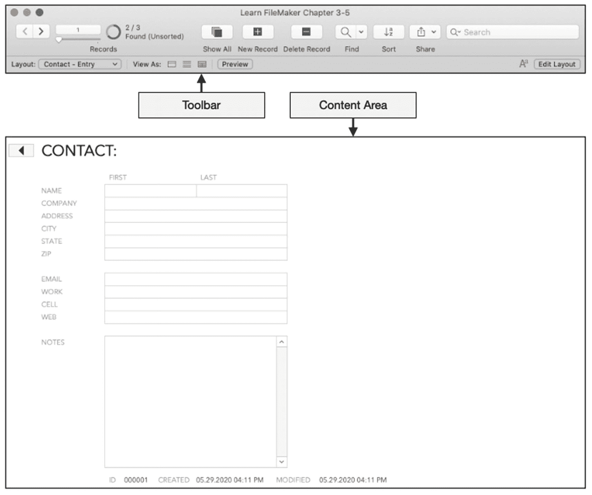
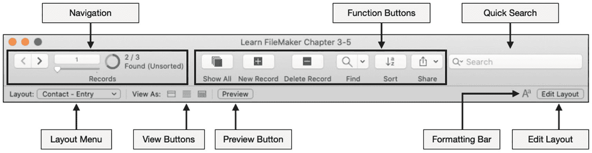
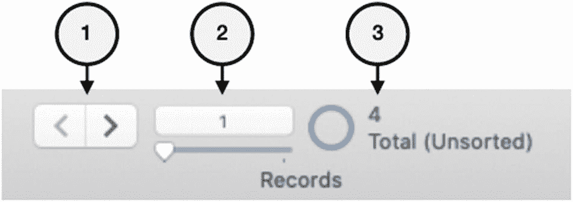
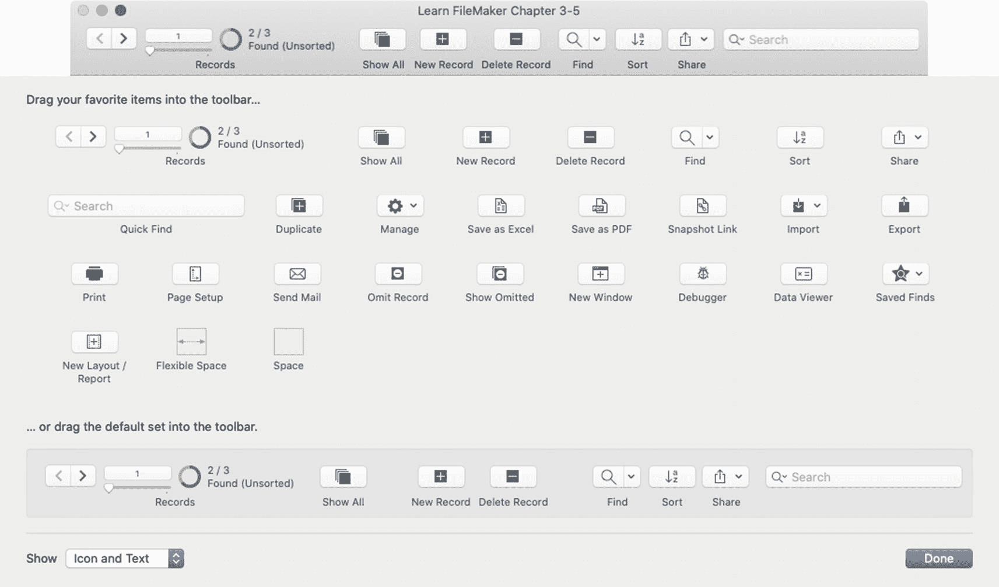
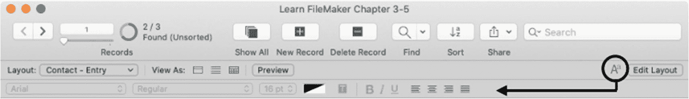
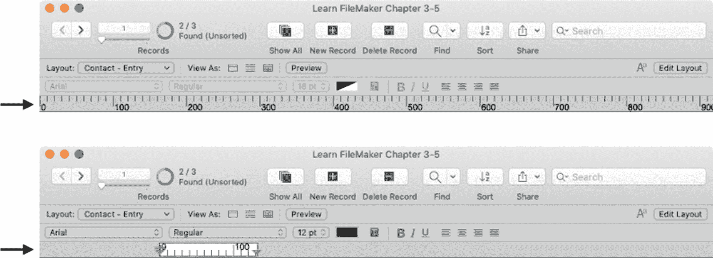
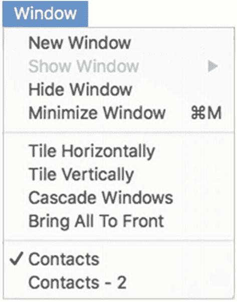
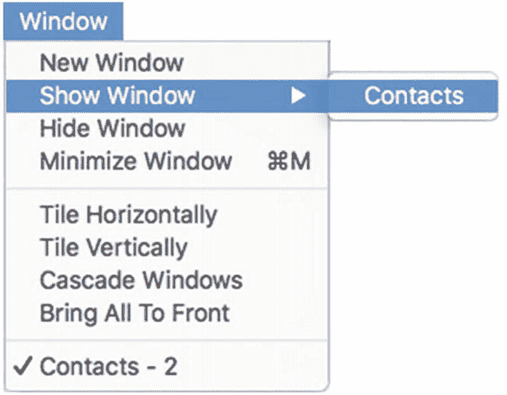

# 3. 探索数据库窗口

**数据库窗口** 是打开数据库文件的一个视图。作为一个全栈开发环境，FileMaker 的窗口具有不同的窗口模式，用于数据输入和开发。本章从**用户视角**开始探索数据库窗口，涵盖以下主题：

- 识别窗口区域和模式
- 探索窗口标题栏
- 管理多个窗口

由于我们直到第 6 章才会讨论创建数据库文件，为了跟随对窗口界面的探索，请花点时间从 Apress 网站 ([*https://www.apress.com/9781484266793*](https://www.apress.com/9781484266793)) 下载 Learn FileMaker 示例文件，并打开**第** **3** **-** **5** **章**文件夹。此示例包含一个简单的**联系人**表，该表有两个布局和一个简单的自定义主题，用于为本书呈现美观的示例图片。

## 识别窗口区域和模式

如图 3-1 所示的数据库窗口分为两个主要区域：**工具栏** 和 **内容区域**。**工具栏**（本章稍后讨论）是标题区域，包含两行控件，这些控件在所有数据库中都保持一致，但提供一些自定义选项。**内容区域** 包括工具栏下方的区域，用于显示由开发者设计的自定义用户界面。在此示例中，窗口预配置了一些简单的界面元素。创建新的空白文件时（第 6 章），此区域将完全空白，需要设计布局（第 17–22 章），布局在图形上可以更加复杂。此区域一次显示一个布局，但可以在文件中创建的任意数量的布局之间切换。内容的呈现方式取决于所选的**窗口模式** 和 **内容视图**。

**图 3-1** 两个窗口区域：工具栏（顶部）和内容区域（底部）

### 定义窗口模式

**窗口模式** 是一种显示状态，它会针对特定功能目的优化窗口界面。FileMaker 有四种模式，将在几个不同的章节中描述：**浏览**、**查找**、**预览** 和 **布局**。

**浏览模式** 是默认的窗口状态，用于与数据库内容进行交互并执行数据输入相关的任务。在浏览模式下，窗口的内容区域会呈现来自布局表的一组记录。根据布局的设计和帐户权限，用户可以与此数据交互，以创建、查看、编辑、删除、复制、搜索、排序和忽略记录，并与其它对象进行交互。

**查找模式** 是一种用于输入搜索条件的窗口状态。在查找模式下，布局会转换为一个空白的类似于记录的**请求**，用户在其中输入条件，以在执行搜索前定义所需的一组记录。

**预览模式** 是一种类似于打印预览的窗口状态，显示当前布局和找到的记录集在打印页面上的外观。布局看起来与浏览模式相似，但处于非功能状态。因此，字段不可编辑，未隐藏的按钮显示为不可点击的图形。此外，对象可能会根据其在布局上的定义方式而隐藏、滑动、压缩、汇总和更改格式。

**布局模式** 是一种用于创建界面布局的窗口状态。使用特殊的设计工具向布局添加和配置对象。

每种模式都有独特的工具栏、菜单栏和内容区域呈现方法。根据其访问权限（第 30 章），用户可以通过单击状态工具栏中的模式按钮、从**视图**菜单中选择模式或运行更改模式的脚本，来更改窗口的模式。本章和第 4 章将讨论如何使用浏览模式，以及如何使用查找和预览模式。在第 17–22 章中，我们将探讨如何在布局模式下设计自定义界面元素。

### 定义内容视图

**内容视图** 是一种界面设置，决定在浏览模式下，记录如何显示在窗口的内容区域中。根据布局设置（第 18 章“视图”）强制的限制，用户可以选择以最多三种格式查看记录：**表单**、**列表** 或 **表格**。可以通过从**视图**菜单中选择菜单项、单击工具栏中的**视图方式**图标或运行更改视图的脚本，来更改布局的当前视图。

在**表单视图**中，窗口一次只显示一条记录，该记录通过一组完整的布局元素呈现。要查看此视图中的其他记录，请使用工具栏中的导航控件或设计用于转到其他记录的自定义界面元素。这类似于查看从文件柜中取出的一张纸或一本书中的单页。

在**列表视图**中，窗口会显示一个连续的记录列表，通过将布局元素为每条记录重复一次来呈现。在此视图中，用户可以上下滚动以查看其他记录。这类似于查看文件柜中文件夹上的标签序列或书的目录。

在**表格视图**中，窗口以列和行的电子表格式格式显示一组记录，同时排除布局上存在的其他图形元素。用户可以通过拖动列标题来重新排列和调整列的大小。他们可以通过单击标题对记录进行排序。可以以类似于电子表格的方式直观地创建新字段（列）和新记录（行）。每个字段标题中都隐藏着一个弹出式操作菜单，提供对各种功能的快速访问，包括排序、汇总、字段控制和视图控制。表格视图在设计和自定义功能方面并不突出，但它为那些习惯于使用电子表格的用户提供了更熟悉的环境，并且可能适用于不需要复杂界面的简单数据库。

## 探索窗口标题栏

根据用户的访问权限、偏好设置以及开发者建立的设置，窗口的工具栏区域可以显示或隐藏三个水平栏。它们是：**状态工具栏**、**格式栏** 和 **标尺**。

### 状态工具栏（浏览模式）

`状态工具栏`是沿着窗口顶部延伸的最显眼区域，其中包含与当前窗口模式相关的控件。默认情况下，它是窗口标题栏唯一可见的部分。除非被脚本隐藏并锁定，用户可以通过菜单选择`查看 ➤ 状态`来切换工具栏的可见性。

#### 默认工具栏项目（浏览模式）

浏览模式的默认工具栏配置如图 3-2 所示。上半部分可自定义（将在本节后面讨论），下半部分是固定的。

图 3-2

默认浏览模式工具栏配置的剖析

##### 记录导航控件

工具栏中的`记录导航控件`（如图 3-3 所示）显示正在查看的记录的信息，并允许用户在已找到的记录集中移动（第 4 章）。

图 3-3

默认浏览模式导航控件

工具栏的导航控件包括：

1. `记录导航箭头` – 点击可移动到上一条或下一条记录。

2. `记录编号和滑块` – 当前记录的编号。移动滑块或输入记录编号可跳转到另一条记录。

3. `找到集状态` – 显示记录总数、找到集数量（若为总数的子集）以及排序状态。查看子集时，点击圆形图标可在找到记录和排除记录之间切换。

###### 功能按钮

工具栏中的`功能按钮`（如图 3-4 所示）允许用户执行各种记录功能（第 4 章）并访问共享功能菜单（第 29 章）。

图 3-4

浏览模式下的默认工具栏按钮

##### 快速查找搜索字段

工具栏的右上方是一个搜索字段，用于执行`快速查找`（第 4 章，“使用快速查找进行搜索”）。

### 布局菜单

工具栏中较低且不可自定义的层级以`布局`菜单开始。在浏览模式下，它会显示一个可见布局的列表（第 18 章），用于手动导航到其他布局，与`查看 ➤ 转到布局`菜单相同。

##### 内容视图按钮

下方栏中的下一个项目是三个`内容视图按钮`，用于更改窗口视图中内容的格式，如本章前面所述。此处启用的视图按钮由当前布局的视图设置控制（第 18 章）。

##### 预览按钮

工具栏的`预览按钮`将窗口切换到预览模式（第 4 章）。

### 格式栏按钮

`格式栏按钮`在状态工具栏和窗口内容区域之间切换文本编辑控件栏的可见性（将在本章后面描述）。

##### 编辑布局按钮

`编辑布局按钮`将窗口切换到布局模式（第 17 章）。

#### 自定义工具栏（浏览模式）

工具栏上半部分的控件可以在用户计算机级别进行自定义。这意味着用户可以自定义工具栏中控件的包含和排列方式，这将影响用户在其计算机上打开的所有数据库。打开数据库后，选择`查看 ➤ 自定义状态工具栏`菜单以打开自定义面板。在 macOS 上，这是一个附加到窗口的图形面板，如图 3-5 所示。在该对话框的左下角，有一个`显示`菜单，用于控制工具栏中的按钮格式。选项如下：`仅图标`、`仅文本`或默认的`图标和文本`。在 Windows 上，会出现一个不太美观的列表式对话框，并提供类似的拖放选项。

图 3-5

浏览模式的工具栏自定义面板（macOS）

##### 添加、移除和重新排列工具栏项目

要向工具栏添加项目，请将图标从自定义面板拖到工具栏区域并释放。FileMaker 会自动替换工具栏中已存在的同一控件，以避免重复。要移除项目，请将其拖出工具栏区域并释放鼠标按钮。项目可以通过在工具栏内拖动进行重新排列。

##### 恢复默认工具栏设置

要恢复默认控件集，请将面板底部矩形中的组拖到工具栏中并释放。

### 格式栏

`格式栏`是一组可选的文本格式控件，如图 3-6 所示。当选择`查看 ➤ 格式栏`菜单或点击工具栏右下角的按钮时，该栏会出现在默认状态工具栏底部与内容区域顶部之间。当用户点击进入文本字段时，这些用于`字体`、`样式`、`大小`、`颜色`、`高亮`、`强调`和`文本对齐`的控件将被启用。

图 3-6

格式栏和切换按钮

### 水平标尺

可以激活一个`水平标尺`，它显示在其他标题栏下方，如图 3-7 所示。`查看 ➤ 标尺`菜单可切换此标尺的可见性。可以使用其上下文菜单更改标尺的`度量单位`，选项包括`厘米`、`英寸`和`磅`。只有当光标在文本字段内时，浏览模式的标尺才变得有用，它会缩小到字段的大小并显示制表符和页边距。这些设置也可以通过布局工具进行修改（第 19 章，“探索检查器面板”）。

图 3-7

可见的标尺（上方）和字段获得焦点时的标尺（下方）

## 使用多个窗口

当打开一个数据库时，窗口会自动出现并显示默认布局。用户可以在该窗口中导航到其他布局，或者打开额外的窗口以访问同一文件的多个同时视图。他们可以查看布局和记录已找到集的任意组合。例如，可以在一个窗口中查看`联系人`记录，在另一个窗口中查看`联系人`列表，在第三个窗口中查看`公司`列表。打开一个新窗口允许在一个窗口中保留已找到集的位置，同时在相同或不同表中处理其他记录。用户和脚本可以根据需要打开和关闭窗口，以更有效地完成任务。脚本可以创建屏幕外的新窗口，以在不干扰当前视图的情况下执行工作（第 25 章）。

### 创建新窗口

选择 `Window ➤ New Window` 菜单来手动创建新窗口。新窗口将显示在当前窗口的前方，并略微偏移。它最初会是当前窗口的完全副本，具有相同的属性：`名称`（带后缀）、模式、视图、尺寸、**工具栏可见性**、布局、找到的记录集和当前记录。打开后，可以通过搜索、导航、移动和调整大小来更改这些属性。

多窗口非常适合并排查看记录或在不同的工作之间交替。然而，如果用户试图编辑一个在其他窗口中拥有活动焦点的记录，将会出现冲突警告。因此，建议用户谨慎使用此功能，并提醒他们在完成需要多个窗口的任务后，关闭多余的窗口并恢复到单个窗口。选择 `File ➤ Close Window` 菜单或点击窗口标题栏上的关闭图标即可关闭窗口。

### 从菜单中选择窗口

每个新窗口都会添加到 `Window` 菜单底部的列表中，如图 3-8 所示。这是一个混合列表，包含*所有打开的数据库*中所有可见的打开窗口，也包括那些位于屏幕外的窗口。该列表显示了窗口从前到后的当前堆叠顺序。选择一个窗口可将其置于最前。

**图 3-8**  
Window 菜单底部列出了所有可见窗口

### 隐藏和显示窗口

窗口可以保持打开状态但被隐藏。当数据库打开另一个数据库以访问其资源时，或者当脚本明确隐藏窗口时，会自动发生这种情况。用户可以通过选择 `Window ➤ Hide Window` 菜单手动隐藏窗口。每个隐藏的窗口都列在 `Window ➤ Show Window` 子菜单下，如图 3-9 所示。从此列表中选择一个窗口会使其可见并将其置于最前。`Bring All To Front` 选项可使所有隐藏窗口变为可见。屏幕外的窗口可以通过 `Tile Horizontally`、`Tile Vertically` 和 `Cascade Windows` 一次性全部恢复到视图中，并与屏幕上的窗口整齐排列。选择 `Minimize Window` 菜单项，可以将窗口最小化到 macOS 或 Windows 的 Dock 中。当最小化时，它会在菜单中列为一个已打开的窗口，但必须点击才能将其恢复到视图中。

**图 3-9**  
包含隐藏窗口的子菜单

## 总结

本章探讨了窗口的结构、工具栏控件以及管理多个窗口。在下一章中，我们将开始处理记录。

