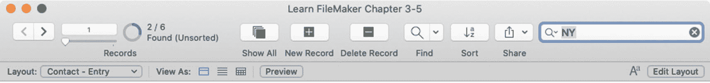

# 4. 处理记录

`记录`是表中内容的主要单元，是一组共同代表特定实体的值。使用电子表格的比喻来类比数据库文件与电子表格文件：表就像一个工作表，字段就像一列，而记录就像一行。在`联系人`表中，一条记录代表*一个人*，而在`库存`表中，一条记录代表*一个产品*。在使用数据库时，用户大部分时间都在执行涉及创建、编辑、删除、排除、搜索、导出、导入、打印和查看记录的任务。尽管一个数据库可以包含多个不同的表，每个表都有自己的记录集合，但本章使用包含单个`联系人`表的 `Learn FileMaker 第 3-5 章`示例文件。这简化了示例，并为以后开发更复杂的自定义解决方案提供了必要的基本上下文。本章探讨用户与记录的交互，涵盖以下主题：

- 输入数据
- 创建、删除和复制记录
- 搜索记录
- 处理找到的记录集
- 打印

## 输入数据

数据输入任务涉及打开一条记录、聚焦到某个字段、修改字段内容、在字段之间移动，然后提交（关闭）记录或将其还原。

### 打开记录

`打开`记录会使布局上的字段从显示信息的状态转变为可供数据输入的编辑状态。要打开当前记录进行数据输入，请点击布局中任何可编辑的字段，或按 `Tab` 键进入第一个可编辑字段。

### 了解字段焦点

当字段准备好接受输入时，它便具有`焦点`。一次只能有一个字段具有活动焦点，这一点可通过字段内闪烁的文本光标直观地指示出来。字段的视觉外观也可能根据应用于其`聚焦`状态的布局设置而变化（第 22 章，“编辑对象的样式设置”）。布局的设计应提供一些视觉变化，让用户清楚地知道记录已打开，以及哪个字段将接收他们的输入。例如，字段边框可能变得可见、改变粗细或应用颜色。字段的填充颜色也可以改变。在 `Learn FileMaker` 示例文件中，焦点通过一个更深的简单边框表示，如图 4-1 所示。可以通过点击其他字段，或按 `Tab` 键或其他按键，根据字段设置将焦点移动到`制表顺序`中的下一个字段来转移焦点（第 21 章）。

**图 4-1**  
Learn FileMaker 示例文件中处于焦点的字段

### 修改字段内容

当一条记录被打开且某个字段获得焦点时，可以通过多种方式更改字段中的值，具体取决于字段的数据类型（第 8 章）或布局行为及格式设置选项（第 19 章和第 20 章）。这些方式可能包括输入、剪切、复制粘贴、撤销重做、插入函数或鼠标点击。

在任何数据输入字段中输入数据最常用的方法就是直接在键盘上输入。只要字段处于焦点状态，输入的任何内容都会作为其内容流入。

与大多数应用程序一样，FileMaker 的“编辑”菜单包含用于剪切、复制、粘贴、撤销和重做的命令。这些功能仅影响获得焦点时字段中存储的内容。例如，“撤销”将回退刚在活动字段中进行的文本更改，但不能撤销创建或删除记录等操作，并且在记录关闭且更改被提交后不起作用。

当在应用程序偏好设置中启用了拖放功能（第 2 章）时，文本可以在字段内拖拽以重新排列。它也可以从一个字段拖拽到另一个字段，在不同窗口的字段之间拖拽，以及在字段与其他应用程序的文本之间拖拽。

“插入”菜单以及字段上下文菜单中同名的子菜单包含用于快速将内容插入字段的功能。每个功能都会根据焦点所在字段的数据类型（第 8 章）和该字段在布局上的可编辑状态（第 19 章）按情况启用。通过选择“插入图片”、“插入音频/视频”、“插入 PDF”或“插入文件”功能，可以插入不同类型的文件。使用其他功能可以快速插入当前日期、当前时间或当前用户名。“来自索引”选项用于从输入到该字段（在所有记录中）的值索引列表中选择一个值并插入到当前字段中。“来自上次访问的记录”选项则插入上次查看记录中当前字段的值。

最后，字段还可以配置为允许通过鼠标点击进行数据输入的控件样式。例如，复选框样式允许通过勾选框来输入值，而日历样式则提供一个图形化日历用于日期输入（第 20 章）。

### 关闭记录

编辑完成后，必须关闭记录以提交或还原更改。还原操作会关闭记录并放弃在该会话期间所做的所有更改。可以通过选择“记录”➤“还原记录”菜单或运行执行同名功能的脚本来还原记录。提交操作会关闭记录并保存该会话期间所做的更改。在此过程中，FileMaker 将执行数据输入验证，并在检测到问题时报告。可以通过多种方式提交记录。手动提交记录可以按 Enter 键，或者点击布局背景上远离其他对象的位置。其他会提交当前记录的操作包括：导航到另一条记录、创建新记录、关闭当前窗口、关闭文件，或者运行使用“提交记录/请求”脚本步骤的脚本。

> **提示**  
> 可以将布局配置为在提交时自动保存更改或显示确认对话框（第 18 章）。

## 创建、删除和复制记录

用户可以创建、删除、删除全部以及复制记录。用户可以通过“记录”菜单或自定义脚本访问所有这些命令。有些命令也可以通过工具栏图标或布局背景上的记录上下文菜单访问。

“新建记录”功能将在前台窗口当前布局的表中创建一个新的空白记录，并自动打开它，将焦点置于第一个字段。

“删除记录”功能将在显示警告对话框以确认用户意图后，永久删除窗口中的当前记录。用户可以在选择“删除记录”选项时按住 Option（macOS）或 Shift（Windows）键来绕过此警告对话框并立即删除记录。虽然这对高级用户来说可能是个有用的技巧，但这可能很危险，不应传授给新用户。使用自定义菜单禁用此功能可能是明智之举（第 23 章）。“删除全部记录”功能将删除当前找到集中的所有记录。

“复制记录”功能将创建当前记录的一个副本，并保留所有本地字段的值。

> **提示**  
> 要重置“学习 FileMaker” 第 3 章至第 5 章的示例数据，请选择“脚本”菜单下的“重置示例记录”。

## 搜索记录

一个 FileMaker 表最多可以包含 64 千万亿条记录。虽然大多数表可能永远达不到这个数字，但随着记录数量的增长，找到特定记录就变得越来越困难。即使只浏览几百条记录来查找一条，也可能会不必要地耗费时间。相反，记录搜索可以根据用户指定的条件快速创建出一个更小的临时记录子集。搜索帮助用户定位用于数据输入工作的记录，也能将一组记录隔离出来用于诸如打印或导出等流程。FileMaker 提供了几种搜索记录的方法：使用快速查找或字段选择进行快速搜索、使用“查找”模式构建复杂查找、SQL 查询（第 16 章）或自定义脚本（第 24 章）。

> **警告**  
> 除 SQL 查询外，所有搜索都是上下文相关的，并且是从窗口布局的角度执行的！

### 执行快速搜索

FileMaker 提供了两种执行单条件搜索的选项：“快速查找”和“查找匹配项”。

#### 使用快速查找进行搜索

快速查找功能会在当前布局的表中搜索记录，查找条件存在于布局上那些专门配置为包含在快速查找中的任何字段中（第 19 章，“检查数据设置”）。要手动执行此类查找，请在位于工具栏的搜索字段中输入一个词或短语（如图 4-2 所示），然后按 Enter 键。窗口中可见的记录将更新为仅包含那些在某个字段中具有匹配值的记录，并且导航区域中的“找到/总记录”计数会反映此变化。点击快速查找字段中的放大镜图标，可以查看文件中来自任何表的最近搜索列表，然后选择一个搜索条件，为当前布局的表重复执行该搜索。

*图 4-2：工具栏中的“快速查找”字段*

> **警告**  
> 搜索之后，文本会保留在搜索字段中，但不会与找到集交互。如果用户或脚本更改了找到集，该搜索条件会像一个过时的上次搜索提醒一样残留下来，不再与实际显示的记录相关。

