# 使用查找匹配进行搜索

*查找匹配*类型搜索利用字段中的文本选定内容作为条件，快速搜索同一字段中包含该值的所有记录。通过在字段中高亮显示某些文本并右键单击以访问上下文菜单，即可使用三种功能，如图 4-3 所示。每种功能都会通过匹配当前字段中的选定值来执行预定义类型的搜索。`查找匹配记录`选项会执行一次新查找，查找字段中包含选定值的记录。其余选项则用于修改当前的查找结果集；`缩小查找结果集`会执行收窄查找，仅保留查找结果集中字段包含选定值的记录；`扩大查找结果集`则执行扩展查找，将字段中包含选定值的任何记录添加到查找结果集中。

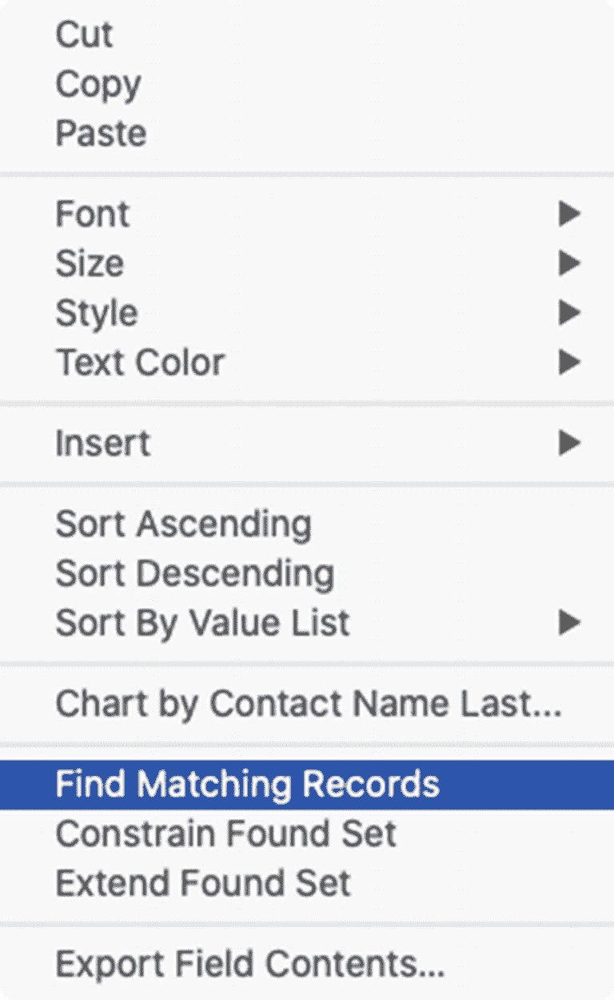

图 4-3 — 字段上下文菜单中的查找匹配记录功能

## 使用查找模式

对于更复杂的搜索任务，*查找模式*是一种过渡性窗口状态，它会更改菜单、工具栏和内容区域，以便灵活输入搜索条件，如图 4-4 所示。首先，通过选择`视图`菜单下的`查找模式`或单击`查找`工具栏图标进入查找模式。

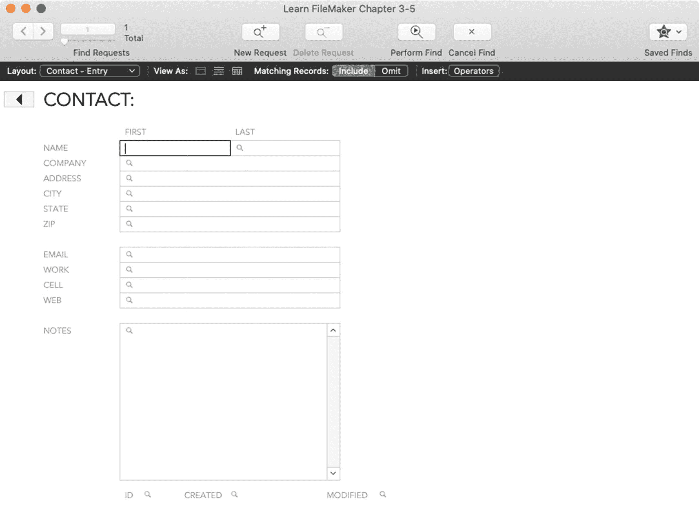

图 4-4 — 处于查找模式下的窗口会进行转换，显示查找请求和与搜索相关的工具栏功能

### 状态工具栏（查找模式）

查找模式的工具栏会变为搜索专用按钮，即默认的查找选项或用户自定义设置。

#### 默认工具栏项（查找模式）

查找模式的默认工具栏如图 4-5 所示。与浏览模式类似，顶部区域可以自定义，底部区域则是固定的。

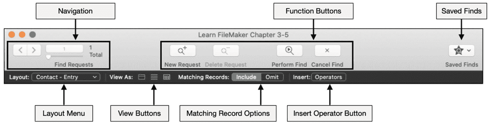

图 4-5 — 默认查找模式工具栏的结构解析

#### 导航控件

查找模式下的*导航控件*与浏览模式类似，不同之处在于它们显示的是与*查找请求*相关的信息和导航选项，而非关于记录的信息。

###### 功能按钮

查找模式工具栏中的*功能按钮*包括：

* `新建请求` – 创建新的查找请求以输入备选条件
* `删除请求` – 删除当前的查找请求
* `执行查找` – 执行查找并返回浏览模式，同时显示生成的查找结果集
* `取消查找` – 返回浏览模式并保留之前的查找结果集

##### 已保存的查找菜单

工具栏最右侧的`已保存的查找`按钮提供了一个菜单，可访问为当前表明确保存的查找。选择这些查找可以立即执行搜索，而无需输入自定义条件。请参阅本章后面的“使用已保存的查找”。

### 布局菜单

查找模式工具栏中较低且不可自定义的层级以`布局`菜单开始。其工作原理与浏览模式相同，允许用户切换布局。在查找模式下，如果用户希望使用仅在多个布局上可见的字段来创建查找，此功能会很有用。但由于查找需要表上下文，在执行时，*只有输入在与当前布局相同的表的布局上的条件才会被视为请求的一部分*。因此，请仅使用此功能来访问单个表的布局上的字段，因为其他表的字段将被忽略。

##### 内容视图按钮

*内容视图按钮*的工作原理与浏览模式（第 3 章）相同，将内容呈现为列表、表单或表格形式。

##### 匹配记录选项

*匹配记录选项*是两个可切换的选项，用于确定是否将匹配当前查找请求的记录*包含*在生成的查找结果集中，或是从中*排除*。请参阅本章后面的“指定匹配记录选项”。

### 插入运算符菜单

`插入运算符`菜单包含搜索运算符，可以插入到字段中，可配合其他条件使用，以增强搜索参数。请参阅本章后面的“使用搜索运算符”。

#### 自定义工具栏（查找模式）

查找模式工具栏可在用户计算机级别进行自定义。进入查找模式，选择`视图 ➤ 自定义工具栏`菜单，即可打开附加到窗口上的自定义面板，如图 4-6 所示。虽然可用的按钮不同，但可以按照第 3 章中描述的浏览模式那样添加或移除它们。

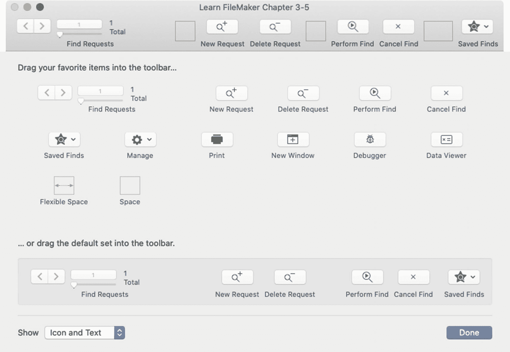

图 4-6 — 查找模式的工具栏自定义面板

### 输入条件并执行查找

在查找模式下，窗口的内容区域会呈现为当前布局的空白版本，称为*查找请求*。这看起来类似于一条记录，但用于输入搜索条件。与`快速查找`和`查找匹配记录`功能（用户一次只搜索一条信息）不同，查找请求允许在多个字段中输入条件。用户将条件输入到特定字段中，以构建更精确、更复杂的搜索请求。条件可以输入、粘贴或插入到字段中，并可结合搜索运算符使用。要成为符合匹配条件的记录，必须与单个请求中输入的所有值都匹配。

在相应字段中输入所需条件后，可以通过按`Enter`键、单击`执行查找`工具栏按钮或选择`请求 ➤ 执行查找`菜单来执行搜索过程。FileMaker 将在当前表中搜索指定的字段中匹配条件的记录，并显示结果查找结果集。如果没有结果，将弹出一个对话框，让用户选择返回到查找模式并编辑条件，或取消该过程并返回浏览模式。

尝试搜索 *Learn FileMaker* 示例记录，以获取为特定公司工作的联系人结果查找结果集，如图 4-7 所示，并按照以下步骤操作：

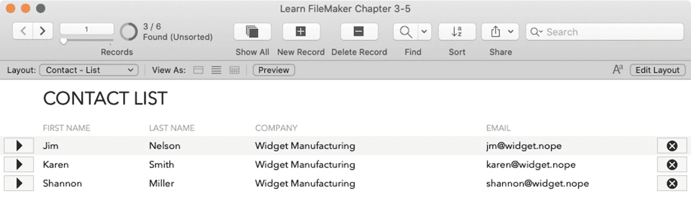

图 4-7 — 搜索得到的结果查找结果集仅显示匹配的记录

1.  进入查找模式。
2.  单击进入`公司`字段。
3.  输入所需值的部分或全部内容，例如“Widget”。
4.  单击工具栏中的`执行查找`按钮或按`Enter`键。

尝试使用不同的条件组合。例如，在`公司`字段中搜索“Widget”，并在`名字`字段中搜索“Karen”。由于结果必须同时包含这两个值，因此只会返回一条匹配的记录。

### 使用搜索运算符

*搜索运算符*是用于精确限定字段中输入搜索条件范围的一个或一组字符。若不使用运算符，FileMaker 默认执行“开头为”类型的搜索，即匹配单词开头的文本。因此，搜索`Widget`、`Wid Manu`或`W M`均能查找到字段中包含`Widget Manufacturing`的记录。在**查找模式**下，可通过直接在字段中输入运算符、使用工具栏中的*插入运算符*菜单或从字段的上下文菜单中选择*运算符*子菜单，将运算符添加到字段中，具体运算符将在表 4-1 中说明。要查看运算符的实际效果，请在*公司*字段中输入感叹号（`!`），以查找所有包含重复值的记录；或者在*姓氏*字段中搜索`*n`，以查找名称以此字符结尾的记录。

**表 4-1** 查找模式下的可用运算符说明

| 运算符 | 说明                                                                                                                                                                                                                          |
|--------|-------------------------------------------------------------------------------------------------------------------------------------------------------------------------------------------------------------------------------|
| `=`    | 单独使用，查找该字段为空的记录。放在值前面，匹配字段中的完整单词，排除部分匹配。                                                                                                                                                |
| `==`   | 放在值前面，匹配字段中的整个短语。                                                                                                                                                                                            |
| `!`    | 查找该字段中存在重复值的记录，即该字段的值在其他记录中也存在。                                                                                                                                                                  |
| `<`    | 查找数值或文本值小于符号后输入值的记录。                                                                                                                                                                                      |
| `≤`    | 查找数值或文本值小于或等于符号后输入值的记录。                                                                                                                                                                                |
| `>`    | 查找数值或文本值大于符号后输入值的记录。                                                                                                                                                                                      |
| `≥`    | 查找数值或文本值大于或等于符号后输入值的记录。                                                                                                                                                                                |
| `...`  | 根据运算符前后输入的文本查找一系列值。例如，输入`1/15/2021…1/30/2021`（不含引号），可查找字段中包含所列两个日期之间（含这两个日期）日期的所有记录。                                                                            |
| `//`   | 查找字段中包含当天日期的记录。                                                                                                                                                                                                |
| `?`    | 查找字段中包含无效值的记录。                                                                                                                                                                                                  |
| `@`    | 查找字段中包含特定数量任意字符的记录。例如，`@@`将匹配`He`或`It`，而`@@@@`将匹配`Door`或`Test`。                                                                                                                             |
| `#`    | 查找字段中包含特定数量任意数字的记录。例如，`#`将匹配`3`或`8`，而`##`将匹配`33`或`81`。                                                                                                                                       |
| `*`    | 用于代替字符创建搜索模式，表示必须存在某些值。例如，单独使用将查找该字段包含任何值的所有记录（即排除空值）；或输入`1/15/*`，可查找字段中包含任意年份 1 月 15 日的所有记录。                                                         |
| `\`    | 对下一个字符进行转义。当搜索字面运算符时非常有用，可将运算符视为搜索条件的一部分而非运算符。例如，要查找字段中包含引号的记录，请输入`\"`。                                                                                   |
| `` `"" `` | 用于精确匹配引号之间的短语。                                                                                                                                                                                                  |
| `*""`  | 用于匹配包含大量文本的字段中任意位置的引号之间的短语。                                                                                                                                                                        |
| `~`    | 用于对日文文本执行宽松搜索。                                                                                                                                                                                                  |

### 操作先前执行的查找

执行查找后，FileMaker 提供了三种无需从头创建新请求即可进一步优化结果的方法：*修改*、*扩展*和*约束*上一次的查找结果。

#### 修改上一次查找

*修改上一次查找*功能会重建在当前表中执行的最后一次查找的查找请求和条件，并允许编辑条件并执行修改后的搜索。此命令可通过*记录*菜单、工具栏中*查找*图标下的菜单或作为脚本中可包含的步骤来使用。

#### 扩展上一次查找

*扩展查找结果集*命令使用新的搜索来查找匹配的记录并将其添加到当前查找结果集中。可通过两种方式访问。在**浏览模式**下，选中字段中的某些文本，然后从上下文菜单中选择`命令`。系统会使用选中的文本来查找不在结果集中的记录并将其添加进来。在**查找模式**下，输入条件并选择*请求 ➤ 扩展查找结果集*菜单（而非*执行查找*）。结果将添加到当前结果集中。例如，如果当前查看的查找结果集中记录的*州*为`NY`，则进入查找模式，在*州*字段中输入`CO`，然后选择*扩展查找结果集*，结果将得到一个来自*两个州*的联系人扩展列表。

#### 约束上一次查找

*约束查找结果集*命令使用新的请求从当前结果集中移除记录。可通过两种方式访问。在**浏览模式**下，选中字段中的某些文本，然后从字段上下文菜单中选择*约束查找结果集*。系统会使用选中的文本在当前结果集中仅保留包含匹配值的记录。在**查找模式**下，输入条件并选择*请求 ➤ 约束查找结果集*菜单（而非*执行查找*）。上次结果集中不匹配条件的记录将被移除。例如，如果当前查看的结果集中记录的*公司*为`Widget`，则进入查找模式，在*州*字段中输入`CO`，然后选择*约束查找结果集*，最终的结果集将仅保留上一次结果集中来自科罗拉多州的联系人。

### 管理多个查找请求

查找模式会创建一个默认的查找请求。可扩展此请求以创建更复杂的搜索。每个请求都提供一组额外的条件，用于定义匹配记录应包含在结果中还是从中排除。所有请求的结果将被合并为最终结果。因此，如果一个请求指定了*州*为`NY`的记录，另一个请求指定了*州*为`CO`的记录，则结果将是这两组记录的合并列表。包含多个字段条件的单个请求相当于“与”类型搜索，记录必须满足所有值才能包含在结果中。换句话说，它必须在一个字段中包含指定值*并且*在另一个字段中包含指定值。相反，多个请求则相当于“或”类型搜索，记录必须至少满足一个请求的所有条件。换句话说，它必须包含来自一个请求的指定值*或者*来自另一个请求的指定值。

用户可以像操作记录一样*创建*、*删除*和*复制*查找请求，不同之处在于这些操作通过*请求*菜单访问，该菜单在查找模式下会替代*记录*菜单。其中一些操作也可通过工具栏图标或布局背景上的*记录上下文菜单*访问。

### 指定匹配记录选项

每个新查找请求都有一个默认的*匹配记录选项*，设置为`包含`，这意味着匹配请求条件的记录将包含在结果中。如果在下部工具栏中将此选项切换为`排除`，则匹配的记录将从之前请求的结果中排除。在图 4-8 所示的示例中，第一个请求将包含*公司*字段中所有包含`Widget`的记录，第二个请求将从该结果集中排除任何*名字*为`Jim`的匹配项。最终结果将是所有为 Widget 公司工作（除了 Jim）的联系人。将此设置与多个查找请求结合使用，可以构建并执行极其复杂的包含-排除多条件搜索。

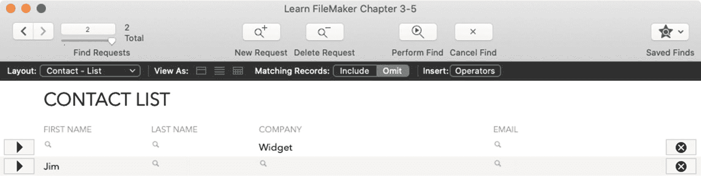

**图 4-8** 设置为排除结果的第二个查找请求示例

### 使用已保存的查找

查找请求可以保存以供将来重复使用。在浏览模式下，可通过*查找*按钮工具栏和*记录 ➤ 已保存的查找*菜单访问*已保存的查找*菜单。在查找模式下，可通过*已保存的查找*工具栏按钮访问该菜单。此菜单用于*保存*和*管理*已保存的查找，以及*执行*已保存或最近的查找。

*保存当前查找*选项将打开一个对话框以开始保存过程。可以输入名称，并且可以选择编辑条件。在浏览模式下，将保存最后执行的查找。在查找模式下，将保存输入的当前查找条件。

*编辑已保存的查找*选项会打开一个同名的对话框，如图 4-9 所示，该对话框用于创建、编辑、复制或删除已保存的查找。

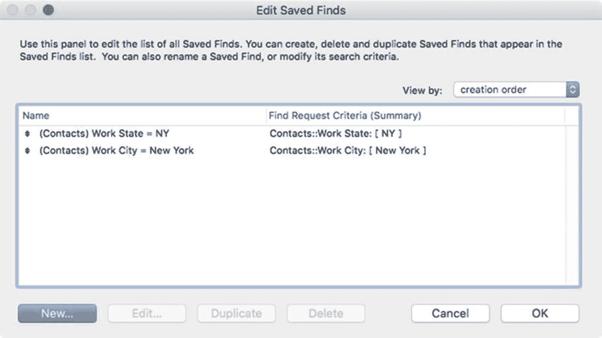

图 4-9

用于查看和管理已保存查找的对话框

#### 管理查找请求

保存或编辑查找时，会打开一个*为已保存的查找指定选项*对话框，其中显示该查找的名称。单击*高级*按钮将在*指定查找请求*对话框中打开存储的条件，如图 4-10 所示。此对话框中的每一行代表构成该查找的一个请求。可以使用此对话框上的按钮*创建*、*编辑*、*复制*或*删除*请求。每个请求都指定一个操作（查找或排除）并显示条件。选择一个请求并单击*编辑*以打开编辑对话框。

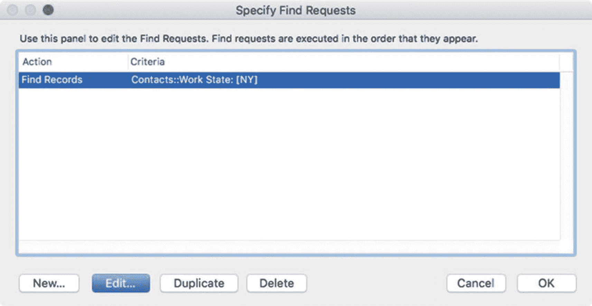

图 4-10

用于在已保存的查找中查看和管理查找请求的对话框

#### 编辑查找请求条件

*编辑查找请求*对话框，如图 4-11 所示，用于编辑新查找或已保存查找的查找请求。可以通过单击*新建*、*编辑*或双击图 4-10 对话框中的查找请求来打开此对话框。创建查找请求或执行查找的脚本步骤（第 25 章，“搜索与处理找到的记录集”）也会使用此对话框。

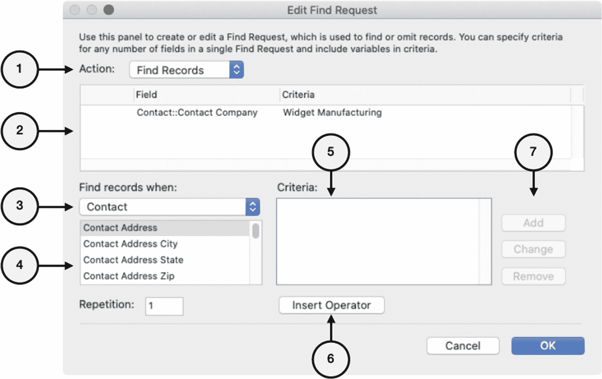

图 4-11

用于编辑已保存查找的单个请求的对话框

在对话框中，您可以使用以下控件编辑请求的条件：

1.  *操作* – 选择*查找记录*或*排除记录*，用于指示请求的匹配记录选项
2.  *条件列表* – 列出构成请求的每个已定义字段条件，并在下方显示所选行的详细信息
3.  *表* – 选择要查找搜索字段的表出现
4.  *字段* – 选择搜索字段
5.  *条件* – 要在所选字段中搜索的值
6.  *插入运算符* – 单击以选择并插入运算符
7.  条件按钮 – 用于*添加*新请求、*更改*当前选定的请求或*移除*选定的请求

## 使用找到的记录集

*找到的记录集*是指在一个给定窗口的上下文中可见且可导航的一组记录。虽然找到的记录集可能包含表内的*所有记录*，但该术语通常指由搜索或其他操作生成的一个记录*子集*。不属于找到的记录集且不可见或不可导航的记录被称为*排除的记录集*。在单个窗口中，当导航到同一表的其他布局时，会保留每个表的找到的记录集。当使用多个窗口时，同一表在每个窗口中可以显示不同的找到的记录集。

当工具栏隐藏时，用户无法知道找到的记录集是否包含少于全部记录，除非创建自定义布局元素来显示该信息。即使工具栏可见，也容易忽略这一点。当新手用户看到一个包含大量记录的表只显示一个小的找到的记录集时，一开始可能会惊慌失措，不知道他们所有的记录都去哪了。差异显示在工具栏导航区域的记录计数中，如图 4-12 所示。当所有记录都可访问时，仅显示记录总数。当子集处于活动状态时，第一个数字表示可见找到的记录集包含多少条记录，而第二个数字表示记录总数，其中包括从找到的记录集中排除的记录。

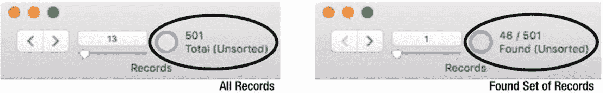

图 4-12

查看所有记录（左）或找到的记录集（右）时的记录计数

### 更改找到的记录集中的记录

可以通过执行查找或*记录*菜单中的几个命令之一来更改找到的记录集中的记录。*显示所有记录*命令将当前窗口中的找到的记录集替换为表中的所有记录。*排除记录*命令会将当前记录从找到的记录集移动到排除的记录集。这可用于通过排除单个记录来微调结果，而无需执行新的、更复杂的搜索。*排除多条*命令允许用户指定从当前记录开始希望排除的任意数量的记录。例如，如果用户正在查看包含 100 条记录的找到的记录集中的第一条记录，并选择排除 10 条记录，则将排除前 10 条记录，剩下 90 条记录。但是，如果他们正在查看 100 条中的第 50 条记录并执行相同操作，则将排除第 50-59 条记录，剩下第 1-49 条和第 60-100 条记录。最后，*仅显示排除的记录*命令会将当前找到的记录集替换为排除的记录集。或者，单击工具栏导航区域中的圆圈图标，以在找到的记录或排除的记录之间切换。

### 对查找集中的记录进行排序

`记录排序状态`始终显示在工具栏的记录导航区域中，如图 4-13 所示。记录默认按创建顺序排列，这被视为`未排序`。可以根据自定义的排序字段列表对其进行排序，该列表可以使用`排序记录`对话框（如图 4-14 所示）从本地或关联字段中编译。该对话框可通过在`记录`菜单或记录上下文菜单中选择`排序记录`命令来打开，也可以通过单击工具栏中的`排序`按钮来打开。

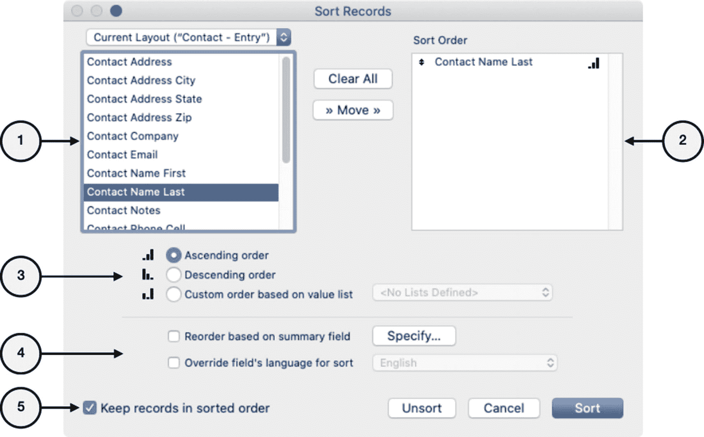

图 4-14

用于排序记录的对话框

图 4-13

排序状态始终显示在工具栏的记录计数区域

以下排序控件可用：

1. `字段选择器` – 从基于上方弹出菜单中选择的表或布局的列表中选择一个字段。

2. `排序顺序` – 按将用于排序记录的顺序列出当前的`排序字段`。通过在字段选择器中双击字段或使用`移动`按钮来添加字段。向上或向下拖动以重新排列。通过在此处双击或使用`清除`按钮来移除字段。要移除所有字段，请单击`全部清除`。

3. `排序字段方向` – 选择选定字段的排序方向：`升序`（默认）、`降序`或`基于值列表的自定义顺序`（第 11 章）。排序顺序列表中的字段旁边会显示图标，以指示分配了哪个选项。

4. `排序选项复选框` – 启用高级排序控制：
   * `基于汇总字段重新排序` – 选择一个汇总字段（第 8 章），根据排序字段的值由另一个排序字段进行子汇总后的位置来重新排序记录。例如，联系人列表可以按州（排序字段）进行汇总，但按居住在每个州的联系人数量（汇总字段）进行排序。
   * `排序时覆盖字段的语言` – 选择在排序时用于对文本字段建立索引的语言。

5. `保持记录排序顺序` – 取消选择可防止在修改排序字段的内容时记录不断重新排序。

### 修改查找集中的字段值

有多个命令可用于修改整个查找集中的字段值：`替换字段内容`、`重新查找字段内容`、`查找和替换`以及`拼写检查`。

#### 替换字段内容

`记录`菜单下的`替换字段内容`命令会打开如图 4-15 所示的对话框。此命令用于定义一个值，该值将插入到查找集中每条记录的当前字段中，完全替换之前的值。替换值可以是当前记录字段中包含的字面值；一个从第一个记录指定数字开始，并为每个后续记录递增指定数量的序列号；或者是一个计算结果（第 12 章）。

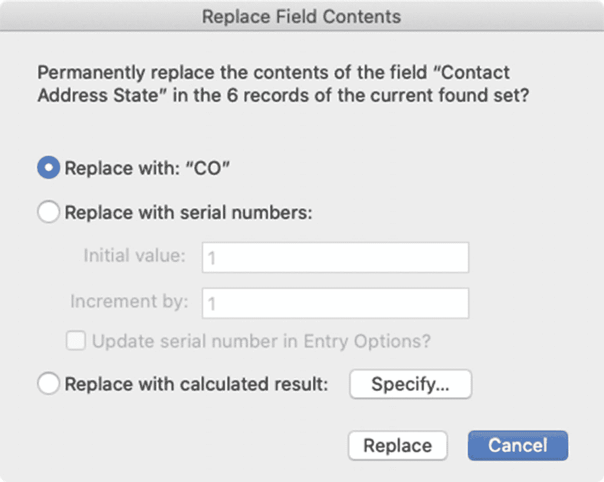

图 4-15

用于定义替换值的对话框

警告

替换过程不可撤销，应谨慎使用。使用自定义菜单（第 23 章）向不需要此功能的用户隐藏此功能，并创建自定义脚本（第 24 章）来安全地执行开发者定义的替换。

#### 重新查找字段内容

当一个字段被定义为使用`查找`功能（第 8 章，“字段查找对话框”）从相关记录复制数据时，可以使用`重新查找字段内容`命令手动强制更新查找集中每条记录的已复制值。

警告

`查找`功能是在更优秀的自动输入选项和关系出现之前的遗留残余。

#### 查找和替换

FileMaker 的`查找和替换`功能让人联想到文本编辑器中的相应功能。它可以在当前查找集的一条或所有记录的一个或所有字段中定位文本，并可选择用替代文本替换匹配项。通过`编辑`菜单中的`查找/替换`功能将打开同名的对话框，如图 4-16 所示。

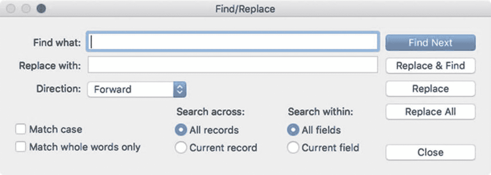

图 4-16

用于查找和替换文本的对话框

首先，在`查找内容`字段中输入文本，并可选择在`替换为`字段中输入文本。`方向`弹出菜单提供了在查找集中的字段和/或记录中`向前`或`向后`移动的选项。勾选`区分大小写`复选框可使查找过程区分大小写；勾选`仅全字匹配`则仅当字段中的文本完全包含输入到`查找内容`字段中的完整、独立的单词时才视为匹配。`搜索范围`单选按钮指示该功能是应搜索查找集中的`所有记录`还是仅限于`当前记录`。`搜索区域`选项控制它是应搜索布局上的`所有字段`还是仅搜索`当前字段`。

配置完成后，`查找下一个`按钮会定位并高亮显示当前字段、下一个字段或下一个记录中`查找内容`字段文本的下一个实例，具体取决于对话框中的其他设置。`替换并查找`按钮会定位第一个匹配实例（如果尚未找到），或者用替换文本替换当前高亮显示的匹配文本，然后定位下一个匹配实例。如果查找操作已选定搜索文本的一个匹配实例，则`替换`按钮会执行替换功能。之后，光标会立即出现在替换文本之后。`全部替换`按钮会根据对话框中的设置替换搜索文本的所有匹配实例。

### 拼写检查

FileMaker 内置了拼写检查器，可对选定的文本片段、某个字段的内容、当前记录中的所有字段，或已找到记录集中的所有记录进行处理。

#### 探索“拼写”菜单

“编辑”菜单下的“拼写”子菜单提供了若干命令，用于实现标准拼写检查功能。“检查所选内容”命令可快速检查当前字段中选定文本的拼写。“检查记录”会检查布局上当前记录中每个字段的文本，而“检查全部”则会对已找到记录集中每条记录的当前布局中的所有字段进行检查。“纠正单词”命令会检查字段中最后输入的单词，但仅当“键入时检查拼写”设置设为“对可疑拼写发出提示音”时（第 6 章，“文件选项：拼写”），该命令才可用。你可以使用“选择词典”来选择语言，并通过“编辑用户词典”将自定义术语添加到用户词典中。

#### 上下文拼写功能

当启用了“用特殊下划线标出可疑单词”文件选项时，活动字段中的任何可疑单词都会用红色下划线标记出来。此选项适用于整个文件，但可以在布局上针对个别字段将其关闭（第 19 章，“检查数据设置”）。启用后，所选单词的文本上下文菜单顶部会显示一个建议拼写和替代单词列表，如图 4-17 所示。

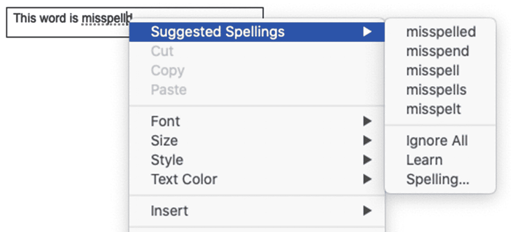

图 4-17

上下文菜单显示可疑单词的替代拼写

## 打印

可以使用熟悉的操作系统“页面设置”和“打印”对话框来预览和打印窗口的内容区域。

### 使用预览模式

“预览模式”是一种过渡性窗口状态，它会更改菜单、工具栏和内容区域，以便在将布局发送到打印机或保存为 PDF 文件之前对其进行查看。要预览布局，请从“查看”菜单中选择“预览模式”，或单击“预览”工具栏图标。工具栏选项将更改为与打印相关的功能，内容区域将成为一个或多个不可交互、不可编辑的页面，其呈现效果与打印时完全一致。任何交互式对象（如按钮、选项卡、滑动控件等）都将显示为无效的静态图形。根据每个布局对象的设置，某些对象和数据可能不可见、被重新格式化、滑动到新位置或从页边距处截断。

#### 状态工具栏（预览模式）

预览模式下的工具栏将变为特定于打印的按钮，这些按钮可以是默认选项，也可以是用户自定义的集合。

##### 默认状态工具栏项目（预览模式）

预览模式的默认工具栏如图 4-18 所示。与浏览模式类似，顶部区域可以自定义，而底部区域是固定的。

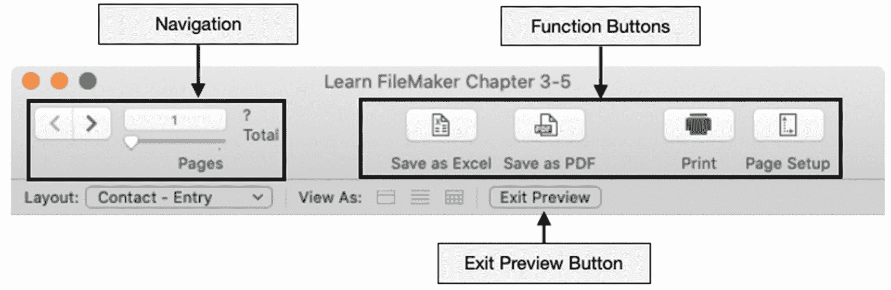

图 4-18

预览模式下工具栏的结构分析

#### 导航控件

预览模式工具栏中的“导航控件”与浏览模式和查找模式中的类似，但区别在于它们显示的是关于“打印页面”的信息，并允许在“打印页面”之间移动，而不是在记录或查找请求之间移动。最初，如果整个文档尚未渲染完成，页数可能会显示为问号。点击翻页或滚动到文档末尾以更新页数。

###### 功能按钮

默认预览工具栏中包含的功能按钮有：

- “另存为 Excel” – 将记录导出到 Excel 文件
- “另存为 PDF” – 将预览保存为 PDF 文件
- “打印” – 打开对话框以将预览发送到打印机
- “页面设置” – 打开对话框以配置页面设置，从而更改渲染效果

###### 退出预览按钮

“退出预览按钮”将结束预览并使窗口返回浏览模式。

##### 自定义状态工具栏（预览模式）

预览模式工具栏可以在用户计算机级别进行自定义。进入预览模式，然后选择“查看 ➤ 自定义工具栏”菜单，以打开附加到窗口上的自定义面板，如图 4-19 所示。尽管可用的按钮不同，但它们的添加或删除方式与第 3 章中描述的浏览模式操作方式相同。

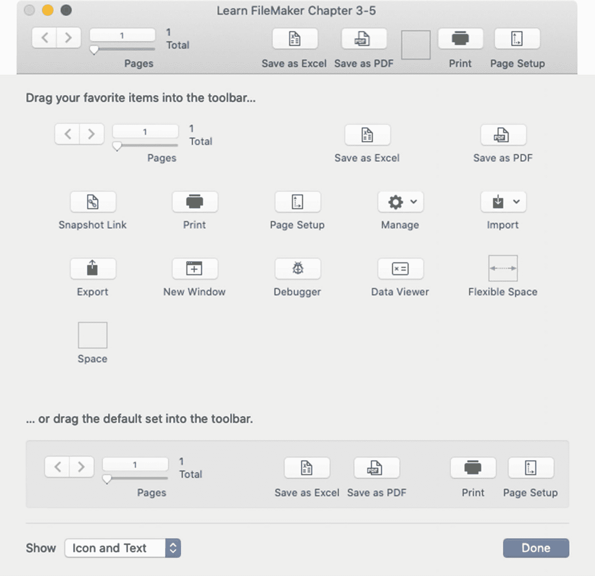

图 4-19

预览模式的工具栏自定义面板

### 页面设置

“页面设置”对话框（在 Windows 中为“打印设置”）是一个标准操作系统对话框，用于配置当前布局在预览或打印时的行为方式，如图 4-20 所示。在浏览模式、预览模式或布局模式下，可以通过在“文件”菜单中选择“页面设置”来访问此对话框。在此处，你可以选择“打印机”、“纸张大小”、“方向”和“缩放百分比”。

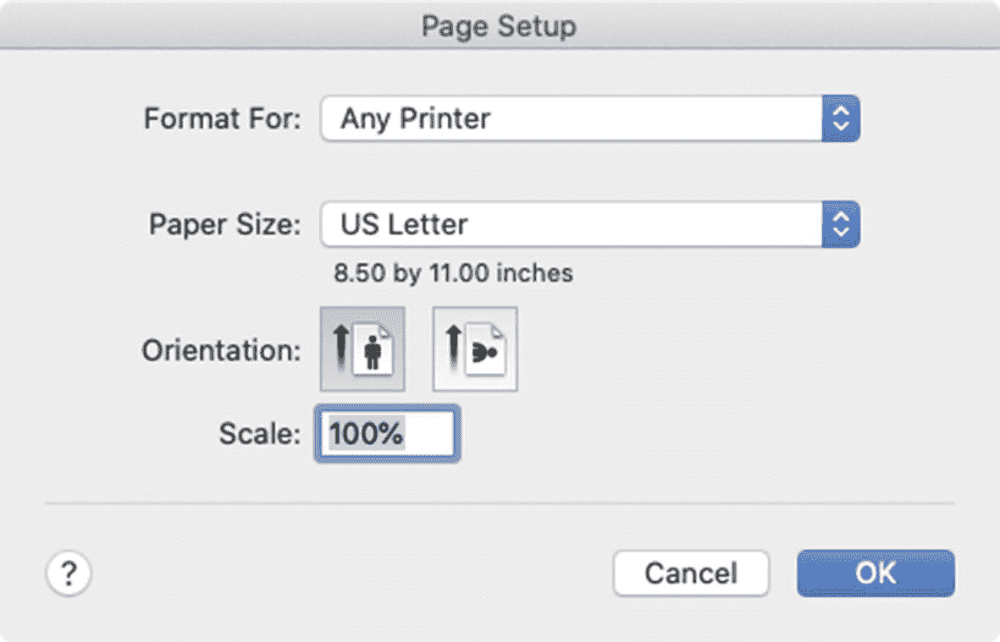

图 4-20

用于配置页面设置的对话框

### 打印对话框选项

“打印”对话框是一个用于配置打印任务的标准操作系统对话框，如图 4-21 所示。可以通过在“文件”菜单中选择“打印”，或单击预览模式工具栏中的“打印”来打开此对话框。

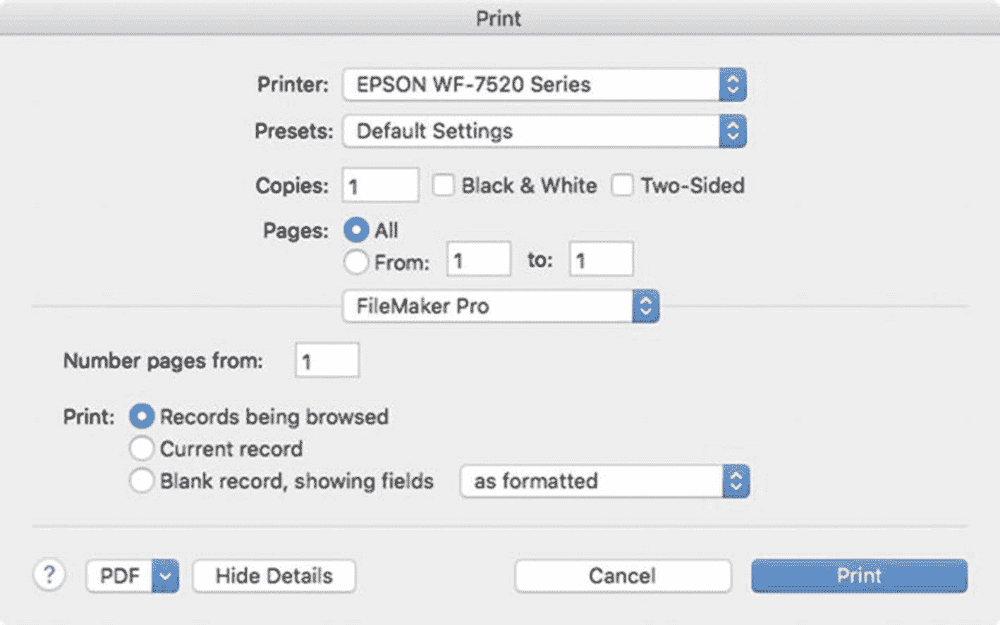

图 4-21

用于准备发送到打印机的任务的对话框

虽然大多数选项与其他应用程序相同，但有一些是 FileMaker 特有的。“起始页码”字段接受一个页码，该页码将作为编号的第一页。三个打印选项决定了窗口内容区域的打印方式。选择“正在浏览的记录”可包括已找到记录集中的每条记录；选择“当前记录”则仅包括打开“打印”对话框时已选择或正在查看的当前记录。选择“空白记录，显示字段”可打印不带任何记录数据的布局。相邻的菜单控制字段的打印方式：“按格式设置”、“带框”、“带下划线”或“带占位符文本”。

## 总结

本章探讨了用户如何与记录进行交互以输入数据、执行搜索和打印。在下一章中，我们将重点讨论记录的导入和导出。

