# 5. 传输记录

FileMaker 具有“导入”和“导出”功能，可以在两个位置之间手动或通过自动脚本化流程传输记录。这允许共享数据以避免重新输入、将模板数据移动到内容表中进行自定义、将旧数据迁移到较新版本的数据库、将数据发送到其他系统等等。本章讨论以下数据传输主题：

-   支持的文件类型
-   导入记录
-   导出记录

## 支持的文件类型

FileMaker 可以多种格式“导入和导出记录”，如图 5-1 所示。此外，还支持从 ODBC 和 XML 源，或从包含图片、影片或文本文件的文件夹进行“内容导入”。

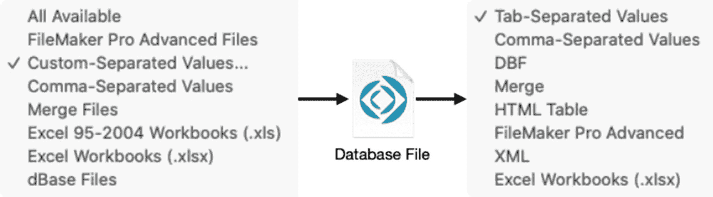

图 5-1

记录导入（左）和导出（右）支持的文件类型

> **注意**  
新的“自定义分隔值”导入选项允许选择分隔符，并取代了之前的“制表符分隔值”。

### 导入记录

`import records` 函数会在当前布局的表中创建或更新记录。记录可以从多种来源导入：同一文件内的表、外部数据库或各种基于文本的数据文件。若要探索此功能，请将一些联系人数据导入到 `Learn FileMaker Chapter` 3–5 数据库中。首先，从 [`www.briandunning.com/sample-data/`](http://www.briandunning.com/sample-data/) 免费下载 `us-500.csv` 联系人示例文件。然后，选择 `文件 ➤ 导入记录 ➤ 文件` 菜单，打开 `选择文件` 对话框，如图 5-2 所示。

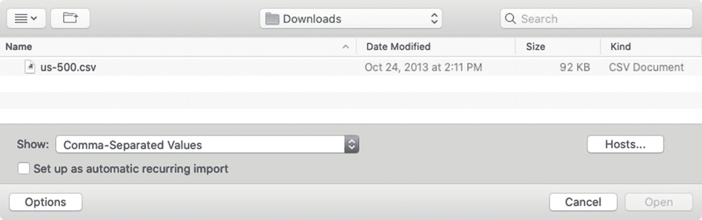

图 5-2

用于选择要导入的文件的对话框

该对话框允许从任何文件夹目录中选择文件。还可以通过单击底部`选项`区域中的`主机`按钮（第 29 章）来访问托管在 `FileMaker Server` 上的数据库。此区域还包含一个`显示`弹出菜单，其中列出与导入兼容的文件类型，可在文件较多的文件夹中高亮显示特定文件。勾选“创建重复导入”复选框，可以跳过手动执行的导入步骤，并自动创建一个新表、布局和脚本，以便将来重复使用，从而提供快捷方式。现在，请选择并打开下载的 CSV 文件。

## 执行导入

选择并打开数据文件后，将出现一个`指定导入顺序`对话框，如图 5-3 所示。该对话框包含用于浏览源数据、指定导入类型、选择目标表以及设置导入选项（根据所执行的导入类型而有所不同）的区域。默认设置为`添加导入`，即所有导入的记录都将作为新记录添加到目标表中。

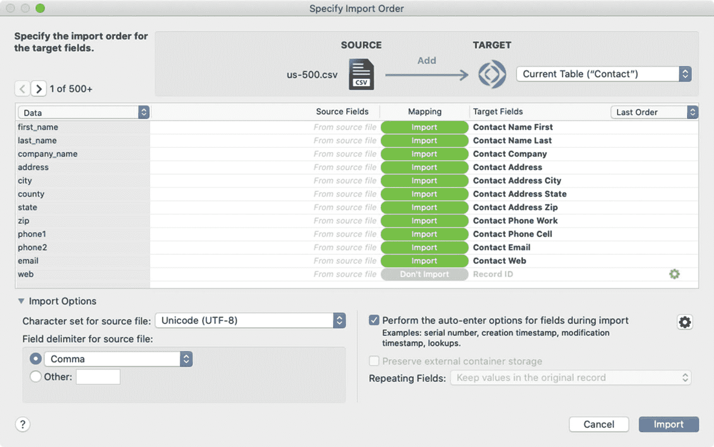

图 5-3

导入字段映射对话框

**注意：** 此对话框设计是在 `FileMaker 18` 中引入的，与早期版本完全不同。

### 浏览源数据

`导入` `源数据` 显示在最左侧列的列表中，可以使用其上方的箭头按钮进行导航。一个弹出菜单（适用于基于文本的数据文件导入）会显示一个值，指示或控制下方显示的行/记录在导入时的处理方式。`数据`选项是所有条目的默认设置，表示该数据将作为普通记录导入。选择`用作字段名称`选项会将当前条目的值指定为字段/列名称的来源。这可以分配给任何单个记录，并为导入在源数据中建立起点。任何位于该记录之前的记录将自动被分配一个`排除`值，表示该记录不会被导入。这允许将包含文档信息和列标题的多个“标题行”从实际要导入的数据中排除。源数据中任何位置的个别行也可以手动排除。向右移动，`源字段`列表会显示源数据中的字段名称（如果可用）。从基于文本的数据文件导入时，除非某个记录被指定为字段名称的来源，否则这些字段将显示为`来自源文件`。从 `FileMaker` 数据库导入时，将显示实际的字段名称，并且对对话框源数据侧的唯一控制是能够导航和查看源数据记录。

### 选择目标表

`目标表`是传入数据的目标表，默认设置为当前布局的表。`目标`弹出菜单（如图 5-4 所示）提供了一个选项，用于在导入过程中创建新表。该菜单是标准的 `FileMaker` `表选择菜单`，列出`当前表`、`相关表`、`不相关表`和一个`管理数据库`选项，以及一个仅导入时才有的`新建表`选项。由于导入必须在当前布局的上下文中进行，这些选项在导入时大多被禁用。除了将当前表作为目标外，唯一的选择是创建一个新表。

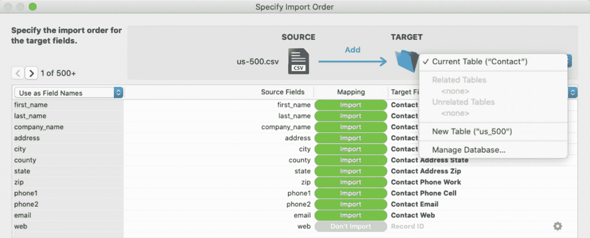

图 5-4

导入目标表弹出菜单

选择`新建表`选项将配置对话框，使其在导入期间自动创建新表并将数据流入其中。除非某行已指定为`用作字段名称`，否则`目标字段`列表将显示按数字顺序排列且带有“f”前缀的新名称。

`管理数据库`选项已启用，它会打开一个同名对话框（第 7-9 章），以便在目标表中创建新字段，从而无需退出导入对话框即可将这些字段包含在导入中。

### 将字段从源端映射到目标端

目标表和导入源文件的字段数量可能或多或少，并且顺序也可能不同。因此，有必要指明应导入哪些源字段，并将其与适当的目标字段进行匹配。这种`字段映射`过程是`指定导入顺序`对话框的主要用途。

中间列表中每个可选的行都显示`源字段`、`映射`和`目标字段`这几列，并且后两列各自打开一个选项菜单。`映射`列显示了相应两个字段的导入状态：`导入`或`不导入`。单击可显示选项菜单，如图 5-5 所示。

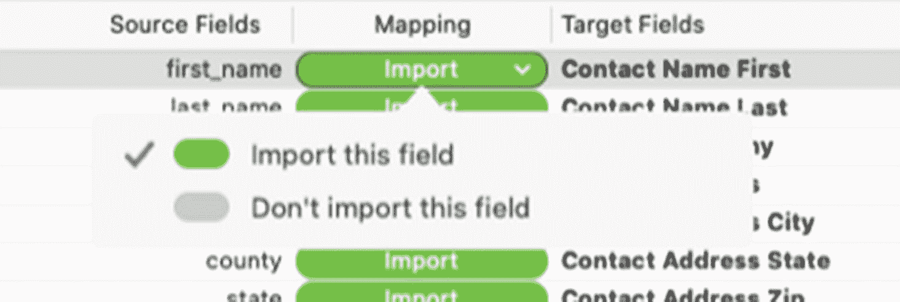

图 5-5

选择是导入还是不导入所选字段。

`目标字段`列的每一行都会打开一个菜单，允许选择对应的源字段应流入哪个字段，如图 5-6 所示。当前行的字段将在列表中高亮显示。图标指示着每个字段当前的导入状态：箭头表示它们已配置为接收来自源端的输入，空心椭圆表示未配置。不接受数据输入的字段（如计算字段或汇总字段）将分组显示在底部的`不用于导入`文件夹下。单击以选择与源字段对应的合适目标字段。当所有输入字段都映射到目标字段后，就该配置导入选项了。

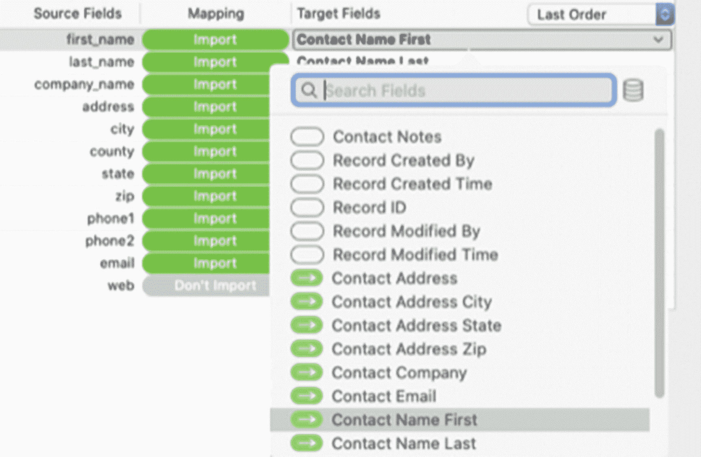

图 5-6

用于排列目标字段列表的可用选项

### 设置导入选项

在“指定导入顺序”对话框底部的*导入选项*部分（如图 5-7 所示），可根据导入源的类型控制各种行为。

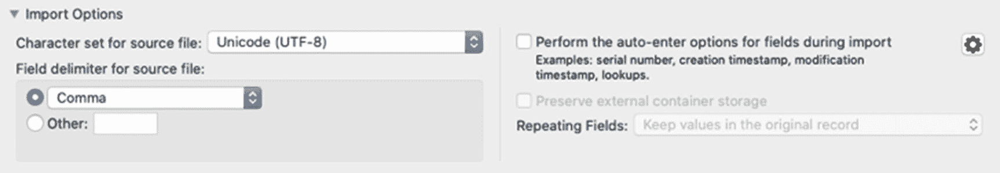  
图 5-7: 对话框的导入选项部分

左侧的*文本解析选项*控制导入源的解析方式，仅在从基于文本的文件导入时可见。在此处可以选择字符集和字段分隔符：*逗号*、*制表符*、*分号*、*空格*或自定义值。

右侧的导入选项影响新信息放入数据库字段时的行为。

*“执行自动输入选项”*复选框控制哪些定义了自动输入设置的字段（参见第 8 章）会在导入过程中更新其值。这使得可以保留源文件中的序列号、创建或修改数据，或根据目标字段定义更新这些数据。未接收数据的字段可使用此功能触发其自动输入选项。勾选此框可选择所有此类字段，在相邻菜单中选择单个字段，或点击上方列表中单个字段右侧的红色齿轮图标。当导入到 *Learn FileMaker* 文件时，请为所有字段开启此选项。

*“保留外部容器存储”*复选框可抑制容器字段内容验证，允许目标表使用现有的外部容器内容（参见第 10 章）。当将数据重新导入现有文件或其副本时，选择此项可避免在源字段和目标字段的基目录相同时对外部文件进行解密和重新加密。

*“重复字段”*选项允许选择将重复字段（参见第 8 章）保留在单条记录中，还是将它们拆分为每条重复项对应一条导入记录。选择后者时，所有非重复字段将被复制，每个重复项将生成一条记录。

### 完成导入

配置完成后，点击*导入*按钮执行该过程。系统将显示*“导入摘要”*对话框，报告添加或更新的记录数、跳过的记录和字段数，以及创建的表数量（如有）。一个名为 `Import.log` 的文本文件将保存到数据库文件夹中，其中包含导入过程的详细信息，并记录可能发生的任何错误。导入过程结束后，窗口中的找到集将仅包含导入的记录。

### 更改导入类型

除了前面描述的*“添加记录”*类型导入外，还有另外两种导入类型：*更新*和*替换*。这两种类型不创建记录，而是用于覆盖现有记录。点击源图标和目标图标之间的区域，可访问*“导入类型选择”*面板，如图 5-8 所示。

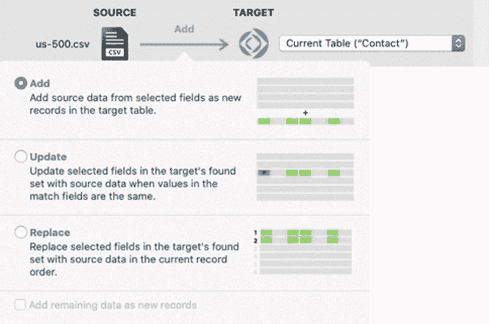  
图 5-8: 用于选择不同导入类型的隐藏面板

#### 更新找到集中的匹配记录

*更新*导入是一种非线性数据传输，它会根据匹配条件将源数据的每条记录导入到现有记录中。*“匹配字段”*是一种新的字段映射指定方式，如图 5-9 所示，用于将一个或多个字段标记为匹配条件，以将传入记录与目标表中的记录进行匹配。

  
图 5-9: 匹配字段的扩展映射选择

在导入过程中，传入的每条源记录将根据选定的匹配字段与现有记录进行匹配。如果找到匹配记录，则该记录的其余字段将更新到其映射的目标字段中。如果未找到匹配记录，则跳过该记录，除非选中了选择面板底部的*“将剩余数据添加为新记录”*复选框（如前文图 5-8 所示）。

#### 替换找到集中的记录

*替换*导入将使用传入的记录值，根据对应集合中的线性位置覆盖现有记录的字段，而无需考虑匹配记录。换句话说，源数据中第一条记录的值将用于替换目标集合中第一条记录的映射字段值。这在以下情况中可能很有用：需要导出一组数据，在 FileMaker 外部对其进行操作，然后立即替换这些记录的部分或全部字段值。使用此导入类型时，通常源数据和目标表的当前找到集应包含相同数量的记录。如果源记录数*少于*目标找到集，则找到集中超出源记录数的记录将不会被修改。如果源数据计数*大于*目标表的找到集，则导入将在处理完找到集中的记录数后停止，除非选中了*“将剩余数据添加为新记录”*复选框。

### 设置自动定期导入

在“选择文件”对话框中选中可选的*“设置为自动定期导入”*复选框（如前文图 5-2 所示），将完全跳过导入过程的其余部分，创建一个新的表、布局和脚本，这些资源可自定义并用于将来自动化同样的过程。选中后，将打开*“定期导入设置”*对话框，如图 5-10 所示。该对话框会记住源数据的路径，并提供三个可配置选项。选择*“不导入第一条记录”*可跳过导入第一条记录，而是将其用作字段名称。另外两个字段允许输入布局名称和脚本名称，以覆盖基于导入文件名输入的默认名称。

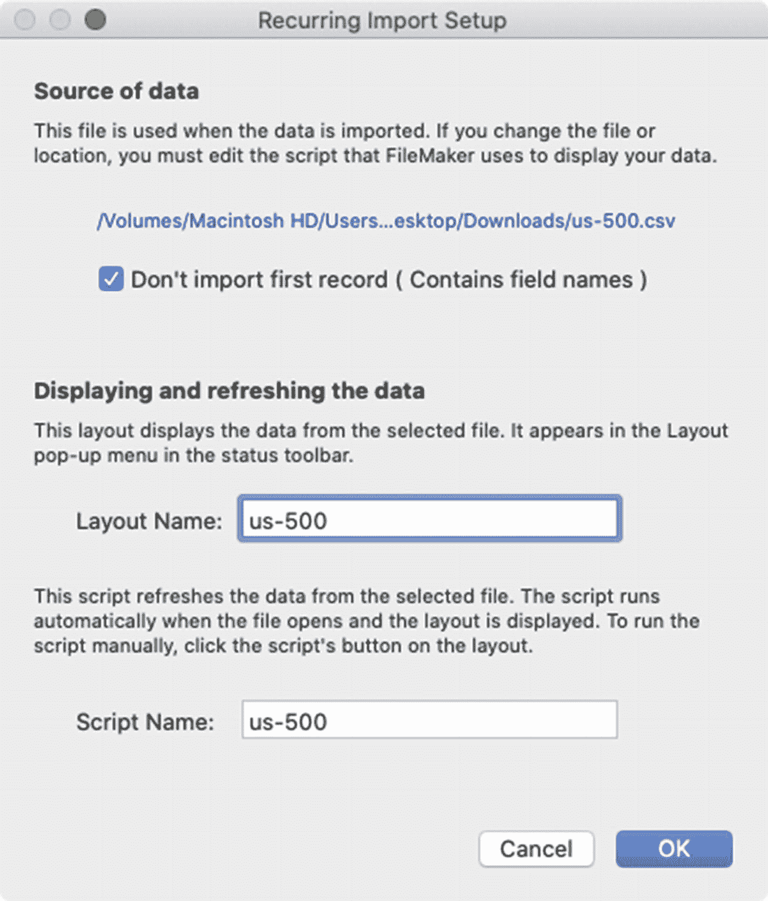  
图 5-10: “定期导入设置”对话框

配置完成并继续后，将创建一个新表，其名称与源数据文件相同，并为其包含的每一列数据创建一个字段。同时创建一个包含指定名称的新布局，并显示所有字段。还会创建一个具有指定名称的脚本，该脚本将导航到新布局，删除所有记录，并从文件中导入记录，从而刷新数据。所有这些资源随后都可以根据特定工作流程的需要进行重命名和自定义。

### 导出记录

*“导出记录”*功能会将当前找到集中每条记录的一个或多个选定字段的值保存到指定类型的文件中。要开始导出，请打开一个数据库，导航到所需布局，并可选择执行查找以隔离所需的找到集。选择 *文件 ➤ 导出记录* 菜单，打开*“将记录导出到文件”*对话框，如图 5-11 所示。除了标准的文件名和文件夹位置选择外，下方还提供了一些 FileMaker 特定的选项。从弹出菜单中选择导出的*文件类型*，并选择*“保存后”*操作快捷方式之一（打开或通过电子邮件发送新文件）。点击*保存*继续该过程并指定导出字段。

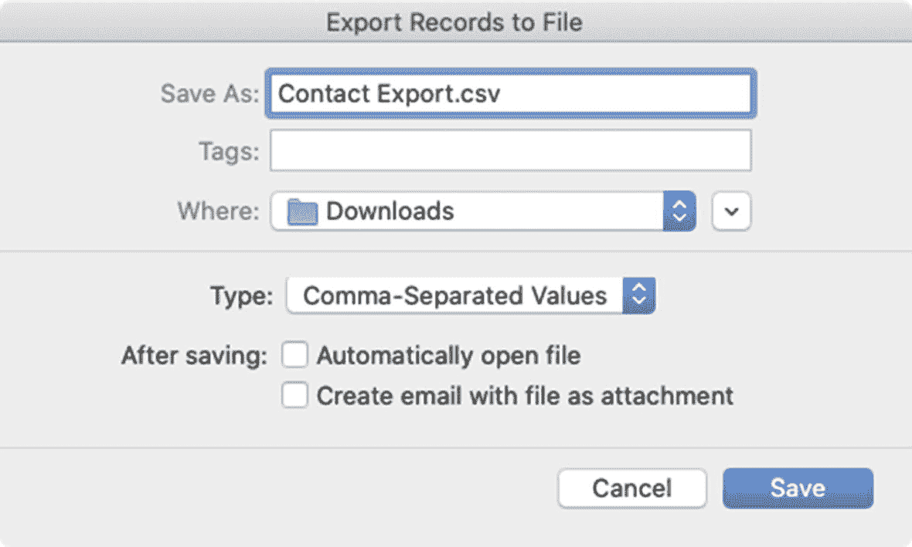  
图 5-11: 用于指定导出位置、文件名和类型的对话框

### 指定导出字段

“指定导出字段顺序”对话框（如图 5-12 所示）用于选择导出时要包含的字段、它们在输出文件中的保存顺序以及一些格式选项。

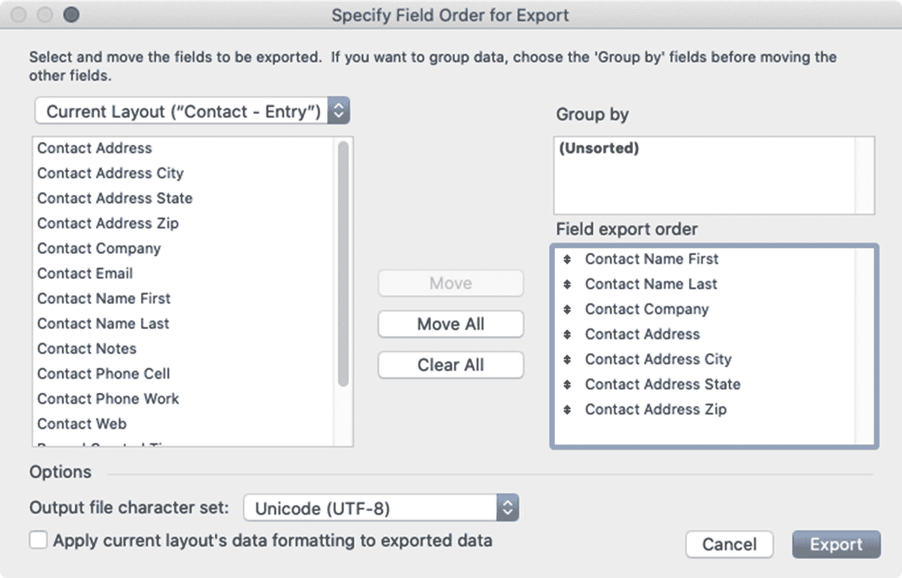

图 5-12：用于指定导出字段顺序和设置的对话框

在左侧，数据源弹出菜单用于指定生成下方字段列表的位置。默认情况下，已选择`当前布局`，仅显示当前布局上的字段，包括本地字段和相关字段。选择`当前表`可以显示当前布局表出现中的所有字段，或选择某个相关表出现以在导出中包含相关字段（第 9 章）。

可以通过双击列表中的字段或使用`移动`或`全部移动`按钮将字段添加到导出顺序中。导出列表中的字段将按照它们出现的顺序保存到输出文件中，并且可以拖拽到所需的顺序。通过双击列表中的字段、单击`清除`或`全部清除`按钮，或按 Delete 键，可以从导出列表中移除字段。

设置好字段顺序后，有几个选项可用。`输出文件字符集`弹出菜单用于指定导出过程中使用的字符编码。`应用当前布局的数据格式`复选框将使任何数字、日期或时间字段以当前布局上的数据格式进行导出，而非实际输入数据的格式（第 19 章“数据格式”）。例如，如果一个数字字段包含“10”，但在当前布局上被格式化为显示货币（例如“$10.00”），则必须勾选此框才能以货币格式导出该数字。

### 将输出汇总为组

对于更复杂的导出，`分组依据`功能允许在导出过程中对值进行子汇总。如果找到的记录集已排序，则对话框的`分组依据`区域将包含排序字段列表，这些字段可用于在导出过程中汇总数据。例如，假设有一组记录集，如表 5-1 所示，包含三个字段的值：`公司`、`行业`和`数量`。`数量汇总`字段是一个汇总字段，它会自动将六个记录的`数量`字段进行汇总（第 8 章“汇总字段”）。

表 5-1：展示未分组汇总行为的假设记录

| 公司 | 行业 | 数量 | 数量汇总 |
| --- | --- | --- | --- |
| Online Tutor, LLC | 教育 | 20 | 95 |
| Learning Resources | 教育 | 15 | 95 |
| Mutual Investors Corp | 金融 | 5 | 95 |
| Dividend Party, Inc. | 金融 | 10 | 95 |
| Knowledge Bound Co. | 出版 | 35 | 95 |
| Widget Books, Inc. | 出版 | 10 | 95 |

如果导出这三个字段，结果文件中的值将与表中的值相同。然而，可以先按`行业`字段对记录进行排序，然后将数据作为每个行业的总数量汇总报告进行导出。开始导出操作，当进入“指定字段顺序”对话框时，`分组依据`区域会为`行业`字段提供一个复选框。将`行业`字段和`数量汇总`字段添加到导出列表。系统会自动添加第三个额外字段：`按行业汇总的数量`。最后一个字段将以斜体显示，以突出它并非数据库中的实际字段，而是按行业汇总的子汇总，如图 5-13 所示。

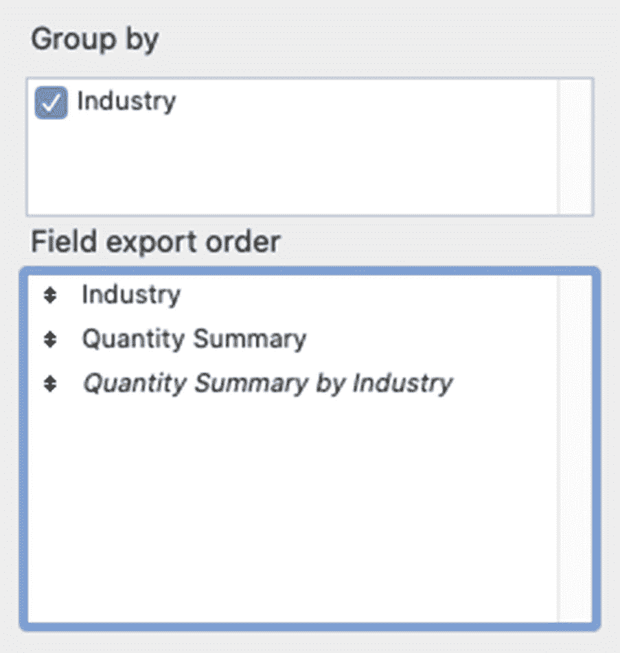

图 5-13：使用分组依据功能的字段导出顺序示例

采用此配置后，导出文件将包含每个行业一行数据，第一行为三个行业的总数量，第三列为每个行业的总数量，如表 5-2 所示。

表 5-2：使用`分组依据`选项导出的假设数据

| 教育 | 95 | 35 |
| 金融 |   | 15 |
| 出版 |   | 45 |

## 本章小结

在本章中，我们探讨了导入和导出记录的基础知识。在下一章中，我们将从用户视角转向开发者界面，并开始定义数据结构。

