# 6. 使用数据库文件

数据库是以数字格式存储的结构化信息集合，可灵活访问以实现各种功能。FileMaker 数据库文件是一个文档，既包含开发者定义的结构元素，也包含用户输入的数据。FileMaker 12 至 19 版本共享了单一的文件格式，并以文件扩展名 `fmp12` 标识。本章涵盖了创建、配置和维护数据库文件的基础知识，包括：

- 创建新的数据库文件
- 配置文件选项
- 设计并维护健康的文件

**注意：** 虽然 `fmp12` 扩展名表示文件在 FileMaker 12 至 19 版本之间兼容，但新版本中引入的功能在旧版本中并不向后兼容。

## 创建新的数据库文件

可以通过启动解决方案、空白文件，或者将电子表格或其他基于文本的文件转换为 FileMaker 数据库来创建数据库文件。所有这些操作都可以在“启动中心”窗口的`创建`选项卡中执行，该选项卡可通过选择`文件`菜单中的`新建`来访问。

### 从启动解决方案创建数据库

启动解决方案是 Claris 作为 FileMaker 安装的一部分提供的一组模板。虽然本书专注于从空白文件开始，但这些模板可以作为构建自定义解决方案的基础起点，或作为“通过示例学习”的教程。要开始操作，请按照图 6-1 所示的步骤，创建一个`联系人`启动模板的副本。

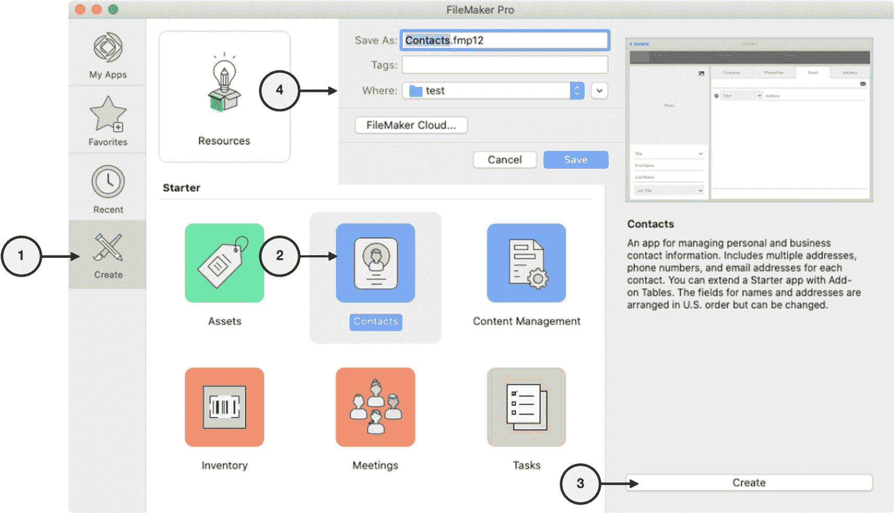

图 6-1：从启动解决方案创建新数据库的过程

1.  在“启动中心”窗口中选择`创建`选项卡。
2.  点击`启动器`标题下的`联系人`图标。
3.  点击`创建`按钮。
4.  在窗口顶部附着的`保存`对话框工作表中，指定名称和保存位置。

**注意：** 启动器是 Claris 设计的示例。它们所采用的结构和设计选择不应被视为必须无条件遵循的严格规则。

### 从空白模板创建数据库

要从空白模板创建新数据库，请选择“文件”菜单中的`启动中心`，然后按照图 6-2 所示的步骤操作。

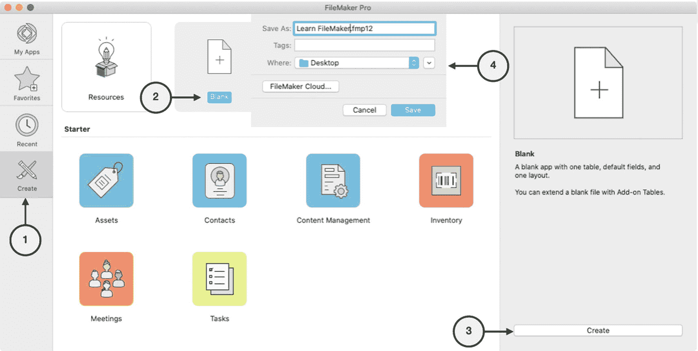

图 6-2

用于创建新的空白数据库文件的对话框

1. 在“启动中心”窗口中选择`创建`选项卡。
2. 选择`空白`图标。
3. 点击`创建`按钮。
4. 在窗口顶部附着的“保存”对话框表中，输入名称（若要跟随本书示例操作，请键入“Learn FileMaker”），选择位置，然后点击`保存`。

**注意：** 您创建的文件在外观上会与本书的屏幕截图有所不同，因为为了视觉清晰而使用了自定义主题。请从 Apress.com 下载示例文件以跟随示例操作。

### 将现有文件转换为数据库

FileMaker 可以自动将各种文件转换为新的数据库文件。这包括较旧版本的 FileMaker 数据库、电子表格或其他基于文本的数据文件。首先，在“启动中心”窗口的`创建`选项卡中选择`转换`选项，然后选择源文件。或者，您也可以将文件直接拖放到 FileMaker 应用程序文件上。

如果源文件是扩展名为 `fmp12` 的 FileMaker 数据库，它将直接打开，因为这是版本 12–19 使用的当前文件格式。如果文件具有之前的 `fmp7` 扩展名，FileMaker 19 将重新创建该文件，并保存一份副本为当前文件格式。任何在此之前的扩展名文件，都必须先使用 FileMaker 11 的副本转换为 `fmp7` 格式，然后才能由 FileMaker 19 将其转换为现代格式。

如果源文件是结构化数据文件，则在一系列对话框中会提供各种选项。该文件可以是多种文件类型之一，包括`制表符分隔`、`逗号分隔`、`合并文件`、`Excel 工作簿`（`xls` 或 `xlsx`）、`dbase`，或者来自 XML 或 ODBC 数据源。例如，假设有一个 Excel 电子表格。如果为转换选择的文件包含多个带标签的工作表，则会弹出一个“指定 Excel 数据”对话框，询问应使用哪个工作表作为数据源。随后会弹出一个保存对话框，要求为新文件指定名称和位置。源文件的列将用于自动定义一个表，其字段命名为 `f1`、`f2`、`f3` 等。一个类似于“指定导入顺序”对话框（第 5 章）的“转换文件”对话框将打开，允许重命名目标表，并可选择使用所选源记录中的字段名称。完成后，新的数据库文件将包含一个表，其中填充了指定的字段，并包含两个布局：一个名为`布局 #1` 的表单布局和一个名为`布局 #2` 的列表布局。随后，您可以根据需要定制数据结构和界面。

### 配置沙箱表

在探索文件基础知识之前，让我们在 `Learn FileMaker` 数据库中配置一个基本的 `Sandbox` 表。此过程将快速概述如何构建包含字段和布局的表，并快速浏览将在后续章节中深入探讨的一些课程。同时，它也为在后续关于构建布局的课程之前，提供了一个用于尝试和可视化计算结果的实验沙箱。

**提示：** 完成这些课程将为您快速入门数据库设置。但是，在 Apress.com 提供的 `Learn FileMaker Pro Chapter` 6 文件中，这些步骤已经完成。

### 更改默认表名

一个新的数据库文件会自动创建一个与文件同名的默认表。因此，示例数据库应该已经有一个名为 `Learn FileMaker` 的表和一个同名的空白布局。当数据库需要一个同名的表时，这种默认行为可能是合适的。例如，名为 `Contacts` 或 `Projects` 的数据库很可能需要一个同名的表。但出于我们的目的，并且为了获得一些实际经验，我们将把默认表重命名为 `Sandbox`。

首先，我们需要确保“管理数据库”对话框已打开。根据应用程序设置（第 2 章），新文件可能以布局模式打开（不打开该对话框），也可能以浏览模式打开（同时打开该对话框）。如果在布局模式下，请选择`文件 ➤ 管理 ➤ 数据库`菜单项打开此对话框。然后按照图 6-3 所示的步骤操作：

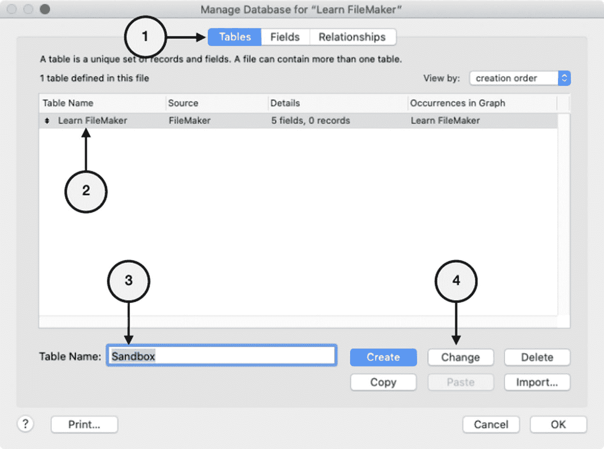

图 6-3

突出显示重命名默认表的过程

1. 点击`表`选项卡。
2. 确保选中默认的 `Learn FileMaker` 表。
3. 在`表名称`字段中键入 `Sandbox`。
4. 点击`更改`按钮，然后点击`确定`。

### 添加占位字段

重命名后的 `Sandbox` 表可能已经定义了五个字段。自版本 17 起，FileMaker 会自动创建默认字段（第 8 章，“定义默认字段”）。目前，我们将忽略这些字段，并为每种可用的数据类型创建一个字段，作为接下来章节中将讨论的主题的实验示例。

#### 创建数据输入字段

首先，我们将创建六个能够接受用户输入的数据输入字段。首先，点击`字段`选项卡。然后，按照图 6-4 所示的步骤操作：

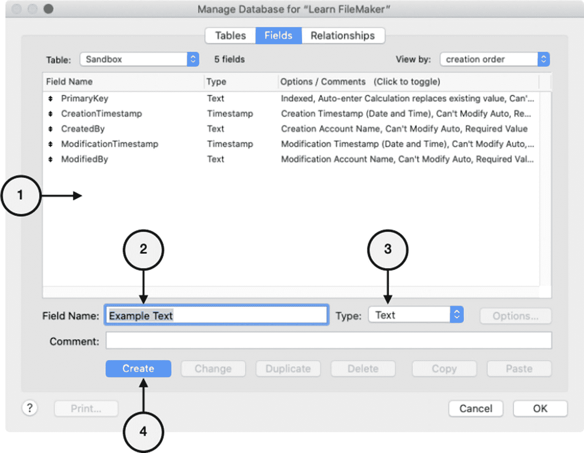

图 6-4

在 Sandbox 表中创建文本字段的过程

1. 点击默认字段下方的空白区域，确保没有选中任何字段。
2. 在`字段名称`文本区域中键入 `Example Text`。
3. 从`类型`菜单中选择`文本`。
4. 点击`创建`按钮或按 Enter 键。

现在，忽略其他选项，对以下每种字段类型重复此过程：

1. 创建一个名为 `Example Number` 的`数字`字段
2. 创建一个名为 `Example Date` 的`日期`字段
3. 创建一个名为 `Example Time` 的`时间`字段
4. 创建一个名为 `Example Timestamp` 的`时间戳`字段
5. 创建一个名为 `Example Container` 的`容器`字段

**注意：** 字段数据类型和选项将在第 8 章讨论。

#### 创建计算字段

按照之前的相同过程，创建一个名为 `Example Calculation` 的`计算`字段。当出现“指定计算”对话框时，按照图 6-5 中的步骤输入一个临时的占位计算公式：

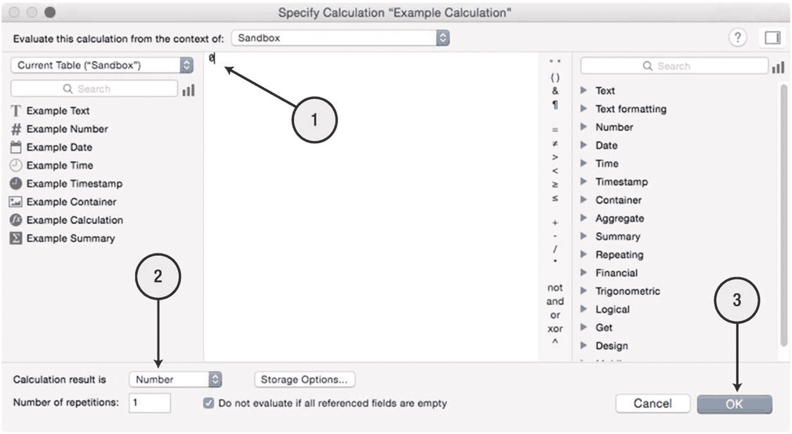

图 6-5

在 Sandbox 中创建占位计算的过程

1. 在文本区域中键入零作为占位公式。
2. 为结果类型选择`数字`。
3. 点击“确定”按钮关闭并保存。

**注意：** 计算字段将在第 12 章开始进一步讨论。

#### 创建汇总字段

再次重复此过程，创建一个名为 `Example Summary` 的`汇总`字段。当出现“汇总字段选项”对话框时，按照图 6-6 中的步骤选择默认的汇总方式：

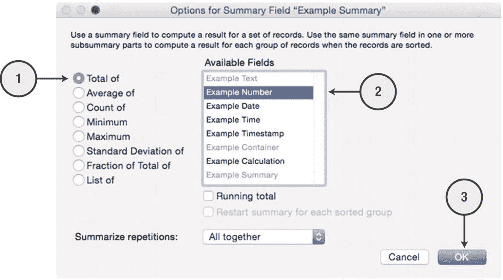

图 6-6

在 Sandbox 中创建汇总字段的过程

1. 点击`合计`单选按钮。
2. 从`可用字段`列表中选择 `Example Number` 字段。
3. 点击“确定”按钮关闭并保存。

**注意：** 汇总字段选项将在第 8 章进一步讨论。

### 审查沙箱字段

在完成数据录入、计算和汇总字段的创建后，`Sandbox` 表应包含五个默认字段和如图 6-7 所示的八个示例字段。点击 `OK` 按钮关闭 `Manage Database` 对话框，并保存对 `Sandbox` 表所做的所有更改。

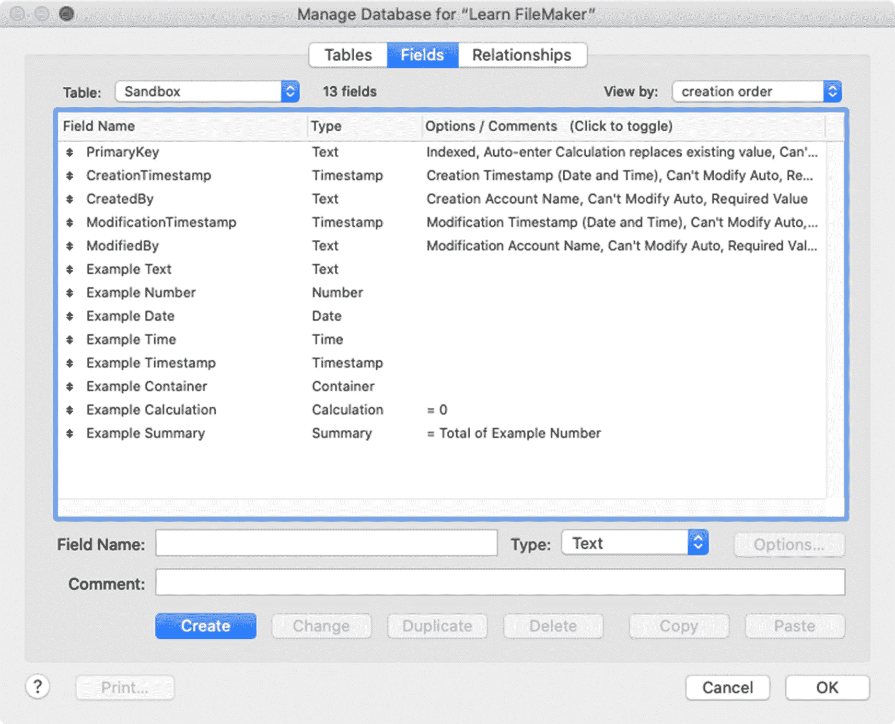

**图 6-7** – 练习表中字段的完整列表

### 设置占位布局

继续快速设置沙箱资源，我们来创建两个布局：一个用于数据录入的`表单视图`布局，以及一个用于滚动浏览记录的`列表视图`布局。

> **注意**
> 第 3 章详细定义了内容视图。

#### 将默认布局重命名为表单视图

新建的数据库文件会自动包含一个与文件名同名的默认`表单`布局。最初会有一个名为 `Learn FileMaker` 的布局。但是，当默认表名更改为 `Sandbox` 时，布局也应随之更改。因此，如果按照本节中的说明操作，应该会有一个名为 `Sandbox` 的空白布局。由于我们将为同一个表创建两个布局，我们需要通过将其重命名为 `Sandbox Form` 来区分这个布局和另一个布局，请按以下步骤操作：

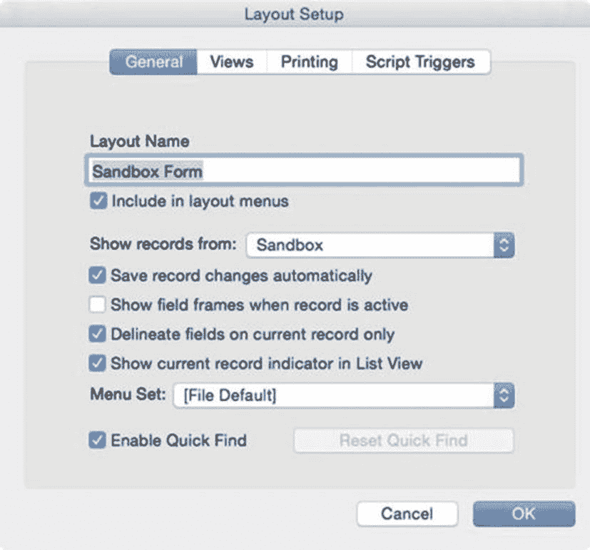

**图 6-8** – 已输入新布局名称的“布局设置”对话框

1.  选择 `View ➤ Layout` 菜单项以进入布局模式。
2.  选择 `Layout ➤ Layout Setup` 菜单以打开 `Layout Setup` 对话框。
3.  在 `General` 选项卡的 `Layout Name` 字段中，将名称更改为 `Sandbox Form`，如图 6-8 所示。
4.  点击 `OK` 按钮关闭窗口并保存更改。

> **注意**
> 第 18 章将进一步讨论布局设置。

## 向布局添加字段

如果 `Layout` 首选项设置为自动将新字段添加到当前布局（第 2 章），那么这八个示例字段将已经存在于默认布局上。如果没有，则有两种方式可以向布局添加字段。现在，请按照以下步骤在布局模式中使用 `Objects` 窗格的 `Field` 选项卡：

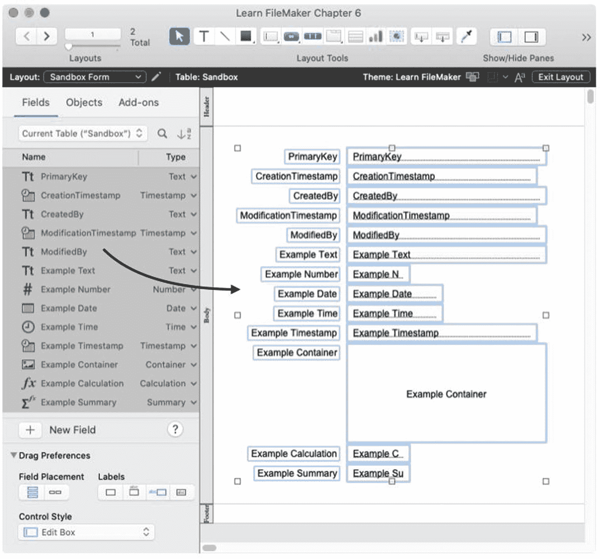

**图 6-9** – 将选定的字段从字段选项卡拖到布局上

1.  通过在 `View ➤ Objects ➤ Fields tab` 菜单下选择该项，确认 `Field` 选项卡可见。
2.  点击字段列表，然后选择 `Edit ➤ Select All` 菜单项，选中全部字段列表。
3.  单击并按住鼠标左键，将字段列表拖到布局上，如图 6-9 所示。这些字段应出现在布局上，并根据其数据类型整齐对齐并调整大小。

> **注意**
> 在第 20 章中了解向布局添加字段的其他方法。

#### 创建列表布局

接下来，通过选择 `Layout ➤ New Layout/Report` 菜单添加一个列表视图布局，并按照对话框中的步骤操作，如图 6-10 所示：

1.  在 `Layout Name` 字段中输入 `Sandbox List`。
2.  在第一行图标中点击 `Computer` 布局类别。
3.  在第二行图标中点击 `List` 布局类型。
4.  点击 `Finish` 按钮关闭对话框并完成此过程。

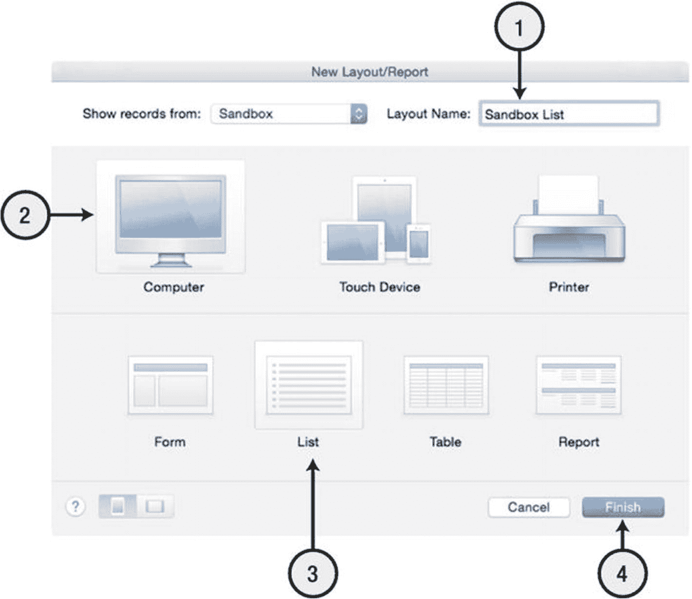

**图 6-10** – 用于创建新布局或报表的对话框

> **注意**
> 第 18 章将探讨其他布局创建选项。

完成后，将出现一个包含三个部分：`页眉`、`主体`和`页脚`的空`列表视图`布局。由于`列表视图`是垂直方向的，因此添加字段的过程会稍有不同，请按照图 6-11 所示的步骤操作：

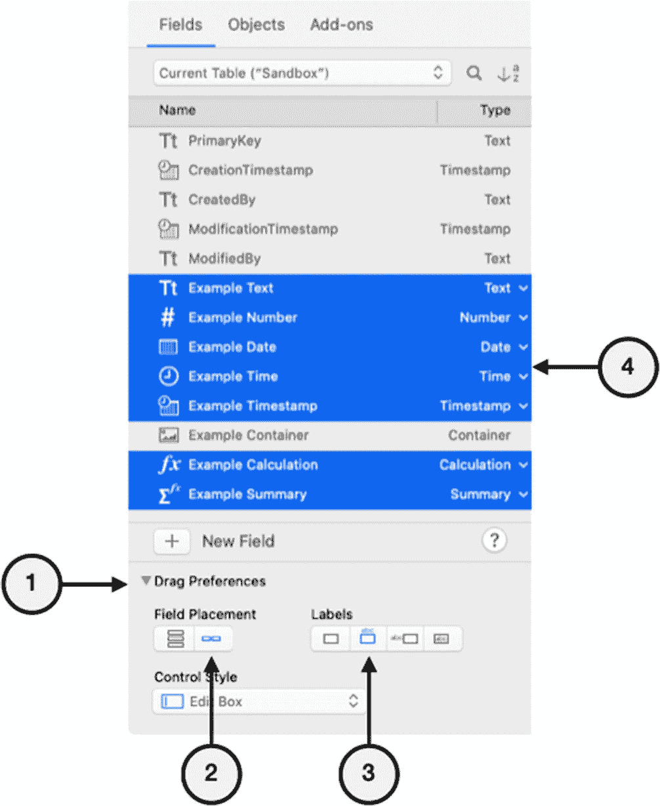

**图 6-11** – 配置字段选项卡以拖拽到列表视图

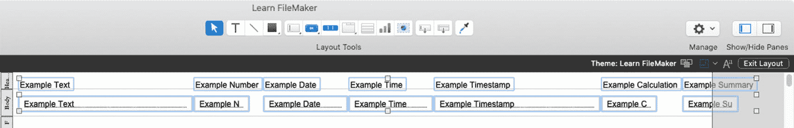

**图 6-12** – 放入布局主体部分的字段

1.  在 `Object` 窗格的 `Field tab` 中，确认 `Drag Preferences` 展开三角形已打开并显示附加控件。
2.  在 `Field Placement` 下选择 `Horizontal` 图标。
3.  选择 `Labels` 选项，将标签放在字段上方。
4.  按住 Command (macOS) 或 Windows (Windows) 键的同时点击每个字段，选择除容器字段之外的*所有*示例字段。我们将在列表视图中跳过容器字段，因为它的默认占用空间很大，并且会尝试扩展布局。
5.  接下来，将选定的字段拖到布局上。确保将字段放置得足够高，使其完全落在定义的布局部分（水平白色区域）内。
6.  放置后，将它们向下拖动，使字段大致位于 `Body` 部分的居中位置，如图 6-12 所示。

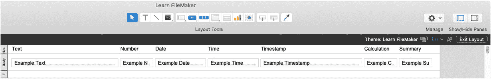

**图 6-13** – 清理标签和字段后的列表视图

1.  使用鼠标或箭头键将标签精确放置在 `Header` 区域内。
2.  双击每个字段标签，删除多余的 `Example` 部分，以去除重复的前缀。
3.  最后，调整最后两个字段的大小和位置，使任何内容都不延伸到可见布局右侧的灰色区域之外，如图 6-13 所示。

> **注意**
> 第 21 章将进一步讨论操作布局对象。

## 配置文件选项

`File Options` 对话框允许控制数据库文件的多种行为。与*应用程序偏好设置*不同，这些选项存储在数据库文件中，并且仅在数据库打开时才能访问。选择 `File ➤ File Options` 菜单以打开对话框，该对话框分为五个选项卡：`Open`、`Icon`、`Spelling`、`Text` 和 `Script Triggers`。

### 文件选项：打开

“打开”标签页（如图 6-14 所示）的设置用于控制数据库首次打开时的行为。

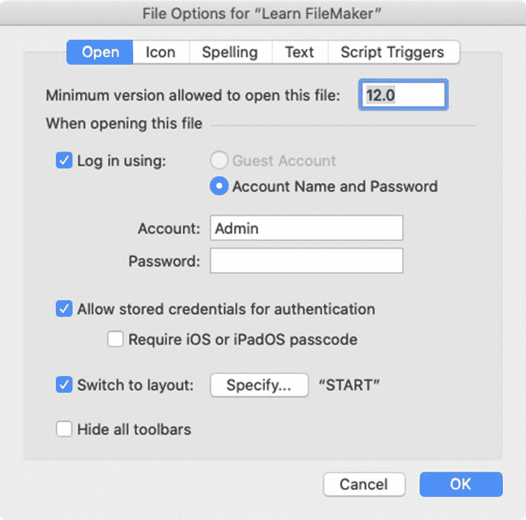

图 6-14：控制打开行为的文件选项

`允许打开此文件的最低版本`文本字段可让你限制文件仅允许在指定的 FileMaker 版本或更高版本中打开。虽然从 12.0 到 19.1 的所有版本都共享相同的文件格式，但使用了较新版本功能的数据库不应在旧版本中打开，除非专门设计了基于版本的备用功能。如果数据库使用了较新版本的功能，最好将此设置保留为最新版本。在该字段中输入`主版本号`和`次版本号`（例如，输入`19.0`而非`19`）。

以下四个复选框用于控制登录和默认界面功能：

- `使用以下账号登录` – 指定文件打开时的自动登录凭据。当数据库需要严格安全性时，**不要**使用此选项（第 30 章）。
- `允许存储凭据进行身份验证` – 控制用户是否可以选择在本地设备上保存凭据，以便将来自动登录。在共享计算机环境或需要严格安全性的数据库中，**不要**使用此选项。
- `切换到布局` – 指定打开时的默认布局。此布局更改会在任何`脚本触发器`（第 27 章）之前执行。
- `隐藏所有工具栏` – 勾选后启动时将隐藏工具栏。

### 文件选项：图标

“图标”标签页（如图 6-15 所示）允许自定义`启动中心`中代表数据库的图标，使其更易于直观地找到所需文件。默认图标是 FileMaker 19 的文档图标。你可以从 Claris 提供的内置图标列表中选择替代图标，或通过单击“自定义”指定自定义的 PNG 或 JPEG 文件。

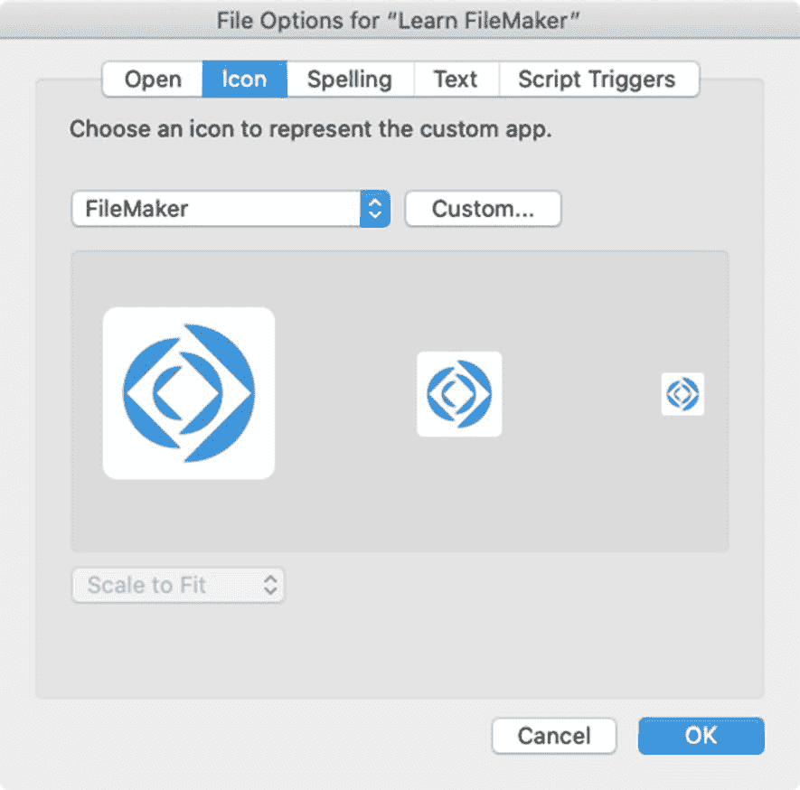

图 6-15：分配自定义图标的文件选项

### 文件选项：拼写

“拼写”标签页（如图 6-16 所示）控制自动拼写检查设置。`用特殊下划线标记可疑单词`复选框会在任何可能拼写错误的单词下方显示红色虚线，前提是当前获得焦点的字段或对象未在`检查器`中明确禁用此功能（第 19 章，“检查数据设置”）。当勾选`可疑拼写时发出蜂鸣声`后，只要用户键入词典认为拼写错误的单词，就会发出提示音。

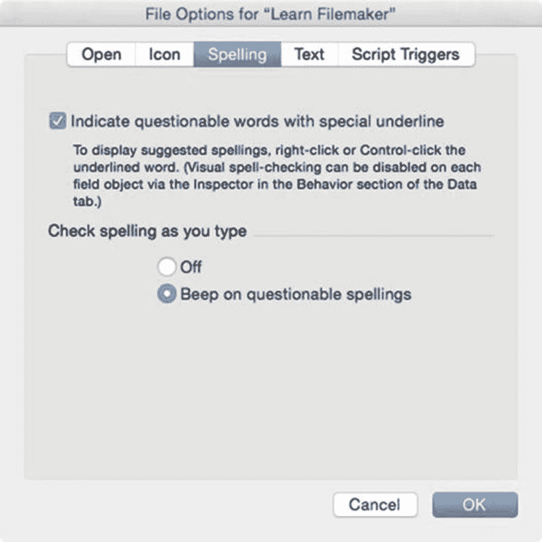

图 6-16：拼写检查的文件选项

### 文件选项：文本

“文本”标签页（如图 6-17 所示）控制一些文本输入选项。

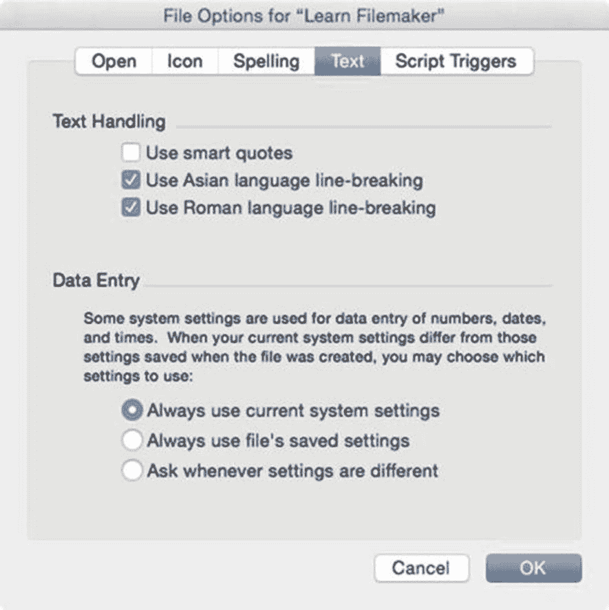

图 6-17：文本输入的文件选项

`文本处理`复选框控制某些特殊的数据输入事项。启用`使用智能引号`可始终在字段中以英文弯引号形式输入撇号和双引号。`使用亚洲语言换行`选项控制当单词到达文本字段边缘时，在处理亚洲语言时的换行方式；而`使用罗马语言换行`在处理罗马语言时执行相同功能。

`数据输入`部分处理货币符号、日期和时间等各种标准数据的格式。当 FileMaker 创建新数据库时，文件会使用本地计算机操作系统的区域设置进行编码。在 macOS 上，可以在`系统偏好设置 ➤ 语言与地区 ➤ 高级`面板中找到这些设置。文件创建后，这些设置便无法修改。但是，“文件选项”对话框允许选择当用户的操作系统与数据库编码的设置之间存在差异时如何处理：

- `始终使用当前系统设置` – 选择此选项将使用计算机的当前系统设置，而非数据库文件中保存的设置。
- `始终使用文件保存的设置` – 选择此选项将使用数据库文件中保存的设置。
- `设置不同时询问` – 选择此选项将在启动时询问用户使用哪种设置。

### 文件选项：脚本触发器

“脚本触发器”标签页用于配置数据库，以自动触发脚本来响应与文件相关的界面事件（第 27 章）。

## 设计与维护健康的文件

FileMaker 会自动保存文件中所做的更改，因此无需也无法显式执行保存功能。用户可以修改记录，开发者可以修改结构元素，并且可以放心这些工作都会被写入磁盘。然而，事情**可能**会出错，了解如何避免、识别和修复问题以维护文件的健康非常重要。在开始设计自定义数据库之前，请花点时间回顾一些可能发生的问题，以及如何帮助确保它们不会以悲剧收场。

### 避免设计与培训缺陷

大多数数据库事故都是某种形式的用户困惑造成的，其原因包括培训不足、界面设计不佳或脚本编写粗心。一些具体问题涉及用户覆盖现有记录、忘记提交记录、随意删除记录或错误识别找到的记录集。

### 覆盖现有记录

覆盖现有内容是一个比你想象中更常见的问题，其发生原因多种多样，通常是由于经验不足和错误假设，加之糟糕的界面设计与不充分培训的叠加效应。

缺乏一般计算机经验或特定数据库知识的人，常常没有意识到在输入数据之前需要先创建一个新记录。一些人假设窗口就像用于录入但将数据发送到别处保存的 Web 表单，因此他们可以直接覆盖并再次发送。无论假设是什么，避免此问题的最佳方法是提供明确的培训，确保每个人都理解：在为新的实体输入信息之前，他们需要实际创建一个新记录。

覆盖的另一个原因是用户未能复制记录，便开始编辑原始记录，误以为它是新的副本记录。问题在于，默认的“复制”功能在原始记录和副本记录之间不会产生任何视觉差异。工具栏中的记录计数会增加，如果布局中包含一个保存唯一记录标识符的字段，该字段会显示不同的值。除此之外，副本记录看起来与原始记录完全一样。如果用户的点击或输入操作并未实际生成副本，他们可能会意外地开始在原始记录上输入。培训可以帮助他们知道在哪里查看以视觉确认新记录已创建。然而，更好的避免方法是使用自定义菜单（第 23 章），用你自己的自定义脚本（第 24 章）替换默认功能。该脚本可以创建一个副本记录，然后在关键字段的值后添加单词“复制”（`Copy`），清空在创建副本时应修改的字段，并弹出一个对话框确认副本已准备好进行录入。用户会习惯于看到这些明显的指示，当这些指示缺失时，他们更可能意识到自己未能成功创建副本。

*类似地，一个未被注意的失败* 进入“查找”模式，当用户将其误认为是临时的查找请求时，可能导致无意中编辑记录。在“查找”模式下，菜单和工具栏的变化很容易被忽略，而查找请求看起来与普通记录非常相似。较新版本的 FileMaker 有有用的指示器，比如在“查找”模式下每个字段中出现的小放大镜图标。向布局添加你自己的视觉指示器，可以进一步强调模式切换的成功。在“查找”模式下隐藏或更改格式的布局元素会有所帮助（第 17–22 章）。

相反的情况是，用户未能从“查找”模式切换回“浏览”模式，然后开始在查找请求中输入，误以为它们是新的空记录。FileMaker 有一个“断路器”对话框，在创建多个查找请求后会出现，提醒用户他们正处于“查找”模式。前面提到的自定义视觉指示器也可以帮助避免此问题。

一个优秀的开发者必须能够转换心智焦点，从新用户的角度测试界面设计。为了在潜在混乱点酿成灾难之前预先识别它们，请务必不要做有偏见的假设，即认为用户拥有你对你自己创建的数据库的知识。

### 忘记提交记录

在数据输入任务完成后，必须*提交*已编辑的记录，以便其被保存并供他人访问。当用户导航到另一条记录或关闭文件时，这会自动发生。他们也可以手动提交记录（第 4 章，“关闭记录”）。如果他们在完成数据输入任务后让记录保持打开状态，会给其他等待查看、访问或编辑数据的用户带来烦恼。如果用户尝试在自己电脑的第二个窗口中访问打开的记录，还可能引发冲突。让记录保留未提交的更改甚至可能是*危险的*，并可能导致文件损坏（本章后面会讨论）。鼓励用户在做出更改后始终及时提交记录，并考虑使用条件布局元素来视觉指示记录何时拥有活动焦点。例如，可以在布局上放置一个仅当记录活动时才显示的“提交”按钮，并且记录标题文本对象可以改变颜色（第 21 章）。

### 粗心删除记录

意外删除记录可能是由于新用户缺乏经验，或是经验丰富用户的过度自信。删除确认对话框包含一个通用且极简的消息，假设用户了解上下文。因此，它无法充分指示即将删除的是哪些具体记录，当用户失去上下文意识或注意力不集中时，这可能是一个大问题。在列表视图（`List view`）中，当用户错误地认为选中的记录是他们打算删除的那条时，这种困惑尤为突出。此外，在使用多个窗口时，用户可能认为他们在删除一个窗口中的记录，而实际上却在另一个窗口中进行删除。具有讽刺意味的是，这个问题更常影响有经验的用户。虽然新用户可能会紧张地阅读对话框消息并谨慎操作，但有经验的用户可能会变得马虎，以不当的过度自信点击对话框。记录删除是“撤销”命令无法撤消的操作，因此检索已删除记录的唯一方法是将其从数据库的备份副本中重新导入。因此，考虑几个选项来帮助避免此问题。

自定义菜单可以覆盖删除功能，并呈现一个自定义的、信息丰富的警告对话框，通过包含关键标识字段来清晰说明*将要删除哪条记录*（第 23 章，“覆盖菜单项功能”）。添加第二个确认对话框也有助于避免意外，尤其是在删除大量已找到集合（`found set`）时。这稍微有些不方便，但可以避免错误删除带来的更大不便。或者，自定义对话框可以要求用户输入一个单词或短语，在脚本继续执行删除请求之前提供明确的意图确认。此外，考虑对一次可以删除的记录数量设置严格限制，以避免因错误操作而清空整个表的内容——可以通过自定义脚本拒绝请求，并在信息对话框中显示记录计数。最后，安全设置（第 30 章）可以完全限制未经授权删除记录的用户对删除命令的访问权限。

### 误判已找到的集合

当用户未能正确识别已找到的集合（`found set`）时，他们可能会意外执行一些影响范围超出预期的操作。如果用户认为已找到的集合包含 10 条记录，而实际上它包含 10,000 条，那么执行诸如*删除所有记录*、*替换字段内容*或*查找/替换*等功能可能会造成灾难。确保用户理解什么是已找到的集合，以及在使用这些功能之前如何确认它。使用自定义菜单创建更具信息性的对话框（第 23 章），并通过安全设置（第 30 章）完全禁用不需要这些功能的用户的访问。在创建自动运行的脚本时要格外小心，因为设计不良的脚本可以比人类更快地执行这些功能，并且造成的损害可能不会立竿见影。

### 控制文件大小

添加到数据库中的每一项内容都会增加文件体积。创建新表、字段、布局和脚本会增加文件大小；录入成百上千乃至数百万条记录也会增加文件大小；包含大量文本的索引字段以及插入了大文件的容器字段同样会增大文件体积。这是一个自然过程，通常不会立即造成问题，尤其是因为 FileMaker 将数据库大小限制为可用磁盘空间容量，技术上限为 8 TB。不过，遵循“少即是多”的原则，设计一个在结构和内容上都尽可能高效的数据库，仍然是一个好主意。结构设计庞大而复杂的文件可能会运行缓慢、让开发者感到困惑，并且容易引发其他问题。有两个主要问题会使文件体积超出必要：*低效的设计*和*碎片化*。

#### 进行高效设计

保持文件小巧并确保运行高效的一种方法就是进行高效设计。尽管设计方法众多，且这些主题将在后续章节中讨论，但越早考虑高效设计越好。

当*容器字段*在内部存储图像或文件时，数据库大小会增加所存储内容的大小。显然，当存储成百上千张大图时，这会对文件体积产生巨大影响。如果数据库托管在服务器上或用于本地环境，但无需成为独立文件，则推荐使用*外部容器存储*（第 10 章）。该方法将文件存储在数据库文件之外，同时像内部存储一样渲染它们，用户甚至不会察觉到差异，从而大大减小文件体积。

另一个会迅速增大文件体积的因素是字段索引，尤其是在冗长的备注字段上。索引对于某些功能很重要，不应完全避免。但是，应尽可能减少字段索引（第 8 章，“字段选项：存储”）。

保持数据库精简的另一种方法是使用更精细的结构和界面设计，以避免表、布局和脚本中的冗余。设计*开放、动态的资源*，使其能够更广泛地使用，并具备可变的功能特性。可以将一个常用公式或一组相似的公式移至单个自定义函数中（第 15 章），以避免重复编写相同代码。一个用于存储与*联系人*记录相关笔记的表和一个用于存储与*项目*记录相关笔记的表可以合并。布局可以设计成提供全局功能，通过附加到主窗口的卡片窗口从任何位置访问（第 25 章，“管理窗口”）。脚本可以设计成接受参数、灵活处理不同信息，并在单一操作功能上执行多种变体。

图形丰富的界面设计可以改善用户体验，但也会增加文件体积以及加载和绘制布局所需的时间。因此，要在视觉惊艳的展示与实用高效的设计之间找到平衡。尽可能使用 FileMaker 内置的布局对象，而非自定义图形。当使用自定义图标时，将其作为 SVG 文件导入到文件的图标库中（第 20 章，“使用图标标签”）。任何直接放置在布局上的自定义图形都应针对屏幕使用进行优化，使用较低分辨率，尤其当它们不在打印布局上时。

值得一提的是，应避免采用整体式的中心辐射型关系结构，而应优先考虑表出现组设计（第 9 章，“使用表出现”）。虽然复杂的关系设置主要会导致性能问题，但也可能使开发者陷入困境，从而难以在公式、布局和脚本中进行更好的设计。请记住，某些领域的低效设计看似无害，却可能在其他地方产生负面连锁反应。始终追求最佳的结构和界面设计。

最后，尽管会创建更复杂的整体结构，但将表分散到多个文件中有助于减小每个文件的体积。有多种方法可以通过混合搭配不同方式来实现，这在第 1 章中简要描述。例如，可以使用*数据分离模型*，其中一个或多个文件提供一个占用空间小的前端界面，与存储在一个或多个独立专用数据文件中的表内容进行交互，这些数据文件充当传统的后端数据源。这使得记录内容可以分布在一个或多个较小的文件中，同时仍能保持单一、统一的界面。

#### 避免碎片化

随着在常规数据录入过程中创建和删除记录，文件内部会积累空余空间。当开发者添加和移除资源时，也会发生这种情况。久而久之，这会人为地增大文件体积，并可能影响性能和稳定性。将文件保存为压缩副本（本章后面会介绍）可以安全地重建文件，将尽可能多的数据填入每个块中，通过移除空“幽灵”块来回收未使用的空间，从而消除膨胀。

### 避免文件损坏

任何数字文件都可能损坏。由于数据库通常通过网络被多个用户同时访问，并且持续进行磁盘读写操作，因此它们更加脆弱，数据丢失的风险也更高。开发者应该了解可能导致损坏的原因、如何避免损坏、检测损坏的方法以及正确的修复方式。损坏的范围可能从最初被忽视的小问题，到灾难性的无法打开文件。

在排除其他原因之前，有许多症状可能看起来像是文件损坏。如果某个字段显示问号而不是数据，但并非计算返回了错误的数据类型，也不是布局上字段宽度太小无法容纳内容所致，则可能是损坏的迹象。记录丢失或显示为空白可能表明存在损坏。但是，在确认这不是错误的已找到记录集、布局格式问题或意外删除记录的结果之前，不要惊慌。此外，如果通过调整设置或重新创建索引无法解决，不正确的搜索结果可能表明索引损坏。脚本设计不当、用户经验不足、关系断裂以及网络问题都可能造成被误认为是损坏的情况。

其他症状则明确表明存在损坏。打开数据库时执行一致性检查，表明文件未正确关闭，可能存在损坏。如果这种情况在没有崩溃事件或强制退出的情况下随机发生，则可能表明存在持续性的损坏。在数据库中工作时，FileMaker 应用程序随机崩溃可能是操作系统或网络问题，但也可能表明数据库存在损坏。最后，有时对话框会直接提示文件已损坏、无法打开或应进行恢复。

避免文件损坏的最佳方法是通过网络正确共享、确保文件正确关闭，并维护好硬件和软件。

