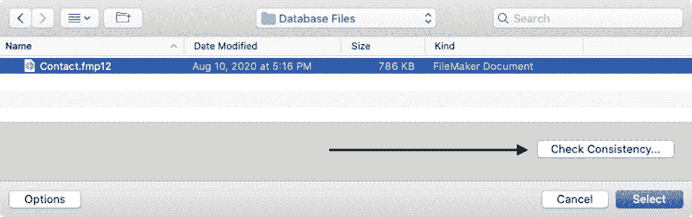
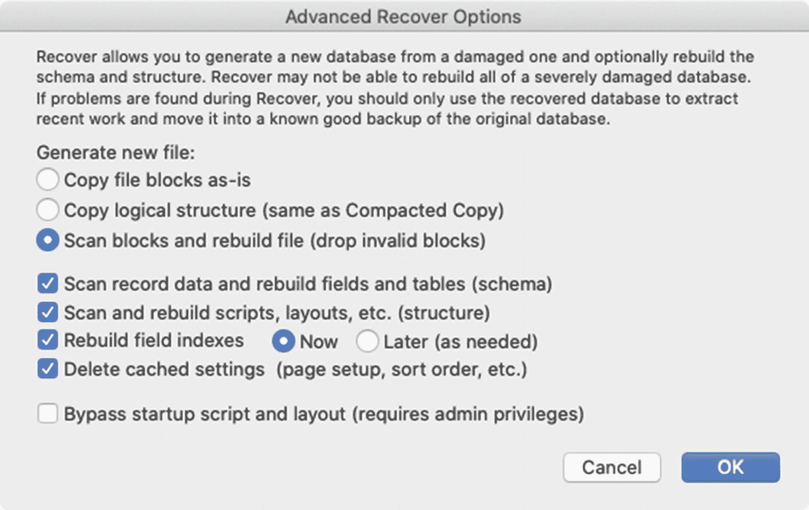

# 探索维护功能

有几个功能有助于维护数据库完整性并排查文件损坏问题。每个功能都必须在*本地*执行，因此网络上托管的文件必须离线，并直接在 *FileMaker Pro* 桌面应用程序的副本中操作。这些功能包括*另存为副本*、*一致性检查*和*恢复*。

**提示**  
请始终定期备份数据库，并为主结构更改保留一份额外的开发副本。如果发生损坏，最安全的做法是恢复到最近的备份，或从损坏文件中恢复数据并将其导入到可靠的备份中。

## 另存为副本

*文件*菜单下的*另存为副本*功能会将打开的数据库创建为一个新副本，可在保存文件对话框中选择以下四种类型之一：`副本`、`压缩副本`、`克隆副本` 或 `自包含副本`。

`当前文件的副本`选项将数据库保存为其自身的相同副本，不做任何更改。这与大多数应用程序中的`另存为`功能相同，也可以通过使用操作系统文件复制命令复制一个已关闭的文件来实现。它没有任何诊断功能；只是制作了一个副本。

`压缩副本（较小）`选项会保存数据库的优化副本，移除空白空间，从而得到更小的文件大小。定期使用此选项可以维护文件的健康状态，尤其是当文件中删除了大量内容或发生了许多结构更改时。

`克隆副本（无记录）`选项仅保存数据库的*结构*副本。这将包括表、字段、关系、页面设置选项、字段定义、自定义函数、布局、脚本等，但*不包含任何记录*。当排查问题时，这可以快速将文件的结构与其内容分离开来。

`自包含副本（单文件）`选项会保存一个副本，其中外部容器数据（第 10 章）嵌入在文件的容器字段中，使其完全自包含。

## 执行一致性检查

*一致性检查*会读取构成文件的每一个块，验证每个块的内部结构，并确认它与其他块正确链接。此过程不读取块内的数据、不检查文件模式，也不检查更高级别的结构；这些功能仅由完整的*恢复*过程执行。每次数据库打开时，FileMaker 都会检查文件，如果检测到文件被错误关闭，则会自动执行一致性检查。当怀疑文件损坏时，可以手动对任何已关闭的文件执行一致性检查，以作为排查步骤。启动 *FileMaker Pro* 应用程序，然后选择 *文件 ➤ 恢复* 菜单。在如图 6-18 所示的文件选择对话框中，选择怀疑已损坏的文件。不要单击会启动完整*恢复*过程的`选择`按钮，而是单击`检查一致性`按钮。

图 6-18  
使用检查一致性按钮，而不是执行完整恢复

FileMaker 将立即检查文件，并在对话框和 `Recover.log` 文件中报告结果。如果未报告任何问题，则该文件可能可以安全地继续使用。如果报告了损坏，它可能会建议执行恢复过程。一致性检查完成后，文件选择对话框将保持打开状态，以便您可以选择恢复文件、对另一个文件执行一致性检查或取消。

#### 恢复文件

当数据库损坏或行为异常时，可以使用 `Recover` 功能重建文件的新副本并重新访问其内容。此过程具有攻击性，会采取一切必要措施来恢复对文件的访问。它会逐块重建文件，并尝试纠正任何损坏。但是，如果某个对象无法修复，它可能会被删除。由于其攻击性，该功能应作为诊断或恢复工具使用，而非用于日常维护。要执行恢复过程，请启动 FileMaker Pro 应用程序，然后选择 `File ➤ Recover` 菜单。在文件选择对话框中，找到损坏的文件，然后单击 `Select` 按钮。在 `Save` 对话框中，为恢复后的新文件副本输入名称并选择保存位置，并可选择指定高级选项（将在下一节中描述）。然后单击 `Save` 开始恢复过程。

FileMaker 会将文件重建到指定的保存位置并报告结果。根据提供的信息，您可以确定恢复的文件副本是否可以安全使用，或者是否应将内容转移到之前保存的备份副本中。如果没有可用的稳定备份，可以仔细检查恢复日志，查看哪些类型的结构对象被报告为已损坏，然后系统地删除资源，并反复重复恢复过程，直到隔离出损坏的资源。然后，可以在原始文件中删除并重新创建每个损坏的项目，并重复该过程，直到恢复过程报告文件没有问题。然而，保留安全备份是最佳实践。

### 高级恢复选项

`Advanced Recover Options` 对话框（如图 6-19 所示）控制恢复的执行方式。

图 6-19

恢复文件的高级选项

`Generate new file` 部分控制恢复过程中创建新文件的三种方式。选择 `Copy file blocks as-is` 将按源文件中的原样复制所有文件块。生成的文件可能仍包含损坏的块。这相当于只保存当前文件的一个副本。`Copy logical structure (same as Compacted Copy)` 将复制源文件中的所有数据而不检查块，但会重建树结构。生成的文件可能仍包含损坏的块。这相当于保存当前文件的压缩副本。最后，选择 `Scan blocks and rebuild file (drop invalid blocks)` 可完全重建文件，仅包括未损坏且不重复的块。生成的文件可能在结构上不稳定，可能仅适用于将数据提取到可靠的备份副本中。这是完整的恢复过程。以下复选框控制恢复期间的可选功能：

*   `Scan Record Data and Rebuild Fields and Tables (schema)` – 重建文件的数据库模式（表、字段和关系），删除位于文件内无效位置的字段或记录，并重新创建缺失的字段和表定义。
*   `Scan and Rebuild Scripts, Layouts, etc. (structure)` – 重建文件的结构（布局、脚本、主题）。
*   `Rebuild Field Index` – 清除索引，并可以选择重建索引的时间。立即重建需要更长时间，但在任何人使用文件之前完成。稍后重建会强制在用户搜索或执行其他功能时根据需要重建索引。有关字段索引的更多信息，请参见第 8 章。
*   `Delete Cached Settings` – 移除打印、导入/导出、排序、查找等操作时上次选择的设置。
*   `Bypass Startup Script and Layout` – 禁用脚本触发器（第 27 章）和文件的默认布局，改为打开一个新创建的空白恢复布局。

## 排查损坏文件的问题

当文件明确报告损坏且无法打开时，您别无选择，只能恢复，并且通常需要将数据提取到可靠的结构备份中。但是，当文件可以打开但出现严重的间歇性崩溃时，需要执行几个步骤来安全地定位损坏，确定最佳行动方案，并将记录转移到良好的结构中。

### 定位损坏

第一步排查涉及通过确定损坏是在数据库结构还是记录数据中来定位损坏。根据发现的情况，您的恢复选项和未来使用的文件选择可能会有所不同。

#### 检查数据库结构

要确定数据库结构是否损坏，请遵循以下步骤：

1.  创建原始文件的排查副本，将其命名为唯一的名称，例如 “Broken Database”。
2.  通过制作一个不包含任何记录数据的副本来隔离结构。打开 `Broken Database` 文件，执行 `Save a Copy as` 命令，选择 `Clone (no records)` 选项，并将其命名为 “Broken Database Structure”。然后关闭 `Broken Database` 文件。
3.  接下来，压缩 `Broken Database Structure` 以预先修复可能妨碍排查的任何小问题。打开 `Broken Database Structure` 文件，执行 `Save a Copy as` 命令，选择 `compacted copy (smaller)` 选项，并将其命名为 “Broken Database Structure Compacted”。然后关闭该文件。
4.  要诊断结构，请使用默认恢复设置（取消选中高级选项）`Recover` `Broken Database Structure Compacted` 文件，并将其保存为 “Broken Database Structure Recovered”。

如果发现损坏，您可以跳过检查记录数据的步骤，而是恢复原始文件，并将记录数据从该文件转移到可靠的结构备份中，理想情况下是来自引入损坏之前某个时间的保存克隆。如果损坏已存在一段时间，并且您无法访问此类文件，则可以使用之前生成的已恢复文件作为结构。但是，请记住，恢复过程可能会导致无法恢复的对象被重命名或删除，因此可能需要做一些工作来补救这些情况。例如，字段可能被重命名为 “Recovered Field”，或者关系图中可能出现 “Recovered Blob” 或 “Recovered Library” 表出现。这些可能表示也可能不表示损坏或数据丢失。

警告

如果 FileMaker 恢复报告明确声明某个文件不安全，则不建议使用它。

#### 检查记录数据

一旦排除了文件结构是损坏源，请遵循以下步骤来确定记录数据是否损坏：

1.  打开 `Broken Database` 排查副本，执行 `Save a Copy as` 命令，选择 `compacted copy (smaller)` 选项，并将其命名为 “Broken Database Records”。然后关闭该文件。
2.  通过取消选中 `advanced options` 并命名为 “`Broken Database Records Recovered`”，使用默认恢复设置 `Recover` `Broken Database Records` 文件。

#### 确定最佳行动方案

如果在文件结构和记录数据中均未报告损坏，您可以尝试在记录数据检查结束时使用已恢复的文件。如果随机崩溃继续发生，请考虑将记录数据转移到安全结构中。如果结构或记录数据报告了损坏，请立即将记录数据转移到安全结构中。

#### 将记录传输到良好的结构中

要将恢复文件中的记录数据转移到可靠的结构中，请遵循以下步骤：

1.  复制一份记录数据检查完成后得到的恢复文件（例如前面描述的*已恢复的损坏数据库记录*）或原始的故障排查副本。
2.  打开该文件。
3.  执行*查找全部*以确认找到所有记录的查找集。
4.  使用*Excel 工作簿 (.xlsx)* 类型选项导出所有记录。请务必在*Excel 选项*对话框中勾选*在第一行中使用字段名作为列名*选项。在*导出选项*对话框中，注意选择*当前表*中的所有字段，而不仅仅是当前布局上可见的字段。

**警告**

导出为非 FileMaker 格式可以确保数据与任何结构损坏完全分离。但是，容器字段不受支持且无法导出。这些字段必须在新数据库中手动恢复。你也可以尝试导出为 FileMaker 格式，但随后需要仔细检查，确保在传输过程中没有损坏跟随数据。

5.  对数据库中的每个表重复步骤 3 和 4。
6.  确定一个稳定的数据库*结构*副本。理想情况下，使用在损坏事件发生之前创建的克隆。如果找不到这样的克隆，只要数据库结构不再报告损坏，可以使用恢复的副本（例如之前流程中的*已恢复的损坏数据库结构*）。
7.  将电子表格中的记录导入到安全结构的每个表中。

## 总结

本章探讨了创建、配置和维护数据库文件健康的基础知识。在下一章中，学习如何创建表并开始开发一个对象模型，该模型将定义在输入记录时可以填充的字段。

