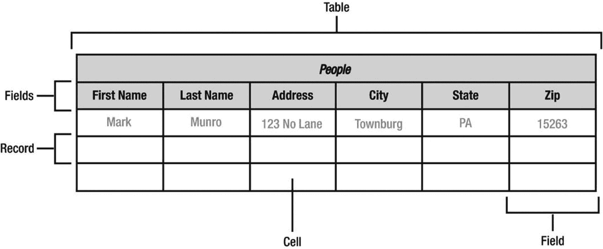
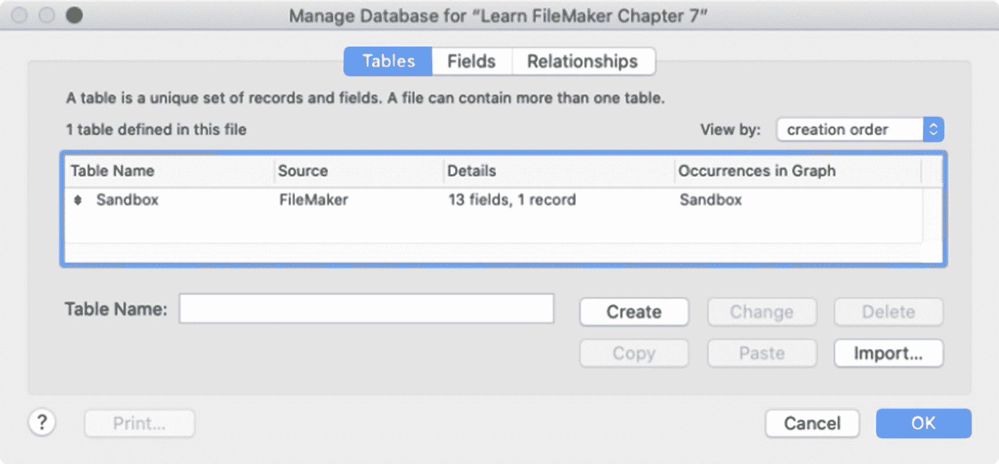

# 7. 使用表

*表*是数据库结构模式的基本单元，它构成了所建模的某种实体类型的数字代表。表创建了一个数字空间，并定义了一组用于存储数据的字段。本章探讨以下主题：

- 介绍对象建模
- 介绍`管理数据库`窗口（`表`）
- 规划表名
- 管理表
- 向示例数据库添加表

## 介绍对象建模

*对象模型*或*数据模型*是一种抽象，它定义了数据库条目的数据元素，描述了它们之间以及它们与其代表的现实世界实体属性之间的关系。模型就像一个建筑蓝图，告知 FileMaker 数据库将存储和管理的信息的结构。之所以使用这个术语，是因为这些信息有时被称为该结构所代表的真实对象的*虚拟模型*。*数据建模*是规划并创建一个模型的过程，该模型包含构成一组相关实体类（将由数据库管理）的数据模型的各种属性、关系和操作。对象模型的要素是*表*、*字段*和*关系*。

*表*为数据库内建模的特定类型的实体分配了一个空间。这类似于电子表格中的选项卡，如图 7-1 所示。该术语既用于指表作为存储模型的结构定义，也用于指代该结构内收集的内容。因此，可以提及*表的字段*（已定义的结构）和*表的记录*（已输入的内容）。建模为表的对象可以是广泛的类别（人员或产品）、狭窄的子类别（员工或汽车）、实体的属性（价格或组件）、操作（历史事件或流程步骤）或任何其他可能需要管理的事物。在早期规划阶段，模型可能采用简单的表名列表形式，例如*公司*、*人员*和*项目*。随后，这会扩展为每个表的字段列表，以及关于它们如何相互连接以形成关系层次结构的详细信息。复杂的系统可以包含定义数十甚至数百个表的模型。

图 7-1 — 数据库表的基本结构

电子表格的比喻延续到了*字段*、*记录*和*单元格*。

*字段*，类似于电子表格中的列，是一个已定义的容器，用于存储关于被建模实体的一个信息。在所示的示例中，每个列标题命名了一个定义其下方列的单独字段：*名字*、*姓氏*、*地址*等。

*记录*，类似于电子表格中的一行，代表存储在表中、对应于被建模对象的一个实例的单个条目。虽然示例中的表代表*一般意义上的人*，但一行（或一条记录）代表*一个特定的人*。记录是表已定义字段集的一个实例，创建用于存储关于某个特定人的信息。

*单元格*是字段和记录交叉点的正式名称。在 FileMaker 中，这些通常不那么正式地被称为*字段*，但隐含着理解特定记录的字段定义实例（*单元格*）与字段定义本身（*字段*）之间的区别。

## 介绍`管理数据库`对话框（`表`）

表是从`管理数据库`对话框的*表*选项卡创建和配置的，如图 7-2 所示。打开数据库文件后，可以在浏览模式或布局模式下选择*文件 ➤ 管理 ➤ 数据库*菜单，或在布局模式下从*管理*工具栏菜单中选择*数据库*来打开此对话框。在开发界面的各种开发者菜单中也可以访问它，例如`指定导入顺序`对话框（第 5 章）。

图 7-2 — 用于管理表的对话框

*表*选项卡显示文件中定义的每个表的列表。每个表由列出的五个属性组成。第一列显示*表名*。*数据源*列显示表的源类型，可以是“FileMaker”或 ODBC 数据源的名称。*详细信息*包括定义为表结构的*字段*计数和存储的*记录*数据内容计数。最后，*图形中的出现次数*显示关系图中该表每个实例的逗号分隔列表（第 9 章）。

可以选择列表中的表来*重命名*、*删除*或*复制*和*粘贴*。双击将切换到该表的*字段*选项卡。列表下方的*表名*字段显示所选表的名称，并用于更改名称或输入新表的名称。单击`确定`保存更改并关闭对话框。单击`取消`将关闭对话框，*不保存任何选项卡中所做的更改*。

