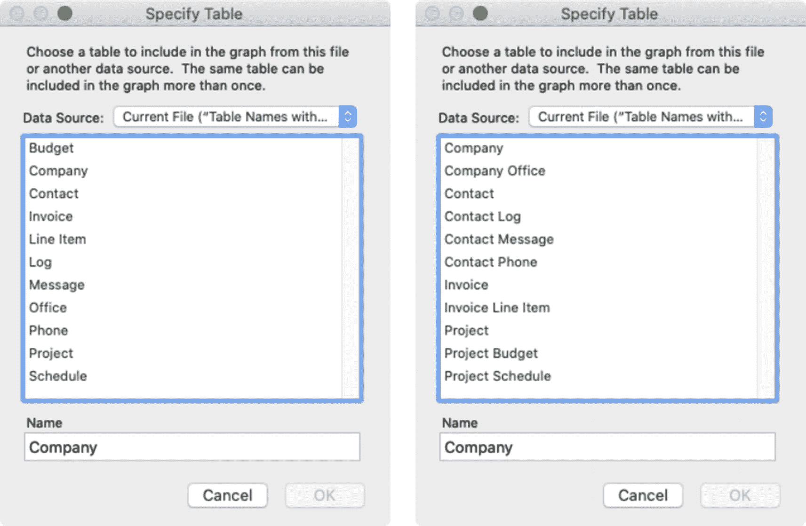
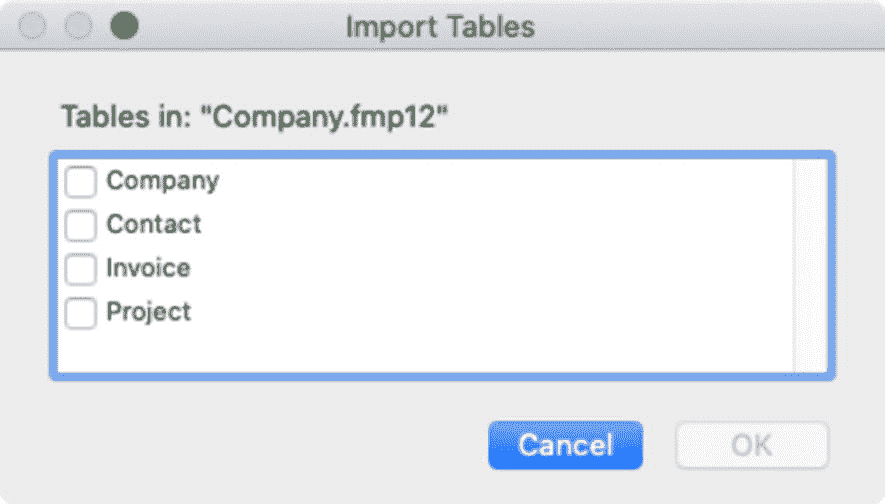
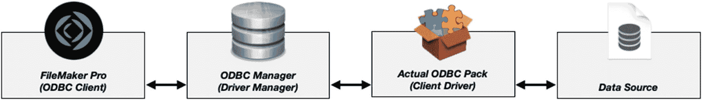
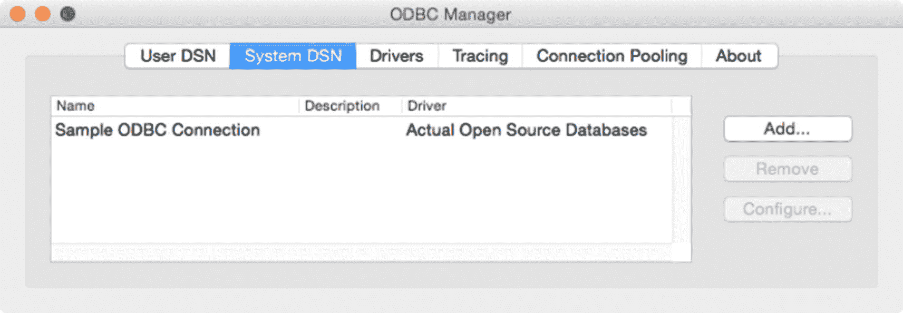
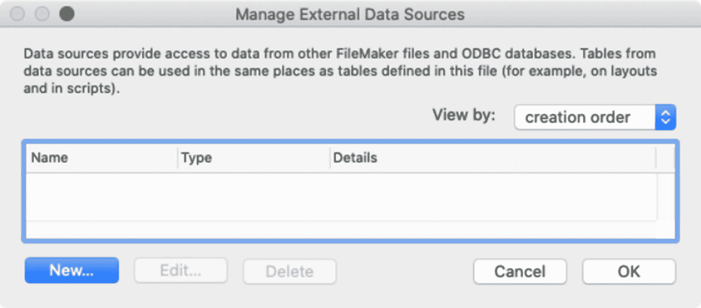
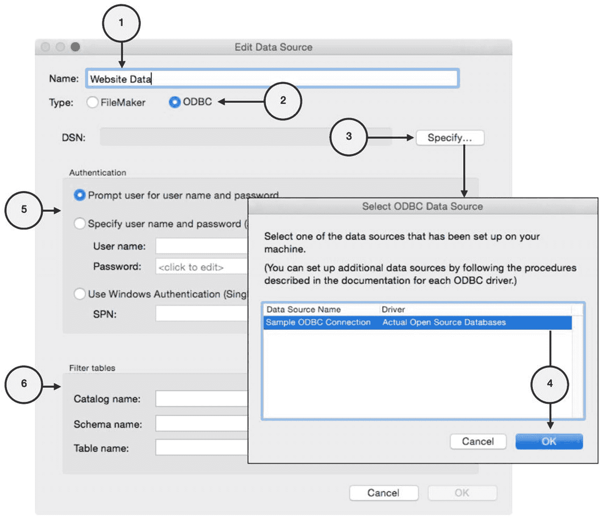
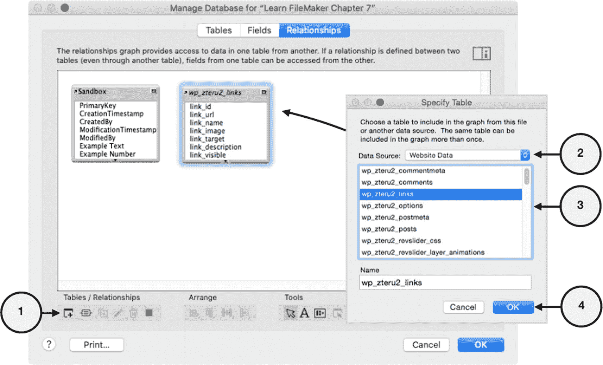
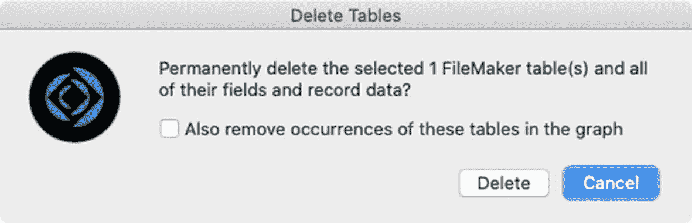
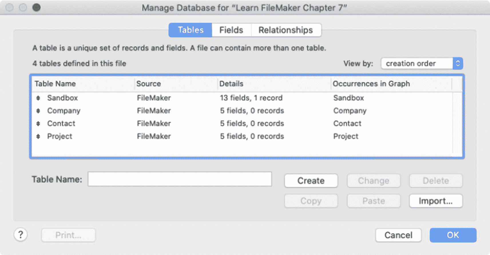

# 规划表名

表名可以使用多种不同的命名约定，具体取决于开发人员的个人偏好，以及数据库用作入站 API、JDBC/ODBC 或 WebDirect 连接源时所需的兼容性技术要求。由多个单词组成的名称可以用空格（`Project Resource`）或下划线（`Project_Resource`）分隔，也可以不使用空格，而采用“驼峰式”命名（`ProjectResources`）。名称可以全大写、全小写或大小写混合使用。每个表名都必须遵循以下规则：

*   每个表必须使用唯一的单词或短语来命名。
*   名称可以包含数字，但不能以数字或句点开头。理想情况下，应*仅*使用字母字符。
*   名称不应包含内置函数的名称，尤其是那些没有参数的函数，例如 `Random` 或 `Pi`。
*   虽然*可以*使用某些保留符号和单词，但它们可能会在计算公式中产生冲突，应避免使用。
*   名称可以包含空格。但是，对于 Web 集成（除了不关心空格的 `FileMaker Web Direct` 之外），你可能希望完全避免使用空格。

除了这些技术考量之外，请花点时间思考什么才是一个*好的*表名。每个表都应该描述清晰、简洁但不晦涩，并且与其他表和谐共存。在拟定表名列表时，这里有一些建议供参考：

图 7-3

原始名称列表（左侧）和添加了分组前缀的相同列表（右侧）

*   名称应清晰指示表所建模的实体类别，在尽可能简洁的同时避免晦涩难懂。
*   尽可能使用完整单词而非缩写。如果某个单词太长，可以查阅同义词词典，寻找更短的替代词。
*   考虑文件中其他表的完整上下文。如果一个数据库只管理一种类型的东西，那么将表命名为 `Stuff` 是没问题的。然而，当需要为多种类型的东西建模时，请使用更具描述性的名称，例如 `Inventory`、`Resources`、`Supplies` 等。
*   使用多个单词以提高清晰度。当存在其他同名实体的表时，请确保它们的名称*差异化足够明显*，以避免混淆。
*   保持一致性，使用相同的格式，并使所有名称保持单数或复数形式。例如，统一使用 `Contact` 和 `Company`，或统一使用 `Contacts` 和 `Companies`。
*   对于大型表列表，考虑使用前缀将其组织到概念组中，以便它们在开发者选择菜单中整齐排序，如图 7-3 所示。

## 管理表

可以使用“管理数据库”对话框中“表”选项卡上的按钮来*添加*、*重命名*和*删除*表。

### 添加表

添加表有*几种*不同的方法：创建新表、复制现有表、从另一个 FileMaker 数据库导入表，或从外部 ODBC 数据源添加表。在导入记录时也可以自动创建表（第 5 章，“选择目标表”）。

#### 创建新表

在“管理数据库”对话框的“表”选项卡中，通过在“表名”文本区域键入名称并单击“创建”按钮，手动创建一个新表。新表将出现在列表中，并带有五个默认字段（第 8 章，“定义默认字段”）。

#### 复制现有表

当新表与现有表高度相似时，可以考虑复制以节省时间。可以使用“复制”和“粘贴”按钮来复制一个或多个表，并将它们的副本粘贴到列表中。此操作甚至在两个文件之间也有效，提供了一种快速简单的方法来在新数据库中复制表。复制的表将在列表中高亮显示，每个表与原表名称相同，并附加一个唯一的数字后缀。原表中的每个字段都将出现在新表中，具有相同的名称和设置。但是，记录内容不会从原表复制；复制后的表将不包含任何记录。

#### 导入表

“管理数据库”对话框“表”选项卡上的“导入”按钮，用于启动从另一个 FileMaker 数据库导入一个或多个表的过程。源数据库可以是文件夹目录中的数据库，也可以是由 FileMaker Server 托管的数据库。首先，单击“导入”按钮。找到并打开包含要导入的表的数据库文件。打开后，FileMaker 将显示一个“导入表”对话框，其中列出了所选数据库中可供导入的所有表，如图 7-4 所示。勾选所需表旁边的复选框，然后单击“确定”进行导入。同样，此处仅导入表结构，因此表将不包含任何记录。

图 7-4

用于从另一个 FileMaker 数据库导入表的对话框

#### 从 ODBC 数据源添加表 (macOS)

`开放数据库连接` (ODBC) 是一种标准应用程序编程接口 (API)，它为客户应用程序提供一种通用语言，用于与其他数据库系统交互。`Java 数据库连接` (JDBC) 是一种类似的 API，用于访问用 Java 语言编写的系统。FileMaker 可以使用 ODBC 和 JDBC 与 `驱动程序管理器` 应用程序通信，该应用程序使用客户端驱动程序与外部数据源通信，如图 7-5 所示。

图 7-5

将 FileMaker 数据库连接到 ODBC 数据源

**注意**  
ODBC 连接仅用于连接非 FileMaker 数据库，不用于 FileMaker 数据库连接。

FileMaker 既可以充当 ODBC 客户端应用程序，也可以充当 ODBC 和 JDBC 数据源。作为客户端应用程序，FileMaker 支持连接到外部 SQL 数据源，例如来自 Oracle、Microsoft SQL 和 MySQL 的数据源。连接后，外部数据库中的表可以添加到 FileMaker 数据库中，除了少数例外情况，它们的行为类似于 FileMaker 原生表。为 ODBC 访问配置计算机和数据库的过程相对简单，分为三个步骤。首先，使用 `驱动程序管理器` 和 `客户端驱动程序` 准备主机计算机以进行 ODBC 连接。接下来，将 FileMaker 数据库连接到 ODBC 客户端驱动程序。最后，在 FileMaker 数据库中插入并使用 ODBC 表。让我们逐步了解此过程的一个示例。

##### 准备计算机以进行 ODBC 连接

要为 ODBC 连接准备 FileMaker 主机计算机，请安装 `ODBC 管理器` 应用程序（macOS 免费软件），安装客户端驱动程序（例如 `Actual Technologies ODBC Pack`），并为特定的外部数据源配置驱动程序。*主机计算机* 是安装 FileMaker 数据库的计算机（即运行 FileMaker Server 的计算机，而非访问它的客户端计算机）。

## 安装 ODBC 管理器应用程序

按照以下步骤，在主计算机上下载并安装免费软件 `ODBC Manager` 应用程序：

1. 从 [`www.odbcmanager.net`](http://www.odbcmanager.net) 下载 `ODBC Manager` 磁盘映像。
2. 在 `Downloads` 文件夹中找到 `ODBC_Manager_Installer.dmg` 文件并启动它。
3. `ODBC Manager` 磁盘映像将出现在您的桌面上，并应在一个窗口中打开。
4. 双击 `ODBC Manager.pkg` 文件以启动安装程序。
5. 逐步完成安装程序面板以完成安装。

安装程序完成后，`ODBC Manager` 应用程序应位于 macOS 的 `Applications` 文件夹下的 `Utilities` 子文件夹中。

## 安装 ODBC 驱动程序

接下来，按照以下步骤下载并安装一个 ODBC 驱动程序，例如下文描述的来自 Actual Technologies 的驱动程序：

1. 下载 `Actual ODBC Pack` 磁盘映像，可从 [`www.actualtech.com/download.php`](http://www.actualtech.com/download.php) 获取。
2. 在 `Downloads` 文件夹中找到 `Actual_ODBC_Pack.dmg` 文件并启动它。
3. `Actual ODBC Pack` 磁盘映像将出现在您的桌面上，并应在一个窗口中打开。
4. 双击 `Actual ODBC Pack.pkg` 文件以启动安装程序。
5. 逐步完成安装程序面板以完成安装。

> **注意：** 该驱动程序是一个功能完整的演示版，仅限显示任何查询结果中的前三行。请从 Actual Technologies 网络商店购买许可证密钥以解除此限制。

## 配置驱动程序

接下来，为将要建立连接的特定数据库添加并配置一个驱动程序。首先打开 `ODBC Manager` 应用程序，如图 7-6 所示。

**图 7-6** — 带有一个连接的 ODBC 管理器

然后在对话框中按以下步骤操作：

1. 点击 `System DSN` 选项卡。
2. 点击 `Add` 按钮。
3. 在打开的窗格中，为目标数据库选择合适的驱动程序：`Actual access`、`Actual open source databases`、`Actual oracle` 或 `Actual SQL server`。
4. 在多面板驱动程序特定配置对话框中输入设置。这些设置各不相同，但通常包括 `server address`（服务器地址）、`database name`（数据库名称）、`username`（用户名）和 `password`（密码）。
5. 点击 `Done` 按钮关闭配置对话框。
6. 配置对话框的最后一个面板允许您测试连接。
7. 退出 `ODBC Manager` 应用程序。

## 将 FileMaker 数据库连接到 ODBC 客户端驱动程序

将您的 FileMaker 数据库连接到刚刚配置的 ODBC 驱动程序。这可以通过在数据库中设置外部数据源，然后将外部源中的表添加到 FileMaker 关系图中来完成。

### 设置外部数据源

选择 `File ➤ Manage ➤ External Data Sources` 菜单项，打开 `Manage External Data Source` 对话框，如图 7-7 所示。在此，您可以创建、编辑和删除对外部数据库的引用。

**图 7-7** — 管理外部数据源的对话框

要添加新的外部源，请点击 `New` 按钮以打开 `Edit Data Source` 对话框。最初，对话框会要求输入 `File Path List`，因为 `Type` 被设置为 `FileMaker`。当您选择 `ODBC` 后，对话框将会变化，如图 7-8 所示。

**图 7-8** — 设置外部数据源的过程

按照以下步骤配置与 ODBC 驱动程序的连接：

1. `Name`（名称） – 为数据源输入一个在 FileMaker 中使用的唯一名称。
2. `Type`（类型） – 选择 `ODBC` 单选按钮。
3. `DSN` – 点击 `Specify`（指定）按钮。
4. `Select ODBC Data Source`（选择 ODBC 数据源） – 从 `ODBC Manager` 应用程序中定义的列表中选择所需的数据源，然后点击以关闭对话框。
5. `Authentication Options`（身份验证选项） – 可选地指定当数据库尝试访问数据源时，应在用户级别如何输入用户名和密码。为了获得最流畅的用户体验，直接在此处输入用户名和密码，这样用户就不必重复该过程。
6. `Filter Tables`（过滤表） – 可选地添加过滤条件，以控制在建立连接时显示哪些表。当数据库有很多表，并且您需要限制在 FileMaker 中可用的表以避免失败时，这会很有帮助。完成后，点击 `OK` 关闭 `Edit Data Source` 对话框。

### 添加到关系图

与创建新 FileMaker 表（该表会被添加到 `Manage Database` 对话框的 `Tables` 选项卡中，并自动出现在 `关系图`（第 9 章）中）不同，新的 ODBC 表需要手动添加到关系图中，这将会自动将其添加到表列表中。为此，请打开 `Manage Database` 对话框并点击 `Relationships` 选项卡。然后按照图 7-9 所示的步骤操作：

1. 点击 `Add` 按钮。
2. 在打开的 `Specify Table`（指定表）对话框中，从 `Data Source`（数据源）菜单中选择 ODBC 连接。
3. 选择该表。
4. 点击 `OK` 按钮将表添加到表出现关系图和表列表中。

**图 7-9** — 将 ODBC 源添加到关系图的过程

### 在 FileMaker 中定义 ODBC“影子表”

当将 `ODBC` 表添加到关系图时，FileMaker 会在“表”选项卡中自动创建一个*影子表*。这是一个反映外部表的内部表示形式。它们会以斜体格式显示在“表”选项卡的列表中。尽管这会将外部表引入数据库，并允许类似于原生 FileMaker 表的交互，但仍存在一些显著差异，包括：

- **架构锁定** – 无法从 FileMaker 内部修改外部数据源的结构。FileMaker 中的影子表允许进行一些修改，但这不会影响远程表。
- **删除字段** – 可以从影子表中删除字段，以减少查询的数据量，但这些字段仍保留在远程表中。
- **修改字段** – 可以针对影子表自定义字段的“自动输入”设置（第 8 章）。
- **添加补充字段** – 可以向影子表添加字段，但这些字段仅限于非存储计算字段和汇总字段，并且不会添加到远程表中。
- **数据类型** – 当远程表对某些信息使用独立的数据类型，而 FileMaker 将其作为单一数据类型处理时（例如，整数和浮点数据，而非仅数字字段），可能需要通过计算将数据转换为 FileMaker 数据类型。
- **数据输入限制** – 当某些字段类型的数据量受限时，FileMaker 会尽量遵守这些限制以避免问题，但仍需特别注意。
- **数据更新** – 通过网络对外部表中记录更改的自动刷新频率低于对原生 FileMaker 表的更改。请使用“刷新窗口”脚本步骤强制刷新，确保显示的数据是最新的。
- **记录锁定** – 与原生表不同，打开进行编辑的记录不会被锁定，因此用户可以同时编辑同一条记录。如果自用户开始编辑后该记录已被修改，将弹出一个警告对话框，提示用户，并允许其停止操作，以避免覆盖其他用户的更改。
- **索引** – FileMaker 无法为 SQL 字段建立索引，因此对外部表的搜索应仅限于远程表已建立索引的字段，以避免长时间延迟。

**提示**
Claris 的技术简报“外部 SQL 源简介”包含了关于 `ODBC`、`JDBC` 以及连接至 FileMaker 数据库或从中连接的各种选项的更多信息。

### 重命名与删除表

在“管理数据库”对话框的“表”选项卡中选中的表可以被重命名或删除。要重命名，请在“表名称”文本区域输入新名称，然后单击“更改”按钮。要删除，请单击“删除”按钮。将出现一个“删除表”警告对话框，要求您确认是否要继续，如图 7-10 所示。该对话框包含一个复选框，如果选中，也将删除关系图中对应的表出现项（第 9 章）。如果未选中，关系图中的任何表出现项将变为 *<缺失表>* 占位符。被删除表的字段定义和记录将始终被删除，而布局将保留，直到手动删除或重新分配。

**图 7-10** 删除表时的警告对话框

### 向示例数据库添加表

在继续之前，请向 *Learn FileMaker* 数据库添加三个表：*Company*、*Contact* 和 *Project*。目前，请创建这些表，并保留自动创建的默认字段、表出现项和布局。完成后，对话框应如图 7-11 所示。

**图 7-11** 包含默认字段的 *Learn FileMaker* 数据库表

## 本章小结

本章探讨了使用表的基础知识，既包括在 FileMaker 中原生使用表，也包括连接到外部 SQL 数据源。在下一章中，我们将学习如何向表中添加字段并配置其各种属性。

