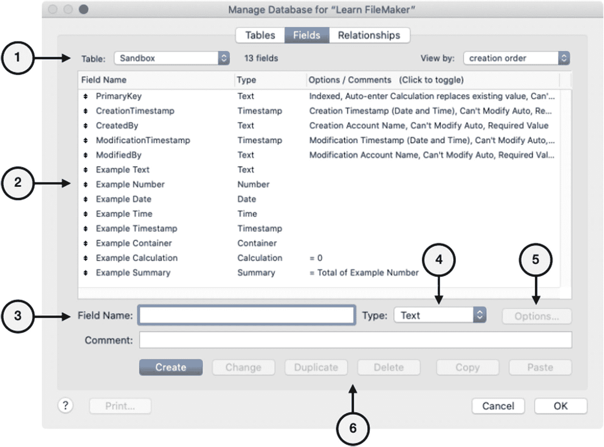

# 8. 定义字段

*字段*是表内一个已定义的数据输入空间。使用电子表格类比，字段就像一列，被命名并配置为包含特定类型的数据。本章重点讨论与字段相关的以下主题：

- 定义字段数据类型
- 介绍“管理数据库”对话框（字段）
- 规划字段名称
- 定义默认字段
- 管理字段
- 设置字段选项
- 向示例数据库添加字段

### 定义字段数据类型

FileMaker 支持八种不同类型的字段，它们分为两类：*输入字段*和*显示字段*。

#### 输入字段

*输入字段*是能够由用户、脚本或导入过程进行数据输入的字段。FileMaker 有六种类型的输入字段，每种对应特定类别的数据：*文本*、*数字*、*日期*、*时间*、*时间戳*和*容器*。

**注意**
根据定义，输入字段可以接受输入。但是，用户在特定实例中的输入能力将取决于该字段的布局存在性（第 4 部分）和用户的安全设置（第 30 章）。

##### 文本字段

*文本字段*用于存储任意字母、符号或数字的组合，作为字符串，长度可达一千万个字符。文本字段的内容可以是纯文本，通过布局设置控制显示格式，或者可以包含嵌入的格式信息，通过字体、字号、样式和颜色实现丰富的样式。当按文本字段对记录排序时，值将按字母顺序排序。这意味着文本中包含的数字将*作为文本*进行排序，并逐字符评估；例如，值“`10`”将排在“`2`”*之前*，因为 `1` 在 `2` 之前。

**提示**
使用文本字段存储包含前导零的数字。

##### 数字字段

*数字字段*用于存储任何数值，范围从 `10^–400` 到 `10⁴⁰⁰`，每个字段最多可存储十亿个字符。数字字段中的值可以包含用于格式化数字的非数字字符。例如，一个数字字段可以包含 `"5000"` 或 `"$5,000.00"`。虽然这些附加字符不会对数据输入、查找或排序产生不利影响，但理想情况下，应只将数字实际输入到字段中，因为可以使用字段显示布局设置（第 19 章，“数据格式化”）动态应用货币格式。当按数字字段对记录排序时，字段中的值将按数字顺序排序，因此值 `"10"` 将正确地排在 `"2"` 之后。

### 日期字段

`日期字段`用于存储正式日期，日期范围从`0001 年 1 月 1 日`到`4000 年 12 月 31 日`。输入日期时，必须使用与创建文件时继承自计算机的数据库日期和时间设置相匹配的`短日期格式`（参见第 6 章“文件选项：文本”）。在美国，默认格式通常是“<月>/<日>/<年>”。例如，`2017 年 1 月 15 日`在日期字段中应输入为“`1/15/2017`”。尽管所有日期都必须以短日期格式输入，但布局上的字段可以配置为以多种格式之一显示该值（参见第 19 章“数据格式化”）。按日期字段对记录排序时，这些值将按时间顺序排列。

#### 两位数年份转换

`FileMaker` 要求所有日期都具有四位数的年份。任何在日期字段中输入的两位数年份，都将根据输入操作发生时的年份，使用一个公式自动转换为四位数年份。这包括所有输入方法：手动输入、导入、自动输入公式或脚本步骤输入。转换过程假定两位数年份的日期更可能指的是比`未来`更远的`过去`时间。因此，将日期年份由两位自动转换为四位时，会根据数据输入时的`当前年份`进行调整，使日期落在`未来 30 年`或`过去 70 年`的范围内。所以，在 2020 年，输入“`1/1/51`”或更早的日期会自动转换为“`1/1/1951`”，而“`1/1/50`”则会转换为“`1/1/2050`”。管理超出百年范围或不符合此分割模式的日期的数据库，必须：

-   以四位数年份输入
-   输入到**文本字段**而不是日期字段中，这样它们可以保持两位数年份
-   使用自动输入公式或脚本触发器，在`FileMaker`强制执行自动转换`之前`，将日期转换为相应的四位数等效值

**注意：** 在 2000 年之前，`FileMaker`允许使用两位数年份。升级旧数据库时，这些日期会自动获得世纪 1900，除非在升级前手动转换！

### 时间字段

`时间字段`用于存储正式的时间字符串。输入时间时，必须使用与创建文件时继承自计算机的数据库日期和时间设置相匹配的时间格式。在美国，默认格式通常是“<小时>:<分钟>:<秒> <上午|下午>”或“`10:30:00 am`”。时间可以指代一天中的某个时刻，也可以指代`时间段`，用于表示分配或经过的时间等。例如，“`0:15:00`”表示 15 分钟。按时间字段对记录排序时，这些值将按时间量顺序排列。

### 时间戳字段

`时间戳字段`用于将正式的日期和时间统一存储在一个字符串中。`FileMaker`允许时间戳值的范围从`0001 年 1 月 1 日 上午 12:00`到`4000 年 12 月 31 日 晚上 11:59:59`。与单独的日期和时间值一样，时间戳必须以与数据库各组件设置相匹配的短格式输入，这些设置继承自创建文件时的计算机。两个组成部分输入时中间有一个空格：“`<日期> <时间>`”。例如，“`1/1/2021 3:00 PM`”或“`8/1/2021 8:00 AM`”。

**提示：** 日期、时间和时间戳在内部存储为表示从某个固定点开始经过的时间的数值：日期存储为从`0001 年 1 月 1 日`开始经过的天数，时间存储为从午夜开始经过的秒数。例如，“`8/1/2002`”存储为`737638`，“`10:00:00 AM`”存储为`36000`。因此，公式可以对日期加减天数，或对时间加减秒数。

### 容器字段

`容器字段`用于存储文档。可以通过多种功能将文件放入容器字段，包括`插入`、`复制/粘贴`或`拖放`。在 iOS 设备上运行的数据库可以使用`从设备插入`脚本步骤将音乐、照片、摄像头、麦克风或签名数据插入到容器中。根据数据库和字段的配置，容器中显示的文件可以存在于数据库结构中，也可以链接到外部文件夹位置（参见第 10 章）。某些文件类型具有`交互内容`布局设置，允许类似于其原生应用程序的交互性（参见第 19 章）。例如，PDF 文件可以存储在一个字段中，通过布局配置允许用户查看和浏览文档的各页，就像在 Adobe Acrobat 中查看它一样。其他具有交互选项的文件类型包括`照片`、`影片`和`音频文件`。

### 显示字段

`显示字段`是一个不可编辑的字段，它会自动显示由其设置决定的值。`FileMaker`有两种类型的显示字段：`计算字段`和`汇总字段`。

#### 计算字段

`计算字段`由一个公式语句定义，该公式由 `FileMaker` 评估以产生结果（参见第 12 章）。这类似于应用了公式的电子表格中的单元格，但有两个主要区别。首先，该公式适用于整个列，因此每条记录都使用相同的公式来计算字段的结果。该公式可以包含针对不同记录产生不同结果的变量条件，但整体公式本身对所有记录保持不变。其次，用户`不可能`直接输入到单元格中，清除公式，然后输入数据。

#### 汇总字段

`汇总字段`是一种自动基于当前用户查找集和排序顺序的上下文，根据一组记录中另一个字段的值来计算值的字段。例如，汇总字段可以计算并显示查找集中每条记录的某个字段的总值，或根据关键排序字段对记录子集进行计算。汇总字段通过组合字段选项（本章稍后解释）和布局部分设置（参见第 18 章）进行配置。

## 管理数据库对话框（字段）介绍

字段在“管理数据库”对话框的“字段”选项卡中创建和定义，如图 8-1 所示。选择 `文件 ➤ 管理 ➤ 数据库` 菜单，并单击“字段”选项卡。

*图 8-1：用于管理字段的对话框*

用于字段定义的控件包括：

1.  `表弹出菜单` – 选择一个表以查看其下方的字段。
2.  `字段列表` – 显示所选表中已定义的字段列表。选择其中一个进行配置、重命名、复制或删除。
3.  `字段名称和注释` – 为所选字段输入新名称，或为新字段输入名称。输入关于所选字段的简短开发者注释。
4.  `类型` – 为新字段选择类型，或更改所选字段的类型。
5.  `选项` – 单击以根据类型编辑字段设置。
6.  `按钮` – 用于`创建`新字段，或`更改`、`复制`、`删除`、或`复制粘贴`所选字段。

