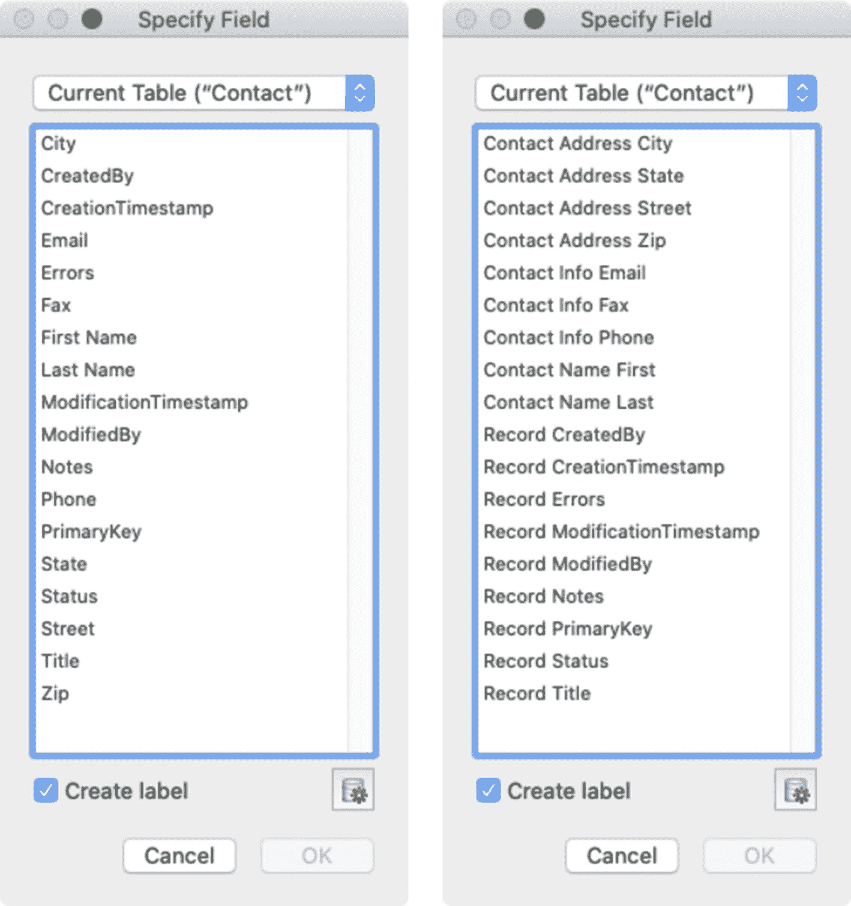

# 定义默认字段

从 FileMaker 17 开始，每个新数据表都会创建带有默认字段，这些字段已预配置为自动输入标准元数据。创建后，可根据需要对其进行编辑、重命名或删除。控制将来任何数据表创建哪些字段的文件名为 `DefaultFields.xml`，位于 FileMaker Pro 应用程序的语言子文件夹中。这些字段包括：

* `PrimaryKey` – 为每条记录输入通用唯一标识符 (UUID)
* `CreationTimestamp` – 输入记录创建的时间
* `CreationBy` – 输入记录创建者的名称
* `ModificationTimestamp` – 输入记录最后修改的时间
* `ModificationBy` – 输入最后修改者的名称

## 创建自己的标准字段

一些开发者会定义替代和/或额外的标准字段，并始终将其添加到他们创建的每个数据库的所有数据表中。`标准字段`是可以普遍应用于任何数据表的字段，无论其内容所建模的对象类型为何。它们不必局限于像前面默认字段那样的自动输入元数据值。相反，它们可以是任何存储内容或提供某种功能的字段，无论数据表的实体或用途如何，都能通用。随着开发的深入，标准字段的想法可能会变得丰富，但并非每个标准字段都应强制加入每个数据表。一些`通用标准`将很容易应用于所有数据表。其他`分组标准`可能仅适用于特定类型的数据表，而另一些`可选标准`则仅根据需要进行少量应用。以下是一些适用于所有数据表的标准化思路：

* `Status` – 一个数据输入状态字段，用于存储进度值，例如 `new`（新建）、`active`（进行中）、`hold`（暂缓）或 `done`（完成）。具体值可能因数据表而异。
* `Notes` – 一个自由格式的备注字段，用于存储关于记录本身或记录所代表的实体的信息。
* `Errors` – 一个计算字段，用于自动编译并在布局上显示数据输入错误通知，使用户能即时获得有关关键字段问题的反馈。
* `Title` – 一个计算字段，组合多个字段以生成标题，显示在输入布局顶部或列表视图或门户行的主体中，帮助用户快速识别特定记录。

**提示**

可以复制并粘贴自定义标准字段到新数据表中，或将其添加到 `DefaultFields.xml` 文件中以实现自动插入。

## 对标准字段进行分组

由于标准字段将在许多数据表和众多解决方案中一致使用，命名时应格外小心。虽然分组前缀有助于在列表中排序字段，但可考虑添加一个`超级分组前缀`，即一个单词，将字段分为两个“顶层”组：`standard`（标准）和 `custom`（自定义）。例如，前缀 `Record` 可以表示包含元数据的标准字段，而特定于数据表的前缀则表示自定义字段，例如，使用 `Contact` 表示特定于联系人数据表的字段，如图 8-2 所示。

**图 8-2** 无前缀字段（左）与前缀分组字段（右）示例

虽然这种方法乍看之下视觉上可能显得杂乱，但随着列表扩展到包含数十或数百个字段，某种按名称分组的组织结构会变得有益。

