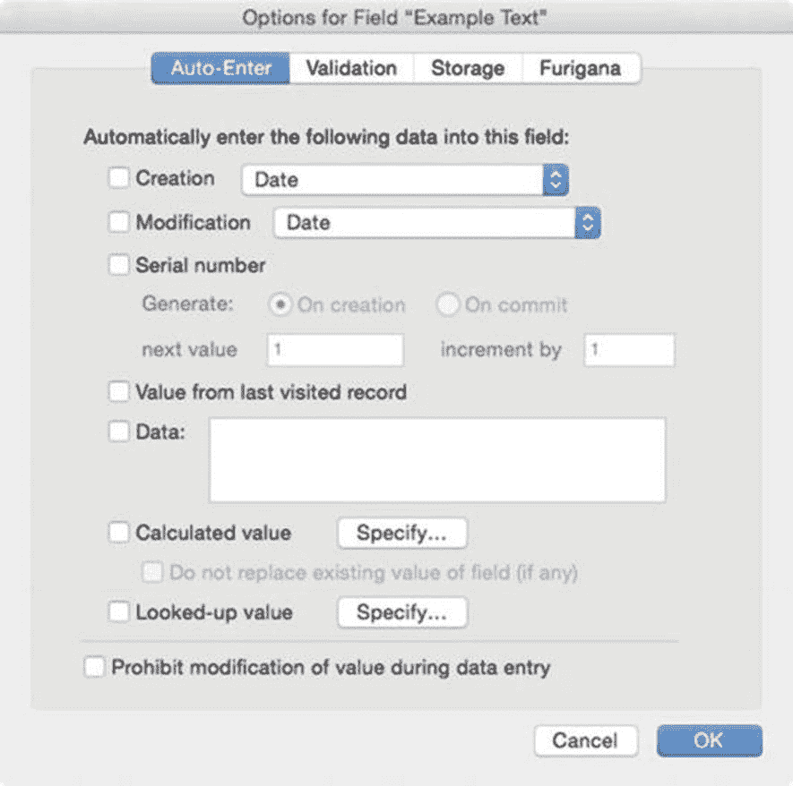
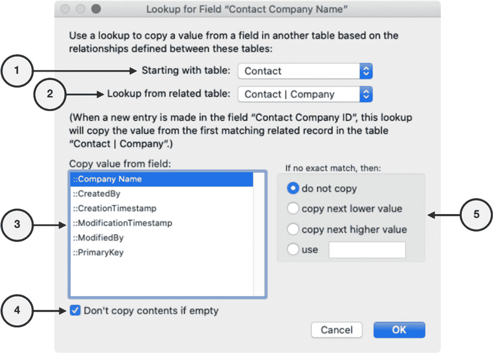
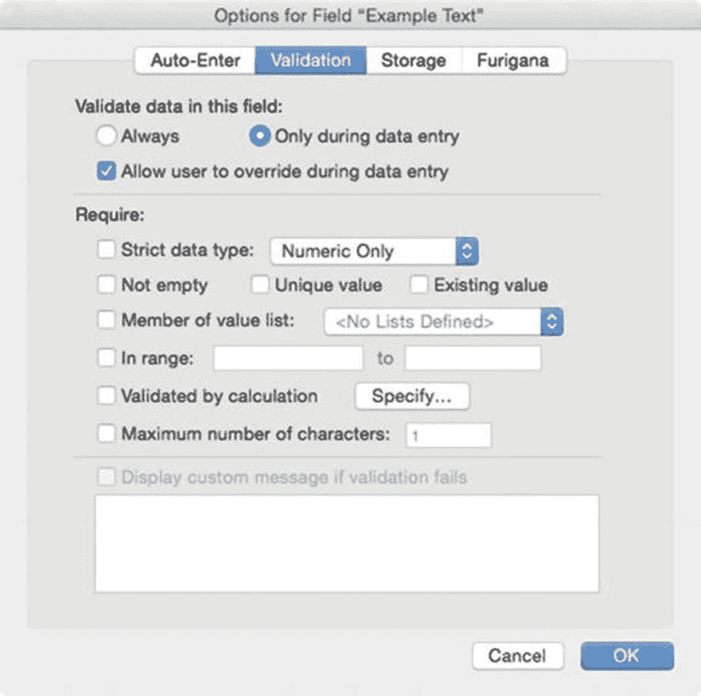
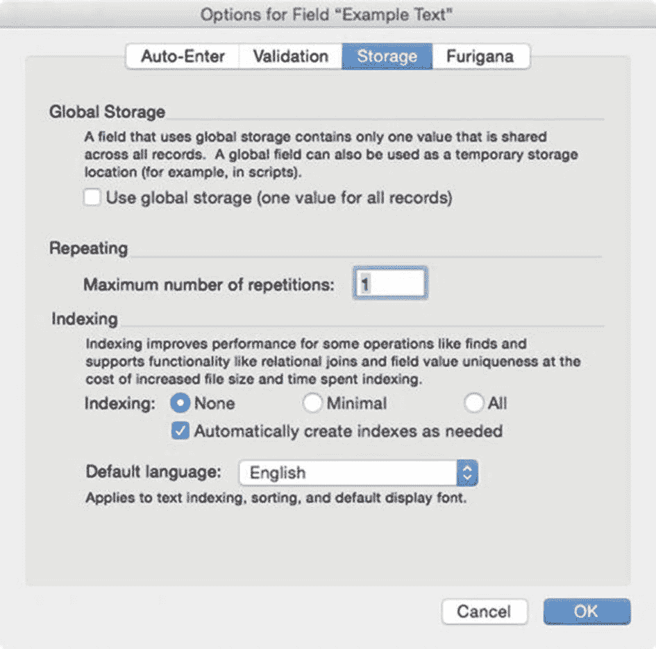

# 删除字段

只需选中字段并点击`*删除*`按钮，即可从表中删除字段。系统会弹出一个警告对话框来确认删除请求。选中的字段会立即从列表中消失；然而，实际的删除操作要到您点击`确定`按钮关闭`*管理数据库*`对话框后才会执行。如果您操作有误，不希望保存删除更改，请点击`*取消*`按钮。FileMaker 在清理布局中字段的引用方面做得相当不错。但是，您可能需要手动删除其他文件中布局上残留的任何`*<缺失字段>*`引用。脚本步骤或公式中对已删除字段的任何引用都需要手动移除或重新指定。

## 设置字段选项

除了字段的`*名称*`、`*类型*`和`*注释*`属性外，根据字段类型的不同，还有许多可配置的选项。要编辑这些选项，请选中一个字段并点击`*选项*`按钮。

### 输入字段的选项

所有输入字段都具有相似的选项，只是彼此之间略有差异。这些选项通过一个`*字段选项*`对话框进行控制，其设置分布在四个选项卡中：`*自动输入*`、`*验证*`、`*存储*`和`*假名*`。

#### 字段选项：自动输入

`*输入字段选项*`对话框的`*自动输入选项*`选项卡（如图 [8-3] 所示）用于控制创建新记录或满足特定条件时自动输入到字段中的数据。

图 8-3

输入字段选项对话框的“自动输入”选项卡

**注意**

虽然所有选项都是复选框控件，但前五个选项像单选按钮一样工作，只允许选择`*一个*`，因为它们会互相覆盖。

##### 自动将以下数据输入到此字段

对于某些输入字段，其中一些设置可能会受到限制或禁用，具体取决于它们包含的特定数据类型。这些选项包括自动输入：

- `*创建*` – 在记录创建时选择一个要输入的值：`*日期*`、`*时间*`、`*时间戳*`、`*名称*`或`*账户名*`。
- `*修改*` – 在记录被修改时选择一个要输入的值（选项与前述相同）。
- `*序列号*` – 在记录创建时或首次提交时输入一个序列化编号。该编号基于`*下一个值*`文本框中的值，并每次自动按`*增量*`中的值递增。
- `*来自上次访问记录的值*` – 将用户查看的上一条记录中同一字段的值输入到新记录中。
- `*数据*` – 输入相邻文本框中的静态文本值。
- `*计算值*` – 定义一个生成结果并输入到字段中的公式（第 [12] 章）。如果之前选项已存在值，或字段已包含用户先前输入的数据，则`*不要替换*`复选框将导致字段`*不*`计算该结果。
- `*查找值*` – 从相关字段复制一个值。

**注意**

设置为不替换现有值的计算值，在记录创建时计算一次，如果生成了值，则不会重新计算，包括在复制记录时也不会。

##### 字段查找对话框

`*查找字段*`会在定义关系的关键字段更新后，立即自动从相关记录的特定字段复制一个值。此功能用于在本地放置一个来自相关记录的值副本，以便即使相关记录被删除，该副本仍然保留。此功能是关系型数据库出现之前的遗留产物，可能会在未来的版本中弃用。建议改用自动输入计算或直接在布局上放置相关字段。要配置查找，请在`*字段选项*`对话框的`*自动输入*`选项卡中勾选`*查找值*`复选框。这将打开一个`*字段查找*`对话框，如图 [8-4] 所示。

图 8-4

用于配置查找设置的对话框

该对话框包含以下控件：

1. `*起始表*` – 如果为其表存在多个表出现项（第 [9] 章），请选择一个表出现项作为正在定义字段的起始上下文。
2. `*从相关表查找*` – 选择一个与起始表相关的表，以确定将通过哪个关系通道复制字段值。
3. `*从字段复制值*` – 从选定的查找表出现项中选择一个字段，该字段的值将在查找发生时复制到正在定义的字段中。
4. `*如果为空则不复制内容*` – 如果选定字段为空，则选择停止查找，保留任何现有值。
5. `*如果未找到完全匹配项则*` – 选择在未找到相关记录时要执行的操作。

##### 禁止在数据输入期间修改值

`*字段选项*`对话框`*自动输入*`选项卡底部的此复选框使该字段在数据层变为不可编辑，这`*独立于*`用户的安全设置或该字段在布局上的配置。在任何自动输入选项执行后，除非更改此设置，否则该字段的值将不可编辑。这对于主键和记录元数据等默认字段，或任何您希望在初始自动输入完成后为只读的其他输入字段非常有用。

#### 字段选项：验证

`*输入字段选项*`对话框的`*验证*`选项卡（如图 [8-5] 所示）定义了该字段的输入要求，使数据库能够自动验证输入并强制执行规则。如果指定了一个或多个要求，FileMaker 将验证输入到字段中的数据。当字段未通过验证检查时，用户会收到通知，并获得纠正措施的选择。

图 8-5

输入字段选项对话框的“验证”选项卡

##### 验证控制

`*验证*`选项卡顶部的选项用于控制何时验证输入，以及用户是否可以覆盖验证警告。选择`*始终*`以使字段在输入数据时以及导入到字段时进行验证，或选择`*仅限数据输入期间*`以`*仅*`在数据输入期间进行验证，而不在导入期间进行。

**注意**

设置为始终验证的字段如果验证失败，将导致 FileMaker `*不*`导入该记录。这些失败将作为导入错误的总次数进行报告，且不提供任何额外细节！

勾选`*允许用户覆盖*`框以更改验证警告选项，如图 [8-6] 所示。当覆盖选项`*关闭*`时，警告对话框有两个按钮。`*还原字段*`按钮将撤消数据输入更改，恢复之前保存的值，而`确定`按钮将用户返回到未提交的记录，用户可以在其中编辑其输入以符合验证要求，然后再次尝试提交。当覆盖选项`*打开*`时，`*还原字段*`选项仍然存在，并新增了一条允许覆盖警告的消息。点击`否`按钮将用户返回到编辑未提交的记录，而点击`是`则忽略验证警告，接受输入的更改，并继续提交记录。

图 8-6

覆盖关闭（左）与覆盖开启（右）时的警告信息

### 验证要求

可对输入到字段中的数据施加以下验证要求：

- **严格数据类型** – 将值限制为以下选项之一：`仅数字`、`4 位年份日期` 或 `一天中的时间`。

> **提示**：此处的 `4 位年份` 选项要求在 FileMaker 执行自动转换*之前*输入完整年份，可用于避免该范围之外的日期发生意外转换。

- **非空** – 要求在记录中输入值。

- **唯一值** – 要求输入的值在该字段中对于表中的*所有*记录都是唯一的。

- **现有值** – 要求输入的值必须已存在于表中至少一条其他记录的相同字段中。

- **值列表成员** – 要求输入的值出现在指定的值列表中（第 11 章）。

- **在范围内** – 要求输入的值位于指定的范围内，可以是文本、日期、时间或数值。

- **通过计算验证** – 允许使用自定义验证公式（第 12 章）。公式*必须*求值为 `true`（非零），输入才能通过验证测试。

- **最大字符数** – 要求输入的字符长度小于或等于指定的数字（仅适用于非容器字段）。

- **最大千字节数** – 此选项替换了容器字段的前一个选项，指定可放入该字段的文件大小的上限。

### 验证失败时显示自定义消息

当字段验证失败时，FileMaker 将生成一个对话框消息，如前文图 8-6 所示。默认消息将包含有关特定验证失败的详细信息，当对单个字段应用多个验证条件时，这会很有帮助。**显示自定义消息** 选项允许为字段输入替代的自定义静态消息。

### 探索验证替代方案

一些开发者会谨慎使用 FileMaker 的验证选项，并更喜欢替代方案。许多数据输入错误可以预见，并使用 `自动输入计算` 公式*自动更正*，以清理和替换输入的值。例如，`GetAsNumber`、`Filter`、`Trim` 和 `Substitute` 函数可以自动移除在字段中键入的不良字符（第 13 章）。通过使用**检查器**面板（第 19 章）中的**行为**设置，使 Return 键在布局上移动到下一个字段，可以防止段落回车符进入字段。当错误不容易避免或无法自动更正时，错误检测计算字段可以显示一个包含可检测验证错误的字段列表。这消除了一个突兀的对话框，并允许搜索/排序有错误的记录；但是，用户可以忽略它。分配给字段的 `OnObjectValidate` 脚本触发器（第 27 章）可以运行一个检查该字段是否存在可检测错误的脚本，并阻止用户退出该字段，直到错误被纠正。这允许使用更复杂的、由公式驱动的对话框消息来解释问题。`OnRecordCommit` 脚本触发器可以在检测到的问题得到纠正之前，暂停提交记录。

## 字段选项：存储

**输入选项**对话框的**存储选项**选项卡，如图 8-7 所示，控制着信息在字段中的存储和索引方式。

**图 8-7** – 输入字段选项对话框的存储选项卡

### 全局存储

一个*本地字段*在每条记录中作为自身的唯一实例复制，就像电子表格中的单元格，每条记录可以包含不同的值。放置在字段中的值被视为单条记录的*本地*值，它与任何其他记录上的相同字段是分开且不同的。本地字段只能从其父表或与该表相关的表的上下文中显示和访问。每个新定义的字段最初都是本地字段，但可以配置为全局字段。一个*全局字段*包含一个值，该值将在表中的每条记录之间共享，并且可以从数据库中的任何上下文中访问。使用电子表格类比，其中列代表已定义的字段，行代表一条记录，全局字段就像一列，该列的每个单元格中对于每一行都有相同的值，只不过从任何单个记录的角度来看，*只有一个相同的值*。

在**字段选项**对话框的**存储**选项卡中，**使用全局存储**复选框可将字段转换为使用全局存储。FileMaker 将弹出一个警告对话框，指示在更改时该字段内的现有值将丢失。一旦字段设定为全局，它可以用于多种特殊用途，包括：

- 存储一个固定值，该值对*任何*计算公式或布局都可用，无论上下文如何，例如，税率
- 创建一个*控制字段*，例如选项菜单，如门户过滤或排序选项的弹出菜单
- 为脚本提供临时存储，以放置需要与其他计算字段交互的信息
- 存储将在多个布局上以图标、品牌标识等形式显示的静态文本或图形
- 存储打印报告标题或其他临时信息

在大多数情况下，全局变量更可取，因为它不会使字段定义列表变得臃肿。但是，它仅限于单个文件。添加到其他文件的表出现中的全局字段允许内容在文件之间全局共享，从而创建一个*解决方案全局变量*。

放入全局字段的值会从一个会话保留到下一个会话，*仅*当在 `FileMaker Pro` 桌面应用程序本地副本上打开的非托管数据库上输入时。当通过网络打开时，放入全局字段的值不会在会话之间保存，也不会在同时访问文件的用户之间共享。每次从服务器主机打开数据库时，该字段将包含桌面应用程序*本地*上次打开时输入的值。

> **提示**：在远古时代，开发者将全局字段用于多种功能，这些功能现在通过变量（第 12 和 25 章）、自定义函数（第 15 章）、合并变量（第 20 章）和脚本参数（第 24 章）可以更好地管理。请谨慎使用全局字段！

### 重复项

`重复字段` 是一种定义为单个记录存储多个值的字段。无需为某种类型的每个附加值创建单独字段，而是可以定义一个字段来*重复*任意次数。例如，可以定义一个电话号码字段来存储多个号码，就像它们是独立的字段一样。任何类型的字段都可以设为重复。对于输入字段，请在“字段选项”对话框的“存储”选项卡提供的文本区域中输入所需的重复次数。对于*计算*字段，请在“指定公式”对话框中输入重复次数（第 12 章）。当*摘要*字段所汇总的字段为重复字段，并且选择了“单独汇总重复项”选项时，该摘要字段也会变为重复字段（本章后文将介绍）。

在“字段选项”对话框的“存储”选项卡中输入的*最大重复次数*定义了该字段可包含的独立值的数量。要允许用户输入到其中两个或更多重复项中，必须将该字段配置为在布局上重复（第 19 章，“检查数据设置”）。使用重复字段时需要考虑几个影响，包括：

* 重复字段在布局上永远无法滚动。
* 稍后可以添加更多重复项，但布局上显示的数量必须手动调整以将其包含在内。
* *隐藏*功能（第 21 章，“隐藏对象”）会隐藏整个字段，包括布局上显示的所有重复项。
* *查找*过程会搜索所有重复项，包括当前或任何布局上未显示的重复项。无法将查找限制为仅针对特定重复项。
* *排序*过程*仅*会查看第一个重复项。
* 如果不使用*扩展*功能（第 12 章，“创建重复计算字段”），结合重复字段和非重复字段的计算可能无法正常工作。
* 自动输入计算仅在第一个重复项上有效。
* 重复值在报表的子汇总部分（第 18 章）中可能无法正常工作，并且可能需要通过聚合函数（例如 *List*，第 13 章）将其压缩为单个值。

> **提示**  
> 从历史上看，重复字段曾用于实现现在由门户提供的功能（第 20 章）。请谨慎使用此功能！

