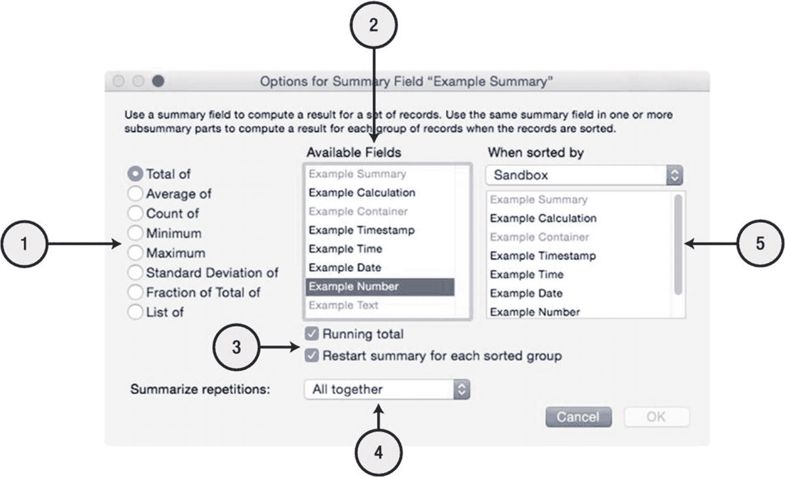

# 索引

`字段索引` 是根据非全局字段的内容自动生成的隐藏单词或值列表。此列表用于执行搜索、确定字段值的唯一性以及通过关系连接记录。字段索引的功能类似于书籍索引，可以快速分离各个术语，从而无需逐页浏览即可更快地定位它们。根据字段类型和所选选项，FileMaker 使用两种索引。`值索引` 是根据字段中每个由段落回车符分隔的文本行创建的。它用于匹配相关记录以及在字段中搜索匹配的值。此处，可以将“值”视为一个段落。这主要用于关系，其中每个值用于在相关表中查找匹配项。`单词索引` 是根据文本字段或文本计算字段中的每个唯一单词创建的，用于加快搜索速度。

> **警告**  
> 某些关系功能需要索引，并且索引能提高搜索性能。但是，它会增加数据库的文件大小，因此应有意识地使用。

“字段选项”对话框的“存储”选项卡中的索引选项包括：

* **索引：无** – 完全阻止索引。适用于不需要快速搜索且不会用于建立关系的字段。同时，也用于使计算频繁重新计算。
* **索引：最小** – 仅为该字段创建值索引。
* **索引：全部** – 为非文本字段创建值索引，为文本字段创建单词索引和值索引。
* **根据需要自动创建索引** – 允许 FileMaker 根据需要创建索引。例如，当用户对之前未建立索引的字段执行搜索时，它会自动将*无*切换为*全部*以生成并存储索引。
* **默认语言** – 指定在对文本字段中的值进行索引和排序时使用的语言。默认值与创建文件所在计算机的操作系统匹配。

> **提示**  
> 在某些情况下，您可能希望自定义索引设置以节省文件大小。但是，默认设置允许 FileMaker 根据用户和开发者的活动进行调整。

### 容器存储选项

容器字段无法建立索引，因此在编辑时，“字段选项”对话框的“存储”选项卡中不提供上述选项，而是显示“容器存储选项”（第 10 章）。

## 字段选项：注音

“输入选项”对话框的“注音”选项卡用于指定输入到字段中的日语文本的语音翻译。有关日语函数的更多信息，请参阅 Claris 的文档网站。

## 显示字段的选项

*计算*和*摘要*字段的选项与输入字段不同。单击*选项*按钮或双击将打开一个针对特定字段类型的备选选项对话框。

对于计算字段，*选项*按钮会打开“指定计算”对话框，可以在其中输入公式，并配置结果数据类型、重复项、存储选项和求值上下文（第 12 章）。

对于摘要字段，*选项*按钮会打开“摘要字段选项”对话框，用于指定摘要类型、目标字段等。所选*摘要类型*决定了将对选定字段在一组记录上执行何种摘要操作，以得出放入正在定义的字段中的值。可对一组记录中的字段执行的可用摘要操作包括：

* **总计** – 计算总值
* **平均值** – 计算平均值
* **计数** – 统计包含值的记录数量
* **最小值** – 提取可用的最小值
* **最大值** – 提取可用的最大值
* **标准差** – 计算所有值与平均值的标准差
* **占总和的百分比** – 计算该字段值占总值的比率
* **列表** – 创建一个所有非空值的回车分隔列表

#### 摘要字段选项对话框

`摘要字段选项`对话框分为五个主要部分，如图 8-8 所示。

**图 8-8** 显示额外控件的摘要选项对话框

**警告**

以下选项提供了摘要设置的概述，在您看到构建了子摘要部分的复杂报表（请参阅第 18 章“添加布局”）之前，它们可能显得过于抽象。

该对话框包含以下控件：

1.  **摘要类型** – 指定要使用的摘要类型（上一节已列出）。
2.  **可用字段** – 选择要从中提取并汇总数据的字段。该列表包含来自正在定义的字段所属表的相关字段。
3.  **条件选项** – 根据所选的摘要类型，此区域将显示以下选项中的*零个*、*一个*或*两个*：`Running total`、`Restart summary for each sorted group`、`Weighted average`、`Running count`、以及 `By population` 或 `Subtotaled`。
4.  **汇总重复项** – 当选择了重复字段时，请指明如何处理重复项。选择 `Individually` 可为每个重复项显示单独的摘要，从而使摘要字段也成为重复项。选择 `All together` 则将一个记录的所有重复项相加，并在摘要过程中将其视为单个值。
5.  **条件辅助字段选择** – 根据之前选择的选项，可能需要为以下某项辅助功能选择一个字段：
   - **When Sorted by** – 某些操作允许在检测到新的排序值时重新开始摘要。这可以为单个找到的记录集中的多个子组创建摘要。例如，您可能希望使用此功能汇总 `每个员工的销售额` 或 `每个客户的收入`。当选择了 `Restart summary for each sorted group` 选项，或 `Fraction of Total of` 摘要类型配合 `Subtotaled` 选项使用时，此选项适用于 `Total of` 或 `Count of` 摘要类型。
   - **Weighted by** – 当使用 `Average of` 摘要类型并选择 `Weighted average` 选项时，可以选择一个用于加权计算结果的字段。

## 向示例数据库添加字段

在上一章的结尾，我们向 `Learn FileMaker` 示例数据库添加了三个表：`Company`、`Contact` 和 `Project`。现在，利用本章学到的知识，我们可以为每个表添加一些字段。虽然这些字段并非实际解决方案中这些表所需的完整列表，但它们提供了几个关键字段，以便我们继续探索构建数据库的过程。

### 定义公司字段

在 `Company` 表中，创建以下字段：

- `Company Name (text)`
- `Company Description (text)`
- `Company Industry (text)`
- `Company Website (text)`
- `Company Status (text)`

### 定义联系人字段

在 `Contact` 表中，创建以下字段：

- `Contact Name First (text)`
- `Contact Name Last (text)`
- `Contact Company ID (text)`
- `Contact Address Street (text)`
- `Contact Address City (text)`
- `Contact Address State (text)`
- `Contact Address Zip (number)`
- `Contact Address Country (text)`

### 定义项目字段

在 `Project` 表中，创建以下字段：

- `Project Company ID (text)`
- `Project Contact ID (text)`
- `Project Name (text)`
- `Project Description (text)`
- `Project Budget (number)`
- `Project Budget Summary (summary as a Total of the Project Budget field)`

### 重命名和修改默认字段

为了遵循本书后续示例的操作，并积累修改字段定义的经验，请对所有表中的五个默认字段执行以下更改：

- 将 `PrimaryKey` 重命名为“Record ID”，并将其自动输入选项从“计算值”更改为以“000001”开头的“序列号”。
- 将 `CreationTimestamp` 重命名为“Record Creation Timestamp”。
- 将 `CreatedBy` 重命名为“Record Creation User”。
- 将 `ModificationTimestamp` 重命名为“Record Modification Timestamp”。
- 将 `ModifiedBy` 重命名为“Record Modification User”。

**提示**

通过在一个表中完成这些操作，然后复制粘贴以替换其他表中的默认字段可以节省时间。

## 总结

本章探讨了定义字段的基础知识。下一章，我们将重点转向在表之间建立关系连接。

