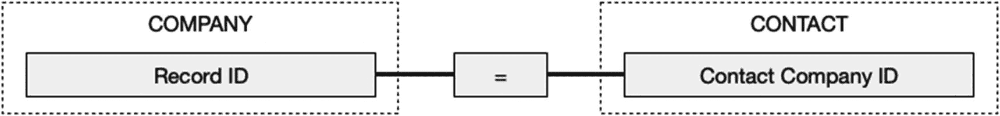
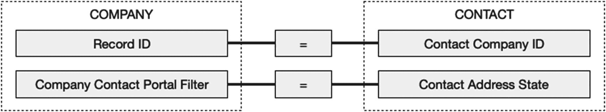

# 引入关系

*关系*定义了表之间的连接，形成双向通道的上下文，将一个表中的单个记录链接到另一个表中的一个或多个单个记录。作为现实世界现象的数字化模型，数据库使用`tables`来表示实体，`fields`来存储实体的属性，并使用`relationships`来反映这些实体如何连接或交互。

考虑一下公司与员工之间的关系如何在数据库中进行建模。每个实体可以由一个表表示：`Company`和`Contact`。在每个表中创建字段，用于存储对数据库工作重要的实体属性。例如，公司的`address`、`description`、`industry`、`name`和`website`可以作为字段。同样，联系人的`email`、`name`、`phones`和`title`也可以作为字段。接下来，观察这两个实体在现实中的关联方式，我们可以确定它们之间存在连接的需要。每个公司可能雇佣一个或多个人员，反之，每个人员通常受雇于一家公司。由此，我们可以在数据库中定义至少一个关系需求：每条`Contact`记录需要能够连接到一条`Company`记录。一个人可以链接为公司的员工，反之，一家公司可以有一个或多个人员被链接为员工。

数据库中创建的每个表都增加了更多连接的可能性。例如，公司可能需要链接到`inventory`、`projects`、`budgets`、`assets`和`procedures`，而联系人可能需要链接到`phones`、`emails`和`web addresses`。随着数据库的增长，这些都意味着更多的连接。一个项目和预算可能需要链接到`tasks`、`timesheets`和`invoices`。所需连接将根据数据库的目的以及对象模型中包含的表类型而有所不同。当开发者决定需要将现实中发现的连接呈现在数字化对象模型中，并明确指定用于比较和匹配记录之间值的字段条件时，就定义了一个关系。

关系使得在相关表的记录之间创建可导航的链接成为可能。它们还在表之间创建了一个`relational context`，可由计算、布局和脚本使用，以访问或显示来自不同表的字段值。关系将一组孤立的表转化为一个互联的信息网络，可以通过多种方式动态访问、显示和操作。`Fields`在拉取相关值以执行查找、自动输入计算或验证时会使用关系（参见第 8 章）。`Formulas`使用它们来访问或操作相关字段以计算结果（参见第 12 章）。`Layouts`可以显示来自相关记录的单个字段，或包括一个来自其他表的相关记录列表作为门户（参见第 20 章）。布局对象可以在用于条件格式、占位符文本、脚本参数、工具提示和隐藏功能的计算公式中使用相关字段的值（参见第 21 章）。许多`script steps`在公式中或引用字段时会使用关系（参见第 24 章和第 25 章）。用户在手动导出、导入、搜索和排序时，可以在对话框中选择来自相关表的字段。

> **提示**  
> 虽然大多数关系是在两个`不同`的表之间建立连接，但也可以将记录连接到`同一个`表中的其他记录，或者将记录连接到自身，这称为`自连接`。

## 可视化关系

`匹配字段`是用于形成关系条件一方的任何字段。两个匹配字段与一个运算符配对，形成定义关系的单一条件。任何字段都可以用作匹配字段，尽管大多数关系使用键。`键字段`是唯一标识表中一条记录的字段。虽然许多字段都是候选，但键的良好选择是`既唯一又不变`的。例如，尽管`Contact`记录的电子邮件地址字段对个人是唯一的，但如果个人的工作发生变化或他们因个人账户更换了服务提供商，它可能会改变。这使其不适合作为关系键，因为更改会切断先前链接的记录之间的连接。因此，大多数开发者会建立一个字段，用于存储自动输入、匿名、递增、唯一且不变的标识号，并将其作为每个表的标准实践。这可以是一个简单的自动输入序列号（第 8 章，"字段选项：自动输入"），或更复杂的通用唯一标识符（第 8 章，"定义默认字段"）。这些字段充当`主键`，主键字段包含一个值，用于标识该字段所在表中同一表的记录。例如，`Company`表中的`Record ID`字段存储了标识特定公司记录的主键，例如"1105"代表 Widgets Manufacturing。当一个主键被放入另一个表中用于标识该表中的记录以形成关系时，它被称为`外键`，因为它标识的是所在表外部的记录。主键字段和外键字段共同构成了大多数关系的基础。由于这些通常创建层级关系，所以常常被称为`父子连接`，如图 9-1 所示。在此示例中，`Record ID`是`Company`的主键，而`Contact`表中的`Contact Company ID`字段包含一个外键。当两个字段中的值相等时，就在两条记录之间形成了关系链接。

**图 9-1** 单个键字段对形成关系的示意图

每个关系必须包含至少一组匹配字段，但可以包含附加条件。当定义了多对匹配字段时，记录仅在`所有`条件都匹配时才会链接。图 9-2 所示的示例展示了另一组字段：`Company`中的`Company Contact Portal Filter`和`Contact`中的`Contact Address State`。这些第二匹配字段允许查看公司记录的用户从列表中选择一个州，该州将用于“筛选”门户视图中的联系人列表，使其仅显示地址在该州的联系人（参见第 20 章，“筛选门户记录”）。

**图 9-2** 由两个匹配字段建立的关系示意图

关系可分为三大类，根据每一侧可能匹配的记录数量命名：`一对一`、`一对多`和`多对多`。FileMaker 有一个独特的`多键选项`，可用于创建一对多或多对多连接。这些配置可以在字段验证级别和/或通过物理限制可选定或插入到键字段中的内容的接口机制来强制执行。另一个选项是`笛卡尔连接`，它将一个表中的每条记录与另一个表中的每条记录相关联。这些可以在关系设置级别使用运算符进行设置。

