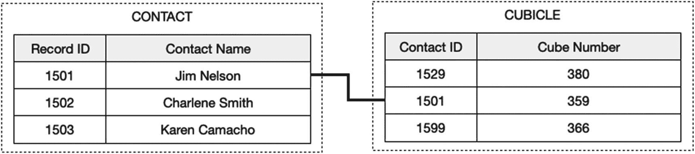

# 一对一关系

一对一关系是一种连接，其中一个表中的一条记录只能与另一个表中的一条记录匹配。图 9-3 中的示例展示了一组匹配的记录，其中`Contact`记录的主`Record ID`作为外键输入到`Cubicle`记录的`Contact ID`字段中。分配的方向性是可选的，因为对于哪个实体是主实体、哪个是次实体没有固有要求。作为开发者，你可以选择*要么*如图所示将隔间分配给人员，*要么*将人员分配给隔间，具体取决于你的偏好或其他后勤考虑。设置要求对两个键字段进行验证，以确保其包含在各自表中的所有记录中唯一的值。因此，在所示的示例中，每个联系人只能分配一个隔间，且每个隔间只能分配一个联系人。

图 9-3 展示一对一连接

