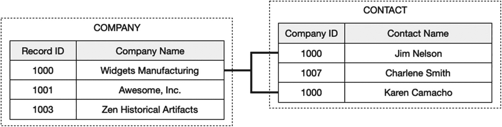

# 一对多关系

一对多关系是一种连接，其中一个表中的一条记录可以与另一个表中的一条或多条记录匹配。图 9-4 中的示例展示了一组匹配的记录，其中`Company`的主`Record ID`作为外键输入到`Contact`表中两条记录的`Contact Company ID`字段中。这种关系类型经常使用，因为现实世界中存在许多一个实体可以与多个实体关联的情况。一家公司可能有多个办事处、产品和员工。一个人可能有多个电话号码、电子邮件地址和网页。一个父母可以有多个孩子。最后一个例子正是这种安排常被比喻性地称为*父子*类型关系的原因，因为从生物学角度，一个孩子只有一个父亲或一个母亲，但任何一个父母都可以有多个孩子。设置要求对主键字段进行验证，以确保其包含单一、唯一的值，而另一个表中的外键字段允许非唯一值。分配的方向性取决于这样一个事实：多的一方必须包含来自具有唯一主键的表的那个外键。

图 9-4 展示一对多连接

