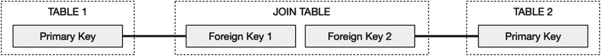
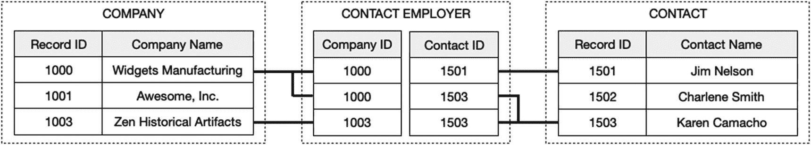

# 多对多关系

多对多关系是一种连接，其中*两个表*上的记录都可以与来自另一个表的一条或多条记录连接。这通常通过使用联接表来实现。*联接表*是第三个表，主要作为连接点，在两个相关表之间进行连接转换。因此，它们有时被称为*连接表*。一个联接表至少包含*两个外键字段*，每个字段包含来自被联接的两个表中一个表的主键。图 9-5 中的示例展示了使用联接表的这种关系。`Table 1`和`Table 2`的主键分别输入到联接表一条记录的外键字段中，从而在两个表之间建立连接。

图 9-5 展示通过联接表实现的多对多连接

多对多关系的一个示例是，当需要将一个人与其*当前*雇主连接起来，同时保持与其*过去*雇主的连接时，在公司和联系人之间建立连接，如图 9-6 所示。在此示例中，`Company`表和`Contact`表通过一个名为`Contact Employer`的联接表连接。“Widgets Manufacturing”的`Company`记录连接到两个联接记录，每个联接记录又连接到一个联系人记录，一个给 Jim，一个给 Karen。而 Jim 的记录只与一个联接记录有单一连接，Karen 的`Contact`记录则连接回两家公司：“Widgets Manufacturing”和“Zen Historical Artifacts”。使用联接表允许任一侧的记录链接到另一侧的任意数量的记录。

图 9-6 展示多对多关系中的连接

严格来说，联接表并不是一个*单一*关系，因为它实际上由两个一对多关系组成。然而，它通常被称为*一个关系*，特别是当联接表仅用于促进两个普通表之间更广泛的连接时。在这种情况下，联接表只包含这两个字段，并且完全隐藏于视图中，没有用户可访问的界面。但是，联接*可以*包含特定于这两个实体联合的额外字段。例如，某个特定公司的联系人的电话号码和电子邮件地址可以存储在联接表记录中。它们还可以根据需要拥有界面，甚至与其它表连接。

