# FileMaker 独特的多键选项

FileMaker 具有使用包含多个值的键字段来定义关系的独特能力。*多键字段*是一个文本或计算字段，包含一个由回车符分隔的键列表，用作关系中的匹配字段。当匹配字段包含由回车符分隔的值时，每个段落都被视为其自己的值并用于形成匹配，因此一个字段中的*任何*一个值如果能在另一个字段中找到，就会匹配并形成关系连接。多键字段可用于创建一对多关系或多对多关系，*无需*借助中间的联接表。图 9-7 中的示例通过展示两个表之间使用多键字段作为两侧匹配字段的连接，演示了这种技术。`Table 1`第一条记录中的字段在`Table 2`中找到了*三个*匹配的记录，尽管没有一个字段包含所有相同的值。当至少一个段落值在两侧都存在时，就会形成匹配。设置多键多对多关系要求匹配字段是允许包含多个值且不需要验证唯一值的文本字段（或返回文本值的计算字段）。虽然此示例使用了州名，但任何值，包括序列号，都可以使用。

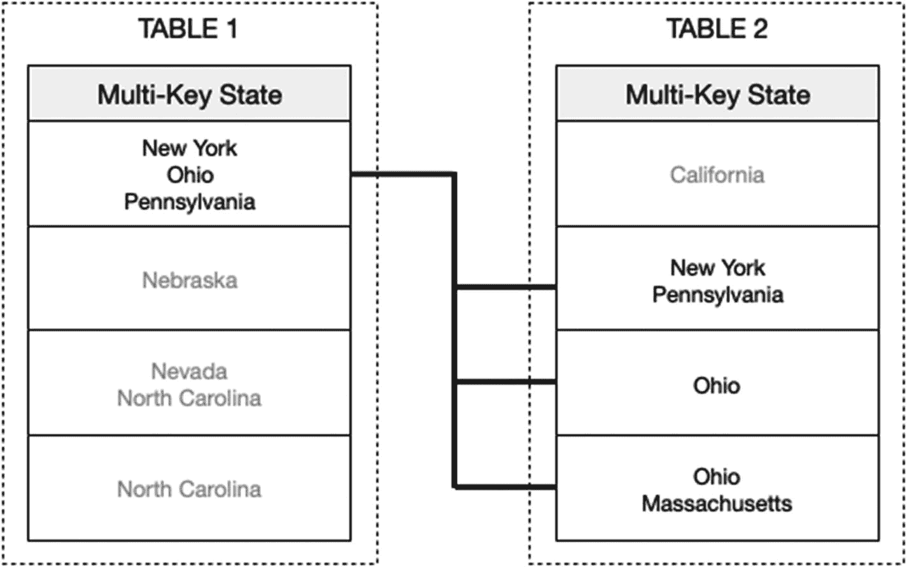

图 9-7 多键字段关系连接的插图

这种技术有利有弊。例如，没有像联接表那样的交叉表可以在其中添加字段或构建布局，因此如果需要这样做，这不是一个好的选择。然而，在复制记录时，由于键存储在本地而不是单独的联接表中，关系连接会得以保留。因此，如果复制图 9-7 中`Table 1`的第一条记录，它将保留与另一个表中记录的所有相同连接。

### 索引匹配字段

关系形成一条双向通道，允许任一表作为本地*起始上下文*（父表），供公式和布局以此定位另一相关表（子表）作为目标。然而，要使连接产生结果，*目标（子）表中使用的每个匹配字段必须被索引或为全局字段*。由于计算字段在其公式包含相关字段时无法被索引，因此目标侧的计算匹配字段必须仅包含该表本地的字段。全局字段无法被索引，但仍可在关系的任意一侧工作。不过，它们只在本地（父表）侧真正实用，因为在目标（子表）侧使用时，它们会匹配每条记录。

### 使用表出现项

关系实际上连接的是表的抽象表示，而非直接连接表。在 FileMaker 中，*表出现项* 是表的一个代表实例，放置在一个称为*关系图*的图形工作表中。虽然表在技术上是相连的，但这是通过表的特定出现实例完成的。这避免了表之间的循环连接，并允许基于不同条件在同一对表之间建立多个连接。它甚至允许表与自身之间的*自连接*。

每个表都会在关系图中自动以一个默认的表出现项表示。尽管这看起来并且可以被视为表本身，但它只是表的一个*出现项*。随着数据库的增长，涉及同一表的多个连接变得必要，但有形成循环的风险，如图 9-8（左图）所示。在这里，*公司-联系人* 和 *公司-项目* 之间的连接是标准的一对多关系，不会造成问题。然而，当需要 *联系人-项目* 连接时，它会在三个表之间形成一个整体循环连接，这是被禁止的。为了解决这个问题，创建了一个新的 *联系人* 表出现项，用于建立新关系（右图）。两个联系人实例代表的是*同一张表*，但来自*不同的关系上下文*。

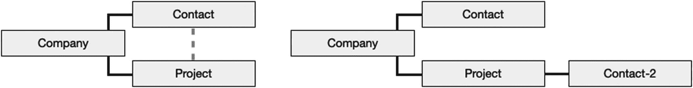

图 9-8

循环连接（左图）通过新出现项得到解决（右图）

上下文是 FileMaker 中一个极其重要的概念。虽然*表*是一个独立的数据结构，用于在字段和记录中定义和存储信息，但*表出现项*指定了来自特定*关系上下文*的数据，并用于控制从给定视角可访问哪些表。计算字段的公式在一个上下文中运行，如果该字段的父表有多个出现项，则必须选择该上下文。值列表可以配置为仅筛选来自特定起始界面上下文中出现项的字段值（第 11 章）。每个布局都需要分配一个出现项，该出现项控制可显示的字段，并为对象公式建立上下文。许多脚本步骤会根据执行时当前窗口中活动布局所分配的出现项，自动从*用户上下文*执行。

随着更多出现项的添加，它们可以串联成序列。在前面的示例中，从 *公司* 到 *项目* 再到 *联系人-2* 有一条连接。出现项之间的每一步通常被称为一个“跳”，指从起始出现项到目标出现项的步骤数。计算、布局或脚本步骤可以沿着单个关系链通过任意数量的跳来访问字段，但跨越太多跳可能会产生问题。在前面的示例中，*公司* 中的公式可以访问 *联系人-2* 中的字段，但*仅限*于第一个相关的 *项目* 记录，因为它必须通过那个关系通道。另一种更直接的路径，即直接连接到 *公司* 出现项的其他 *联系人* 出现项，则可以访问所有公司联系人。

随着关系模型复杂性的增加，它可能迅速变成一团混乱的单体结构，既令人困惑又存在技术风险。经验较少的开发者倾向于迅速将越来越多的出现项连接成一个巨大的多分支出现项链，这种单一整体被称为*轮毂-辐条式单体*。相反，推荐的方法是构建多个独立的*表出现项组*。鉴于数据库开发中到处都依赖于关系上下文，更好地理解这两种方法可以决定你是创建一个高效的系统，还是制造一个庞大的烂摊子。

警告

这些关于关系模型的讨论可能让初学者感到不知所措，尤其是在创建布局之前。然而，为避免后期出现错误，付出这些努力是值得的。

### 避免中心辐射式单体

*中心辐射式单体*是一种关系模型，其中所有表实例被连接成一个庞大的互联组，如图 9-9 所示。这种结构往往是大多数新手开发者直觉上默认采用的。他们一开始只连接少数几个默认的表实例。随后，当他们试图添加会导致循环的新关系时，`FileMaker`会提示他们创建新的实例，而他们则会保留带有数字后缀的默认表名。很快，他们就会拥有几十甚至上百个命名不当的实例，相互连接成一个庞大的组。

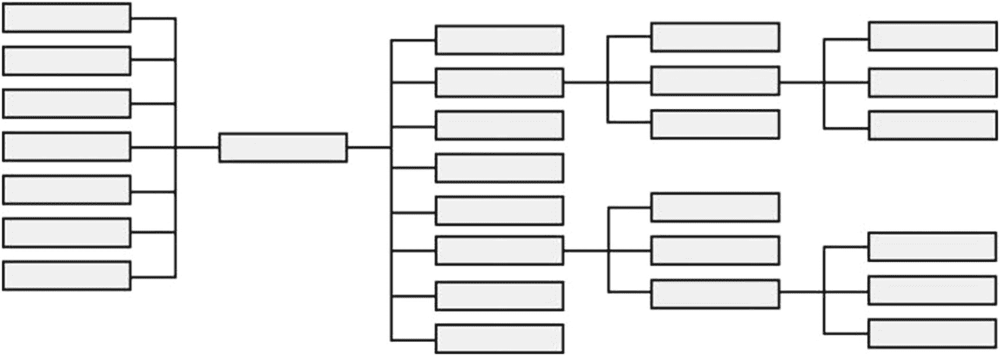

**图 9-9** 中心辐射式单体关系模型示意图

虽然这本身并非必然有问题，对于简单的数据库来说甚至是一种可行的选择，但仍有充分的理由完全避免中心辐射式模型。在这种模型中，很难判断哪些实例已被使用或应被用作起始上下文，结果导致成百上千的计算、界面和脚本在整个结构中迂回曲折，造成概念上的僵局。很快，要跟踪哪个实例匹配特定的上下文就变得令人困惑，例如，在公式中试图从`Contact-1`、`Contact-2`、`Contact-3`和`Contact-4`中做出选择，就需要耗时的侦查工作。当一个布局最初被分配了错误的上下文，只有在放置了数十个需要重新配置的对象之后才发现时，就需要进行错误的启动和回溯修正。添加新功能开始变得像是一项乏味的苦差事，而要概念化整个结构则需要巨大的努力。随着复杂结构的束缚越来越紧，令人麻木的混乱只是开始。一个微小的疏忽就可能导致数据丢失，例如脚本从错误的上下文执行函数，或者由于开发者疲劳导致的界面错误，用户通过错误的关系在字段中输入数据。计算跨越过多跳数向各个方向延伸，开始使简单任务变得异常缓慢，并可能返回错误的结果。最终，当用户难以忍受极度缓慢的性能，甚至可能遇到随机应用程序崩溃时，技术问题就会出现。将问题归咎于技术的诱惑变得难以抗拒，但这实际上是经验不足的开发者选择了糟糕结构设计的错误。

专业的开发者明白，一个设计良好的关系模型对于技术原因和保护自身理性都*至关重要*。数据库是众多组件的复杂集成，正如*界面设计*对于避免用户混淆很重要一样，在*结构设计*方法上也应给予同等的关注，以避免开发者混淆和功能故障。中心辐射式模型的许多问题可以通过有意识地改进实践来缓解。例如，清晰地命名实例，并制定规则确定哪些实例将被用作计算和布局的起始上下文，这会有所帮助。限制公式从给定上下文向外延伸一到两跳也有帮助。但这些技术仍然需要额外的工作来设置，并有意识地努力遵守。最终，最好的解决方案是*完全避免这种模型，转而使用实例组*！

### 采用表实例组

*表实例组*关系模型为每个表建立一个*主表实例*，并规定这些实例*永远*不直接相互连接。两个表之间的任何连接*必须*通过从一个主实例连接到一个新的表的*次实例*来建立，以避免主实例之间的任何直接连接。这也被称为*锚-浮标*模型，因为每个主实例充当一个独立的锚点，相关的次实例可以附着在其上，并被视为从该锚点漂浮出去。在图 9-10 所示的设置中，一列主表（灰色）独立地矗立在左侧。每个连接到这些主表的次表（透明）都是主表的副本。使用此模型并遵循一些规则，可以解决中心辐射式方法中发现的大部分混乱和潜在的技术复杂性。

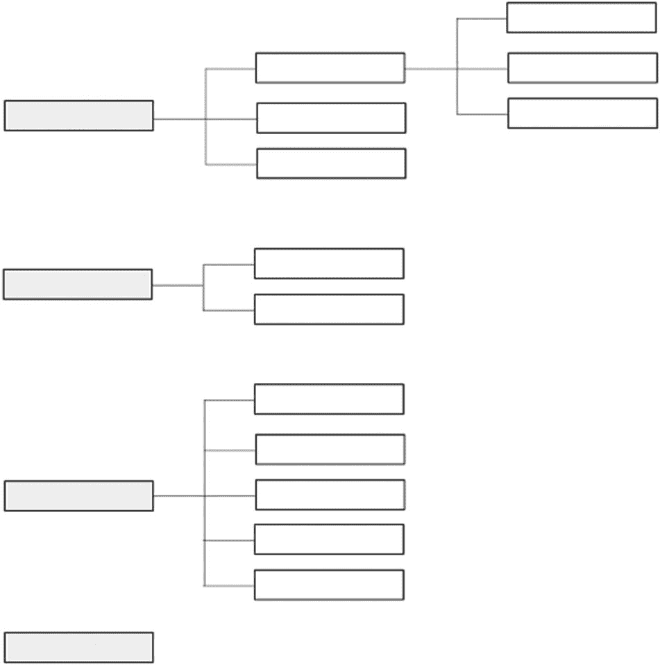

**图 9-10** 表实例组关系模型示意图

左侧的每个主实例为一个*实例上下文组*建立了基础锚点。这些实例应以实际表名命名，以明确它们代表主根实例，例如`Company`、`Contact`、`Project`等。在构建界面时，只应将这些主实例用作计算字段和布局的上下文。组之间的物理隔离限制了字段或界面公式可以访问相关字段的距离和方向，因为它们被限制在其小型“岛屿”组内的相关次实例中。

每个次实例从主实例向右“漂浮”。这些实例的命名方式应能指示它们所连接的起始上下文组，并包含关于它们如何关联回该组根主实例的路径信息。这可以采用多种形式，但理想情况下以主实例的名称开头，后跟一个表示跳转到新实例的分隔符，然后是次实例表的名称。例如，一个连接到主`Company`实例的次`Contact`实例可以命名为`Company | Contact`。名称的次实例部分可以包含用于标识关系性质的额外信息，例如`Company | Contact Employees`表示此`Contact`实例用于公司上下文，并关联到作为公司员工的联系人。

> **提示**  
> 考虑将表名部分大写以作强调。`Company | CONTACT`清楚地表明该实例起始于`Company`，但实际上是`Contacts`表的一个实例。

这里的“次级”命名法并非指与主实例的*距离*，而是表示那些*非主实例*的分类状态。因此，任何距离主实例任意跳数的实例都称为次实例。例如，一个`Phone Number`表的实例可能连接到一个次`Contact`实例，而该次`Contact`实例又连接到主`Company`实例，如图 9-11 所示。它是链条中的第三个实例，距离主实例有两跳，但仍然被称为“次”实例，以表明两者均非主状态。

**图 9-11** 从主实例延伸出两个次实例的示例

> **提示**  
> 虽然次实例可以进一步延伸，但如果可能，最好将每个分支限制在大约两到三跳。

为了说明这一设置，考虑两个分别锚定到`Company`和`Contact`表的上下文组，如图 9-12 所示。主要的`Company`表出现将用作每个公司计算和布局的上下文。连接到它的三个表可以在公式（第 12 章）中使用，并用于在布局上定义门户（第 20 章），以访问相关的`Contact`、`Project`和`Invoice`记录。如果联系人门户需要显示联系人的电话号码，或者计算或脚本需要从`Company`的上下文中访问该信息，则添加从`Company`出发、相距两个跳转的`Phone`表出现。

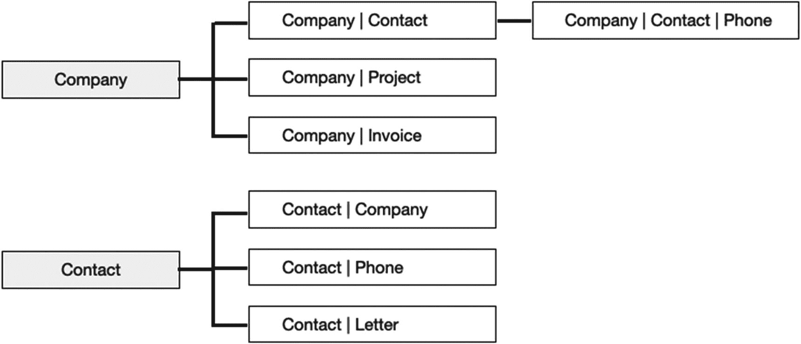

**图 9-12** 两个假设的表出现组示意图

类似地，主要的`Contact`表出现将用作每个联系人计算字段和布局的上下文。附属的`Company`表出现可用于在布局上显示联系人的雇主名称，并被脚本用于从联系人记录导航到其相关的父公司。`Phone`和`Letter`表出现可以为联系人布局上的门户提供上下文。

使用表出现组方法将导致关系图中存在一些冗余，并且最初可能看起来违反直觉，因为它似乎不必要地增加了表出现的数量。然而，如果实施得当，其好处最终会显现，您会庆幸花时间实施了它。*组之间的分离*简化了性能，并使在概念上导航结构变得更加容易。将所有公式和布局限制在一个主要的表出现起始上下文，使得更容易达到目标并避免混淆。一种包含从主要上下文开始的路径的命名方案，使得表出现组在整个开发界面的选择菜单中保持排序，从而同步有序的关系结构到列表中，并使目标表的选择更加容易。

### 规划学习 FileMaker 关系对象模型

在本章剩余课程之后，我们将遵循表出现组方法，在`Learn FileMaker`数据库中设置三个简单的表出现组，如图 9-13 所示。左侧的三个主要表出现将用作任何计算公式和布局的上下文，而右侧的次要表出现可用于创建计算、门户和脚本。

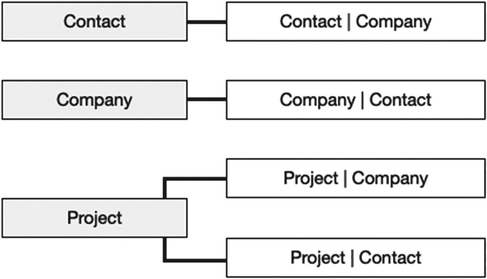

**图 9-13** Learn FileMaker 数据库中表出现计划

## 管理数据源

*数据源*是对其他 FileMaker 和 ODBC 数据库的已定义引用。当构建一个不访问外部表的自包含数据库时，无需定义数据源，因为隐含的源始终是当前文件。但是，当创建多文件数据库或集成 ODBC 表（第 7 章）时，将需要额外的数据源。

### 介绍管理外部数据源对话框

外部数据源在*管理外部数据源*对话框中创建、编辑和删除，如图 9-14 所示。可以通过选择`文件 ➤ 管理 ➤ 外部数据源`菜单访问此对话框。在开发界面各处出现的*指定表*对话框上的*数据源*弹出菜单底部也可以访问它。打开后，点击*新建*以打开*编辑数据源*对话框，并定义与外部数据源的新连接。

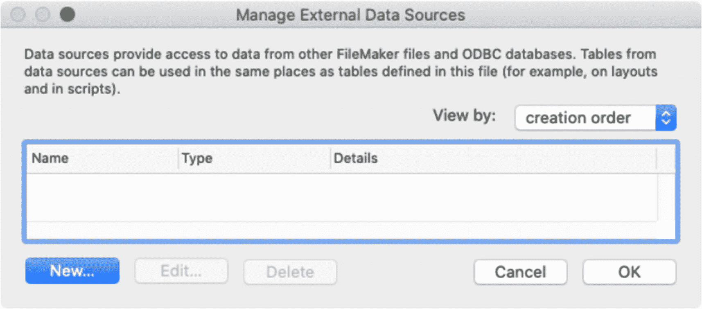

**图 9-14** 用于管理外部数据源的对话框

### 探索编辑数据源对话框

创建或编辑数据源在*编辑数据源*对话框中执行，如图 9-15 所示。此对话框从*管理外部数据源*对话框中通过点击*新建*、选择一个数据源并点击*编辑*，或直接双击列表中的数据源来打开。

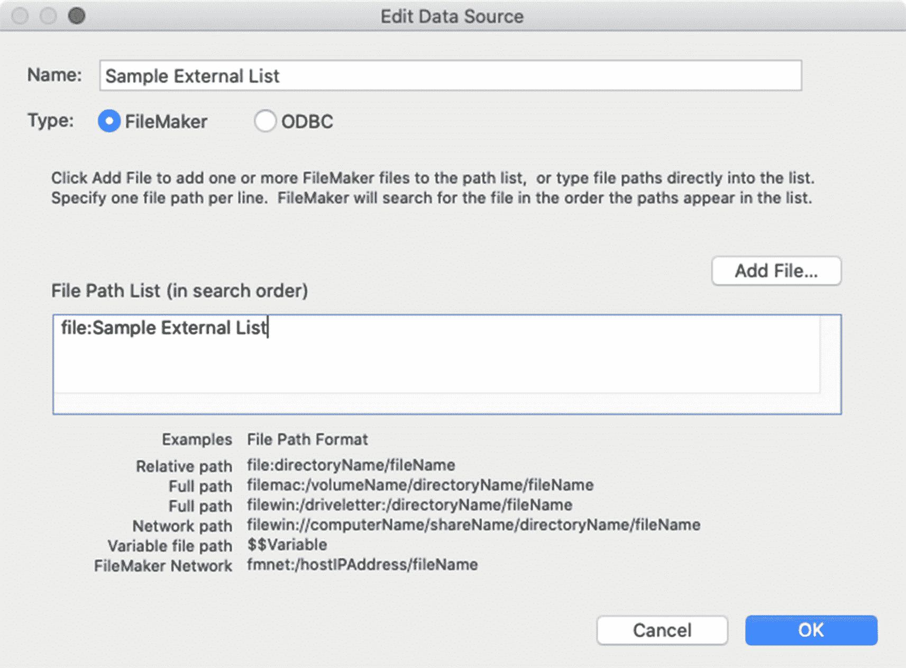

**图 9-15** 用于编辑所选数据源的对话框

*名称*用于在整个开发界面的菜单中标识该源。*类型*选项根据目标数据源提供两种选择，并根据所选内容更改界面。本节剩余部分假定选择了*FileMaker*。*文件路径列表*用于指定指向目标数据源的一个或多个路径（第 24 章，“指定文件路径”）。FileMaker 将连接到指向现有数据库文件的第一个路径。点击*添加文件*为所选文件自动添加路径，或手动输入一个。有关配置*ODBC*类型数据源的详细信息，请参阅第 7 章，“从 ODBC 数据源添加表。”

## 介绍管理数据库对话框（关系）

与表和字段类似，表出现和关系在*管理数据库*对话框中创建。选择`文件 ➤ 管理 ➤ 数据库`打开对话框，并确保选中*关系*选项卡，如图 9-16 所示。可滚动的白色区域是*关系图*，其中添加表出现并相互连接以定义关系。每个表应该已经存在于图中，但没有连接它们的关系。下方的按钮行用于在图区域内执行各种任务。

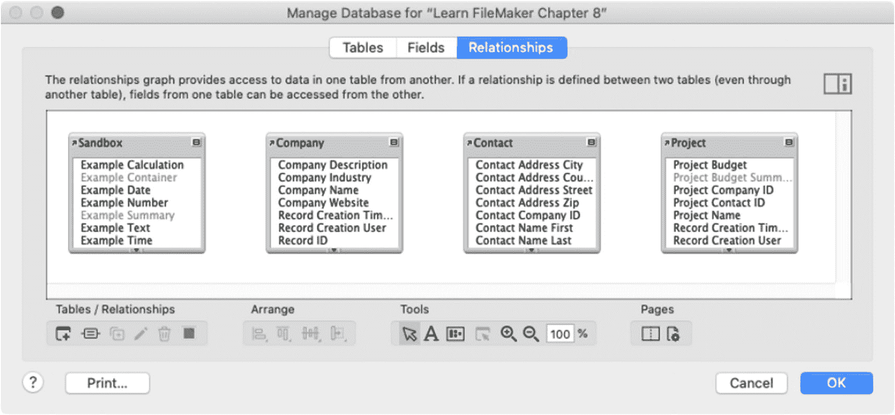

**图 9-16** 用于管理关系的对话框

## 处理表出现

*表出现*是关系图中显示的数据库表实例的图形表示。在定义表出现之间的关系之前，让我们回顾一下*选择*、*交互*、*排列*、*查看*、*格式化*、*编辑*、*添加*和*删除*表出现的基础知识。

### 选择表事件

选中的表事件将以蓝色阴影边框高亮显示，其大小、位置和格式均可修改。在启用*对象选择光标*后，可通过多种不同方法选择表事件，如图 9-17 所示。要选择单个表事件，请在关系图中直接单击它。要选择多个不连续的表事件，请按住`Shift`键，然后单击每个目标表事件。在按住该键的同时，再次单击先前选中的表事件将取消选择。要选择聚集在同一组中的多个表事件，请单击背景，然后按住并拖动，直到选择矩形框住目标表事件。选择框触及的每个表事件都将被选中。按住`Command`（macOS）或`Windows`（Windows）键拖动，则仅选择*完全*位于选择框边界内的表事件。

图 9-17

用于选择并操作表事件的光标工具

当处理大量表事件时，在*选择表*工具下打开的菜单（如图 9-18 所示）提供两个选项，帮助定位特定实例。*选择 1 层相关表*选项会自动选择与所选表事件*直接相关*的每个表事件。*选择具有相同源表的表*功能会选择与所选表事件共享*相同源表*的每个表事件，这在复杂关系图中查找某个表的其他实例时很有帮助。

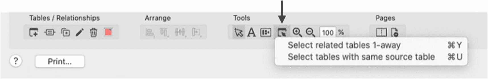

图 9-18

用于选择相似表的工具

### 与表事件交互

选中光标工具后，可以移动、折叠、展开、调整大小以及在图 9-19 中高亮显示的点上滚动表事件框。

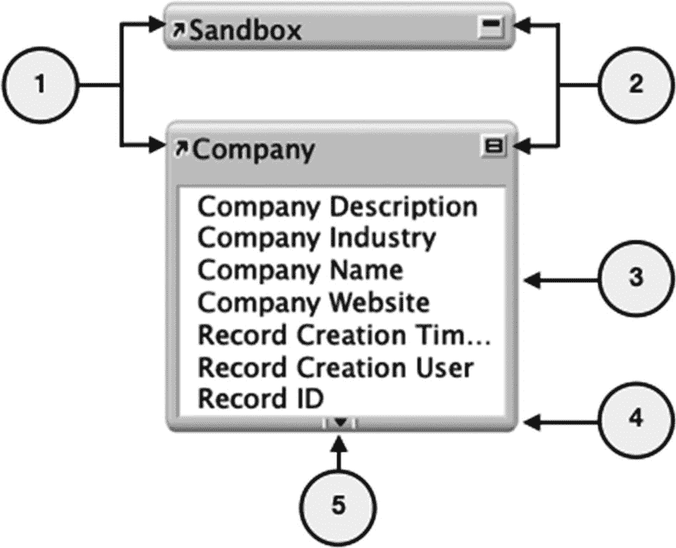

图 9-19

折叠（顶部）和展开（底部）时的表事件操作点

1.  单击并按住表事件的*标题*可以拖动该框，并在关系图中重新定位。将光标悬停在箭头图标上可显示信息丰富的元数据弹出窗口。

2.  标题右侧是一个展开切换按钮图标。单击一次可在三种状态之间切换表事件的状态。没有任何关联关系时，单击一次折叠该框，再次单击则展开。存在关联关系时，中间状态会半折叠，仅显示用于与其他表事件形成关系的匹配字段（未显示）。

3.  拖动侧边和底部的细条可分别调整宽度或高度。

4.  拖动底角可根据方向调整宽度和/或高度。

5.  完全展开后，出现在顶部、底部或两端的箭头图标用于向上或向下滚动字段列表。单击一次将逐字段向上或向下移动；按住则会持续滚动列表，直到松开为止。

在*Learn FileMaker*文件中练习，将所有表事件折叠并按顺序上下排列，使其大致排成垂直堆叠状，如图 9-20 所示。

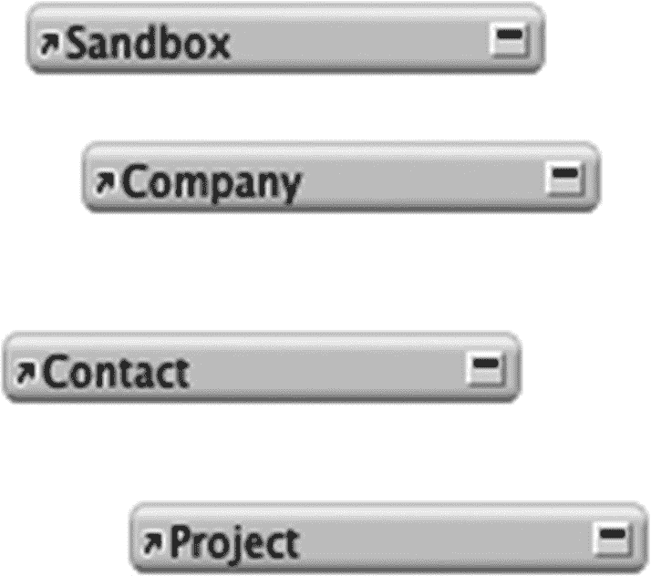

图 9-20

四个表事件折叠后排列成堆叠状

### 排列和调整表事件大小

*排列*工具用于根据这四个图标下隐藏菜单中的选项（如图 9-21 所示）来对齐和调整所选表事件组的大小：

1.  按*左边缘*、*中心*或*右边缘*水平对齐。

2.  按*顶部边缘*、*中间*或*底部边缘*垂直对齐。

3.  *水平*或*垂直*均匀分布。

4.  将*宽度*、*高度*或两者调整为*最小*或*最大*。

图 9-21

排列工具包含用于排列和调整表事件大小的菜单

### 查看选项

*工具*部分包含四个控件，用于调整关系图的缩放倍率，如图 9-22 所示：

1.  *调整缩放倍率* – 调整缩放倍率，使所有表事件均适合视图，无需滚动。

2.  *放大* – 单击激活，然后在关系图中单击可将缩放倍率增加 25%。

3.  *缩小* – 单击激活，然后在关系图中单击可将缩放倍率减少 25%。

4.  *百分比* – 手动设置缩放百分比，范围为 1 到 400。

图 9-22

用于调整关系图缩放倍率的工具

### 格式化表事件

表事件唯一的*格式化*工具是颜色菜单，可通过单击*表/关系*部分中*删除图标*右侧的颜色工具访问。颜色编码可通过多种方式用于对表事件进行视觉分组。可将一种颜色应用于所有主表事件，将另一种颜色应用于辅助表事件，或为每个事件组应用一种颜色。颜色可以指示用于将辅助表事件连接到主表事件的操作符类型，或者颜色可以表示表事件的功能，例如，一种颜色用于用作子门户的表事件，另一种颜色用于父表等。颜色还可用于指示每个表事件的开发状态，例如，高亮显示正在处理或已弃用的表事件。无论选择哪种具体方案，为表事件着色都有助于在视觉上导航复杂的关系图。

### 编辑表事件

表事件使用*指定表*对话框进行编辑。双击某个表事件，或选择一个表事件并单击*编辑选择*按钮图标（如图 9-23 所示），即可打开此对话框。

图 9-23

用于编辑现有表事件的工具

#### 介绍指定表对话框

在*指定表*对话框中（如图 9-24 所示），可以修改表事件的*数据源*、*表*和名称。选择不同的表时，名称将始终更新为该表的名称，除非在打开对话框后编辑过名称。

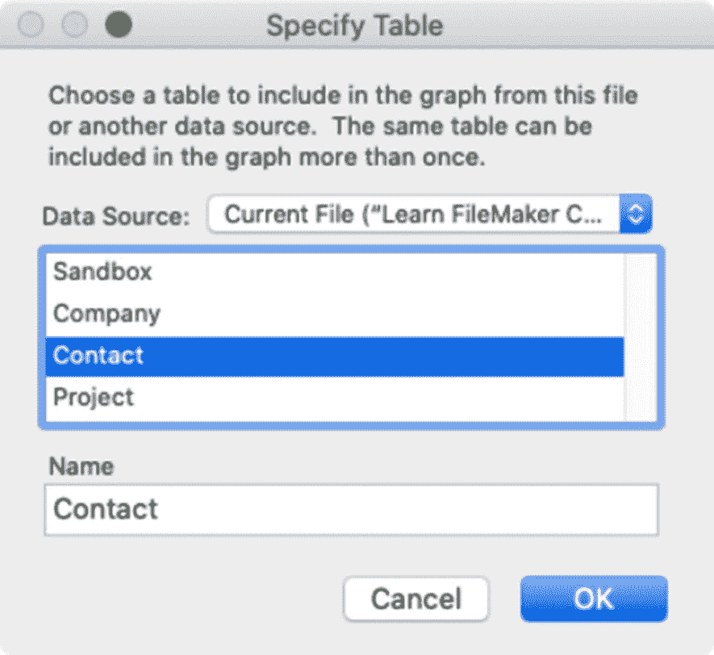

图 9-24

用于指定分配给表事件的表的对话框

### 添加表事件

可以为当前文件中定义的任何数据源中的任何表向关系图添加表事件。可以通过*创建新表事件*或*复制现有表事件*来实现。

### 创建新表事件

要创建新的表事件，首先点击“添加表”按钮图标，如图 9-25 所示。这将打开之前介绍的“指定表”对话框。如果所需添加的表位于其他文件中，可选择相应的数据源。创建事件后，可以根据需要调整其大小和位置。

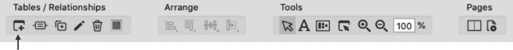

图 9-25

用于添加新表事件的工具

### 复制现有事件

要复制选中的事件，请点击“复制表”按钮图标，如图 9-26 所示。复制现有事件而非新建事件有很多好处。如果目标表已存在对应事件，复制它可省去手动分配表的步骤。复制件还会保留原件的尺寸和格式，从而节省修改新事件默认样式所需的时间。复制一组相关联的事件将保留它们之间的所有关系连接。

图 9-26

用于复制现有事件的工具

### 删除事件

可以通过选中表事件后按 `Delete` 键，或点击如图 9-27 所示的“删除”工具来删除表事件。请注意，这只会删除表的*事件*，而*不会*删除实际的*表*。不过，任何将该事件作为上下文使用的资源都会受到删除操作的影响。因此，在删除已分配或引用了该事件的布局和脚本后，可能需要对其进行更新。

图 9-27

用于删除现有事件的工具

### 打印关系图

如图 9-28 所示的“页面”工具提供了对*分页符*和*页面设置*的控制，用于准备打印关系图。

图 9-28

用于准备打印关系图的工具

## 构建关系

当图中有事件存在后，可以将它们连接起来以定义关系。

### 添加关系

当两个事件之间建立连接时，即形成关系。可以通过拖拽两个事件之间的连接，或使用“添加关系”按钮来实现。

#### 在事件之间拖拽连接

在两个事件之间创建连接最直观的方法是使用光标，从一个事件的字段拖拽到另一个事件的字段，从而基于这两个匹配字段建立关系。首先，在图中找到要连接的两个事件，点击它们右上角的图标，直至完全展开。滚动列表，使关系的目标匹配字段位于每个列表的可见区域内。按住一个事件中的匹配字段并拖动。当开始向另一个事件拖动光标时，会有一条线连接到第一个匹配字段，如图 9-29 所示。一旦光标悬停在另一个事件的目标匹配字段上，松开鼠标，连接线便建立完毕。

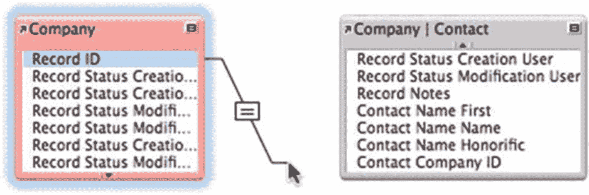

图 9-29

在事件之间拖拽新的关系连接

提示

通过快速拖拽*任意*两个当前可见字段之间的连接，可以节省时间。随后再编辑关系（稍后介绍），并在对话框更大、更易滚动的列表中选择所需字段。

#### 使用添加关系按钮

创建新关系的另一种方法是点击工具栏中的“添加关系”按钮，如图 9-30 所示。点击此按钮将打开一个空的“编辑关系”对话框（本章稍后讨论），其中两个表均设置为 `<unknown>`。由于连接为空，必须手动选择事件和匹配字段。

图 9-30

用于创建空关系的工具

### 操作关系

*关系*在图中由一条连接两个事件的线表示，中间有一个选择框，如图 9-31 所示。该框会显示用于匹配两个字段的运算符，默认是等号。

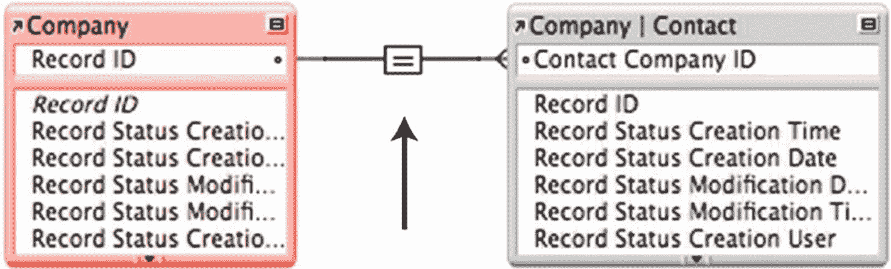

图 9-31

带有中间选择框的关系线

在线与事件相连的两端，会显示关系类型的指示符，如图 9-32 的放大图所示。直线（如左侧所示）表示*一*端，右侧的“乌鸦脚”表示*多*端。因此，在此示例中，从*公司*到*联系人*存在一个*一对多关系*连接。FileMaker 仅通过查看字段的自动输入设置来确定此信息。由于*公司*表中的 `Record ID` 字段被配置为为每条记录自动输入唯一的序列 ID，因此它显示为一端。而另一端的字段没有限制，因此假定为多端。

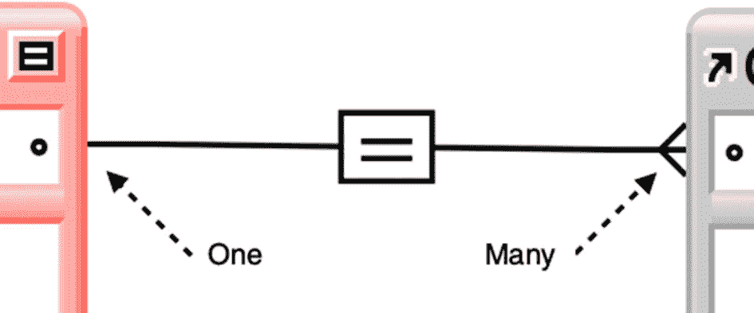

图 9-32

线端符号表示每侧连接的类型

警告

线端指示符仅反映字段定义的限制，不反映布局或脚本函数中的输入选项。

移动事件时，无论一个框相对于另一个框的位置如何，关系线都会保持两侧连接。当移动一个框足够远时，线会分成三段直线转折段，如图 9-33 所示。当框被移动到足够远时，线会自动跳到事件框的另一侧以保持连接。

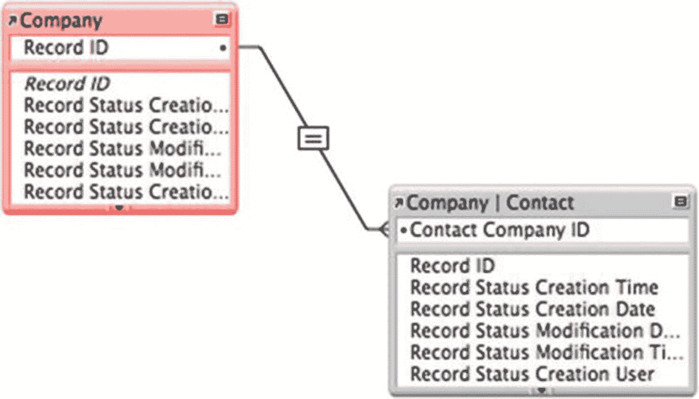

图 9-33

移动事件时，线会分成直线段

