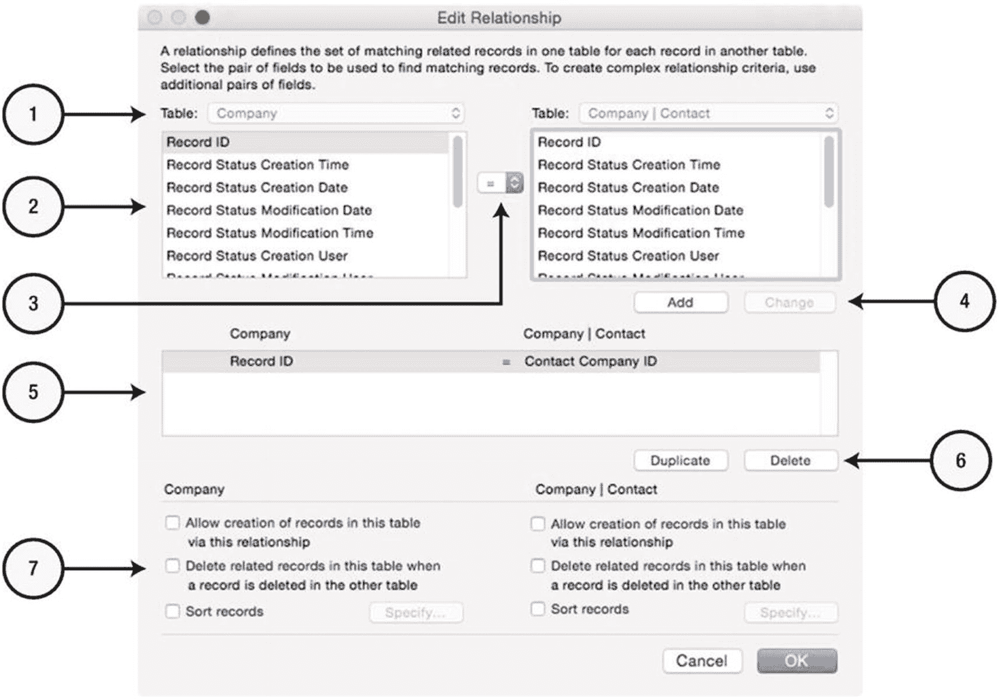
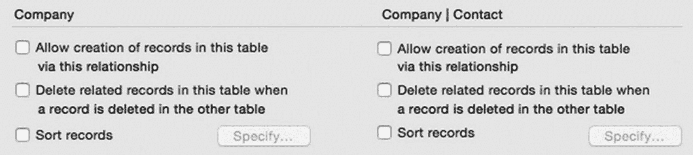
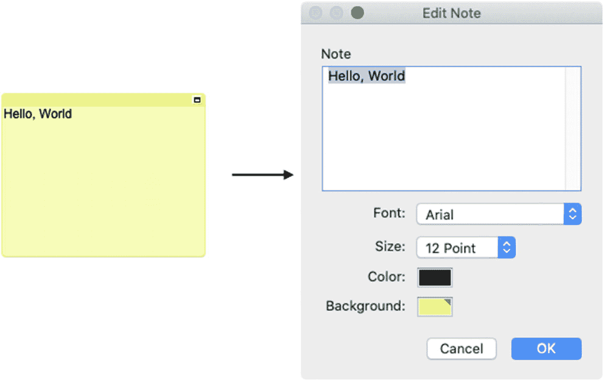
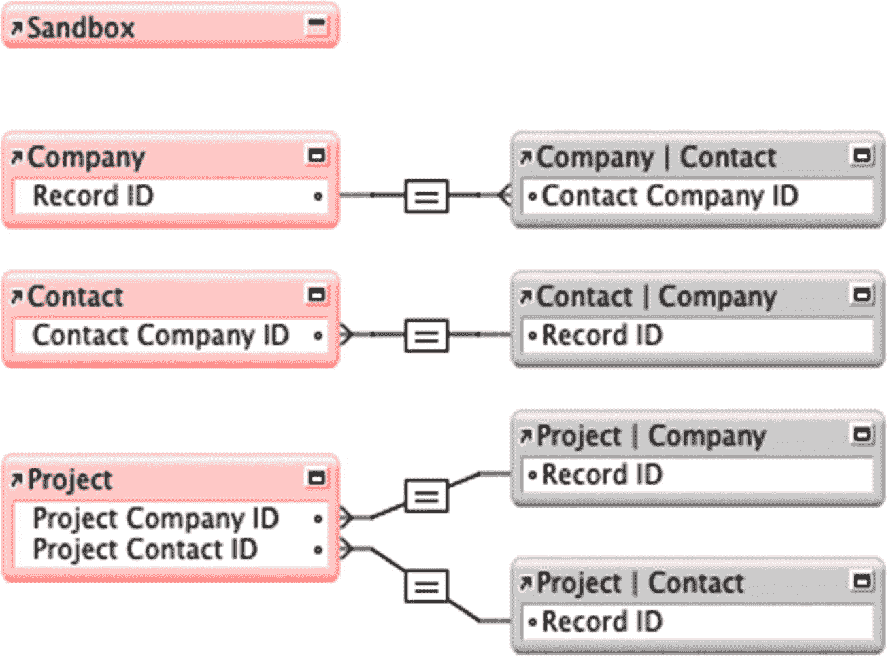

# 编辑关系对话框简介

关系在**编辑关系**对话框中进行编辑，如图 9-34 所示。可以通过双击关系连接框或选中关系后点击**编辑选择**工具来打开此对话框。

*图 9-34*  
用于编辑关系设置的对话框

对话框中的控件包括：

1. **表事件** – 创建新关系时，为关系的每一方选择一个事件。如果编辑现有关系，这些选项不可编辑，只能在关系图中直接对事件框进行编辑。
2. **选中的匹配字段** – 选择一对匹配字段，以添加至下方列表或进行更改。
3. **比较运算符** – 选择用于控制匹配字段比较方式的运算符。
4. **选中的匹配字段按钮** – 点击**添加**，将所选字段作为新条件加入下方列表；或点击**更改**，更新所选组合中的字段。
5. **链接字段** – 列出定义关系的条件。
6. **链接字段按钮** – 点击**复制**或**删除**所选链接字段。
7. **关系选项** – 为关系的每一方指定特定的行为。

## 选择比较运算符

*比较运算符*用于指定如何比较匹配字段的值以检测关系匹配。可用的运算符见表 9-1。

**表 9-1** – 可用于关系的比较运算符列表

| 运算符 | 描述 |
| --- | --- |
| `=` | 当两个字段中的值相等时匹配。 |
| `≠` | 当两个字段中的值不相等时匹配。 |
| `<` | 当左侧字段中的值小于右侧字段中的值时匹配。 |
| `≤` | 当左侧字段中的值小于或等于右侧字段中的值时匹配。 |
| `>` | 当左侧字段中的值大于右侧字段中的值时匹配。 |
| `≥` | 当左侧字段中的值大于或等于右侧字段中的值时匹配。 |
| `X` | 匹配关系左侧的*每条*记录将匹配右侧的所有记录，无论所选字段中的实际值如何。这通常被称为*笛卡尔积*、*笛卡尔连接*或*交叉连接*，其中两个表之间的连接不受任何条件限制，每条记录都会成为匹配项。 |

## 关系选项

**编辑关系**对话框底部的设置（如图 9-35 所示）控制着关系两侧行为的三个功能。

*图 9-35*  
每个事件的关系选项

### 允许创建相关记录

**允许创建记录**选项使用户能够通过在布局中从另一事件放置的相关字段中输入内容，从而在一个事件中创建记录。此功能常用于门户，以便于轻松创建新记录（第 20 章，“在门户中直接创建记录”）。

### 自动删除相关记录

**删除相关记录**选项会导致当另一侧的关联记录被用户或脚本删除时，自动删除本表中的记录。这在删除“父”记录时删除其“子”记录尤其有用。例如，当删除一个**公司**记录时，如果启用了该功能，则所有相关的**联系人**记录也会被删除。仅在缺少父记录会导致产生有问题的“幽灵记录”（即没有父记录就无法访问或使用的孤立记录）时使用此功能。如需保留相关记录并允许它们稍后关联到新的父记录，请保持此选项禁用。

### 对相关记录排序

**排序记录**选项可在*关系层面*启用特定的记录排序。虽然门户可以配置为对记录进行排序以用于显示（第 20 章，“探索门户设置对话框”），但此功能在关系根源上对记录进行排序，这样当计算或脚本通过关系直接访问相关记录时，记录已被排序。当使用`List()`函数（第 13 章）且顺序很重要时，这一点至关重要。

## 向关系图添加注释

*关系注释*是一个可自由放置的彩色框，可添加至关系图中以容纳开发者注释。通过选择**文本**工具（如图 9-36 所示），然后在关系图中单击并拖动即可创建注释。**编辑注释**对话框（如图 9-37 所示）允许输入和编辑注释文本，以及指定注释的字体、字号、文本颜色和背景颜色。创建新注释或双击现有注释时会自动打开该对话框。保存后，注释可以像表事件一样移动、调整大小、最小化、对齐或删除。

*图 9-36*  
用于创建新注释的工具

**提示**

无需选择文本工具，按住`Option`（macOS）或`Alt`（Windows）键，在背景上单击并拖动即可创建注释。

*图 9-37*  
一个注释（左）及用于编辑它的对话框（右）

## 实现一个简单的关系模型

现在，可以在**Learn FileMaker**数据库中实现先前描述的简单关系模型。将四个主表事件垂直堆叠对齐。首先创建两个**联系人**事件的副本，分别命名为`公司 | 联系人`和`项目 | 联系人`。然后创建两个**公司**事件的副本，分别命名为`联系人 | 公司`和`项目 | 公司`。接着排列它们，并在它们之间建立如图 9-38 所示的关系：

- **链接公司到公司 | 联系人** – 可用于显示与某公司关联的所有联系人的门户。
- **链接联系人到联系人 | 公司** – 可用于在联系人记录上显示公司名称，并提供从后者到前者的可导航链接。
- **链接项目到项目 | 联系人** – 这将把一个项目链接到联系人记录，作为主要联系人。
- **链接项目到项目 | 公司** – 这将把一个项目链接到公司记录，允许在项目记录上显示公司名称，并提供它们之间的可导航链接。

*图 9-38*  
Learn FileMaker 测试文件的关系模型

## 总结

本章介绍了数据源、表事件和关系。在下一章中，我们将探讨管理容器字段和存储选项。

