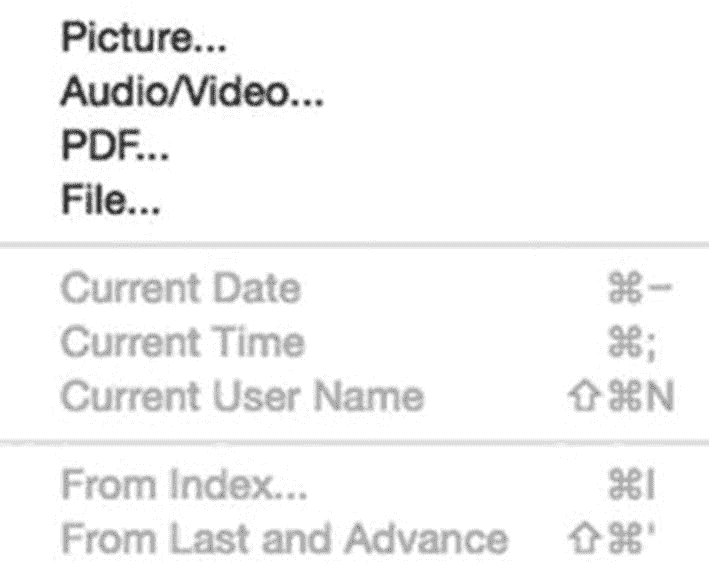
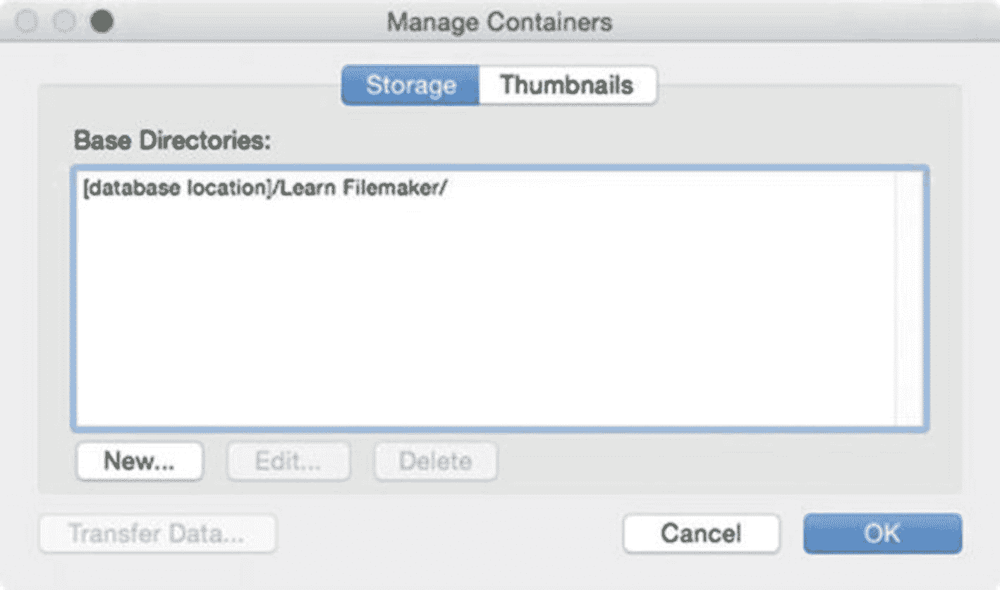
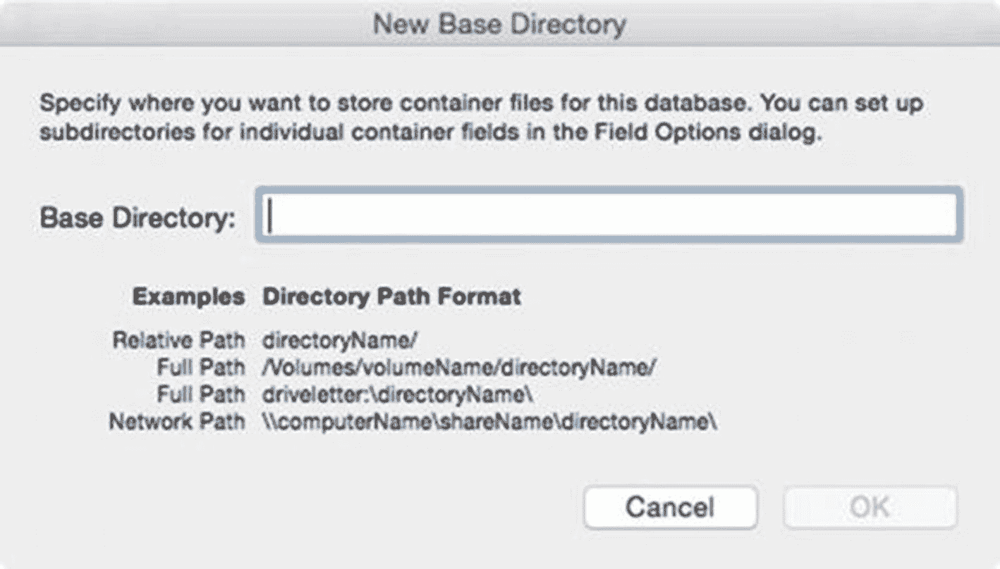
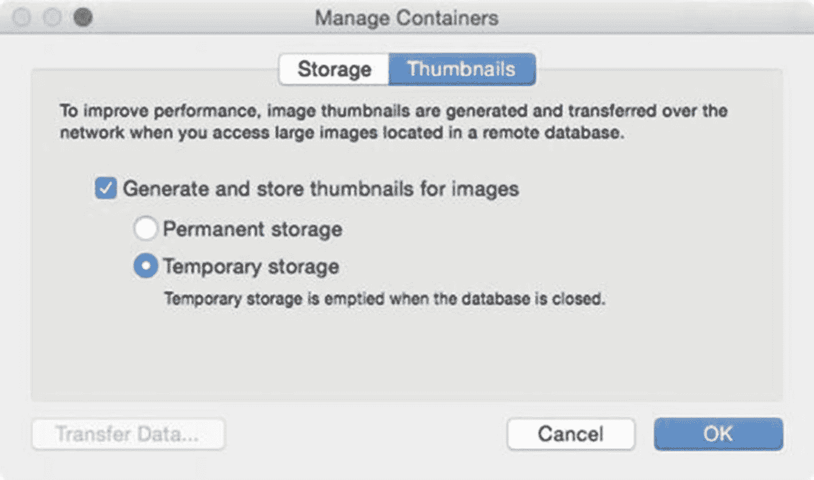
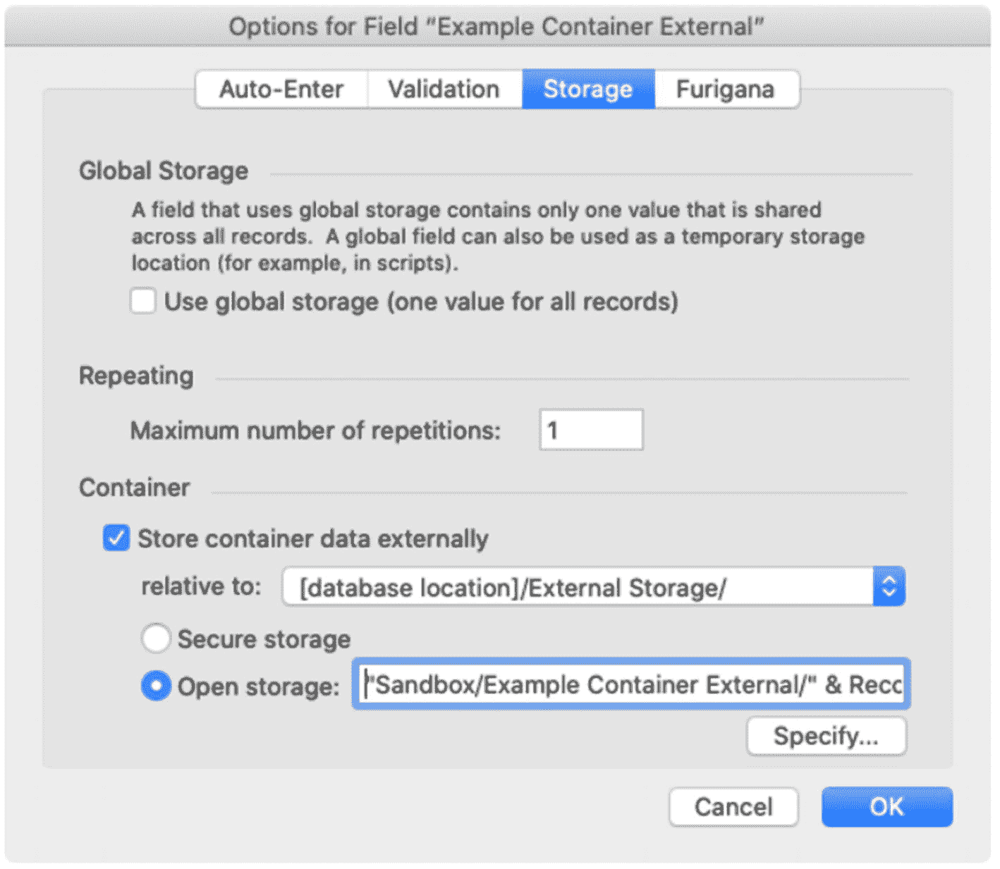
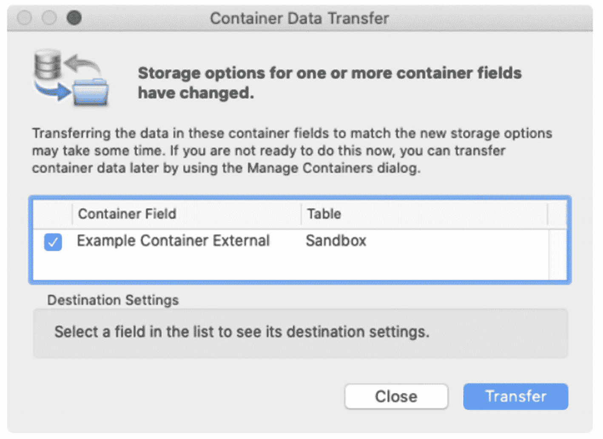

# 10. 管理容器字段

*容器字段*是一种能够存储和显示文档文件的字段类型。正式地说，容器中的内容被称为*二进制大对象*或*基本大对象*，两者常缩写为“BLOB”，它是一组二进制数据的集合，代表图像、音频或任何文件类型（文件夹除外），在数据库中作为单条数据条目存储。在 FileMaker 中，容器字段具有多种选项，这些选项会影响文件插入字段的方式、文件的实际存储位置（内部或外部），以及字段在布局上放置时的显示方式。本章概述了定义容器字段的选项，涵盖以下主题：

- 将文件插入容器
- 从容器中提取文件
- 解释容器存储选项
- 使用托管外部存储

## 将文件插入容器

当容器字段在布局上对用户可见且可访问时，可以通过*插入*菜单中的功能、*拖放*或*复制粘贴*来插入文档文件。根据容器字段的字段定义和布局设置，每种方法都有不同的选项和限制，这些可能会影响文档的插入方式以及数据库文件的大小。

**提示：** 要跟随这些示例进行操作，请打开 `Learn FileMaker` 数据库的 `Sandbox Form` 布局。

### 使用插入菜单

*插入菜单*包含四个选项，用于将文件插入到当前聚焦的容器字段中，如图 10-1 所示。这些选项也可在字段的上下文菜单中以及作为脚本步骤使用。选择任何选项都会打开一个*选择文件*对话框，该对话框会自动根据菜单项对应的文件类型进行优化。



**图 10-1** 将文件插入容器字段的选项

- *图片* – 插入并显示图片内容。
- *音频/视频* – 插入音频或视频文件。仅当字段的布局设置允许*交互内容*时启用，这允许文件直接在字段内播放，而无需在其他应用程序中打开。
- *PDF* – 插入 PDF 文件。仅当字段的布局设置允许*交互内容*时启用，这允许直接在字段内查看文件页面，而无需在其他应用程序中打开。
- *文件* – 将任何类型的文件插入字段。文件将显示为目录文件夹中的样子，由图标表示，并且无法查看或与其内容交互。

**注意：** 有关布局设置的更多信息，请参见第 19 章“容器的数据格式选项”。

### 拖放

使用*拖放*将文件从目录插入到当前布局上的容器字段中，是最直观的方法。拖放文件时，FileMaker 会根据拖放文件的类型和字段的配置自动使用适当的存储方法。例如，如果拖放的是图像，它会像选择了*插入图片*菜单一样被插入并显示。如果将 PDF 或音频文件拖放到未配置为*交互内容*的字段中，该文件将放置到字段中，并显示为 PDF 第一页的预览或文件图标。但是，如果字段配置为交互式，那么文件将像选择了对应文件类型的菜单一样被插入，并完全可交互。拖放时，用户无法手动指定外部存储（本章后续讨论）。相反，字段定义的存储方法将自动应用。

### 复制粘贴

使用*复制粘贴*将文件插入容器是另一种便捷选项。剪贴板可以包含从文件夹中复制的*实际文件*、从照片编辑软件中打开的图片文件复制的*图像内容*，或格式正确的文件*文本引用*。粘贴的结果与拖放相同，并且无法手动指定外部存储（除非粘贴的是文本引用）。

## 从容器中提取文件

当布局上的容器字段可编辑时，用户可以使用`导出字段内容`功能将记录中的内容副本保存到其选择的目录文件夹中。此功能可在*编辑*菜单、字段的上下文菜单中找到，并可作为脚本步骤使用。选择后，将打开一个同名对话框，允许用户选择导出文档的文件夹。文件名默认为容器中文档的名称，但可以在此对话框中重命名。该对话框包含自动打开文件以及创建附件为提取文件的电子邮件的选项。

**提示：** 此功能还可用于将字段中的选定文本保存到文本文件中。

## 解释容器存储选项

容器字段可以配置为以下两种方式之一来存储文件：将*实际文件*存储在数据库文件内部，或存储指向*数据库文件外部*文件的*引用*。

### 在内部存储文件

定义新容器字段时，默认情况下会内部存储内容。这意味着文件的全部内容会被复制*到数据库文件内部*。这有其优点和缺点。

一个巨大的优势是，内部存储保持了数据库的可移植性，因为所有元素都存储在单个文档文件中。当以类似于字处理或电子表格文档的方式在本地访问数据库时，这一点可能很重要。虽然对于在服务器上托管的共享数据库（第 29 章）来说，可移植性不是问题，但内部存储确保存储在容器字段中的文件普遍可访问，无论任何给定用户是否无法访问未挂载文件服务器或无法访问的同事计算机上的外部文件。由于文件实际上被复制到了数据库结构中，如果用户能够访问数据库结构，就能访问容器内容。

内部存储的缺点是，每个插入到字段的文件都会增加数据库文件的大小。这本身并不是问题，因为 FileMaker 数据库*可以*高达 8 TB。然而，随着文件大小的增长，性能可能会下降，尤其是当许多用户通过网络共享访问数据库时。

通常，如果存储在容器字段中的文件数量或大小过大，一个好的策略是将文件引用插入字段，并将实际文件存储在外部。如果操作得当，用户在交互时不会注意到与内容交互方式上的差异。


### 存储对外部文件的引用

*容器字段文件引用*是一个文本字符串，用于存储外部文件的位置、类型以及其他因类型而异的信息。例如，*容器图像引用*包含原始图像的尺寸、相对于数据库的文件路径以及图像的绝对路径。以下示例展示了对用户桌面上一个图像文件的引用：

```
size:731,960
image:../../../../../../../../../Desktop/Flower Picture.jpg
imagemac:/Macintosh HD/Users/john_smith/Desktop/Flower Picture.jpg
```

在容器字段中存储引用可以保持数据库的简洁高效。虽然插入过程仅在字段中存储了一个引用，但根据字段的设置，该外部文件仍会像存储在内部一样在界面中渲染。从用户的角度来看，当字段在布局上显示其内容时，没有任何区别。

使用外部文件有两种方法：*自定义管理*和*数据库管理*。

## 使用托管式外部存储

要使用*数据库管理*的*外部存储*，您必须定义基础目录并配置容器字段以使用它们。

### 定义基础目录

*基础目录*是开发者定义的一个文件夹目录路径，它作为根位置，一个或多个容器字段可以在此存储文档。`FileMaker` 会完全管理所定义的文件夹，它会自动创建该文件夹，然后根据为基础目录和各个字段定义的设置，管理子文件夹和文件的内部目录结构。每个数据库文件都包含一个默认目录，自动以数据库名称命名，并带有 `[database location]` 的公式前缀，这意味着外部容器目录将存储在与数据库文件相同的文件夹中。

**注意**  
如果数据库文件被重命名，默认基础目录不会改变，但可以为了保持一致性而手动更新。

#### 探索“管理容器”对话框

外部容器是在“管理容器”对话框中定义的，该对话框可以通过选择 `File ➤ Manage ➤ Containers` 菜单打开。此对话框有两个选项卡：`Storage` 和 `Thumbnails`。

##### 探索“存储”选项卡

“管理容器”对话框的 `Storage` 选项卡（如图 10-3 所示）包含一个已定义基础目录的列表。在这里您可以*创建*、*编辑*和*删除*基础目录。您可以使用 `Transfer Data` 按钮启动文档传输，当字段分配的基础目录发生更改并且在旧位置检测到文档时，该按钮会高亮显示（参见本章后面的“更改字段容器设置”）。

  
*图 10-3*  
用于托管容器的基础目录列表

**警告**  
当数据库托管在 `FileMaker Server` 上时，基础目录无法编辑。请将文件脱机，并使用 `FileMaker Pro` 桌面应用程序打开以进行编辑。

###### 创建新基础目录

给定数据库文件中基础目录的数量完全由开发者决定。默认目录可以被文件中所有表中的所有容器字段共享。或者，每个表甚至每个字段都可以分配一个单独的目录。要创建新的基础目录，请单击 `New` 按钮。这将打开一个 `New Base Directory` 对话框（如图 10-4 所示）。此窗口包含一个文本区域，您可以在其中键入目录路径，或者拖入一个文件夹以自动插入其路径。路径的格式必须如示例所示。

  
*图 10-4*  
用于指定基础目录路径的对话框

###### 编辑基础目录

只要目录中尚未包含任何托管文件，就可以编辑目录路径。如果目录为空，请在“管理容器”对话框中双击或单击 `Edit` 按钮，以在 `Edit Base Directory` 对话框（与图 10-4 所示的 `New Base Directory` 对话框相同）中打开所选基础目录。如果目录已包含文件，请创建一个新的基础目录，将使用旧目录的所有字段指向新目录，传输现有的容器文档，然后删除旧目录。

###### 删除基础目录

当不再使用某个基础目录时，只要它不包含任何托管文件，就可以将其删除。在列表中选择它，然后单击 `Delete` 按钮。`FileMaker` 要求文件中至少定义一个基础目录，因此如果列表中只有一个目录，删除请求将被拒绝。

**注意**  
`FileMaker` 会从列表中删除基础目录的定义，而不会删除实际的外部文件夹。

##### 探索“缩略图”选项卡

“管理容器”对话框的 `Thumbnails` 选项卡（如图 10-5 所示）控制自动缩略图生成，这可以加快容器的界面渲染速度，尤其是在通过网络传输时。要激活缩略图，请选中 `Generate and store thumbnails for images` 复选框，以允许 `FileMaker` 在布局尝试显示图像时自动生成并显示缩略图。然后在两种存储选项中选择。*永久存储*选项将使缩略图缓存在磁盘和内存中，并在数据库关闭时保留磁盘上的缓存部分。使用此选项可获得最佳性能。*临时存储*选项将使缩略图仅缓存在内存中。当数据库关闭时，缓存会被丢弃。这样会稍微慢一些，但可以节省硬盘空间。

  
*图 10-5*  
用于指定缩略图生成的对话框


### 定义字段的外部存储目录

定义基础目录后，可将其分配给容器字段。容器字段的外部存储设置在“字段选项”对话框的*存储*选项卡中进行配置，如图 10-6 所示。打开“管理数据库”对话框，点击*字段*选项卡，然后双击一个容器字段，接着选择*存储*选项卡。



图 10-6  
容器字段存储选项

勾选*将容器数据存储于外部*复选框，并从弹出菜单中选择一个基础目录。选择目录后，再选择一种存储方法。*安全存储*选项会对文档进行加密，并自动将文件随机分布到基础目录内自动创建的子目录中。该选项自动避免在使用同一基础目录的任何字段中存储同名文件时发生冲突。*开放存储*选项则保留文档数据的原始文件格式，并使用开发者指定的子目录——这是避免为不同表和字段存储的类似名称项目发生冲突所必需的。如果对数据库中不同表的多个字段使用同一基础目录，可使用公式生成包含相应子文件夹的子目录，以避免记录间覆盖冲突。点击*指定*按钮输入类似以下示例的子目录公式，该示例为*表*、*字段*和*序列号*创建层级文件夹，以确保每个文件夹只包含一个容器项目：

```
"Sandbox/示例容器/" & Record ID & "/"
```

**注意：** `FileMaker Cloud Server` 要求所有容器都使用安全存储。

#### 更改字段容器设置

`FileMaker` 会自动识别对容器字段配置所做的更改。这些更改包括在非托管内部存储与托管外部存储之间切换、更改字段的基础目录或子目录，或在安全存储与开放存储之间切换。当保存修改后的字段定义时，*容器数据传输*对话框会列出会话期间所有被修改的容器字段，如图 10-7 所示。若要将外部文件立即传输至新的基础目录，请确保该字段的复选框已勾选，然后点击*传输*。如果改为点击*关闭*，则未执行的传输将被保留，稍后可通过“管理容器”对话框中的*传输数据*按钮执行。



图 10-7  
指示需要传输容器字段内容的对话框

## 总结

本章探讨了如何向容器字段插入和提取文件，以及管理容器的各种方法。下一章，我们将探讨如何定义值列表。

