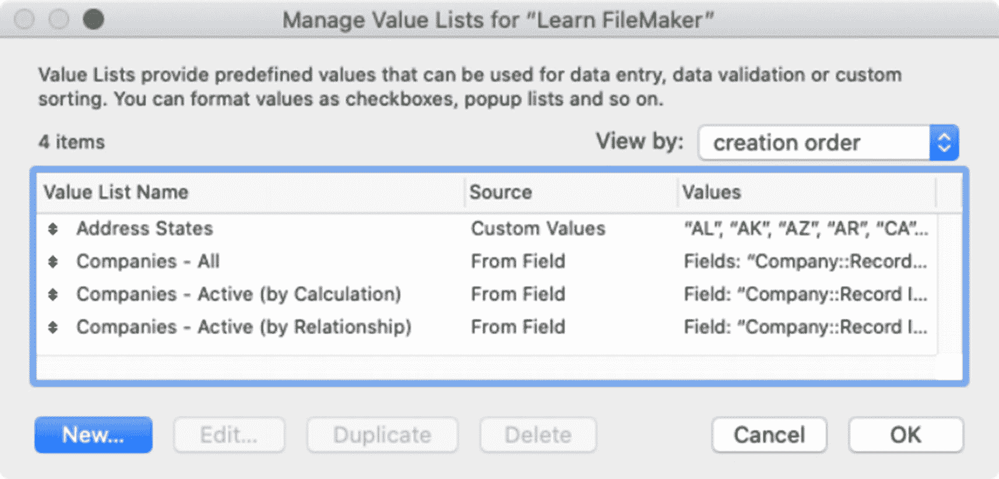
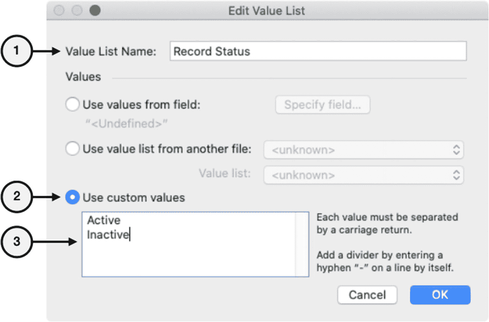

# 11. 定义值列表

*值列表*是由回车符分隔的一系列值。列表可通过公式创建（第 13 章，“聚合数据”），也可通过将其定义为集中式资源来创建。预定义列表可以是一组静态值，也可以是动态编译自字段内容（从表中直接或通过关系获取）的值。定义后，这些列表可分配给字段，以实现基于选择的数据录入，例如*下拉列表*、*弹出菜单*、*复选框*和*单选按钮*（第 20 章，“配置字段的控制样式”）。使用值列表作为字段的控制样式，可提高数据录入速度并确保准确性和一致性。本章涵盖以下关于定义值列表的主题，包括：

*   介绍值列表对话框
*   使用自定义值
*   使用来自其他文件的值列表
*   使用来自字段的值

## 介绍值列表对话框

预定义列表通过“管理值列表”对话框进行配置，如图 11-1 所示。该对话框可通过选择菜单 *文件 ➤ 管理 ➤ 值列表*、点击检查器窗格中已分配基于列表的控制样式字段旁的铅笔图标（第 19 章和第 20 章），或通过执行*打开管理值列表*脚本步骤来打开。此对话框用于*创建*、*编辑*、*复制*和*删除*列表。

图 11-1  
用于管理值列表的对话框

**提示：** 值列表可以在两个文件之间复制和粘贴。

列表设置在*编辑值列表*对话框中定义。在图 11-1 所示对话框中创建新列表或编辑现有列表时，会打开此对话框。为列表输入名称后，有三种生成值的选项：

*   *使用来自字段的值* – 从字段值生成列表，在“指定字段”对话框中定义
*   *使用来自另一个文件的值列表* – 从另一个 `FileMaker` 数据库中选择一个值列表用于当前数据库
*   *使用自定义值* – 在下方字段中手动输入由回车符分隔的值列表

**注意：** 本节中的示例仅*定义*列表。请参阅第 20 章“配置字段的控制样式”，了解如何将列表分配给布局上的字段。

## 使用自定义值

使用手动输入的*自定义值*定义的值列表可用于快速输入一组静态值，例如：*类别*、*国家*、*分组*、*位置*、*状态*等。这定义了一个在数据库其他位置不存在的、直接键入编辑对话框的信息列表。例如，创建一个简单的示例状态列表，可将其分配给诸如*公司状态*之类的字段。在“管理值列表”对话框中，点击*新建*按钮打开“编辑值列表”对话框，然后执行图 11-2 所示的步骤：

图 11-2  
使用自定义值的值列表

1.  为值列表输入名称，例如“记录状态”。
2.  选择*使用自定义值*选项。
3.  在文本区域中输入值，例如“活跃”和“非活跃”。

