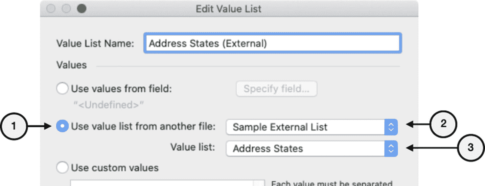

# 使用其他文件中的值列表

一个数据库中的值列表可以定义为订阅另一个数据库中定义的列表。这有助于通过在一个文件中定义列表并在其他文件中共享来消除多文件系统中的冗余。以下示例假设存在第二个名为“示例外部列表”的文件，其中包含一个名为“地址州名”的值列表。在 *学习 FileMaker* 数据库中，打开 *管理值列表* 对话框，然后单击 *新建* 按钮打开 *编辑值列表* 对话框。接着输入一个名称，并按照以下步骤配置列表，如图 11-3 所示：

图 11-3

一个使用外部数据库文件中列表的值列表

1.  选择 *使用其他文件中的值列表* 选项。
2.  如果另一个数据库已被定义为外部文件源，它将显示在第一个弹出菜单中。如果没有，可以通过从该菜单中选择 *添加 FileMaker 数据源*，然后定位并选择另一个数据库来定义。
3.  一旦选择了文件，接下来的 *值列表* 弹出菜单将被激活，允许从外部文件中定义的列表中进行选择。选择目标列表并关闭对话框。

