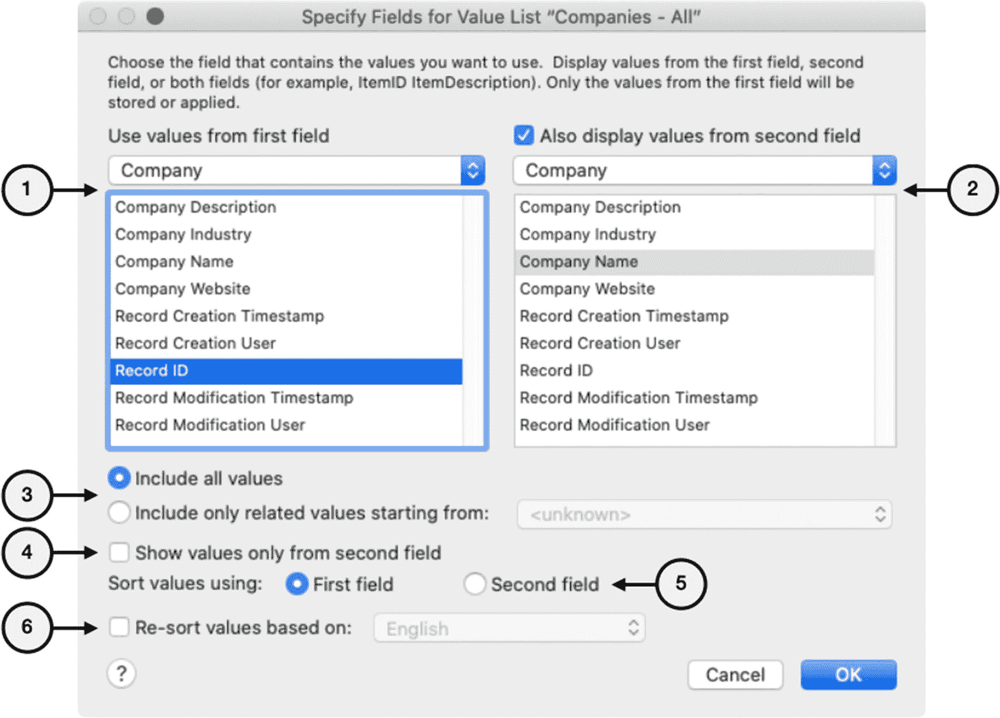
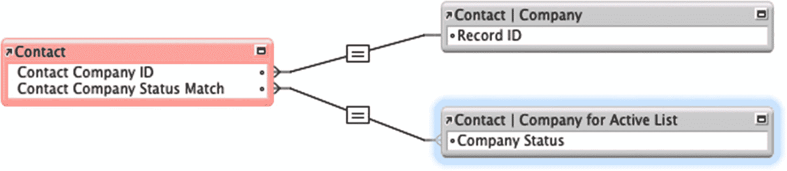
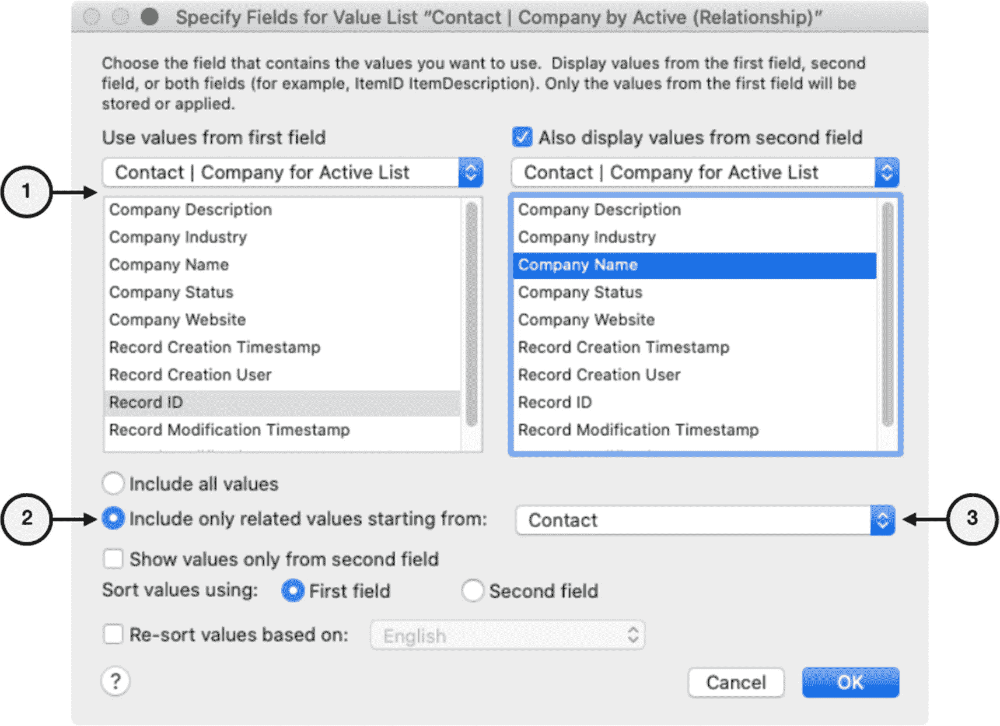
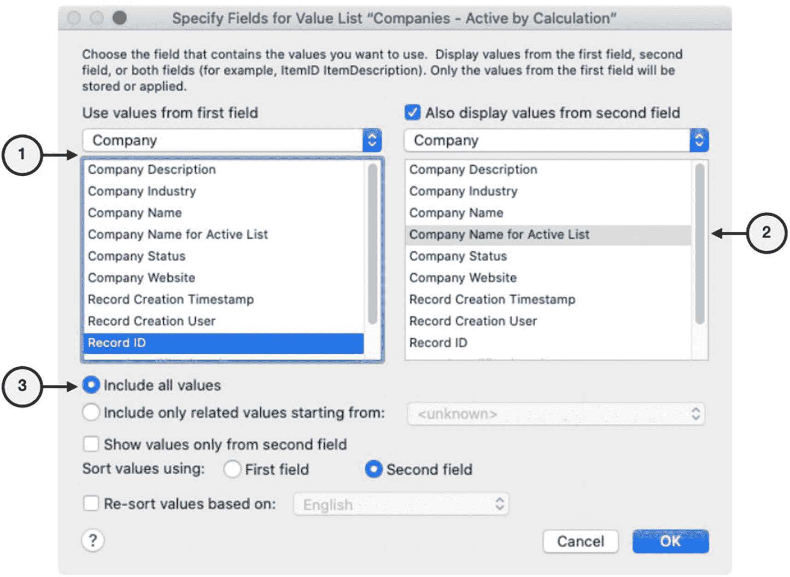

# 使用字段中的值

列表可以从目标字段中收集值，以动态生成一个随记录内容变化而变化的列表。通过使用字段数据作为源，授权用户、开发者或脚本可以轻松编辑值列表内容，并随时间动态调整其值。这在创建列表以帮助用户将一个表中的记录分配给另一个表中的记录时特别有用，例如，将一个 *公司* 记录指定为 *联系人*、*项目*、*发票* 等的父记录。用户无需记住或查找公司的主键并手动输入或复制粘贴，而是通过弹出菜单或下拉列表控件样式，用户可以根据名称选择公司，系统会自动填入主键。默认情况下，使用字段值的列表是 *上下文无关的*，这意味着它们将包含该字段表中 *每条记录* 的值，并且可以在 *任何* *上下文中* 使用。然而，也可以通过声明一个 *起始上下文* 并通过关系拉取值来有条件地限制列表，从而将列表仅限于单个表的布局。

## 指定字段对话框简介

首先创建一个新的值列表，为其分配一个名称，然后选择 *使用字段中的值* 单选按钮。这将自动打开一个 *指定字段* 对话框，如图 11-4 所示。



图 11-4

用于指定由字段值生成的列表的对话框

要定义列表，请指定将用于生成值的字段，并使用对话框中的这些控件指示要包含哪些值以及它们的显示方式：

1.  *使用第一个字段的值* – 选择一个表出现和字段来指定列表中使用的 *第一个字段*。当做出选择时，该值将被插入到一个字段中。
2.  *也使用第二个字段的值* – 可选，从同一个表出现或与其关联的表出现中选择一个 *第二个字段*。该值在列表中 *显示* 以进行识别，但在做出选择时不插入。例如，如果第一个字段使用公司主键编号，第二个字段可以显示人类可读的公司名称。
3.  *选择要包含的值* – *包含所有值* 选项为表中 *所有记录* 生成一个来自所选字段的唯一值列表。*仅包含从……开始的关联值* 选项会为 *仅* 从所选表出现的上下文开始的关联记录生成一个值列表。这将创建一个 *上下文相关值列表*，它会根据用户正在查看的记录而改变。
4.  *仅显示第二个字段的值* – 限制为 *仅显示* 第二个字段的值，但在做出选择时仍会 *插入* 第一个值。
5.  *使用……排序值* – 选择在显示多个字段时用于对列表进行排序的两个字段之一。
6.  *根据……重新排序值* – 选择用于值排序的语言。当使用字典排序顺序与索引排序顺序不同的语言时，这很有用，例如，区分带有变音符号和不带变音符号的字符。

## 创建表中所有记录的列表

默认情况下，设置为 *使用字段中的值* 的值列表会从表中的 *每条记录* 中拉取值，因此可以在数据库的任何布局上使用，而无需考虑布局表的关联上下文（第 17 章“理解上下文访问”）。前面图 11-4 中显示的示例创建了一个值列表，该列表使用 *公司* 表中所有记录的 *记录 ID* 和 *公司名称* 字段。配置并保存后，此列表可以作为 *弹出菜单* 或 *下拉列表* 分配给任何表中的字段（第 20 章“配置字段控件样式”）。例如，在 *联系人* 表中，*联系人公司 ID* 字段用于存储将联系人记录连接到公司的外键。为了允许用户快速输入此信息，可以将该值列表作为弹出菜单分配给 *联系人表单* 布局上的该字段。

## 创建条件值列表

*条件值列表* 包含经过筛选的选项，这些选项仅代表可用记录值的一个子集。通过提供仅包含相关值的更小列表，用户可以更容易地找到他们需要的值。这可以通过多种方式使用。例如，当将 *公司* 指定为 *联系人* 的父记录时，条件列表可以仅限于仅包含活跃的公司记录。类似地，将 *产品* 分配给 *发票* 时，可以根据类别字段的值或接收发票的公司类型来将列表仅限于包含某些产品。当选择用于生成 *电子邮件* 记录的 *模板* 时，可以筛选列表，使其仅包含与正在生成的电子邮件类型相关的已批准类别记录。

创建条件值列表有两种方法：*使用专用关系* 和 *使用计算字段*。在接下来的示例中，我们将使用 *学习 FileMaker* 数据库中 *公司* 表的 *公司状态* 字段来创建一个条件值列表，该列表仅显示状态为“活跃”的公司记录。


#### 使用专用关系

*关系驱动的条件值列表*通过一个关系（第 9 章）来编译，从而创建一个仅包含匹配记录中值子集的列表。使用关系创建条件值列表需要选择一个*起始表出现*，它代表了从所选列表字段中提取值时将使用的界面上下文。通常，该起始表出现是分配给列表所在布局的表的表出现。然而，它也可以是任何与布局的表出现相关的表出现。从*起始表出现*到*列表表出现*的关系条件，决定了哪些匹配记录被包含在列表中，哪些被排除。

例如，在 *Learn FileMaker* 文件中构建一个值列表，该列表仅包含 *Company 状态* 字段值为“active”的 *Company* 记录。由于值列表需要关系才能工作，我们将声明一个*使用上下文*为 *Contact* 表，即该值列表可从任何分配给 *Contact* 表的布局中使用。首先，执行几个准备步骤。

首先，在 *Contact* 表中创建一个计算字段，命名为 `Contact Company Status Match`，公式为 `"Active"`，计算结果类型为文本（第 12 章）。由于每条记录的计算结果相同，且它将成为关系中的本地键（第 9 章，“索引匹配字段”），因此可以将其设置为存储全局值。

接下来，在关系图中创建一个 *Company* 表的新表出现，并将其命名为 `Contact | Company for Active List`，并将其放置在 *Contact* 表的右侧。这将是列表从中提取值的表出现。

最后，如图 11-5 所示，通过一个关系将此新表出现连接到 *Contact*。现在，从 *Contact* 表（起始表出现）的角度来看，通过此关系提取的 *Company* 值将仅包含那些 *Company 状态* 值为“Active”的记录。



图 11-5

条件值列表的新关系

完成后，创建一个新的值列表，设置为*从字段中取值*，并指定字段如图 11-6 所示：



图 11-6

条件值列表的配置

1. 从先前创建的新表出现中选择字段。
2. 选择*仅包含从以下起始的相关值*选项。
3. 选择 *Contact* 作为起始表出现。

保存后，将该值列表分配给 *Contact* 布局上的 `Contact Company ID` 字段，作为弹出菜单或下拉列表的数据源（第 20 章，“配置字段的控制样式”）。然后，当在该字段内点击时，应仅显示活跃公司列表。

**注意**：如果值列表为空，请确认某些 Company 记录的状态为“Active”。

尽管此技术有很多有效的用途，但关系驱动的值列表并不总是最佳选择。由于过滤机制是一个关系，它天生具有上下文敏感性。要在其他表的布局上实现相同的功能，需要复制一套资源。例如，要将相同的活跃公司列表添加到 *Project* 表，就需要在那里创建一个链接计算匹配字段、一个新的连接 *Project* 与 *Company* 的专用表出现，以及一个额外的值列表。要将其添加到 *Invoices* 表，则需要再次复制这些资源。在六个不同的表中实现这样的值列表，每个表都需要一组这样的四个资源，总计*二十四个额外组件*。因此，对于像活跃公司列表这样广泛使用的功能，使用此技术会很快用额外的资源堵塞关系图和值列表定义，而本应是一个简单的全局值列表就能解决。在这种情况下，应改用*计算驱动的条件列表*。

#### 使用计算字段

*计算驱动的条件值列表*使用源表中的计算字段生成记录子集，该计算字段的公式结果（第 12 章）控制哪些记录被包含或排除。由于 FileMaker 在从字段构建列表时会忽略空值，因此列表中仅包含那些产生计算结果的记录值。当公式中使用的字段是本地字段且已索引时，这通常是创建*上下文中立*且*资源高效*的条件值列表的最佳选择。用它来替代上一个示例，将创建一个活跃公司列表，该列表可在数据库中的*任何位置*使用，而无需额外资源。首先，在 *Company* 表中创建一个计算字段，命名为 `Company Name for Active List`，该字段返回*文本*结果，公式为：

```
Case ( Company Status = "Active" ; Company Name ; "" )
```

然后，创建一个值列表，使用 `Record ID` 作为第一个字段，并以上述计算字段作为第二个字段，如图 11-7 所示。按此方式创建列表时，仅第二个字段需要通过计算有条件地生成。一旦创建，此列表即可在*任何*布局上下文中使用，无论源表是什么，也无需专用关系。



图 11-7

计算驱动的条件值列表的配置

1. 从 *Company* 表中选择 `Record ID` 作为第一个字段。
2. 选择 `Company Name for Active List` 计算字段作为第二个字段。
3. 选择*包含所有记录*选项。

## 总结

本章探讨了如何以多种不同方式创建预定义值列表。如何将这些值列表分配给布局对象将在第 19 章和第 20 章中进一步讨论。在下一章中，我们将开始学习如何编写公式。

## 第三部分：编写公式和使用函数

公式在开发界面中广泛应用于字段定义、自定义函数、布局对象、自定义菜单和脚本步骤。这些章节涵盖了编写公式的基础知识：

1. *编写公式*
2. *探索内置函数*
3. *使用 JSON*
4. *创建自定义函数*
5. *介绍 ExecuteSQL*

