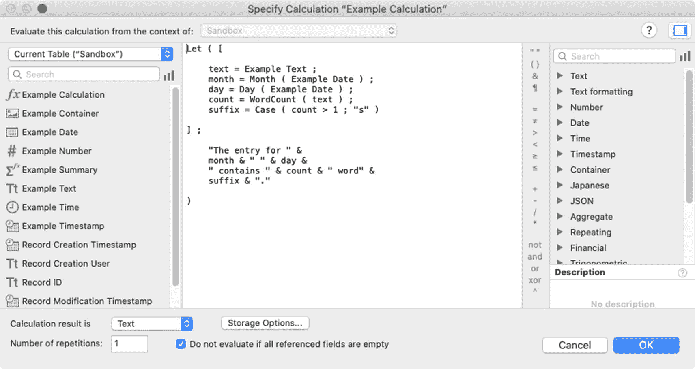
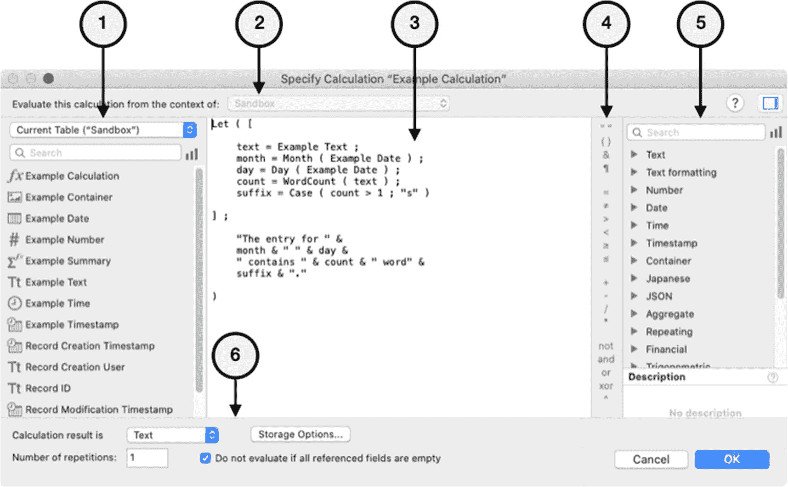
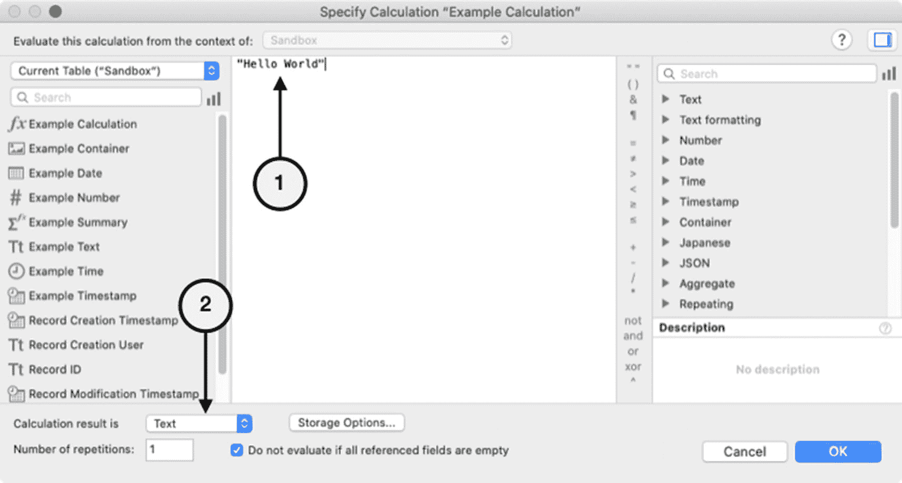
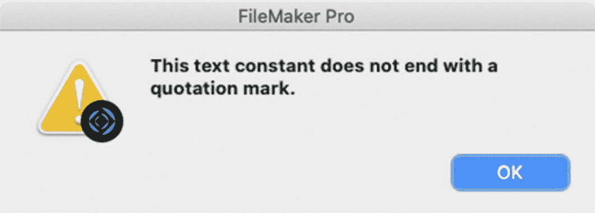
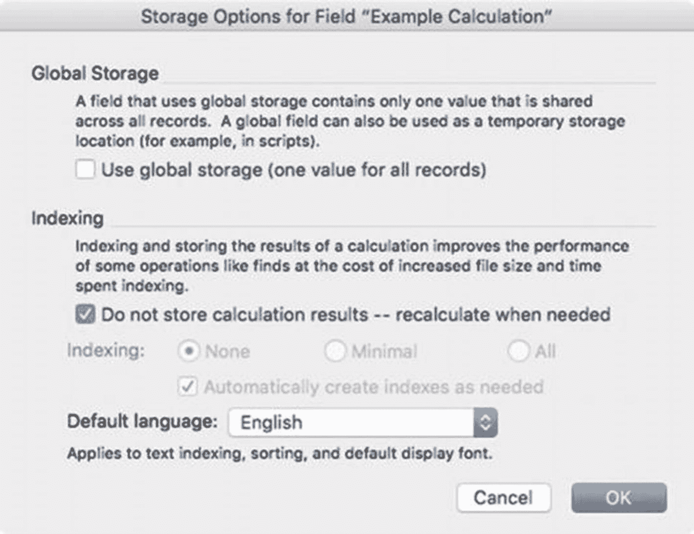
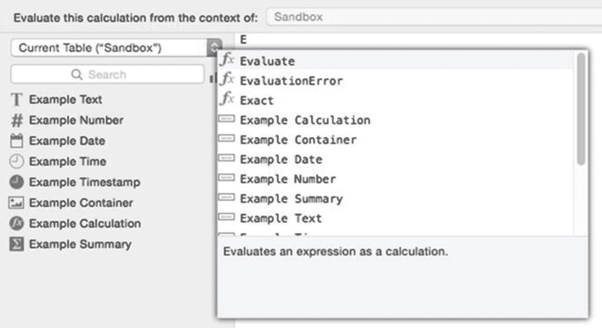
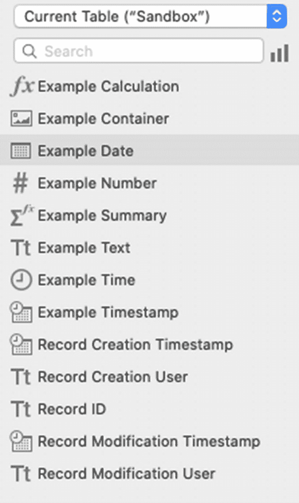
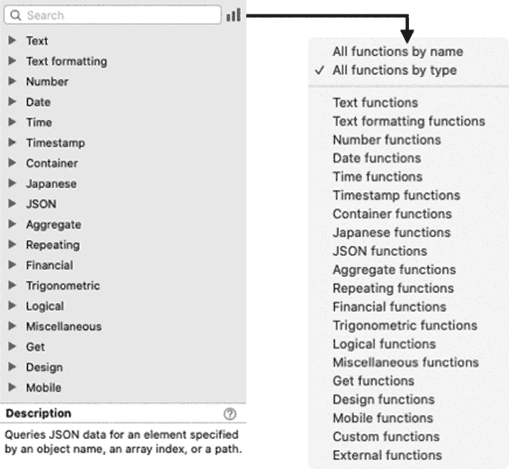
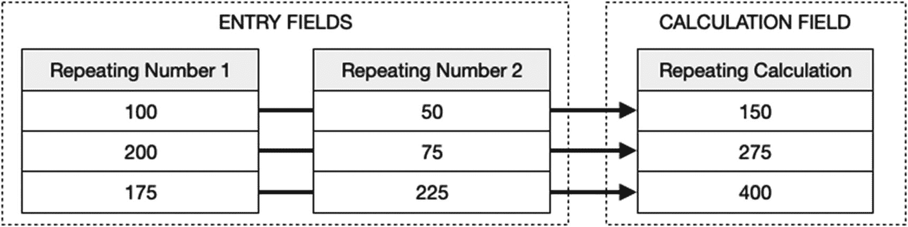
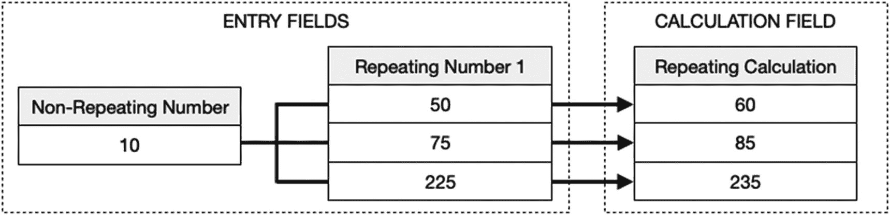

# 公式简介

公式在开发界面的诸多位置均有使用。*替换字段内容*对话框提供了一个插入公式结果的选项（第 4 章）。许多编程对话框或面板都设有*选项*、*指定*、`Fx`或*铅笔图标*按钮，点击后可进入公式对话框。某些弹出菜单中的*指定*选项也是如此。定义计算字段时，需要输入公式。常规字段可接受公式以生成自动输入值和验证结果（第 8 章）。自定义函数用于定义全局公式（第 15 章）。布局模式下的*检查器*面板可接受公式来隐藏对象、创建占位符文本和工具提示（第 19 章）。许多布局对象可接受公式来确定其名称或其他标准，包括*按钮栏*、*按钮*、*弹出框*、*标签页*、*门户*、*图表*和*Web 查看器*（第 20 章）。自定义菜单可以使用公式来确定名称和可见性（第 23 章）。脚本参数可以通过公式生成（第 24 章），并且许多脚本步骤可以或必须使用公式进行配置（第 25 章）。安全权限可以被配置为使用公式来确定对模式资源的访问权限（第 30 章）。开发者的*数据查看器*对话框包含一个*编辑表达式*对话框，该对话框接受公式以持续监控结果（第 31 章）。所有这些操作都会打开一个*指定计算*窗口，如图 12-1 所示。此对话框用于构建公式。



图 12-1

用于定义计算公式的对话框

## 公式工作原理

计算公式是通过将各种文本组件组合成一条书面语句来创建的，该语句表达了结果应如何产生。保存新的或修改过的公式时，FileMaker 将扫描该语句以检查语法错误，例如，断开的引用、缺失的函数或结构错误的语句。当检测到问题时，保存过程会暂停，语句中的错误会被高亮显示，并会弹出一个对话框消息详细说明错误信息。这个过程会重复进行，直到未检测到任何错误，并且代码可以成功编译和保存。一旦保存，公式将保持空闲状态，直到被任何进程*调用*，该进程会触发对其语句的评估以产生结果。

公式可以通过多种方式被调用。当创建记录或公式中使用的字段被更改时，字段的自动输入公式会被调用。当布局对象被渲染时，其使用的任何公式都会被调用。这适用于使用公式生成*名称*、*隐藏条件*、*条件格式*或其他与界面相关的属性或条件的对象。脚本步骤的计算元素会在脚本运行时该步骤被执行时被调用。公式可以被另一个公式调用，例如，一个计算字段在其公式中包含另一个计算字段，或者一个自定义函数调用另一个自定义函数或一个计算字段。

调用时，公式的语句会被*评估*，这意味着代码会通过按照特定的优先级顺序执行每个操作来转换为一个结果。公式总是在特定表出现的*上下文中*进行评估。*字段定义*中使用的公式需要从字段所在表的任何表出现中手动选择一个上下文。与*界面元素*关联的公式将使用呈现该对象的布局所对应的表出现上下文。在*脚本步骤*中使用的公式将使用执行时当前窗口中显示的布局所对应的表出现上下文。在*自定义菜单*中使用的公式也使用当前布局的表作为上下文。

公式的*结果*会返回给调用进程，该进程会根据其功能以适当的方式处理结果。例如，*计算字段*包含其公式的结果，并在放置在布局上时显示该结果。*布局对象*的名称可能会根据结果改变其显示名称、可见性或外观。`设置变量`脚本步骤将公式的结果放入变量中。`显示自定义对话框`脚本步骤会将一个结果放入屏幕上显示的对话框中。对象类型以及调用公式的配置方面决定了结果的目的地或用途。

当公式因执行错误而无法产生结果时，它将返回一个问号。例如，如果公式使用了已被删除或从当前上下文中无法访问的字段，则公式可能会返回错误。同样，使用已被删除的自定义函数，或提供与调用进程期望不一致的数据类型的结果，也会返回错误。

## 定义公式组件

公式表达式可以使用*注释*、*常量*、*字段引用*、*函数*、*运算符*、*保留关键字*和*变量*的任意组合来构建。

### 注释

*注释*是插入到公式中的文本字符串，在代码评估时会被完全忽略。注释可用于将代码分段，或作为针对开发者的集成文档，提供关于其执行的函数、工作原理、更改记录或未完成工作的说明等信息。注释可以放在公式顶部，也可以放在各个语句或代码段之间的任何位置。有两种可用的注释样式：*行尾注释*和*多行注释*。

#### 创建行尾注释

*行尾注释*从双斜杠（//）开始，一直持续到下一个段落回车符。在公式评估时，位于双斜杠和由回车符指示的行尾之间的任何文本都将被 FileMaker 忽略。下面的示例包含几个行尾注释。第一段和第二段都是注释，并说明了每一行都需要一组新的双斜杠来创建注释。第三段有一个注释从段落中间开始，位于两个数相加的公式之后。该行的公式部分将被评估，而注释部分将被忽略。结果将是两个数的总和：*四*。

```
// 这是一个注释
// 要延续到第二行，你必须使用另一组符号
2 + 2    // 此注释从行中间开始，在一个公式之后
```

#### 创建多行注释

*多行注释*使用*起始*和*终止*符号来指示注释的开始和结束。它们用于“注释掉”整个段落块。要输入多行注释，使用斜杠后跟星号（`/*`）来指示注释的*开始*，使用星号后跟斜杠（`*/`）来指示注释的*结束*。在公式评估时，这两个符号之间的任何文本都将被 FileMaker 完全忽略。在下面的示例中，公式有两个将被忽略的块注释，它们之间有一个公式将被评估，再次产生两个数的总和结果：*四*。

```
/*
这是一个注释
注释在附加行上继续
3 + 4 包括这整行
直到你在此处终止它
*/
2 + 2
/*
这是另一个带有换行（视为空格）的注释
注释在附加行上继续，直到被终止
*/
```


### 常量

*常量*，有时也被称为*字面量*，是直接键入公式中的静态不变的值。该值可以是 FileMaker 的任何数据类型：*文本*、*数字*、*日期*、*时间*或*时间戳*。当数量、城市名称、事件日期和开始时间等被*直接*键入公式时，它们都是常量的例子。数字常量可以直接键入公式，而其他基于文本的常量（如日期、时间和字符串）必须用引号括起来，以便将其解释为字面值，而不是字段引用、函数名或变量。以下展示了各类常量在公式中可能的示例：

```
"New York"
"1/15/2017"
"10:15:00"
"1/15/2017 10:15:00"
```

以字面字符串形式输入的日期和时间常量被视为文本，必须转换为实际的日期和时间值才能被如此处理。这可以通过使用内置函数来完成：`GetAsDate`、`GetAsTime` 和 `GetAsTimestamp`。

```
GetAsDate ( "1/15/2021” )
GetAsTime ( "10:15:00" )
GetAsTimestamp ( "1/15/2017 10:15:00" )
```

> **提示**  
> 在第 13 章中了解更多关于内置函数的信息。

### 函数

*函数*是一个预定义的、有名称的公式，它会被计算并返回一个结果。函数类似于其他编程语言中的子程序，因为它们允许将某些特定功能委托给当前公式之外的进程来处理，这有助于避免重复。在 FileMaker 中，有两种函数：*内置函数*（第 13 章和第 14 章）和*自定义函数*（第 15 章）。在本节中，我们将介绍如何使用简单的模式调用函数，以说明它们在公式中的使用。更多具体信息请参阅其他章节。

#### 从公式中调用函数

可以通过键入函数名称或通过界面选择（稍后介绍）来将函数调用放入公式中。通常，函数的名称由两个或多个首字母大写的单词组成，单词之间没有空格，简洁地描述了它们执行的过程。因此，函数调用就是将该名称放入语句中，其模式如下：

```
FunctionName
```

#### 带参数的函数调用

*函数参数*是一个值，它可以在每次调用函数时改变。某些函数使用参数来允许调用公式提供输入。参数可以包含用于操作的材料或关于要执行的过程的指令。参数列在函数名称之后，用一组括号括起来。如果一个函数接受多个参数，它们将按顺序列出，在函数名称后用分号分隔。以下显示了两者的示例：

```
ExampleFunction ( parameter )
ExampleFunction ( parameter1 ; parameter2 ; parameter3 )
```

函数调用中的参数值可以是常量、字段引用、字面量、嵌套函数或变量表达式，如下例所示，每个例子都调用了一个假设的只有一个参数的函数。

```
ExampleFunction ( "Hello, World" )
ExampleFunction ( 5000 )
ExampleFunction ( Invoice Tax Rate * Invoice Subtotal )
ExampleFunction ( AnotherFunction ( 15 ) )
```

#### 可选参数

某些内置函数具有*可选参数*，可以根据需要包含或忽略这些参数。当在公式中插入函数调用时，FileMaker 会用大括号表示可选参数，如下模式所示。

```
ExampleFunction ( parameter1 {; parameter2 ; parameter3} )
```

在这种情况下，大括号表示 `parameter1` 是必需的，而 `parameter2` 和 `parameter3` 是可选的。在编译公式之前，必须移除大括号以及任何*不会*使用的可选参数。以下示例显示了对同一个假设函数的一次调用（不带可选参数）和另一次调用（带有可选参数）。

```
ExampleFunction ( parameter1 )
ExampleFunction ( parameter1 ; parameter2 ; parameter3 )
```

#### 嵌套函数调用

参数可以接受表达式作为值，包括对*其他函数*的调用。在此示例中，`ExampleFunction2` 将首先被计算，其结果将用作 `ExampleFunction1` 的参数。

```
ExampleFunction1 ( ExampleFunction2 ( parameter ) )
```

### 操作符

*操作符*是一个符号，用于在公式中表达一种操作类型。FileMaker 有许多不同的操作符：*比较*、*逻辑*、*数学*和*文本*操作符。

> **注意**  
> 为清晰起见，本节中的示例使用了仅包含常量的简单公式。但是，它们可以与任何公式组件组合使用。

#### 比较操作符

*比较操作符*是一个用于比较两个值的符号，这两个值可以是字面值，也可以是两个表达式的计算结果。使用比较操作符的表达式的结果将是一个*布尔值*，分别用 `1`（*真*）或 `0`（*假*）表示。

##### 等于

*等于*符号用于比较两个值是否相同。如果两个值相同，则等式计算结果为真；如果不同，则为假。

```
100 = 100         // 结果 = 1
150 = 100         // 结果 = 0
"New York" = "New York"  // 结果 = 1
"New York" = "NY"        // 结果 = 0
GetAsDate ( "1/15/2021" ) = GetAsDate ( "1/15/2021" )     // 结果 = 1
GetAsDate ( "1/15/2021" ) = GetAsDate ( "7/20/2021" )     // 结果 = 0
GetAsTime ( "9:30:00" ) = GetAsTime ( "9:30:00" )         // 结果 = 1
GetAsTime ( "9:30:00" ) = GetAsTime ( "12:15:00" )        // 结果 = 0
```

##### 不等于

比较两个值是否不同，可以使用*不等于*符号，或使用*小于*和*大于*符号并列。如果两个值相同，则等式计算结果为假；如果不同，则为真，如下例所示：

```
100 ≠ 100        // 结果 = 0
150 ≠ 100        // 结果 = 1
"New York" ≠ "New York" // 结果 = 0
"New York" ≠ "NY"       // 结果 = 1
GetAsDate ( "1/15/2021" ) ≠ GetAsDate ( "1/15/2021" )     // 结果 = 0
GetAsDate ( "1/15/2021" ) ≠ GetAsDate ( "7/20/2021" )     // 结果 = 1
GetAsTime ( "9:30:00" ) ≠ GetAsTime ( "9:30:00" )         // 结果 = 0
GetAsTime ( "9:30:00" ) ≠ GetAsTime ( "12:15:00" )        // 结果 = 1
```

> **提示**  
> 在 macOS 上，可以通过按住 Option 键并输入等号来创建*不等于*符号。

##### 大于

*大于*符号用于比较两个值的字母顺序、时间顺序或数值大小。如果左侧的值在位置上大于右侧的值，则等式计算结果为真。

```
150 > 100        // 结果 = 1
100 > 100        // 结果 = 0
"Bear" > "Automobile"    // 结果 = 1
"Atlanta" > "New York"   // 结果 = 0
GetAsDate ( "1/15/2021" ) > GetAsDate ( "1/10/2021" )     // 结果 = 1
GetAsDate ( "1/15/2021" ) > GetAsDate ( "7/10/2021" )     // 结果 = 0
GetAsTime ( "12:30:00" ) > GetAsTime ( "9:15:00" )        // 结果 = 1
GetAsTime ( "9:30:00" ) > GetAsTime ( "10:45:00" )        // 结果 = 0
```


### 大于或等于

比较两个值的相对位置可以使用*大于或等于*符号，或使用*大于*符号后跟一个*等号*。如果左侧的值在位置上大于或等于右侧的值，则表达式计算结果为真，如下例所示：

```
100 ≥ 100        // 结果 = 1
100 ≥ 150        // 结果 = 0
"Bear" >= "Automobile"    // 结果 = 1
"New York" >= "Ohio"      // 结果 = 0
GetAsDate ( "1/15/2021" ) ≥ GetAsDate ( "7/20/2016" )     // 结果 = 1
GetAsDate ( "1/15/2021" ) ≥ GetAsDate ( "7/10/2021" )     // 结果 = 0
GetAsTime ( "12:30:00" ) ≥ GetAsTime ( "12:30:00" )       // 结果 = 1
GetAsTime ( "9:30:00" ) ≥ GetAsTime ( "10:45:00" )        // 结果 = 0
```

**提示**  
在 macOS 上，按住 `Option` 键并输入*大于*符号即可创建 `≥` 符号。

### 小于

使用*小于*符号比较两个值的相对位置。如果右侧的值在位置上大于左侧的值，则表达式计算结果为真。

```
100 < 350        // 结果 = 1
100 < 100        // 结果 = 0
"Automobile" < "Car"    // 结果 = 1
"New York" < "New York" // 结果 = 0
GetAsDate ( "7/20/2016" ) < GetAsDate ( "1/15/2021" )     // 结果 = 1
GetAsDate ( "7/10/2021" ) < GetAsDate ( "1/15/2021" )     // 结果 = 0
GetAsTime ( "9:15:00" ) < GetAsTime ( "12:30:00" )        // 结果 = 1
GetAsTime ( "10:45:00" ) < GetAsTime ( "9:30:00" )        // 结果 = 0
```

### 小于或等于

比较两个值的相对位置可以使用*小于或等于*符号，或使用*小于*符号后跟一个*等号*。如果左侧的值在位置上小于或等于右侧的值，则表达式计算结果为真，如下例所示：

```
100 ≤ 100       // 结果 = 1
100 ≤ 50        // 结果 = 0
"Automobile" <= "Bear"   // 结果 = 1
"Ohio" <= "New York"     // 结果 = 0
GetAsDate ( "7/20/2016" ) ≤ GetAsDate ( "1/15/2021" )     // 结果 = 1
GetAsDate ( "7/10/2021" ) ≤ GetAsDate ( "1/15/2021" )     // 结果 = 0
GetAsTime ( "12:30:00" ) ≤ GetAsTime ( "12:30:00" )       // 结果 = 1
GetAsTime ( "10:45:00" ) ≤ GetAsTime ( "9:30:00" )        // 结果 = 0
```

**提示**  
在 macOS 上，按住 `Option` 键并输入*小于*符号即可创建 `≤` 符号。

### 逻辑运算符

*逻辑运算符*是一种关键字，用于通过将两个或多个单独的表达式连接成一个表达式来构建复合条件，或者在某些情况下，用于否定单个表达式以反转布尔结果。使用逻辑运算符的表达式结果将是一个布尔值。

**提示**  
使用括号有助于可视化逻辑运算符两侧的各个表达式，并确保正确的执行顺序。

### AND

`AND` 运算符用于将两个独立的布尔表达式组合成一个复合方程，仅当两个表达式的结果都为真时，该复合方程才求值为真。

```
( 150 > 100 ) AND ( "Bear" > "Automobile" )       // 结果 = 1
( 150 > 100 ) AND ( "Bear" = "Automobile" )       // 结果 = 0
```

### OR

`OR` 运算符用于将两个独立的布尔表达式组合成一个复合方程，如果两个表达式中至少有一个结果为真，则该复合方程求值为真。

```
( 150 > 100 ) OR ( "Bear" < "Automobile" )       // 结果 = 1
( 150 < 100 ) OR ( "Bear" = "Automobile" )       // 结果 = 0
```

### XOR

`XOR` 运算符用于将两个独立的布尔表达式组合成一个复合方程，仅当两个方程中只有一个结果为真时，该复合方程才求值为真。如果两个方程都为真，则返回假。

```
( 150 > 100 ) XOR ( "Bear" > "Automobile" )       // 结果 = 0
( 150 > 100 ) XOR ( "Bear" ≠ "Automobile" )       // 结果 = 1
( 150 < 100 ) XOR ( "Bear" ≠ "Automobile" )       // 结果 = 1
( 150 < 100 ) XOR ( "Bear" = "Automobile" )       // 结果 = 0
```

### NOT

`NOT` 运算符是一种独特的逻辑运算符，它会否定其右侧任何表达式的结果，从而反转该表达式的布尔结果。如果表达式求值为真，在此运算符前加上它，将反转为返回假，反之亦然。

```
NOT ( 150 > 100 )                       // 结果 = 0
NOT ( "Tuesday" < "Monday" )            // 结果 = 1
```

还可以通过将表达式的布尔结果与 `0` 进行比较来实现反转。在此示例中，括号内表达式产生的假（`0`）结果通过随后与 `0` 的比较而被反转：

```
( 150 < 100 ) = 0                      // 结果 = 1
```

## 数学运算符

*数学运算符*是一种符号，用于对一个或多个值或表达式执行或控制算术运算。数学运算不仅可以对数字执行，也可以对其他数据类型（如日期、时间和时间戳）执行。

**注意**  
对于数学运算，日期和时间会转换为数字（第 8 章“定义字段数据类型”）。

### 加法

*加号*符号用于将右侧的值加到左侧的值上。

```
100 + 50                        // 结果 = 150
GetAsDate ( "1/5/2021" ) + 5    // 结果 = 1/10/2017
GetasTime ( "1:15:00" ) + 300   // 结果 = 1:20:00
```

### 减法

*减号*符号用于从左侧的值中减去右侧的值。

```
100 – 50                        // 结果 = 50
GetAsDate ( "1/5/2021" ) - 2    // 结果 = 1/3/2017
GetasTime ( "1:15:00" ) - 300   // 结果 = 1:10:00
```

### 乘法

*乘号*符号用于将左侧的值乘以右侧的值。

```
100 * 50                      // 结果 = 5000
GetAsDate ( "1/5/2021" ) * 2  // 结果 = 1475590
```

### 除法

*除号*符号用于将左侧的值除以右侧的值。

```
100 / 50                       // 结果 = 2
GetAsTime ( "1:15:00" ) / 2    // 结果 = 2250
```

### 乘方

*乘方*符号用于将左侧的值提升到右侧值的幂。

```
100²
```

### 优先级

一组*圆括号*用于改变*求值优先级*（本章后面会讨论）。FileMaker 会从左到右计算公式，但会首先计算括号内的表达式，遵循由内向外以及基于优先级的顺序。尽管以下两个方程式对相同的数字以相同的顺序执行相同的数学运算，但由于使用括号控制优先级，结果截然不同：

```
100 * 2 + 50 / 25                // 结果 = 202
( ( 100 * 2 ) + 50 ) / 25        // 结果 = 10
```


### 文本运算符

`文本运算符`是一种用于构建方程式的符号，它可以将文本项组合成单个项，并执行其他与文本相关的功能。这些功能包括引号、文本连接、段落回车和反斜杠。

#### 引用文本

一对`引号`用于表示字面文本常量。在公式中输入的文本如果没有引号，则会被解释为`字段`、`函数`或`变量`。日期和时间常量必须用引号括起来。

```
"John"
"1/15/2021"
```

#### 连接文本

`&`符号用于将文本值连接成单个值。

```
"John" & " " & "Smith"        //结果 = John Smith
```

#### 段落回车

`段落回车`符号用于在文本值中插入一个回车符，且可以放在计算式中。虽然如第二个示例所示，可以在引号外放置单个回车符，但将多个回车符放在引号外会产生错误，导致编译失败。以下三个示例都返回相同的结果：

```
"John Smith" & "¶" & "Jim Smith"
"John Smith" & ¶ & "Jim Smith"
"John Smith¶Jim Smith"
// 结果 = John Smith¶Jim Smith
```

提示

在 macOS 上，按住`Option`键并输入“7”即可创建段落回车符号。

#### 反斜杠

引号是运算符，实际上并不属于它们所包含的值的一部分。反斜杠符号用于强制将运算符按字面意义使用。这被称为`转义字符串`，因为它允许在字符串中使用运算符而不会引起错误。例如，反斜杠后面跟着一个引号符号，会强制该引号符号被视为文本并成为结果的一部分。如果没有反斜杠，FileMaker 会将该公式解释为存在语法错误，并且不允许保存。

```
5"                 // 结果 = 语法错误，不会编译
"5\""              // 结果 = 5"
"Hello, World"     // 结果 = Hello, World
"\"Hello, World\"" // 结果 = "Hello, World"
```

提示

FileMaker 内置的 `Quote()` 函数会自动将现有值包裹在引号文本中。

#### 保留名称

FileMaker 允许将保留关键字或函数名称用作表名或字段名。然而，在公式中引用这些名称时，可能会发生错误，因为 FileMaker 无法区分它是一个字段引用还是一个运算符或函数调用。例如，你可以将字段命名为 `AND`，但在公式中引用它时，必须用花括号括起来并在前面加上美元符号，才能被解释为字段并成功编译：

```
${AND}
```

提示

避免使用保留名称作为表名或字段名！

### 理解运算符优先级

计算公式中的运算符按照以下优先级顺序进行求值：

1.  注释
2.  空格、反斜杠、段落回车、保留名称
3.  括号
4.  `NOT`
5.  幂运算（`^`）
6.  乘法和除法
7.  加法和减法
8.  连接符号（&）
9.  等于、不等于、大于、小于、大于等于、小于等于
10. `OR`、`XOR`

### 保留字

`保留字`是 FileMaker 用于函数名、预定义参数和运算符以及构造 SQL 语句的词、术语或符号。为了避免编写公式时出现问题，不应将这些词用作表、字段、自定义函数和其他对象的名称。Claris 在其网站上通过搜索“Reserved words in FileMaker Pro”或访问以下地址提供了一个列表：

```
https://support.claris.com/s/article/Reserved-words-in-FileMaker-Pro-1503693036814
```

### 变量

`变量`是一个由开发者命名的字母、单词或短语，它存储一个可以在计算公式和开发界面其他位置使用的值。

#### 变量类型

FileMaker 有三种不同的变量类型，每种都有不同的命名要求和作用域：`语句变量`、`局部变量`和`全局变量`。虽然变量可以使用多种不同格式命名，但需牢记一些通用的命名注意事项。变量名称应避免使用保留字和字段名，以防止公式中的混淆和冲突。与其他地方的名称一样，变量名应简洁以避免杂乱，但同时要有足够的描述性清晰度来表明其包含的数据。总体而言，大小写要保持一致；选择`驼峰式`（`variableNameExample`）、`点分隔式`（`variable.name.example`）、`下划线分隔式`（`variable_name_example`）或你选择的其他格式。

##### 语句变量

`语句变量`是在 `Let` 或 `While` 语句（第 13 章）中初始化的变量。这些变量仅在该语句被积极求值时存在。除了常规限制外，FileMaker 对语句变量没有特殊的命名要求。名称可以短至单个字符，也可以像以下任一示例那样是冗长的多词短语。由于语句变量仅限于定义它们的语句内部，它们不会与其他公式中的同名变量或同一公式中该语句外部的同名变量产生冲突。因此，标准化的名称可以在不同公式间重复使用，无需担心冲突。

```
X
data
firstName
first_Name
dateToProcess
table.name
```

##### 局部变量

`局部变量`是在公式、自定义函数求值期间或脚本执行期间暂时存在的变量。局部变量可以在 `Let` 或 `While` 语句（第 13 章）中以及通过 `设置变量` 脚本步骤（第 25 章）进行初始化，并有多种用途。在脚本中的某个位置存储信息，以便在同一脚本中稍后使用；在脚本和自定义函数之间共享信息；或者在递归自定义函数（第 15 章）中从一个迭代到下一个迭代存储信息。FileMaker 要求局部变量必须以单个美元符号为前缀。除此之外，名称可以短至单个字符，也可以像以下示例中那样是冗长的多词短语，并且可以使用各种分隔符。由于局部变量仅限于定义它们的公式或脚本，它们通常不会与其他脚本中的同名变量冲突。但是，从同一脚本对自定义函数进行多次调用时，会保留该函数使用的所有局部变量。

```
$x
$data
$firstName
$recordNumber
$dateToProcess
$date.to.process
$date_to_process
```


### 全局变量

`全局变量`是一种可从单个数据库文件内任何位置的任何公式访问的变量，并且会持续存在直到文件关闭。与局部变量类似，全局变量可以在`Let`或`While`语句以及`设置变量`脚本步骤中进行初始化。全局变量可用于存储控制自定义功能的自定义偏好设置、为某个目的而准备的暂存数据，或记录故障排除信息，以帮助追踪复杂多脚本流程或迭代公式中的问题。

**提示：** 将全局变量限制在文件内*真正全局*使用的信息范围内！避免使用它们来在脚本之间交换数据；应改用参数（参见第 24 章）。

FileMaker 要求全局变量以双美元符号前缀命名。除此之外，名称可以短至单个字符，也可以是较长的多词短语，并且可以使用各种分隔符，如下例所示。由于它们是全局变量，每个变量都必须唯一且仔细命名，以避免与同一文件中用于不同目的的其他全局变量产生混淆和冲突。但是，由于它们不在文件之间共享，因此可以在不同文件中重复使用标准化的名称，而无需担心它们会相互覆盖。

```
$$x
$$data
$$firstName
$$recordNumber
$$dateToProcess
$$date.to.process
$$date_to_process
```

**提示：** *数据查看器*（第 26 章“探索数据查看器”）可用于随时监控全局变量，并在脚本执行期间监控局部变量。

## 探索计算界面

要试验公式，请使用 *Learn FileMaker* 数据库中 *Sandbox* 表的 *示例计算* 字段。首先，请按照以下步骤操作：

1.  打开 *Learn FileMaker* 数据库。
2.  切换到 *Sandbox* 布局。
3.  选择 *文件 ➤ 管理 ➤ 数据库* 菜单项。
4.  点击 *字段* 选项卡。
5.  确认左上角 *表* 弹出菜单中为 *Sandbox*。
6.  点击 *示例计算* 字段。
7.  点击 *选项* 按钮。

### 探索“指定计算”对话框

所有公式都在“指定计算”对话框中编写，如图 12-2 所示。



**图 12-2** 用于指定计算公式的对话框窗口

1.  *字段选择器面板* – 选择一个表 occurrence 并选择一个字段，以将字段引用插入到公式中。
2.  *上下文指示器* – 仅针对计算字段，如果字段的表存在多个 occurrence，则选择一个 occurrence 作为公式的上下文。
3.  *公式文本区域* – 这是公式的代码。通过单击左侧和右侧的面板来输入、拖放、复制粘贴或插入内容以构建公式。
4.  *运算符* – 使用这些按钮快速插入运算符。
5.  *函数面板* – 可以插入到公式中的内置函数、自定义函数和插件提供函数的列表。它们可以按层级或字母顺序排列。
6.  仅针对计算字段的设置：
    *   *计算结果为* – 为字段计算结果选择数据类型。其他公式会根据对象或函数类型自动指定，例如，按钮名称必须为文本。
    *   *重复次数* – 指定重复次数。
    *   *不计算复选框* – 选择后，如果公式中引用的每个字段都为空，则自动返回无值。
    *   *存储选项* – 打开存储选项对话框。

## 编写公式

公式可以包含任意组合的组件，其复杂程度差异很大。本节中的所有示例都假设公式是在 *Learn FileMaker* 数据库的 `Sandbox::示例计算` 字段中输入的，因此您可以在 *Sandbox 表单* 布局上的该字段中看到结果。

### 仅含常量的公式

`仅含常量`的公式是指无需执行任何实际操作即可计算为字面值的公式。它基本上是一条包含单个值的语句，该值始终会计算出相同的结果。这些公式具有实际价值，可作为存储静态信息的一种方式，例如当前税率或用作关系匹配字段以连接到特定类型的相关记录子集的值。现在，它将作为最基本的示例，帮助我们开始编写简单的公式。在公式区域中输入 `"Hello World"`，然后选择 `文本` 作为计算结果数据类型。此时对话框应如图 12-3 所示。保存公式后，布局上的 *示例计算* 字段应为每条记录显示文本 `"Hello World"`。结果相同是因为公式返回了一个静态值。要使结果随记录变化，公式需要包含随记录变化的组件，例如字段引用。



**图 12-3** 具有静态结果的简单计算公式

### 制造故意的错误

在继续之前，理解语法错误和结果错误之间的区别很重要。`语法错误`是指代码格式或语言方面的错误，会导致尝试编译和保存公式时失败。为了用简单的常量公式说明这一点，请从前面的公式中删除最后的引号符号。当您尝试保存计算时，FileMaker 将显示如图 12-4 所示的错误对话框消息。检测到语法错误时，FileMaker 将不允许您保存公式，直到其格式正确为止。并非每条语法错误消息都这么具体，但它通常会提供足够的信息来帮助确定错误的性质。



**图 12-4** 公式语法错误的示例错误消息

相比之下，已编译并保存的公式可能会产生`结果错误`，表明公式的设置或其一个或多个操作中使用的组件存在问题。在这种情况下，公式的结果将显示为一个问号。为了说明这一点，请恢复公式的结束引号以消除语法错误。然后将“计算结果为”弹出菜单中的选择更改为`日期`、`时间`或`时间戳`。FileMaker 将允许保存公式，因为语法正确，并且它不会将结果类型设置（`date`）与实际结果数据类型（`text`）进行比较，因为它假设您已负责任地创建了一个能产生您所指示结果的公式。当您查看记录上的字段时，结果将显示为一个问号。并非所有类型不匹配都会产生语法错误。有些类型（如`数字`和`容器`）会显示看起来正常但可能在搜索、排序或在其他公式中使用信息时表现不符合预期的文本结果。


### 存储选项实验

与输入字段类似，计算字段也拥有*存储选项*，用于控制公式结果的存储方式，如图 12-5 所示。*全局存储*和*索引*的设置与*输入*字段类似（见第 8 章），但多了一个索引选项。勾选`不存储计算结果`复选框会强制计算字段永远不索引结果，而是在每次访问或显示该字段时自动重新计算。创建新字段时，此复选框默认处于未选中状态。



**图 12-5** 已禁用索引的存储选项对话框

为了演示存储的效果，先配置一个返回*文本*结果的`"Hello World"`公式，并保持`不存储`复选框未选中。保存公式，并在浏览模式下确认字段正确显示。然后再次打开公式，在文本前输入两个正斜杠，将整个公式转换为注释，如下例所示。

```
// "Hello World"
```

不做其他修改，保存公式并再次在浏览模式下查看。如果它仍然显示值“Hello World”，好像什么都没变，不必惊讶。这是因为现有记录中存储了计算结果。如果选择`记录 ➤ 新建记录`菜单，新记录将在该字段中正确显示空白值，反映出公式已被注释掉的事实。由于复选框设置为不重新计算结果，先前记录的旧值会保持不变，直到有事件触发更新才会改变。

与其他字段类型一样，计算字段使用索引设置以某种方式预处理数据，从而加快搜索速度或建立关系。然而，此设置允许计算字段在没有其他事件触发重新计算时，不重新计算更新的结果。如果公式被大幅修改，则*会*提示每条记录刷新结果。例如，如果公式更改为一个完全不同的文本常量，它将更新并显示新值。为了强制上述被注释掉的例子正确工作，请勾选`不存储计算结果`复选框，保存，然后在浏览模式下查看。所有记录（包括现有记录）的该字段都将为空。

尽管这个简单的例子并不能实际代表你将会面临的各类挑战，但它清晰地说明了在某些情况下你需要调整存储设置。例如，使用了`Get ( FoundCount )`或`Get ( RecordNumber )`等内置函数的公式将*需要*通过勾选禁止存储的复选框来强制重新计算。与此不同，包含字段引用的公式则会在这些字段值被修改时*自动*更新。

### 插入公式组件

`指定计算`对话框允许在公式中插入*字段引用*、*函数*和*运算符*。输入文本有多种方式：键入、复制粘贴或拖放文本。字段引用和函数调用也可以通过双击对话框两侧窗格中的项目来插入。

#### 使用自动完成

对话框的公式区域将文本输入与动态辅助功能相结合，该功能可以检测关键短语并提供*自动完成建议界面*，如图 12-6 所示。当你输入时，可用组件的列表会刷新，包含以你输入的字母或短语开头的所有内置函数、自定义函数和字段的混合列表。在示例中，输入字母“E”会显示一个包含三个函数和一堆字段的列表。当你继续输入“Ex”、“Exa”和“Exam”时，列表会持续过滤，直到只看到我们的示例字段列表。



**图 12-6** 公式输入时自动完成功能的示例

当自动完成列表出现时，你可以选择忽略它继续输入，或者选择一个项目进行快速插入。可以通过滚动、使用方向键垂直导航，或继续输入足够多的文本直到所需项目成为列表顶部的默认选项，来定位列表中的项目。一旦找到并选中后，可以通过双击或按`回车`键将其插入到公式中。

#### 使用字段选择窗格

*字段选择面板*，如图 12-7 所示，用于定位和插入字段引用。



**图 12-7** 对话框左侧的字段选择窗格

顶部的弹出式菜单用于选择下方列出其字段的哪个表 occurrence。默认选择基于当前上下文。编辑计算字段时，默认将是包含正在定义字段的表，occurrence 列表将分为相关和无关 occurrence，以帮助区分哪些关系可以使用。当为布局对象、脚本步骤或其他项目编辑公式时，列表默认为当前布局的表，并按字母顺序列出所有 occurrence，你需要负责根据执行时活动的适当上下文，安全地选择一个有效的关系。选择一个 occurrence 后，字段列表会更新，并可以搜索或排序。要将引用插入公式，双击它即可。

#### 使用函数选择窗格

*函数选择面板*，如图 12-8 所示，用于定位和将函数插入到公式中。它包含一个*内置函数*（第 13 章）、*自定义函数*（第 15 章）和*插件函数*（第 28 章）的列表。函数列表可以按类别分组（如图所示），或者使用排序图标下的菜单按字母顺序列出。可以通过在文本区搜索关键词，或者从排序菜单中选择一个类别来搜索。找到所需函数后，双击它即可将其插入公式。在此面板底部有一段简短的描述和一个帮助按钮，用于打开所选函数的在线文档。



**图 12-8** 对话框右侧的函数窗格

### 创建重复计算字段

通过在`指定计算`对话框底部的`重复次数`中输入一个数字，可以将计算字段定义为重复字段。重复计算字段的工作原理类似于重复输入字段（第 8 章）。但是，在处理重复计算字段时，可能需要一些技术和内置函数。


#### 在重复计算中使用重复字段

当公式中使用的所有字段与计算字段配置了相同数量的重复次数时，重复计算将按预期工作。图 12-9 所示的示例展示了两个包含数字的输入字段，这些数字相加后进入计算字段的总和。每个字段都定义为 *三个重复项*。在该示例中，计算字段的公式被定义为将这些数字相加。该公式会自动应用于两个输入字段的每组重复项，并将每个结果值放入计算字段的对应重复项中。



图 12-9：所有字段具有相同重复次数的计算示意图

```
重复数字 1 + 重复数字 2
```

#### 在重复计算中使用非重复字段

当在重复计算字段的公式中使用*非重复字段*时，请使用 `Extend` 函数来*虚拟扩展*非重复字段，使其匹配重复次数。图 12-10 所示的示例展示了一个单重复输入字段、另一个具有三个重复的输入字段以及一个具有三个重复的计算字段。



图 12-10：重复字段与非重复字段混合的示意图

为了使公式能够成功地将非重复字段中的值应用于重复字段中的每个值并生成三个结果，公式必须按如下例所示扩展非重复字段。该单一值将被视为三个独立的重复项，每个重复项都填充相同的值。

```
扩展 ( 非重复数字 ) + 重复数字 1
```

#### 其他重复函数

还有其他内置函数在*重复*和*非重复*计算中都很有用。`Get ( ActiveRepetitionNumber )` 函数返回一个数字，指示当前字段的哪个重复项拥有光标焦点。这可用于与界面相关的计算和脚本步骤，以确定光标在重复字段中的位置。`GetRepetition` 函数可用于从指定重复字段的特定重复项中提取值。`Get ( CalculationRepetitionNumber )` 函数返回一个数字，指示当前正在计算的重复计算字段的哪个重复项。这使得计算字段公式能够在每个重复项需要执行略有不同功能时，知道当前正在评估其自身字段结构中的哪个重复项。

### 为视觉格式留出空间

在编译公式时，FileMaker 会忽略引用文本之外的任何多余空格、制表符和段落回车符。这意味着您可以在公式中添加空白来展开代码，使其更易于阅读。在编写公式时，考虑制定一个策略，始终在项目之间添加空格，将复杂的语句扩展到更易于阅读的格式。

#### 在项目之间添加空格

可以在公式组件之间添加空格，以水平展开文本，使其更易于阅读。下面的代码配对显示了一个没有空格的紧凑示例，以及同一行添加空格后的效果。在每组中，两者功能完全相同。

```
(150+50)/25
( 150 + 50 ) / 25
$FirstName&$Space&$LastName
$FirstName & $Space & $LastName
Get(CurrentDate)
Get ( CurrentDate )
```

#### 展开复杂语句

涉及复杂 `Case`、`Let`、`Substitute`、`While` 和某些 `JSON` 函数（第 13 章和第 14 章）的公式可以从空格、制表符和回车符中受益。虽然确切的格式可能因语句的复杂性和嵌套子句的使用而异，但以下简单示例展示了作者偏爱的几种格式模式，用于分隔和缩进复杂语句以增强其视觉格式：

```
// CASE 示例
Case (
条件 1 = 结果 1 ;
条件 2 = 结果 2
)
// LET 示例
Let ( [
变量 1 = 表达式 1 ;
变量 2 = 表达式 2
] ;
计算
)
// SUBSTITUTE 示例
Substitute (
文本 ;
[ 搜索字符串 1 ; 替换字符串 1 ] ;
[ 搜索字符串 2 ; 替换字符串 2 ]
)
```

#### 管理字符限制

FileMaker 将每个公式的总文本限制为 30,000 个字符。在编写冗长公式时，人们自然倾向于*避免*添加空格、制表符和段落回车符以节省空间并避免达到该限制。但是，有一些技术可以在*不*要求代码变得紧凑且难以阅读的情况下管理空间。首先，评估公式如此长的原因。除了一些例外情况，冗长的公式通常包含冗余的元素和短语。一个重复使用的长字段引用可以通过 `Let` 语句（第 13 章）压缩成一个更短的语句变量。例如，字段引用 `Contact::Contact Name First` 可以被放入一个名为 “nameFirst” 之类的变量中并重复使用，后续每次实例占用的空间大大减少。此外，在不失清晰度的前提下重命名变量以缩短其长度可以节省空间。公式的某些部分可以卸载到自定义函数中（第 25 章），尤其是当该功能是通用的并且在数据库的其他地方使用。另一个选择是将复杂的计算分解为单独的字段或脚本步骤，而不是试图将庞大的过程强行塞入一个公式中。

**提示** 养成高效编码的习惯，无论公式长度如何，都要密切关注清晰度并采用高效的技术设计。

### 向示例文件添加简单计算

为了实验公式，可以在 *Learn FileMaker* 数据库的表中添加几个简单的计算。

#### 公司联系人计数

在 *Company* 表中，按照以下步骤添加一个名为 “Company Contact Count” 的新计算字段，该字段的公式用于计算相关的联系人记录：

1. 打开 *管理数据库* 对话框，为 *Company* 表选择 *字段* 选项卡。
2. 创建新的计算字段。
3. 从字段选择面板的弹出菜单中选择 *Company | Contact* 表出现项。
4. 在公式区域，开始输入“Count”并从自动完成列表中选择 `Count` 函数。
5. 双击 *Company | Contact* 表出现项中的 *Record ID* 字段。公式应显示为：`Count ( Company | Contact::Record ID )`
6. 确保结果类型为 *数字*。
7. 点击保存并关闭对话框。
8. 将此新字段放置在 *Company* 布局上，以确认它能准确统计每个公司的相关联系人数量。请记住，根据公司对联系人的分配情况，不同记录中的计数会有所不同。


### 联系人全名与地址标签

在`Contact`表中，添加一个名为`Contact Name Full`的新计算字段，并定义公式来拼接名字和姓氏。此字段可在布局和计算中使用，无需反复单独引用这两个字段。

```
Contact Name First & " " & Contact Name Last
```

接着，添加另一个名为`Contact Address Label`的字段，定义公式将地址格式化为单个文本值。公式如下：

```
Contact::Contact Name Full & "¶" &
Contact::Contact Address Street & "¶" &
Contact::Contact Address City & ", " &
Contact::Contact Address State & " " &
Contact::Contact Address Zip
// 结果 = Karen Smith
// 521 Loft Street
// Sleepytown, CA 55555
```

> **提示**  
> 使用`Case`或`List`函数（见第 13 章）来构建标签，避免因空字段中缺失信息而导致多余空格。

## 总结

本章介绍了编写公式的基础知识。在下一章中，我们将看到许多使用各种实用内置函数的实际公式示例。

