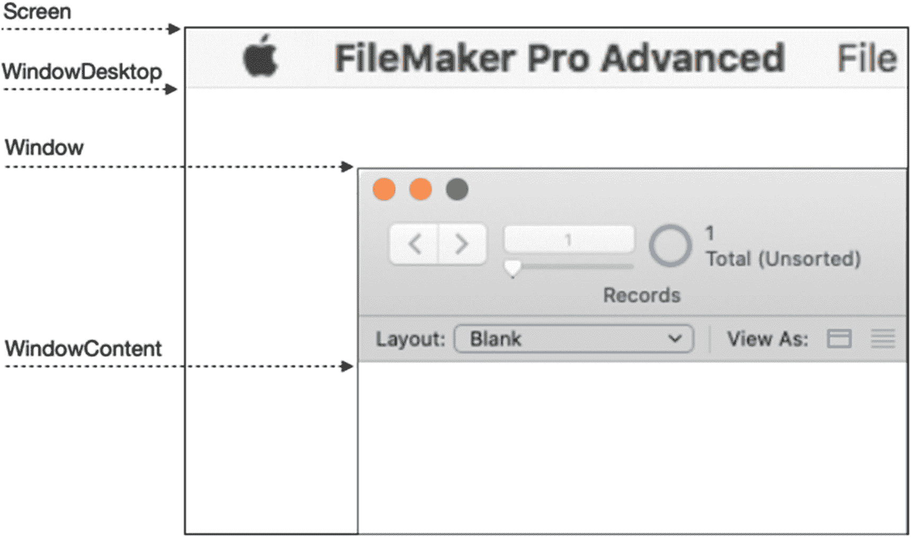

# 13. 探索内置函数

FileMaker 包含一个包含超过 300 个内置函数的库，这些函数可在公式中使用以执行常见功能。本章将探讨许多重要的内置函数，涵盖以下主题：

- 处理数字、日期和时间
- 处理文本
- 处理值列表
- 介绍`Get`函数
- 访问字段
- 聚合数据
- 使用语句函数

> **注意**  
> 尽管大多数示例使用字面值作为参数，但请记住，这些参数可以是变量、字段引用、嵌套表达式，甚至是对其他函数的嵌套调用。

## 处理数字、日期和时间

有许多函数可用于获取、生成、解析和操作数字、日期和时间。

### 使用数字函数

除了基本的数学运算外，还有许多内置函数提供更高级的数字功能：`Int`、`Random`、`Round`、`Mod`、`SetPrecision`和`Truncate`。

#### `Int`

`Int`函数通过丢弃小数点右侧的任意位数（不进行四舍五入）来返回数字的整数部分。

```
Int ( 34.2653 )  // 结果 = 34
Int ( -2.85 )    // 结果 = -2
Int ( 10 / 3 )   // 结果 = 3
```

#### `Random`

`Random`函数生成一个介于 0 和 0.99999999999999999999 之间的伪随机数。结果可以乘以任意整数以生成介于 0 和该整数之间的随机数。

```
Random                  // 结果 = .69521348632189605699
Random                  // 结果 = .49928041600104466902
Random                  // 结果 = .16828354164749970145
Int ( 10 * Random )     // 结果 = 8
Int ( 10 * Random )     // 结果 = 3
Int ( 25 * Random )     // 结果 = 4
Int ( 25 * Random )     // 结果 = 16
```

#### `Round`

`Round`函数将数字四舍五入到指定的小数位数。它接受`number`和`precision`参数，其中`precision`是结果中应包含的小数位数。

```
Round ( 10.1564 ; 2 )   // 结果 = 10.16
Round ( 10 / 3 ; 0 )    // 结果 = 3
```

#### `Mod`

`Mod`函数计算数字除以除数后的余数。它接受`number`和`divisor`作为参数。这可用于转换度量单位，例如将秒转换为分钟、分钟转换为小时或天数转换为年数。

```
Mod ( 100 ; 60 )        // 结果 = 40
Mod ( 410 ; 365 )       // 结果 = 45
Int ( 310 / 60 ) & " hours, " & Mod ( 310 ; 60 ) & " minutes"
// 结果 = 5 hours, 10 minutes
```

#### `SetPrecision`

`SetPrecision`函数以指定精度计算数学表达式。这不是四舍五入或截断函数，而是一种扩展小数精度的方法，超出 FileMaker 默认的 16 位精度。它接受`expression`和`precision`作为参数，其中`precision`是 16 到 400 之间的数字，表示所需的精度。提供小于 16 的精度值将返回默认的 16 位精度。

```
22 / 7                          // 结果 = 3.1428571428571429
SetPrecision ( 22 / 7 ; 20 )    // 结果 = 3.14285714285714285714
SetPrecision ( 22 / 7 ; 30 )    // 结果 = 3.142857142857142857142857142857
```

#### `Truncate`

`Truncate`函数将数字截断到指定的小数精度，不进行四舍五入。它接受`number`和`precision`作为参数。

```
Truncate ( 10.246913 ; 2 )      // 结果 = 10.24
Truncate ( 22 / 7 ; 4 )         // 结果 = 3.1428
```

### 处理日期和时间

内置函数允许获取、创建、解析和计算日期和时间相关信息。

#### 获取当前信息

有几个`Get`函数返回当前日期、时间或时间戳。

```
Get ( CurrentDate )              // 结果 = 1/15/2021
Get ( CurrentTime )              // 结果 = 2:05:10 PM
Get ( CurrentTimestamp )         // 结果 = 1/15/2017 2:05:10 PM
```

##### 获取协调世界时 (UTC)

此函数返回当前协调世界时（UTC），精确到毫秒，不考虑当前时区。UTC 以前称为格林威治标准时间（GMT），是用于调节时钟的主要时间标准。结果表示运行脚本的计算机的当前时间，格式为自“1/1/0001 12:00 AM”以来的毫秒数，不考虑用户的当前时区。

```
Get ( CurrentTimeUTCMilliseconds )        // 结果 = 63603934624024
```

要计算特定时区的时间，需考虑该区域的 UTC 时区调整。例如，当纽约市比 UTC 晚 4 小时时，以下公式将返回调整后的时间：

```
GetAsTimestamp (
Round ( ( Get ( CurrentTimeUTCMilliseconds )  + ( -4 * 3600000 ) ) / 1000 ; 0 )
)
```

> **警告**  
> 协调世界时不考虑夏令时，因此上述示例在一年中的半年中会有一个小时的偏差，除非您的公式对该变化进行调整。

#### 创建日期

`Date`函数接受数值型的`month`、`day`和`year`参数，并返回一个日期对象。以下示例演示如何创建日期对象。第一个示例提供了用于构造日期的三个值。第二个示例显示，任何参数都可以是表达式，这些表达式将在构造日期之前被计算。第三个示例显示，如果提供的月份或日期超出范围，函数将自动偏移到新的月份、日期或年份。例如，月份值为 13 会导致函数自动返回下一年的 1 月日期。

```
Date ( 1 ; 15 ; 2021 )          // 结果 = 1/15/2021
Date ( 1 ; 15 ; 2021 + 10 )     // 结果 = 1/15/2031
Date ( 13 ; 15 ; 2021 )         // 结果 = 1/15/2022
```

自动日期偏移可用于动态计算任何月份的最后一天，无论该月有多少天。构造下个月的日期，但将日期设置为-1。结果将是指定月份第一天前一天，即上个月的最后一天。

```
Date ( 4 ; -1 ; 2021 )          // 结果 = 3/30/2021
Date ( 7 ; -1 ; 2021 )          // 结果 = 6/29/2021
```


### 解析日期

以下每个解析函数都接受一个*日期参数*，并返回由函数名指示的特定组件。所提供的日期可以是来自日期字段的正式日期，也可以通过`Date()`函数构造。它也接受基于文本的字面日期。

```
Day ( Date ( 1 ; 15 ; 2021 ) )   // result = 15
Day ( "2/26/2021" )                    // result = 26
DayName ( Date ( 1 ; 15 ; 2021 ) )      // result = Friday
DayName ( "6/27/1758" )                 // result = Tuesday
DayOfWeek ( Date ( 1 ; 15 ; 2021 ) )    // result = 6
DayOfWeek ( "6/27/1758" )               // result = 3
DayOfYear ( Date ( 1 ; 15 ; 2021 ) )    // result = 15
DayOfYear ( "6/27/1758" )               // result = 178
Month ( Date ( 1 ; 15 ; 2021 ) )        // result = 1
Month ( "6/27/1758" )                   // result = 6
MonthName ( Date ( 1 ; 15 ; 2021 ) )    // result = "January"
MonthName ( "6/27/1758" )               // result = "June"
WeekOfYear ( Date ( 1 ; 15 ; 2021) )    // result = 3
WeekOfYear ( "6/27/1758" )              // result = 26
Year ( Date ( 1 ; 15 ; 2021 ) )         // result = 2021
Year ( "6/27/1758" )                    // result = 1758
```

`WeekOfYearFiscal()`函数根据指定的工作周起始日期，计算给定日期所在年份的周数。这在会计应用程序中很有用，用于计算某一年是否因为一周跨越了日历年的边界而多出一个付款周期。以下示例展示了 2009 年 1 月 2 日（星期五）如何可以被视为 2009 年的第一周，或 2008 年的第五十三周，具体取决于作为周起始日的参数（第二个参数）所指定的数字。

```
WeekOfYearFiscal ( "1/2/2009" ; 1 )     // result = 53
WeekOfYearFiscal ( "1/2/2009" ; 2 )     // result = 1
WeekOfYearFiscal ( "1/2/2009" ; 3 )     // result = 1
WeekOfYearFiscal ( "1/2/2009" ; 4 )     // result = 1
WeekOfYearFiscal ( "1/2/2009" ; 5 )     // result = 1
WeekOfYearFiscal ( "1/2/2009" ; 6 )     // result = 1
WeekOfYearFiscal ( "1/2/2009" ; 7 )     // result = 53
```

### 创建时间

`Time()`函数接受数字类型的*小时*、*分钟*和*秒*参数，并返回一个时间对象。

```
Time ( 9 ; 15 ; 55 )    // result = 9:15:55
Time ( 2 ; 8 ; 19 )     // result = 2:08:19
```

### 创建时间戳

`Timestamp()`函数接受*日期*和*时间*参数，并返回一个时间戳对象。这些示例显示时间戳会自动为时间部分添加适当的 AM/PM 后缀。

```
Timestamp ( "1/15/2021" ; "9:15:55" )
// result = 1/15/2021 9:15:55 AM
Timestamp ( Date ( 5 ; 10 ; 1990 ) ; Time ( 10 ; 30 ; 00 ) )
// result = 5/10/1990 10:30:00 AM
```

如果小时超出了正常范围（例如使用 24 小时制时间），函数会自动将其转换为 12 小时制时间，并同样添加适当的 AM/PM 后缀：

```
Timestamp ( "1/15/2021" ; "15:15:55" )
// result = 1/15/2021 3:15:55 PM
```

### 解析时间

以下每个函数都接受一个*时间*或*时间戳*参数，并返回一个特定的组件。

```
Hour ( "09:15:55 AM" )                  // result = 9
Hour ( "4/20/2021 03:30:00 PM" )        // result = 15
Minute ( "09:15:55 AM" )                // result = 15
Minute ( "4/20/2021 03:30:00 PM" )      // result = 30
Seconds ( "09:15:55 AM" )               // result = 55
Seconds ( "4/20/2021 03:30:00 PM" )     // result = 0
```

### 计算经过的时间

有几种方法可以计算起始日期、时间和时间戳与结束日期、时间和时间戳之间的时间差。这些示例可应用于存储在字段和变量中的值，或直接硬编码到公式中（如所示）。第一个示例通过简单地将结束日期减去起始日期，计算经过的天数。其他示例则演示了如何计算经过的时间。

```
GetAsDate ( "1/30/2021" ) - GetAsDate ( "1/15/2021" )     // result = 15
Time ( 11 ; 15 ; 48 ) - Time ( 8 ; 10 ; 35 )              // result = 3:05:13
GetAsTime ( "4:15:00 pm" ) - GetAsTime ( "11:15:00 am" )  // result = 5:00:00
```

虽然时间戳的工作原理相同，但它们会返回两个日期时间组合之间经过的时间量。当这些时间跨越多天时，结果可能不易于人类阅读，如下例所示。参见本章末尾的“将秒数转换为句子”示例，了解如何将经过的时间转换为人类可读的格式。

```
GetAsTimestamp ( "8/1/2021 10:15 AM" ) - GetAsTimestamp ( "1/1/2021 10:00 AM" )
// result = 5088:15:00
```

## 处理文本

有许多函数可用于对文本值执行各种操作，例如*分析*、*更改数据类型*、*格式化*、*修改*和*解析*。

### 分析文本

有三个函数可用于分析文本：`Length()`、`PatternCount()` 和 `Position()`。

#### Length

`Length()`函数计算提供的文本中的字符总数，在计数前会自动将非文本值转换为文本。例如，一个数字会被转换为文本，并返回其位数，例如 `24` 会返回 `2`。

```
Length ( "Hello World" )        // result = 11
Length ( "Two¶Paragraphs" )      // result = 14
Length ( 359 )                   // result = 3
```

请记住，正式的日期对象与日期字符串不同，注意以下示例中的差异。第一个示例将日期转换为数字，再转换为文本，然后计算数字的位数。日期字符串则直接计算字符数，产生的值是不同的。

```
Length ( 1/15/2021 )            // result = 17
Length ( "1/15/2021" )          // result = 9
```

#### PatternCount

`PatternCount()`函数计算一段文本包含某个搜索字符串的次数。第一个参数指定要搜索的文本，第二个参数指定要计数的模式字符串。结果是一个数字，表示搜索字符串在文本中出现的次数。

```
PatternCount ( "Hello, World. How is your world today?" ; "world" )    // result = 2
PatternCount ( "15839" ; "4" )                        // result = 0
PatternCount ( "Jim¶John¶Jo" ; "Jo" )                 // result = 2
```

该函数**不区分大小写**，并且会搜索文本中**任何位置**的匹配项，包括作为单词或段落的一部分。

```
PatternCount ( "The age of his page caused RAGE." ; "age" )    // result = 3
```

**提示**

`PatternCount()`函数会在段落中查找部分匹配。若要查找完整的段落值，请改用`FilterValues()`（参见本章后面的“操作值列表”）。

#### Position

`Position()`函数用于查找指定文本在给定文本中某个匹配项的第一个字符的数字起始位置。该函数接受四个参数。*text*参数提供要搜索的文本，*searchString*指示要定位的文本模式。*start*参数是一个数字，表示从左边开始计数的字符位置，搜索将从该位置开始。最后，*occurrence*参数是一个数字，表示从起始位置之后找到的匹配项中，需要作为结果返回的指定匹配项。因此，如果一个字符串在文本中多次出现，最后两个参数可用于指定从何处开始搜索，以及应返回多个匹配项中的哪一个。

```
Position ( text ; searchString ; start ; occurrence )
Position ( "Where is Waldo today?" ; "Waldo" ; 1 ; 1 )        // result = 10
Position ( "Where is Waldo today?" ; "Waldo" ; 1 ; 2 )        // result = 0
Position ( "Waldo is looking for Waldo?" ; "Waldo" ; 1 ; 2 )  // result = 22
```


### 更改数据类型

有多个函数可用于将值转换为不同的数据类型：`Boolean`、`date`、`number`、`text`、`time` 和 `timestamp`。每个函数都接受一个任意类型的单一值，并尝试将其转换为函数名所指示的目标类型。

#### `GetAsBoolean`

`GetAsBoolean` 函数会将任何值转换为 `Boolean` 类型。如果提供的数据转换为非零结果，或者容器字段包含值，则结果将为 `1`（真）。否则，结果将为 `0`（假）。

```
GetAsBoolean ( "Hello, World" )        // 结果 = 0
GetAsBoolean ( "Hello" = "World" )     // 结果 = 0
GetAsBoolean ( "100" )                 // 结果 = 1
```

#### `GetAsDate`

`GetAsDate` 函数会将一个值转换为正式的日期对象。提供的数据可以包含或不包含前导零，如下例所示：

```
GetAsDate ( "1/5/2021" )         // 结果 = 1/5/2021
GetAsDate ( "01/05/2021" )       // 结果 = 1/5/2021
```

基于文本且包含两位年份的日期会自动转换，假定该日期落在当前日期之后 30 年内或之前 70 年内（第 8 章，“两位年份日期转换”）。如果您不使用四位年份，则意图落在此范围之外的日期将得到错误结果。以下示例假设当前日期为 2021 年 1 月 5 日：

```
GetAsDate ( "1/5/17" )           // 结果 = 1/5/2017
GetAsDate ( "1/5/95" )           // 结果 = 1/5/1995
GetAsDate ( "1/5/50" )           // 结果 = 1/5/1950
```

当提供一个数字时，它将用来计算自公元 0001 年 1 月 1 日以来经过的天数。例如：

```
GetAsDate ( 737805 )             // 结果 = 1/15/2021
```

#### `GetAsNumber`

`GetAsNumber` 函数会将值转换为数字。当某个值与其他数字进行比较或排序时，这有助于确保获得正确结果。当以文本形式提供数字时，它们会被转换回数字。例如：

```
GetAsNumber ( "1234" )          // 结果 = 1234
GetAsNumber ( "015" )           // 结果 = 15
GetAsNumber ( "13.75" )         // 结果 = 13.75
```

在转换文本时，任何非数字字符都会被自动忽略。

```
GetAsNumber ( "$25.09" )                // 结果 = 25.09
GetAsNumber ( "He ran 9.75 miles." )    // 结果 = 9.75
```

在某些情况下，依赖非数字字符的自动过滤可能无法得到理想的结果。

```
GetAsNumber ( "3 men ran 9.75 miles." ) // 结果 = 39.75
```

以下示例假设 `Qty` 文本字段中包含值“03”，并展示了在将文本与其它数值进行比较之前，将其转换为数字的重要性。由于字段中基于文本的数字带有前导零，在文本转换为数字之前（第一个示例中），这两个值看起来并不相同（第二个示例中）。

```
3 = Qty                          // 结果 = 0
3 = GetAsNumber ( Qty )          // 结果 = 1
```

类似地，当值不是数字时，比较将会失败。以下示例假设 `Qty` 文本字段中包含值“20”。由于它是一个文本值，`20` 会被视为比 `3` 更小的值，因为文本是逐个字符进行比较，而不是将整个值作为数字进行比较。一旦转换为数字（如第二个示例所示），它就能正确评估。

```
3 > Qty                          // 结果 = 1
3 > GetAsNumber ( Qty )          // 结果 = 0
```

#### `GetAsText`

`GetAsText` 函数将任何值转换为文本字符串。

```
GetAsText ( 58.75 )                     // 结果 = "58.75"
GetAsText ( 05:15:00 )                  // 结果 = "5:15:00"
GetAsText ( 6/30/2016 5:20:49 PM )      // 结果 = "6/30/2016 5:20:49 PM"
```

该函数甚至可以将容器内容转换为两个值之一，具体取决于文件的存储方式（第 10 章，“解释容器存储选项”）。当存储在内部时，将返回文件名。当文件作为引用存储时，结果将是一个因文件类型而异但包含文件名和路径的元数据字符串。

```
GetAsText ( 联系人::图片 )
// 结果 = Mark Munro.jpg
GetAsText ( 联系人::图片 )
// 结果 =
size:191,175
image:Mark Munro.jpg
imagemac:/Macintosh HD/Users/admin/Desktop/Mark Munro.jpg
```

#### `GetAsTime`

`GetAsTime` 函数将基于文本的时间或时间戳值转换为时间对象，以确保在与其它时间进行比较或排序时获得正确结果。非时间值将导致错误。

```
GetAsTime ( "5:15:00" )         // 结果 = 5:15:00
GetAsTime ( "Hello, World" )    // 结果 = ?
```

#### `GetAsTimestamp`

`GetAsTimestamp` 函数将基于文本的值转换为时间戳对象，以确保在与其它时间进行比较或排序时获得正确结果。当提供的文本不包含完整时间戳信息时，该函数将填补缺失的信息。例如，当提供日期但没有时间信息时，函数会返回指定日期午夜的 时间戳。当提供一个数字时，函数会返回自公元 0001 年 1 月 1 日以来该秒数的时间戳。

```
GetAsTimestamp ( "1/5/2017 5:15:00" )     // 结果 = 1/5/2017 5:15:00
GetAsTimestamp ( "1/1/2017" )             // 结果 = 1/1/2017 12:00 AM
GetAsTimestamp ( 100000 )                 // 结果 = 1/2/0001 3:46:40 AM
```

### 转换文本编码

有三个函数在准备用于网络相关或其他用途的文本时非常有用。

#### 为 URL 编码文本

`GetAsURLEncoded` 函数对用于统一资源定位符（URL）的文本进行编码。文本中的所有样式信息都会被移除，所有字符都会被转换为 UTF-8 格式。任何位于高 ASCII 范围的非字母或数字字符都会被进行百分号编码，这意味着它们会被转换为百分号后跟字符的十六进制值，例如，空格会被转换为“%20”。该函数接受一个文本参数。

```
GetAsURLEncoded ( "Hello World" )        // 结果 = "Hello%20World"
GetAsURLEncoded ( "10% Surcharge" )      // 结果 = "10%25%20Surcharge"
```

#### 转换为 CSS

`GetAsCSS` 函数将格式化的文本转换为层叠样式表（CSS）格式，以标记格式保留字体、字号、字体颜色和字体样式属性。样式信息必须直接应用于实际文本内容，因为此函数不查看应用于更改字段显示文本方式的布局设置。以下示例假设 `联系人` 表中有一条记录，其中包含一个名为 `联系人备注` 的字段，其内容为单词“Hello”，字体为“Arial”，字号为 18，字体样式为粗体，字体颜色为红色。

```
GetAsCSS ( 联系人::联系人备注 )
// 结果 = <span style="font-family:'Arial';font-size:18px;color:#FF2712;font-weight:bold;">Hello</span>
```

#### 将文本转换为 SVG

`GetAsSVG` 函数将文本转换为可缩放矢量图形（SVG）格式，该格式支持比 HTML 更多的文本格式，并且在某些情况下可以更准确地表示文本。此示例假设 `联系人` 表中有一条记录，其中包含一个名为 `联系人备注` 的字段，其内容与上一个示例中的样式文本相同。

```
GetAsSVG ( 联系人::联系人备注 )
// 结果 =

"font-family: 'Arial';font-size: 18px;color: #FF2712;font-weight: bold;",begin: 1, end: 4

Hello
```

### 修改文本

有许多函数可用于执行文本修改，包括更改大小写、过滤和替换字符。


### 更改大小写

三个函数，每个接受一个文本参数，可以将字符大小写更改为`Upper`（全大写）、`Lower`（全小写）和`Proper`（首字母大写）。

```
Upper ( "Hello, World" )       // 结果 = "HELLO, WORLD"
Upper ( "this is screaming" )  // 结果 = "THIS IS SCREAMING"
Lower ( "Hello, World" )       // 结果 = "hello, world"
Lower ( "THIS IS SCREAMING" )  // 结果 = "this is screaming"
Proper ( "hello, world" )      // 结果 = "Hello, World"
Proper ( "THIS IS SCREAMING" ) // 结果 = "This Is Screaming"
```

### Filter（过滤）

`Filter`函数用于从文本值中移除不需要的字符。该函数需要两个参数：要被过滤的文本，后跟一个允许保留的字符串。在第二个参数中不存在的任何字符都将从第一个参数提供的文本中删除。

```
Filter ( "Hello World" ; "1234567890" )                    // 结果 = ""
Filter ( "1 Hello 2 World 3" ; "1234567890" )              // 结果 = "123"
Filter ( "Las Vegas, NV 89101" ; "1234567890" )            // 结果 = "89101"
Filter ( "(212) 555-1234" ; "1234567890" )                 // 结果 = "2125551234"
Filter ( "The total purchase is $5,000.00" ; "1234567890$.," )  // 结果 = "$5,000.00"
```

**提示**

请参阅本章后文中的 `FilterValues` 以了解对完整段落而非单个字符执行类似功能的方法。

### Substitute（替换）

`Substitute`函数用于在文本中将搜索字符串替换为替换字符串。当指定一个*搜索-替换对*时，该函数使用三个参数，如下所示。

```
Substitute ( text ; searchString ; replacementString )
```

以下示例展示了函数进行简单替换的情况，即将一个搜索值替换为一个替换值：

```
Substitute ( "One Two Four" ; "Four" ; "Three" )
// 结果 = "One Two Three"
Substitute ( "Hello World? It is good to see you?" ; "?" ; "!" )
// 结果 = "Hello World! It is good to see you!"
```

要在单个语句中指定*多个搜索-替换对*，每组搜索字符串和替换字符串需包含在方括号内，并用分号分隔，如下所示：

```
Substitute ( text ;
[ searchString1 ; replacementString1 ] ;
[ searchString2 ; replacementString2 ] ;
[ searchString3 ; replacementString3 ]
)
```

以下示例演示了两个搜索-替换对，首先将 `Four` 替换为 `Three`，然后将 `Six` 替换为 `Four`：

```
Substitute ( "One Two Four Six" ; [ "Four" ; "Three" ] ; [ "Six" ; "Four" ] )
// 结果 = "One Two Three Four"
```

在此示例中，结果是 `Notes` 字段中的文本，其中所有回车符和制表符均已被移除：

```
Substitute ( Table::Notes ; [ "¶" ; "" ] ; [ "    " ; "" ] )
```

此示例展示了一种清除文本中多余空格的粗略方法，即使用三次替换——依次将四重空格、三重空格和双倍空格替换为单个空格，以确保移除大部分多余空格：

```
Substitute ( Table::Text Field ; [ "    " ; " " ] ; [ "   " ; " " ] ; [ "  " ; " " ] )
```

**提示**

要确保移除所有多余空格，请使用 `While` 函数（本章后文有介绍）反复将双倍空格替换为单个空格，直到不再存在双倍空格。

### 解析文本

多个文本解析函数可以从文本值的开头、中间或结尾提取字符或单词。这些函数包括 `Left`、`Right`、`Middle`、`LeftWords`、`RightWords` 和 `MiddleWords`。

#### 提取字符

`Left` 函数从提供的文本最左侧的第一个字符开始，提取指定数量的字符。如果指定的数量大于提供的文本中的字符数，该函数仅返回原始值。

```
Left ( "Hello, World" ; 8 )        // 结果 = "Hello, W"
Left ( "Hello, World" ; 100 )      // 结果 = "Hello, World"
```

`Right` 函数从最右侧的最后一个字符开始，提取指定数量的字符。

```
Right ( "Hello, World" ; 5 )    // 结果 = "World"
```

`Middle` 函数从文本字符串中的指定位置开始，提取指定数量的字符。与 `Left` 和 `Right` 函数不同，`Middle` 需要一个起始参数，指示从何处开始提取指定数量的字符。

```
Middle ( text ; start ; numberOfCharacters )
Middle ( "Good Morning Everyone." ; 6 ; 7 )   // 结果 = "Morning"
Middle ( 123456789 ; 4 ; 3 )                  // 结果 = 456
```

#### 提取单词

`LeftWords` 函数从提供的文本最左侧的第一个单词开始，提取指定数量的单词。返回的单词将包括指定*范围*内的任何空格和标点符号。

```
LeftWords ( "Hello, World. How are you?" ; 3 )    // 结果 = "Hello, World. How"
LeftWords ( "Hello, World. How are you?" ; 2 )    // 结果 = "Hello, World"
```

`RightWords` 函数从提供的文本最右侧的最后一个单词开始，提取指定数量的单词。

```
RightWords ( "Hello, World. How are you?" ; 3 )  // 结果 = "How are you"
```

`MiddleWords` 函数从提供的文本中的任意指定单词开始，提取指定数量的单词。以下示例从第三个单词开始提取两个单词：

```
MiddleWords ( "Hello World. How are you?" ; 3 ; 2 )    // 结果 = "How are"
```

## 使用值

*值*是一个以回车分隔的文本值列表，其中每个段落被视为一个单独的值单元。FileMaker 提供了几个专门用于*计数*、*解析*和*操作*值列表的函数。

### 计数和解析值

几个内置函数可以计数和解析列表中的值：`ValueCount`、`LeftValues`、`RightValues`、`MiddleValues` 和 `GetValue`。

**注意**

与文本计数和解析不同，这些函数处理的是值，即整个段落。

#### ValueCount（值计数）

`ValueCount` 函数计算指定文本中值的数量。

```
ValueCount ( "John¶Jane¶Jim¶Joe¶" )    // 结果 = 4
```

#### LeftValues（左侧值）

`LeftValues` 函数从列表的第一个值开始，提取指定数量的值。

```
LeftValues ( "John¶Jane¶Jim¶Joe¶" ; 2 )         // 结果 = "John¶Jane¶"
LeftValues ( "159¶245¶396¶721¶" ; 3 )           // 结果 = "159¶245¶396¶"
LeftValues ( "John¶Jane¶Jim¶Joe¶" ; 10 )        // 结果 = "John¶Jane¶Jim¶Joe¶"
```

#### RightValues（右侧值）

`RightValues` 函数从列表的最后一个值开始，提取指定数量的值。

```
RightValues ( "John¶Jane¶Jim¶Joe¶" ; 2 )    // 结果 = "Jim¶Joe¶"
```

#### MiddleValues（中间值）

`MiddleValues` 函数从第一个参数中的值列表里，按照第三个参数指定的数量提取值，起始值为第二个参数指定的值。在此示例中，从第二个值开始提取一个值。

```
MiddleValues ( "John¶Jane¶Jim¶Joe¶" ; 2 ; 1 )  // 结果 = "Jane¶"
```

**注意**

当从*左侧*、*右侧*或*中间*提取值时，最后一个值后的回车符可能会被包含在内，为了与其他文本函数一起使用，可能需要将其移除。

#### GetValue（获取值）

`GetValue` 函数通过数字位置从列表中提取单个值，不含尾随回车符。如果指定的数字大于提供的列表中的值的数量，将返回一个空字符串。

```
GetValue ( "John¶Jane¶Jim¶Joe¶" ; 3 )   // 结果 = "Jim"
GetValue ( "159¶245¶396¶721¶" ; 2 )     // 结果 = 245
GetValue ( "John¶Jane¶Jim¶Joe¶" ; 18 )  // 结果 = ""
```

### 操作值

有几个函数可以操作列表中的值，包括 `FilterValues`、`SortValues` 和 `UniqueValues`。


#### `FilterValues`

`FilterValues` 函数用于从列表中移除不需要的值。该函数接受两个参数：`textToFilter` 包含将被操作的值，`filterValues` 指明允许保留在结果中的期望值。结果将是移除了所有未在 `filterValues` 中指定的值后的原始文本。

```
FilterValues ( textToFilter ; filterValues )
```

任何在 `filterValues` 中出现多次的值都会被包含，并且保持它们最初出现的顺序。请注意，部分段落匹配不会被包含在结果中。例如，即使“NYC”包含“NY”，它也会被过滤掉，因为此函数匹配的是 `values`（完整段落）而非部分字符串。

```
FilterValues ( "NY¶IN¶OH¶PA¶NY¶IN¶NYC" ; "PA¶NY" )  // result = "NY¶PA¶NY¶"
FilterValues ( "10¶100¶10¶1000" ; "10" )            // result = "10¶10¶"
```

在 `PatternCount` 因发现`部分模式匹配`而失败的情况下，此公式可用于安全地检测`完整值匹配`。以下两个示例对此进行了说明，两者都检查值列表中是否存在“age”。在第一个示例中，`PatternCount` 找到了三个文本模式匹配项，因此即使没有完整的段落值匹配，它也会返回真值。在第二个示例中，`FilterValues` 过滤掉了所有三个值，因为它们没有一个完全匹配。因此，第二个示例正确返回了 `false` 结果，表明列表中不存在“age”的`完整值`。

```
PatternCount ( "Rage¶Page¶Sage" ; "age" ) > 0      // result = 1
FilterValues ( "Rage¶Page¶Sage" ; "age"  ) ≠ ""    // result = 0
```

#### `SortValues`

`SortValues` 函数将根据指定的数据类型重新排列列表中值的顺序。要使用文件的默认区域设置将值排序为文本，仅需要一个参数，即要排序的文本。可选参数允许指定 `datatype` 和/或 `locale`。这里展示了所有三种形式：

```
SortValues ( values )
SortValues ( values ; datatype )
SortValues ( values ; datatype ; locale )
```

`values` 参数是要排序的以回车符分隔的文本值列表。`datatype` 参数是一个从 1 到 5 的数字，指示排序时使用的数据类型：1，文本；2，数值；3，日期；4，时间；5，时间戳。正数表示升序排序，而负数表示降序排序。`locale` 参数指示排序时使用的数十种区域设置之一，例如 `French`、`Norwegian`、`Ukrainian` 等。函数的结果将是重新排列后的列表。

```
SortValues ( "New York¶Illinois¶Pennsylvania¶California" )
// result =
California
Illinois
New York
Pennsylvania
```

这三个示例以不同的方式对同一数字列表进行排序。第一个示例因为没有指定 `datatype` 而按文本排序。结果将 20 置于 100 之后，因为“2”按字母顺序排在“1”之后，并且排序是一次一个文本字符进行的。第二个示例指定了数值排序，第三个示例指定了降序数值排序。

```
SortValues ( "100¶10¶200¶20" )        // result = "10¶100¶20¶200"
SortValues ( "100¶10¶200¶20" ; 2 )    // result = "10¶20¶100¶200"
SortValues ( "100¶10¶200¶20" ; -2 )   // result = "200¶100¶20¶10"
```

#### `UniqueValues`

`UniqueValues` 函数返回一个移除了所有重复值的值列表。此函数也接受额外的 `datatype` 和 `locale` 参数，其工作方式与 `SortValues` 相同。

```
UniqueValues ( values )
UniqueValues ( values ; datatype )
UniqueValues ( values ; datatype ; locale )
```

这些示例展示了将数据视为文本（默认）或指定数值结果时结果的差异。注意，“10”和“10.0”在作为文本时被视为不同，但在使用数值 `datatype` 时被视为相同。

```
UniqueValues ( "15¶125¶10¶125¶10.0" )      // result = "15¶125¶10¶10.0"
UniqueValues ( "15¶125¶10¶125¶10.0" ; 2 )  // result = "15¶125¶10"
```

## 介绍 `Get` 函数

`Get` 函数提供关于计算机系统、用户环境、当前数据库上下文或各种进程状态的一条信息。在创建根据当前上下文或情况的某些方面返回不同结果或执行不同任务的条件公式或脚本时，这些函数非常有用。每个函数都需要一个不变的参数，即一个指示所需信息的关键字。

```
Get (  )
```

提示

有关这些函数的完整列表和更全面的描述，请参阅 FileMaker 的文档。

### 凭证和用户信息

这些函数获取有关用户及其数据库账户凭证的信息（第 30 章）。

```
Get ( UserName )                       // result = Karen Camacho
Get ( AccountName )                    // result = k.camacho
Get ( AccountExtendedPrivileges )      // result = fmapp
Get ( AccountPrivilegeSetName )        // result = [Full Access]
Get ( AccountGroupName )               // result = dbmarketing
```

### 操作系统、计算机和应用

这些函数获取关于用户计算机、应用或主机的信息。

```
Get ( ApplicationArchitecture )         // result = x86_64
Get ( ApplicationLanguage )             // result = English
Get ( ApplicationVersion )       // result = ProAdvanced 19.0.1
Get ( HostApplicationVersion )   // result = Server 19.0.1
Get ( HostName )                 // result = Production-FileMaker-Server.local
Get ( HostIPAddress )            // result = 10.0.1.50
Get ( SystemDrive )              // result = Macintosh HD
Get ( SystemIPAddress )          // result = 10.0.1.27
Get ( SystemLanguage )           // result = "English"
Get ( SystemPlatform )           // result = 1
Get ( SystemVersion )            // result = 10.15.5
```

### 记录

这些函数获取当前布局表格中记录的信息。显示的结果假设当前表格包含 500 条记录，用户正在查看找到的结果集为 125 条记录中的第 15 条记录。

```
Get ( FoundCount )          // result = 125
Get ( TotalRecordCount )    // result = 500
Get ( RecordNumber )        // result = 15
Get ( ActiveRecordNumber )  // result = 15
```

`RecordNumber` 和 `ActiveRecordNumber` 之间的区别微妙但令人困惑，但在布局工作中很有用。在自定义函数、自定义菜单和脚本步骤中使用的公式都在`窗口上下文`中运行，并且对于这两个函数将始终返回相同的值，因为`记录编号`将始终是当前的`活动记录编号`。或者，在布局对象上使用的公式在`记录上下文`中运行，因此 `RecordNumber` 对于每条记录始终不同，而 `ActiveRecordNumber` 对于整个找到的结果集始终相同。这在配合 `隐藏` 功能（第 21 章，“隐藏对象”）时很有用，以下公式将隐藏除当前记录之外的所有记录上的按钮或其他对象。

```
Get ( RecordNumber ) ≠ Get ( ActiveRecordNumber )
```

### 布局

这些函数获取前端窗口中当前布局的信息：

```
Get ( LayoutName )        // result = Sandbox – List
Get ( LayoutNumber )      // result = 2
Get ( LayoutTableName )          // result = Sandbox
Get ( LayoutViewState )          // result (Form View)  = 0
// result (List View) = 1
// result (Table View) = 2
```

### 窗口

许多 `Get` 函数会返回窗口属性和尺寸。


好的，作为一名高级文档工程师和翻译员，我将严格遵循您的注意事项，将给定的英文文本翻译成中文。


### 获取窗口属性

这些函数提供有关最前面窗口的名称、模式、样式或缩放级别的信息。

```
Get ( WindowName )        // 结果 = "Learn FileMaker"
Get ( WindowMode )        // 结果 (浏览)  = 0
// 结果 (查找)    = 1
// 结果 (预览) = 2
// 结果 (打印) = 3
// 结果 (布局)   = 4
Get ( WindowStyle )       // 结果 (文档窗口) = 0
// 结果 (浮动窗口) = 1
// 结果 (对话框)   = 2
// 结果 (卡片窗口)     = 3
Get ( WindowZoomLevel )   // 结果 = 100
```

### 获取窗口尺寸

几个 `Get()` 函数可以从四个维度域之一获取测量值，如图 13-1 所示。这些值在使用脚本步骤设置窗口位置或大小时非常有用（第 25 章）。



图 13-1

可通过 `Get()` 函数访问的四个测量域

四个域中的每一个都有 `Height` 和 `Width` 函数。因为窗口可以在桌面区域中移动，所以它还有额外的 `Top` 和 `Left` 函数。

```
Get ( ScreenHeight )             // 结果 = 1440
Get ( ScreenWidth )              // 结果 = 2560
Get ( WindowDesktopHeight )      // 结果 = 1417
Get ( WindowDesktopWidth )       // 结果 = 2560
Get ( WindowHeight )             // 结果 = 613
Get ( WindowWidth )              // 结果 = 840
Get ( WindowTop )                // 结果 = 75
Get ( WindowLeft )               // 结果 = 100
Get ( WindowContentHeight )      // 结果 = 492
Get ( WindowContentWidth )       // 结果 = 825
```

这些函数可以与`新建窗口`和`移动/调整窗口大小`脚本步骤（第 25 章，“管理窗口”）一起使用，通过根据屏幕尺寸计算基于`高度`和`宽度`的新`顶部`和`左侧`位置，将窗口居中到屏幕上的特定点。首先，将高度和宽度各除以一半，获得屏幕在每个方向上的中心点。然后，从这些测量值中减去窗口对应尺寸的一半。以下公式计算了这两个测量值，以将现有窗口居中。创建新窗口时，由于窗口尚不存在，需要手动输入窗口的测量值。

```
( Get ( ScreenHeight ) / 2 ) – ( Get ( WindowHeight ) / 2 ) // 顶部
( Get ( ScreenWidth ) / 2 ) – ( Get ( WindowWidth ) / 2 )   // 左侧
```

### 访问字段

任何计算都可以包含直接访问字段内容的字段引用（第 12 章，“字段引用”）。有几个函数允许额外访问关于字段的各种元信息，或者对其中包含的数据进行高级访问。

### 发现活动字段

虽然任何函数都可以*直接*在上下文中访问任何本地或相关字段，但少数函数可以访问在当前界面中处于活动状态的字段的信息。这在创建需要感知当前用户活动以提供响应式和自适应功能的功能时非常有用。

```
Get ( ActiveFieldName )                 // 结果 = Full Name
Get ( ActiveFieldContents )             // 结果 = Mark Munro
Get ( ActiveFieldTableName )            // 结果 = "Contacts"
```

### 将字段引用转换为文本

`GetFieldName` 函数接受一个*字段引用*，并将整个引用作为*字符串*返回。此函数允许使用动态引用进行字段名称操作，以避免硬编码那些可能在将来因字段或表名更改而出错的名称（第 12 章，“保持字段名称动态化”）。

```
GetFieldName ( Contact::Name First )        // 结果 = "Contact::Name First"
```

### 获取字段内容

有两个内置函数可以以非常特定的方式返回字段的内容。它们是 `GetField` 和 `GetNthRecord`。

#### GetField

`GetField` 函数基于*基于文本的字段引用*（而不是*动态字段引用*）返回字段的内容。这在动态构建字段引用或使用存储在文本字段或变量中的引用时非常有用。参数可以是字段的*名称*，也可以是表字段的完整基于文本的*引用*，对于相关表中的字段，后者是必需的。

```
GetField ( "Contact Name Full" )                // 结果 = Mark Munro
GetField ( "Contact::Contact Name Full" )       // 结果 = Mark Munro
```

由于该函数需要*基于文本的引用*，提供对字段的动态引用将会失败，除非被引用的字段恰好包含对第三个字段的文本引用。例如，如果一个名为“Referring Field”的字段包含文本“Contact::Contact Name Full”，那么该函数将接受对该引用字段的动态引用，并使用其内容来识别目标字段并检索*其*内容。这是该函数使用动态引用按预期工作的唯一情况，如以下三个示例所示。第一个传递*对引用字段的文本引用*，并返回该字段的实际内容。第二个传递*对引用字段的动态引用*，因此它使用该字段中包含的引用，成功识别并返回名称字段的值。尽管第三个也传递了一个动态引用，但该字段包含名称“Mark Munro”，其中不包含文本引用，因此返回一个错误。

```
GetField ( "Contact::Referring Field" )    // 结果 = Contact::Contact Name Full
GetField ( Contact::Referring Field )      // 结果 = Mark Munro
GetField ( Contact::Contact Name Full )    // 结果 = ?
```

#### GetNthRecord

`GetNthRecord` 函数从找到的记录集中返回某个记录的字段内容，无论当前记录是什么。`fieldName` 参数必须包含一个对字段的动态引用，`recordNumber` 参数是当前找到的记录集中记录的数值位置，两者共同指定所需的值。此示例将返回`联系人`表中找到的记录集中第五条记录的`Contact Name Full`字段的内容。

```
GetNthRecord ( Contact::Contact Name Full ; 5 )
```

此函数可以与迭代过程一起使用，以“逐步”遍历找到的记录集，并跨大量记录更快地收集信息，而无需更改活动记录的上下文。使用 `While` 函数（本章）、递归自定义函数（第 15 章）或循环脚本（第 25 章，“使用重复语句进行迭代”）。


好的，作为一名高级文档工程师和翻译员，我将严格遵循您提供的注意事项和示例格式，将给定的英文文本翻译成中文。


