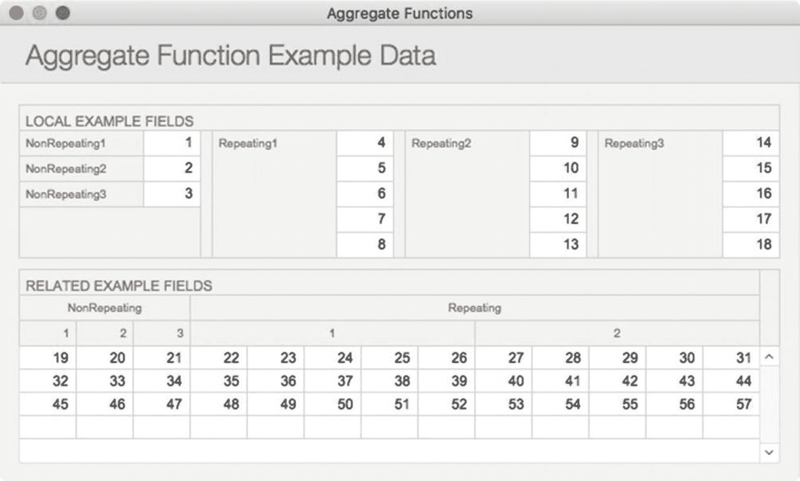

# 获取选定文本

两个 `Get` 函数允许计算式提取当前具有活动焦点的字段中选定的文本。`Get ( ActiveSelectionSize )` 函数返回所选字符的数量，而 `Get ( ActiveSelectionStart )` 函数返回字段内文本选择开始处的字符位置。这两个函数共同作用，可以提取选中的文本并用另一个值替换它。以下示例使用了本章前面讨论过的函数，演示了如何访问选区范围（假设 `联系人备注` 字段具有焦点，尽管也可以使用 `Get ( ActiveFieldContents )` 函数从任何字段提取内容）。分三步，我们获取选中的文本、选中文本之前的文本以及之后的文本。一旦将这些部分作为单独的值保存在变量中，就可以修改选区，然后重新组合，使用 `设置字段`（参见第 [25] 章(#429700_2_En_25_Chapter.xhtml)）将其放回字段，或以其他方式使用。

`Middle` 函数被调用时，第一个参数是对字段的引用。此示例将从活动字段中提取选定的文本：

```
Middle (
联系人::联系人备注 ;
Get ( ActiveSelectionStart ) ;
Get ( ActiveSelectionSize )
)
```

`Left` 函数可以提取选区之前的字符。

```
Left (
联系人::联系人备注 ;
Get ( ActiveSelectionStart ) - 1
)
```

`Right` 函数提取选区之后剩余的文本。

```
Right (
联系人::联系人备注 ;
长度 ( 联系人::联系人备注 ) - Get ( ActiveSelectionStart ) - Get ( ActiveSelectionSize) + 1
)
```

## 聚合数据

`聚合` 函数可以汇总字段，并对数字、日期和时间执行统计计算。每个函数都可以接受单个重复字段或非重复、重复或相关字段的列表：`平均值`、`计数`、`列表` 和 `总和`。由于行为上的相似性以及可能的输入组合数量众多，本节中的所有示例都使用与图 13-2 中所示相同的数据。



图 13-2

一组本地和相关字段，带有用于本节所有示例的简单值

### 平均值

`平均值` 函数计算一个或多个字段中所有值的平均值。它可以接受单个重复或相关数字字段，或使用分号分隔符的多个数字字段（无论是否重复）。

```
平均值 ( 字段 )
平均值 ( 字段 1 ; 字段 2 ; 字段 3 ; 等等 )
```

#### 将平均值函数与本地字段一起使用

一个非重复本地字段的列表将根据所提供的字段中包含的所有值返回平均值：

```
平均值 ( 示例::非重复 1 ; 示例::非重复 2 ; 示例::非重复 3 )
// 结果 = 2
```

一个单个的重复本地字段将根据该字段中包含的所有值返回平均值：

```
平均值 ( 示例::重复 1 )
// 结果 = 6
```

在非重复计算中使用的重复本地字段列表，将根据所提供字段的第一次重复值返回平均值：

```
平均值 ( 示例::重复 1 ; 示例::重复 2 ; 示例::重复 3 )
// 结果 = 9
```

在重复计算中使用的重复本地字段列表，会根据所提供字段的相应重复项，返回结果中每次重复的平均值：

```
平均值 ( 示例::重复 1 ; 示例::重复 2 ; 示例::重复 3 )
// 重复 1 = 9
// 重复 2 = 10
// 重复 3 = 11
// 重复 4 = 12
// 重复 5 = 13
```

#### 将平均值函数与相关字段一起使用

一个单个的、非重复的相关字段，将根据执行计算的本地记录相关的每条记录的该字段的所有值返回平均值：

```
平均值 ( 相关::非重复 1 )
// 结果 = 32
```

一个非重复相关字段的列表，将根据为第一条相关记录提供的字段的值返回平均值：

```
平均值 ( 相关::非重复 1 ; 相关::非重复 2 ; 相关::非重复 3 )
// 结果 = 20
```

一个单个的、重复的相关字段，将根据与执行计算的本地记录相关的每条记录中的每个重复项的值返回平均值：

```
平均值 ( 相关::重复 1 )
// 结果 = 37
```

在非重复计算中使用的重复相关字段列表，将根据与执行计算的本地记录相关的第一条记录中这些字段的第一次重复值返回平均值：

```
平均值 ( 相关::重复 1 ; 相关::重复 2 )
// 结果 = 24.5
```

在重复计算中使用的重复相关字段列表，会根据与执行计算的本地记录相关的第一条记录中每个字段的相应重复项的值，返回平均值的每次重复结果：

```
平均值 ( 相关::重复 1 ; 相关::重复 2 )
// 重复 1 = 24.5
// 重复 2 = 25.5
// 重复 3 = 26.5
// 重复 4 = 27.5
// 重复 5 = 28.5
```

### 计数

`计数` 函数统计一个或多个字段中值的数量。尽管此处显示的示例统计的是数字值列表，但该函数会统计任何类型的数据文件。例如，“8¶10¶2”和“Mon¶Tues¶Wed”都包含三个值。

```
计数 ( 字段 )
计数 ( 字段 1 ; 字段 2 ; 字段 3 ; 等等 )
```

#### 将计数函数与本地字段一起使用

一个非重复本地字段的列表将根据所提供的字段中包含的所有值返回非空值的总数：

```
计数 ( 示例::非重复 1 ; 示例::非重复 2 ; 示例::非重复 3 )
// 结果 = 3
```

一个单个的重复本地字段将根据该字段中包含的所有值返回非空值的总数：

```
计数 ( 示例::重复 1 )
// 结果 = 5
```

在非重复计算中使用的重复本地字段列表，将根据所提供字段的第一次重复值返回非空值的总数：

```
计数 ( 示例::重复 1 ; 示例::重复 2 ; 示例::重复 3 )
// 结果 = 3
```

在重复计算中使用的重复本地字段列表，会根据所提供字段的相应重复项，返回结果中每次重复的非空值总数：

```
计数 ( 示例::重复 1 ; 示例::重复 2 ; 示例::重复 3 )
// 重复 1 = 3
// 重复 2 = 3
// 重复 3 = 3
// 重复 4 = 3
// 重复 5 = 3
```


## 使用带有相关字段的 Count 函数

一个*单相关的非重复字段*将基于与执行计算的本地记录相关的每条记录中该字段的所有值，返回非空值的总计数：

```
Count ( Related::NonRepeating1 )
// result = 3
```

一个*相关的非重复字段列表*将基于提供给第一个相关记录的字段中的值，返回非空值的总计数：

```
Count ( Related::NonRepeating1 ; Related::NonRepeating2 ; Related::NonRepeating3 )
// result = 3
```

一个*单相关的重复字段*将基于与执行计算的本地记录相关的每条记录的每个重复项中的值，返回非空值的总计数：

```
Count ( Related::Repeating1 )
// result = 15
```

一个*相关的重复字段列表*在*非重复计算*中使用时，将基于与执行计算的本地记录相关的第一条记录的这些字段的第一个重复项中的值，返回非空值的总计数：

```
Count ( Related::Repeating1 ; Related::Repeating2 )
// result = 2
```

一个*相关的重复字段列表*在*重复计算*中使用时，将基于与执行计算的本地记录相关的第一条记录中提供的每个字段的对应重复项中的值，返回非空值的总计数：

```
Count ( Related::Repeating1 ; Related::Repeating2 )
// repetition 1 = 2
// repetition 2 = 2
// repetition 3 = 2
// repetition 4 = 2
// repetition 5 = 2
```

### List

`List`函数为一个或多个字段或其他值生成一个以回车符分隔的值列表。

```
List ( field )
List ( field1 ; field2 ; field3 ; etc. )
```

#### 使用带有本地字段的 List 函数

一个*非重复本地字段列表*将基于提供的字段中包含的所有值，返回一个以回车符分隔的列表：

```
List ( Example::NonRepeating1 ; Example::NonRepeating2 ; Example::NonRepeating3 )
// result = 1¶2¶3
```

一个*单重复本地字段*将基于该字段中包含的所有值，返回一个以回车符分隔的列表：

```
List ( Example::Repeating1 )
// result = 4¶5¶6¶7¶8
```

一个*重复本地字段列表*在*非重复计算*中使用时，将基于提供的每个字段的第一个重复项，返回一个以回车符分隔的列表：

```
List ( Example::Repeating1 ; Example::Repeating2 ; Example::Repeating3 )
// result = 4¶9¶14
```

一个*重复本地字段列表*在*重复计算*中使用时，将为结果的每个重复项，基于提供的每个字段的对应重复项，返回一个以回车符分隔的列表：

```
List ( Example::Repeating1 ; Example::Repeating2 ; Example::Repeating3 )
// repetition 1 = 4¶9¶14
// repetition 2 = 5¶10¶15
// repetition 3 = 6¶11¶16
// repetition 4 = 7¶12¶17
// repetition 5 = 8¶13¶18
```

#### 使用带有相关字段的 List 函数

一个*单相关的非重复字段*将基于与执行计算的本地记录相关的每条记录中该字段的所有值，返回一个以回车符分隔的列表：

```
List ( Related::NonRepeating1 )
// result = 19¶32¶45
```

一个*相关的非重复字段列表*将基于提供给第一个相关记录的字段中的值，返回一个以回车符分隔的列表：

```
List ( Related::NonRepeating1 ; Related::NonRepeating2 ; Related::NonRepeating3 )
// result = 19¶20¶21
```

一个*单相关的重复字段*将基于与执行计算的本地记录相关的每条记录的每个重复项中的值，返回一个以回车符分隔的列表：

```
List ( Related::Repeating1 )
// result = 22¶23¶24¶25¶26¶35¶36¶37¶38¶39¶48¶49¶50¶51¶52
```

一个*相关的重复字段列表*在*非重复计算*中使用时，将基于与执行计算的本地记录相关的第一条记录的这些字段的第一个重复项中的值，返回一个以回车符分隔的列表：

```
List ( Related::Repeating1 ; Related::Repeating2 )
// result = 22¶27
```

一个*相关的重复字段列表*在*重复计算*中使用时，将基于与执行计算的本地记录相关的第一条记录中提供的每个字段的对应重复项中的值，返回一个以回车符分隔的列表：

```
List ( Related::Repeating1 ; Related::Repeating2 )
// repetition 1 = 22¶27
// repetition 2 = 23¶28
// repetition 3 = 24¶29
// repetition 4 = 25¶30
// repetition 5 = 26¶31
```

### Sum

`Sum`函数将一系列数字相加得到一个总和。

```
Sum ( field )
Sum ( field1 ; field2 ; field3 ; etc. )
```

#### 使用带有本地字段的 Sum 函数

一个*非重复本地字段列表*将基于提供的字段中包含的所有值，返回总和：

```
Sum ( Example::NonRepeating1 ; Example::NonRepeating2 ; Example::NonRepeating3 )
// result = 6
```

一个*单重复本地字段*将基于该字段中包含的所有值，返回总和：

```
Sum ( Example::Repeating1 )
// result = 30
```

一个*重复本地字段列表*在*非重复计算*中使用时，将基于提供的每个字段的第一个重复项，返回总和：

```
Sum ( Example::Repeating1 ; Example::Repeating2 ; Example::Repeating3 )
// result = 27
```

一个*重复本地字段列表*在*重复计算*中使用时，将为结果的每个重复项，基于提供的每个字段的对应重复项，返回总和：

```
Sum ( Example::Repeating1 ; Example::Repeating2 ; Example::Repeating3 )
// repetition 1 = 27
// repetition 2 = 30
// repetition 3 = 33
// repetition 4 = 36
// repetition 5 = 39
```

#### 使用带有相关字段的 Sum 函数

一个*单相关的非重复字段*将基于与执行计算的本地记录相关的每条记录中该字段的所有值，返回总和：

```
Sum ( Related::NonRepeating1 )
// result = 96
```

一个*相关的非重复字段列表*将基于提供给第一个相关记录的字段中的值，返回总和：

```
Sum ( Related::NonRepeating1 ; Related::NonRepeating2 ; Related::NonRepeating3 )
// result = 60
```

一个*单相关的重复字段*将基于与执行计算的本地记录相关的每条记录的每个重复项中的值，返回总和：

```
Sum ( Related::Repeating1 )
// result = 555
```

一个*相关的重复字段列表*在*非重复计算*中使用时，将基于与执行计算的本地记录相关的第一条记录的这些字段的第一个重复项中的值，返回总和：

```
Sum ( Related::Repeating1 ; Related::Repeating2 )
// result = 49
```

一个*相关的重复字段列表*在*重复计算*中使用时，将基于与执行计算的本地记录相关的第一条记录中提供的每个字段的对应重复项中的值，返回总和：

```
Sum ( Related::Repeating1 ; Related::Repeating2 )
// repetition 1 = 49
// repetition 2 = 51
// repetition 3 = 53
// repetition 4 = 55
// repetition 5 = 57
```

## 使用逻辑函数

*逻辑函数*用于测试条件以产生可变结果并执行其他求值函数。其中包括四个绝对必要的函数：`Case`、`Choose`、`Let`和`While`。


