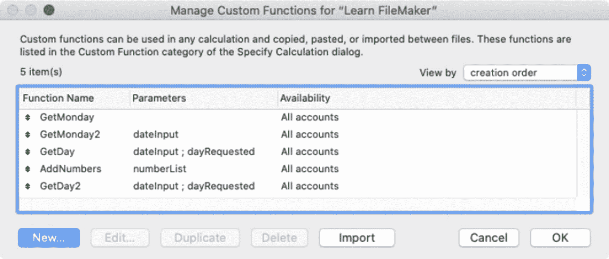
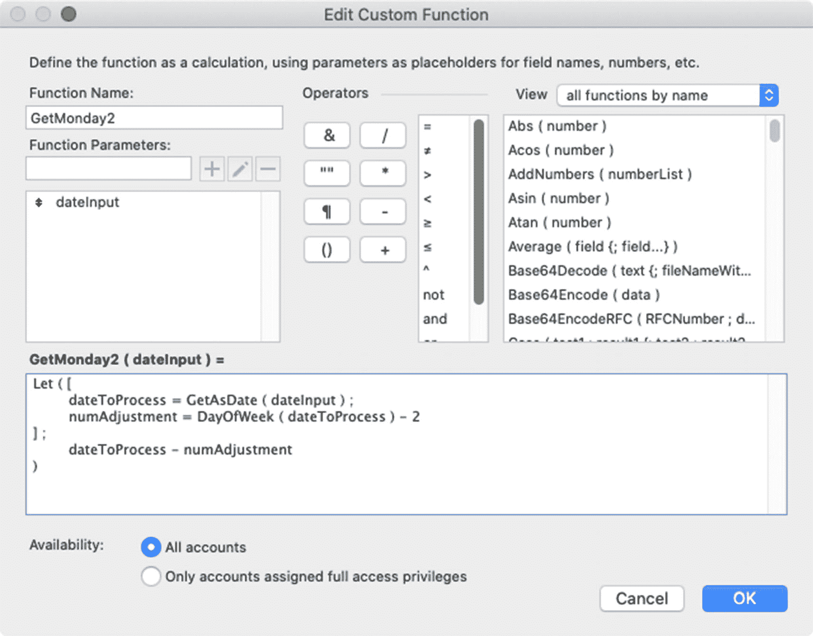
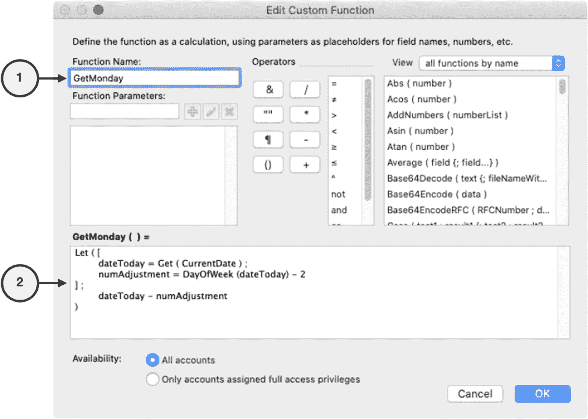

# 15. 创建自定义函数

*自定义函数*是一种由开发者定义的公式，它扩展了所在数据库中内置函数的功能。公式可以从单个公式中分离出来，置于一个易于访问的中央函数库中。与常规公式不同，自定义函数可以定义参数，可以递归，并且可以直接从数据库中的任何公式或脚本进行访问。一个设计良好、开放且可复用的自定义函数能够减少公式中的冗余，简化计算，并节省时间。在本章中，我们将讨论创建和使用自定义函数的过程，涵盖以下主题：

* 介绍"管理自定义函数"对话框
* 介绍"编辑自定义函数"对话框
* 向自定义函数添加参数
* 从自定义函数访问字段
* 构建递归自定义函数

> **注意**：只有在启用高级工具后才能创建和编辑自定义函数（第 2 章）。

## 自定义函数对话框介绍

自定义函数通过"管理自定义函数"对话框创建和管理，如图 15-1 所示。要打开该对话框，请选择"文件 ➤ 管理 ➤ 自定义函数"菜单。此对话框用于*创建*、*编辑*、*复制*、*删除*和*导入*自定义函数。



**图 15-1** — 用于管理自定义函数的对话框

> **提示**：自定义函数可以在两个文件之间复制粘贴，或通过导入方式添加。

首先，点击"新建"按钮，在"编辑自定义函数"对话框中打开一个新函数，如图 15-2 所示。创建新函数或编辑现有函数时会打开此对话框。它类似于"指定计算"对话框，但有几个重要差异。



**图 15-2** — 用于定义自定义函数的对话框

"函数名称"字段用于为函数命名，以便其他公式像调用内置函数一样调用它。

多个工具用于定义可选的"函数参数"。参数是位置性输入变量，当其他公式调用该函数时被赋予值。这些参数的工作方式类似于内置函数的参数，只是由您自行定义。输入名称并点击*加号*图标即可创建新参数。选择并重命名现有参数，然后点击*铅笔*图标保存更改。点击*减号*图标可删除参数。参数加入列表后，可通过拖拽调整顺序。由于参数是位置性的，调用函数时传递的值会插入到列表中对应位置的变量中。*更改现有函数参数的顺序将需要重新调整任何现有调用中的值的顺序*。创建完成后，双击列表中的参数可将其插入到下方的公式中。

函数的公式在公式文本区域输入。与"指定计算"对话框不同，这里没有*自动补全建议界面*，因此所有内容都必须手动输入，或使用对话框上半部分的按钮和列表插入。尽管函数在当前窗口上下文中执行且可以包含字段引用，但这些引用必须手动输入，因为此对话框上没有字段选择面板。这是因为函数可被任何字段、界面或脚本公式访问，将字段值作为参数传入函数更为安全，可避免使函数不必要地依赖于上下文。

右上角区域包含用于将运算符和函数调用插入公式的控件。底部的"可用性"选项允许选择仅向具有完全访问权限的账户开放函数（第 30 章）。

除了这些差异之外，自定义函数的编写方式与其他公式相同，并且必须遵守相同的 30,000 字符限制。

## 创建自定义函数

首先，创建一个名为 `GetMonday` 的简单无参数自定义函数，该函数使用以下公式计算当前周星期一的*日期*：

```
Let ( [
dateToday = Get ( CurrentDate ) ;
numAdjustment = DayOfWeek (dateToday) – 2
] ;
dateToday - numAdjustment
)
```

该公式使用 `Let` 语句将今天的日期存入变量 `dateToday` 中。为了确定将今天日期调整到星期一所需的天数，它使用内置函数 `DayOfWeek` 对 `dateToday` 进行转换。然后，由于我们知道星期一始终是日历周的第二天，因此从该数字中减去 2，并将结果存入变量 `numAdjustment`。最后，从今天日期中减去该调整数，得出本周星期一的日期。例如，如果今天是星期五，即一周的*第六天*。由于我们要确定对应的星期一（一周的*第二天*），因此从该数字中减去 *2*，得出需要从当前日期减去的天数，从而得到本周的星期一。无论*今天*是星期几，此公式的结果始终是对应星期一的日期。

要创建此自定义函数，请打开"管理自定义函数"对话框，点击"新建"按钮打开"编辑自定义函数"对话框。然后按照图 15-3 所示的步骤操作，首先输入名称 `GetMonday`，然后输入公式。点击"确定"按钮保存函数，然后在"管理自定义函数"对话框中点击"确定"。



**图 15-3** — 创建示例自定义函数所需的步骤

完成后，可以使用与插入内置函数相同的过程将新函数插入到任何公式中。在 `Sandbox` 表中按以下步骤进行测试：

1. 在"管理数据库"对话框中打开 `Sandbox` 表的"字段"选项卡。
2. 双击 `Example Calculation` 字段，或选中它并点击"选项"按钮。
3. 将字段的公式改为 `GetMonday`。
4. 将计算结果类型改为*日期*。
5. 点击"确定"保存计算公式并关闭"指定计算"对话框。
6. 点击"确定"保存并关闭"管理数据库"对话框。

现在，在任何记录的 `Sandbox Form` 布局上查看结果。如果包含此函数调用的计算在 2021 年 1 月 7 日（星期四）进行评估，结果应为前一个星期一：2021 年 1 月 4 日。


