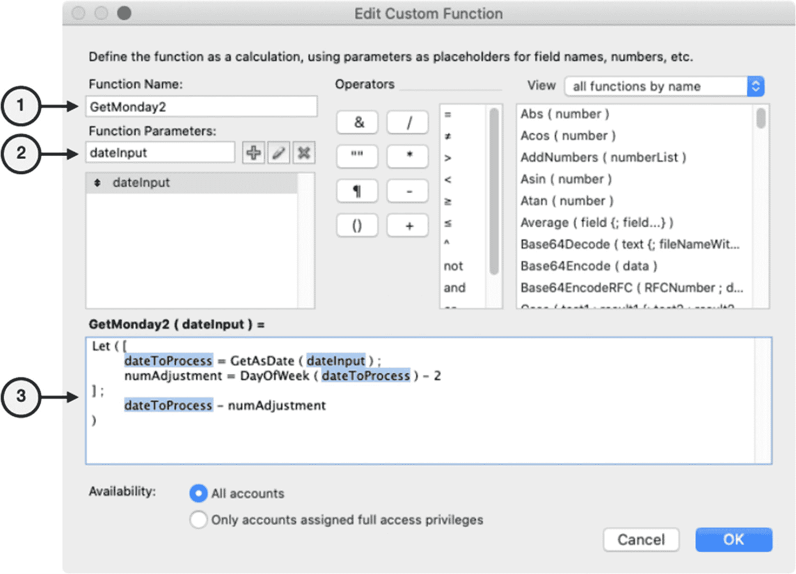
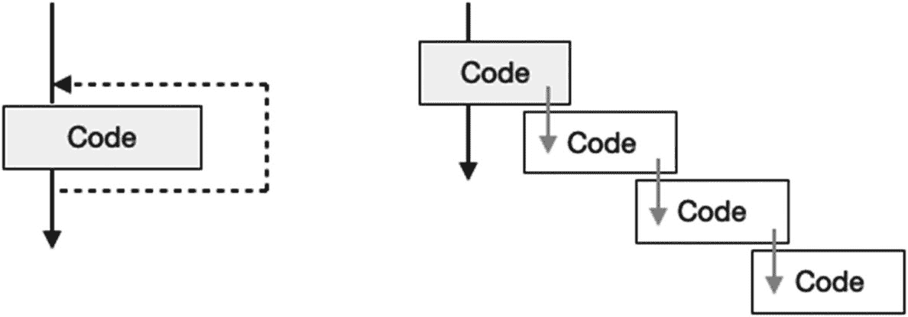

# 向自定义函数添加参数

上一个示例演示了如何构建一个简单的自定义函数。然而，由于灵活性严重受限，该函数缺乏实用性。虽然它使用了*当前日期*确实带来了一定的灵活性，并且未来也能继续工作，但它被锁定为仅能返回与今天相对的星期一。通过添加参数并修改公式，该函数可以扩展为计算*从任意起始日期起的任意指定工作日*。

如先前所述（第 12 章，“调用带参数的函数”），*函数参数*是一个每次调用函数时都可能变化的值，它允许公式将特定值传入一个*开放式的*函数中。参数提供了可变输入和/或关于应执行何种处理的指令，使函数能够适应不同情况。定义自定义函数时，可以为任何功能目的创建任意数量的参数，并随意命名。由于无法控制公式作为参数传递给函数的数据类型，请务必选择一个能描述其预期接收的数据类型的名称。例如，名为 *input* 的参数过于模糊，而 `dateInput` 或 `startDate` 则清楚地说明了期望的数据类型。在我们的示例中，我们希望向函数添加两个参数：一个名为 `dateInput` 的输入日期，以及一个名为 `dayRequested` 的目标工作日。

## 添加输入日期参数

首先，复制上一个函数，我们将其扩展，以便根据名为 `dateInput` 的参数中提供的任意起始日期来计算相应的星期一。打开*管理自定义函数*对话框，选择 `GetMonday` 函数，然后单击*复制*按钮。接着单击*编辑*按钮，在*编辑自定义函数*对话框中打开该函数，并进行如图 15-4 所示的修改。



图 15-4

修改复制的函数所需的步骤

1.  将函数名称改为 `GetMonday2`。

2.  输入参数名称 `dateInput`，然后单击 + 按钮，将其创建到下方的列表中。

3.  修改代码，使 `dateInput` 参数替代当前日期，并使用 `GetAsDate` 函数将其转换为日期。同时，将 `dateToday` 变量重命名为 `dateToProcess`：

```
Let ( [
dateToProcess = GetAsDate ( dateInput ) ;
numAdjustment = DayOfWeek ( dateToProcess ) – 2
] ;
dateToProcess - numAdjustment
)
```

保存该函数，并修改*示例计算*字段中的公式，以调用新函数。由于它会自动将输入转换为日期，因此参数可以是包含日期值的文本字段、日期字段、包含日期的文字文本字符串，或使用函数构建的日期值。以下是每种选项的示例：

```
GetMonday2 ( Sandbox::Example Text )
GetMonday2 ( Sandbox::Example Date )
GetMonday2 ( "1/7/2021" )
GetMonday2 ( Date ( 1 ; 7 ; 2021 ) )
```

保存公式，并在浏览模式下查看结果。结果应为相对于您指定的输入日期的星期一。

## 添加请求日期参数

接下来，添加一个名为 `dayRequested` 的额外参数，该参数接受一个工作日名称，并返回所提供 `dateInput` 相对于该工作日的日期。首先，复制 `GetMonday2` 函数。由于新的、扩展后的函数不再仅限于返回星期一结果，新函数的名称应改为 `GetDay`。添加第二个参数，名为 `dayRequested`。最后，按如下所示修改代码：

```
Let ( [
dateToProcess = GetAsDate ( dateInput ) ;
list = "Sunday¶Monday¶Tuesday¶Wednesday¶Thursday¶Friday¶Saturday" ;
list = Left ( list ; Position ( list ; dayRequested ; 1; 1 ) ) ;
dayNumber = ValueCount ( list ) ;
numAdjustment = DayOfWeek ( dateToProcess ) – dayNumber
] ;
dateToProcess - numAdjustment
)
```

该代码将接受 `dayRequested` 参数中的日期名称（例如，“Wednesday”），并通过在日期名称列表中查找该日期的位置，将其转换为日期数字（4）。这是通过向公式中添加三个步骤完成的。一个新的 `list` 变量被初始化为包含一个由回车符分隔的工作日名称列表。在下一行，使用 `Left` 和 `Position` 函数修改 `list` 变量，将其缩减至仅包含所请求日期之前的那些日期名称。因此，如果请求的日期是“Wednesday”，那么 `list` 将包含“Sunday¶Monday¶Tuesday¶W”。最后，使用 `ValueCount` 函数将该列表转换为工作日数字（4），并放入 `dayNumber` 变量中。该变量用于确定 `numAdjustment` 值，该值用于像先前版本一样调整输入日期。保存新函数后，修改*示例计算*中的公式以调用新函数。在此示例中，结果将是 *2021 年 1 月 4 日*所在周的*星期五*的日期：

```
GetDay ( "1/4/2021" ; "Friday" )        // 结果 = 1/8/2021
GetDay ( "1/4/2021" ; "Wednesday" )     // 结果 = 1/5/2021
```

## 添加默认日期选项

作为进一步的优化，修改函数，使其在 `dateInput` 参数未指定日期时自动使用默认日期。这为任何希望使用当前日期的公式提供了一种快捷方式。目前，如果该函数用于计算当前日期的星期五，则调用公式必须显式地在调用中包含今天的日期，如下所示：

```
GetDay ( Get ( CurrentDate ) ; "Friday" )
```

修改上一个示例中 `Let` 语句的第一行，添加一个 `Case` 语句，使其在参数中未提供日期时自动默认使用当前日期。当调用传递空字符串而非日期时，此条件将使函数能够产生结果。按如下所示修改 `Let` 语句的第一行：

```
dateToProcess = Case ( dateInput = "" ; Get ( CurrentDate ) ; GetAsDate ( dateInput ) ) ;
```

现在，公式可以通过在第一个参数中传递空字符串来请求相对于当前日期的某一天，或者通过提供具体日期来请求相对于该日期的某一天，如下面两个示例所示：

```
GetDay ( "" ; "Friday" )
GetDay ( "1/4/2021" ; "Friday" )
```


### 强调全面测试的重要性

每个公式在投入生产环境使用前都应仔细测试。自定义函数可从数据库任意位置调用，因此需要特别谨慎。对于接受参数输入的复杂函数而言尤其如此。单次测试显示函数运行正常可能并不充分，因为不同的输入可能引发公式未预料到的情况。相反，应使用多种输入执行尽可能多的测试，以确认函数能处理各种可能值的组合。

每个自定义函数的测试需求各不相同。首先要思考可能接收到哪些类型的输入。针对之前的示例，我们可以提出许多问题。如果提供的日期恰逢*周初*：是周日还是周一？如果日期恰逢*周末*：是周五还是周六？如果请求的星期几与提供的日期是相同的？函数在每种情况下是否能正常工作？当请求*任意*日期对应的*任意*星期几时，函数能否正确运行？所有预期的数据类型——*日期*、*时间戳*和*包含日期的文本字符串*——是否都能返回准确结果？为确认这一点，我们应为每个条件设计一套测试并验证结果。首先，将问题列表转化为测试场景列表，通过足够多样的输入样本来充分确认所需功能。在我们的示例中，至少应执行以下测试：

- `dateInput` – 运行七次测试，输入值涵盖一周中的每一天；同时，对每种接受的数据类型至少进行一次测试。
- `dayRequested` – 运行七次测试，涵盖一周中的每一天。

这表明至少需要进行 *16* 次测试。无需逐一手动执行，在 *示例计算* 字段中输入以下单个计算公式，就能一次性覆盖所有测试，生成一个列出所有结果的文本结果：

```
Let ( [
dateInput = Date ( 1 ; 17 ; 2021 )
] ;
"Input = " & dateInput & " (" & DayName (dateInput) & ")¶" &
"+1 Sunday=" & GetDay ( dateInput + 1  ; "Sunday" ) & "¶"
"+2 Sunday=" & GetDay ( dateInput + 2  ; "Sunday" ) & "¶" &
"+3 Sunday=" & GetDay ( dateInput + 3  ; "Sunday" ) & "¶" &
"+4 Sunday=" & GetDay ( dateInput + 4  ; "Sunday" ) & "¶"
"+5 Sunday=" & GetDay ( dateInput + 5  ; "Sunday" ) & "¶" &
"Sunday=" & GetDay ( dateInput; "Sunday" ) & "¶"
"Monday=" & GetDay ( dateInput ; "Monday" ) & "¶"
"Tuesday=" & GetDay (dateInput; "Tuesday" ) & "¶"
"Wednesday=" & GetDay ( dateInput; "Wednesday" ) & "¶" &
"Thursday=" & GetDay ( dateInput; "Thursday" ) & "¶" &
"Friday=" & GetDay ( dateInput; "Friday" ) & "¶" &
"Saturday=" & GetDay ( dateInput; "Saturday" ) & "¶"
"Timestamp=" & GetDay ( GetAsTimestamp ( dateInput )  ; "Sunday" ) & "¶" &
"Text Date=" & GetDay ( GetAsText ( dateInput )  ; "Sunday" ) & "¶" &
"Text TS=" & GetDay ( GetAsText ( GetASTimestamp ( dateInput ) )  ; "Sunday" ) & "¶"
)
// 结果 =
Input = 1/17/2021 (Sunday)
+1 Sunday=1/17/2021
+2 Sunday=1/17/2021
+3 Sunday=1/17/2021
+4 Sunday=1/17/2021
+5 Sunday=1/17/2021
+6 Sunday=1/17/2021
Sunday=1/17/2021
Monday=1/18/2021
Tuesday=1/19/2021
Wednesday=1/20/2021
Thursday=1/21/2021
Friday=1/22/2021
Saturday=1/23/2021
Timestamp=1/17/2021
Text Date=1/17/2021
Text TS=1/17/2021
```

**注意**

务必将 *示例计算* 结果的数据类型更改为“文本”，因为此测试公式返回的是文本而非`date`。

该公式使用`Let`语句将起始日期存入变量，并利用该变量重复调用函数，将结果拼接成字符串。前六个结果显示，当`dateInput`递增覆盖一整周的每一天时，对请求的周日返回的结果保持不变。接下来的七个结果显示，使用相同的`dateInput`请求不同星期几时，函数正常工作，因为结果跨越了 7 天周期。最后三个结果显示，当`dateInput`为`timestamp`、`text-based date`或`text-based timestamp`时，结果保持不变。完成此测试并确认无误后，即可放心使用此自定义函数。

## 构建递归函数

*递归函数*是一种能够生成自我引用的公式，即在其内部调用并执行自身。在 FileMaker 中，自定义函数是唯一可以进行递归的公式。递归常与循环脚本或新的`While`函数（第 13 章）中的迭代功能相混淆。尽管两者有相似之处，许多任务可用任一种方式完成，但递归实际上非常不同。在重复或*迭代过程*中，一段代码被连续执行多次；每次迭代*在下一轮开始前*完成。相比之下，*递归过程*会*在前一个实例执行期间*创建并运行同一个代码的连续新实例，其差异如图 15-5 所示。每个实例在内存中排队，形成所谓的调用栈，直到达到一个称为基础情况的终止点，此时它停止调用自身并生成一个结果，该结果沿栈向上级联返回，最终使栈折叠。



**图 15-5** 迭代循环（左）与递归（右）的区别

迭代和递归两种方案都优于限制迭代次数的硬编码语句。例如，使用`If`或`Case`语句需要在固定序列中明确写出每个可能的迭代。同样，`Let`语句可以执行固定数量的级联变量声明。虽然这对数量从不改变且不变的静态选择可行，但通常需要更动态的方法。

*循环脚本*易于设置且运行迅速。然而，脚本无法从公式内部触发，因此仅限于与界面相关的操作和事件。此外，设置起来可能很繁琐，因为它需要迭代控制变量以及执行所需功能的多行代码。

对于纯*基于公式*的解决方案，可以选择迭代性`While`函数或递归自定义函数。`While`函数的优势在于可在任何公式中使用，而递归仅限于自定义函数。递归栈的嵌套层级概念上更难理解，但使用`While`函数也并非毫无困惑之处。在简单示例中它可能显得过于冗长，在复杂示例中则令人费解。使用`While`可能速度稍快，且内存影响较小。尽管许多编程挑战可用任一种方法处理，但在处理通过层级数据进行的复杂重复过程时，递归通常是唯一实用的选择。


好的，作为一名高级文档工程师和翻译员，我将严格遵循您的注意事项和示例格式，将给定的英文文本翻译成中文。


### 构建简单的递归函数

要掌握递归函数的基本结构，请从一些简单的示例开始。首先，创建一个名为 `DateRange` 的新函数，它接受 `startDate` 和 `endDate` 参数，并使用以下公式返回范围内每一天的列表：

```
startDate &
Case (  endDate = startDate ; "" ; "¶"  & DateRange ( startDate + 1 ; endDate ) )
```

该公式将开始日期与一个 `Case` 语句的结果连接起来，该语句决定是否应发出递归调用以将日期向前递增。如果结束日期等于开始日期，则公式返回一个空字符串，从而提供一个终止的基础情况。如果两个日期不同，则包含一个段落换行符，然后函数将开始日期加一后调用自身。每次递归调用都会重复此过程，直到开始日期等于结束日期，从而生成如下例所示的结果：

```
DateRange ( GetAsDate ( "1/1/2021" ) ; GetAsDate ( "1/5/2021" ) )
// 结果 =
1/1/2021
1/2/2021
1/3/2021
1/4/2021
1/5/2021
```

创建另一个名为 `MergeValues` 的函数，它接受两个以回车符分隔的文本值列表，并返回一个混合列表。如下所示的此函数代码假定有两个参数：`column1` 和 `column2`：

```
Let ( [
current = GetValue ( column1 ; 1 ) & " " & GetValue ( column2 ; 1 ) ;
column1 = RightValues ( column1 ; ValueCount ( column1 ) - 1 ) ;
column2 = RightValues ( column2 ; ValueCount ( column2 ) - 1 )
] ;
current & Case ( column1 ≠ "" ; "¶" & MergeValues ( column1 ; column2 ) )
)
```

在此示例中，使用 `Let` 语句逐步完成任务。从两个输入中提取第一个值，并将它们连接成一个 `current` 变量，中间用空格隔开。然后，使用 `ValueCount` 和 `RightValues` 函数移除第一个值，从而将两个输入参数各减少一个值。结果是 `current` 变量中的值，如果还有剩余值，则通过段落换行符和递归调用继续该过程。以下示例调用以三个标签和电话号码作为输入，并显示相应的结果：

```
MergeValues ( "工作¶家庭¶手机" ; "555-2121¶555-3421¶555-2645" )
// 结果 =
工作 555-2121
家庭 555-3421
手机 555-2645
```

### 使用 `setRecursion` 控制递归限制

为避免递归函数未提供终止基础情况时发生无限回归，FileMaker 对递归栈可包含的迭代次数施加了限制。任何超出此限制的公式都会返回一个以问号表示的错误。在 FileMaker 18 之前，该限制因递归类型而异。使用*尾递归*（递归调用是函数公式末尾的最后一步，不留未完成处理）的函数，总递归调用限制为 50,000 次，相比之下，*头递归*（递归调用位于公式中的任何位置）之前的限制为总调用 10,000 次。然而，在版本 18 中，头递归和尾递归调用以及 `While` 函数的默认限制都是 50,000 次迭代。该版本还引入了 `setRecursion` 函数，它允许开发人员将此默认限制设置得更高或更低。

```
setRecursion ( expression ; maxIterations )
```

这是一个*条件函数*，用于设置处理其封装的 `expression` 的迭代条件。第一个参数语句中包含的任何递归函数调用或 `While` 语句将限于 `maxIterations` 参数指定的次数。这可用于*增加*或*减少*允许的最大迭代次数。例如，尝试在限制为 30 次迭代的 `setRecursion` 语句中调用之前的 `DateRange` 函数，且开始和结束日期相隔超过 30 天。此示例会失败，因为完成任务所需的递归调用超出了 30 次的限制。

```
setRecursion ( DateRange ( "1/1/2021" ; "2/10/2021" ) ; 30 )
// 结果 = ?
```

接下来，将限制增加到大于日期范围的数值，以查看其正常运行。如果上述示例的限制定为 60，则足以覆盖指定的日期范围，并且将得到正确的结果。

以下示例展示了将该函数限制增加到 250,000，以便执行一个简单的 `While` 语句，该语句将计数器递增到 200,000：

```
SetRecursion (
While (
counter = 0 ;
counter < 200000 ;
counter = counter + 1 ;
counter
) ; 250000
)
```

### 在函数内嵌入测试代码

之前我们讨论了编写测试代码，以便使用各种不同的输入快速对 `GetDay` 自定义函数执行多项测试。递归开辟了将测试代码存储在被测试的自定义函数*内部*的可能性。虽然保存测试代码可能看起来没有必要，但将来任何时候修改函数时，重新测试函数可能是明智之举。可以使用 `Case` 语句来检测测试请求并执行一组替代代码。在此示例中，`dateInput` 参数将用于确定对该函数的调用是在请求*测试结果*还是*正常操作*，并相应地运行其中的一个，如下面的模式所示：

```
Case ( dateInput = "测试" ; > ; > )
```

使用这种格式，我们可以将之前的示例测试代码与原始函数代码结合起来，将公式转换为以下组合语句。为了演示此技术，创建一个名为 `GetDay2` 的新函数，使其具有此新功能。在此示例中，如果 `dateInput` 接收到值 “测试”，它将执行测试例程；否则，它将假定参数包含一个日期并执行其正常功能。

```
Case ( dateInput = "测试" ;
//    测试代码
Let ( [
dateInput = Date ( 1 ; 17 ; 2021 )
] ;
"输入 = " & dateInput & " (" & DayName (dateInput) & ")¶" &
"1 星期日=" & GetDay2 ( dateInput + 1  ; "星期日" ) & "¶" &
"+2 星期日=" & GetDay2 ( dateInput + 2  ; "星期日" ) & "¶"
"+3 星期日=" & GetDay2 ( dateInput + 3  ; "星期日" ) & "¶" &
"+4 星期日=" & GetDay2 ( dateInput + 4  ; "星期日" ) & "¶"
"+5 星期日=" & GetDay2 ( dateInput + 5  ; "星期日" ) & "¶" &
"+6 星期日=" & GetDay2 ( dateInput + 6  ; "星期日" ) & "¶" &
"星期日=" & GetDay2 ( dateInput; "星期日" ) & "¶" &
"星期一=" & GetDay2 ( dateInput ; "星期一" ) & "¶" &
"星期二=" & GetDay2 (dateInput; "星期二" ) & "¶" &
"星期三=" & GetDay2 ( dateInput; "星期三" ) & "¶"
"星期四=" & GetDay2 ( dateInput; "星期四" ) & "¶"
"星期五=" & GetDay2 ( dateInput; "星期五" ) & "¶" &
"星期六=" & GetDay2 ( dateInput; "星期六" ) & "¶" &
"时间戳=" & GetDay2 ( GetAsTimestamp ( dateInput )  ; "星期日" ) & "¶"
"文本日期=" & GetDay2 ( GetAsText ( dateInput )  ; "星期日" ) & "¶" &
"文本时间戳=" & GetDay2 ( GetAsText ( GetAsTimestamp ( dateInput ) )  ; "星期日" ) &
)
;
//    常规代码
Let ( [
dateToProcess  = GetAsDate ( dateInput ) ;
list = "星期日¶星期一¶星期二¶星期三¶星期四¶星期五¶星期六" ;
list = Left ( list ; Position ( list ; dayRequested ; 1; 1 ) ) ;
dayNumber = ValueCount ( list ) ;
numAdjustment = DayOfWeek ( dateToProcess ) – dayNumber
] ;
dateToProcess  - numAdjustment
)
)
```

## 总结

本章涵盖了开发自己的自定义函数的基础知识，以及使它们成为递归函数的可能性。在下一章中，我们将探讨将*结构化查询语言*（SQL）与 `ExecuteSQL` 函数一起使用。


