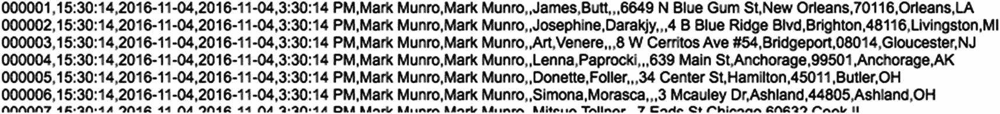

# 16.  ExecuteSQL 函数介绍

*结构化查询语言* (*SQL*) 是一种标准化的编程语言，用于管理关系型数据库，并对其存储的数据执行多种操作功能。它创建于 20 世纪 70 年代，后来成为关系型数据库的标准编程语言。*美国国家标准协会* (ANSI) 和*国际标准化组织* (ISO) 分别于 1986 年和 1987 年采纳了官方的 SQL 标准。自那以后，这两个组织联合发布了该标准的多次更新。如今，许多公司都在开发专有和开源的、符合 SQL 标准的数据库系统。虽然 FileMaker 并非基于该标准构建，但它对在内部和外部执行 SQL 查询提供了一定支持。在 9.0 版本（2007 年）中，FileMaker 引入了创建与外部 ODBC 数据源进行实时连接的功能（第 7 章）。12.0 版本（2012 年）引入了 *ExecuteSQL* 函数，该函数可以在 FileMaker 数据库内通过任意计算来对 FileMaker 表执行查询。*SQL 查询* 是一种基于文本的语句，用于指示数据库执行某项操作。最常用的查询类型，也是 FileMaker 中 *ExecuteSQL* 函数唯一支持的查询类型，是 `SELECT` 查询，它包含为所需结果集检索数据的指令。经验丰富的 SQL 程序员会欣赏此功能提供的直接后端访问，但可能会觉得其限制过于严格。其他人可能会觉得这种与 FileMaker 以界面上下文为中心的数据访问方式的差异令人困惑。但是，能够完全*独立于上下文*的方式，*在计算公式内部*直接执行搜索、排序和汇总数据，这项功能是许多人会欣赏的。由于它不会取代 FileMaker 的原生功能，因此并非学习 SQL 或使用此命令来创建数据库的必要条件。但是，在那些它能更有效补充原生功能的场景下，学习它是值得的。本章将探讨 *ExecuteSQL* 函数，涵盖以下主题：

*   定义 ExecuteSQL 函数
*   创建 SQL 查询
*   访问数据库模式

## 定义 ExecuteSQL 函数

*ExecuteSQL* 函数允许一个公式**完全独立于**当前界面上下文与关系图中任何表出现项之间的关系，直接从该关系图中的*任意*表出现项中检索数据。调用该函数必须包含三个参数：*sqlQuery*、*fieldSeparator* 和 *rowSeparator*。它还可以接受一个或多个可选的*参数*。

```
ExecuteSQL ( sqlQuery ; fieldSeparator; rowSeparator )
ExecuteSQL ( sqlQuery ; fieldSeparator; rowSeparator ; arguments )
```

语句中的参数定义如下：

*   *sqlQuery* – 文本表达式或对字段的引用，其中包含一个 `SELECT` 语句，用于指定获取所需记录和字段结果的位置及条件。
*   *fieldSeparator* – 包含一个或多个字符的文本字符串，这些字符用作结果中字段之间的分隔符。如果留空，默认使用逗号。
*   *rowSeparator* – 包含一个或多个字符的文本字符串，这些字符用作结果中记录之间的分隔符。如果留空，默认使用段落回车符。
*   *arguments* – 一个或多个文本值，用作查询中的动态参数，通常替换 `WHERE` 子句中的问号。

函数的结果将是一个文本字符串，其中每个匹配记录的每个指定字段的值都由指定的或默认的分隔符分隔。例如，使用默认分隔符时，结果将是代表记录的段落，这些段落由逗号分隔的字段值组成。

### 注意事项

这是一个*计算函数*，不应与同名的脚本步骤混淆！

### 理解 ExecuteSQL 的局限

*ExecuteSQL* 函数有一些需要注意的重要限制。经验丰富的 SQL 程序员可能会期望某些功能不被支持，而经验丰富的 FileMaker 开发者可能会错误地假设某些功能。

*   如引言所述，该函数目前仅限于 `SELECT` 命令。它*不支持*任何其他常见的 SQL 函数，例如执行记录更改或修改模式的 `DELETE`、`INSERT`、`UPDATE`、`INSERT INTO`、`CREATE TABLE`、`DELETE TABLE` 等。
*   函数不识别也不要求使用 FileMaker 的关系连接。`SELECT` 语句必须使用 `JOIN` 子句来动态创建用于查询内的临时关系。
*   该函数不识别当前布局上下文。相反，它会根据指定的*表出现项*直接访问一个*表*。
*   *必须*使用符合 SQL-92 标准的日期和时间格式（不带花括号）将值传递给函数。要在查询中应用正确的格式，请使用 `DATE`、`TIME` 或 `TIMESTAMP` 条件运算符，否则该值可能会被当作字面字符串处理。它*不会*接受花括号中包含的 ODBC/JDBC 格式的 *date*、*time* 和 *timestamp* 常量。
*   该函数将使用 Unicode/SQL 格式返回 *date*、*time* 和 *number* 数据，而不是使用数据库文件或操作系统的日期和时间设置。因此，这些数据必须进行转换才能在 FileMaker 中用作日期。
*   函数执行的排序使用 Unicode 二进制排序顺序。

## 创建 SQL 查询

`ExecuteSQL` 函数的 `sqlQuery` 部分至少需要一个 `SELECT` 语句，该语句可以包含多个可选的子句，并且这些子句可用于执行多种不同的数据检索任务。


### 定义 SELECT 语句

当调用 `ExecuteSQL` 函数时，`sqlQuery` 参数必须包含一个格式正确的 `SELECT` 语句。最低限度下，该语句需定义要查找的*内容* 及其*来源*，遵循如下所示模式：

```
SELECT <内容> FROM <来源>
```

通常，*内容* 是一个或多个字段的名称，而*来源* 则是要从中提取这些字段的表出现项（table occurrence）的名称。例如，以下示例将返回 `Contact` 表出现项中每条记录的 `Name` 字段内容：

```
SELECT Name FROM Contact
```

上述代码展示了一个最简单语句的示例，请求*来自所有记录的一个字段*。还有许多可选的子句，如下所示，并在表 16-1 中进行了简要定义：

**表 16-1** `SELECT` 语句中每个可用子句的定义  

| 关键字 | 子句描述 |
| --- | --- |
| `SELECT` | 指定要选择的一个或多个字段。可以包含字段、常量、计算和函数。使用星号选择所有字段。 |
| `SELECT DISTINCT` | 添加 `DISTINCT` 操作符将从结果中移除任何重复项。 |
| `FROM` | 指定要从中选择字段的一个或多个表。 |
| `JOIN` | 定义一个表和关联公式，以便结果能够通过临时关系包含字段。 |
| `WHERE` | 定义一个或多个条件公式，用于指定结果中记录需满足的资格。 |
| `GROUP BY` | 标识一个或多个用于汇总结果的选定字段。 |
| `HAVING` | 定义一个或多个公式，用于指定包含分组结果的条件。`HAVING` 之于 `GROUP BY` 就如同 `WHERE` 之于 `SELECT`。 |
| `UNION` | 用于将两个或多个 `SELECT` 语句合并为一个结果。 |
| `ORDER BY` | 标识一个或多个用于对结果排序的选定字段。 |
| `OFFSET` | 在选定集中指定一个起点，用于确定将包含在结果中的记录。 |
| `FETCH FIRST` | 指定应从起点检索的记录数量，起点可以是第一条记录或由 `OFFSET` 指定的记录。 |
| `AS` | 为表名创建简短的别名，该别名可在语句的其他位置用作前缀来标识字段所属的表，尤其在涉及多个表时（例如使用 `JOIN` 子句时）。 |

```
SELECT/SELECT DISTINCT <选择字段>
FROM <表名>
JOIN <表名> ON <公式>
WHERE <条件公式>
GROUP BY <分组字段列表>
HAVING <分组条件>
UNION <选择语句>
ORDER BY <排序字段列表>
OFFSET <起始行> ROW/ROWS
FETCH FIRST <行数> PERCENT/ROWS/ROW/ONLY/WITH TIES
```

#### 格式要求

编写 `SELECT` 语句时，需要记住一些格式要求。包括：

-   **命令和对象名称** – 查询中的表名、字段名和语句命令*不* 区分大小写。然而，将 SQL 命令和操作符大写有助于在视觉上将其与字段值和条件值区分开。
-   **条件** – 字面量条件（例如在 `JOIN`、`WHERE` 和 `HAVING` 子句中使用的）*区分*大小写，如果大小写不匹配，将无法定位到匹配的值。此外，所有文本条件*必须* 用单引号括起来。
-   **名称分隔符** – 在列出多个表和字段时，务必在其间使用逗号加空格作为分隔符。
-   **引号** – 表名和字段名不需要用双引号括起来，*除非它们包含空格*。以非字母字符开头的表名必须用双引号括起来，即使它们不包含空格。由于 `SELECT` 语句本身被包含在引号中，因此内部使用的引号必须使用反斜杠进行转义。

### 使用 SELECT 语句

尽管 `SELECT` 语句是 `ExecuteSQL` 函数唯一支持的语句，但它的功能非常强大。在深入研究许多不同的可选子句之前，让我们先探讨基本语句并讨论有效使用它的技巧。

#### 选择整个表

最基本的查询是*每条记录*的*每个字段*都被选中的查询。这可以通过一个简单的语句实现。

```
SELECT * FROM <表名>
```

该语句必须*始终*以单词 `SELECT` 开头，后跟要选择的字段以及来自哪个表的指示。在此例中，星号告知 FileMaker 选择*所有字段*。前面示例中显示的 `<表名>` 占位符被替换为实际表出现项的名称，函数将访问该表出现项的基础表。以下示例中的 `SELECT` 语句将获取 `Contact` 表中的所有字段：

```
SELECT * FROM Contact
```

将其放入引号中，并用作 `ExecuteSQL` 语句的第一个参数，如下例所示：

```
ExecuteSQL ( "SELECT * FROM Contact" ; "" ; "" )
```

在 *Learn FileMaker* 数据库的 *示例计算* 字段中输入此公式。确认 *计算结果类型* 设置为返回*文本* 后，保存公式，然后在浏览模式下字段中应显示如图 16-1 所示的结果。结果的每个段落都是一条单独的记录，包含按创建顺序排列的每个字段值的逗号分隔列表。

  
**图 16-1** SQL 查询结果示例

> **注意：** 尽管本章中的示例假设该公式在计算字段中使用，但它们可以在任何公式中使用。

#### 选择单个字段

对于你不需要表中*每条记录*的*每个字段*的情况，`SELECT` 语句可以指定单个字段。

##### 指定单个字段

要从 `Contact` 表中选择*单个字段*，请将星号替换为字段名称，如果字段名称包含空格，请记得将其放在转义引号中。以下公式从 `Contact` 表的每条记录中选择 `Contact Address City` 字段。这将生成一个以回车符分隔的城市名称列表。请注意，该列表包含*每条*记录的字段值，因此会包含许多重复项。

```
ExecuteSQL ( "SELECT \"Contact Address City\" FROM Contact" ; "" ; "" )
// 结果 =
Hamilton
Ashland
Chicago
San Jose
Sioux Falls
San Jose
Ashland
...等...
```

##### 指定多个字段

要选择*多个字段*，请将其列在一个以逗号加空格分隔的字符串中：

```
SELECT <字段 1>, <字段 2>, <字段 3> FROM <表名>
```

例如，要从 `Contact` 表中选择 `Contact Address City` 和 `Contact Address State` 字段，请使用以下公式。此语句的结果将是一个以逗号分隔的城市和州名称列表。

```
ExecuteSQL (
"SELECT \"Contact Address City\", \"Contact Address State\" FROM Contact" ; "" ; ""
)
// 结果 =
Hamilton,OH
Ashland,OH
Chicago,IL
San Jose,CA
Sioux Falls,SD
San Jose,CA
Ashland,OH
...等...
```

#### 使用 SELECT DISTINCT 获取唯一值

要自动按字母顺序排列结果并移除重复项，请使用 `SELECT DISTINCT` 命令。以下示例将从 `Contact` 表的 `Contact Address City` 字段生成一个按字母顺序排序的唯一值列表：

```
"SELECT DISTINCT \"Contact Address City\" FROM Contact"
```

结果的唯一性基于*整个记录值*，而不是其中的单个字段。例如，当仅选择城市时，结果将仅包含 "San Jose" 的一个条目。但是，如果选择了多个字段，如下例所示的街道地址和城市，则结果将包含 San Jose 的多个条目，因为完整的记录现在包含了其他值。例如，"123 First Street,San Jose" 与 "1837 Fifth Ave,San Jose" 并不完全相等，因此两者都会包含在结果中。

```
"SELECT DISTINCT \"Contact Address Street\", \"Contact Address City\" FROM Contact"
```


好的，作为高级文档工程师和翻译员，我将严格按照您的要求，将给定的英文文本翻译成中文，并保留所有格式和代码块。


#### 重新格式化 SELECT 语句以提高清晰度

与前面简短易读的示例不同，`SELECT` 语句会迅速变得复杂并换行至多行。有两种技术可用于重新格式化语句并避免视觉混乱：添加额外空格和使用 `Let` 语句。

##### 使用制表符和段落回车添加额外空格

FileMaker 会忽略 `sqlQuery` 文本字符串中的段落回车和制表符，因此可以使用这些字符将语句分隔成可读的块，如下模式所示。通过组合使用制表符和段落回车，可以将语句的每个子句放在单独的行上，并缩进以使其从外部语句中突出。遵循此模式将使语句更易于阅读：

```
ExecuteSQL ( "
SELECT 
FROM 
JOIN  ON 
WHERE 
ORDER BY 
" ; "" ; "" )
```

当使用多个字段、查找条件或其他组件时，可以将它们推到单独的行上，并进一步缩进以提高清晰度，如下模式所示：

```
ExecuteSQL ( "
SELECT
,
,

FROM 
JOIN  ON 
WHERE
 and
 and

ORDER BY
,

" ; "" ; "" )
```

##### 使用 LET 语句

消除复杂查询视觉混乱的另一种方法是使用 `Let` 语句。整个 `SELECT` 查询可以分部分构建，使用单独的变量，最终组合成单个变量并插入到 `ExecuteSQL` 语句中，如下例所示：

```
Let ( [
sFields = "SELECT " ;
sTable = "FROM  " ;
sJoin = "JOIN  ON  " ;
sWhere = "WHERE  " ;
sGroup = "GROUP BY  " ;
SQL = sFields & sTable & sJoin & sWhere & sGroup
] ;
ExecuteSQL ( SQL ; "" ; "" )
)
```

提示：创建一个自定义函数来接受字段引用和其他条件，并返回查询语句。

#### 探索别名的好处

`别名`是一个简短的文本字符串，可以在 `SELECT` 语句的其他地方充当表名的代理。当一个 `SELECT` 语句包含对多个表的重复引用时（例如在 `JOIN` 子句中，本章稍后讨论），可以使用别名来标识包含某个字段的表。尽管别名可以由任意数量的字符组成，但作为节省空间的方法，越短越好。要建立别名，请在标识表之后使用 `AS` 子句，并跟一个文本别名，如下模式所示：

```
SELECT  FROM  AS 
```

例如，要为 `Contact` 表创建别名 `c`，请按如下格式：

```
SELECT  FROM Contact AS c
```

一旦建立了别名 `c`，它就可以在任何子句中用作任何字段名的前缀，以标识该字段所属的表。虽然从单个表中选择字段时不需要别名，但以下示例演示了别名的工作原理。请注意，别名是在语句末尾定义的，但可以在前面的子句中使用。

```
SELECT c.Notes FROM Contact AS c
```

当名称中包含空格的字段用双引号括起来时，别名前缀应位于引号外的名称之前。

```
SELECT c.\"Contact First Name\" FROM Contact AS c
```

尽管在以下简短的示例中别名不是必需的，但为了演示带或不带别名的格式，以下每个语句都会生成完全相同的结果：

```
SELECT Notes FROM Contact
SELECT Contact.Notes FROM Contact
SELECT c.Notes FROM Contact AS c
```

注意：别名将在本章后面的更复杂示例中使用。

### 在字段列表中插入文字文本

文字文本字符串可以插入到 `SELECT` 语句中的字段名称之前、之间和之后，并且会为每条记录重复显示在结果中。文字必须用单引号括起来，并用逗号分隔。此示例演示了在字段结果中插入了一个 `'Name:'` 标签。

```
ExecuteSQL ( "
SELECT
'Name: ',
\"Contact Name First\",
\"Contact Name Last\"
FROM Contact"
; " " ; "" )
// 结果
Name: Cynthia,Johnson
Name: Karen,Camacho
Name: Sandy,Robinson
Name: Thomas,Smithfield
```

### 连接结果

查询可以包含使用 `连接`（将事物链接在一起形成链条或系列的操作）将单独的字段值预处理为组合结果的指令。不是接收原始的、逗号分隔的字段名称集（这需要进一步解析和处理），连接提供了更有用的结果。这可以使用 `+` 或 `||` 运算符来实现，尽管后者更可靠，且不太可能与数学计算中使用的相同运算符混淆。以下示例查询显示了名字和姓氏被连接成一个字符串，并在它们之间插入了一个空格：

```
ExecuteSQL ( "
SELECT \"Contact Name First\" || ' ' || \"Contact Name Last\"
FROM Contact
" ; "" ; "" )
// 结果
Cynthia Johnson
Karen Camacho
Sandy Robinson
Thomas Smithfield
```

或者，使用加号分隔符会产生相同的结果。

```
SELECT \"Contact Name First\" + ' ' + \"Contact Name Last\"
```

在前面两个简单的示例中，通过在 `fieldDelimiter` 参数中放置一个空格也可以获得相同的结果。但是，当选择更多字段时，连接允许在不同字段集之间使用不同的分隔符，而字段分隔符对于每个字段都是相同的。以下示例展示了一个更现实的例子，它结合使用连接和自定义分隔符，将联系人的全名和邮寄地址作为三段式结果返回。名字-姓氏和城市-州-邮政编码分别被连接，然后自定义字段和记录分隔符将结果格式化为邮寄地址列表。

```
ExecuteSQL ( "
SELECT
\"Contact Name First\" + ' ' + \"Contact Name Last\",
\"Contact Address Street\",
\"Contact Address City\" + ', ' +
\"Contact Address State\" + ' ' +
\"Contact Address Zip\"
FROM Contact" ; "¶" ; "¶¶" )
// 结果
Cynthia Johnson
123 Main Street
Youngstown, OH 44504
Karen Camacho
42 Memory Lane
Brooklyn, NY 11111
Sandy Robinson
631 Front Street
Lafayette, IN 47901
```

### 使用 WHERE 子句

向 `SELECT` 语句添加 `WHERE` 子句允许查询根据搜索条件定位特定记录。`<formula>` 部分可以包含一个或多个表达式，这些表达式定义了用于匹配记录的条件，通常包括一个字段、一个运算符和一个搜索值。

```
SELECT  FROM  WHERE 
```

#### 创建包含单个表达式的 WHERE 子句

要将结果限制为来自加利福尼亚州的联系人，`WHERE` 公式将由字段名称（如果需要则加引号）、作为运算符的等号和单引号中的 `'CA'` 组成。以下示例通过请求该州内每个联系人的名字和姓氏来演示这一点。请记住，当将其插入到 `ExecuteSQL` 函数调用中时，整个语句将用引号括起来，并且字段名称周围的引号需要用反斜杠进行转义。

```
SELECT
"Contact Name First",
"Contact Name Last"
FROM Contact
WHERE "Contact Address State" = 'CA'
```

#### 创建包含多个表达式的 WHERE 子句

对于复杂条件，`WHERE` 子句可以包含多个搜索表达式，这些表达式由比较运算符 `AND` 或 `OR` 分隔。例如，当搜索居住在一个许多州都有的城市（如 `'Milford'`）的联系人时，使用两个表达式来指定城市和州。为此，在两个表达式之间使用 `AND` 运算符，要求结果同时匹配两个条件。

```
WHERE "Contact Address City" = 'Milford' AND "Contact Address State" = 'PA'
```

类似地，要查找来自两个不同州（例如，来自宾夕法尼亚州或俄亥俄州）的联系人，请使用 `OR` 运算符以允许结果包含来自任一表达式的结果。

```
WHERE "Contact Address State" = 'PA' OR "Contact Address State" = 'OH'
```


