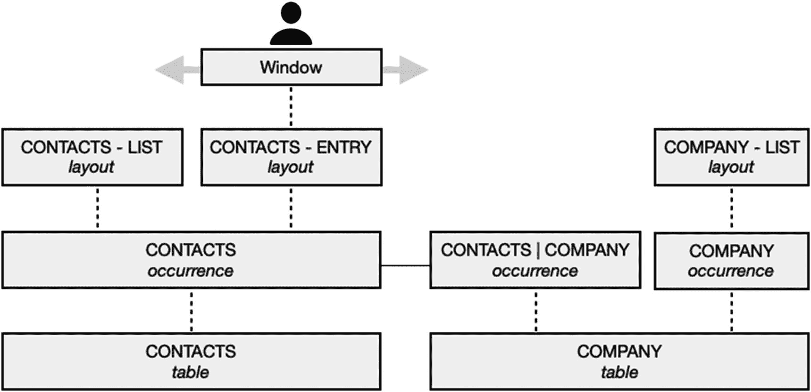

# 理解上下文访问

每个布局都分配了一个表出现，并充当一个*界面上下文*，该上下文对应于该分配的*关系上下文*。这从后端数据向用户界面延伸出一个特定的关系视角，形成一个交叉的上下文点，用户和脚本可以在此创建、删除、编辑、查找、打印和查看存储在基础表中的记录。该出现分配决定了在布局处于当前状态时可以访问哪些记录和字段。任何属于布局表出现本地的字段，或者与表出现相关的其他出现中的字段，都可以放置在布局上、供用户查看，并用于嵌入到布局对象、脚本和菜单中的计算。

图 17-1 中的插图展示了一个用户正在查看*联系人 – 录入*布局，该布局通过主要*联系人*表出现的上下文显示来自*联系人*表的记录。任何来自*联系人*表并放置在该布局上的字段，都将呈现当前正在查看的记录所存储的值。此外，通过*联系人 | 公司*出现，可以将来自*公司*表的字段放置在布局上。这将根据两个出现之间的关系标准自动拉取记录，并仅显示匹配的记录（第 9 章）。*联系人 – 列表*布局分配了相同的出现，因此它显示来自相同关系上下文的记录。在同一窗口中切换这两个联系人布局将保留当前记录和当前找到集。相比之下，*公司 – 列表*布局通过主要的*公司*出现显示来自*公司*表的记录，但不能包含来自*联系人*表的字段，因为这两个出现目前没有关联。

**图 17-1**  
表、出现、布局和窗口如何相互连接以呈现界面的示意图

