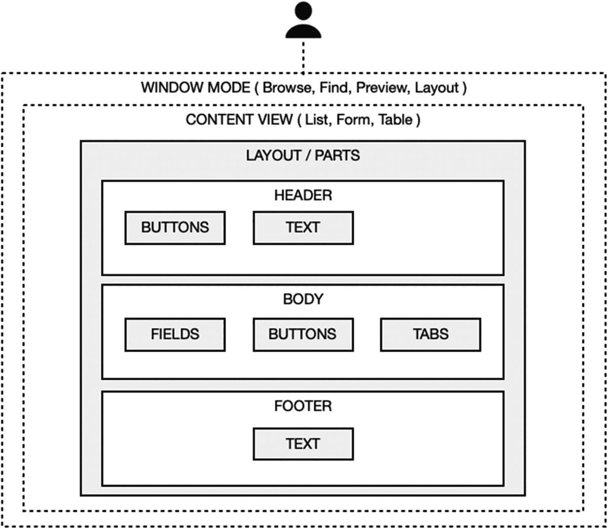

# 剖析布局

*布局*是一个可配置的空间，包含一个或多个水平区域的堆栈，这些区域构成单个屏幕或页面。如后续章节所述，这些*布局部分*有多种类型，每种类型都具有固有的和可配置的属性，这些属性决定了它们的渲染外观和行为。根据布局的功能需求，可以添加、重新排列和配置不同组合的部分。放置在部分上的字段和其他对象具有其自身的固有和可配置属性。这些元素共同定义了一个布局。在浏览模式下渲染时，当用户或脚本从开发者启用的*内容视图*中选择或更改窗口模式时（第 3 章），布局可以以不同的方式查看。图 17-2 中的插图使用一个简单布局的示例展示了常规的布局结构，以及控制其如何为用户渲染的各种查看选项。

**图 17-2**  
布局结构示意图

