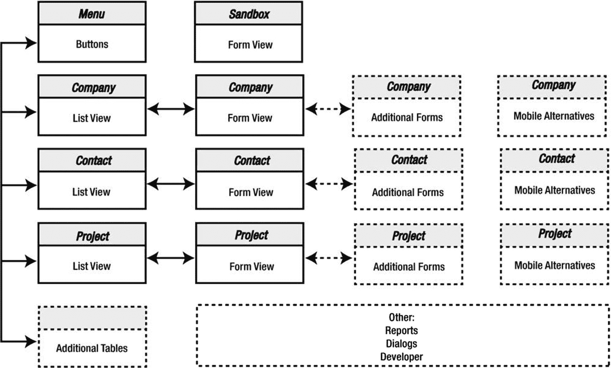

# 规划布局

布局的复杂性将根据其用途、特定工作流程的需求、预算限制以及开发设计人员的技能而有所不同。一个快速构建的类似电子表格的表格视图可以提供满足特定需求的临时简便性。在充满经验丰富的专业用户的现代工作场所中，更精致的设计通常更合适，甚至可能是期望的。设计不佳的布局会变得杂乱、令人困惑、视觉上如同噩梦，从而挫伤用户的工作能力。这样的“解决方案”往往带来的问题比解决的更多。一个设计良好的布局，范围可以从朴素但实用的设计，一直到艺术表现、功能强大、可视化高效、预测用户需求并以便捷直观的方式提供强大省时工具来操作和重新利用数据的图形化杰作。无论采用何种方法，布局设计和规划都很重要。用户与数据库的整个体验都是*通过*布局进行的。该布局设计的外观和功能将极大地影响他们对数据库以及作为其开发者的*您的*评价。

> **警告**  
> 在学习或构建概念验证时，设计可以暂时不那么重要。本书中的示例仅出于演示目的而简单创建，并不旨在作为优秀设计的范例！

在设计界面时，首先为你为每个表设想的布局列出清单。通常，每个表至少需要一个列表布局和一个表单布局，以允许用户执行基本功能，例如，滚动查找集以定位所需记录，然后导航到展开的布局进行查看和数据录入。除此之外，布局将根据信息的性质、公司工作流程以及其他考虑因素而有所不同。有些表需要用于打印信封、标签或财务报表的布局。其他表则需要用于特殊数据录入任务或与移动设备小屏幕交互的布局。可以创建布局作为告知和引导用户的对话框，或者提供针对特定任务优化的工作区。在开发期间甚至部署后，可以随时添加额外的布局，因此不必预先规划每一个布局。但一个好的初始计划很重要。

在创建了所需布局的列表后，将它们连接成一个导航流程图，以帮助直观地了解用户将如何在界面中移动。即使是一张粗略的草图也很有帮助，例如图 17-3 中所示。该图显示了*学习 FileMaker*数据库的粗略表示，其中包含一个添加的菜单布局和用于假设的未来布局的各种占位符。请记住，导航箭头说明了布局之间的大致界面连接。在实际界面中，导航功能可能复杂得多，具体取决于表的数量、它们之间的关系、你开发的导航控件样式以及其他因素。目前，此图只是为你提供了一个流程的“大图”概览。一旦你至少有了一份粗略的计划，就可以进入布局模式并开始探索用于设计界面的环境。

**图 17-3**  
一个带有扩展占位符的简单布局流程的粗略草图

布局名称可以采用你想要的任何形式。理想情况下，它们包含所代表表的名称以及描述其一般功能的某些内容。尽管 FileMaker 允许布局同名，但请保持名称唯一以避免混淆。*学习 FileMaker* 演示文件使用主表的名称作为主要表单布局的名称，对于其他布局，则使用相同名称加上描述符，例如*发票*、*发票列表*和*发票报表*。

