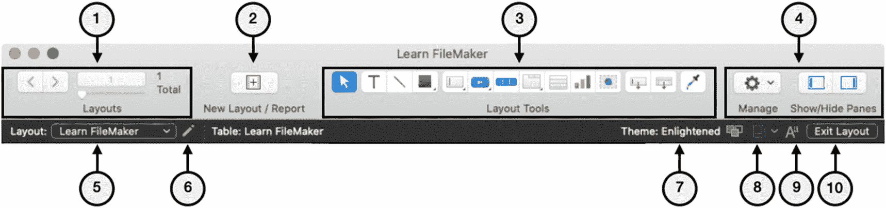
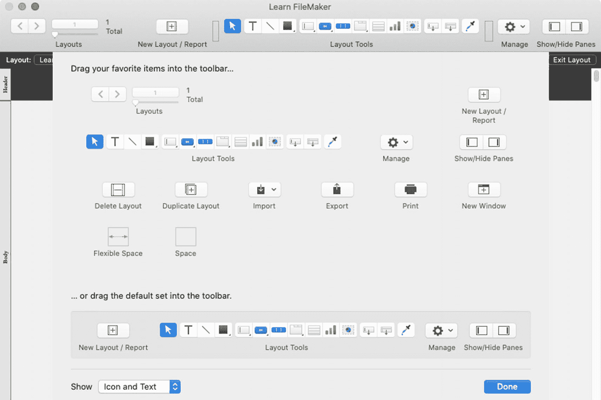
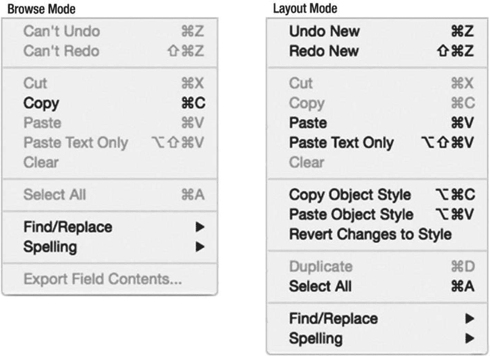
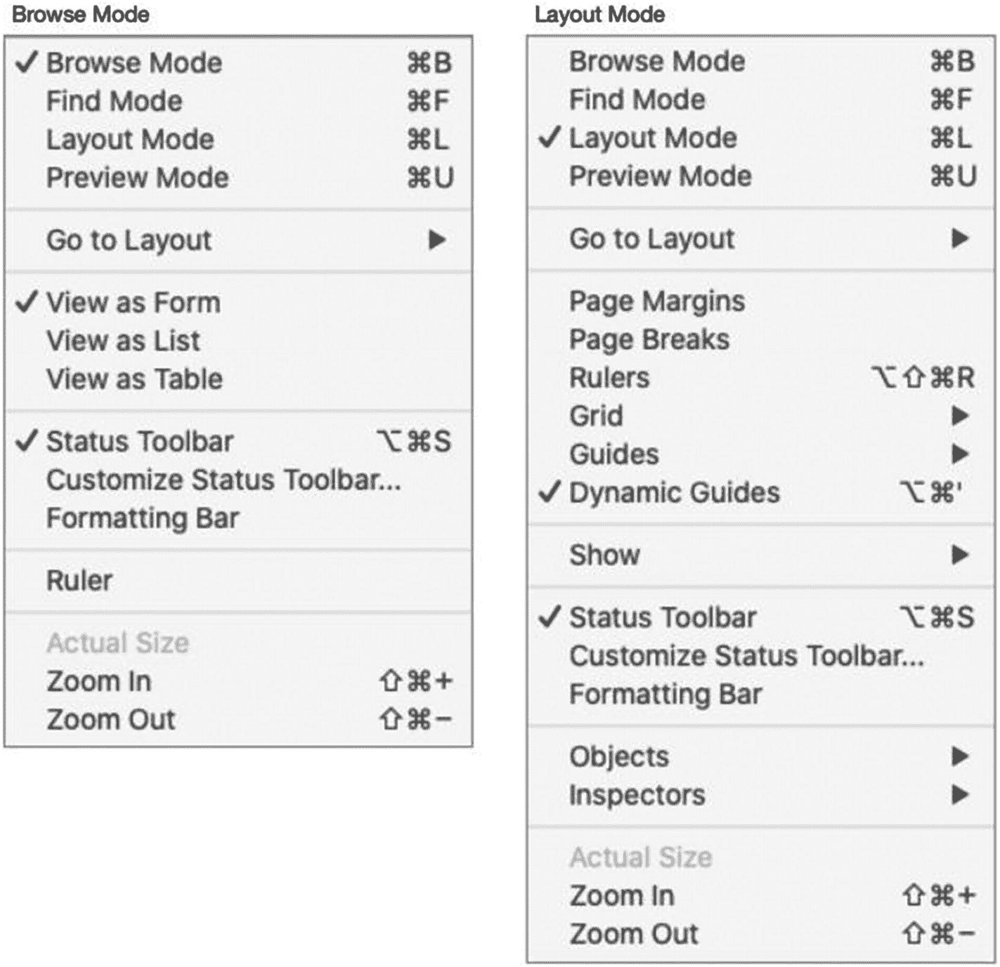

# 使用布局模式

`布局模式`是一种备选窗口状态，在此状态下，整个应用程序环境会进行转换，以适应布局设计工作。在此模式下，工具栏按钮和菜单项会发生变化，以提供对界面相关功能的控制。窗口的每一侧都有可选的布局窗格，用于访问字段、对象、插件和配置设置（第 19 章）。整个内容区域变为一个可编辑的工作区，您可以在其中添加、配置对象并设置其样式，以控制它们在其他模式下的呈现方式（第 20 章和第 21 章）。可以通过选择 `查看 ➤ 布局模式` 菜单或单击工具栏中的 `编辑布局` 按钮来启动布局模式。

## 状态工具栏（布局模式）

当窗口进入布局模式时，工具栏中可用的选项将发生显著变化。用于管理记录和执行数据输入任务的浏览模式控件将被用于向布局添加对象和执行其他设计相关功能的工具所取代。可用的控件要么是默认的布局模式项目，要么是用户自定义的集合。

### 默认状态工具栏项目（布局模式）

布局模式的默认状态工具栏如图 17-4 所示。

图 17-4

布局模式的状态工具栏

1.  导航控件
2.  新建布局/报表按钮
3.  布局工具
4.  开发者菜单和窗格切换
5.  布局菜单
6.  布局设置按钮
7.  主题选择
8.  屏幕和设备尺寸菜单
9.  格式化栏按钮
10. 退出布局按钮

#### 导航控件

工具栏左上角是导航控件，它们的外观和功能与浏览模式（第 3 章）相似，但区别在于它们指的是并控制*布局*而非*记录*。总数指的是当前文件中存在的布局总数，文本框中的数字表示当前正在查看的是哪个布局。

> **警告**
> 
> 尽管在此提及，但最新版本的 FileMaker *排除了*默认布局模式工具栏中的导航控件。请自定义工具栏以添加这些基本工具。

#### 新建布局/报表按钮

默认工具栏中仅有的功能按钮是 `新建布局/报表`，它用于启动创建新布局的过程（第 18 章）。其他功能按钮，如 `删除布局` 和 `复制布局`，可以通过自定义工具栏来添加。

#### 布局工具

中央一排图标是布局对象工具，定义在表 17-1 中。大多数是*对象创建工具*，用于插入对象的新实例（第 20 章）。其中大部分是*绘图模式激活工具*，选中后，可以通过在布局创建区域内单击并拖动来创建对象。这些都是临时性选择，在创建对象后会取消激活并恢复为选择工具。双击其中之一可将其锁定，以便快速连续创建多个相同类型的对象，而无需重新选择工具。该工具将保持激活状态，直到选择了另一个工具。许多工具有双重模式：单击以创建默认对象类型，或按住单击以显示相似对象类型的菜单。其中两个对象创建工具是*拖放插入工具*，它们从工具栏拖放到内容区域以启动创建字段或布局部分。最后，两个工具是*对象操作工具*，用于选择对象或应用格式。

表 17-1

每个定义的布局工具

| 图标 | 工具描述 |
| :--- | :--- |
|  | `选择工具` – 选择布局上的对象以移动或配置它们。 |
|  | `文本工具` – 在布局上或按钮、选项卡等对象类型中添加或编辑文本。 |
|  | `线条工具` – 在布局上绘制一条线。按住 `Shift` 键可锁定为水平或垂直的直线。按住 `Option` 键可锁定为 45 度角。 |
|  | `形状菜单` – 单击以选择 `矩形` 形状工具，或按住单击以从 `矩形`、`圆角矩形` 或 `椭圆` 菜单中选择。拖动其边界时，按住 `Shift` 或 `Option` 键可保持宽高一致。 |
|  | `字段菜单` – 单击以选择 `编辑框` 模式，或按住单击以选择特定的控件样式。在内容区域拖动以创建字段对象并选择字段分配。创建后，可以修改控件样式（第 20 章，“配置字段控件样式”）。 |
|  | `按钮菜单` – 单击以选择按钮工具，或按住单击以从 `按钮` 或 `弹出框按钮` 菜单中选择。 |
|  | `按钮栏工具` – 绘制一个分段的栏，其中可以包含多个 `按钮` 和/或 `弹出框按钮`。 |
|  | `多面板对象菜单` – 单击以选择 `选项卡控件` 工具，或按住单击以从 `选项卡控件` 或 `幻灯片控件` 菜单中选择。 |
|  | `门户工具` – 绘制一个门户，用于查看来自相关表的记录列表。 |
|  | `图表工具` – 绘制一个图形图表对象。 |
|  | `网页查看器工具` – 绘制一个网页查看器对象。 |
|  | `字段工具` – 将新字段拖放到布局上。 |
|  | `部分工具` – 将新的布局部分拖放到布局上（第 18 章）。 |
|  | `格式刷工具` – 选择以复制格式设置并将其从一个对象应用到另一个对象。 |

#### 开发者菜单和窗格切换

`管理数据库` 图标显示一个开发者选项的快捷菜单，这些选项也可以通过 `文件 ➤ 管理` 菜单（第 2 章）访问。两个 `显示/隐藏窗格` 按钮用于在布局模式下切换窗口两侧的窗格（第 19 章）。

### 布局菜单

`布局`模式工具栏中较低且不可自定义的层级以`布局`菜单开始。与`浏览`模式中的同一菜单（第 3 章）类似，该菜单始终列出文件中的*每个布局*，并提供访问`管理布局`对话框的入口（第 18 章）。它用于快速切换以编辑另一个布局，如同从`视图 ➤ 转到布局`子菜单中选择一个布局一样。

### 布局设置按钮

在`布局`菜单旁边，有一个按钮可以打开`布局设置`对话框，在此可以为当前布局设置选项和行为（第 18 章，“配置布局设置”）。

### 主题选择

`主题选择器`显示分配给布局的主题名称，并有一个按钮可打开主题选择对话框。*布局主题*是一组样式设置，一旦分配给布局，就可以快速应用于对象，并允许更改在整个数据库中同步（第 22 章）。

### 屏幕和设备尺寸菜单

`屏幕和设备尺寸`菜单允许选择尺寸指南覆盖层，这些覆盖层会在布局设计区域显示一个橙色边框，直观地标示特定屏幕尺寸的边界。点击图标中的方框部分，可切换所选尺寸所有覆盖框的可见性。

### 格式栏按钮

`格式栏`按钮将切换位于状态工具栏和窗口设计区域之间的文本格式控制栏的可见性（第 3 章，“格式栏”）。

### 退出布局按钮

`退出布局`按钮会将窗口切换回`浏览`模式，并可能显示一个对话框询问是否要保存更改，具体取决于偏好设置（第 2 章，“布局设置”）。

## 自定义状态工具栏（布局模式）

`布局`模式下的工具栏在用户计算机层面是可自定义的，这与`浏览`模式完全相同（第 3 章，“自定义状态工具栏”），区别在于可用的按钮是布局特定的。要开始自定义，请进入`布局`模式，然后选择`视图 ➤ 自定义工具栏`菜单，打开附加在窗口上的自定义面板，如图 17-5 所示。一旦打开，可以按照与`浏览`模式相同的方式添加、移除或重新排列项目。

图 17-5

`布局`模式的工具栏自定义面板 (macOS)

## 菜单变更（布局模式）

`布局`模式下的菜单与`浏览`模式类似，但有一些显著变化。除了`记录`菜单被完全移除外，`编辑`、`视图`、`插入`和`格式`菜单有所更改，并且添加了`布局`和`排列`菜单。

#### 编辑菜单

`布局`模式下的`编辑`菜单选项发生了变化，如图 17-6 所示。

图 17-6

`浏览`模式（左）和`布局`模式（右）下的`编辑`菜单

*   `复制对象样式` – 复制选定对象的样式信息。
*   `粘贴对象样式` – 将之前复制的样式信息应用于选定对象。
*   `还原对样式的更改` – 将应用于选定对象的任何格式更改还原回所分配的样式（第 22 章）。
*   `复制` – 复制选定的布局对象。
*   `导出字段内容` – 此功能在`布局`模式下已被移除。

#### 视图菜单

`布局`模式下的`视图`菜单选项发生了变化，如图 17-7 所示。

图 17-7

`浏览`模式（左）和`布局`模式（右）下的`视图`菜单

*   `转到布局` – 与工具栏中的`布局`菜单类似，此子菜单在`布局`模式下显示*所有*布局。
*   `查看为` – 这三个`浏览`模式功能已被移除。
*   `标尺` – 此菜单在`布局`模式下以复数形式出现，用于切换水平*和*垂直标尺的可见性。
*   `页边距` – 选择此项可激活叠加在布局背景上的页面边框参考线，其依据为当前打印设置。
*   `分页符` – 选择此项可激活叠加在布局背景上的分页符。
*   `网格` – 一个包含两个选项的子菜单：`显示网格`用于切换由主要和次要线条组成的网格（类似叠加在背景上的方格纸）的可见性；`对齐网格`用于切换对象受网格磁性吸附的开关。
*   `参考线` – 一个包含两个选项的子菜单：`显示参考线`用于切换手动放置的蓝色参考线的可见性；`对齐参考线`用于切换对象受参考线磁性吸附的开关。
*   `动态参考线` – 选择此项可激活自动参考线，当对象在布局上拖动时，这些参考线会出现在对象周围和对象之间。

> 注
>
> 有关标尺、网格、参考线和动态参考线的进一步讨论，请参见第 21 章“布局定位辅助工具”。

*   `显示` – 一个列出`布局`模式下特殊图标和显示选项的子菜单，包括：
    *   显示字段名称处的**样本数据**。
    *   显示**文本边界**和**字段边界**将使对象的尺寸可见，无论其样式如何。
    *   其余选项用于切换叠加在对象上、指示关键特征的小图标的可见性，该图标称为*对象徽章*，具体定义见表 17-2。
*   `对象` – 一个包含打开对象面板标签选项的子菜单：`字段`、`对象`和`插件`。
*   `检查器` – 一个包含用于切换检查器面板可见性以及创建新的浮动检查器窗口选项的子菜单。

> 注
>
> 有关*对象*和*检查器面板*的进一步讨论，请参见第 19 章。

### 表 17-2

布局对象徽章列表

| 图标 | 描述 |
| --- | --- |
| `` | 对象被格式化为按钮。 |
| `` | 对象已应用条件格式功能。 |
| `` | 打印时该对象不可见。 |
| `` | 对象已应用占位符文本。 |
| `` | 对象是一个弹出按钮。 |
| `` | 对象具有隐藏公式（第 21 章）。 |
| `` | 对象可通过“快速查找”进行搜索（第 4 章，“使用快速查找进行搜索”）。 |
| `` | 对象可通过“快速查找”进行搜索，但由于缺少索引或其他原因，速度会较慢。 |
| `` | 对象或布局响应脚本触发器。 |
| `` | 打印时对象将向左滑动。 |
| `` | 打印时对象将向上滑动。 |
| `` | 对象已分配工具提示文本。 |

### 插入菜单

在布局模式下，*插入*菜单的选项会发生巨大变化，如图 17-8 所示。

``

*图 17-8* 浏览模式（左）和布局模式（右）下的“插入”菜单

前两个部分与布局模式工具栏的工具相对应，提供了插入任何类型布局对象的替代方法。中间部分是用于插入*图片*或放置*当前日期*、*当前时间*和*当前用户名*等静态文本的功能。这些功能下方是用于插入*动态占位符符号*的功能，这些占位符符号是经过特殊格式化的文本，在非布局模式下渲染布局时，会自动替换为当前值。这些符号包括：

- *日期符号* – 当前日期；`{{CurrentDate}}`
- *时间符号* – 当前时间；`{{CurrentTime}}`
- *用户名符号* – 用户的计算机名称；`{{UserName}}`
- *页码符号* – 打印或预览页面时的当前页码；`{{PageNumber}}`
- *记录编号符号* – 当前记录在找到的记录集中的编号；`{{RecordNumber}}`
- *其他符号* – 打开一个列出上百个符号的对话框

最后，菜单底部的两个选项用于插入合并值：

- *合并字段* – 打开“指定字段”对话框，并将选定字段作为*合并字段*插入；`<<FieldName>>`
- *合并变量* – 插入一个起始标签，可将其编辑为特定变量；`<<$$>>`

> **注**：动态占位符符号、合并字段和合并变量也将在第 20 章“处理文本”中讨论。

### 格式菜单

在布局模式下，*格式*菜单的选项会发生变化，如图 17-9 所示。菜单项会根据当前选择启用或禁用。

``

*图 17-9* 浏览模式（左）和布局模式（右）下的“格式”菜单

- *方向* – 包含两个选项的子菜单：*水平*为默认选项，*垂直（仅限亚洲文本）*。
- *设置选项* – 菜单的此部分包含一系列*设置*菜单项，这些菜单项根据当前对象启用。选择其中一项将打开相应的设置对话框，如同双击该对象一样（第 20 章）。
- *格式刷* – 执行与工具栏中*格式刷*工具相同的功能，复制当前对象的格式设置并将其应用于下一个选定的对象。
- *条件* – 打开*条件格式*对话框（第 21 章）。
- *设置脚本触发器* – 打开*设置脚本触发器*对话框（第 27 章）。

### 布局菜单

*布局*菜单取代了浏览模式下的*记录*菜单，提供了与管理、设计和配置布局相关的功能，如图 17-10 所示。

``

*图 17-10* “布局”菜单是布局模式独有的

> **注**：关于管理布局的进一步讨论，请参阅第 18 章。

以下功能在此菜单中可用：

- *新建布局/报表* – 开始创建新布局的流程
- *复制布局* – 复制当前布局
- *删除布局* – 在警告后删除当前布局
- *转到布局* – 用于转到另一个布局的子菜单选项：*下一个*、*上一个*或按编号
- *更改主题* – 打开“更改主题”对话框，为布局分配不同的主题（第 22 章）
- *布局设置* – 打开“布局设置”对话框（第 18 章）
- *部件设置* – 打开“部件设置”对话框（第 18 章）
- *设置 Tab 键顺序* – 打开一个对话框，用于配置浏览模式下的 Tab 键顺序（第 21 章）
- *保存布局* – 在保持布局模式的同时保存所有未保存的更改
- *还原布局* – 放弃所有未保存的更改，并将布局还原到之前保存的状态，同时保持布局模式

### 排列菜单

*排列*菜单是布局模式独有的，提供对象排列功能的访问，如图 17-11 所示。这包括分组、锁定、堆叠顺序、旋转、对齐、分布和调整大小的功能，并在第 21 章中描述。

``

*图 17-11* “排列”菜单项

## 摘要

本章介绍了布局模式，并指出了窗口、工具栏和菜单的变化。在下一章中，我们将定义布局部件并开始创建布局。

