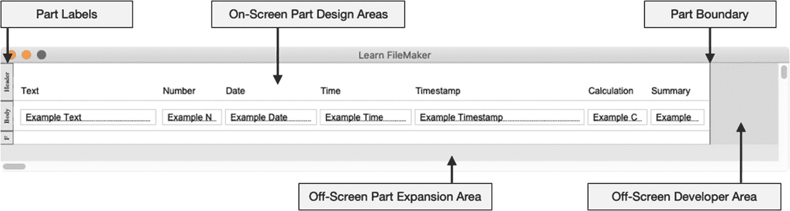
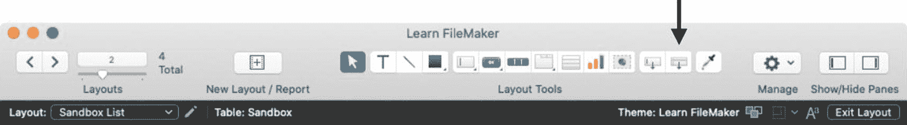
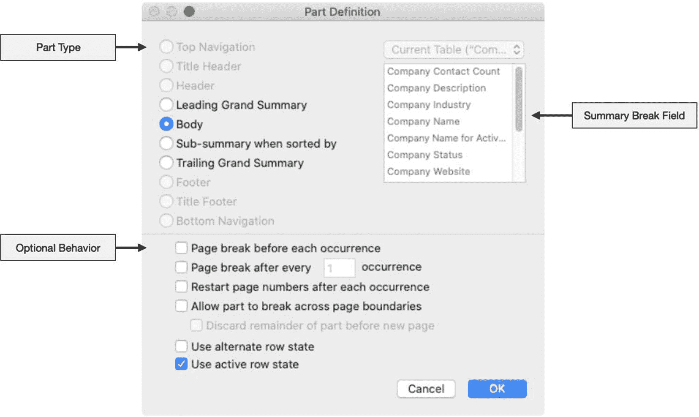
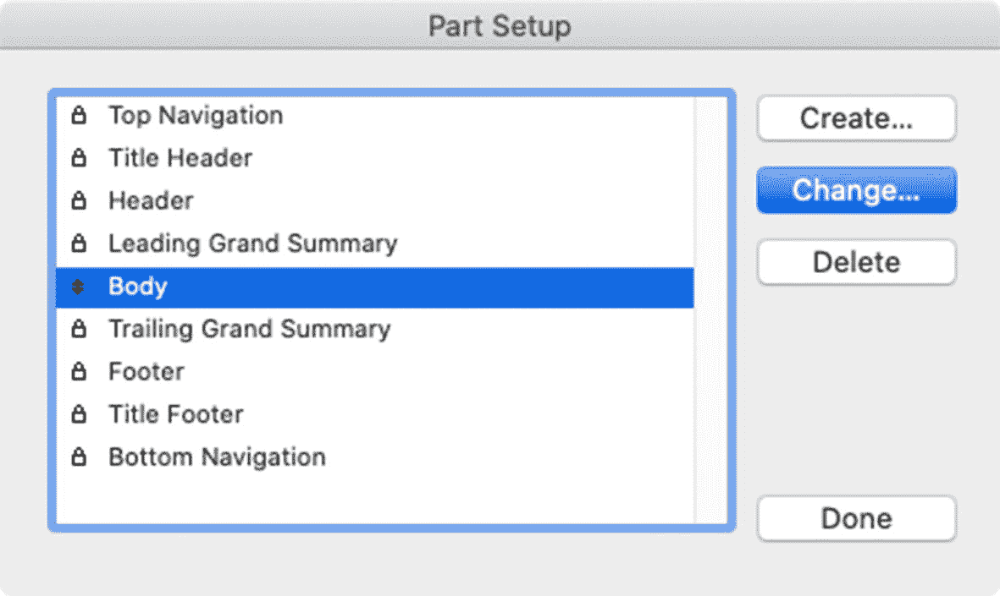
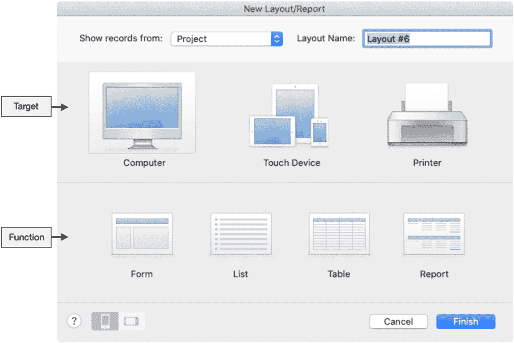

# 18. 布局入门

继续介绍布局基础知识，本章涵盖以下主题：

-   处理布局部件
-   添加布局
-   删除布局
-   使用管理布局对话框
-   优化布局性能

## 使用布局区段

*布局区段*是布局设计区域中的一个水平切片，其中包含的对象共同渲染成一个界面。每个布局必须至少包含*一个*区段，但可以根据设计需求由多个区段组成。这里有几种可用的区段类型，它们会影响内部包含的组件如何显示和运作。根据布局的创建方式以及过程中选择的选项，每个新布局通常至少包含三个默认区段：*页眉*、*主体*和*页脚*。

### 定义布局区域和控件

布局模式中有几个重要的区域和控件，如图 18-1 中高亮所示。

**图 18-1**  
一个典型布局，高亮显示了各种区域和控件

*区段标签*是附加在每个区段左侧的一个小方框。它包含区段类型名称，并且是多功能按钮，提供三种功能的访问入口。要打开配置对话框，请双击区段标签。按住 `Command`（macOS）或 `Windows`（Windows）键单击一次，可将标签切换为垂直或水平方向。当标签为水平方向时，拖动标签可以比单击区段之间的线条更轻松地调整区段大小，尽管有时区段标签可能会妨碍布局对象。当标签为垂直方向时，情况则相反，如图 18-1 所示。右键单击标签会打开一个上下文菜单，其中包含打开区段配置对话框、为区段选择填充颜色或为区段应用样式（第 22 章）等选项。

*屏幕上的区段设计区域*是布局空间中从窗口左侧延伸到区段边界的水平切片。这个区段*堆栈*构成了布局设计区域，代表着在非布局模式渲染时将成为窗口内容区域的部分。可以在现有区段下方或之间插入新区段，将区段堆栈进一步向下扩展到屏幕下方的*屏幕外区段扩展*区域。只要至少保留一个区段，就可以从布局中删除未使用的区段。

*区段边界*是一条垂直线，它将左侧可见的*区段堆栈*与右侧的*屏幕外开发者区域*分隔开来。在其他模式下查看时，该边界左侧的所有内容将呈现为内容区域，而右侧的所有内容将隐藏在屏幕外不可见。右侧的屏幕外区域可用于存储开发者笔记和其他对用户不可见的布局元素。

**提示：** 放置在屏幕外区域中、为快速查找（第 4 章）配置的字段仍会产生结果。

#### 调整区段区域大小

区段可以在垂直和水平方向上调整大小，任何尺寸都不能超过 32,000 x 32,000 点的最大限制。要*垂直调整*区段大小，将光标定位在区段区域下方的线上，直到光标变为一条短的水平黑线，线两侧各有一个向上和向下的箭头。然后，单击并向上或向下拖动光标，以收缩或扩展线上方区段的高度。当区段标签水平显示时，您可以抓取标签并拖动来调整区段大小。要*水平调整*整个区段堆栈的大小，将光标定位在区段边界的任意位置，直到它变为一条短的垂直黑线，线两侧各有一个向左和向右的箭头。然后，单击并向左或向右拖动光标，根据需要收缩或扩展区段堆栈的宽度。或者，选择一个区段标签，并在*检查器面板*（第 19 章）的*位置*设置中调整宽度和高度值。

### 定义区段类型

这里有十种不同的区段类型，每种都有特定的固有属性。它们可以分为两类：*标准区段*和*汇总区段*。

#### 定义标准区段

*标准区段*显示对象而不具备任何汇总功能。每个布局中每种标准区段仅限于一个*实例*，并且它们*必须*遵循自动强制执行的堆叠顺序。有七种不同的标准区段类型（按顺序排列）：

- *顶部导航* – 用于屏幕上的导航按钮和其他控件。此区段不会打印，并且在更改窗口视图设置时不会放大或缩小。
- *标题页眉* – 打印时出现在顶部，替换第一页上的*页眉*。在浏览模式下不显示。
- *页眉* – 出现在顶部，但若存在*标题页眉*，则打印第一页时除外。
- *主体* – 表示一条记录的单个实例。在列表视图中，对于找到的记录集中的每条记录，此区段及其内部放置的每个对象将重复显示一次。在表单视图中，它仅为当前记录渲染一次。
- *页脚* – 出现在底部，但若存在*标题页脚*，则打印最后一页时除外。
- *标题页脚* – 打印时出现在第一页底部，替换*页脚*。在浏览模式下不显示。
- *底部导航* – 用于屏幕上的导航按钮和其他控件。此区段不会打印。

#### 定义汇总区段

*汇总区段*用于插入记录组的汇总值，在创建报表布局时尤其有用。放置在汇总区段中的汇总字段将根据区段类型及其设置指定的记录组显示一个值。有两种类型的汇总区段，每种都有*前导*和*结尾*变体，表示相对于*主体*的位置。它们分别是：

- *总汇总* – 此处的汇总字段将显示*找到记录集中所有记录*的汇总值。它可以放置在布局的开头（*前导总汇总*）或结尾（*结尾总汇总*）。
- *子汇总（按...排序时）* – 放置在此处的汇总字段将显示找到记录集中*一个排序子组记录*的汇总值。它用于根据指定的分隔字段计算*小计*，并将记录分成排序后的组。一个或多个子汇总区段可以放置在*主体*的上方和下方，并且仅当记录按指定的分隔字段排序时才会出现。每个由分隔字段排序产生的记录组将重复显示一个子汇总区段。

### 管理区段

在布局模式下，可以添加、删除和重新排序区段以创建自定义布局。

#### 使用工具栏按钮添加区段

*区段*工具，如图 18-2 所示，可以单击并向下拖入布局区域以添加到区段堆栈中。光标将变成紧握的拳头，拖动一条黑色水平线。将此线移动到现有区段上方或下方的位置，该位置近似于要在堆栈中插入新区段的位置，然后释放鼠标。将打开*区段定义*对话框，允许选择并配置新区段。完成后关闭对话框，即可调整区段大小并开始添加对象。

**图 18-2**  
用于将新区段拖入布局区段堆栈的工具

**提示：** 以这种方式拖动新区段不够精确，并且会改变现有区段的大小。为避免此问题，请使用本章后面描述的*区段设置*对话框。

#### 配置部件

部件通过“**部件定义**”对话框进行定义，如图 18-3 所示。创建新部件时，此对话框会自动打开。若要为现有部件打开该对话框，请双击部件标签，选择 `布局 ➤ 部件设置` 菜单，或从部件标签的上下文菜单中选择“**部件定义**”。

图 18-3

用于定义布局部件的对话框

`部件类型` 选项会根据所定义部件在堆栈中的位置自动启用或禁用。例如，如果已定义了一个`页眉`部件，则`主体`部件不能更改为`页眉`；如果当前部件位于现有`页眉`下方的堆栈中，则无法将其更改为`标题页眉`。

当定义`子摘要`部件时，右侧的`摘要分隔字段`会变为可用。此处的字段选择表示，当记录按该字段排序时，子摘要部件应作为记录组之间的分隔符可见。这些分隔符通常用于在财务报告中插入小计。有关子摘要如何工作的更多信息，请参见本章后面的报告布局示例。

前四个选项复选框控制部件在打印或预览模式下如何处理。选择`每次出现前分页`可在`结尾汇总`、`主体`或`子摘要`部件前自动插入分页符。`每出现 X 次后分页`将在部件显示指定次数后插入分页符，从而限制`主体`或`子摘要`部件在单个页面上的重复次数。使用`每次出现后重设页码`可在每次部件实例后重置页码编号。将此选项与`标题页眉`配合使用，可创建不包含在编号序列中的标题页；或与`子摘要`配合使用，可在每个部分后重置编号。最后，`允许部件跨页断开`允许部件被页面边界拆分。若不选择此选项，除非部件内容无法容纳于单个页面，否则部件不会跨页拆分，而是会在当前页面底部留下空白区域，部件从下一页开始。启用此选项可覆盖此默认行为，并在分页处进行拆分以消除空白区域。其相邻的`在新页面前丢弃部件剩余内容`复选框将截断部件的任何剩余内容，而不是在下一页显示，从而在分页处裁剪内容。

底部的两个选项控制部件的视觉外观。`使用交替行状态`复选框允许`主体`采用交替样式，以便在视觉上区分记录。启用`使用活动行状态`可使`主体`通过特殊样式在视觉上指示当前记录（仅限屏幕显示）。

> **提示**  
> 交替行状态和活动行状态的外观可通过在“检查器”面板（第 22 章）的“对象状态”菜单中选择进行编辑。

#### 删除部件

要删除部件及其包含的所有对象，请选中部件标签并键入 `Delete`。

#### 使用部件设置对话框

使用“部件设置”对话框（如图 18-4 所示）可以更精确地管理部件。要打开此对话框，请从“布局”菜单或通过右键单击布局任意位置出现的上下文菜单中选择“部件设置”。列表显示当前布局上定义的每个部件，并且是*唯一*可以重新排序汇总部件（使其位于主体上方或下方）的地方。要添加部件，请单击“创建”按钮。这会将部件插入列表和布局中，而不会像从工具栏拖动新部件那样调整其他部件的大小。要编辑部件，请选中它并单击“更改”按钮以打开“部件定义”对话框。使用“删除”按钮可删除所选部件。此对话框中没有取消或撤消选项，因此如果出现错误，请单击“完成”按钮，然后选择“编辑 ➤ 撤消”菜单以立即撤销所做的任何更改。

图 18-4

该对话框允许对部件堆栈进行更精确的控制

## 添加布局

向数据库文件添加布局有两种方法：创建新布局和复制现有布局。

### 创建新布局

要创建新布局，请从“布局”菜单中选择“新建布局/报表”功能，或单击同名工具栏图标。这将打开对话框（如图 18-5 所示），该对话框将根据所选目标设备类型和功能逐步显示更多屏幕。布局配置可以在之后进行修改，有些人发现选择“计算机”并单击“完成”以绕过此设置助手的其余部分，然后手动完成配置会更简单。然而，尤其是对于复杂报告布局的初始配置，此对话框可以节省大量时间，特别对于新开发人员而言。

图 18-5

用于创建新布局的对话框

首先，从顶部的“显示记录来自”菜单中选择一个表事件，并为新布局输入一个“布局名称”。通过单击三个图标之一来选择目标设备类型：“计算机”、“触控设备”或“打印机”。“触控设备”图标会打开一个弹出菜单，其中有三个选项：“iPad”、“iPhone”和“自定义设备”。虽然任何布局都可以在多种设备组合上使用，但这些选择有助于确定新布局的默认大小和配置选项，从而节省一些时间。

接下来，选择一个主要功能以进一步控制默认设置。这些选择因目标设备选择而异。“表单布局”通常用于查看单条记录以进行数据输入任务或输入查找条件。它们也可用于创建自定义对话框或打印布局。“列表视图”用于显示找到的记录集中的多条记录列表。“表格视图”是一种低设计的列表视图，以类似电子表格的格式显示记录和字段。“报表视图”是一种列表视图，经过优化，可使用子摘要和汇总查看或打印汇总的数据列表。“标签视图”是一种列表视图，经过优化可直接打印到标签上。这些可以*垂直*或*水平*创建，并且可以根据预配置的 Avery 或 Dymo 标签模板或自定义尺寸进行调整大小。最后，“信封视图”是一种列表视图，经过优化可直接打印到信封上。

对于“触控设备”目标，对话框底部的方向选项允许选择纵向或横向。当触控设备选择为“自定义设备”时，还会包含宽度和高度尺寸字段。

选择好选项后，单击“完成”按钮。对于“列表”或“表单”布局，该过程以打开新布局并可供自定义而结束。但是，“标签”、“报表”和“表格”布局会有额外的对话框打开，并提供进一步的自定义选项。

> **提示**  
> 请记住，任何布局都可以作为表单、列表或表格进行查看。这里的选择仅影响默认设置选项，这些选项之后可以修改并以不同方式查看。

