# 新版报表布局的附加选项

报表布局是一种列表视图，其中包含汇总和小计，专为打印或显示组织好的信息而配置。例如，*发票*报表可以按年和月对记录进行排序，将数据汇总到带小计的分组中，如图 18-6 所示。通过*新建布局/报表*对话框创建报表布局，需依次进行多达*八个*独立的对话框，逐步配置部件、内容、汇总、排序等选项。尽管可以从一个空白列表视图开始手动创建报表布局，但这些对话框通过大大简化构建复杂分层信息显示所需的配置部件和设置这一繁琐任务，提供了极大的便利。

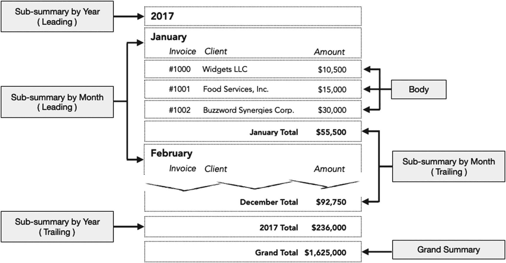

**图 18-6** — 一张按年、再按月汇总销售额的发票报表示意图

上述报表由六个布局部件组成，始于一个*按年份排序时的子摘要（前导）*。当记录首先按*发票年份*排序时，每当检测到新一年，该部件就会出现在每组记录之前。接下来，*按月排序时的子摘要（前导）*在记录其次按*发票月份*字段排序时执行相同操作。尽管布局上显示的是月份名称，但为了月份能按时间顺序排列，实际的排序和布局部件必须基于月份数字中断字段。列标题的标签放置在此摘要部件中，以便每当新月份开始时，它们会出现在每组单独记录的上方。

*主体*部件会对找到集中的每条记录重复一次。然而，这些记录会根据周围的*子摘要*部件排列成排序分组。因此，一月有一组三条记录（已显示），而像二月这样的其他月份则会有自己的记录分组，重复主体部件（未显示）。

*主体*之后还有两个附加的*子摘要*：一个按月排序，另一个按年排序。它们与对应的前导部件功能相同，但出现在每个排序分组之后。在此示例中，这些部件用于显示汇总字段，计算其上方分组中记录值的的小计。最后，底部是一个*最终汇总（尾随）*，它将提供总计，汇总整个找到集的字段。

在每个摘要部件中，都使用同一个*发票总计汇总*字段，它会自动汇总其所包含分组中记录的值。尽管示意图中未显示，但*发票数量汇总*字段可以添加到摘要部件中，以显示每个分组中的*记录数量*。

## 为发票报表演示做准备

要构建图 18-6 所示的布局，必须先定义一个*发票*表，其中包含各种字段，如图 18-7 所示。

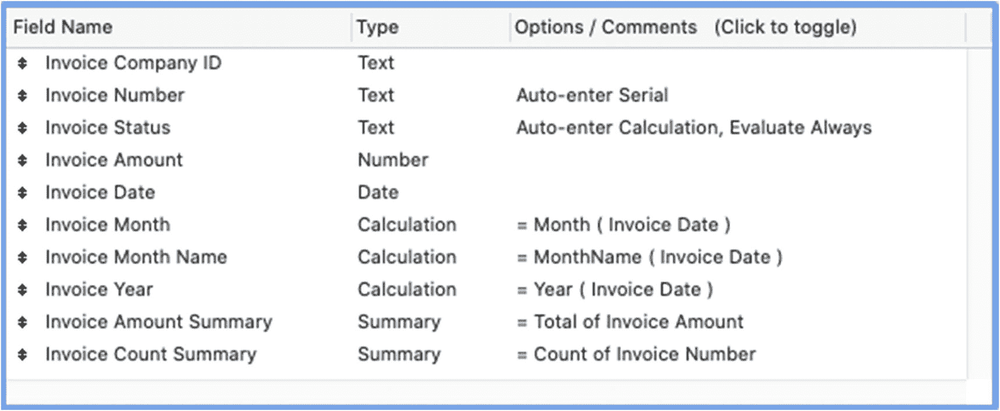

**图 18-7** — 报表所需的发票表字段定义

前几个字段用于数据输入，以存储发票的*公司 ID*、*编号*、*状态*、*金额*和*日期*。三个计算字段将日期转换为*月份数字*、*月份名称*和*年份数字*。这些字段将用于记录排序以及在摘要部分显示值。两个汇总字段将用于在各个子摘要和尾随最终汇总部件中显示发票的总数及总美元金额。配置完成后，打开*新建布局/报表*对话框，按照以下步骤开始一个多对话框的报表配置选项序列，以创建新的报表布局：

1.  选择*发票*表。
2.  输入布局名称“发票报表”。
3.  点击*打印机*图标。
4.  点击*报表*图标。
5.  点击*继续*按钮。

## 对话框 1：包含小计和总计

第一个报表配置对话框将出现两个选项，如图 18-8 所示。复选框提供了*包含小计*和*包含总计*的选项。选择这两个选项以包含这些部件，并确保*指定小计*和*指定总计*对话框（对话框 6 和 7）包含在配置过程中。点击*下一步*继续。

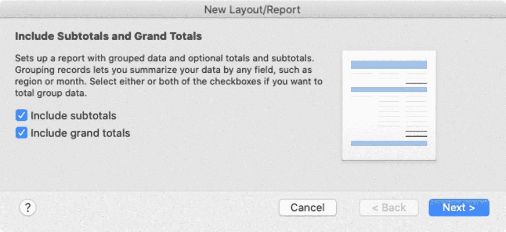

**图 18-8** — 八个报表配置对话框中的第一个

## 对话框 2：指定字段

第二个报表创建对话框用于指定将放置在报表上的字段，如图 18-9 所示。虽然在布局创建后也可以添加字段，但现在选择某些字段可使它们在后续对话框中可用于汇总选项。通过双击或使用*移动*按钮，将字段从左侧列表添加到右侧列表。字段可以在可用列表中拖拽，以确定它们在新布局中的默认顺序。在我们的示例中，我们包含了来自*发票*表的*编号*、*日期*、*客户*、*金额*、*年份*和*月份*。通过在选择*可用字段*列表上方的菜单中选择不同的表出现，可以包含来自关联表（如*公司名称*）的字段。

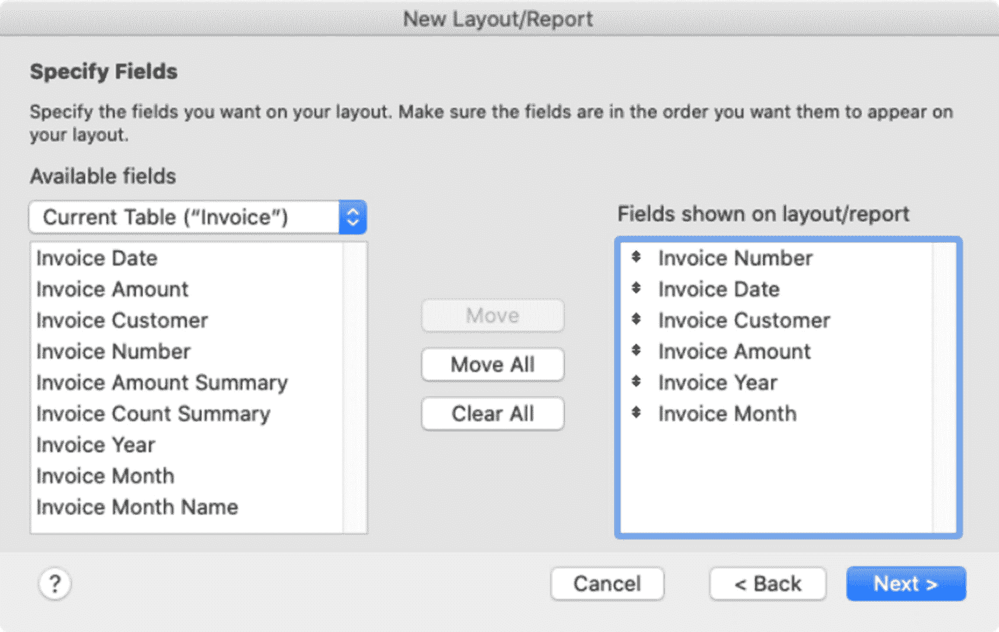

**图 18-9** — 八个报表配置对话框中的第二个

## 对话框 3：按类别组织记录

第三个报表对话框用于指定*排序字段*，这些字段可组织记录并作为报表子摘要的分组条件，如图 18-10 所示。上一个对话框中添加的字段显示在*报表字段*列表（左侧）中，可以添加并启用至*报表类别*列表（右侧）。每个选定的字段都将作为排序记录分组的汇总类别。启用复选框以将该字段同时包含在子摘要布局部件和报表主体中。在我们的示例中，*发票年份*和*发票月份*字段均被添加为类别并选中，因为它们将用于汇总记录分组。

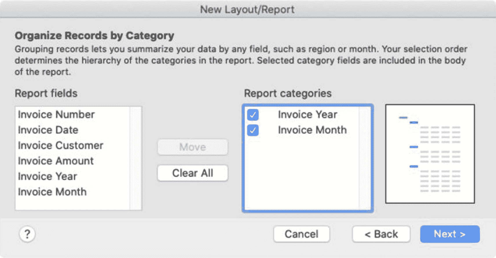

**图 18-10** — 八个报表配置对话框中的第三个

## 对话框 4：排序

第四个报表对话框用于指定排序顺序，如图 18-11 所示。此对话框包含一个与标准*排序记录*对话框（第 4 章，“对找到集中的记录进行排序”）类似的界面。在上一个对话框中添加为*报表类别*的任何字段将自动锁定在*排序顺序*的顶部。由于这些字段已被选中用于汇总分组，因此它们是排序顺序中必需的。可以在这类字段下方添加其他字段，以进一步对报表主体中的记录进行排序。

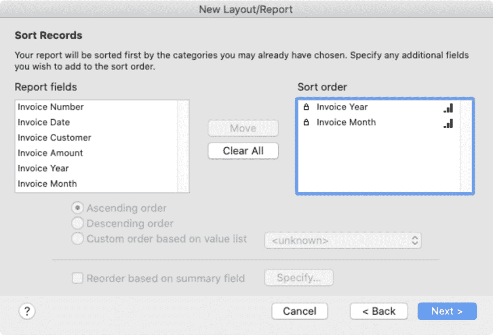

**图 18-11** — 八个报表配置对话框中的第四个

#### 对话框 5：指定小计

第五个报表对话框，如图 18-12 所示，仅当在第一个对话框中选中了`指定小计`复选框时才会出现。此功能允许添加一个或多个*汇总字段*，这些字段将显示在按选定字段分组的子摘要部分中的记录组上方或下方。

通过点击`指定`按钮选择要包含的*汇总字段*。然后，可以从`要汇总的类别`弹出菜单中选择一个字段，该菜单列出了在第三个对话框中添加为报表类别的所有字段。`小计位置`弹出菜单用于指定小计相对于其正在汇总的记录组显示的位置：`记录组上方`、`记录组下方`或`上方和下方`。完成这些选择后，点击`添加小计`将字段插入到下方的列表中，然后重复此过程以添加其他字段。可以添加多个汇总以创建更健壮的汇总层次结构。

对于我们正在进行的发票示例，`发票金额汇总`字段被添加为小计，将显示在记录组*下方*，并为`发票月份`和`发票年份`分别汇总一次，以便它们出现在两个子摘要部分中。可选地，可以重复此操作以同时包含`发票计数汇总`。

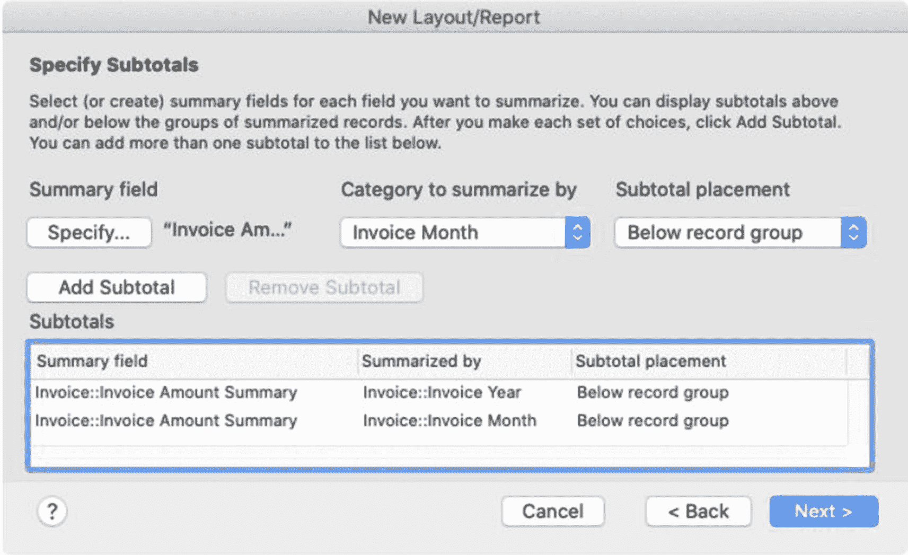

图 18-12

八个报表配置对话框中的第五个

#### 对话框 6：指定总计

第六个报表对话框，如图 18-13 所示，仅当在第一个对话框中选中了`指定总计`复选框时才会出现。其工作方式与前一个对话框类似，但使用汇总字段来显示报表中*所有记录*的总计。

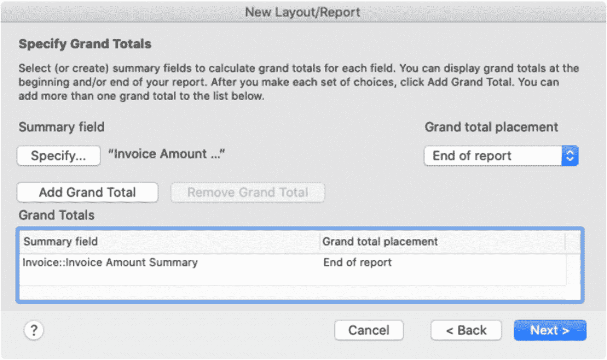

图 18-13

八个报表配置对话框中的第六个

通过点击`指定`按钮选择要包含的*汇总字段*。然后，从`总计位置`弹出菜单中选择一个选项，以指定总计相对于整个报表的位置：`报表开头`、`报表结尾`或`报表开头和结尾`。最后，点击`添加总计`将字段插入到下方的列表中，然后重复此过程以添加其他字段。

在发票示例中，`发票金额汇总`字段都被添加为总计，并且应仅出现在报表末尾。可选地，可以重复此操作以同时包含`发票计数汇总`。

#### 对话框 7：页眉和页脚信息

第七个报表对话框，如图 18-14 所示，允许为将自动放置在布局上六个不同位置的标准信息插入可选占位符。每个弹出菜单都包含相同的选项：`页码`、`当前日期`、`布局名称`、`大自定义文本`、`小自定义文本`和`徽标`。

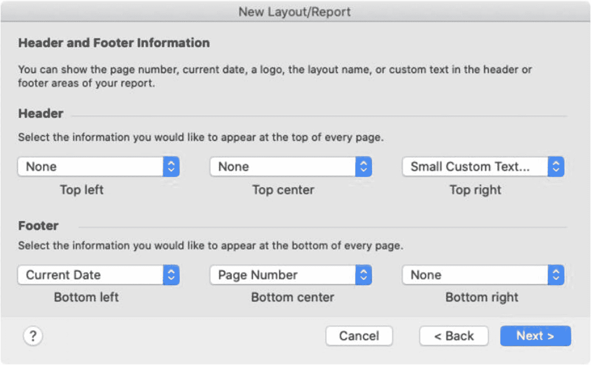

图 18-14

第七步用于选择标准的页眉和页脚信息

#### 对话框 8：创建脚本

第八个也是最后一个对话框提供了为新报表布局自动创建脚本的选项。如果没有脚本，用户需要*手动*执行查找、导航到报表布局、排序记录以及打印或预览报表。可以手动创建脚本来执行这些步骤（第 24 章–28 章）。这最后一个对话框，如图 18-15 所示，提供了自动起步的便利。

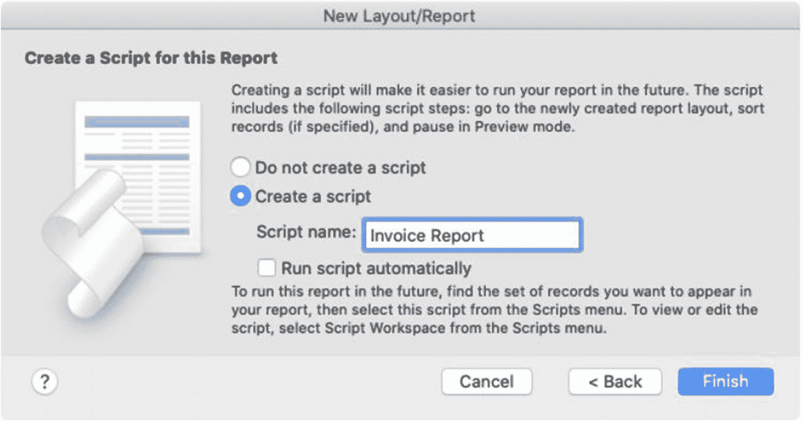

图 18-15

第八个也是最后一个报表配置对话框

点击`创建脚本`选项，并可选择覆盖默认的`脚本名称`。选中`自动运行脚本`复选框以分配一个`OnLayoutEnter`脚本触发器（第 27 章），该触发器将在用户导航到新布局时运行脚本。然后点击`完成`按钮以创建脚本并完成新布局和脚本的创建。

所创建的脚本将包含两个或三个步骤，这些步骤会根据此过程中的其他选项自动配置。它将始终包含`进入浏览模式`和`转到布局`步骤。如果在第四个对话框中指定了排序字段，它将包含一个按所选字段`排序记录`的步骤。创建完成后，可以根据需要进一步自定义脚本。例如，按照配置，它假定报表应包含找到集中的每条记录。但是，可以添加一个步骤，以根据当前日期、周、月或年的上下文，或包括用户输入的任何其他条件，来查找一组记录。

#### 优化报表布局

创建报表布局后，通常需要清理和自定义。图 18-16 中的示例显示了基于前面示例中所选选项的布局。可以压缩各部分的高度以节省空间，并且背景、标签和字段的格式均基于主题，可能不合适，尤其是对于打印报表。如果包含徽标，可能需要调整其大小和位置。自动添加在顶部的正文字段的字段标签可以移动到正文正上方的子摘要中，以便它们直接在每组字段上方重复显示。此外，字段标签会自动显示字段的全名，可能会重叠并包含命名前缀，因此可能需要编辑。

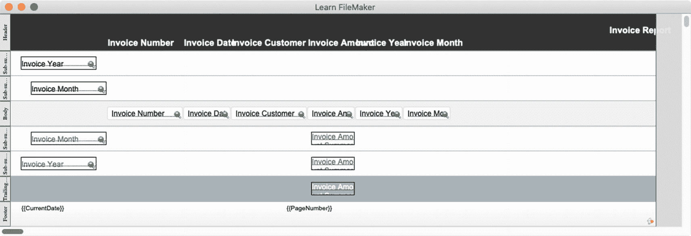

图 18-16

自动创建的报表布局通常需要优化

### 复制现有布局

为了节省时间并在布局之间保持一致性，可以考虑为典型的列表视图和表单视图设计一个模板，然后复制这些模板并根据其他表进行自定义。可以通过选择`布局 ➤ 复制布局`菜单来复制当前布局。此外，打开`管理布局`对话框，并使用其中的复制功能（请参阅本章后面的“使用管理布局对话框”）。新布局的名称将与原始布局相同，并附加“副本”字样。布局的所有其他方面（包括所有部分、主题、对象、格式、设置和分配的表事件）都将与原始布局相同。复制后，可以重命名新布局、将其分配给新的表事件，并根据需要进一步自定义。

## 配置布局设置

`布局设置`对话框控制布局的行为、外观和功能。要打开此对话框，请进入布局模式，然后从布局菜单或工具栏中选择`布局设置`。该对话框分为四个选项卡：`常规`、`视图`、`打印`和`脚本触发器`。

### 通用设置

`General`选项卡位于`Layout Setup`对话框中，包含常规设置，如图 18-17 所示。

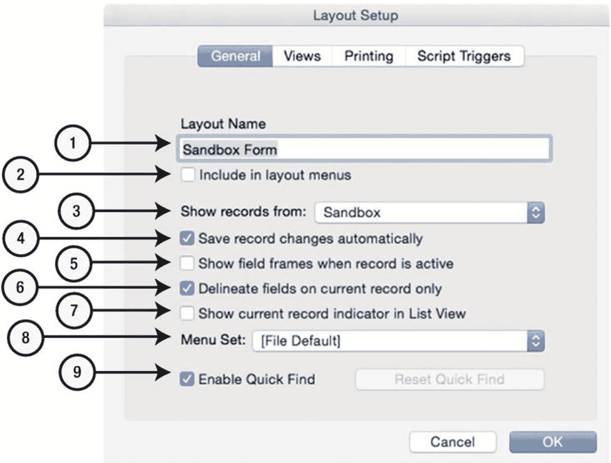

图 18-17

第一个选项卡包含常规设置和选项。

1.  `Layout Name` – 编辑布局的名称。
2.  `Include in Layout Menus` – 启用后，布局将在`View`菜单和工具栏中作为可导航选项供用户使用。
3.  `Show Records from` – 选择布局上下文的表 occurrence。
4.  `Save Record Changes Automatically` – 控制当用户或脚本提交记录时是否自动保存字段更改。如果未选中，每次提交尝试后都会显示保存对话框。
5.  `Show Field Frames When Record Is Active` – 启用后，当记录处于活动状态时，每个字段上会显示特殊边框。
6.  `Delineate Fields on Current Record Only` – 启用后，仅当前记录上的字段会显示边框。使用此选项可避免在列表布局上造成干扰。
7.  `Show Current Record Indicator in List View` – 在列表视图中，当前记录左侧启用黑色条。应禁用此遗留元素，转而使用布局`Body`上的`Use active row state`，该功能允许对活动记录的对象进行样式驱动控制（第 22 章）。
8.  `Menu Set` – 为布局设置自定义菜单（第 23 章）。
9.  `Enable Quick Find` – 为布局启用`Quick Find`功能（第 4 章）。该按钮用于将所有字段重置为默认的`Quick Find`设置。

### 视图

`Layout Setup`对话框中的`Views`选项卡（如图 18-18 所示）包含三个复选框，用于控制哪些内容视图类型可供用户使用（第 3 章，“定义内容视图”）。`Properties`按钮打开`Table View Properties`对话框，其中的设置控制布局在浏览模式下以表格视图显示时的外观。

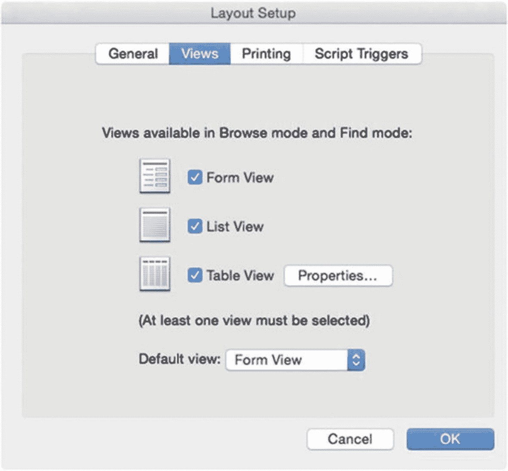

图 18-18

第二个选项卡控制视图选项。

### 打印设置

`Layout Setup`对话框中的`Printing`选项卡（如图 18-19 所示）控制打印布局时的列和页边距。不要与通过`File`菜单中的`Page Setup`和`Print`选项访问的打印和纸张大小设置混淆，此处设置侧重于布局的间距和列，控制可用于放置对象的可打印区域。

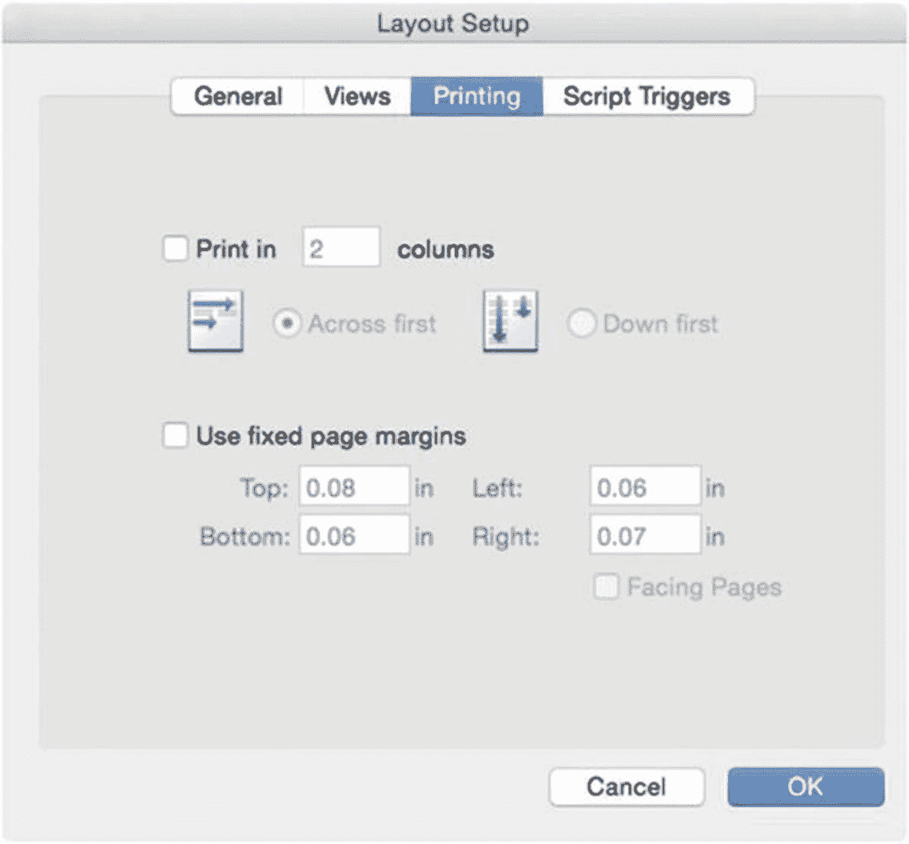

图 18-19

第三个选项卡控制特定的布局打印选项。

### 脚本触发器

`Layout Setup`对话框中的`Script Triggers`选项卡用于将布局事件连接到脚本（第 27 章）。

## 使用布局管理对话框

`Manage Layouts`对话框（如图 18-20 所示）用于重新排序布局、添加分隔线以及将布局分组到文件夹中。它还集成了所有管理功能，用于创建、查看、编辑、复制、删除和打开布局。通过工具栏中的`Layout`弹出菜单中的`Manage Layouts`选项，或选择`File ➤ Manage ➤ Layouts`菜单，打开此对话框。

文件中的每个布局都会列出，包含布局名称、关联表以及菜单集列。可以通过拖拽重新排序布局或将其移入文件夹，文件夹通过`New`按钮附带的菜单创建。布局旁边的复选框指示它是否将成为用户的可导航选项。顶部有一个弹出菜单，可以快速将列表筛选为仅包含特定文件夹中的布局。菜单中的默认值（也是未定义文件夹时唯一的选项）是`Show All`。相邻的`Search`字段按关键字筛选列表。底部的按钮允许创建布局、文件夹或分隔线，以及编辑、复制、删除和打开布局。

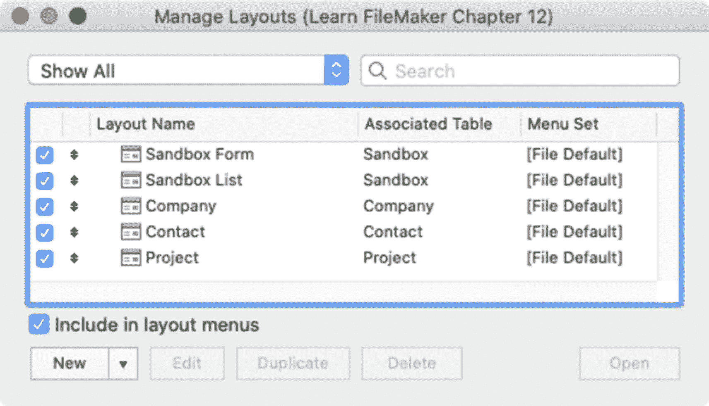

图 18-20

用于管理布局的对话框。

**提示：** 文件夹可以按层次嵌套。此处定义的文件夹结构将在布局菜单中形成子菜单，使用户更容易手动导航复杂的数据库。

## 优化布局性能

布局可以根据项目的需求设计得尽可能复杂。可以构建简单、流线型的视图，或图形丰富、复杂的界面。然而，请注意以下几点原则以确保高效性能：

- 当同时显示多个记录时（如列表视图或门户中），尽量减少对象数量，特别是涉及复杂功能的对象，例如，大量关联字段或执行 SQL 查询的项会减慢大型列表的速度。
- 在表单布局上，尽量减少高级控件（如门户和面板）的数量。
- 将复杂布局拆分为多个较简单的布局，并提供导航按钮以便快速切换。
- 尽量减少使用带有阴影、半透明颜色、渐变、大型导入图形等效果的对象。
- 尽量减少字段中未存储计算的数量，尤其是在列表中。
- 谨慎使用脚本触发器（第 27 章），避免将简单的界面事件与复杂脚本连接，以免产生较长的延迟时间，干扰用户的工作能力。
- 使用主题和样式进行对象格式化（第 22 章）。

## 总结

本章介绍了创建和配置布局的基础知识。在下一章中，我们将探讨用于构建和配置布局对象的控件。

