# 19. 探索布局窗格

字段和对象的配置工具位于两个窗格中，一个集成在布局模式窗口的左侧，另一个集成在右侧：`Objects`窗格和`Inspector`窗格。这两个窗格在布局模式下默认可见，但在不需要时可以隐藏。在本章中，我们将探讨这两个窗格上的可用控件：

- `Objects`窗格
- `Inspector`窗格

## 探索对象窗格

`Objects`窗格是布局模式窗口左侧的一个集成区域，包含三个选项卡：`Fields`、`Objects`和`Add-ons`。可以通过单击工具栏中的`Show/Hide Pane`按钮或选择`View ➤ Objects`菜单中的项目来切换此窗格的可见性。

好的，作为一名高级文档工程师和翻译员，我将遵循您的指示，将给定的英文文本翻译成中文，并严格遵守所有的格式和注意事项。

### 定义“字段”选项卡

“对象”窗格中的`字段`选项卡（如图 19-1 所示）是在版本 17 中新增的，它取代了之前独立存在的`字段选取器`面板。此面板整合了一些*架构函数快捷方式*和*布局设计功能*。它提供了一种直接创建字段、修改其数据类型以及访问字段选项对话框来编辑字段架构属性的途径。底部的控件允许进行预配置设置，这些设置会在将字段添加到布局时生效。

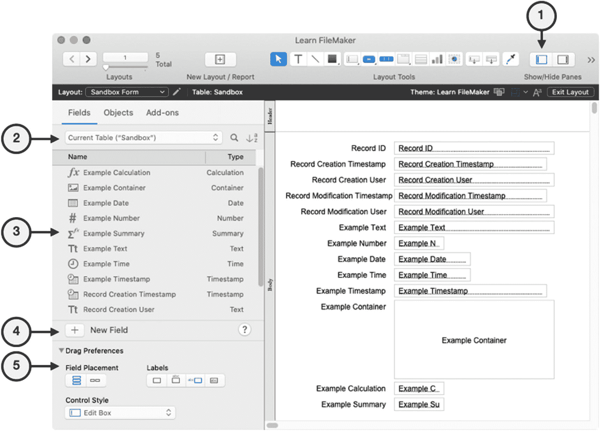

图 19-1

对象窗格的字段选项卡

1.  `切换按钮` – 显示和隐藏该窗格。
2.  `表 occurrence` – 选择一个表 occurrence 来访问当前布局所分配 occurrence 之外的字段列表。单击相邻的搜索图标以显示隐藏的筛选字段。
3.  `字段` – 列出所选 occurrence 中的字段。将一个或多个字段拖到布局中以添加实例。更改架构类型或访问上下文菜单以删除、重命名或打开`字段选项`对话框（第 8 章）。
4.  `新字段` – 在所选 occurrence 的表中创建一个字段。
5.  `拖放首选项` – 控制将字段拖到布局时的配置方式：
    - `字段放置` – 将新字段*垂直*堆叠或在一行中*水平*对齐。
    - `标签` – 在选定的相对位置包含一个标签。
    - `控件样式` – 选择数据控件样式（第 20 章）。

### 定义“对象”选项卡

“对象”窗格中的`对象`选项卡（如图 19-2 所示）是在版本 17 中新增的，它取代了之前独立存在的`布局对象`面板。这提供了当前布局上所有对象的分层视图，使得定位和选择项目变得容易，包括那些在组中或隐藏在其他对象后面的项目。

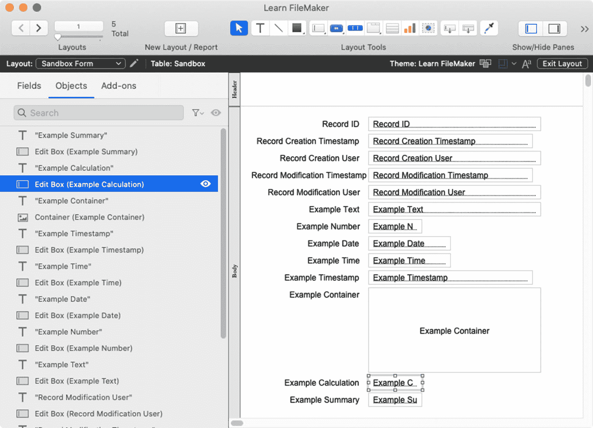

图 19-2

对象窗格的对象选项卡

除非指定了自定义名称，否则布局上的每个对象都会在此处以默认名称列出。显示的名称会因对象类型而异。例如，标签会显示其文本值，而字段则会显示其控件样式和字段名称。

对象列表内置了许多功能。在列表中选择一个对象会导致布局上相应的对象被选中，反之亦然。分组对象和像*门户*、*选项卡控件*和*滑动控件*这样的多层对象会显示其嵌套层次结构，可以在列表中展开或折叠。项目名称旁边的可切换`隐藏`图标可以临时使项目在布局模式下不可见，从而帮助整理设计区域以进行专注的工作。最后，一个上下文菜单包含额外的功能，如图 19-3 所示。

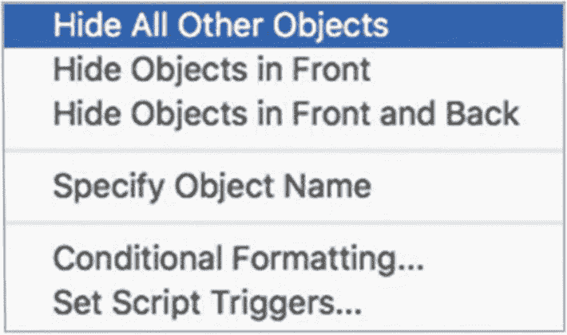

图 19-3

对象选项卡中列出项目的上下文菜单

此菜单中的命令取决于所选对象的类型：

- `隐藏所有其他对象` – 隐藏布局上除选定对象之外的所有对象。
- `隐藏前面的对象` – 隐藏所有层叠在选定对象前面的对象。
- `隐藏前面和后面的对象` – 隐藏所有层叠在选定对象前面和后面的对象。
- `指定对象名称` – 显示一个用于输入自定义名称的字段（第 21 章，“命名对象”）。也可以在`检查器`窗格中设置名称。
- `条件格式` – 打开一个用于定义条件应用样式的对话框（第 21 章）。
- `设置脚本触发器` – 打开用于将布局事件连接到脚本的对话框（第 27 章）。

注意

*使用此功能隐藏的对象仅在布局模式下临时隐藏，但在其他模式下会正常渲染。*

### 定义“加载项”选项卡

“对象”窗格中的`加载项`选项卡（如图 19-4 所示）是版本 19 中的一个新功能，它允许拖放插入预配置的资源组件。一个`加载项模块`是 xml、json 和图形元素的集合，可将专业资源的插入过程自动化到 FileMaker 数据库中。

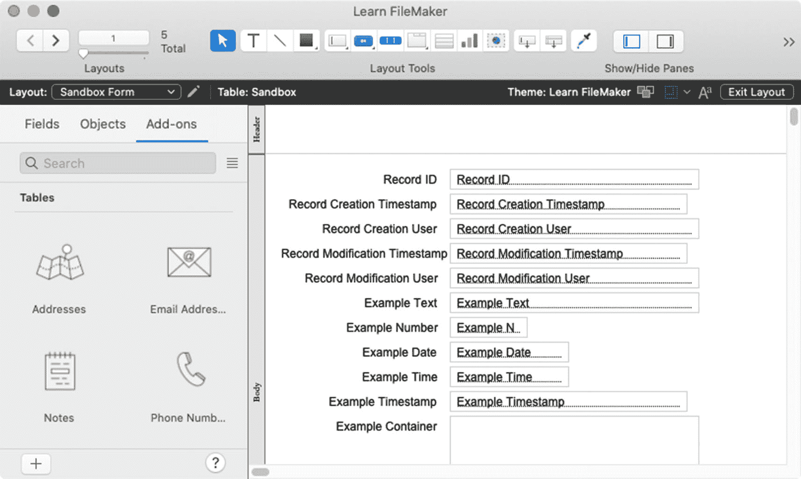

图 19-4

添加了一些加载项后的对象窗格字段选项卡

单击添加 (`+`) 图标打开一个面板，其中包含可用模块的库。选择一个模块并单击`选择`将其添加到您的文件中。该模块将作为图标出现在窗格中，并且根据选择，可能会向数据库添加表、字段、关系、脚本和值列表的某种组合。添加后，将图标拖到任何布局上即可立即创建一组功能对象，这些对象已预先连接到架构中。可以进一步自定义这些资源以适应数据库的格式和功能需求。要删除，右键单击加载项图标，然后选择`卸载加载项`选项。一个警告对话框包含一个复选框选项，该选项还可以自动删除添加到数据库中的所有资源。

警告

某些加载项需要当前布局表中存在一个可检测的主键字段，如果找不到，它们将拒绝工作。

## 探索检查器窗格

`检查器`窗格是布局模式下窗口右侧的一个集成区域。可以通过单击工具栏中的`显示/隐藏检查器窗格`按钮或从`视图 ➤ 检查器`菜单中选择一个项目来切换此窗格的可见性。与`对象`窗格不同，检查器还可以使用`视图 ➤ 新建检查器`菜单打开到一个或多个浮动面板中，类似于过去版本的形式。此窗格包含用于编辑选定布局部分或对象的格式和行为设置的控件。这些控件组织在四个带图标的选项卡中：`位置`、`样式`、`外观`和`数据`。每个选项卡的控件都分组到几个可折叠的区域中。

### 检查“位置”选项卡

`位置`选项卡是检查器中的第一个，分为五个可折叠区域：`位置`、`自动调整大小`、`排列和对齐`、`滑动和可见性`以及`网格`。

#### 位置

`位置`组（如图 19-5 所示）包含用于对象命名、工具提示和位置的选项。

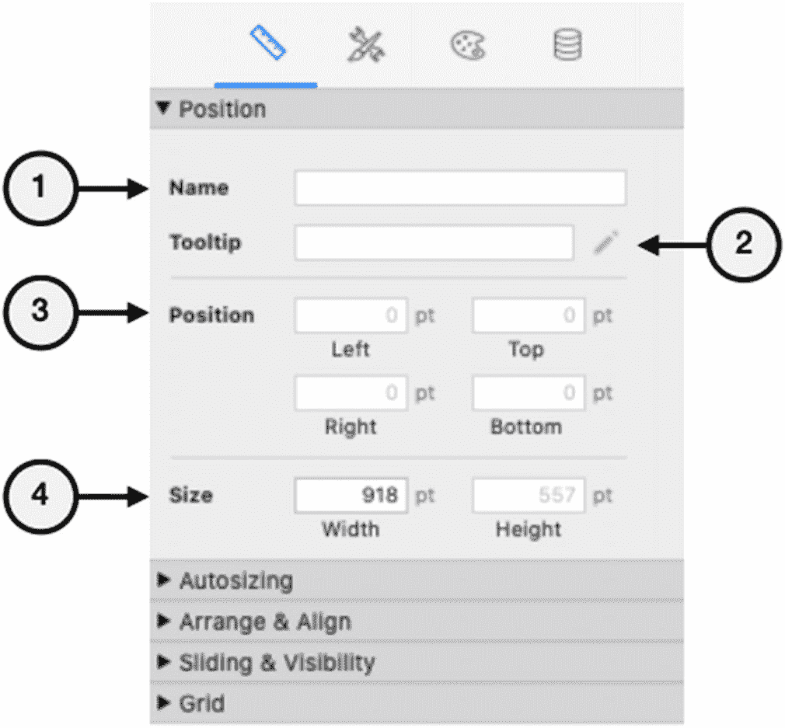

图 19-5

检查器窗格位置选项卡上的第一组设置

1. `名称` – 添加一个可选的对象名称（第 21 章，“命名对象”）。
2. `工具提示` – 添加一个可选的字符串，当用户在浏览模式下将光标悬停在对象上时，该字符串将显示为浮动工具提示。该图标打开一个`指定计算`对话框，用于公式驱动的提示。
3. `位置` – 精确控制选定对象在设计区域中的定位，而不是通过拖动。这些是按比例锁定的，因此更改一个将自动调整对面的值以保持`宽度`或`高度`。
4. `大小` – 设置对象的`宽度`和`高度`。

注意

位置和大小的度量单位将与当前标尺的设置匹配，但可以通过单击标签来更改，标签会循环显示选项*厘米*、*点*和*英寸*。

#### 自动调整大小

“`Autosizing`（自动调整大小）”组（如图 19-6 所示）包含锚定控制，用于控制窗口调整大小时对象的移动或增长方式。通过切换框对应侧边的锁定图标开启或关闭，可以将对象锚定到`左侧`、`顶部`、`右侧`或`底部`。在非布局模式下调整窗口大小时，任何一侧的锁定都意味着该侧对象与布局/窗口对应边缘之间的当前距离将保持不变。

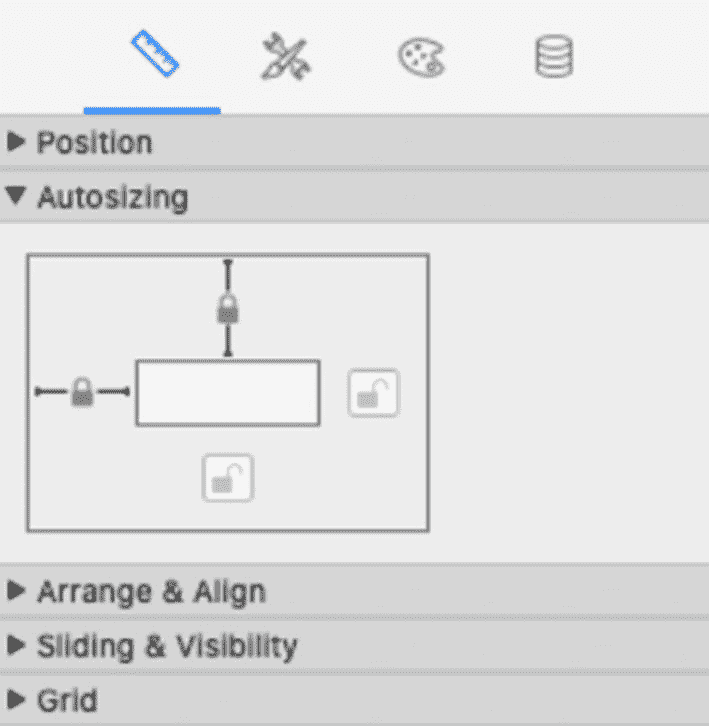

图 19-6

检查器窗格“位置”选项卡上的自动调整大小设置

以不同组合方式使用这些锁定可以产生多种不同的定位和大小调整效果。锁定`顶部`和`左侧`可使对象在窗口调整大小时保持其大小并保持静止。要固定到布局的右下角，只需锚定`底部`和`右侧`。当两个相对的锚点激活时，对象将扩展其大小。例如，要在窗口调整大小时扩展对象的宽度，请激活`左侧`和`右侧`锚点。没有锚定的对象将浮动在窗口的中央。

#### 排列与对齐

“`Arrange & Align`（排列与对齐）”组（如图 19-7 所示）包含排列成三行的六组按钮，用于调整对象对齐、分布间距、相对大小、分组状态、排列顺序和锁定状态。与`检查器`窗格中的其他设置不同，这些不是对象属性，而是用于整齐排列选定对象以收紧界面设计的工具。

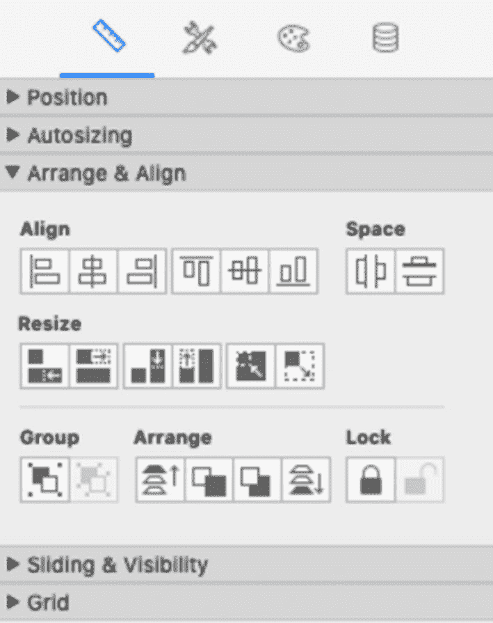

图 19-7

检查器窗格“位置”选项卡上的排列控制

- `对齐` – 按侧边对齐对象：`左对齐`、`居中对齐`、`右对齐`、`顶对齐`、`中对齐`或`底对齐`。
- `间距` – `水平`或`垂直`均匀分布对象组。
- `调整大小` – 根据组中最小或最大的对象同步一组对象的高度和/或宽度。
- `分组` – 将单个对象转换为一组或取消分组。
- `排列` – 使用`置于顶层`、`上移一层`、`下移一层`和`置于底层`更改所选对象的堆叠顺序。
- `锁定` – 更改对象的锁定状态。锁定可防止意外修改。

#### 滑动与可见性

“`Sliding & Visibility`（滑动与可见性）”组（如图 19-8 所示）控制对象在打印、另存为 PDF 文件或在预览模式下查看时的行为。主要有三个选项：`向左滑动`、`基于……向上滑动`和`打印时隐藏`。

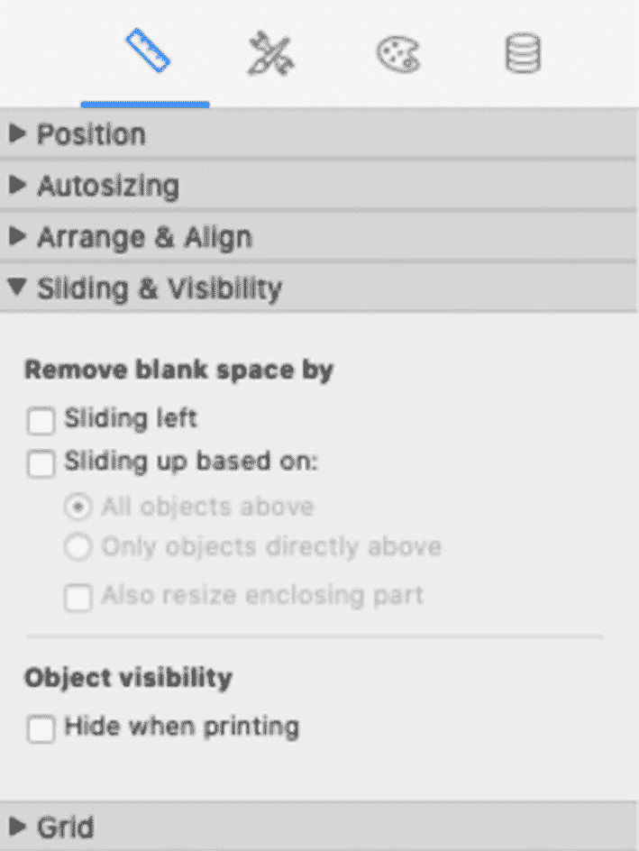

图 19-8

检查器窗格“位置”选项卡上的滑动与可见性控制

`向左滑动`选项使对象的宽度缩小到显示其内容所需的最小宽度，并根据同一水平面上的其他对象尽可能向左滑动。

`基于……向上滑动`选项使对象的高度缩小到显示其内容所需的最小高度，并根据同一垂直面上的其他对象尽可能向上滑动。选中此对象后，下方的其他选项将变为可用。选择`所有上方对象`选项可使同一水平面上的对象相对于其上方正在调整大小的对象*一起*向上滑动。选择`仅正上方对象`选项可使同一水平面上的对象相对于其正上方正在调整大小的对象彼此独立地向上滑动。选中`同时调整封闭部件大小`复选框，可使在完成所有大小调整后，包围该对象的布局部件相对于最低的对象垂直缩小。例如，可以在较大的布局部件上展开备注字段，以容纳可能较长的内容，最终将仅缩小到显示实际内容所需的空间。

`打印时隐藏`使对象在打印时不可见。

#### 网格

“布局网格”是一系列等间距的水平线和垂直线，覆盖在布局背景之上，形成由次要区域和主要区域组成的规则网格，如图 19-9 所示。网格仅在布局模式下可见，用于辅助对象的手动精确定位和间距调整。

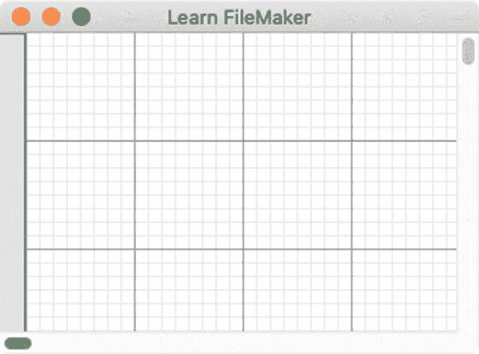

图 19-9

布局背景上可见的网格

`检查器`窗格中的“`Grid`（网格）”组（如图 19-10 所示）包含控制布局网格的设置，这些设置普遍适用于当前文件中的每个布局。`显示网格`复选框可在布局视图中启用网格。选中`对齐到网格`可强制手动拖拽对象到新位置时使其落在网格线上。可以在两个字段中自定义主要和次要网格间距。

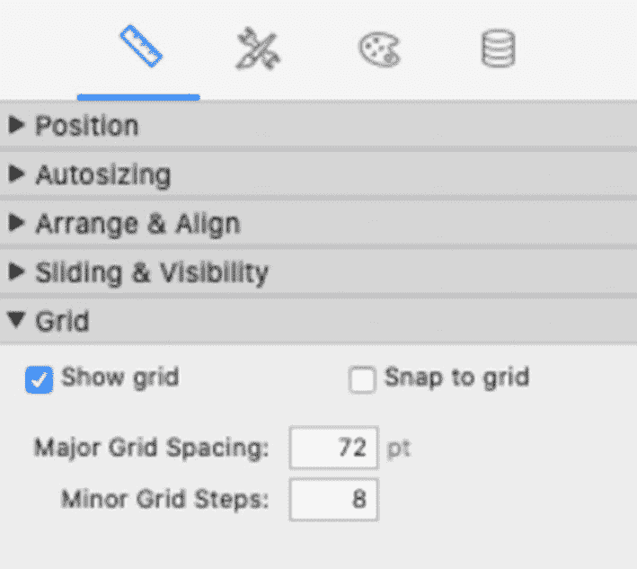

图 19-10

检查器窗格“位置”选项卡上的网格控制

### 检查样式设置

位于`检查器`窗格第二个选项卡上的“`Style`（样式）”设置用于显示和控制分配给布局和所选对象的主题和样式（第 22 章）。

### 检查外观设置

位于`检查器`窗格第三个选项卡上的“`Appearance`（外观）”设置分为六个区域：`主题和样式`、`图形`、`高级图形`、`文本`、`段落`和`制表符`。除第一个区域外，其他区域均可折叠或展开。

#### 主题和样式

“`Theme and Style`（主题和样式）”组是该面板中不可折叠的部分，用于显示分配给布局的主题和样式，并带有相邻的图标菜单，以便在进行更改时进行更新。这些菜单下方的弹出菜单允许选择`对象部件类型`和`对象部件状态`，每种组合在“`Appearance`（外观）”面板的其余部分都有一组不同的格式设置（第 22 章，“编辑对象的样式设置”）。

### 图形

`Graphic`组，如图 19-11 所示，控制所选对象的选定部件类型和状态的图形设置。

`Fill`菜单包含四个选项，这些选项会条件性地改变其下方可用的选项：`None`、`Solid Color`、`Gradient`或`Image`。默认选项为`None`，表示对象将是透明的。选择`Solid Color`可选择填充颜色，或选择`Gradient`以访问更高级的填充设置，两者均使用熟悉的控件。`Image`选项允许选择将作为背景显示的图像文件。弹窗菜单允许选择图像的处理方式，包含以下选项：`Original Size`、`Scale to Fit`、`Scale to Fill`、`Slice`和`Tile`。

`Line`选项包括对象边框类型的选择：`None`、`Solid`、`Dashed`和`Dotted`。可以指定粗细值和颜色。边框图标允许选择对象的哪些维度具有边框：`All`、`Left`、`Top`、`Right`、`Bottom`和`Between repetitions in repeating fields`。最后，`Corner Radius`是一个数值，表示边框角落的圆角像素值，该值将应用于相邻可点击象限选择器中所选的角落。

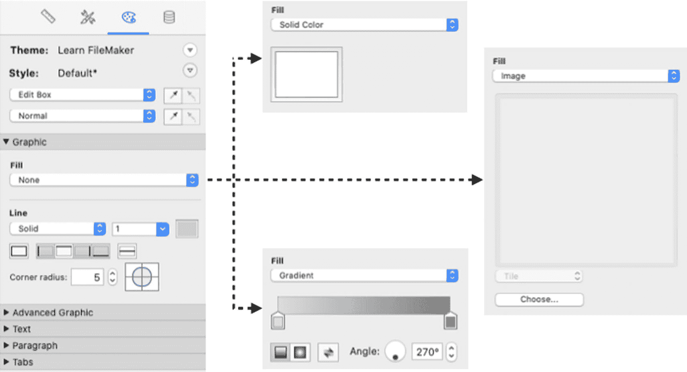

*图 19-11*
检查器外观面板中的图形子组

### 高级图形

`Advanced Graphic`组，如图 19-12 所示，控制所选对象的选定部件和状态的高级图形设置。

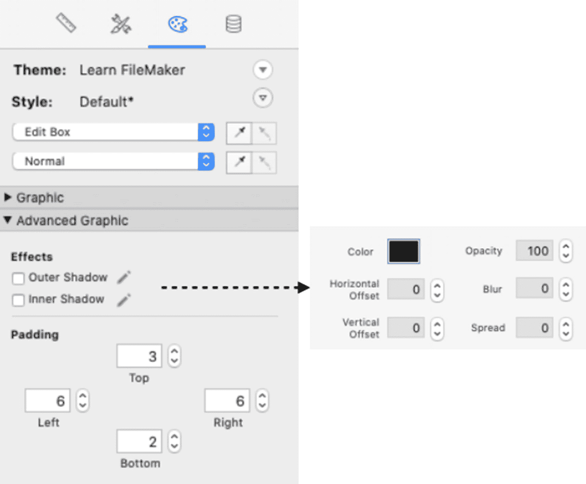

*图 19-12*
检查器外观面板中的高级图形子组

`Effects`复选框可为对象启用外部和内部阴影，使用相邻的图标按钮打开一个面板，可设置`Color`、`Offsets`、`Opacity`、`Blur`和`Spread`的具体设置。

`Padding`数值控制对象边框与其内容之间的距离。这些设置可能与`Paragraph`组的`indentation`和`spacing`设置冲突，如果同时使用，可能会导致混淆。

### 文本

`Text`组控制所选对象的选定部件和状态的标准文本和样式设置。这些包括字体`family`、`style`和`size`的选择，以及`color`和`style`的文本设置，还有`type`、`thickness`、`color`和`offset`的基线设置。

### 段落

`Paragraph`组，如图 19-13 所示，控制所选对象的选定部件和状态的段落对齐和间距设置。

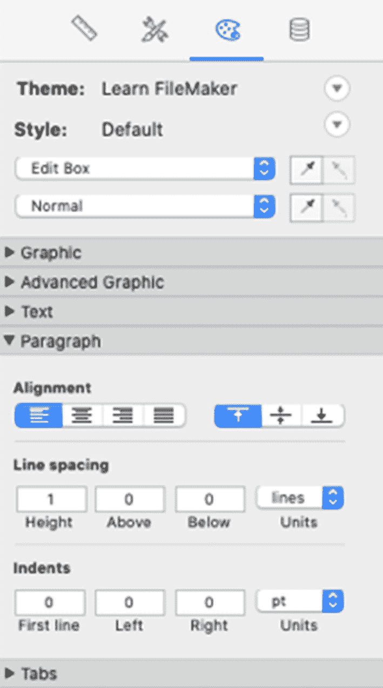

*图 19-13*
检查器外观面板中的段落子组

`Alignment`图标控制对象内文本的水平与垂直对齐方式，例如：字段内容、按钮名称等。`Line spacing`选项根据选定的度量单位调整段落的间距：`height`、`space above`和`space below`。`Indents`设置会在段落的第一行以及整个`left`和`right`缩进处插入文本空间，所有这些都基于选定的度量单位。

> **注意：** 这些设置中的某些可能与内边距（padding）设置冲突，如果同时使用，可能会导致混淆。

### 制表符

`Tabs`组，如图 19-14 所示，控制所选对象中文本的制表符缩进间距。点击按钮可在列表中添加或删除`Tab positions`。点击某个位置可编辑其测量值，并选择`Alignment`和`Leader`字符。

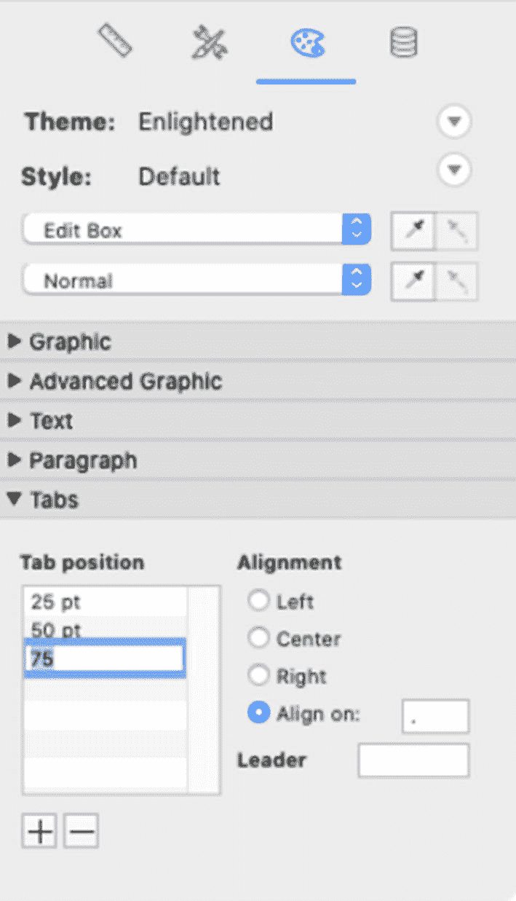

*图 19-14*
检查器外观面板中的制表符子组

### 检查数据设置

`Data`设置位于检查器的第四个面板，分为三个可折叠区域：`Field`、`Behavior`和`Data Formatting`。

### 字段

`Field`组，如图 19-15 所示，控制所选字段的设置。

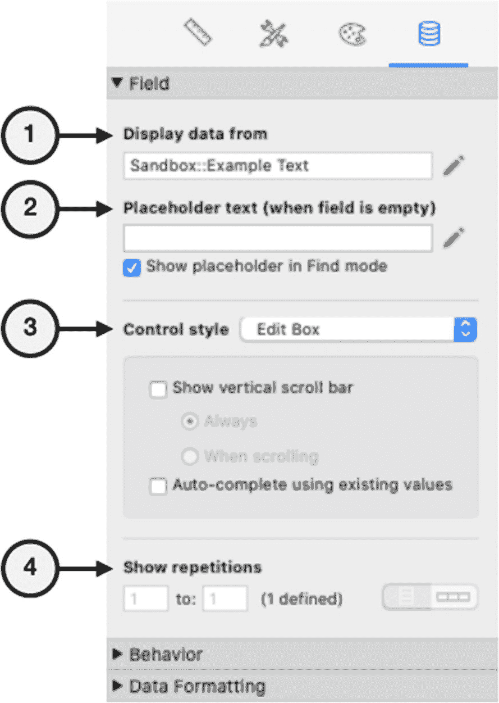

*图 19-15*
检查器数据面板中的字段子组

1.  `Display Data from` – 通过点击相邻按钮打开`Specify Field`对话框（见第[20]章(#429700_2_En_20_Chapter.xhtml)，"探索指定字段对话框"），选择一个要分配给布局上选定字段对象的字段。

2.  `Placeholder Text` – 输入文本或点击图标定义一个公式，该公式将在字段为空时显示（见第[20]章(#429700_2_En_20_Chapter.xhtml)，"使用字段占位符"）。

3.  `Control Style` – 选择字段的输入样式。下方阴影区域内的设置将根据所选内容而变化（见第[20]章(#429700_2_En_20_Chapter.xhtml)，"配置字段的控件样式"）。

4.  `Show Repetitions` – 控制字段的哪些重复项显示在布局上，及其垂直或水平方向（见第[8]章(#429700_2_En_8_Chapter.xhtml)，"字段选项：存储"）。

#### 行为

`Behavior`组，如图 19-16 所示，控制各种对象行为。

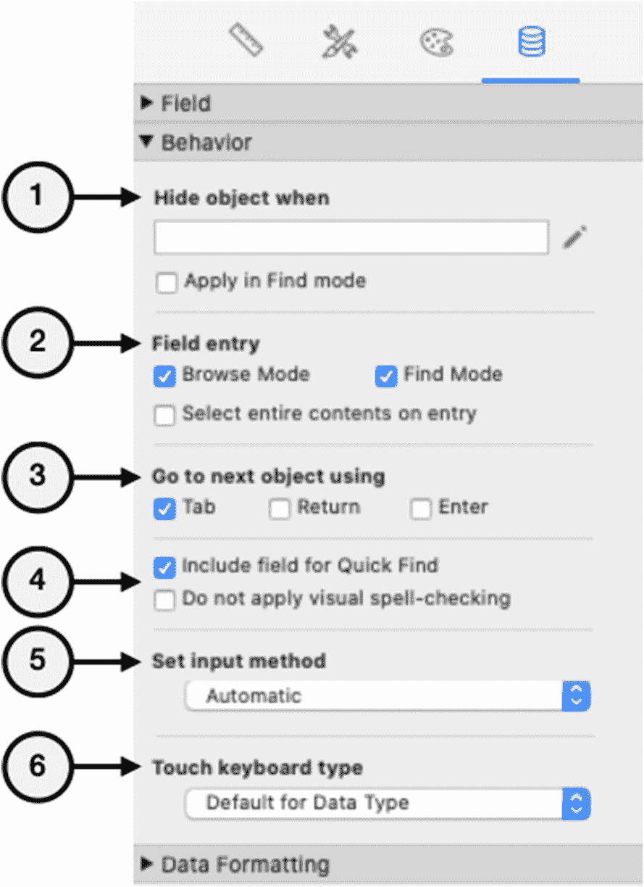

*图 19-16*
检查器数据面板中的行为子组

1.  `Hide Object When` – 控制任何对象何时应被隐藏。直接在该字段中输入公式，或使用相邻按钮打开对话框。复选框可启用在查找模式下隐藏。

2.  `Field Entry` – 启用在浏览或查找模式下用户可进入该字段。下方的复选框会导致当字段获得焦点时，字段的全部内容被选中。

3.  `Go to Next Object Using` – 选择哪个按键可跳转到下一个字段/对象。默认情况下，FileMaker 使用`Tab`键跳转字段，使用`Enter`键提交记录。在此处启用`Return`可防止用户在字段中输入回车字符。

4.  `Quick Find and Spell-Checking` – 控制字段是否包含在`Quick Find`中（见第[4]章(#429700_2_En_4_Chapter.xhtml)，"使用快速查找搜索"），并会直观地突出显示拼写错误。

5.  `Select Input Method` – 为字段输入选择一种语言。

6.  `Touch Keyboard Type` – 为 iOS 设备选择一种键盘类型：`ASCII`、`URL`、`Email`、`Numeric`、`Phone`等。

### 数据格式化

可使用“数据格式化”控件来转换原始字段内容在屏幕上的渲染方式。如图 19-17 所示，四个图标按钮用于指示所选字段的数据类型：`数字`、`日期`、`时间`或`容器`。这些按钮会根据所选字段的数据类型有条件地启用。“格式”弹出菜单包含的选项因所选数据类型而异，而菜单下方的区域则根据此菜单中的选择而变化。

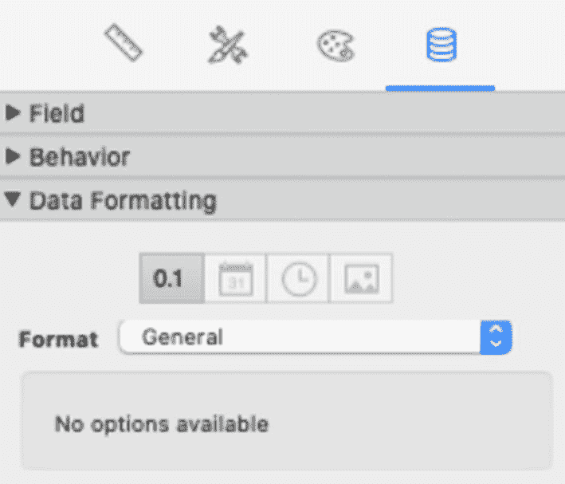

**图 19-17** “检查器”中“数据”面板的“数据格式化”子组

#### 数字的数据格式化选项

“数字”的“格式”菜单选项包括：

- **常规** – 按输入时的数值显示，不做特殊格式化，但可能会四舍五入或使用科学记数法，以适应该字段的范围。
- **按输入格式** – *完全*按照输入时的数值显示，不做任何更改，如果数字超出字段范围则显示问号。
- **布尔** – 将零和非零值转换为布尔格式。默认为`是`和`否`，但可替换为其他词语或符号。
- **十进制** – 包含小数位数、记数法、负值格式、分隔符选择等选项，例如，`1003.7568`可以显示为`1,003.75`或`#1003`。
- **货币** – 包含显示货币格式的选项，例如，`5.7534`可以显示为`$5.75`、`$5`等。
- **百分比** – 包含显示百分比的选项，例如，`.62`可以显示为`62%`或`62.00%`。

#### 日期的数据格式化选项

“日期”的“格式”菜单选项包括各种预配置的日期格式选项，并可通过详细的界面（如图 19-18 所示）定义自定义格式。这允许进行精细控制，选择任何日期组件、顺序、分隔符，并为日和月的数字提供前导零选项。使用这些控件，在字段中输入为“1/15/2017”的日期可以显示为多种不同的组合，包括：

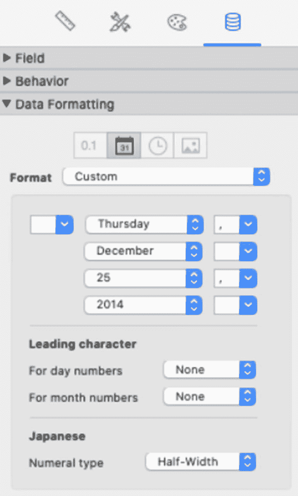

**图 19-18** 用于格式化日期的“自定义”选项

- `2017 年 1 月 15 日`
- `2017.01.15`
- `2017.01.15`
- `2017 年 1 月 15 日`
- `2017 年 1 月 15 日 星期日`
- `2017 年 01 月 15 日 星期四`

#### 时间的数据格式化选项

“时间”的“格式”菜单选项与日期格式化的选项类似。可以从各种预配置的时间格式中选择，输入自定义格式，并选择 24 小时制或 12 小时制、为小时和分钟添加前导零等。

#### 容器的数据格式化选项

容器的“格式”菜单选项控制图像相对于字段对象的大小调整方式：`裁剪至框架`、`缩小图像以适合`、`放大图像以适合`，或`缩小或放大图像以适合`。菜单下方还有几个附加设置。有`保持原始比例`的选项，当图像缩小或放大以适合字段时，此选项可保持图像的纵横比固定。“对齐”控件提供在字段内的定位。其他选项可控制图像优化或启用对嵌入在字段中的 PDF、音频和视频文件的交互式控制。

---

## 本章小结

本章介绍了“对象”和“检查器”面板。我们探索了它们提供的各种工具和设置。在下一章中，我们将开始创建对象。

---

