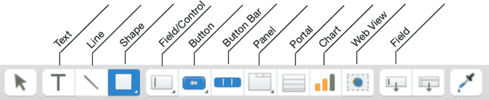

# 20. 创建布局对象

*布局对象*是一种界面元素，用于显示信息、接受数据输入和/或启动脚本化进程。对象可以是八种类型之一：`字段`、`文本`、`按钮`、`面板`、`门户`、`Web 查看器`、`图表`或`形状`。本章介绍所有类型的布局对象，涵盖以下主题：

- 在布局上插入对象
- 使用字段对象
- 使用文本
- 使用按钮控件
- 使用面板控件
- 使用门户
- 使用 Web 查看器
- 使用图表

## 在布局上插入对象

可以使用以下方法将任何对象的新实例插入到布局中：

**图 20-1** 用于向布局添加对象的工具栏图标

- 选择图 20-1 中所示的工具栏图标。然后，在设计区内单击并拖动以定义对象的尺寸。
- 从“插入”菜单中选择对象类型，以在布局上的默认大小和位置快速放置一个新实例。
- 选择现有对象并选择“编辑 ➤ 复制”菜单，将其复制为一个新实例。
- 选择现有对象并使用“拷贝”和“粘贴”功能，或按住 Option 键拖动，以创建现有对象的新副本。

**备注**：有几种对象的插入方式有所不同，本章将会说明。

当对象首次添加到布局时，它将处于原始状态，并可供配置。根据对象类型的不同，可以使用不同的方法进行配置。双击大多数对象类型将打开一个特定类型的配置对话框，通常侧重于数据配置选项，而非格式化或其他行为控制。选定的对象可以通过“格式栏”（第 3 章）中的选项、“格式”和“排列”等菜单中的选项，以及“检查器”面板中的选项进行操作。

**注意**：布局上任何对象的实际外观将根据对象状态、自定义格式设置、条件格式设置（第 21 章）以及分配给布局的主题（第 22 章）而有所不同。

