# 处理字段对象

在 FileMaker 中，术语*字段*的含义会根据讨论语境而有很大差异。请花点时间区分通常被混为一谈的四种事物，如图 20-2 所示：

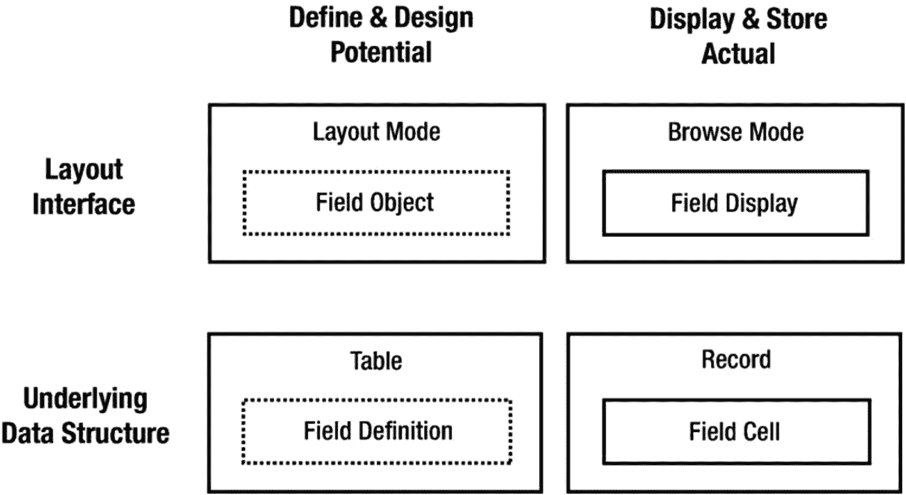

图 20-2 – 术语“字段”各种用途的图示

- 表模式中的*字段定义*，即其底层数据结构
- 数据记录的*字段单元格*实例
- 正在设计的布局上的*字段对象*
- 浏览模式下布局中呈现的*字段显示*

将这四种都称为“字段”本身并无问题，也无需强制使用所示的标准术语。事实上，本书有时也会统一用该术语指代它们。然而，请花点时间理解其中的区别，以避免混淆。

表的*字段定义*是存储*潜力*的独立单元，它确立了数据库模式中的数据类型和设置。这些定义会被复制为*字段单元格*，对应表中数据内容创建的每条记录，成为包含信息的*实际*存储单元。这类似于电子表格的隐喻：字段定义如同*列*，记录如同*行*，而记录中字段的每个实例则是一个*单元格*。在 FileMaker 中，由于用户是*通过*布局与数据结构交互，因此隐喻性的电子表格被隐藏起来，这种区别对用户来说不太重要。

在设计布局时，*字段对象*是一个图形元素，它定义了字段单元格显示的位置、行为和外貌。在布局模式下，*字段对象*被赋予一个*字段引用*，它是指向*字段定义*的指针。在浏览模式下查看时，该布局对象会渲染成*字段显示*，展示当前查看记录的*字段单元格*中存储的信息；其格式和行为遵循*表的字段定义*和*布局的字段对象*两者的设置。

## 向布局添加字段

可以通过多种方法将字段添加到布局中。有些方法会先放置字段对象，然后要求指定字段引用。其他方法则要求在创建对象之前指定引用。还有一种方法可以根据情况双向操作。下面简要介绍所有向布局添加字段的方法。

### 添加后指定字段引用

以下所有方法都会先在布局上添加一个*未定义字段对象*，然后立即弹出*指定字段*对话框（下一节描述），要求选择字段引用：

- 将工具栏中的`字段`工具拖放到布局上。
- 选择工具栏菜单中的`字段/控件`，将光标置于*字段绘制*模式，然后点击并拖动以创建字段对象。单击一次可自动选择默认的`编辑框`控件类型。按住鼠标点击并保持，可从菜单中选择一种控件类型。
- 选择`插入 ➤ 字段`菜单。
- 使用`编辑 ➤ 复制`菜单复制选定的字段。

### 添加时指定字段引用

以下所有方法在添加字段时，引用已作为过程的一部分指定好：

- 从`对象`面板（第 [19]章(#429700_2_En_19_Chapter.xhtml)）的`字段`标签页中，拖放一个或多个字段。
- 复制并粘贴现有字段。
- 创建新布局时，在对话框中添加字段（第 [18]章(#429700_2_En_18_Chapter.xhtml)，“创建新布局”）。
- 使用`编辑 ➤ 复制`菜单复制*多个字段*，它们当前分配的字段将保持不变。
- 按住`Option`（macOS）或`Windows`（Windows）键，拖放现有字段以创建该字段对象的新副本。此操作可在单个布局内或两个窗口的布局之间进行。

当在两个不同文件的窗口之间拖放复制字段时，字段分配会有所不同。如果接收文件在相同表名中定义了与被拖字段同名的字段，则该字段将引用该字段进行放置。如果接收文件没有匹配的字段，但有匹配的表名，则字段将以`<字段缺失>`引用进行放置。如果接收文件既没有匹配的字段也没有匹配的表名，则该字段将作为空白字段对象放置。

## 探索“指定字段”对话框

使用任何需要选择引用的方法添加字段时，都会先临时放置一个空白字段对象，并打开*指定字段*对话框，如图 20-3 所示。在顶部，从菜单中选择一个表 occurrence。当前布局的表 occurrence 始终位于顶部，文件中所有其他 occurrence 则分列于两个列表中：相关和不相关。可以添加任何字段，但只有来自当前表或相关表的字段才能按预期工作。找到并选择字段后，勾选可选地自动创建标签的复选框，然后点击`确定`将字段添加到布局。

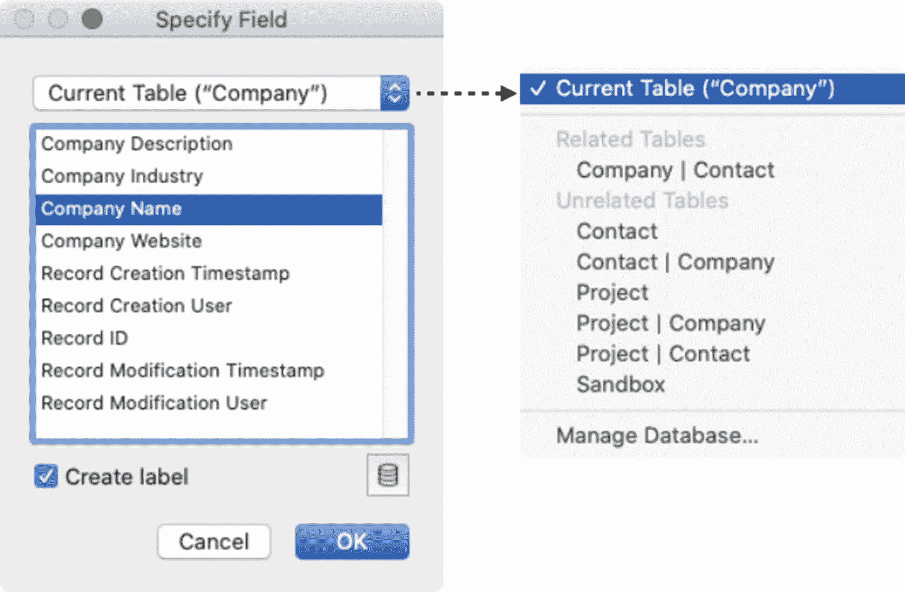

图 20-3 – 用于选择字段引用的对话框

### 编辑现有字段的引用

要重新分配现有字段对象的引用，请双击该字段打开*指定字段*对话框，或从其上下文菜单中选择`指定字段`，或点击`检查器`面板中`数据`标签页下`字段`组里“显示数据来自”设置旁边的铅笔图标。

## 处理字段标签

*字段标签*是放置在字段旁边的文本对象，用于帮助用户识别其内容。标签可以手动插入文本对象创建，也可以使用`指定字段`对话框中的`创建标签`选项自动创建。创建后，可以像其他文本对象一样对其进行编辑、移动、格式化和操作。只要没有手动编辑过，自动创建的标签将保持与字段名称*动态链接*。在这种情况下，如果在模式中修改了字段的已定义名称，标签会自动更新以反映新名称。稍后可以通过双击现有字段重新打开`指定字段`对话框，选中`创建标签`框并点击`确定`，为现有字段添加标签。该标签将作为动态链接值重新出现在现有字段对象旁边。

## 配置字段的控件样式

*控件样式*是一种布局设置，用于修改字段的外观和输入选项，以简化数据输入。可以为字段分配七种类型之一，这些类型位于`检查器`面板`数据`标签页下`字段`组的`控件样式`菜单中，如图 20-4 所示。

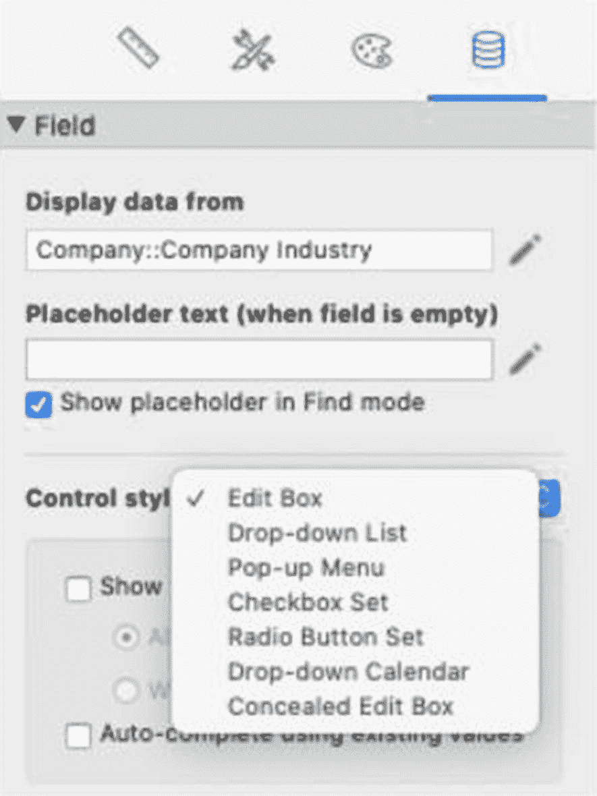

图 20-4 – 可用的字段控件样式菜单


### 编辑框

`编辑框`是默认的控件样式，它将字段渲染为一个框，用户可以在其中执行自由格式的数据录入任务。其大小可以是单行文本，也可以扩展到多段落，并且可以包含滚动条，以允许输入内容超出字段框架的尺寸，如图 20-5 所示。所有容器字段都会自动锁定为`编辑框`控件样式。

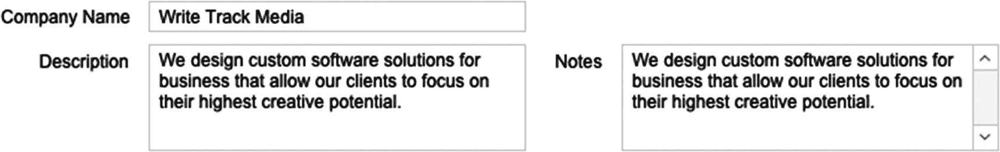

图 20-5

编辑框：单行（上方）、多行（左下方）以及带滚动选项的编辑框（右下方）

一旦选中此控件样式，即可启用添加垂直滚动条以及基于历史输入提供自动补全建议的设置，如图 20-6 所示。

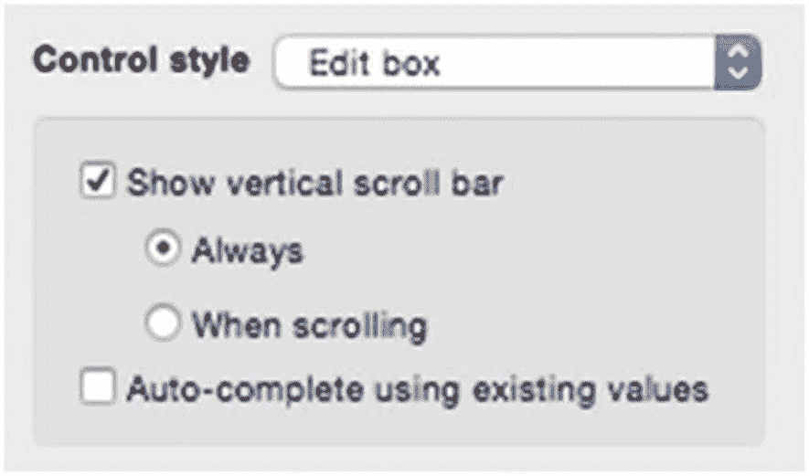

图 20-6

各种编辑框样式示例

### 弹出菜单

`弹出菜单`控件样式将字段渲染为一个基于已定义值列表（第 11 章）的选择菜单，如图 20-7 所示。

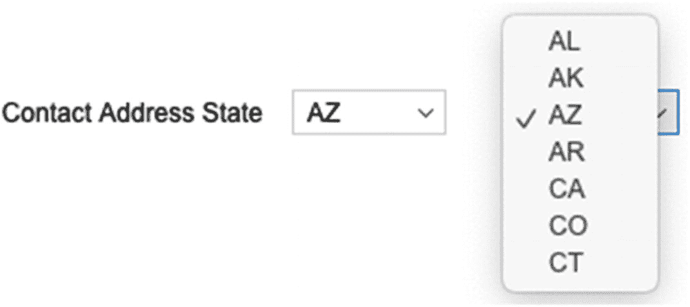

图 20-7

一个处于静止状态（左）和展开状态（右）的弹出菜单

弹出菜单的设置包括选择一个值列表和若干可选功能，如图 20-8 所示。第一个复选框会在字段上绘制一个箭头，直观地提示它将打开一个菜单。接下来的两个选项允许任何用户用其他条目覆盖该列表，或直接编辑值列表（无需访问完整的开发者对话框）。最后一个选项用于更改做出选择后在字段中显示的值。启用后，它将显示值列表中的`第二个值`，而不是实际输入到字段中的值。例如，如果一个列表显示了`记录 ID` 和`公司名称`，则前者总是被输入到字段中；启用此选项后，后者将`显示`为像是被输入的值。

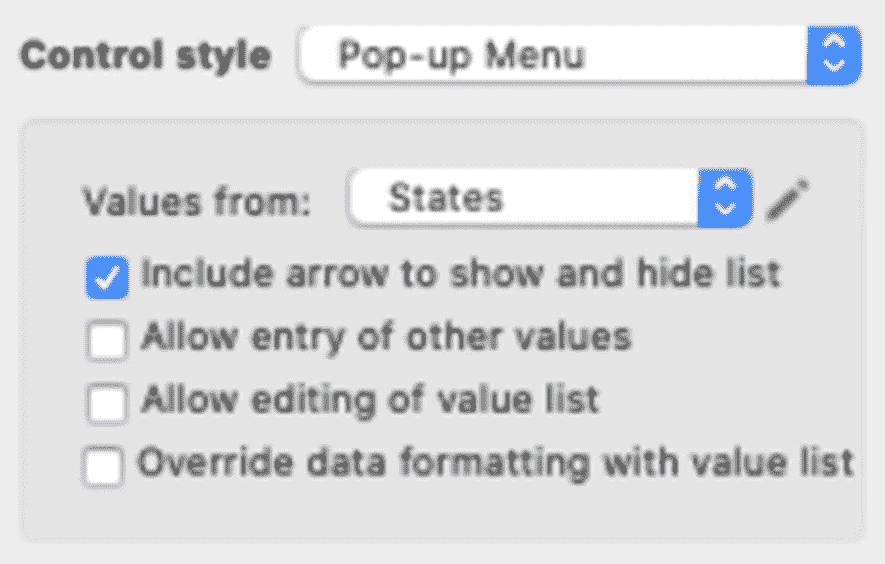

图 20-8

弹出菜单控件选项

### 下拉列表

`下拉列表`控件样式将字段渲染为一个组合编辑框，并附有值列表项的菜单，如图 20-9 所示。这允许用户选择输入自定义值，或从列表中选择一个已有的值。

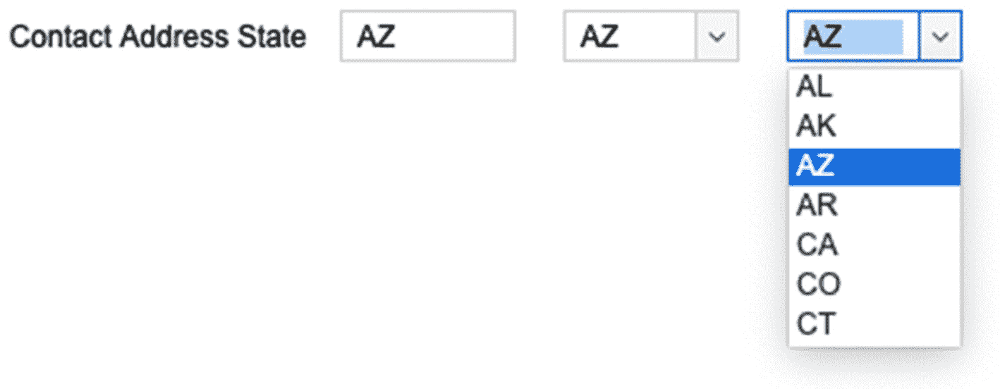

图 20-9

一个没有可选箭头时处于静止状态的下拉菜单（左）、有可选箭头时处于静止状态（中）和展开状态（右）

下拉列表的设置包括选择一个值列表和若干可选功能，如图 20-10 所示。第一个复选框启用一个打开列表的箭头图标。若未选中，则当字段获得焦点时，列表会自动弹出。其他选项允许用户直接编辑列表中的值，或基于字段历史输入中以用户正在键入的文本开头的内容进行自动补全建议。

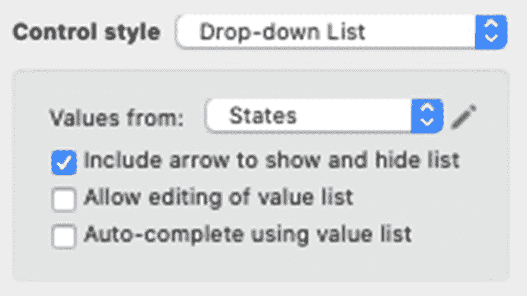

图 20-10

下拉列表控件选项

### 复选框集

`复选框集`控件样式将字段渲染为一组复选框，每个复选框都带有一个文本标签，如图 20-11 所示。这些复选框允许用户从指定的列表中选择一个或多个选项。复选框集旨在方便向单个字段中输入多个值。当用户勾选复选框时，相应的值会作为以回车符分隔的值列表插入到字段中，例如，如果勾选了“银行业”和“零售业”，字段中的实际值将是`Banking¶Retail`。


图 20-11

复选框集控件样式

复选框集的设置包括选择一个值列表，如图 20-12 所示。还有一个选项允许用户使用自定义条目覆盖列表，以及选择用于指示复选框被选中的图标。

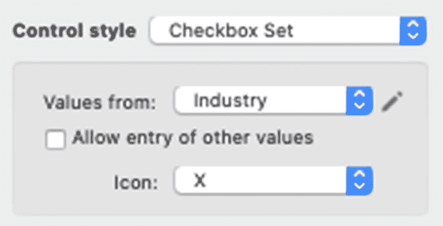

图 20-12

复选框集控件选项

### 单选按钮集

`单选按钮集`控件样式将字段渲染为一组选择圆圈，每个圆圈都带有一个文本标签，如图 20-13 所示。这些控件鼓励用户从列表中选择单个选项。做出选择后，相应的值会替换字段中的先前值，从而仅保持单一选择。单选按钮格式没有提供直观的方法来移除选择并使字段为空。要清除选择，用户可以按住`Shift`键并点击当前选项，或者点击字段中的任意位置并按下`Delete`键。


图 20-13

一个单选按钮集

单选按钮集的设置包括选择一个值列表和一个允许用户输入自定义值的选项，如图 20-14 所示。

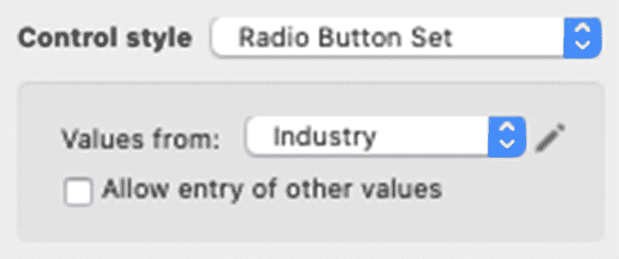

图 20-14

单选按钮集控件选项

> **注意：** 复选框和单选按钮的列数由布局中字段的宽度和高度自动设置。

### 下拉日历

`下拉日历`控件样式将字段渲染为一个组合编辑框，并带有一个可选的日历小部件，该小部件可打开并附着在字段底部，如图 20-15 所示。

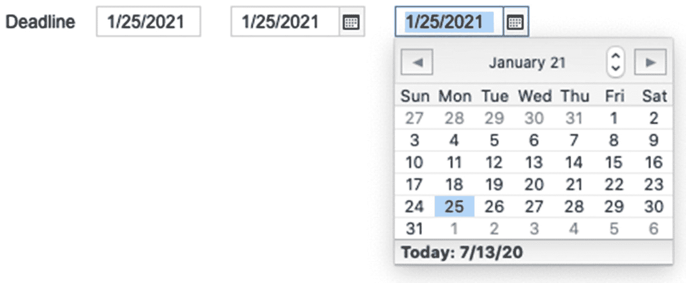

图 20-15

一个没有可选图标时处于静止状态的下拉日历（左）、有图标时处于静止状态（中）以及获得焦点并展开状态（右）

日历面板包含几个有助于快速导航到特定日期的控件，其中包括一些不太显眼的控件。点击顶部的月份和年份可以弹出一个隐藏的弹出菜单，从而快速导航到任意月份。右侧的上/下箭头可使所选月份向前或向后移动 1 年。左/右箭头可使所选年份向前或向后移动 1 个月。点击日历中的某个日期即可选中它，或者点击页脚中的`今天`以选择当前日期。做出选择后，该日期会插入到字段中。

日历的设置包括选择一个值列表和一个选项，用于包含一个显示或隐藏日历的图标，如图 20-16 所示。

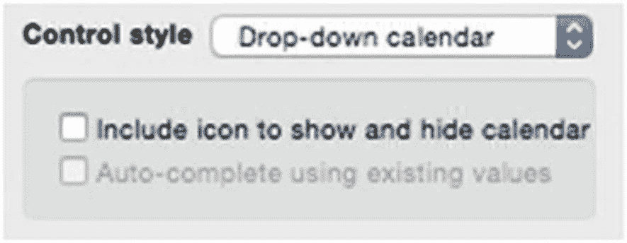

图 20-16

下拉日历的选项

> **提示：** 日历控件样式可以与非日期字段一起使用。选择的内容将以文本字符串形式输入到文本字段中，而以所选日期加当前时间的形式输入到时间戳字段中。


#### 隐藏式编辑框

`隐藏式编辑框`控件样式会将字段渲染为每个字符显示为项目符号的编辑框，如图 20-17 所示。当字段获得焦点时，每输入一个字符便显示一个项目符号，但一旦焦点移至其他字段或提交记录，则会恢复显示八个项目符号。

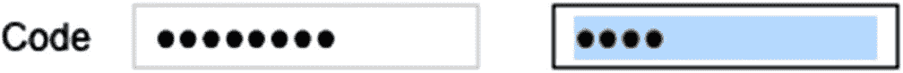

**图 20-17** 无焦点（左）和有焦点（右）的隐藏式编辑框

> **注意**：隐藏式编辑框仅旨在提供*最低限度的安全性*。字段中存储的数据*并*未加密。在应用了该控件样式的布局上，数据会被遮挡，但脚本和计算仍可访问并像操作其他字段一样操控这些数据。

### 为双字段值列表使用弹出菜单

弹出菜单控件样式具有一项独特功能，可在与双字段值列表配合使用时减少对额外资源的需求。通过配置已分配的值列表使其仅显示*第二个字段*（第 11 章，“使用字段中的值”），并将字段的控件样式设置为启用了*使用值列表覆盖数据格式*选项的弹出菜单，用户将仅看到第二个字段，即使第一个字段会被输入到字段中。

为说明这一点，向 `Contact` 表中的 `Contact Company ID` 字段添加一个用于 *Company* 记录的值列表，该列表将插入公司 `Record ID` 并在联系人与公司之间建立关系。首先，设置一个名为 `Company List` 的值列表，如图 20-18 所示，该列表生成所有公司记录的 `Record ID` 列表，并将 `Company Name` 作为第二个字段。

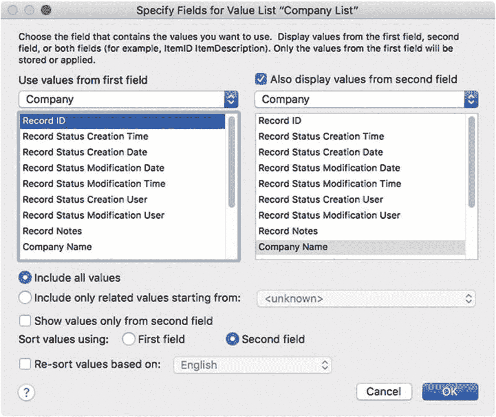

**图 20-18** 按第二个字段排序的双字段值列表示例

接下来，将该值列表作为下拉列表应用于 `Contact Company ID` 字段，如图 20-19 所示。

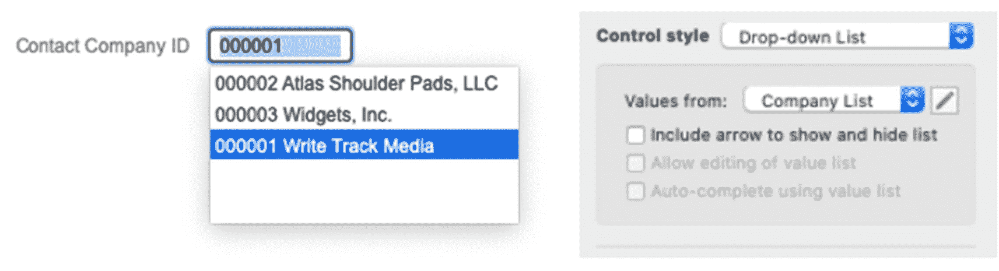

**图 20-19** 分配给字段的值列表（左），配置为下拉列表（右）

通过在值列表定义中包含第二个字段，用户可以按*名称*查看并选择公司。然而，一旦选择并提交后，菜单消失，仅保留*id*可见。传统上，此问题可通过在 `Contact Company ID` 字段与 `Company` 表的 `Record ID` 之间添加关系，然后通过该关系提取 `Company Name` 字段并显示在布局上附近位置来解决，如图 20-20 所示。

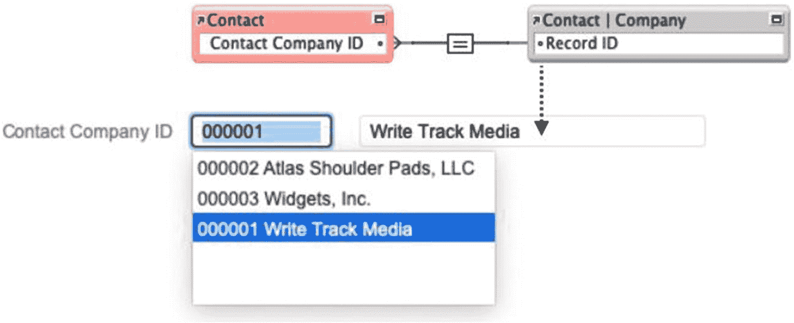

**图 20-20** 公司名称字段（右）从相关表匹配项（右上）中提取

虽然这能解决问题，但存在一些缺点。它会使布局变得杂乱，同时显示 id 和名称。而且，当您点击 id 字段、按名称选择，id 进入字段，而名称却显示在侧边时，操作会显得有些不自然。由于用户通常无需查看 id，一种创造性的做法是重叠两个字段，使用户只看到顶部的公司名称字段，而隐藏其下方的 id 字段。通过将顶部的名称字段配置为不允许输入，点击操作会穿透它并激活其后方的 id 字段，从而打开菜单。做出选择后，id 字段将被名称字段隐藏。使值列表仅显示第二个字段，会导致 id 几乎完全不可见（菜单打开时除外）。虽然此方法可行，但专用关系与笨拙的字段叠加组合使其不太理想。

相比之下，可以消除所有这些混乱，直接使用可覆盖数据格式的弹出菜单控件样式。首先，扩展 `Contact Company ID` 字段的宽度。然后，确认值列表设置为仅显示第二个字段（如前所述）。最后，将字段配置为显示为弹出菜单，并选择*使用值列表覆盖数据格式*选项，如图 20-21 所示。现在，列表将仅显示公司名称，而该字段虽然仍*包含* id，但会通过布局格式将其覆盖，显示从值列表中选择的值，即公司名称。此方法*无需*重叠字段或要求额外的表匹配项和关系。

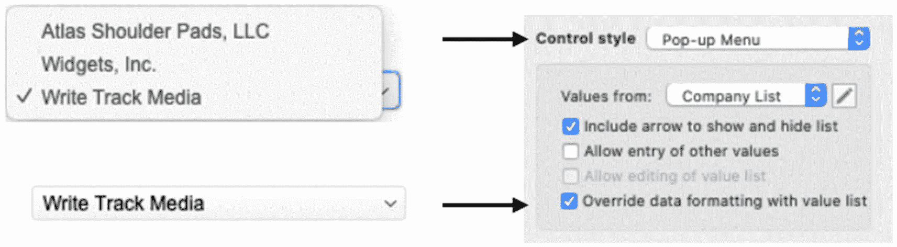

**图 20-21** 有焦点（左上）与无焦点（左下）的字段，配置为带覆盖功能的弹出菜单（右）

### 绕过值列表输入限制

使用值列表的四种控件样式均隐含地鼓励遵守某些数据输入限制，即输入*单个值*或将输入限制为*仅限值列表项目*，如表 20-1 所示。值得指出的是，*这些并非严格执行的规则，狡猾的用户可以绕过它们*。就其机制本质而言，弹出菜单和单选按钮都大致排除了用户输入多个项目或不在分配列表中的值的可能性。同样，复选框集（未设置允许其他值的选项）似乎也排除了选择不在列表中的值。然而，所有这些“限制”都是可以覆盖的。在必须限制用户只能使用控件样式提供的选项的情况下，可能需要采取明确措施，使用户无法绕过值列表。

**表 20-1** 值列表驱动控件样式的隐含输入限制

| 控件样式 | 单个项目 | 仅限值列表项目 |
| --- | --- | --- |
| 弹出菜单 | 是 | 是 |
| 下拉列表 | 是 | – |
| 复选框集 | – | 是 |
| 单选按钮 | 是 | 是 |


#### 阻止输入自定义值

有几种方法可以输入字段指定值列表中不存在的值。例如，当字段获得焦点时，可以粘贴剪贴板中的文本。此外，*插入*菜单中的任何文本输入功能都可以用来插入预定义值。用户可以从另一个字段甚至另一个应用程序中拖动一段文本并将其放入该字段。导入记录以及许多脚本步骤都可以绕过该界面。有几种方法可以加强数据输入，使其无法绕过指定的值列表。

##### 使用字段验证

阻止用户绕过指定值列表的一种方法是在字段定义级别使用验证（第 8 章）。这将适用于任何布局上该字段的每次使用（*包括*未使用值列表控件样式的布局），并会向用户发出错误警告。对于需要全面覆盖的情况，这是一个不错的选择。

##### 使用计算过滤错误值

或者，在字段定义级别使用自动输入计算可以自动预处理数据输入，以确认任何输入都是合适的，并过滤掉不合适的输入。这提供了更大的灵活性，因为自定义公式可以根据各种条件动态改变行为，例如，使字段在不同的布局上或根据不同的因素以不同的方式运行。由于该技术会在没有错误对话框的情况下静默地删除错误输入，因此非常适合进行无中断的修正，并且不会减慢用户的数据输入速度。然而，在某些情况下，它可能会让人困惑，对于没有经验的用户来说，这看起来像一个错误，他们不知道犯了什么错误，也不知道他们的输入已被修改。

以下公式假设输入的是单个值，并将自动过滤掉任何不在列表中的输入值。它使用 `Let` 语句和 `ValueListItems` 函数，将名为“公司 - 行业”的值列表中的所有项目拉取到一个名为 `itemsAllowed` 的变量中。然后，`FilterValues` 函数会删除所有不在允许列表中的输入项。这个公式可以通过 `While` 语句进行扩展，以循环处理并拒绝包含多个值的字段中的一个或多个条目，就像使用复选框控件集时一样。

```
Let (
itemsAllowed = ValueListItems ( Get ( FileName ) ; "Company - Industry" )
;
FilterValues ( itemsAllowed ; Self )
)
```

##### 使用脚本触发器

最后，可以使用 `OnObjectValidate` 脚本触发器（第 27 章）来运行一个脚本，验证用户的输入并采取纠正措施，自动清理和/或通知用户其错误。它甚至可以中止验证过程，强制用户在继续之前纠正错误。对于需要特定布局的干预，这是一个不错的选择，可以通过自定义通知自动纠正，或者通知并强制用户更改。

#### 阻止输入多个值

复选框集是唯一一种直观地允许从值列表中选择多个项目的值列表驱动控件样式。其他控件样式在选择新值时总是替换现有值，并且*看起来*限制为只能单选。然而，可以使用以下任何方法从弹出菜单、下拉菜单甚至单选按钮中选择多个项目：

*   点击其他选项时按住 Shift 键。
*   使用 `粘贴` 命令输入一个以回车符分隔的列表。
*   从另一个字段或应用程序拖拽一个以回车符分隔的列表。
*   当字段启用了“允许输入其他值”选项时，用户可以手动输入多个值。
*   使用诸如 `设置字段`、`插入文本`、`替换字段内容`、`导入记录` 等脚本步骤。

##### 限制绕过机制输入多值

要禁止在字段中输入多个值，请使用自动输入计算或脚本触发器来阻止用户输入。

###### 使用自动输入将字段限制为单个值

自动输入计算可以自动删除除一个值之外的所有输入值。在下面的示例中，只会保留最后输入的值。下面的第一个示例使用 `GetValue` 和 `ValueCount` 函数将输入限制为最后输入的值。第二个示例将始终返回第一个输入的值。当此公式执行时，所有其他值都将消失。

```
GetValue ( Self ; ValueCount ( Self ) )
GetValue ( Self ; 1 )
```

###### 使用脚本触发器将字段限制为单个值

使用 `OnObjectValidate` 脚本触发器，该触发器运行一个脚本来检测是否存在多个值，然后自动删除多余的值，或者警告用户并中止验证过程，直到他们纠正问题。

### 使用字段占位符

*字段占位符*是一种文本值，当字段为空时会显示在其中。这可以用来代替字段标签，或者为用户提供一个简短的操作提示。由于占位符是作为*布局对象*应用于字段，而不是*字段定义*，因此在新布局上的每个实例都必须单独配置。为避免混淆，占位符值有其自己的*部件样式状态*（第 22 章），允许更改格式，以便用户区分占位符和实际的字段内容。图 20-22 中的示例显示了同一个 `公司名称` 字段的三个实例。第一个显示的是新字段添加到布局且没有占位符时的默认状态。第二个显示了一个使用占位符代替标签的示例，显示的是字段名称。虽然这种技术节省空间，但一旦向字段中输入了实际数据，占位符文本就会消失，并且不会显示标签。当内容不易识别时，这可能会令人困惑。第三个示例显示了一个带有永久标签和描述性提示作为占位符的字段。

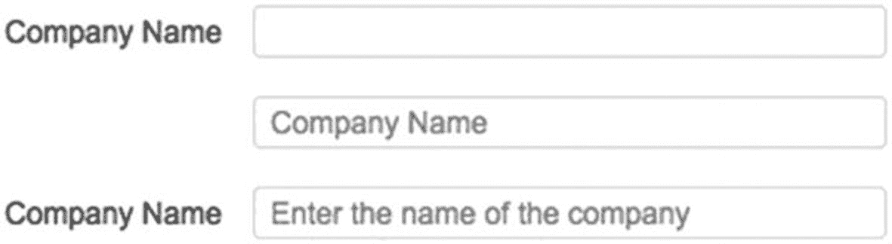

图 20-22

无占位符的示例（上）、以字段名作为占位符的示例（中）和以占位符提示的示例（下）

注意

格式化为复选框或单选按钮的字段不能有占位符文本值。

#### 输入占位符文本

要定义占位符，请选择一个字段，然后打开“检查器”面板中“数据”选项卡上的 `字段` 组。可以直接在 `占位符文本` 框中输入静态值，如图 20-23 所示。

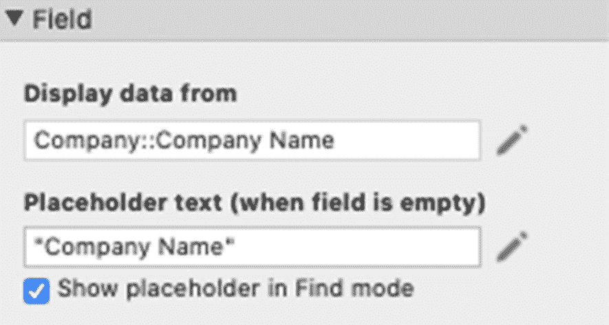

图 20-23

用于定义字段占位符文本的控件

或者，点击铅笔图标输入生成占位符值的公式。当窗口处于浏览模式时，将显示占位符文本。启用 `在查找模式下显示占位符` 复选框，使其在查找模式下也显示。当在查找模式下启用时，公式可以根据检查 `WindowMode` 的 `Case` 公式来改变显示的值，如下例所示：

```
Case (
Get ( WindowMode ) = 0 ; "输入公司名称" ;
"搜索公司名称"
)
```


### 使用占位符替代显示计算字段

在过去，开发人员经常使用计算字段来创建可变字段标签，或在布局上显示记录的动态信息。例如，用于拼接记录的元信息或显示动态错误警告的字段，通常需要在表中添加一个计算字段，并将其作为布局显示机制。在现代，我们不再需要为了通过界面显示这类只读信息而用计算字段打乱表的架构。一种方法是使用一个位于中央`System`表中的单个不可编辑全局字段，该字段可以在多个布局实例中复制，每个实例都有独特的由计算驱动的占位符文本值。

**提示：** 透明样式的按钮栏的名称计算可用作只读显示机制。将这些用作字段标签，可以轻松将标签切换为按钮或弹出面板。

### 显示重复字段

定义为重复的字段（第 8 章）可以显示在布局上，包含部分或全部定义的重复项，并支持垂直或水平方向排列，如图 20-24 所示。

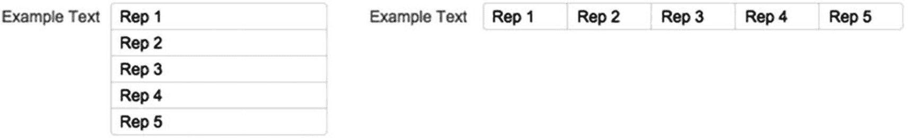
*图 20-24：一个五次重复的文本字段，分别以垂直（左）和水平（右）方向显示*

当字段被添加到布局时，它会自动配置为显示单个重复项。若要更改此设置，请选中该字段，然后使用`检查器`面板的`数据`选项卡中`字段`组的`显示重复项`设置，如图 20-25 所示。括号中显示了该字段可用的定义重复次数。在两个字段中输入起始和结束重复编号，以控制在布局上可见的*哪些*重复项以及*多少个*重复项。相邻的按钮用于切换方向。

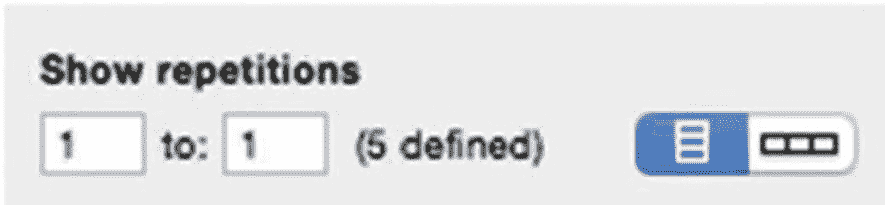
*图 20-25：定义布局上重复项显示数量的控件*

使用这些设置，字段的每个重复项可以单独显示为一个独立的字段对象，或分组显示在一个字段对象中。为了说明各种可能的配置，图 20-26 显示了一个布局上共有七个字段对象：其中五个分别显示不同的单个重复项，一个显示重复项 1-3，另一个显示重复项 3-5。

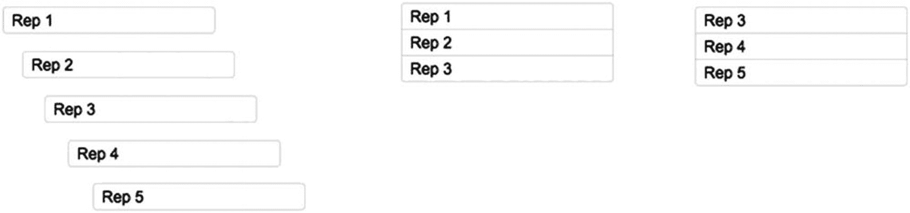
*图 20-26：重复字段单独配置（左）或分组配置（右）*

## 使用文本

文本对象可以以四种类型之一添加到布局中：*静态文本*、*动态符号*、*合并字段*和*合并变量*。

### 创建静态文本

在布局上，*静态文本*是一个包含不变字符串的对象，用于向用户提供标签或传达信息。静态文本对象可以包含丰富格式和多段落。在布局模式下，通过选择工具栏中的`文本`工具，然后在布局设计区域点击并拖拽以定义对象边界，即可创建静态文本对象。释放光标后，即可开始输入。创建后，可以通过选择工具并点击对象，或双击对象，来编辑和格式化文本。

### 创建动态占位符符号

*动态占位符符号*是文本对象中的一个特殊字符串，它会自动替换为内容随时间变化的预定值类型（例如日期或时间）。有数十种可用符号，每种对应一个`Get`函数（第 13 章，“Get 函数介绍”）。这些符号可以手动输入，也可以通过从`插入`菜单中选择一项来添加到布局中。该菜单会将符号插入到当前具有编辑焦点的文本对象中，或作为新对象添加。符号由双花括号括起的关键词构成。例如，要在布局上显示*当前日期*，请创建一个包含如下值的文本对象：

```
{{CurrentDate}}
```

占位符符号可以与其他符号和静态文本组合，以创建复合字符串。以下示例可以放在打印布局的页脚中，并自动更新以显示报告打印时的日期、时间和用户账户：

```
报告打印于 {{CurrentDate}} {{CurrentTime}}，由 {{AccountName}} 打印
```

### 创建合并字段

与动态函数占位符类似，*合并字段*是一种符号标记格式，允许字段内容显示在布局上的不可编辑文本对象中。使用`插入 ➤ 合并字段`菜单，可以将其添加到当前具有编辑焦点的文本对象中，或作为新对象添加。合并字段由字段名构成，字段名两侧各有两个左尖号和两个右尖号，也可以手动输入。

```
<<字段名>>
```

引用当前布局表的本表字段时，只需字段名称即可。引用相关字段时，必须包含表出现名称以提供上下文参考。以下示例假定放置在`联系人`布局上，将显示联系人的全名及分配给他们的相关`公司`名称：

```
<<联系人>> 在 <<公司>>
// 结果 = 联系人 王小明 在 山韵肩垫有限公司.
```

**警告：** 在复合合并字段字符串中使用的空字段，会使其在周围静态文本构成的句子中显示为空白，导致语句不通！

### 创建合并变量

*合并变量*是一种符号标记格式，允许全局变量（第 12 章，“变量”）在布局上以文本对象的形式呈现。与合并字段和动态符号类似，合并变量可以与其他合并变量、文本、符号及合并字段任意组合使用。使用`插入 ➤ 合并变量`菜单，可以将其添加到当前具有编辑焦点的文本对象中，或作为新对象添加。合并变量由变量名构成，变量名两侧各有两个左尖号和两个右尖号，遵循如下模式：

```
<<$变量名>>
```

## 使用按钮控件

*按钮*是一种布局对象，它将操作控件嵌入到对象中。按钮在浏览和查找模式下工作，根据类型和配置的不同，可以运行脚本、执行单个脚本步骤或打开弹出界面元素。按钮允许开发人员将活动控件嵌入界面，用于导航、创建、删除或执行任何其他功能。这些控件为用户提供了快捷方式，减轻了手动重复复杂任务的负担。FileMaker 提供了四种按钮选项：三种原生按钮类型——*按钮*、*弹出按钮*和*按钮栏*——以及将*任意对象*格式化为按钮的功能。

### 使用按钮

*按钮*是一种传统图形化按键形式的布局对象，如图 20-27 所示。按钮可以通过工具栏图标或选择`插入 ➤ 按钮`菜单添加到布局中。创建按钮时，会打开`按钮设置`对话框，允许配置*标签*和*操作*。对于现有按钮，可以双击它，或从`格式`菜单或按钮的上下文菜单中选择`按钮设置`命令，来打开该对话框。


*图 20-27：按钮示例*


好的，作为一名高级文档工程师和翻译员，我将严格遵循您的注意事项和示例，将给定的英文文本翻译成中文。


### 配置按钮标签

*按钮标签*是显示在按钮边界内的标识性文本和/或图标，用于向用户传达其将执行的功能。标签在*按钮设置*对话框的顶部区域定义。按钮可以包含文本标签、图标标签，或两者组合。

#### 使用文本标签

要定义一个带有文本标签的按钮，请选择*标签*选项，然后输入标签文本，如图 20-28 所示：

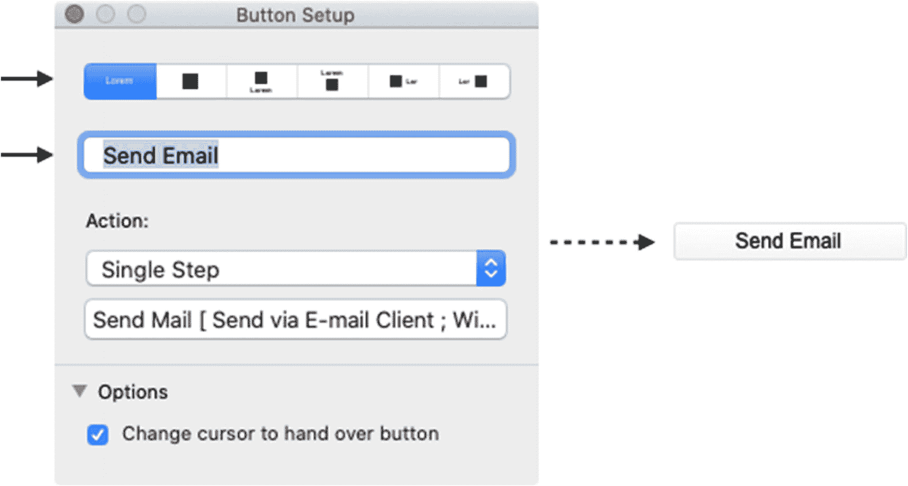

**图 20-28** – 呈现一个命名按钮的按钮配置（对话框）（右）

> **提示：** 按钮标签可以包含在文本区域中输入的合并字段，以创建动态名称。如需更动态的命名公式，请使用单段按钮栏代替按钮。

#### 使用图标标签

当定义一个带有*图标*标签的按钮时，*按钮设置*对话框的控件会发生变化，以允许选择和配置图像，如图 20-29 所示。从标准图标列表中选择一个图标。可以通过点击下方的加号图标并选择一个 PNG 或 SVG 图像来扩展列表。此处添加的新图像将在当前数据库文件中的任何位置可用。使用图标列表下方的滑块可以在按钮对象的边界内缩小或放大图标的大小。

> **注意：** 与其他控件不同，无论当前为标尺选择了哪个单位，此处的尺寸设置始终以*点*为单位显示。

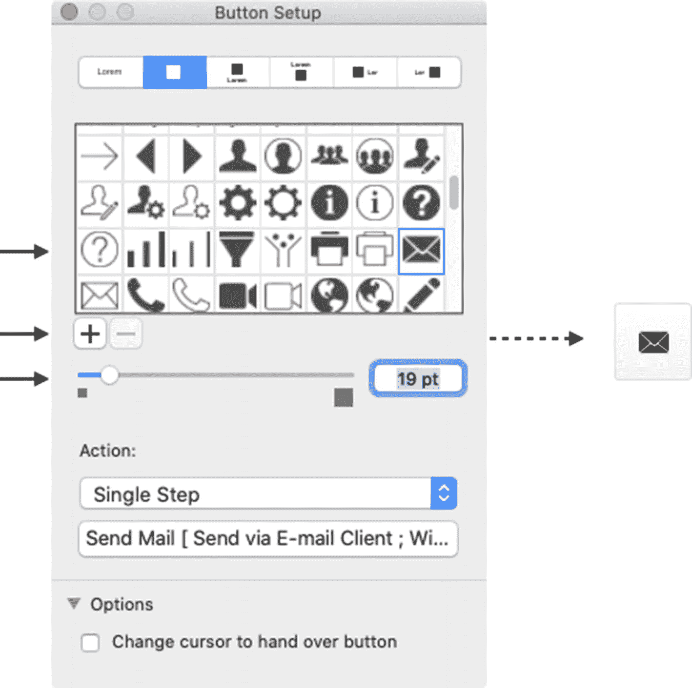

**图 20-29** – 呈现一个图标按钮的按钮配置（对话框）（右）

---

### 配置按钮操作

*按钮设置*对话框的底部区域控制按钮的功能。

#### 执行单一步骤

要将按钮配置为运行脚本步骤命令，请将*操作*弹出菜单更改为*单一步骤*。这将立即打开*按钮操作*对话框，如图 20-30 所示。这是*脚本工作区*对话框（第 24 章）的一个受限版本。双击右侧列表中的一个步骤，将其添加为左侧分配的操作，替换现有选择。然后根据需要进行配置并点击确定。

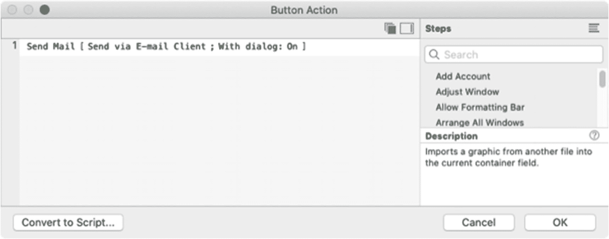

**图 20-30** – 用于为按钮选择和配置脚本步骤的对话框

一旦分配并配置了脚本步骤，设置对话框底部的*操作*区域将显示所选的命令，如图 20-31 所示。要更改分配的命令，请点击它。启用底部的复选框可以使光标在悬停在按钮上时发生变化，从而向用户提供这是一个活动按钮的可视化指示。

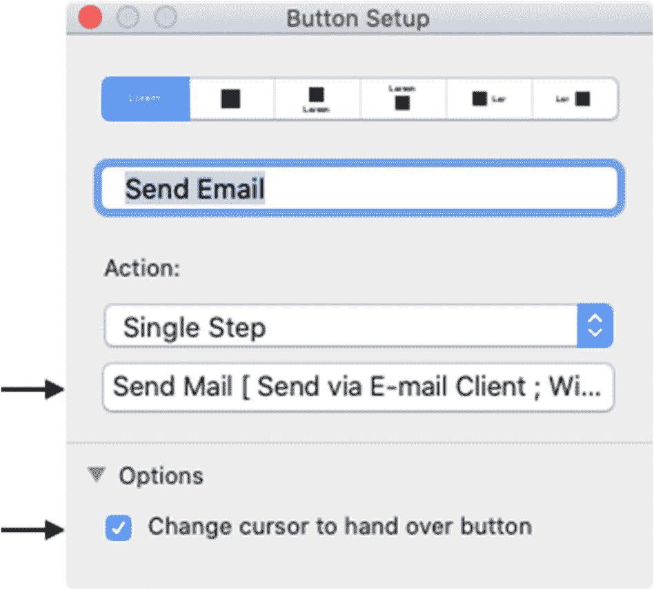

**图 20-31** – 配置为运行单一步骤的对话框

使用*单一步骤*选项时，只能为按钮分配*一个*命令。要为按钮附加更复杂的功能，请选择*执行脚本*而不是*单一步骤*，或者点击*按钮操作*对话框中的*转换为脚本*按钮，以快速创建保留任何现有步骤配置的新脚本。

#### 执行脚本

要将按钮配置为运行脚本，请将按钮的操作更改为*执行脚本*。这将立即打开*指定脚本*对话框（第 24 章，“探索指定脚本对话框”），允许选择脚本并输入可选参数。选择脚本后，*按钮设置*对话框底部的*操作*区域将显示所选脚本、参数和选项，如图 20-32 所示。可以点击分配的脚本以打开并直接编辑脚本步骤。点击相邻的脚本图标可为按钮选择不同的脚本。点击脚本参数按钮可打开*指定计算*对话框，并输入将作为参数发送到脚本的数据公式（第 24 章，“发送参数”）。

*选项*区域包含一个用于更改光标的复选框。此外，还有一个菜单允许选择四个选项之一，用于处理按钮脚本运行后当前暂停的脚本，选项如下：

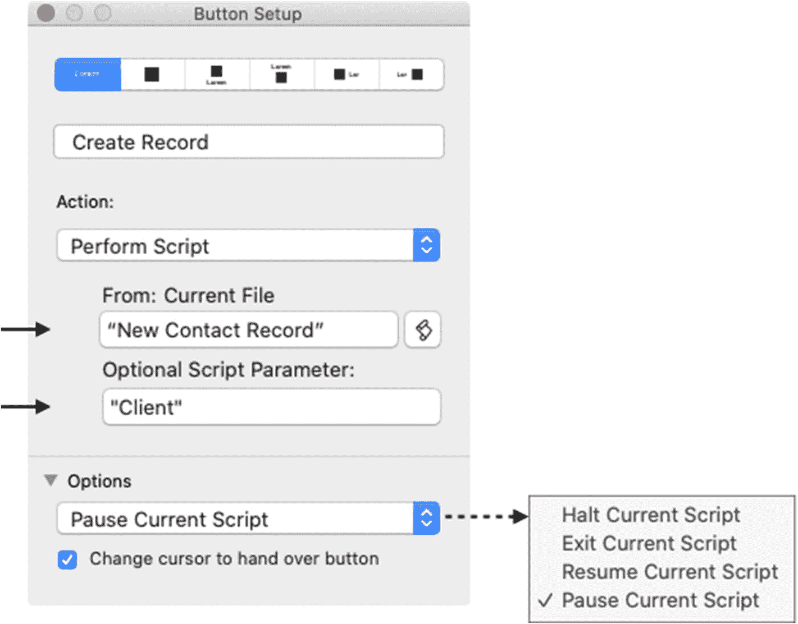

**图 20-32** – 配置为运行脚本的对话框

-   **暂停当前脚本** – 所有正在运行的脚本都将暂停。
-   **退出当前脚本** – 暂停的脚本将停止，控制权将返回到堆栈中任何其他脚本，这些脚本将恢复执行。
-   **继续当前脚本** – 暂停的脚本将恢复运行。
-   **暂停当前脚本** – 脚本将保持暂停状态。

---

### 弹出按钮

*弹出按钮*是一种按钮类型，用户点击它可以打开一个包含其他布局对象的浮动面板。这通过将控件组隐藏在视线之外直到需要它们时再显示，从而减少了视觉杂乱。弹出按钮可用于多种不同目的，例如扩展字段输入、文档提示或操作菜单，如图 20-33 所示的简单示例。


**图 20-33** – 包含一系列操作按钮的弹出按钮

要创建弹出按钮，请选择*插入 ➤ 弹出按钮*菜单，或按住*按钮*工具栏图标，然后从菜单中选择*弹出按钮*，如图 20-34 所示。然后在内容区域中单击并拖动以绘制对象的边界。

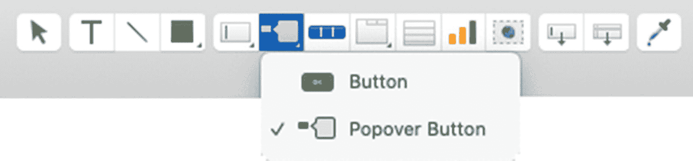

**图 20-34** – 从工具栏选择弹出按钮工具

#### 定义基本弹出按钮界面

创建后，新的弹出按钮会显示为一个带有打开弹出界面的按钮，如图 20-35 所示。

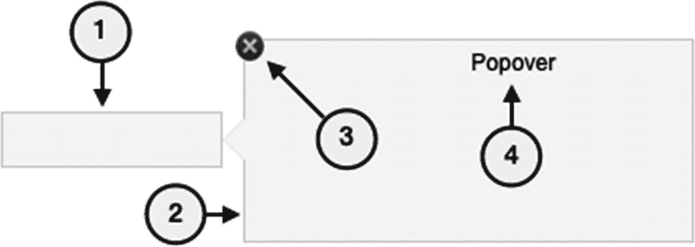

**图 20-35** – 准备好进行编辑的新弹出按钮

弹出按钮界面由以下元素组成：

1.  **按钮** – 当弹出窗口关闭时，按钮保留在布局上。与标准按钮一样，在您指定标签和/或图标之前，此按钮为空。
2.  **界面/设计区域** – 当用户点击按钮时，此区域会弹出。在布局模式下，这是一个可调整大小的设计区域，您可以在其中根据需要添加布局元素。
3.  **关闭按钮** – 此按钮仅在布局模式下编辑弹出按钮时可见，它将关闭弹出界面。
4.  **标题** – 弹出按钮的可选标题。

> **提示：** 点击弹出设计区域可显示渐变控制条和调整大小手柄。


