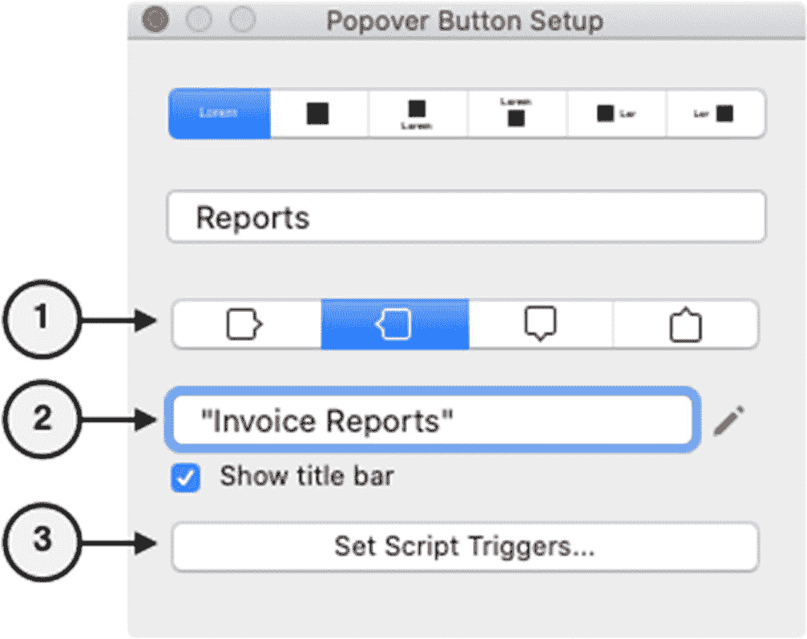
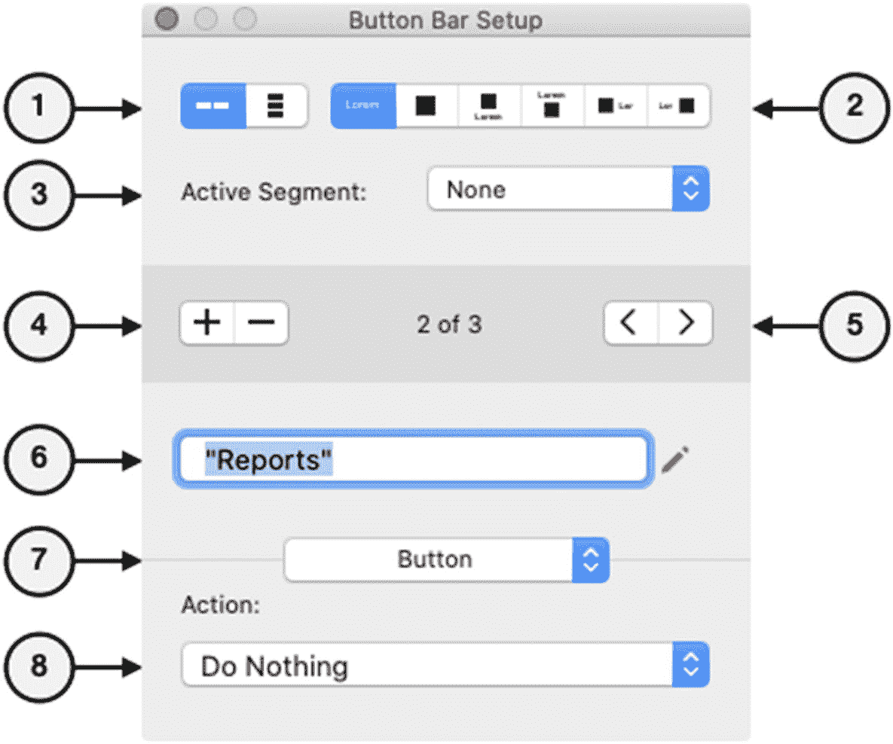
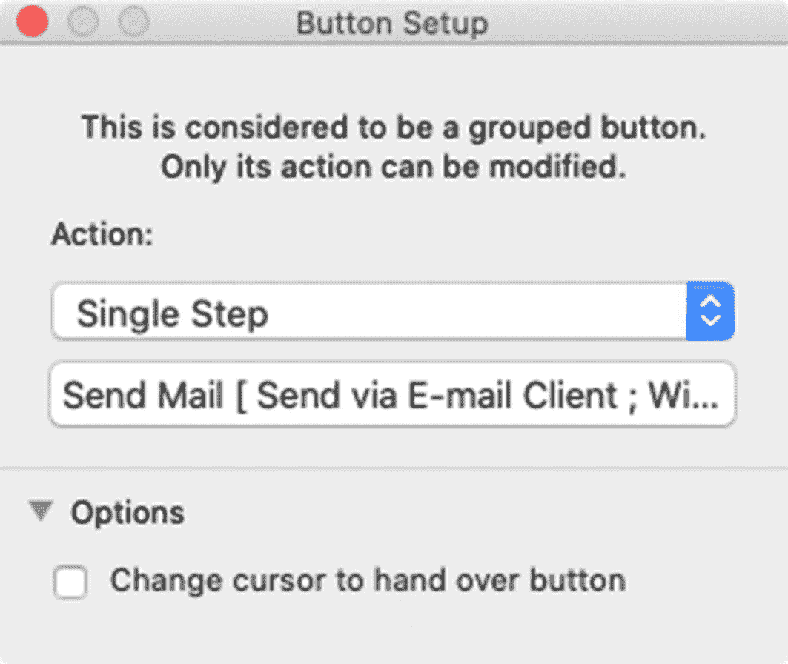
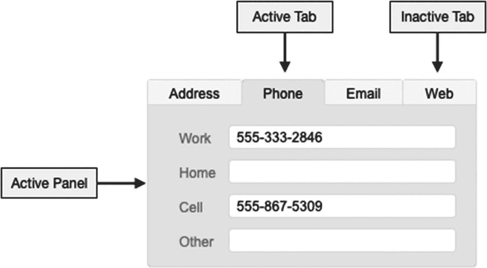
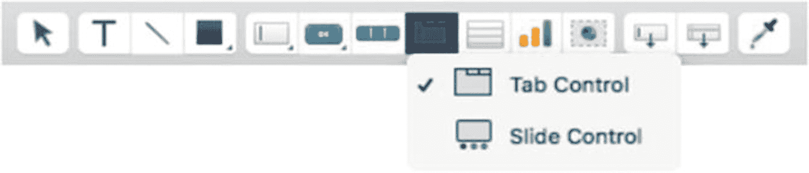

# 探索弹出按钮设置选项

弹出按钮的标签和行为设置通过“`Popover Button Setup`”对话框进行配置，该对话框在创建弹出按钮时会自动打开。此对话框如图 20-36 所示，之后可通过双击按钮或弹出按钮界面设计区域，或者从“`Format`”菜单或按钮的上下文菜单中选择“`Popover Button Setup`”来重新打开。

图 20-36

用于配置弹出按钮标签和行为设置的对话框

此设置对话框的顶部区域与常规的“`Button Setup`”完全相同，允许控制按钮的标签和/或图标。底部区域包含专门用于弹出按钮界面面板的设置：

1.  “`Directional Control`”（方向控制）– 为弹出按钮界面相对于按钮图标选择一个首选打开方向。如果需要，FileMaker 会覆盖此选择，以确保弹出按钮界面永远不会超出屏幕范围。

2.  “`Title`”（标题）– 为弹出按钮输入一个标题，或点击旁边的铅笔图标通过公式生成标题。勾选复选框可在面板打开时向用户显示面板顶部的标题。

3.  “`Script Triggers`”（脚本触发器）– 点击可打开一个对话框，用于配置弹出按钮界面的脚本触发器（第 27 章）。

## 按钮栏

“`按钮栏`”是一种布局对象，它定义了一组相互连接的按钮段，如图 20-37 所示。通过选择“`Insert ➤ Button Bar`”菜单或使用工具栏中的相应工具来创建一个按钮栏。栏中的每个段都可以独立定义为普通按钮或弹出按钮。点击某个段会执行其定义的操作，然后将该段保持为选中状态，直到选择了另一个段，这使得它们成为按钮和模式指示器的奇特组合。这种选择行为可以通过将默认段配置为 0 并在脚本操作执行后刷新窗口来覆盖。

图 20-37

一个包含三个段的按钮栏示例，其中第二个段处于活动状态

### 探索按钮栏设置选项

按钮栏通过“`Button Bar Setup`”对话框进行配置，如图 20-38 所示。此对话框在创建新的按钮栏时会自动打开，之后可通过双击按钮段来重新打开。也可以从“`Format`”菜单或按钮的上下文菜单中选择“`Button Bar Setup`”来打开。此对话框是“`按钮`”和“`弹出按钮`”设置的混合体，并包含一些特定于按钮栏的控件。

图 20-38

用于配置按钮栏的对话框

顶部区域包含用于整个按钮栏的控件，包括：

1.  “`Bar Orientation Control`”（栏方向控制）– 选择段的排列方向：“`水平`”或“`垂直`”。

2.  “`Button Labeling Options`”（按钮标签选项）– 为所有段选择一个标签选项（类似于按钮和弹出按钮）。

3.  “`Active Segment`”（活动段）– 指定默认情况下哪个段是“活动的”。该菜单允许按名称选择段，并包含一个用于通过公式驱动选择的“`Specify`”选项。

4.  “`Segment Control`”（段控制）– 在按钮栏中添加或移除段。

5.  “`Segment Navigation`”（段导航）– 选择一个特定的段，其设置将显示在下方进行配置。

对话框的底部区域应用于当前选定的段：

1.  “`Button Labeling Specification`”（按钮标签规范）– 与按钮相同，根据先前选择的标签选项，为按钮段输入名称和/或选择一个图标作为其标签。

2.  “`Segment Type`”（段类型）– 为当前段选择类型：“`标准按钮`”或“`弹出按钮`”。

3.  “`Action Menu and Specification`”（操作菜单和规范）– 此区域根据先前选择的类型提供操作控件，其选项与标准按钮或弹出按钮相同。

## 将任意对象转换为按钮

除了正式的按钮和按钮栏对象外，任何对象或对象组都可以转换为一个简单的普通按钮。选择该对象，然后点击“`Format ➤ Button Setup`”菜单或同名的上下文菜单选项，即可打开一个简化的“`Button Setup`”对话框，如图 20-39 所示。由于该对象不是原生按钮，唯一的配置选项是选择操作和更改光标的选项。一旦转换为按钮，这些对象将不再接受其原生类型的输入，例如，字段将不再接受数据输入。

图 20-39

用于为对象按钮分配操作的对话框

## 使用面板控件

“`面板控件`”是一种布局对象，它包含多个对象组，这些对象组被组织在独立的面板中，可以在对象区域内交替显示。面板通过允许布局的一部分用于多种目的（用户一次选择使用一个）来节省空间。FileMaker 有两种此类对象类型：“`选项卡控件`”和“`滑动控件`”。

### 选项卡控件

“`选项卡控件`”是一种多面板布局对象，带有类似于文件文件夹的带标签“选项卡”，如图 20-40 所示。当用户点击某个可用选项卡时，相应的面板会变为活动状态，并使其他选项卡处于非活动状态。每个面板都可以设计任意数量和不同类型的布局对象。一个选项卡面板甚至可以包含其他选项卡控件，从而形成层次化的选项卡结构。

图 20-40

一个具有四个选项卡面板的选项卡控件示例

要创建一个新的选项卡控件，请选择“`Insert ➤ Tab Control`”菜单项，或点击工具栏上的图标，然后从菜单中选择“`Tab Control`”，如图 20-41 所示。

图 20-41

从工具栏中选择选项卡控件工具

