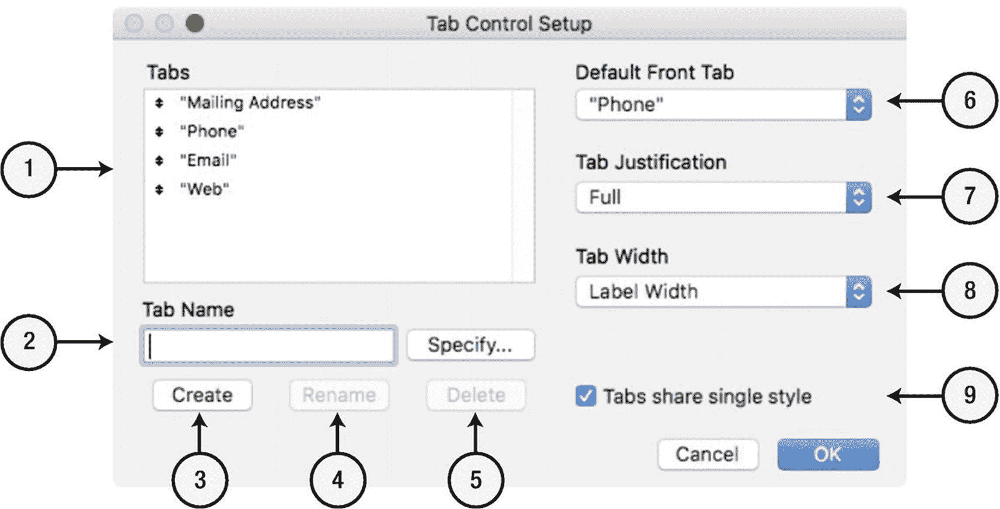
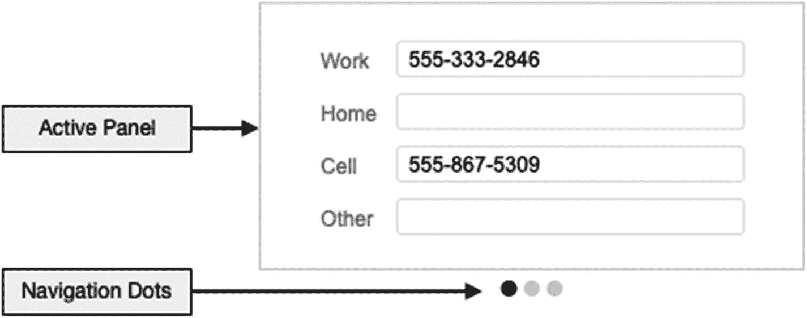
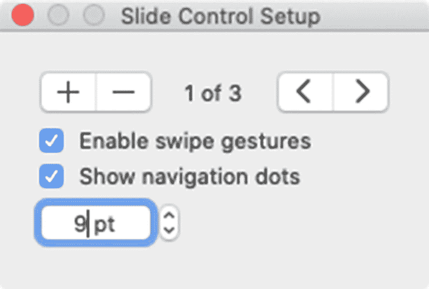
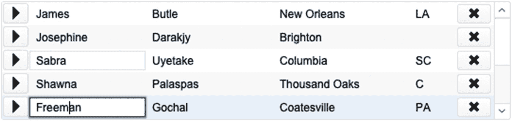
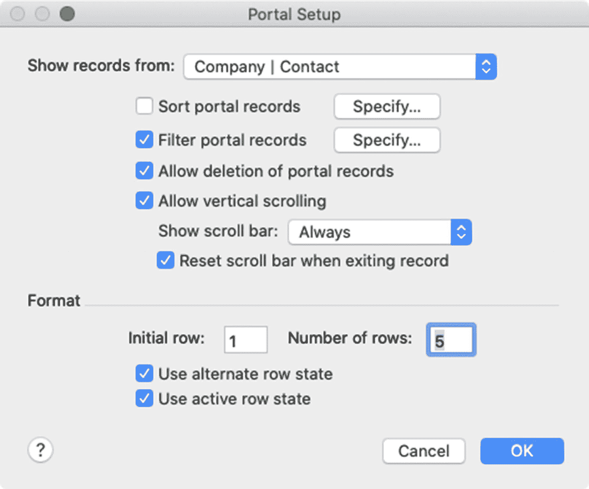
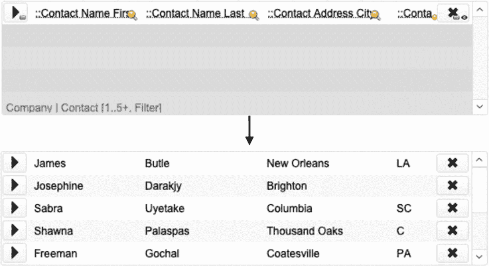
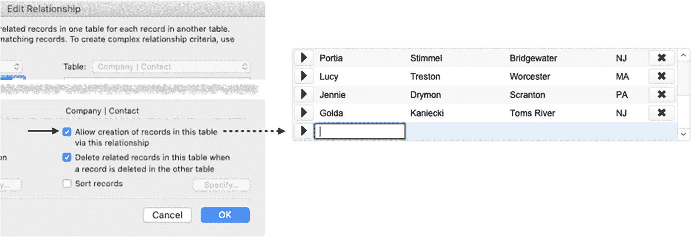
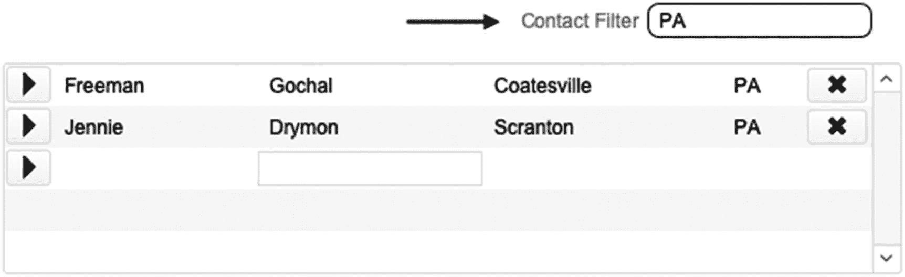

# 探索标签控制设置对话框

标签通过*标签控制设置*对话框进行配置，该对话框在创建新标签控制时自动打开。此对话框如图 20-42 所示，之后可通过双击标签控制面板的任意位置，或从*格式*菜单或标签控制的上下文菜单中选择*标签控制设置*项来打开。

图 20-42

用于定义标签控制的对话框

对话框中可用的控件如下：

1.  *标签* – 列出为对象定义的每个标签。可拖拽以重新排序。
2.  *标签名称* – 创建新面板时输入名称，或编辑所选标签的名称。点击*指定*来定义一个由公式驱动的名称。
3.  *创建* – 点击以基于前述名称创建新标签。
4.  *重命名* – 点击以保存所选标签的修改后名称。
5.  *删除* – 删除选中的标签。
6.  *默认前端标签* – 当窗口刷新时，选择一个默认的标签选项。
7.  *标签对齐方式* – 选择标签标题的对齐方式。
8.  *标签宽度* – 选择标签的宽度：
    - *标签宽度* – 宽度根据每个标签名称变化。
    - *标签宽度 + 边距* – 宽度根据每个标签名称加上指定的像素边距变化。
    - *最宽标签的宽度* – 使用基于最长标签名称的统一宽度。
    - *最小值* – 宽度基于每个标签名称，但以指定最小值为下限。
    - *固定宽度* – 使用基于指定宽度的统一宽度。
9.  *标签共享单一样式* – 通过单一主题样式（第 22 章）保持标签之间的设计统一性。

## 滑动控制

*滑动控制*是一种多面板布局对象，在 iOS 设备上通过向左或向右滑动，或点击导航点来访问面板，如图 20-43 所示。在功能上，它们类似于标签控制，但没有标签标题。通过选择*插入 ➤ 滑动控制*菜单，或点击工具栏图标并选择*滑动控制*来创建新的滑动控制。

图 20-43

一个三面板滑动控制示例

### 探索滑动控制设置对话框

滑动控制通过*滑动控制设置*对话框进行配置，该对话框在创建新控件时自动打开。此对话框如图 20-44 所示，之后可通过双击滑动控制的背景区域，或从*格式*菜单或滑动控制的上下文菜单中选择*滑动控制设置*来打开。

设置对话框的面板控件可通过按钮添加、移除或导航到特定面板。复选框控制 iOS 滑动手势和导航点的可见性，以便在 macOS 或 Windows 电脑上的用户在无法滑动时可以点击切换到其他面板。

> **提示**
> 
> 面板也可以在布局模式下通过拖拽导航点来重新排序。

图 20-44

用于配置滑动控制的对话框

## 使用门户

*门户*是一种布局对象，用于显示来自与当前布局关联的表单项相关的记录列表。门户类似于列表视图，但作为对象嵌入在布局中，用于显示一组记录，并可选择显示滚动条。*门户行*代表一条相关记录，可以包含字段和其他布局对象。图 20-45 展示了*联系人*门户在*公司*布局上的示例。根据门户设置，用户可以添加、删除、编辑、查看记录，或点击按钮导航到特定联系人记录。门户具有许多类似于列表视图的样式选项，允许对*活动行*进行不同样式的设置，并使用交替样式帮助在视觉上区分非活动行。

图 20-45

显示联系人记录的门户示例

### 探索门户设置对话框

要创建新门户，请选择*插入 ➤ 门户*菜单，或在工具栏中选择该工具。门户通过*门户设置*对话框进行配置，该对话框在创建新门户时自动打开。此对话框如图 20-46 所示，之后可通过双击门户背景的任意位置，或从格式菜单或门户的上下文菜单中选择*门户设置*来打开。

图 20-46

用于配置门户的对话框

从*显示记录来自*弹出菜单中选中的表单项充当门户的*数据源*。四个复选框及其相邻控件用于配置门户中可供用户使用的排序、筛选和其他功能。*允许删除门户记录*复选框允许用户使用`Delete`键删除选中的门户行。为提供更直观的体验并避免意外删除，可禁用此功能，并在门户行中创建一个自定义的*删除*按钮。当记录数超过可见行数时，允许滚动，并可选择始终显示滚动条或仅在用户滚动时显示。*退出记录时重置滚动条*选项将在记录提交时自动滚动回第一行，而不是保留用户当前的滚动位置。

底部的*格式*设置允许控制出现在门户中的相关记录以及应用的样式选项。*初始行*接受一个数字，指示应显示的第一行，该行之前的所有相关记录将被隐藏。*行数*指示门户在其最小尺寸下应包含多少条相关记录。在*第一行*之后的相关记录仍会包含在门户中，但只有在启用滚动功能或门户配置为在窗口尺寸变化时扩展大小时，才能通过滚动进行访问。交替行和活动行状态将应用样式设置（第 22 章），以不同格式显示每隔一行和当前选中的行，从而提供视觉清晰度。

### 向门户行中添加对象

在布局模式下，门户的第一行是一个设计区域，可以在此添加字段、按钮和其他对象，以定义每个行在浏览模式下的渲染模板，如图 20-47 所示。

图 20-47

分别显示布局模式（上）和浏览模式（下）中的门户

放置在门户中的对象，其渲染依据当前布局实例的上下文以及与门户数据源实例之间的关联。在选择要放置在门户内的对象以及如何配置它们时，请务必牢记这一点。添加到门户中的任何`字段`，必须来自门户的指定实例，或者来自与该实例通过一条远离布局实例的直线路径相关联的实例。来自门户表之外的其他表的字段，只能通过关系通道从每个门户行的记录上下文中显示第一个匹配记录的值。因此，一个`联系人`门户可以包含一个跨越多个关系链的字段，用于显示与该联系人相关的发票中的某个发票行项目字段，但根据该关系链上的连接，它只会显示该联系人的第一张发票中的第一个行项目的值。门户中的任何`对象`都必须结合门户实例的上下文来思考。在编写隐藏、工具提示、条件格式、脚本参数等公式时，该公式必须限制为仅包含基于门户上下文的字段。

### 直接在门户中创建记录

在浏览模式下，当在相关源表中创建新的匹配记录时，门户会自动更新。如果一位用户正在查看带有一个`联系人`门户的`公司`记录布局，那么任何链接到该公司的新的联系人记录都会出现在所有人查看的门户中。如果查看公司记录的用户想要从`公司`布局中创建一个新的相关联系人记录，他们通常需要切换布局、创建记录、将其链接到公司，然后返回原始布局才能在门户中看到它——或者运行一个按顺序执行这些步骤的脚本。或者，可以将门户配置一个快捷方式，允许用户通过在底部的一个空白门户行中输入内容，直接在门户中创建新记录。此功能在关系层面配置，而非布局对象层面。打开`管理数据库`对话框，并在`编辑关系`对话框（第 9 章）中，于用作门户数据源的那一侧关系（本例中为`公司 | 联系人`）上，启用`允许创建记录`复选框。完成此操作后，任何分配了该实例的门户都会显示一个空白行，如图 20-48 所示。这个空白行`仅存在于界面中`，并且会被`程序化地忽略`，不会影响诸如`计数`、`列表`、`最大值`、`最小值`、`总和`等汇总相关记录的函数。

图 20-48

设置（左）启用了用于创建新记录的空白门户行（右）

当用户在该空白行的任何可编辑字段中输入内容，然后将焦点移动到另一个字段或提交记录时，系统将立即在远程表中创建一个新记录。新记录将自动使用所需的值填充每个匹配字段，以便将其与当前查看的父记录关联起来。尽管新记录保留在门户中，但它可能会根据在关系层面和/或门户设置中定义的任何排序字段的值，排序到一个新的位置。完成后，会出现一个新的空白行，用于创建更多的新记录。

注意

此功能可能会让用户感到困惑，因为空行看起来像是一条没有字段值的实际记录。用户可能会试图删除它。可以隐藏按钮（第 21 章）以使其不那么显眼，但有些开发者会禁用它，并改用自定义脚本来执行创建相关记录所需的操作序列。

### 删除门户行

门户行是来自另一个表的记录的表示，每当相关记录被删除时，它们就会从门户中消失。可以将门户配置为允许用户直接在门户中删除记录。打开`门户设置`对话框，并选择`允许删除门户记录`选项。启用后，用户可以选择一个门户行并按 Delete 键来删除相关记录，并将其从门户显示中移除。FileMaker 会显示一个确认对话框，询问用户是否要继续删除操作。如果他们确认，相关记录将被永久删除。

注意

删除门户行的确认对话框信息模糊，可能会使用户困惑，他们可能意识不到自己选择了哪一行，并意外删除了错误的记录。相反，可以在门户中添加一个按钮来更精确地处理此过程，并可选地运行一个带有信息更丰富的自定义对话框的脚本。

### 过滤门户记录

布局实例与门户实例之间的关系自动提供了一个基线过滤器，用于控制门户中显示的记录。仅包含与当前记录实例存在关系匹配的记录。相比之下，`门户设置`对话框中的`门户过滤`选项允许使用公式进一步控制哪些相关记录会实际显示在门户中。过滤公式会为每个可用的相关记录评估一次，并且仅当结果为 true 时才显示这些记录。

过滤公式的复杂程度可以根据需要确定是否应包含某条记录。它可以包含字段比较，并且可以基于用户在专门用于征求过滤偏好的字段中的输入。例如，靠近门户放置的一个字段可以允许用户输入任何标准，这些标准可用于确定要显示的相关记录的子集。在图 20-49 所示的示例中，一个`公司`布局包含一个显示相关人员的`联系人`门户。该关系将门户列表限制为仅与当前公司相关的人员。可以将过滤字段中的值与相关的`州/省`字段进行比较，以便将相关记录范围缩小到地址与用户输入的值匹配的联系人。

图 20-49

门户过滤字段示例

注意

过滤仅影响相关记录的`显示`，不影响实际的关系。任何通过该关系访问记录的计算将继续看到所有相关记录，即使门户显示的是过滤后的子集！

