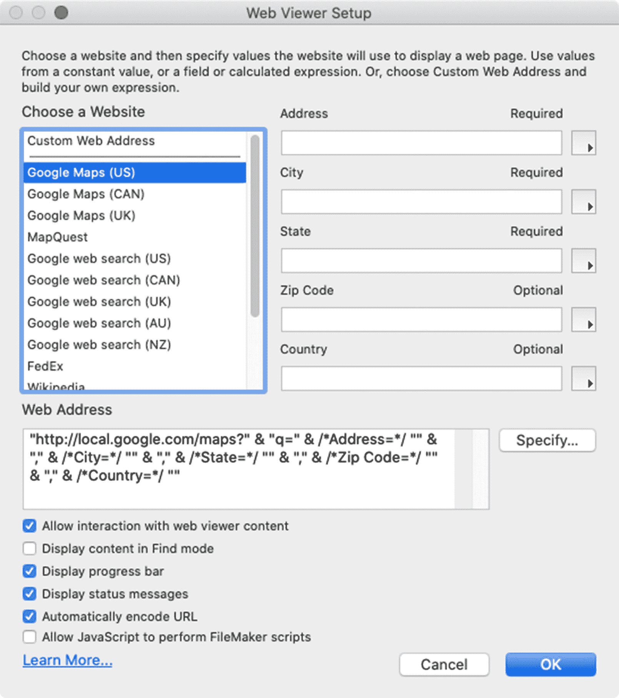
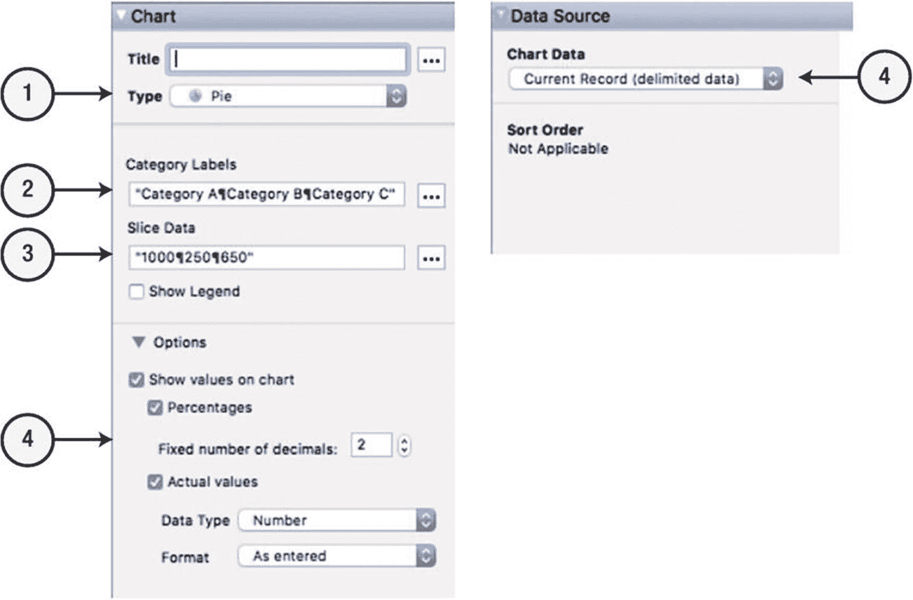
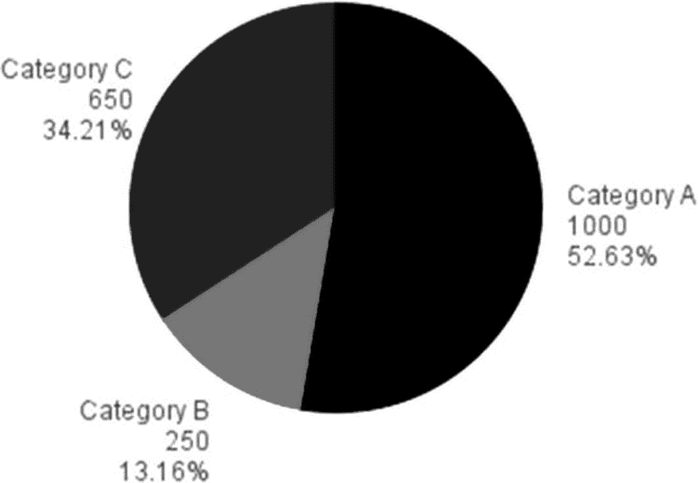
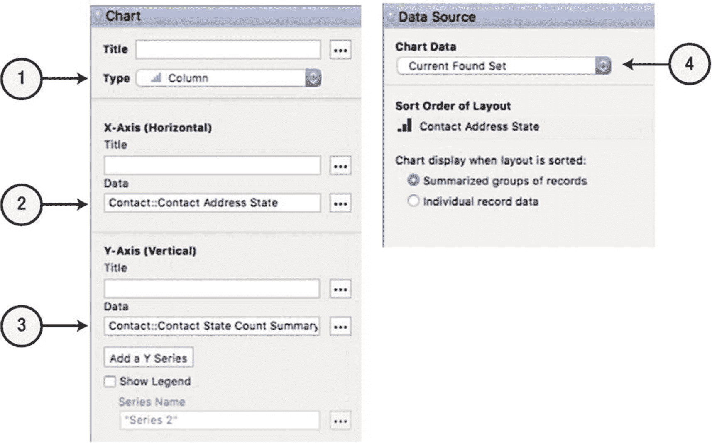
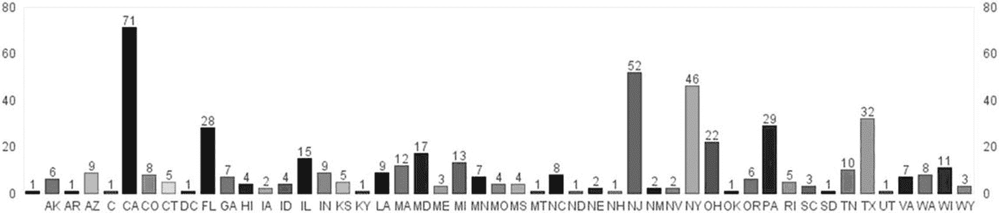

# 使用网页查看器

网页查看器是一种布局对象，可直接在布局上显示网页。可以配置为允许或不允许用户交互，并且内容可以由以下任一方式生成：

-   硬编码指向特定网站的网址
-   从数据库字段提取的网址或由公式动态生成的网址
-   由 Claris 提供的地址公式，例如 Google 网页搜索、Google 地图、FedEx 或 Wikipedia
-   来自字段或公式的自定义 `HTML` 代码，其中可包含硬编码元素、字段数据，甚至字段中的图像
-   由脚本提供的网址或自定义 `HTML` 代码

**注意：** 自定义网址必须以正确的 URL 方案开头，例如 `http://`、`https://`、`ftp://` 或 `file://`。

## 探索网页查看器设置对话框

要将网页添加到布局，请选择 `插入 ➤ 网页查看器` 菜单，或使用工具栏中的工具。将出现“网页查看器设置”对话框，如图 [20-51] 所示。稍后可以通过双击网页查看器，或从 `格式` 菜单或查看器的上下文菜单中选择 `网页查看器设置` 来打开此对话框。

左上角的“选择网站”列表指定源数据。从数据驱动模板列表中选择，或选择“自定义网址”来编写自己的 URL 或 HTML 公式。使用模板时，右侧的组件字段接受将插入 URL 的值。“网址”区域允许输入 URL、HTML 代码或用于生成任一内容的公式。模板将插入一个现成的计算，其中包含指向右上角参数字段的链接。在文本区域输入地址或公式，或单击“指定”按钮以输入公式。

底部的复选框选项控制各种查看器功能。您可以启用与渲染网页的用户交互、控制查找模式下的显示、在加载时包含进度条，以及包含状态消息。“自动编码 URL”选项将对地址中的特殊字符进行百分比编码。例如，如果选中此框，空格将转换为 `%20`。或者，可以在公式中使用 `GetAsURLEncoded` 函数来处理编码。“允许 JavaScript 执行 FileMaker 脚本”选项是在版本 19 中添加的，用于使 HTML 代码能够使用 `FileMaker.PerformScript` JavaScript 函数直接调用本机 FileMaker 脚本（本节稍后描述）。



图 20-51

用于配置网页查看器的对话框

启用“允许与网页查看器内容交互”选项后，用户可以像使用任何标准浏览器一样与网页交互。他们可以单击链接导航到其他页面，并与丰富的媒体内容（如电影）进行交互。尽管功能强大，但查看器并非旨在作为全功能网页浏览器，可能存在一些限制。在浏览模式下，查看器上下文菜单中的“在新窗口中打开链接”功能会将页面重定向到 FileMaker 之外用户的默认浏览器应用程序，从而提供更完整的网页浏览体验。


好的，作为一名高级文档工程师和翻译员，我将严格遵循您提供的注意事项和示例，完成如下翻译。


### 使用字段中的数据构建网页

作为根据网址显示页面的替代方案，查看器可以显示 HTML 代码以生成自定义页面。FileMaker 使用了*数据通用资源标识符*（URI）方案，这是一种标准方法，用于在网页代码中包含数据，而不是访问外部资源。*数据 URI* 使用以下公式表示，方括号表示可选元素：

```
data:[<media type>][;base64],<data>
```

此公式包含以下元素：

- `data` – 此必需前缀表示正在使用的方案，后跟一个冒号。
- `<media type>` – 可选，指示数据中包含的材料类型。网页将使用 `text/html`，而图像将使用 `image/<type>`，例如 `image/png`。如果未指定媒体类型，数据将被假定为 `text/plain`。
- `base64` – 此可选扩展名，与媒体类型之间用分号分隔，用于指示数据内容是二进制数据，该数据使用 `Base64` 二进制到文本编码方案以 `ASCII` 格式编码。
- `<data>` – 此占位符前面带有一个逗号，将被替换为包含所描述内容的字符序列、HTML 代码或 Base64 图像数据。

**注意**：自版本 15 起，数据和媒体类型已变为可选。文本可以以 `<html>` 或 `<!DOCTYPE html>` 开头，并将在网页查看器中按预期渲染。

#### 创建一个 Hello World 网页

此代码为网页查看器定义了一个简单的 *Hello, World* 示例网页公式：

```
"data:text/html,

Hello, World
"
```

添加一个 `<style>` 标签以使用*层叠样式表*（CSS）控制文本格式。此示例修改了 `h1` 样式的颜色，以绿色显示文本：

```
"data:text/html,

<style>
h1 {
color: green;
}
</style>

<h1>Hello, World</h1>
"
```

添加一个 `<script>` 标签以包含 JavaScript 函数，如下例所示，该示例在页面加载时打开一个警报对话框：

```
"data:text/html,

<script>
alert('Hello, World!')
</script>

<h1>Hello, World</h1>
"
```

**警告**：在公式中计算网页查看器的内容时，所有文本都必须用引号括起来。该文本中的任何引号都必须使用前置的反斜杠进行转义。

#### 在网页中包含文本字段

使用公式驱动的网页，插入字段的方式与在任何公式中插入字段的方式相同（第 12 章）。只需在引用的文本之外将字段引用插入到公式中。

```
"data:text/html,

<h1>" & Company::Company Name & "</h1>
"
```

#### 在网页中包含容器字段图像

可以通过在 `<image>` 标签中插入 URL 来包含来自 Web 的图像。但是，要包含存储在字段中的图像，请使用 `Base64Decode` 函数将图像转换为文本。

```
"data:text/html,

<h1>" & Company::Company Name & "</h1>

"
```

### 使用 JavaScript 调用 FileMaker 脚本

在版本 19 中，FileMaker 增加了网页查看器中的 JavaScript 调用原生 FileMaker 脚本的功能。只要在*网页查看器设置*对话框中启用了该选项，HTML 代码中的按钮和 URL 就可以调用带有两个参数的 `FileMaker.PerformScript` 函数：*脚本名称*和*参数*。以下简单示例假设存在一个名为“Test Script”的脚本，该脚本将使用 `Show Custom Dialog` 脚本步骤生成一个显示脚本参数的对话框（第 24 和 25 章）。该代码渲染一个按钮，该按钮调用名为 `runScript()` 的 JavaScript 函数，该函数运行 FileMaker 脚本。如果配置正确，单击该按钮将导致 FileMaker 打开一个包含消息“Hello, World!”的对话框。

```
"data:text/html,

<button onclick='runScript()'>Test FMP Script</button>
<script>
function runScript() {
FileMaker.PerformScript ( \"Test Script\", \"Hello, World!\" );
}
</script>
"
```

**警告**：此 JavaScript 函数仅适用于在 FileMaker 网页查看器中渲染的网页。要从数据库外部启用 HTML 点击访问，请使用 FileMaker URL（第 29 章）。

## 使用图表

*图表*是一种布局对象，它以几种流行的图表格式之一绘制数据的图形表示：*柱形图*、*堆积柱形图*、*正负柱形图*、*条形图*、*堆积条形图*、*饼图*、*折线图*、*面积图*、*散点图*或*气泡图*。这些图表可以使用当前查找集中的数据、一组相关记录的数据或计算出的数据来创建。图表在*图表设置*对话框中进行配置，每当在布局上插入新的图表对象时，该对话框就会打开。对于现有的图表对象，可以通过双击它或从*格式*菜单或其上下文菜单中选择*图表设置*来重新打开此对话框。该对话框分为两个主要部分：一个*图表预览*区域，在配置图表时持续更新图表的绘图；以及一个设置侧边栏，其中包含用于各种设置的可切换部分 – *图表*、*样式*和*数据源*。

### 使用计算数据创建图表

使用计算数据生成图表将从硬编码的计算值或当前记录中的字段中提取信息。要使用硬编码值创建一个饼图，请将一个图表对象插入到布局中，然后按照图 20-52 所示配置设置。



**图 20-52** – 基于计算数据的简单饼图的设置

需要以下设置才能生成一个包含三个扇区的饼图，如图 20-53 所示：



**图 20-53** – 由示例数据生成的图表

1. **类型** – 选择*饼图*作为类型，并可选择输入标题。
2. **类别标签** – 输入以回车符分隔的图表类别列表，例如 `Category A¶Category B¶Category C`。
3. **扇区数据** – 为饼图的每个类别扇区输入以回车符分隔的数字列表，例如 `1000¶250¶650`。
4. **选项** – 为标签格式选择各种可选设置。
5. **图表数据** – 从*数据源*设置组中，选择*当前记录（已分隔数据）*以指示图表引擎仅使用来自当前记录上下文中的数据。

**注意**：或者，可以通过单击带有三个点的图标打开*指定公式*对话框，使用字段值生成上述图表的标签和数据。


### 使用找到的记录集创建图表

以找到的记录集中的记录作为数据源，创建条形图来显示按州划分的 `Contact` 记录数量。首先，在布局上插入一个图表，然后按照图 20-54 所示配置设置。



**图 20-54** 使用找到的记录集中的数据配置条形图

**注意**

从找到的记录集创建图表可能会有点令人困惑。这就像创建带有子汇总部分的报表，因为只有找到的记录集中的记录会被包含在内，并且当前的排序顺序决定了汇总字段如何将记录计数到子组中。

以下设置将创建如图 20-55 所示的图表：



**图 20-55** 每个州的联系记录数量柱状图

1. **类型** – 选择 `Column` 作为类型。

2. **X 轴数据** – 选择一个包含文本的字段，该文本将作为条形的标签。为避免重复值，如果*找到的记录集已按指定字段排序*，FileMaker 将自动汇总这些值。在我们的示例中，我们按 `Contact Address State` 字段排序并将其指定。

3. **Y 轴数据** – 选择一个包含条形高度数值的汇总字段。在我们的示例中，使用了一个新的 `Contact State Count Summary` 字段，该字段对 `Record ID` 字段执行 `Count` 操作。

4. **图表数据** – 在控件的 `Data Source` 部分，选择 `Current Found Set`，以指示图表引擎汇总所有记录中的数据。

**请记住**，要使此图表正确汇总，记录*必须*按 x 轴排序，并且 y 轴*必须*是一个汇总字段。

## 总结

本章探讨了设计布局时使用的各种对象。在下一章中，我们将学习如何操作、排列和配置对象。

