# 21. 操作对象

将对象添加到布局后，可以通过多种方式对其进行操作和配置。本章介绍许多基本方法，涵盖以下主题：

- 选择对象
- 调整对象大小
- 移动对象
- 排列和对齐对象
- 隐藏对象
- 条件格式
- 了解 Tab 键顺序
- 命名对象

## 选择对象

要*选择*一个对象，请用光标单击它，或者在布局上靠近对象的位置单击，然后将光标拖过或拖绕它。对象将高亮显示，并包含一个带有八个*大小调整手柄*的轮廓，如图 21-1 所示。

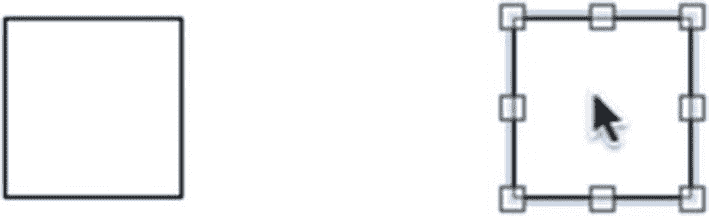

**图 21-1** 静止状态的对象（左）与选中的对象（右）

要一次选择多个对象，可以在按住 `Shift` 键的同时逐个单击它们，或者单击背景并拖动光标，使焦点矩形接触到所有所需对象。在拖动时按住 `Command` (macOS) 或 `Windows` (Windows) 键，要求项目*完全*位于焦点矩形边界内才会被选中。当选择多个对象时，它们共享一组大小调整手柄，勾勒出组的整体空间，如图 21-2 所示。单击布局背景或选择其他对象可以取消选择对象。要取消选择一组已选中对象中的某一个，可以在按住 `Shift` 键的同时单击该对象。

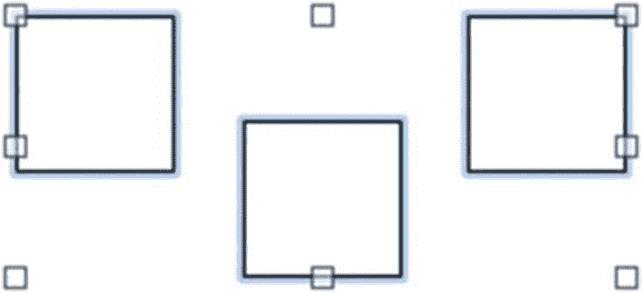

**图 21-2** 一起选中的对象将共享大小调整手柄

**注意**

无填充的形状对象只能通过单击边框来选择。单击对象的中心将穿透该对象，选中其后面的对象或布局背景。

## 调整对象大小

可以通过向内或向外拖动八个大小调整手柄之一（相对于对象中心）来调整对象大小。使用 `检查器` 面板控件的 `位置` 选项卡上的设置可以精确调整对象大小，输入新的 `宽度` 或 `高度`，然后按 `Tab` 或 `Enter` 键以注册更改。要统一调整对象组的大小，请使用 `调整为` 功能，本章后面会介绍。

## 移动对象

选中一个或多个对象后，可以通过单击并拖动它们在布局上移动，或使用其他三种方法之一。箭头键会一次性将选定对象在单个方向上微移一个像素。`检查器` 面板的 `位置` 选项卡设置允许通过为 `左`、`右`、`顶` 或 `底` 输入新的测量值来精确定位对象。要使对象组相对于彼此移动，请使用 `排列` 和 `对齐` 功能，本章后面会介绍。

### 布局定位辅助工具

有四个功能对手动定位对象很有帮助：`标尺`、`网格`、`参考线` 和 `动态参考线`。这些功能可以单独使用，也可以组合使用，以引导对象移动到新位置。

#### 标尺

`标尺` 是沿着窗口内容区域整个左侧和顶部延伸的水平与垂直条，显示基于所选测量单位（`英寸`、`厘米` 或 `点`）的增量刻度。完整标尺（如图 21-3 所示）仅在布局模式下且 `视图 ➤ 标尺` 菜单项处于激活状态时才可见。

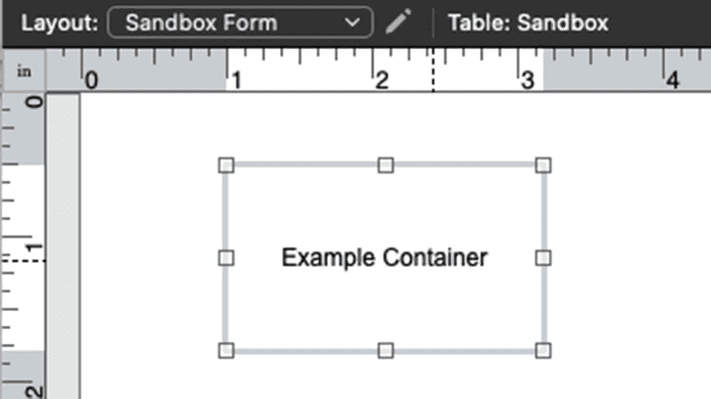

**图 21-3** 布局模式标尺有助于精确定位

标尺有几个不太明显的特性。在水平标尺和垂直标尺相交的角落处，有一个按钮显示当前测量单位。单击此按钮可循环切换标尺的可用单位。也可以从标尺的上下文菜单更改所选单位。光标的当前位置在每个标尺中用虚线标记，并且在拖动对象时，标尺会以白色高亮显示对象的边界。

编辑文本对象内容时，顶部标尺会变为一个灰色条，上面覆盖一个仅跨越文本对象宽度的文本标尺覆盖层，如图 21-4 所示。此标尺控制文本对象中的缩进、边距和制表符，其方式类似于在浏览模式下编辑字段时可访问的文本标尺。

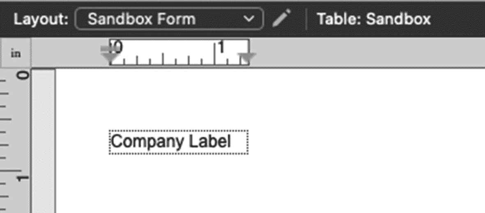

**图 21-4** 编辑布局文本时顶部标尺会变换

#### 网格

布局 `网格` 是叠放在布局背景上的一系列均匀间隔的水平线和垂直线，用于标示次要区域和主要区域。这些线条类似于方格纸，仅在布局模式下且 `视图 ➤ 网格 ➤ 显示网格` 菜单项处于激活状态或 `检查器` 面板中相应的复选框被启用时才可见。当可见时，线条可以在视觉上协助对象均匀对齐。在 `检查器` 中激活 `视图 ➤ 网格 ➤ 对齐网格` 菜单设置，会导致正在拖动的对象被自动吸附到移动方向上的下一条网格线（详见第 19 章“网格”）。

## 指南

## 指南

布局*参考线*是一种可移动的蓝色线条，用于对齐对象和定义布局区域。可以在布局上水平或垂直放置多条参考线，如图 21-5 所示。参考线不会被打印，并且仅在*查看 ➤ 参考线 ➤ 显示参考线*菜单处于激活状态时，在布局模式下可见。点击左侧或顶部标尺上的任意位置，然后分别向右或向下拖动，并在内容区域的目标位置释放以创建新参考线。可以通过将参考线拖动到新位置来重新定位，或将其拖回标尺来彻底移除。可见时，参考线有助于视觉上统一对齐对象。激活*查看 ➤ 参考线 ➤ 对齐参考线*菜单，将导致正在拖动的对象被吸附到移动方向上最近的可参考线。

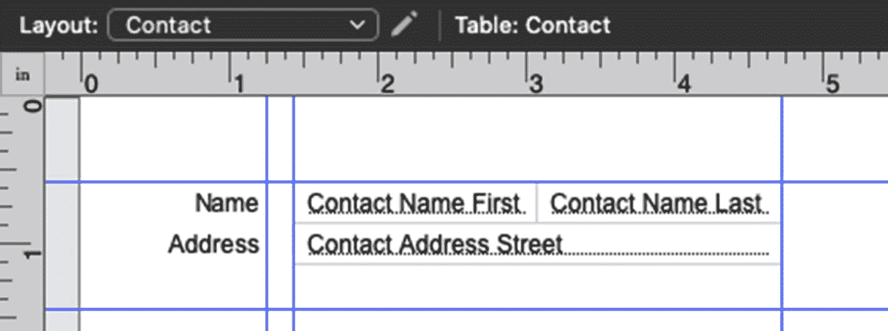

图 21-5：包含多条定义区域参考线的布局

## 动态参考线

当对象在布局上移动时，称为*动态参考线*的蓝色线条会在附近对象上或其周围自动出现和消失，显示如果将对象放置在其当前位置将会产生的对齐和间距模式。通过显示固定对象与移动对象位置相关的空间关系，动态参考线有助于在重新定位对象时实现整洁的设计。与网格和参考线一样，对象会被磁力吸附到动态参考线上。动态参考线可以通过*查看 ➤ 动态参考线*菜单激活或停用。

初次移动对象时，如果当前位置与布局上的任何其他对象不对齐，则不会显示参考线，如图 21-6 所示。

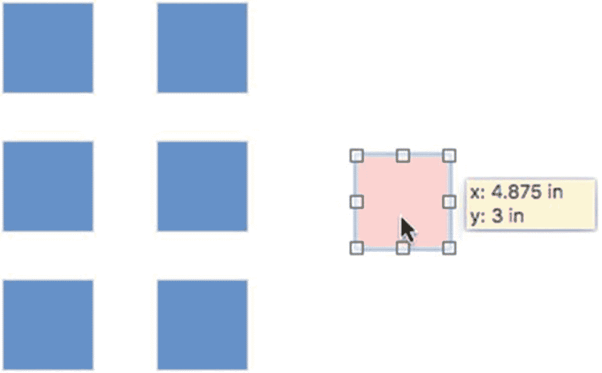

图 21-6：当对象与其他对象不对齐时，不显示动态参考线

当对象被拖动或用箭头键微移并开始与其他对象对齐时，将出现一条或多条动态参考线，如图 21-7 所示。会显示*左侧*、*右侧*、*水平居中*、*顶部*、*底部*和*垂直居中*的对齐，并连接到一个或多个其他对象。

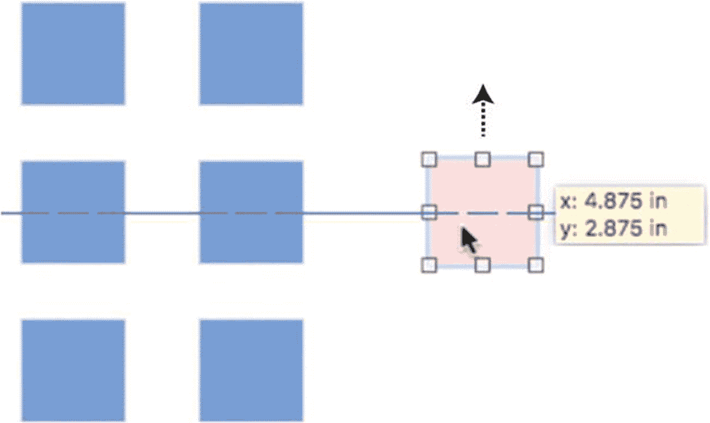

图 21-7：当对象与一个或多个对象对齐时，将出现参考线

当对象被拖动到创建一致间距模式的位置时，这些模式也会被突出显示，如图 21-8 所示。这些模式在*水平*和*垂直*分布时出现，并与对齐参考线同时显示。

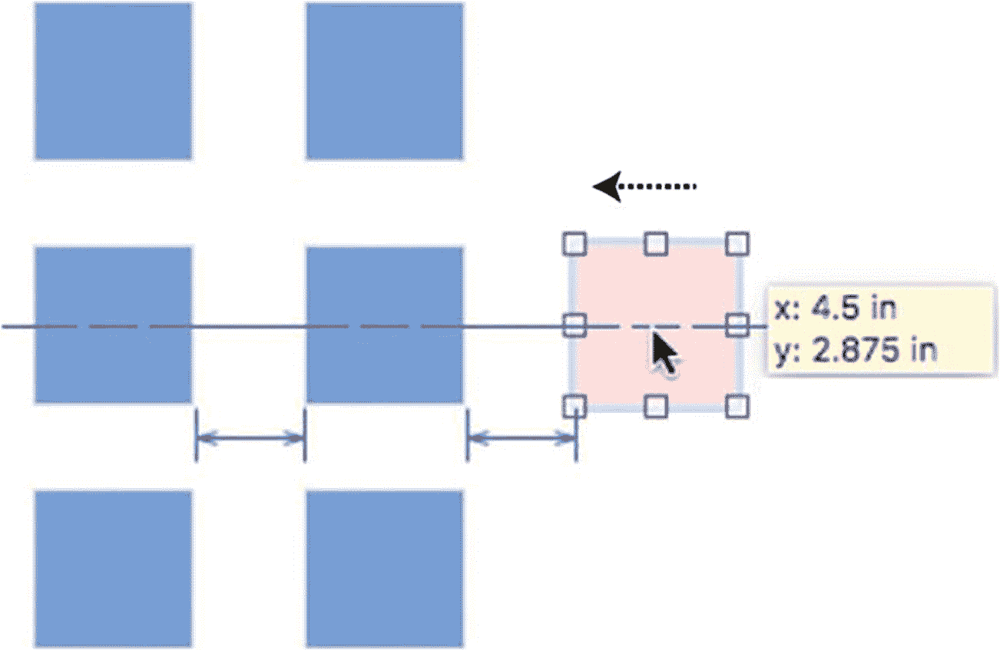

图 21-8：多条参考线可显示对齐和分布间距

> **注意：** 本章示例中仅使用统一正方形形状进行说明。动态参考线和所有其他功能同样适用于*任何*不同对象类型、非均匀排列以及不同大小的组合。

## 排列和对齐对象

在处理包含数十或数百个项目的复杂布局时，移动、调整大小和排列对象组可能是一项繁琐重复的手动工作。FileMaker 提供了有助于*对齐*、*分布*、*调整大小*、*旋转*、*分组*和*锁定*对象的功能。这些功能均可从布局模式下的菜单栏*排列*菜单、对象上下文菜单的子菜单以及检查器面板*位置*选项卡上的*排列和对齐*工具组中访问。除了*旋转*之外，这些功能均适用于任何对象类型的组合。

### 对齐

*对齐*功能可自动水平或垂直对齐选定的对象组。例如，选中几个未对齐的对象后，选择*排列 ➤ 对齐 ➤ 左对齐*菜单项可立即将它们沿左侧边框对齐，如图 21-9 所示。

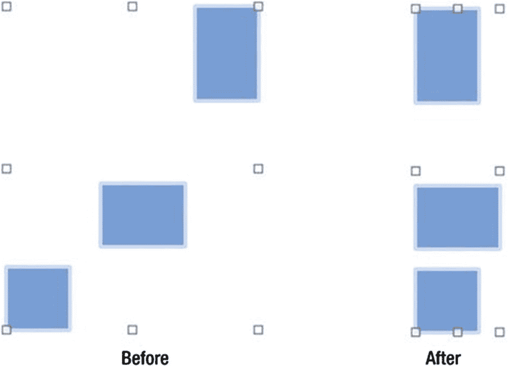

图 21-9：将未对齐对象（前）转换为对齐状态（后）

### 调整为

*调整为*功能可自动将选定的对象组调整为*最小宽度*、*最小高度*、*最小宽度和高度*、*最大宽度*、*最大高度*或*最大宽度和高度*。例如，选中几个大小不一的对象后，选择*排列 ➤ 调整为 ➤ 最小宽度和高度*菜单项可立即将所有对象调整为基于其中最小对象的统一宽度和大小，如图 21-10 所示。

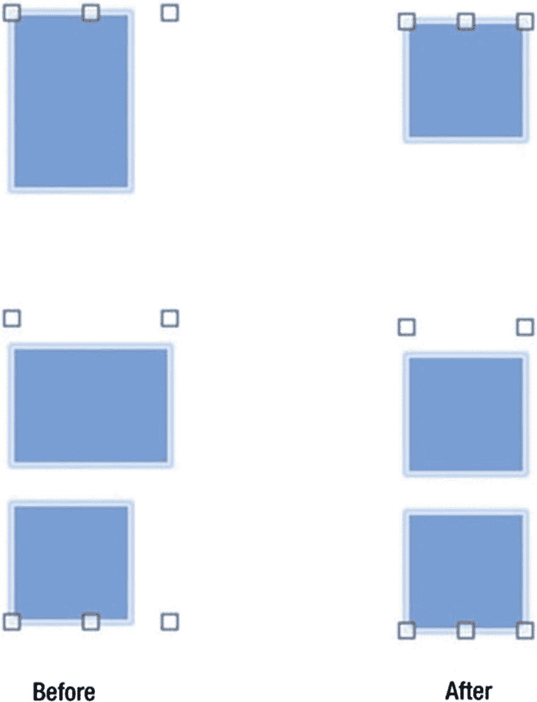

图 21-10：将大小不一的非均匀对象（前）转换为统一大小（后）

### 分布

*分布*命令将重新定位一组对象，使其使用组沿相应轴的外部测量值在水平或垂直方向上均匀分布。例如，选中几个间距不一的非均匀对象后，选择*排列 ➤ 分布 ➤ 垂直*菜单可立即将每个对象重新定位为均匀间距，如图 21-11 所示。

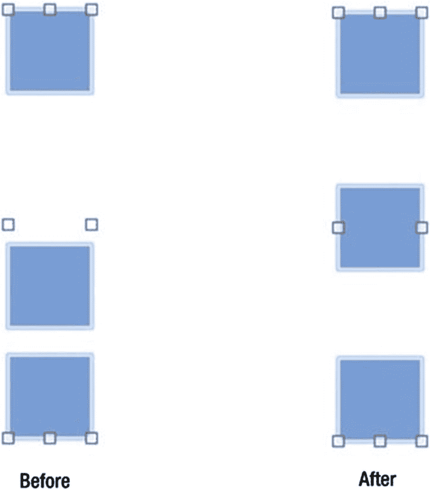

图 21-11：将非均匀间距（前）转换为均匀垂直分布（后）

### 旋转

选择*排列 ➤ 旋转*菜单项可将许多对象按顺时针方向旋转 90 度递增，如图 21-12 所示。例外情况包括按钮栏、图表、弹出框、门户、滑块控件、选项卡控件和 Web 查看器。

图 21-12：一个文本对象（左侧）经过两次 90 度旋转后（右侧）

### 分组

通过选择*排列 ➤ 分组*菜单，可以将一组选定对象转换为一个单一的*组对象*。组合后，分组对象可以作为单个单元移动或调整大小，但仍可通过单击组一次，再单击其中的项目来单独操作。按钮、按钮栏、图表、字段、Web 查看器等对象在分组状态下，可以通过直接双击它们来进行功能编辑。要取消对先前分组对象的组合，请选择*排列 ➤ 取消分组*菜单。

### 锁定

锁定对象后，在布局模式下该对象将变为不可编辑。这有助于避免在复杂布局中意外删除或移动对象。锁定的对象在解锁前无法移动、调整大小、重新分配、重新配置或以任何方式更改。通过选择`Arrange ➤ Lock`菜单可锁定所选对象或对象组。锁定后，该对象将不再响应任何编辑操作。尝试通过`Inspector`更改某些设置时，会弹出一个对话框，说明由于对象的锁定状态而无法进行更改。但在许多情况下，命令会被静默忽略。可以通过`Arrange ➤ Unlock`菜单解锁对象。选中时，锁定对象的每个调整手柄位置会显示一个“x”图标，如图 21-13 所示。

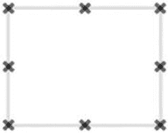

**图 21-13**  
通过调整手柄指示的锁定对象

### 对象堆叠

对象存在于从前到后的*堆叠顺序*中。当两个对象移动到一起时，较晚创建的对象会出现在较早创建的对象之上，从而遮挡后者。有四个命令可以改变对象在堆叠中的位置，如图 21-14 所示：`Bring to Front`（移至顶层）、`Bring Forward`（上移一层）、`Send Backward`（下移一层）和`Send to Back`（移至底层）。

**注意**  
对象堆叠顺序会反映在`Objects`窗格的`Objects`标签页中，列表顶部的对象位于列表下方对象的前面。

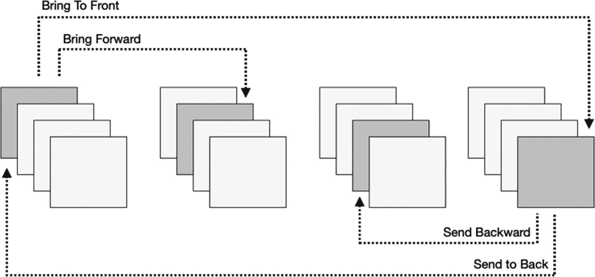

**图 21-14**  
影响对象堆叠位置的命令示意图

## 隐藏对象

可以为对象分配一个公式，用于确定何时应渲染它以及何时应隐藏它。选择对象，在`Inspector`窗格的`Data`标签页的`Behavior`部分输入`Hide objects when`公式。当该公式返回`true`时，对象将在非布局模式下隐藏。输入的公式可以基于多种条件：字段中的值、窗口状态或用户环境的详细信息。例如，在特定字段中输入数据之前可以隐藏一个按钮，例如隐藏`Print`按钮直到报表所需的字段有值，或者隐藏`Approve`按钮直到关键状态字段有值。如果值列表当前为空，则隐藏配置为弹出菜单的`field`。当窗口处于查找模式时，隐藏数据输入专用的按钮和对象。在字段中输入足够信息以实际绘制有用内容之前，可以隐藏`chart`。可以根据记录类型切换一组`portal`的显示，为供应商联系人显示采购订单门户，为客户联系人切换到项目门户。还可以利用此功能根据用户的访问权限（第 30 章）来隐藏信息，使用户看不到显示“无权限”的屏蔽字段，也无法点击会产生访问拒绝错误的按钮。多段`button bar`可以切换，使得一次只显示一个分段，以此作为切换按钮图标和功能的技术。

### 使用隐藏功能切换按钮栏

一个两段按钮栏，如果每个分段具有不同的`Hide`公式，则可以创建*活动标签*，即根据对应字段的值更改图标和功能的按钮。例如，考虑一个`Contact Company ID`字段的标签，该字段配置为用于为公司分配联系人的弹出菜单。如果所需的公司记录已存在，用户只需在字段中选择它即可。但是，如果公司尚不存在，则可以创建一个按钮来创建新记录并将其链接到联系人。类似地，一旦分配了公司，通常需要一个按钮允许用户导航到分配给联系人的相关公司记录。隐藏函数可以在给定时间切换哪些按钮可见，但您仍然需要处理三个对象：字段标签、导航按钮和新建按钮。或者，所有这些都可以替换为一个对象：一个用作活动标签的两段按钮栏，该按钮栏在一个分段与另一个分段之间切换，以允许创建新公司（如果尚未选择公司）或导航到相关记录（如果已选择公司）。

图 21-15 所示的示例展示了一个无边框的两段按钮栏，用作`Contact Company ID`字段的字段标签。第一个按钮分段分配了一个加号图标，并配置为在`id`字段不为空时隐藏。这将运行一个脚本，该脚本创建一个新的相关公司记录并将其`id`分配给当前联系人记录。第二个分段分配了一个导航图标，并配置为在`id`字段为空时隐藏。这将运行一个脚本，用于导航到选定的`Company`记录。由于这两个隐藏公式是二元对立关系，因此在浏览模式下，任何时候只有一个标签可见。

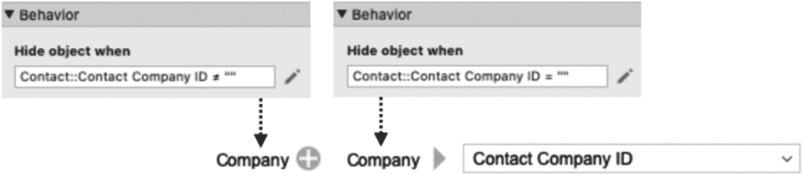

**图 21-15**  
作为字段标签、始终隐藏一个分段的二段栏

**警告**  
可以添加第三个分段，不带图标和脚本，作为查找模式下的非活动标签。隐藏公式将检查窗口模式并相应调整隐藏动作。

根据上述配置，带有加号图标的标签仅在未选择公司时出现，而带有导航图标的标签仅在选择了公司时出现，两者均如图 21-16 所示。

**图 21-16**  
公司为空（上方）或已选择（下方）时的标签按钮

**提示**  
使用隐藏功能，通过一个始终返回`true`（`1`）的公式嵌入包含开发者注释的文本对象，使其只在布局模式下可见。

### 条件格式

任何布局对象都可以使用`Inspector`窗格中的工具进行格式化。字段可以作为对象进行格式化，并且其包含的内容可以设置样式。*条件格式*是一项功能，它使用自定义公式或从二十个预定义内容值中选择的条件，覆盖应用于对象或内容的静态格式。自定义规则在`Conditional Formatting`对话框中定义，如图 21-17 所示。要打开此对话框，请选择目标对象，然后选择`Format ➤ Conditional`菜单，或从对象的上下文菜单中选择`Conditional Formatting`选项。该对话框包含以下控件：

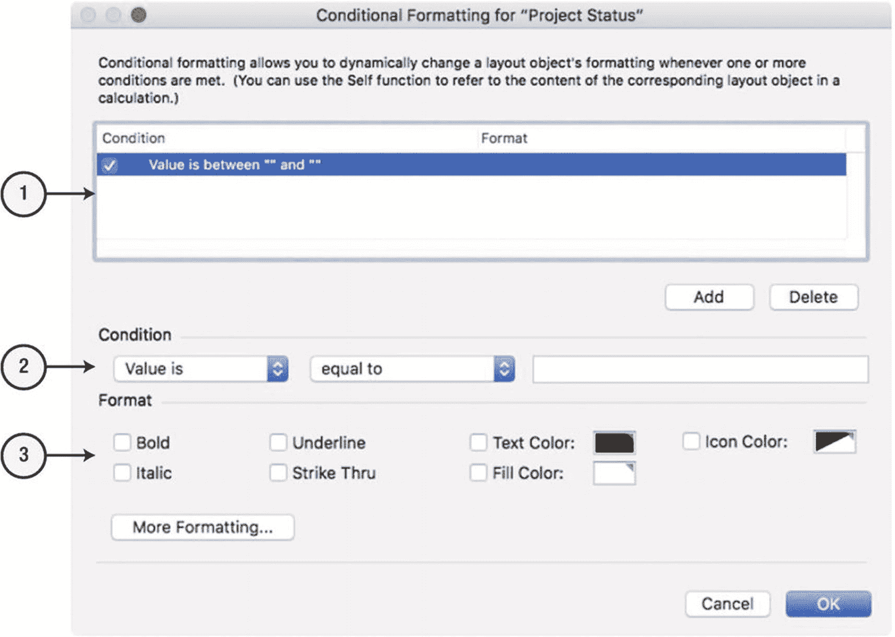

**图 21-17**  
用于根据条件定义格式覆盖的对话框

1.  `Condition List` – 触发格式化的已定义条件列表。这些条件将按从上到下的顺序求值。复选框指示条件是否处于激活状态。
2.  `Condition` – 定义所选条件何时应用格式化的标准。
3.  `Format` – 选择当所选条件求值为`true`时要应用的格式设置。

### 条件公式选项

*上下文格式化条件*定义了在何种情况下会将一组格式设置应用于对象。该条件可以是预定义的*基于值的条件*，也可以是自定义的*基于公式的条件*。

### 使用基于值的条件

*基于值的条件*通过选定的运算符将对象的值与静态条件进行比较，从而确定何时应用格式，如图 21-18 所示。在“条件格式”对话框的“*条件*”部分，从第一个菜单中选择“*值为*”，然后从第二个菜单中选择一个运算符。根据您的选择，右侧将出现一个或多个文本框，可在其中插入静态值以构成条件标准。例如，如果“*状态*”字段的值*等于*“紧急”，或者“*总价*”字段的值*小于*零，则字段文本可以变为红色并加粗。

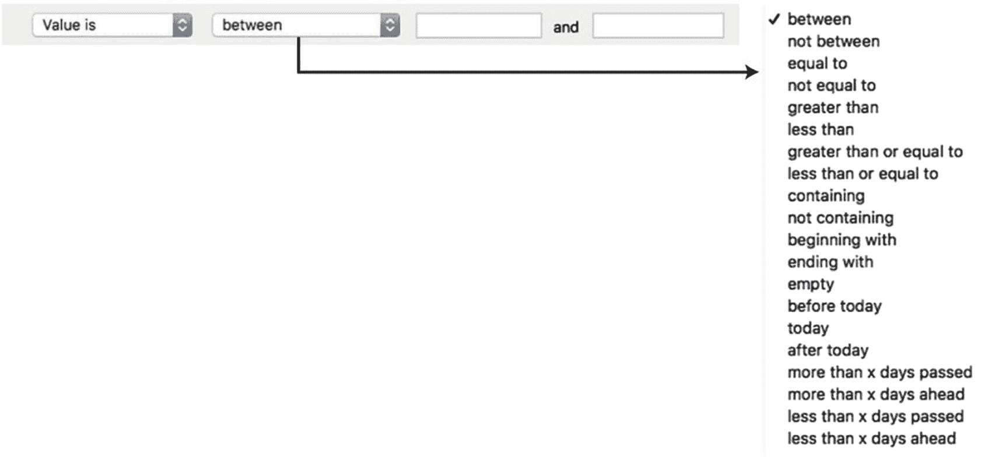

图 21-18 — 基于值的条件的选项

### 使用基于公式的条件

*基于公式的条件*通过计算自定义公式并在结果为真时应用样式，来确定何时应用格式。在“条件格式”对话框的“*条件*”部分，从第一个菜单中选择“*公式为*”，如图 21-19 所示。然后，直接在字段中输入公式，或单击“*指定*”按钮打开“*指定计算*”对话框（第 12 章）。该公式可以使用内置函数、自定义函数和字段的任意组合来定义应用格式的条件。

图 21-19 — 基于公式的条件的界面

### 对项目状态字段进行条件格式设置

为了说明条件格式的用途，请考虑一个示例，其中“*状态*”字段的值控制列表中其自身和其他字段的格式，如图 21-20 所示。通过为每个字段定义两个条件，当状态为“活动”时，它们会被条件格式设置为粗体；当状态为“暂停”时，则会变为灰色。状态为“待处理”的记录保持不变，使用默认布局格式。结果是三个格式层级，可以直观地强调记录的紧急程度。请记住，这些格式更改是叠加在通过“*检查器*”窗格设置的字段默认格式之上的。

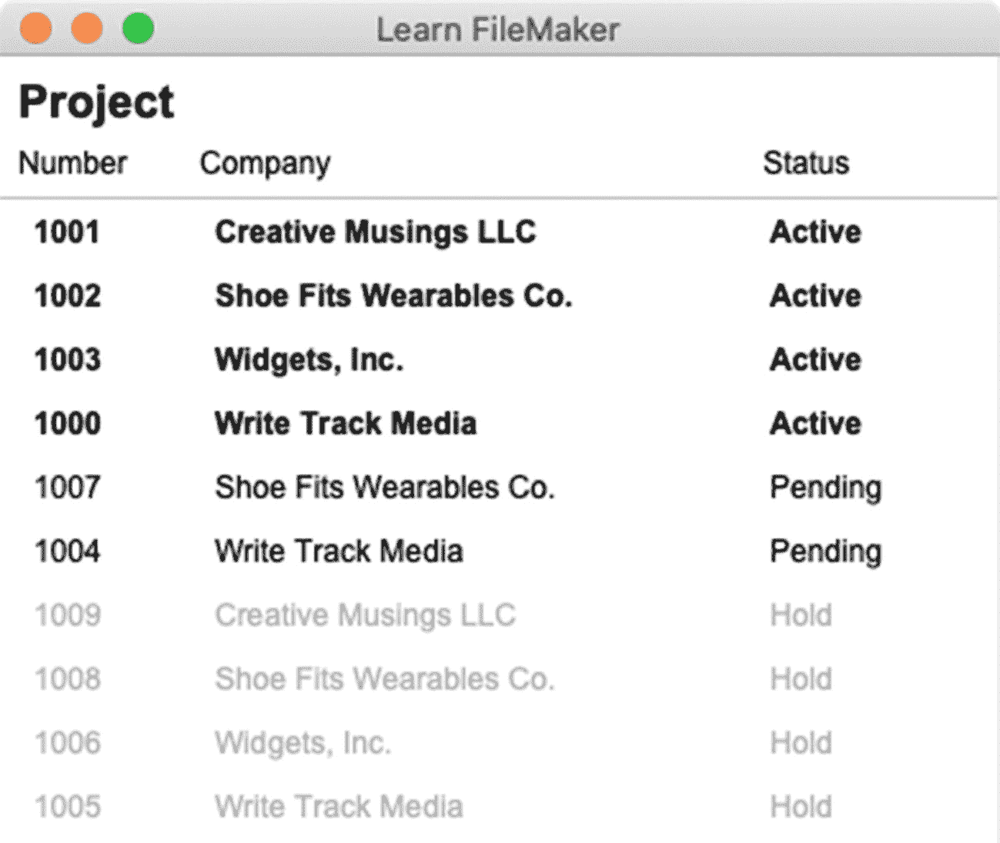

图 21-20 — 列表中基于记录状态进行条件格式设置的字段示例

在此示例中，“*项目状态*”字段被分配了一个包含三个值的值列表：*活动*、*待处理*和*暂停*。由于此字段将根据其自身值进行条件格式设置，因此可以配置两个*基于值的条件*，如图 21-21 所示。当值等于“Active”时，应用粗体格式；当值等于“Hold”时，将文本颜色设置为浅灰色。

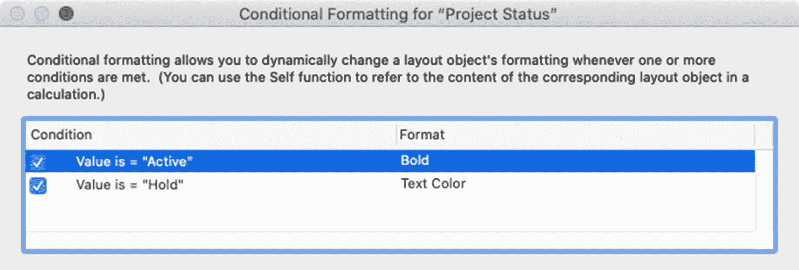

图 21-21 — 已定义的状态字段使用基于值的条件

列表视图中的其他两个字段需要各自配置*基于公式的条件*，因为它们需要查看另一个字段的值（状态字段）来确定其格式。格式设置相同，但具体的条件公式不同，如图 21-22 中“*公司名称*”字段所示。此处的公式在“*项目状态*”字段中查找“Active”或“Hold”，然后应用格式。

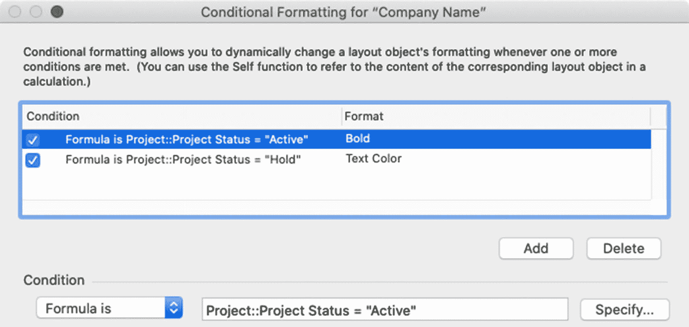

图 21-22 — 列表视图中其他字段的公式驱动条件

## 了解 Tab 键顺序

布局的*Tab 键顺序*定义了当用户按下`Tab`键或为对象定义的其他退出字段键（第 19 章，“行为”）时，从一个对象切换到另一个对象的焦点优先顺序。这使得用户能够仅使用键盘，从一个字段“跳转”到另一个字段，再到对象，再到字段等。默认顺序是从左到右、从上到下遍历所有可以接收焦点的对象。然而，当对象在布局上移动或稍后添加时，需要重置 Tab 键顺序，以避免焦点随意来回跳动。设置自定义顺序时，可以排除不需要数据输入的对象，如计算字段或按钮。

### 更改 Tab 键顺序

在布局模式下，选择“*布局* ➤ *设置 Tab 键顺序*”菜单，将布局置于*Tab 键顺序编辑模式*，如图 21-23 所示。每个能够接收焦点的对象一侧都会附加一个箭头图标。这些箭头包含对象的当前 Tab 键顺序编号，并且是可编辑的文本框。删除对象的编号可将其从 Tab 键顺序中移除。单击空白箭头内部可自动分配 Tab 键顺序中的下一个可用编号，和/或通过直接键入来编辑编号。`FileMaker` 通过在某处键入对象的已分配编号时自动更改该对象的值，来强制实施唯一的编号序列。

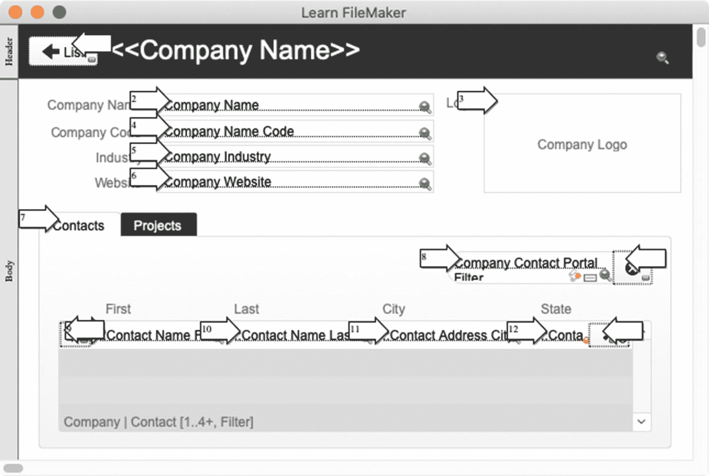

图 21-23 — 处于 Tab 键编辑模式的窗口具有可自定义顺序的箭头字段

### 使用“设置 Tab 键顺序”对话框的功能

当布局进入 Tab 键编辑模式时，图 21-24 所示的“*设置 Tab 键顺序*”对话框会自动打开。此对话框用于执行批量 Tab 键顺序功能，并退出返回到常规布局模式。

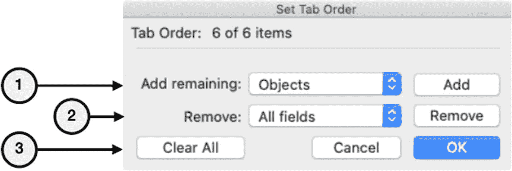

图 21-24 — 用于控制批量 Tab 键顺序功能的对话框

1.  *添加剩余* – 通过在菜单中选择一个选项（*对象*、*仅字段*和*仅按钮*）来为未分配的对象添加默认顺序。然后点击“*添加*”按钮。
2.  *移除* – 通过在菜单中选择一个选项（*所有字段*或*所有按钮*）来从 Tab 键顺序中移除对象。然后点击“*移除*”按钮。
3.  *全部清除* – 删除布局上所有对象的 Tab 键顺序，为重新分配提供一个干净的状态。

> **提示：** 在布局上移动任何对象后，请始终返回浏览模式，并点击浏览各字段以确认 Tab 键顺序符合预期。

