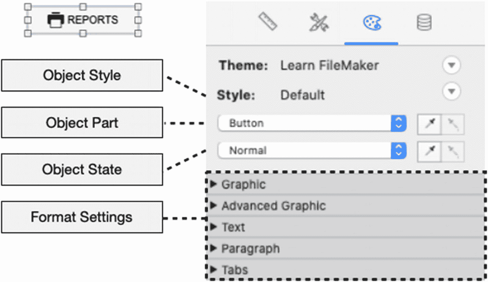
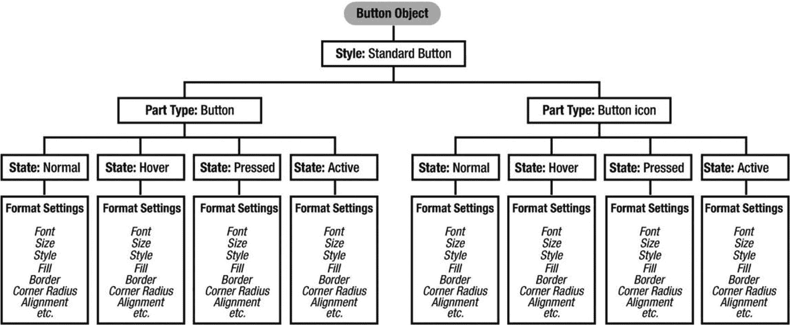
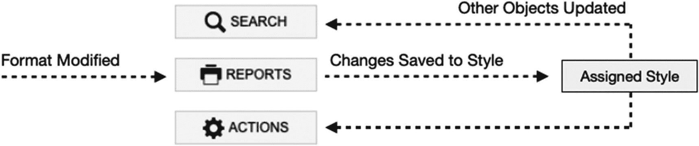
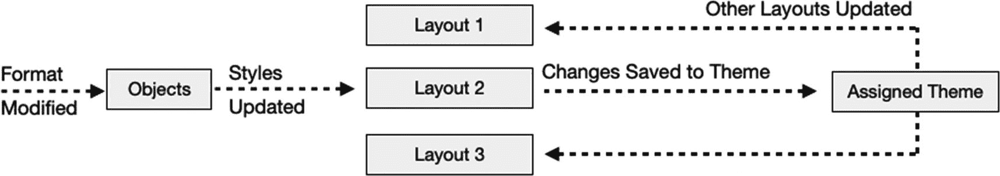
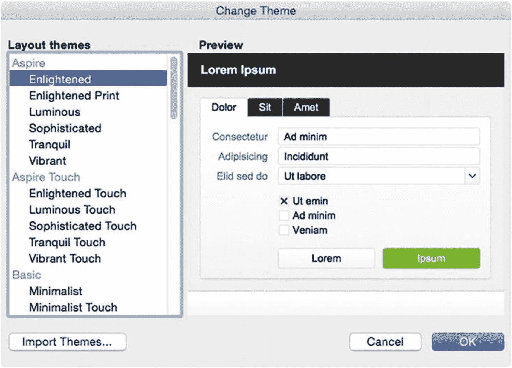
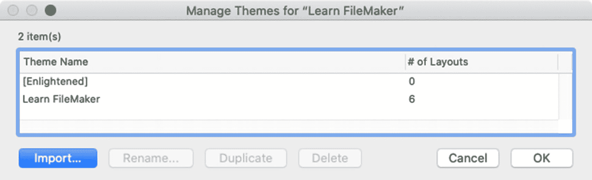

# 22. 使用主题和样式

对象的格式设置可以直接通过`格式`菜单的功能或`检查器`面板的`外观`选项卡应用于对象。然而，与许多流行的打印和设计应用程序一样，FileMaker 允许您保存对象样式定义并将其分组为主题，从而创建更高效的设计工作流程。这使得跨多个布局的相似对象更容易保持一致性，并允许格式化更改立即全局应用。为了提升系统性能，最佳实践也建议使用样式。本章涵盖使用主题和样式的基础知识，包括：

- 剖析样式
- 使用主题
- 使用样式
- 设计自定义主题

## 剖析样式

`样式`是针对特定对象类型的外观设置集合，可通过单一操作应用于新对象。可以为每种对象类型定义一个或多个样式，从而创建设计选项库。适用的设置因对象类型而异，并且只包含与*外观*相关的属性，而非*数据*、*位置*及其他与格式无关的属性。样式可以包括`填充`、`边框`、`圆角半径`、`字体`、`字号`、`字形`、`缩进`、`行高`和`制表符`的设置。

从许多方面来看，FileMaker 中的样式*类似于*文字处理、桌面出版应用程序以及层叠样式表（CSS）中的样式，因为它们能够将格式快速应用于新对象，并便于对现有对象进行全局样式更新。然而，它们也在一些重要方面*有所区别*。首先，样式是开发者用于高效布局设计的机制，用户在浏览模式下编辑字段文本内容时无法使用。FileMaker 没有用户可访问的、适用于内容的样式。用户可以对字段内的文本应用单独的格式更改，但无法批量应用。与 CSS 和桌面出版不同，FileMaker 中的样式是离散的、非层次化的，不能从其他样式继承属性。此外，由于样式应用于交互式界面中的动态对象，它们比基于文本的应用程序中的样式拥有更多维度。一种样式为每个`对象部件`的每个可能的`对象状态`存储一组所有格式设置，形成一个复杂的内部层次结构，如图 22-1 所示。

图 22-1：对象样式层次结构示意图

`对象部件`是对象的一个组件（或对象本身），可以被单独设置样式。一个`按钮`由两个部件组成：`按钮`和`图标`。一个`门户`也由两个部件组成：`门户`和`门户行`。一个`按钮栏`有四个部件：`按钮栏`、`分隔符`、`分段`和`图标`。每个部件针对每个可能的对象状态都有一套格式设置，所有这些都定义在单一风格中。

`对象状态`是对象相对于用户的状态。大多数对象至少具有四种状态。`正常`状态表示对象可见但未处于活跃交互中。`激活`状态表示对象获得了焦点，例如，处于焦点状态的字段或按钮栏的活动分段。另外两种常见状态表示光标与对象的交互：`悬停`和`按下`。某些对象根据其性质还有额外的状态可用，例如，`字段`具有`占位符文本`状态，而`按钮栏分段`具有`非激活`状态。

每个部件-状态组合都可以被分配一组与其他组合不同的格式设置。这使得动态界面设计成为可能，对象的整体外观会根据用户的操作而变化。例如，当用户将光标移到按钮上时，其边框、阴影或文本颜色可以改变，以表明它是一个可以接受鼠标点击的活动元素。同样，当用户点击按钮时，其颜色可以加深，直观地表示按下的动作。部件和状态的组合为给定对象创造了指数级数量的可定义格式设置。例如，一个按钮有*八*组不同的格式设置，对应两个部件的四种状态各一组，如图 22-2 所示。请记住，这展示了一个*单一的样式定义*，该样式可以保存并通过单一操作应用于任意数量的其他按钮。

**图 22-2** 可视化按钮可用的格式设置组数量

样式的创建和修改*通过对象*完成。每个对象类型都以一个*默认*样式开始。当修改对象的格式时，更改会应用于该*对象*，但不会影响已分配的*样式*，而是以*未保存的对象更改*形式保留。要正确使用样式，必须将这些更改明确保存回已分配的样式，或另存为新样式。当保存到现有样式时，这些更改将自动应用于当前布局中分配了该样式的所有其他对象，如图 22-3 所示。

**图 22-3** 格式更改必须保存到样式才能更新其他对象

*主题*是应用于布局的每种对象类型的样式集合。FileMaker 附带了数十个内置主题，有些相当简单，另一些则展示了高级样式功能。这些主题可以不经过修改直接使用，也可以自定义以满足需求，或者完全忽略而采用完全自定义的主题。一个拥有更庞大且更实用样式选择的自定义主题，可以根据您的设计品味和技术要求进行量身定制。

每个布局可以分配一个主题，该主题中的所有样式都可用于分配给对象。在一个文件内，可以使用任意数量的不同主题。但是，为了轻松地在整个解决方案中同步样式更改，建议在每个布局上使用单一主题。正如对*对象*所做的格式更改必须保存回*样式*才能应用于布局上的其他对象一样，对*样式*的更改也必须保存回布局的*主题*才能应用于其他布局上的对象。如果不保存，该布局的主题副本会累积*未保存的样式更改*，使其成为一个个性化的集合，与使用同一主题的其他布局上的样式不匹配。要更新主题，必须将所有更改明确保存回主题，如图 22-4 所示。

**图 22-4** 样式更改必须保存到主题才能更新其他布局

> **注意：** 因为样式和主题更新必须明确保存，请养成在对布局对象进行*任何*格式更改后*立即*保存的习惯。

## 使用主题

FileMaker 会根据几条基本规则为新布局类型确定最佳选项，从而自动为每个新布局分配一个主题。新数据库的默认布局将始终分配*明朗*主题。新的*电脑*布局将始终分配与创建布局时正在查看的布局相同的主题。新的*触控设备*布局将分配*明朗触控*主题，除非正在查看的布局的内置主题具有内置的触控变体。例如，如果正在查看分配了*明亮*主题的布局，则新触控布局将分配*明亮触控*主题。但是，如果正在查看分配了*宇宙*主题的布局，则新触控布局将分配*明朗触控*主题，因为没有可用的触控主题。任何新的*打印机*布局都将分配*明朗打印*主题。创建新布局后，您可以为其分配其他主题。

> **注意：** FileMaker 在确定新布局的最佳默认分配时，不会查看自定义主题名称。尽管您可以创建后缀为*触控*和*打印*的自定义主题，但它们不会按照前面描述的方式被自动选择。

### 更改布局的主题

创建布局后，可以使用*更改主题*对话框更改主题分配，如图 22-5 所示。在布局模式下，可以通过单击工具栏第二行中显示的*主题*名称旁边的图标，并选择*布局*菜单或布局背景的上下文菜单中的*更改主题*来打开此对话框。

**图 22-5** 用于选择当前布局主题分配的对话框

此对话框对可用主题列表进行分类，并已选中分配给当前布局的主题。对话框中没有任何内容可直接编辑。您只能选择一个主题或导入主题以供选择。当选择并分配了不同的主题时，布局上的每个对象都会受到影响，这取决于新主题中可用的样式与旧主题中分配给对象的样式相比如何。如果新主题具有与分配给对象的样式同名的样式，则对象将保留该分配，并使用新主题中该样式的格式设置。样式名称*不*区分大小写，因此任何名称匹配都可生效。分配了在新主题中未找到的样式名称的对象，将被分配新主题中该对象类型的*默认*样式。

在主题切换期间，大部分未保存的格式更改将丢失。某些未保存的文本格式更改（例如文本大小）会在更改主题时保留。为了保留未保存的格式更改，FileMaker 在更改主题后有一个相当巧妙的**两步撤销过程**。在为新布局分配主题后立即执行，第一次使用*撤销*命令将保留新的主题分配，但会恢复因在旧主题中未保存而丢失的对象属性。第二次使用*撤销*将完全将布局恢复到之前的主题。这使您可以尝试性地分配一个新主题，后退半步，然后有机会将之前未保存的更改保存到新分配主题中的新样式或现有样式中，或者完全恢复到旧主题。

> **提示：** 为获得最佳体验，请在设计布局元素后避免更改主题。选择一个主题并在整个数据库中一致地使用它，并不断更新样式更改。

### 管理主题

主题通过*管理主题*对话框进行管理，如图 22-6 所示，可以通过选择*文件 ➤ 管理 ➤ 主题*菜单项打开。当您为布局分配主题时，它们会添加到此对话框中。

**图 22-6** 用于管理主题的对话框

此对话框列出了数据库中文件内曾经在布局上使用过的每个主题，即使它已不再使用。这些主题会一直保留，直到被明确删除。内置主题名称将始终包含在方括号内。*导入*按钮开始从另一个数据库文件复制自定义主题的过程。*重命名*按钮允许为自定义主题分配新名称。内置主题无法重命名，但可以复制以创建新的自定义命名主题。只要主题不在文件中使用，就可以将其删除。

