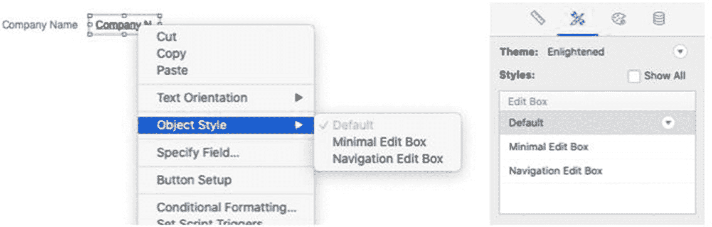
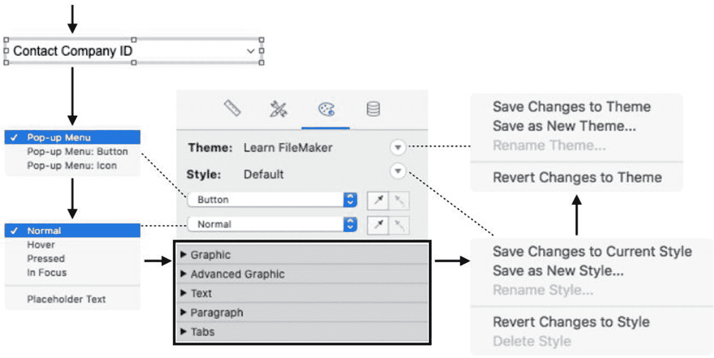

# 使用样式

添加到布局中的每个对象都会自动分配布局主题中类型对应的*默认*样式。默认样式无法重命名或删除，但可以更新修改后的设置，也可以添加全新的自定义样式。通过从对象的上下文菜单中的*对象样式*菜单中选择样式，或从*检查器*窗格的*样式*面板中选择样式（如图 22-7 所示），可以将样式分配给选中的对象。

图 22-7

从对象上下文菜单（左）或检查器（右）中选择样式

## 编辑对象的样式设置

要修改对象的格式并将其保存到样式和主题，请按照图 22-8 所示的步骤操作。首先，选择一个对象，然后点击*检查器*窗格的*外观*选项卡。接着执行以下步骤：*选择部件*、*选择状态*、*编辑任意设置*、*保存到样式*、*保存到布局主题*。

让我们更详细地演示一个示例。首先，从*主题*和*样式*下方的弹出菜单中选择一个*对象部件*。此操作会自动将对象类型显示为整个“部件”，对于由组件层级结构组成的对象，则会列出所有可用的组件部件。例如，当选择了一个*门户*时，列表将包含*门户*和*门户：行*，因为每个部件都可以有不同的格式。在所示的示例中，选择了以*弹出菜单*控件样式格式化的字段，因此有三个部件可用：*弹出菜单*、*弹出菜单：按钮*和*弹出菜单：图标*。

图 22-8

修改对象格式并保存到样式的过程

接下来，选择一个*对象状态*。默认选择始终是代表对象部件静止状态的*正常*。当选择其他状态时，布局上对象的外观会相应改变，以预览基于当前设置下该状态的外观。选择好对象部件和状态后，使用*检查器*中的格式控件开始修改对象的设置。可以任意修改任意部件任意状态的任意设置，直到对象表现符合预期为止。

**提示**

对象部件和状态菜单旁边的吸管图标允许复制和粘贴格式设置，以节省时间。

完成对象格式修改后，*样式*旁边的菜单图标将变为红色，表示存在未保存的*对象*更改。为了保持主题和样式在对象与布局之间的一致性，务必将这些更改保存回样式。点击红色图标以显示操作选项菜单。*还原对样式的更改*选项将消除所有未保存的更改，并将对象恢复到先前保存的设置。*另存为新样式*选项将对象的当前格式设置保存为新样式，然后将其分配给对象，而先前分配的样式保持不变。最后，*保存对当前样式的更改*选项将根据所有未保存的格式设置更新对象的当前样式，然后自动更新布局上所有共享相同样式的对象的格式设置。菜单还包含*重命名*当前样式和*删除*当前样式的选项，删除后对象将恢复为*默认*样式。

样式更改保存后，*主题*旁边的菜单图标将变为红色，表示存在未保存的*样式*更改。点击此图标可显示类似的保存选项菜单。*还原对主题的更改*选项将消除对当前布局上*任何样式*所做的所有未保存更改，将所有对象的每个样式*恢复到最后一次保存到主题的状态。*另存为新主题*选项将所有样式的副本保存到一个新主题中。最后，*保存对主题的更改*选项使用所有已完成的样式更新来更新当前主题，并更新所有共享同一主题的布局上所有对象的格式设置。

  
