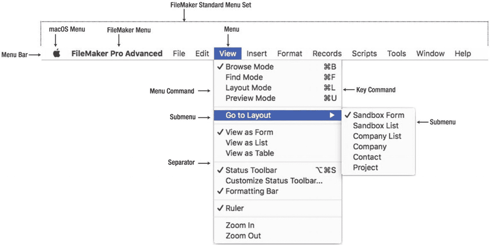
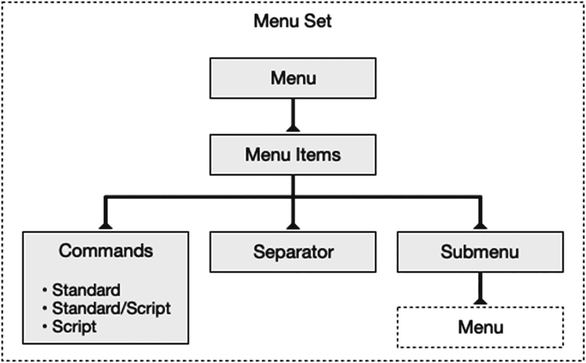
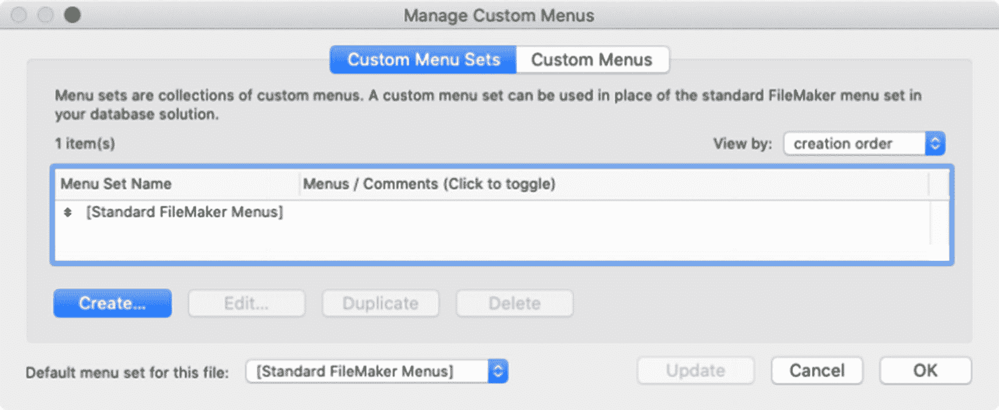
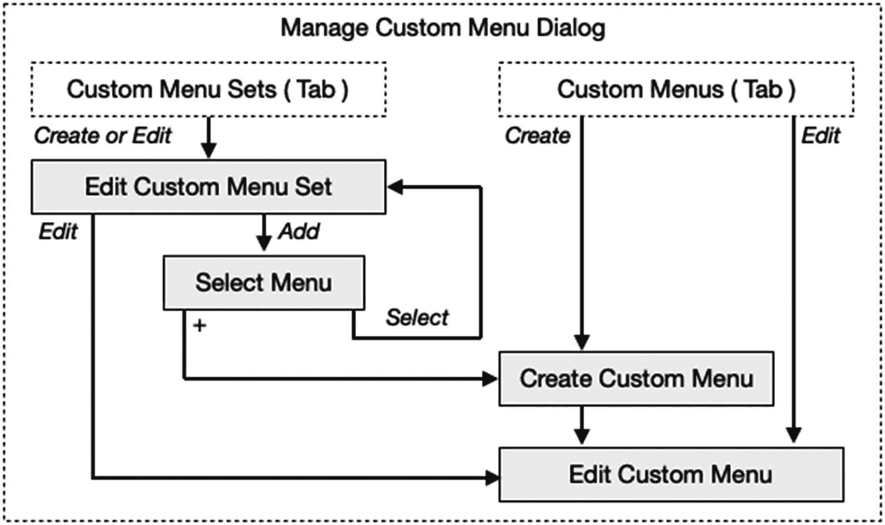
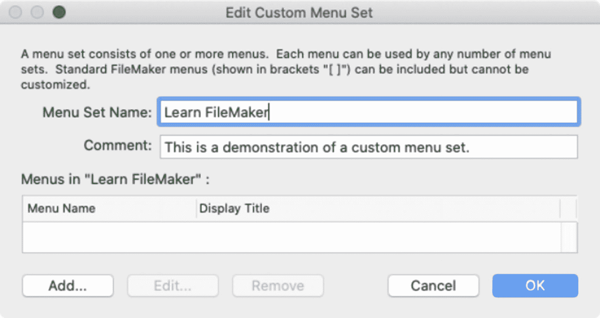
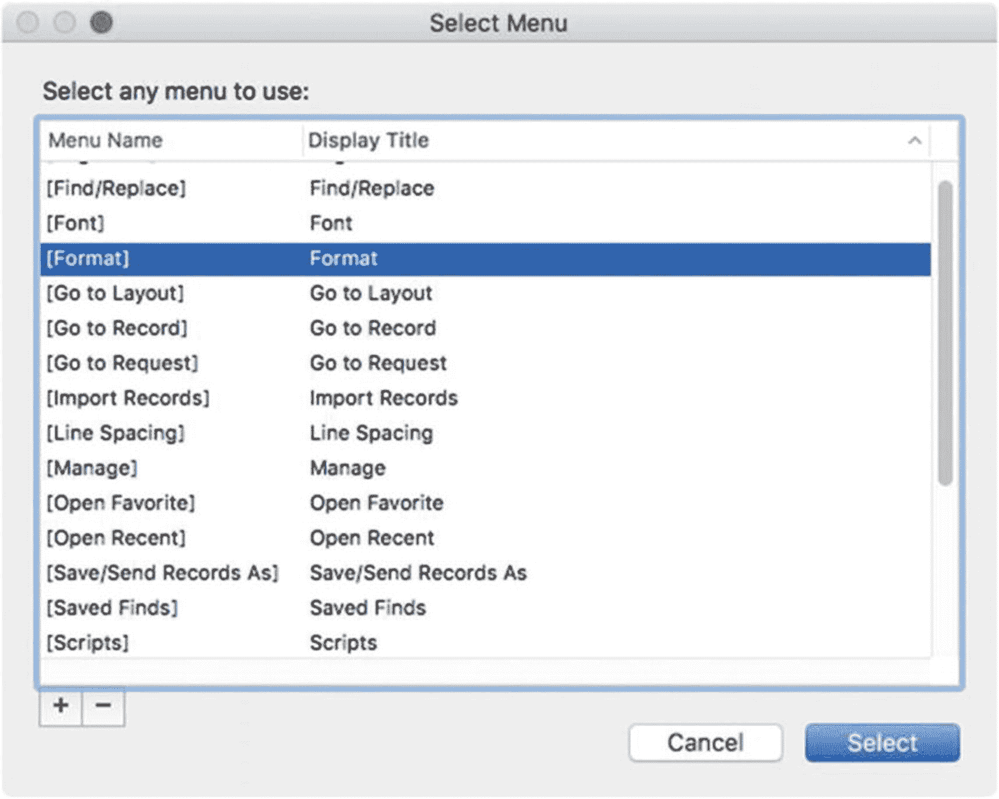
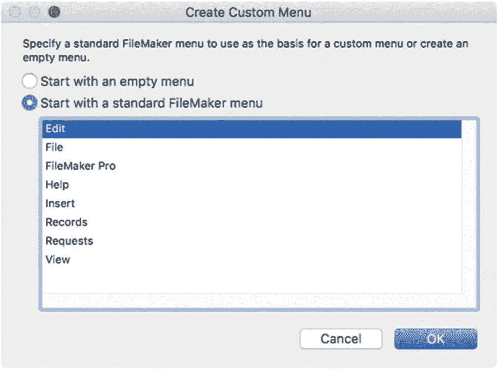
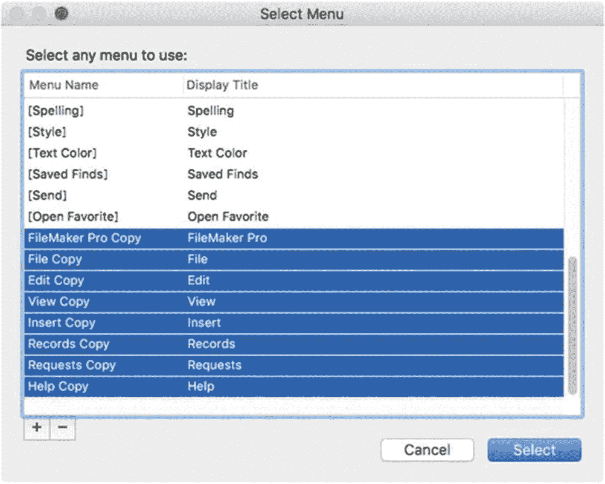
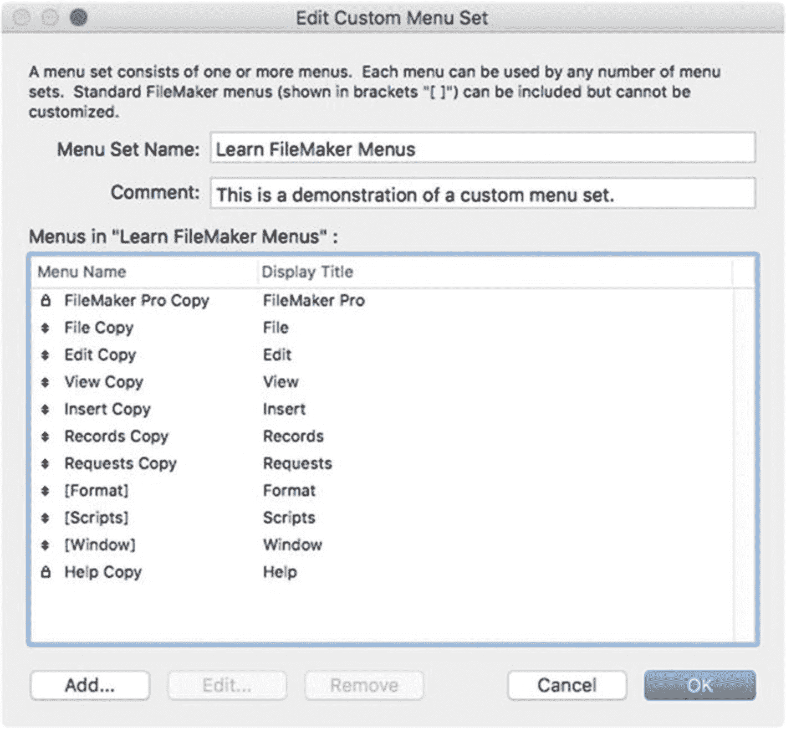
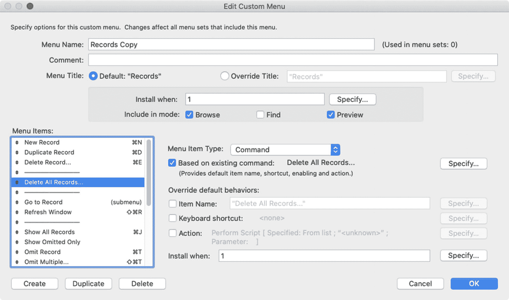

# 自定义菜单基础入门

FileMaker 中的*菜单栏*与任何现代应用程序类似：一条水平条带，位于屏幕顶部（macOS）或数据库窗口顶部（Windows）。数据库始终显示*活动菜单集*，默认为一个不可修改的集合，称为*[标准 FileMaker 菜单]*。开发者可以创建一个或多个附加菜单集，在各种情况下代替标准菜单集进行安装。在深入探讨定制之前，请先回顾菜单的对象和术语，如图 23-1 所示。

图 23-1

菜单组件的术语概览

一个*菜单集*是一个命名的菜单集合，可以安装到菜单栏中，从而成为*活动菜单集*。一个*菜单*包含一组不同类型的项目，如图 23-2 所示。

图 23-2

菜单的层级结构

一旦定义完成，*自定义菜单*可以添加到一个或多个菜单集中。每个菜单可以创建为以下四种类型之一：

-   完全从头创建构建的自定义菜单。
-   三个*不可定制*的标准 FileMaker 菜单及其所有标准菜单项：*格式*、*脚本*和*窗口*。
-   八个标准 FileMaker 菜单，可以按需复制和定制（少数例外）：*FileMaker Pro*、*文件*、*编辑*、*视图*、*插入*、*记录*、*请求*和*帮助*。
-   大约二十多个*标准子菜单*可供选择，可以作为独立的*菜单*附加到菜单集，也可以作为附加到自定义菜单项的子菜单。这些子菜单包括*最近打开*、*导入记录*、*转到布局*、*管理*、*共享*、*显示窗口*等。

一个*菜单项*是添加到菜单中的三种对象类型之一：*命令*、*分隔线*或*子菜单*。

一个*命令项*触发一个功能，可以是标准 FileMaker 命令，也可以是自定义脚本。项目可以完全自定义，拥有独特的名称和脚本功能，或者可以继承标准 FileMaker 命令的部分或全部属性（名称、功能和快捷键命令）。

*分隔线*是一条非功能性的水平线，用于分隔菜单项组，以创建更直观有序的项目组织。

*子菜单*是一个项目，点击后会弹出其下包含的次级菜单选项。子菜单可以嵌套层叠，即一个菜单项可以打开一个子菜单，该子菜单中的某个项目又能打开另一个子菜单，以此类推。每个子菜单首先被定义为一个独立的菜单，然后连接到将打开它的菜单项上。

最多有四个标准菜单永远无法从应用程序中完全移除。即使安装了完全*空*的自定义菜单集，这四个菜单也会保留。在 macOS 电脑上，*Apple* 菜单包含标准的操作系统功能，完全不受自定义菜单集影响，并且无法以任何方式修改。*FileMaker Pro* 应用程序菜单和*帮助*菜单始终位于菜单栏的两侧，无论它们是否出现在自定义菜单集中。当在偏好设置中启用*高级工具*时（第 2 章），*工具*菜单可见，并且这些菜单完全无法修改。

## 探索管理自定义菜单对话框

自定义菜单在*管理自定义菜单*对话框中定义，可以通过选择*管理自定义菜单*选项来打开，该选项在三个地方可用：*文件 ➤ 管理*菜单、*工具 ➤ 自定义菜单*菜单以及*布局设置*对话框*常规*选项卡中的*菜单集*弹出菜单。该对话框有两个选项卡，如图 23-3 所示：*自定义菜单集*和*自定义菜单*。

图 23-3

用于定义自定义菜单的对话框

*自定义菜单集*选项卡列出了文件中定义的所有菜单集。默认的标准菜单集会包含在内，且无法移除。在此对话框中，可以*创建*、*编辑*、*复制*和*删除*新的菜单集。

*自定义菜单*选项卡显示所有已定义自定义菜单的列表，并带有类似的修改按钮。在您开始创建菜单之前，此列表为空。任何已定义的自定义菜单均可用于连接到自定义菜单集。

这两个对话框之间的功能交集令人困惑，可能会让人望而生畏，并可能劝阻新手开发者。然而，考虑到为高级数据库提供完全自定义菜单系统的好处，值得花力气去理解其工作原理，如图 23-4 所示。虽然一开始令人困惑，但这提供了本稍后将要描述的对话框和功能的概览。

从*自定义菜单集*选项卡中，当您创建或编辑一个菜单集时，会打开*编辑自定义菜单集*对话框，列出已分配给该菜单集的菜单。可以在此处选择并编辑某个菜单，打开*编辑自定义菜单*对话框，或者点击*添加*按钮在此处添加新菜单，该按钮会打开*选择菜单*对话框。此对话框列出了所有标准的 FileMaker 子菜单以及已创建的任何自定义菜单。选择一个以将其添加到菜单集，或点击加号按钮打开*创建自定义菜单*对话框以创建一个新菜单，该菜单将被添加。

从*自定义菜单*选项卡中，点击*创建*会打开*创建自定义菜单*对话框，该对话框提供了基于标准菜单创建新菜单或从头创建一个空菜单的选项。一旦做出选择，*编辑自定义菜单*对话框便会打开。

图 23-4

自定义菜单对话框略显混乱的交集

## 创建自定义菜单集

通过打开*管理自定义菜单*对话框并点击*自定义菜单集*选项卡，开始创建一个新的菜单集。点击*创建*按钮，在*编辑自定义菜单集*对话框中打开一个新的空菜单集，如图 23-5 所示。为菜单集输入一个名称，并可选输入开发者注释。

图 23-5

用于创建新自定义菜单集的对话框

好的，作为高级文档工程师和翻译员，我将严格遵循注意事项和示例格式，将给定的英文文本翻译成中文。

### 添加标准 FileMaker 菜单的副本

将每个标准 FileMaker 菜单的一个副本添加到 `Learn FileMaker Menus` 菜单集中。首先，点击 `Add` 按钮打开 `Select Menu` 对话框，如图 23-6 所示。

图 23-6

用于选择可用的标准菜单和自定义菜单的对话框

此对话框列出了所有可添加到自定义菜单集中的可用菜单。在创建自定义菜单之前，此对话框只会列出标准子菜单。按住 `Command`（macOS）或 `Windows`（Windows）键以允许多选，然后点击列表中的三个标准菜单：`[Format]`、`[Scripts]` 和 `[Window]`。选定后，点击 `Select` 按钮，将这三个选定的菜单添加到自定义菜单集中。要添加其余标准菜单到菜单集中，需再次点击 `Edit Custom Menu Set` 对话框上的 `Add` 按钮，然后点击前一个 `Select Menu` 对话框中的 `+` 按钮，为每个菜单创建一个副本。这将打开 `Create Custom Menu` 对话框，如图 23-7 所示。

图 23-7

`Create Custom Menu` 对话框用于创建新菜单

此对话框为我们正在添加的菜单提供了两个选项：`Start with an empty menu`（从空菜单开始）创建一个没有菜单项的新未命名菜单；`Start with a standard FileMaker menu`（从标准 FileMaker 菜单开始）创建所选标准 FileMaker 菜单的一个副本，该副本稍后可进行自定义。现在，逐一列出并选择八个标准菜单，点击“确定”来添加它们。每个副本都会被创建并在 `Edit Custom Menu` 对话框中打开。暂时，只需在该对话框中点击“确定”，以默认状态保存新的菜单副本。完成后，`Select Menu` 对话框应包含全部八个标准菜单副本的列表，如图 23-8 所示。

图 23-8

创建每个标准 FileMaker 菜单副本后的对话框

这些副本现在已作为自定义菜单添加到数据库中，但仍需添加到自定义菜单集中。按住 `Command`（macOS）或 `Windows`（Windows）键，选择所有八个标准菜单副本，然后点击 `Select` 按钮。这将返回到 `Edit Custom Menu Set` 对话框，显示我们已添加的所有 11 个菜单的列表，如图 23-9 所示。

图 23-9

新的自定义菜单集

菜单可以在列表中通过拖拽排列，但有两个例外：`FileMaker Pro` 菜单将锁定为列表中的第一个，而 `Help` 菜单将锁定为列表中的最后一个。当菜单按所需顺序排列后，点击“确定”保存更改，并关闭 `Edit Custom Menu Set` 对话框。然后点击“确定”关闭 `Manage Custom Menus` 对话框。现在，您可以通过从 `Tools ➤ Custom Menus` 菜单中选择当前布局来自动安装自定义菜单集（有关安装的更多信息，请参阅本章后续内容）。当自定义菜单集在此菜单中的名称旁边出现一个复选标记时，表示它已安装。由于我们创建的自定义集只是标准 FileMaker 菜单集的副本，您应该不会注意到当前菜单与标准 FileMaker 菜单有任何差异。接下来，我们可以开始自定义新的菜单集。

## 自定义菜单项

无论是编辑标准菜单项还是配置新的空菜单项，自定义菜单的过程本质上是相同的：在 `Edit Custom Menu` 对话框中打开它，然后修改设置、编辑菜单项或添加新项目。

### 探索“编辑自定义菜单”对话框

配置菜单并定义其包含的菜单项是在 `Edit Custom Menu` 对话框中完成的，如图 23-10 所示。当创建新自定义菜单时，此对话框会自动打开，并且可以从 `Manage Custom Menus` 对话框的任一个选项卡中打开。从 `Custom Menus` 选项卡中，选择一个菜单，然后点击 `Edit` 按钮或直接双击该菜单。从 `Custom Menu Sets` 选项卡中，选择一个菜单集并点击 `Edit` 按钮或直接双击该菜单集。然后选择一个菜单并点击 `Edit` 按钮或直接双击该菜单。对话框顶部包含菜单配置控件，而底部区域包含菜单项的列表。在此处，可以创建、复制、删除菜单项，或自定义其属性和行为。

图 23-10

用于配置菜单及其定义项的对话框

#### 配置菜单设置

`Menu Name`（菜单名称）接受最多 100 个字符的自定义菜单名称。此名称仅在编程界面中可见，不一定是菜单栏中显示的标题。如果您正在跟随操作，请花点时间重命名自定义菜单，删除将标准菜单复制到自定义集时添加的“Copy（副本）”后缀。

`Comment`（注释）字段用于存储供开发人员使用的菜单描述，最多 30,000 个字符。

`Menu Title`（菜单标题）控制菜单在菜单栏中显示时的名称。如果该菜单是标准 FileMaker 菜单的副本，则会提供一个 `Default`（默认）选项，使用标准名称。若要覆盖此名称或为自定义菜单输入名称，`Override Title`（覆盖标题）选项包含一个字段和一个 `Specify`（指定）按钮，允许输入静态名称或用于计算名称的公式。自定义菜单名称最多可达 30,000 个字符；但是，由于屏幕尺寸限制以及人类感知的特性，最好将每个菜单名称限制在一个单词内。

使用协同工作的两组控件之一来控制菜单何时安装到菜单栏中。`Install when`（何时安装）设置允许通过一个返回布尔值的公式来控制菜单何时安装，静态默认值为真（1）。`Include in mode`（包含在模式中）复选框根据窗口模式应用该公式。例如，取消勾选 `Find`（查找）以在查找模式下隐藏菜单。

