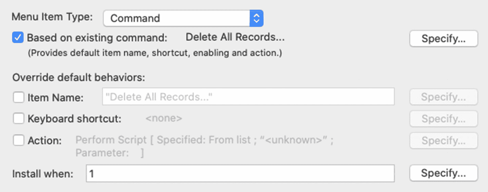
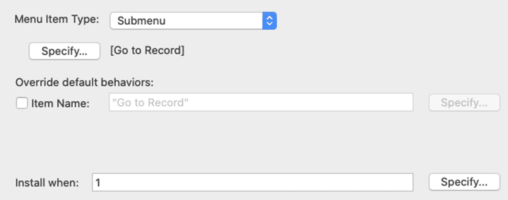

# 探索菜单项设置

菜单项列表右侧的设置会根据所选菜单项的类型而变化：`command`（命令）、`submenu`（子菜单）和 `separator`（分隔符）。每种类型都有一个共同设置：一个`Install when`（何时安装）文本区域，其工作原理与前面菜单描述相同，允许通过公式控制菜单项在菜单中显示的时机。对于`separators`（分隔符），这是唯一可用的选项。

## 定义命令设置

`Command`（命令）菜单项的可用设置如图 23-11 所示。

图 23-11  
定义命令菜单项的设置

如果该项的功能是现有的 FileMaker 命令（带或不带覆盖），则可以启用`Based on existing command`（基于现有命令）。首次启用该复选框时，会打开一个`Specify FileMaker Command`（指定 FileMaker 命令）对话框，但之后可通过`Specify`（指定）按钮再次打开。该对话框列出了所有可用的命令，以便选择并将其分配给菜单项。关于即使菜单项执行自定义脚本时也基于命令的好处，请参见本章后面的"探索命令与菜单之间的联系"部分。下方的三个复选框为基于菜单时的默认行为（或未基于菜单时的自定义设置）提供了覆盖控制。

首先，启用`Item Name`（项目名称）复选框以覆盖默认命令名称，或为自定义项输入名称。名称应为简短、面向操作的陈述句，清晰描述所执行的功能。例如，"打印销售报表"和"发送提案请求"可能是好名称，而"发送到会计部"则未说明发送内容，"获取批准"也未明确正在执行的操作。

`Keyboard shortcut`（键盘快捷键）复选框将覆盖标准菜单项的默认键盘快捷键，或为自定义项建立快捷键。首次勾选此框或单击旁边的`Specify`（指定）按钮时，会显示一个`Specify Shortcut`（指定快捷键）对话框。在此对话框打开的状态下，输入的任何按键组合都将被捕获为该菜单项的快捷键。请务必避免使用预留用于操作系统功能或仍在使用中的标准 FileMaker 菜单的键盘组合。

最后，`Action`（操作）复选框允许将自定义脚本或单个脚本步骤分配为菜单项的功能。

## 定义子菜单设置

`Submenu`（子菜单）项的可用设置如图 23-12 所示。`Specify`（指定）按钮会打开一个`Select Menu`（选择菜单）对话框，允许将任何标准子菜单或自定义菜单分配为正在编辑的菜单项的子菜单。`Item Name`（项目名称）复选框及字段允许为子菜单输入自定义名称，以覆盖上方所选菜单的名称。

图 23-12  
定义子菜单的设置

